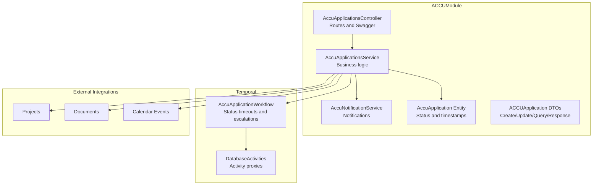
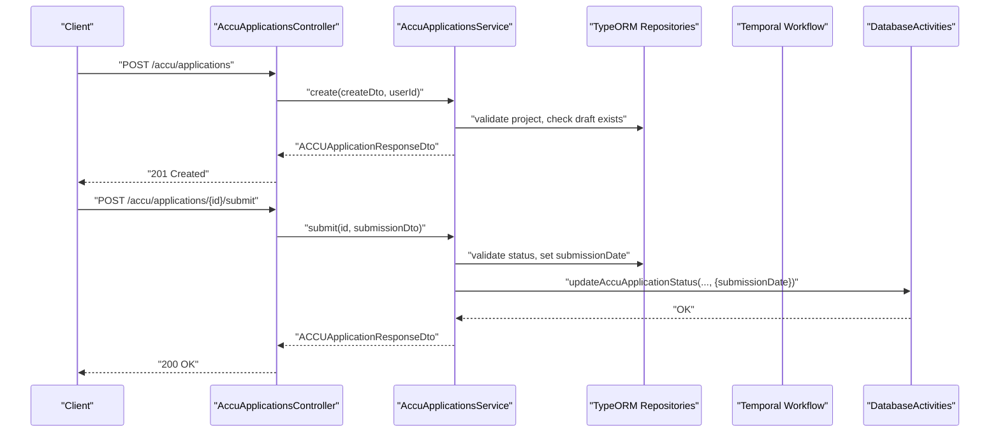
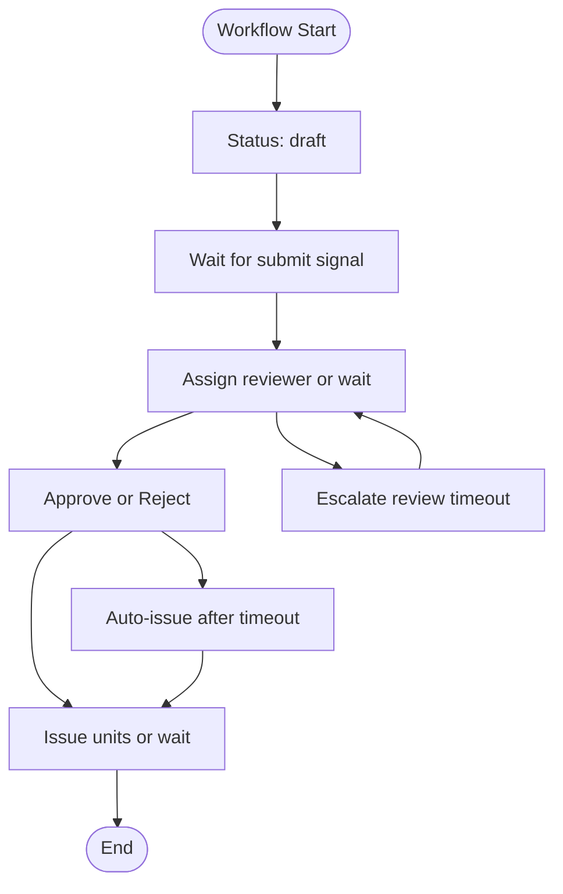
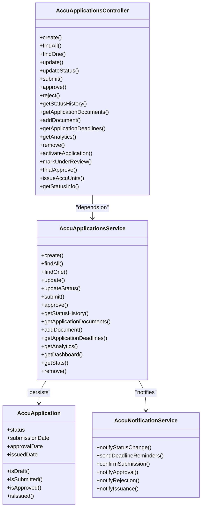

# ACCU Applications API

<cite>
**Referenced Files in This Document**
- [accu-application.entity.ts](file://apps/backend/src/entities/accu-application.entity.ts)
- [accu-application.dto.ts](file://apps/backend/src/modules/accu/dto/accu-application.dto.ts)
- [accu-applications.controller.ts](file://apps/backend/src/modules/accu/accu-applications.controller.ts)
- [accu-applications.service.ts](file://apps/backend/src/modules/accu/accu-applications.service.ts)
- [accu-notification.service.ts](file://apps/backend/src/modules/accu/accu-notification.service.ts)
- [accu-application-workflows.ts](file://apps/backend/src/modules/temporal/workflows/accu-application/accu-application-workflows.ts)
- [database-activities.ts](file://apps/backend/src/modules/temporal/activities/database-activities.ts)
- [accu.module.ts](file://apps/backend/src/modules/accu/accu.module.ts)
- [README.md](file://README.md)
- [accu-application-lifecycle.e2e.test.ts](file://apps/backend/test/e2e/accu-application-lifecycle.e2e.test.ts)
</cite>

## Table of Contents
1. [Introduction](#introduction)
2. [Project Structure](#project-structure)
3. [Core Components](#core-components)
4. [Architecture Overview](#architecture-overview)
5. [Detailed Component Analysis](#detailed-component-analysis)
6. [Dependency Analysis](#dependency-analysis)
7. [Performance Considerations](#performance-considerations)
8. [Troubleshooting Guide](#troubleshooting-guide)
9. [Conclusion](#conclusion)
10. [Appendices](#appendices)

## Introduction
This document provides comprehensive API documentation for the ACCU Applications module. It covers the full lifecycle of ACCU applications: draft creation, submission, review, approval/rejection, and issuance. It specifies HTTP methods, URL patterns, authentication requirements (JWT with roles), request/response schemas using the provided DTOs, and status transition rules. It also explains integration points with Projects, Documents, and Temporal workflows, and documents how the 90-day rule is enforced through API logic and temporal workflows. Finally, it addresses common issues such as incomplete application data, unauthorized state transitions, and integration failures with external systems.

## Project Structure
The ACCU Applications module is implemented as a NestJS controller and service with supporting DTOs, entities, and Temporal workflows. The module integrates with TypeORM repositories for persistence, Swagger for API documentation, and a notification service for lifecycle events.

**Diagram sources**
- [accu.module.ts](file://apps/backend/src/modules/accu/accu.module.ts#L1-L28)
- [accu-applications.controller.ts](file://apps/backend/src/modules/accu/accu-applications.controller.ts#L1-L120)
- [accu-applications.service.ts](file://apps/backend/src/modules/accu/accu-applications.service.ts#L1-L120)
- [accu-application-workflows.ts](file://apps/backend/src/modules/temporal/workflows/accu-application/accu-application-workflows.ts#L1-L120)
- [database-activities.ts](file://apps/backend/src/modules/temporal/activities/database-activities.ts#L1-L27)

**Section sources**
- [accu.module.ts](file://apps/backend/src/modules/accu/accu.module.ts#L1-L28)
- [README.md](file://README.md#L38-L60)

## Core Components
- Controller: Exposes REST endpoints for CRUD, status transitions, submission, approval/rejection, document linking, deadlines, analytics, and convenience helpers.
- Service: Implements business logic, validation, status transitions, notifications, and integration with Projects, Documents, and Calendar.
- DTOs: Strongly typed request/response schemas for create, update, query, submission, approval, history, analytics, and dashboard.
- Entity: Defines ACCU application status enum and timestamps.
- Temporal Workflow: Orchestrates status transitions, enforces timeouts, and escalations for review, approval, and issuance.

**Section sources**
- [accu-applications.controller.ts](file://apps/backend/src/modules/accu/accu-applications.controller.ts#L1-L120)
- [accu-applications.service.ts](file://apps/backend/src/modules/accu/accu-applications.service.ts#L1-L120)
- [accu-application.dto.ts](file://apps/backend/src/modules/accu/dto/accu-application.dto.ts#L1-L120)
- [accu-application.entity.ts](file://apps/backend/src/entities/accu-application.entity.ts#L1-L86)
- [accu-application-workflows.ts](file://apps/backend/src/modules/temporal/workflows/accu-application/accu-application-workflows.ts#L1-L120)

## Architecture Overview
The API follows a layered architecture:
- Authentication: JWT bearer token via Passport guards.
- Authorization: Role-based access control (RBAC) with permission checks.
- Controller: Exposes endpoints with Swagger metadata.
- Service: Encapsulates business rules, validations, and integrations.
- Persistence: TypeORM repositories for applications, projects, documents, calendar events, and notifications.
- Notifications: Built-in notification service emits lifecycle events.
- Temporal: Workflow engine manages status timeouts and escalations.

**Diagram sources**
- [accu-applications.controller.ts](file://apps/backend/src/modules/accu/accu-applications.controller.ts#L170-L210)
- [accu-applications.service.ts](file://apps/backend/src/modules/accu/accu-applications.service.ts#L377-L423)
- [database-activities.ts](file://apps/backend/src/modules/temporal/activities/database-activities.ts#L1-L27)
- [accu-application-workflows.ts](file://apps/backend/src/modules/temporal/workflows/accu-application/accu-application-workflows.ts#L120-L170)

## Detailed Component Analysis

### Authentication and Authorization
- Authentication: JWT bearer token required for all endpoints.
- Roles: Endpoints require specific roles (admin, super_admin, manager, user).
- Permissions: Fine-grained permissions for read/write/delete operations on ACCU applications and related resources.

**Section sources**
- [accu-applications.controller.ts](file://apps/backend/src/modules/accu/accu-applications.controller.ts#L52-L60)
- [accu-applications.controller.ts](file://apps/backend/src/modules/accu/accu-applications.controller.ts#L116-L149)

### Endpoints and Schemas

#### Base Path
- Base URL: /accu/applications

#### Create Application
- Method: POST
- URL: /accu/applications
- Auth: JWT + Roles(user, manager, admin, super_admin) + Permission(ACCU_APPLICATIONS_WRITE)
- Request body: ACCUApplicationCreateDto
- Response: ACCUApplicationResponseDto
- Validation:
  - Project existence and active status
  - No existing draft for the same project
  - Methodology requirements validated
- Errors: 400 (invalid data), 404 (project not found), 409 (draft already exists)

**Section sources**
- [accu-applications.controller.ts](file://apps/backend/src/modules/accu/accu-applications.controller.ts#L58-L73)
- [accu-applications.service.ts](file://apps/backend/src/modules/accu/accu-applications.service.ts#L66-L131)
- [accu-application.dto.ts](file://apps/backend/src/modules/accu/dto/accu-application.dto.ts#L58-L89)

#### List Applications
- Method: GET
- URL: /accu/applications
- Auth: JWT + Roles(user, manager, admin, super_admin) + Permission(ACCU_APPLICATIONS_READ)
- Query params: ACCUApplicationQueryDto (pagination, search, filters, sort)
- Response: ACCUApplicationsPaginatedResponseDto

**Section sources**
- [accu-applications.controller.ts](file://apps/backend/src/modules/accu/accu-applications.controller.ts#L75-L86)
- [accu-applications.service.ts](file://apps/backend/src/modules/accu/accu-applications.service.ts#L133-L234)
- [accu-application.dto.ts](file://apps/backend/src/modules/accu/dto/accu-application.dto.ts#L194-L262)

#### Dashboard
- Method: GET
- URL: /accu/applications/dashboard
- Auth: JWT + Roles(user, manager, admin, super_admin) + Permission(ACCU_APPLICATIONS_READ)
- Query: tenantId (optional)
- Response: ACCUApplicationDashboardDto

**Section sources**
- [accu-applications.controller.ts](file://apps/backend/src/modules/accu/accu-applications.controller.ts#L88-L100)
- [accu-applications.service.ts](file://apps/backend/src/modules/accu/accu-applications.service.ts#L648-L721)

#### Stats
- Method: GET
- URL: /accu/applications/stats
- Auth: JWT + Roles(manager, admin, super_admin) + Permission(ACCU_APPLICATIONS_READ)
- Query: tenantId (optional)
- Response: ACCUApplicationStatsDto

**Section sources**
- [accu-applications.controller.ts](file://apps/backend/src/modules/accu/accu-applications.controller.ts#L102-L114)
- [accu-applications.service.ts](file://apps/backend/src/modules/accu/accu-applications.service.ts#L723-L784)

#### Get Application by ID
- Method: GET
- URL: /accu/applications/:id
- Auth: JWT + Roles(user, manager, admin, super_admin) + Permission(ACCU_APPLICATIONS_READ)
- Path param: id (UUID)
- Response: ACCUApplicationResponseDto

**Section sources**
- [accu-applications.controller.ts](file://apps/backend/src/modules/accu/accu-applications.controller.ts#L116-L129)
- [accu-applications.service.ts](file://apps/backend/src/modules/accu/accu-applications.service.ts#L236-L258)

#### Update Application
- Method: PUT
- URL: /accu/applications/:id
- Auth: JWT + Roles(user, manager, admin, super_admin) + Permission(ACCU_APPLICATIONS_WRITE)
- Path param: id (UUID)
- Request body: ACCUApplicationUpdateDto
- Response: ACCUApplicationResponseDto
- Constraints: Only draft applications can be updated

**Section sources**
- [accu-applications.controller.ts](file://apps/backend/src/modules/accu/accu-applications.controller.ts#L131-L149)
- [accu-applications.service.ts](file://apps/backend/src/modules/accu/accu-applications.service.ts#L260-L299)

#### Update Status
- Method: PATCH
- URL: /accu/applications/:id/status
- Auth: JWT + Roles(user, manager, admin, super_admin) + Permission(ACCU_APPLICATIONS_WRITE)
- Path param: id (UUID)
- Request body: ACCUApplicationStatusDto
- Response: ACCUApplicationResponseDto
- Constraints: Validates allowed transitions and sets submission/approval/issued dates

**Section sources**
- [accu-applications.controller.ts](file://apps/backend/src/modules/accu/accu-applications.controller.ts#L151-L169)
- [accu-applications.service.ts](file://apps/backend/src/modules/accu/accu-applications.service.ts#L301-L375)

#### Submit Application
- Method: POST
- URL: /accu/applications/:id/submit
- Auth: JWT + Roles(user, manager, admin, super_admin) + Permission(ACCU_APPLICATIONS_WRITE)
- Path param: id (UUID)
- Request body: ACCUApplicationSubmissionDto
- Response: ACCUApplicationResponseDto
- Constraints: Only draft applications can be submitted; validates submission requirements; creates calendar deadline event if provided

**Section sources**
- [accu-applications.controller.ts](file://apps/backend/src/modules/accu/accu-applications.controller.ts#L171-L189)
- [accu-applications.service.ts](file://apps/backend/src/modules/accu/accu-applications.service.ts#L377-L423)

#### Approve/Reject Application
- Method: POST
- URL: /accu/applications/:id/approve
- Auth: JWT + Roles(manager, admin, super_admin) + Permission(ACCU_APPLICATIONS_WRITE)
- Path param: id (UUID)
- Request body: ACCUApplicationApprovalDto
- Response: ACCUApplicationResponseDto
- Constraints: Only submitted or under review applications can be approved/rejected; sets approval date; adjusts approved units if provided

**Section sources**
- [accu-applications.controller.ts](file://apps/backend/src/modules/accu/accu-applications.controller.ts#L191-L209)
- [accu-applications.service.ts](file://apps/backend/src/modules/accu/accu-applications.service.ts#L425-L489)

#### Reject Application (Alternative Endpoint)
- Method: POST
- URL: /accu/applications/:id/reject
- Auth: JWT + Roles(manager, admin, super_admin) + Permission(ACCU_APPLICATIONS_WRITE)
- Path param: id (UUID)
- Request body: { reason: string, notes?: string }
- Response: ACCUApplicationResponseDto

**Section sources**
- [accu-applications.controller.ts](file://apps/backend/src/modules/accu/accu-applications.controller.ts#L211-L242)
- [accu-applications.service.ts](file://apps/backend/src/modules/accu/accu-applications.service.ts#L425-L489)

#### Get Status History
- Method: GET
- URL: /accu/applications/:id/history
- Auth: JWT + Roles(user, manager, admin, super_admin) + Permission(ACCU_APPLICATIONS_READ)
- Path param: id (UUID)
- Response: [ACCUApplicationHistoryDto]

**Section sources**
- [accu-applications.controller.ts](file://apps/backend/src/modules/accu/accu-applications.controller.ts#L244-L257)
- [accu-applications.service.ts](file://apps/backend/src/modules/accu/accu-applications.service.ts#L491-L520)

#### Get Application Documents
- Method: GET
- URL: /accu/applications/:id/documents
- Auth: JWT + Roles(user, manager, admin, super_admin) + Permissions(DOCUMENTS_READ)
- Path param: id (UUID)
- Response: [Document]

**Section sources**
- [accu-applications.controller.ts](file://apps/backend/src/modules/accu/accu-applications.controller.ts#L259-L270)
- [accu-applications.service.ts](file://apps/backend/src/modules/accu/accu-applications.service.ts#L521-L539)

#### Add Document to Application
- Method: POST
- URL: /accu/applications/:id/documents
- Auth: JWT + Roles(user, manager, admin, super_admin) + Permissions(DOCUMENTS_WRITE)
- Path param: id (UUID)
- Request body: ACCUApplicationDocumentDto
- Response: 201 Created (message)

**Section sources**
- [accu-applications.controller.ts](file://apps/backend/src/modules/accu/accu-applications.controller.ts#L274-L293)
- [accu-applications.service.ts](file://apps/backend/src/modules/accu/accu-applications.service.ts#L540-L571)

#### Get Application Deadlines
- Method: GET
- URL: /accu/applications/:id/deadlines
- Auth: JWT + Roles(user, manager, admin, super_admin) + Permission(ACCU_APPLICATIONS_READ)
- Path param: id (UUID)
- Response: [ACCUApplicationDeadlineDto]

**Section sources**
- [accu-applications.controller.ts](file://apps/backend/src/modules/accu/accu-applications.controller.ts#L294-L308)
- [accu-applications.service.ts](file://apps/backend/src/modules/accu/accu-applications.service.ts#L572-L604)

#### Get Application Analytics
- Method: GET
- URL: /accu/applications/:id/analytics
- Auth: JWT + Roles(user, manager, admin, super_admin) + Permission(ACCU_APPLICATIONS_READ)
- Path param: id (UUID)
- Response: ACCUApplicationAnalyticsDto

**Section sources**
- [accu-applications.controller.ts](file://apps/backend/src/modules/accu/accu-applications.controller.ts#L309-L320)
- [accu-applications.service.ts](file://apps/backend/src/modules/accu/accu-applications.service.ts#L606-L646)

#### Delete Application
- Method: DELETE
- URL: /accu/applications/:id
- Auth: JWT + Roles(manager, admin, super_admin) + Permission(ACCU_APPLICATIONS_DELETE)
- Path param: id (UUID)
- Response: 204 No Content
- Constraints: Only draft applications can be deleted

**Section sources**
- [accu-applications.controller.ts](file://apps/backend/src/modules/accu/accu-applications.controller.ts#L324-L336)
- [accu-applications.service.ts](file://apps/backend/src/modules/accu/accu-applications.service.ts#L786-L800)

#### Convenience Endpoints
- Activate/Submit: PATCH /accu/applications/:id/activate
- Mark Under Review: PATCH /accu/applications/:id/under-review
- Final Approval: PATCH /accu/applications/:id/final-approve
- Issue Units: PATCH /accu/applications/:id/issue
- Status Info: GET /accu/applications/:id/status-info

**Section sources**
- [accu-applications.controller.ts](file://apps/backend/src/modules/accu/accu-applications.controller.ts#L337-L431)
- [accu-applications.controller.ts](file://apps/backend/src/modules/accu/accu-applications.controller.ts#L432-L505)

### Request/Response Schemas
- ACCUApplicationCreateDto: projectId, accuUnits, methodologyId, serReference (optional), applicationData, tenantId (optional)
- ACCUApplicationUpdateDto: accuUnits (optional), methodologyId (optional), serReference (optional), applicationData (optional), metadata (optional)
- ACCUApplicationSubmissionDto: submissionNotes (optional), contactPerson (optional), deadline (optional)
- ACCUApplicationApprovalDto: approved (boolean), reason (optional), approvedUnits (optional), reviewerComments (optional), nextSteps (optional)
- ACCUApplicationQueryDto: pagination, search, status, projectId, methodologyId, tenantId, submissionDateFrom/To, approvalDateFrom/To, sortBy, sortOrder
- ACCUApplicationResponseDto: id, status, submissionDate/approvalDate/issuedDate (optional), accuUnits, methodologyId, serReference (optional), applicationData, metadata (optional), project, tenantId (optional), createdAt/updatedAt, computed booleans/isDraft/isSubmitted/isApproved/isIssued, ageInDays, statusHistory (optional)
- ACCUApplicationsPaginatedResponseDto: data[], meta (page, limit, total, totalPages, hasNext, hasPrev)
- ACCUApplicationHistoryDto: id, fromStatus, toStatus, reason, notes, changedBy, changedAt
- ACCUApplicationDocumentDto: documentId, category (optional), role (optional), requirementLevel (optional)
- ACCUApplicationDeadlineDto: id, title, description, dueDate, priority, isCompleted, assignedTo (optional)
- ACCUApplicationAnalyticsDto: id, projectName, status, progress, daysUntilNextDeadline, isOverdue, documentCompletion, requiredDocumentsCount, submittedDocumentsCount, applicationAgeInDays, estimatedDaysRemaining
- ACCUApplicationDashboardDto: totalApplications, applicationsByStatus, averageProcessingTime, successRate, pendingApplications, overdueApplications, recentApplications[], upcomingDeadlines[]
- ACCUApplicationStatsDto: total, byStatus, byMethodology, averageAccuUnits, totalAccuUnits, averageProcessingTime, successRate, pending, overdue

**Section sources**
- [accu-application.dto.ts](file://apps/backend/src/modules/accu/dto/accu-application.dto.ts#L58-L121)
- [accu-application.dto.ts](file://apps/backend/src/modules/accu/dto/accu-application.dto.ts#L141-L193)
- [accu-application.dto.ts](file://apps/backend/src/modules/accu/dto/accu-application.dto.ts#L194-L262)
- [accu-application.dto.ts](file://apps/backend/src/modules/accu/dto/accu-application.dto.ts#L264-L318)
- [accu-application.dto.ts](file://apps/backend/src/modules/accu/dto/accu-application.dto.ts#L319-L352)
- [accu-application.dto.ts](file://apps/backend/src/modules/accu/dto/accu-application.dto.ts#L353-L401)
- [accu-application.dto.ts](file://apps/backend/src/modules/accu/dto/accu-application.dto.ts#L403-L437)
- [accu-application.dto.ts](file://apps/backend/src/modules/accu/dto/accu-application.dto.ts#L439-L528)
- [accu-application.dto.ts](file://apps/backend/src/modules/accu/dto/accu-application.dto.ts#L530-L591)

### Status Transition Rules
Allowed transitions:
- draft -> submitted or rejected
- submitted -> under_review or rejected
- under_review -> approved or rejected
- approved -> issued
- rejected -> none
- issued -> none

Additional constraints:
- Draft applications can be edited and deleted.
- Only draft applications can be submitted.
- Only submitted or under_review applications can be approved/rejected.
- Only approved applications can be issued.

**Section sources**
- [accu-applications.controller.ts](file://apps/backend/src/modules/accu/accu-applications.controller.ts#L432-L505)
- [accu-applications.service.ts](file://apps/backend/src/modules/accu/accu-applications.service.ts#L301-L375)

### Integration Points
- Projects: Applications belong to a Project; validation ensures project is active and exists.
- Documents: Applications can be linked to Documents; documents can be retrieved by project.
- Calendar: Submission deadline can be recorded as a CalendarEvent; deadlines can be queried per application.
- Notifications: Service emits notifications for status changes, approvals, rejections, submissions, and issuance.

**Section sources**
- [accu-applications.service.ts](file://apps/backend/src/modules/accu/accu-applications.service.ts#L521-L604)
- [accu-notification.service.ts](file://apps/backend/src/modules/accu/accu-notification.service.ts#L1-L200)

### 90-Day Rule Compliance and Temporal Workflows
The Temporal workflow enforces time-based state transitions and escalations:
- Review timeout: 14 days after submission; escalates if no reviewer assignment.
- Approval timeout: 7 days while under review; escalates if no decision.
- Issuance timeout: 3 days after approval; auto-issues if not manually issued.

These timeouts are enforced in the workflow and reflected in application analytics and deadlines.

**Diagram sources**
- [accu-application-workflows.ts](file://apps/backend/src/modules/temporal/workflows/accu-application/accu-application-workflows.ts#L120-L210)
- [accu-application-workflows.ts](file://apps/backend/src/modules/temporal/workflows/accu-application/accu-application-workflows.ts#L315-L388)

**Section sources**
- [accu-application-workflows.ts](file://apps/backend/src/modules/temporal/workflows/accu-application/accu-application-workflows.ts#L86-L100)
- [accu-application-workflows.ts](file://apps/backend/src/modules/temporal/workflows/accu-application/accu-application-workflows.ts#L120-L210)
- [accu-application-workflows.ts](file://apps/backend/src/modules/temporal/workflows/accu-application/accu-application-workflows.ts#L315-L388)

### Examples and Usage Patterns
- Application submission payload example: See E2E test for submission payload structure.
- Validation error response: E2E tests demonstrate 400 responses for invalid data.
- State change workflows: E2E tests cover creation, submission, approval/rejection, resubmission, and analytics.

**Section sources**
- [accu-application-lifecycle.e2e.test.ts](file://apps/backend/test/e2e/accu-application-lifecycle.e2e.test.ts#L219-L239)
- [accu-application-lifecycle.e2e.test.ts](file://apps/backend/test/e2e/accu-application-lifecycle.e2e.test.ts#L321-L346)
- [accu-application-lifecycle.e2e.test.ts](file://apps/backend/test/e2e/accu-application-lifecycle.e2e.test.ts#L406-L471)
- [accu-application-lifecycle.e2e.test.ts](file://apps/backend/test/e2e/accu-application-lifecycle.e2e.test.ts#L668-L716)

## Dependency Analysis

**Diagram sources**
- [accu-applications.controller.ts](file://apps/backend/src/modules/accu/accu-applications.controller.ts#L1-L120)
- [accu-applications.service.ts](file://apps/backend/src/modules/accu/accu-applications.service.ts#L1-L120)
- [accu-notification.service.ts](file://apps/backend/src/modules/accu/accu-notification.service.ts#L1-L120)
- [accu-application.entity.ts](file://apps/backend/src/entities/accu-application.entity.ts#L1-L86)

**Section sources**
- [accu-applications.controller.ts](file://apps/backend/src/modules/accu/accu-applications.controller.ts#L1-L120)
- [accu-applications.service.ts](file://apps/backend/src/modules/accu/accu-applications.service.ts#L1-L120)
- [accu-notification.service.ts](file://apps/backend/src/modules/accu/accu-notification.service.ts#L1-L120)
- [accu-application.entity.ts](file://apps/backend/src/entities/accu-application.entity.ts#L1-L86)

## Performance Considerations
- Pagination and filtering reduce payload sizes for list endpoints.
- DTO validation prevents unnecessary database writes.
- Notifications are asynchronous and scoped to status changes.
- Temporal workflows offload long-running tasks and enforce SLAs.

[No sources needed since this section provides general guidance]

## Troubleshooting Guide
Common issues and resolutions:
- Incomplete application data:
  - Ensure all required fields in ACCUApplicationCreateDto and ACCUApplicationUpdateDto are present.
  - Validate methodology requirements before submission.
- Unauthorized state transitions:
  - Only draft applications can be updated/deleted.
  - Only submitted or under_review applications can be approved/rejected.
  - Only approved applications can be issued.
- Integration failures:
  - Project not found: Verify projectId exists and is active.
  - Document not found: Ensure documentId exists before linking.
  - Calendar deadline creation: Confirm deadline date and project association.
- Validation errors:
  - Negative accuUnits, empty methodologyId, or invalid applicationData cause 400 responses.
- E2E validation:
  - See E2E tests for invalid data handling and concurrent operations.

**Section sources**
- [accu-applications.service.ts](file://apps/backend/src/modules/accu/accu-applications.service.ts#L66-L131)
- [accu-applications.service.ts](file://apps/backend/src/modules/accu/accu-applications.service.ts#L260-L299)
- [accu-applications.service.ts](file://apps/backend/src/modules/accu/accu-applications.service.ts#L377-L489)
- [accu-application-lifecycle.e2e.test.ts](file://apps/backend/test/e2e/accu-application-lifecycle.e2e.test.ts#L668-L716)

## Conclusion
The ACCU Applications API provides a robust, role-authorized, and validated interface for managing the complete lifecycle of ACCU applications. It integrates tightly with Projects, Documents, and Calendar, and leverages Temporal workflows to enforce time-based state transitions and escalations. The DTO-driven design ensures strong typing and consistent validation across endpoints, while notifications keep stakeholders informed throughout the process.

[No sources needed since this section summarizes without analyzing specific files]

## Appendices

### Status Enum Reference
- draft
- submitted
- under_review
- approved
- rejected
- issued

**Section sources**
- [accu-application.entity.ts](file://apps/backend/src/entities/accu-application.entity.ts#L12-L19)

### Example Payloads (from E2E tests)
- Application creation payload with methodology and applicationData
- Submission payload with contactPerson and deadline
- Approval payload with approvedUnits and reviewerComments
- Rejection payload with reason and reviewerComments

**Section sources**
- [accu-application-lifecycle.e2e.test.ts](file://apps/backend/test/e2e/accu-application-lifecycle.e2e.test.ts#L82-L121)
- [accu-application-lifecycle.e2e.test.ts](file://apps/backend/test/e2e/accu-application-lifecycle.e2e.test.ts#L220-L239)
- [accu-application-lifecycle.e2e.test.ts](file://apps/backend/test/e2e/accu-application-lifecycle.e2e.test.ts#L321-L346)
- [accu-application-lifecycle.e2e.test.ts](file://apps/backend/test/e2e/accu-application-lifecycle.e2e.test.ts#L406-L471)