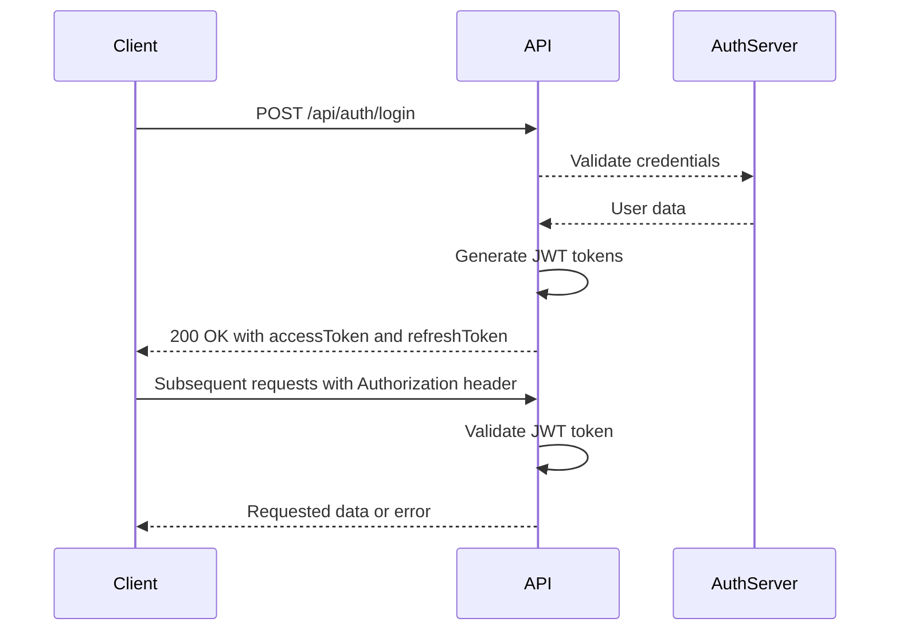

# API Reference

<cite>
**Referenced Files in This Document**   
- [main.ts](file://apps/backend/src/main.ts)
- [app.module.ts](file://apps/backend/src/app.module.ts)
- [auth.controller.ts](file://apps/backend/src/modules/auth/auth.controller.ts)
- [projects.controller.ts](file://apps/backend/src/modules/projects/projects.controller.ts)
- [documents.controller.ts](file://apps/backend/src/modules/documents/documents.controller.ts)
- [calendar.controller.ts](file://apps/backend/src/modules/calendar/calendar.controller.ts)
- [accu-applications.controller.ts](file://apps/backend/src/modules/accu/accu-applications.controller.ts)
- [auth.dto.ts](file://apps/backend/src/modules/auth/dto/index.ts)
- [project.dto.ts](file://apps/backend/src/modules/projects/dto/project.dto.ts)
- [document.dto.ts](file://apps/backend/src/modules/documents/dto/document.dto.ts)
- [calendar-event.dto.ts](file://apps/backend/src/modules/calendar/dto/calendar-event.dto.ts)
- [accu-application.dto.ts](file://apps/backend/src/modules/accu/dto/accu-application.dto.ts)
</cite>

## Table of Contents
1. [Introduction](#introduction)
2. [Authentication](#authentication)
3. [Rate Limiting](#rate-limiting)
4. [Error Handling](#error-handling)
5. [API Endpoints](#api-endpoints)
   - [Projects](#projects)
   - [Documents](#documents)
   - [Calendar](#calendar)
   - [ACCU Applications](#accu-applications)
6. [Common Use Cases](#common-use-cases)
7. [Client Implementation Guidelines](#client-implementation-guidelines)
8. [Performance Optimization](#performance-optimization)
9. [Monitoring and Debugging](#monitoring-and-debugging)
10. [Migration and Compatibility](#migration-and-compatibility)

## Introduction

The ACCU Platform provides a comprehensive RESTful API for managing Australian Carbon Credit Units (ACCU) operations, including project management, document handling, calendar events, and ACCU application workflows. The API is built using NestJS and follows REST principles with JWT-based authentication.

All API endpoints are prefixed with `/api` and documentation is available at `/api/docs` when running in non-production environments. The API supports JSON request and response formats and uses standard HTTP status codes for responses.

**Section sources**
- [main.ts](file://apps/backend/src/main.ts#L53)
- [app.module.ts](file://apps/backend/src/app.module.ts#L25)

## Authentication

The ACCU Platform API uses JWT (JSON Web Tokens) for authentication. All endpoints except authentication routes require a valid JWT token in the Authorization header.

### Authentication Endpoints

#### Login
- **URL**: `POST /api/auth/login`
- **Description**: Authenticate user and receive JWT tokens
- **Request Body**:
```json
{
  "email": "user@example.com",
  "password": "password123"
}
```
- **Response**:
```json
{
  "user": {
    "id": "string",
    "email": "string",
    "firstName": "string",
    "lastName": "string",
    "status": "string",
    "roles": [
      {
        "id": "string",
        "name": "string",
        "description": "string"
      }
    ]
  },
  "accessToken": "string",
  "refreshToken": "string",
  "expiresIn": 900000
}
```

#### Register
- **URL**: `POST /api/auth/register`
- **Description**: Create a new user account
- **Request Body**:
```json
{
  "email": "user@example.com",
  "firstName": "John",
  "lastName": "Doe",
  "password": "SecurePassword123!",
  "roles": ["user"],
  "tenantId": "550e8400-e29b-41d4-a716-446655440000"
}
```

#### Refresh Token
- **URL**: `POST /api/auth/refresh`
- **Description**: Obtain a new access token using a refresh token
- **Request Body**:
```json
{
  "refreshToken": "eyJhbGciOiJIUzI1NiIsInR5cCI6IkpXVCJ9..."
}
```

#### Profile Management
- **URL**: `GET /api/auth/profile`
- **Description**: Get current user profile information
- **Authentication**: Required (JWT token in Authorization header)
- **Response**: User profile without password

### JWT Token Usage

Include the JWT token in the Authorization header for authenticated requests:
```
Authorization: Bearer <access_token>
```

Tokens have a default expiration of 15 minutes (configurable via `JWT_EXPIRATION_TIME` environment variable). Use the refresh token endpoint to obtain a new access token when expired.

**Section sources**
- [auth.controller.ts](file://apps/backend/src/modules/auth/auth.controller.ts#L31)
- [main.ts](file://apps/backend/src/main.ts#L57)
- [auth.dto.ts](file://apps/backend/src/modules/auth/dto/index.ts#L5)

## Rate Limiting

The API implements rate limiting to prevent abuse and ensure system stability. Rate limiting is configured globally using the NestJS Throttler module.

### Configuration
- **Default limit**: 100 requests per 60 seconds per IP address
- **Configurable** via environment variables:
  - `RATE_LIMIT_TTL`: Time-to-live in milliseconds (default: 60000)
  - `RATE_LIMIT_MAX`: Maximum requests per TTL (default: 100)

When the rate limit is exceeded, the API returns a 429 Too Many Requests status code with a Retry-After header indicating when the client can retry.

**Section sources**
- [app.module.ts](file://apps/backend/src/app.module.ts#L41)
- [main.ts](file://apps/backend/src/main.ts#L34)

## Error Handling

The API implements comprehensive error handling through a global exception filter that standardizes error responses.

### Error Response Format
```json
{
  "statusCode": 400,
  "message": "Error description",
  "error": "Error Type",
  "timestamp": "2024-01-01T00:00:00.000Z",
  "path": "/api/endpoint"
}
```

### Common Error Codes
- **400 Bad Request**: Invalid request data or parameters
- **401 Unauthorized**: Missing or invalid authentication token
- **403 Forbidden**: Insufficient permissions for the requested operation
- **404 Not Found**: Requested resource does not exist
- **409 Conflict**: Resource already exists or operation conflicts with current state
- **413 Payload Too Large**: File upload exceeds size limits
- **415 Unsupported Media Type**: Invalid file type for upload
- **429 Too Many Requests**: Rate limit exceeded
- **500 Internal Server Error**: Unexpected server error

Validation errors return detailed information about which fields failed validation.

**Section sources**
- [main.ts](file://apps/backend/src/main.ts#L46)
- [http-exception.filter.ts](file://apps/backend/src/common/filters/http-exception.filter.ts)

## API Endpoints

### Projects

The Projects API provides endpoints for managing ACCU projects, including CRUD operations, collaboration, and analytics.

#### Create Project
- **URL**: `POST /api/projects`
- **Authentication**: Required
- **Permissions**: PROJECTS_WRITE
- **Request Body**:
```json
{
  "name": "Carbon Sequestration Project",
  "description": "Afforestation project in regional Australia",
  "type": "afforestation",
  "startDate": "2024-01-01",
  "endDate": "2025-12-31",
  "location": {
    "address": "123 Forest Road, Regional NSW",
    "coordinates": {
      "lat": -33.8688,
      "lng": 151.2093
    },
    "jurisdiction": "NSW"
  },
  "objectives": ["carbon_sequestration", "biodiversity"],
  "methodology": "VE1001",
  "status": "draft"
}
```
- **Response**: 201 Created with ProjectResponseDto

#### Get Projects
- **URL**: `GET /api/projects`
- **Authentication**: Required
- **Permissions**: PROJECTS_READ
- **Query Parameters**:
  - `page`: Page number (default: 1)
  - `limit`: Items per page (default: 10, max: 100)
  - `search`: Search term for name/description
  - `status`: Filter by project status
  - `type`: Filter by project type
  - `sortBy`: Sort field (default: createdAt)
  - `sortOrder`: Sort order (ASC/DESC, default: DESC)

#### Project Status Management
The API provides both generic and convenience endpoints for managing project status:

- **Generic status update**: `PATCH /api/projects/:id/status`
- **Activate project**: `PATCH /api/projects/:id/activate`
- **Complete project**: `PATCH /api/projects/:id/complete`
- **Put on hold**: `PATCH /api/projects/:id/hold`
- **Resume project**: `PATCH /api/projects/:id/resume`

Allowed transitions follow the project workflow: draft → active → (on_hold/completed/cancelled)

#### Project Collaboration
Manage team members and collaborators for projects:

- **Add collaborator**: `POST /api/projects/:id/collaborators`
- **Remove collaborator**: `DELETE /api/projects/:id/collaborators/:userId`
- **Get collaborators**: `GET /api/projects/:id/collaborators`

**Section sources**
- [projects.controller.ts](file://apps/backend/src/modules/projects/projects.controller.ts#L58)
- [project.dto.ts](file://apps/backend/src/modules/projects/dto/project.dto.ts)

### Documents

The Documents API provides comprehensive document management with versioning, access control, and audit trails.

#### Upload Document
- **URL**: `POST /api/documents/upload`
- **Authentication**: Required
- **Permissions**: DOCUMENTS_WRITE
- **Content-Type**: multipart/form-data
- **Request Body**:
```json
{
  "file": "[binary file data]",
  "name": "Quarterly Audit Report",
  "description": "Q4 compliance audit findings",
  "category": "AUDIT_REPORT",
  "tags": ["audit", "compliance", "Q4"],
  "projectId": "550e8400-e29b-41d4-a716-446655440000",
  "metadata": {
    "department": "Compliance",
    "confidentiality": "internal"
  },
  "status": "DRAFT"
}
```

#### Document Versioning
- **Upload new version**: `POST /api/documents/:id/versions`
- **Get versions**: `GET /api/documents/:id/versions`
- **Download specific version**: Available through version-specific endpoints

#### Document Search and Filtering
- **Search by tags**: `GET /api/documents/search/tags?tags=audit,compliance`
- **Filter by status/category**: Use query parameters in GET /api/documents
- **Full-text search**: Use the `search` query parameter

#### Bulk Operations
Perform operations on multiple documents:
- **URL**: `POST /api/documents/bulk`
- **Request Body**:
```json
{
  "documentIds": ["id1", "id2", "id3"],
  "operation": "update_status",
  "parameters": {
    "status": "ARCHIVED"
  }
}
```

Supported operations: update_status, update_category, add_tags, remove_tags, delete

**Section sources**
- [documents.controller.ts](file://apps/backend/src/modules/documents/documents.controller.ts#L60)
- [document.dto.ts](file://apps/backend/src/modules/documents/dto/document.dto.ts)

### Calendar

The Calendar API manages events, deadlines, and scheduling for ACCU projects and applications.

#### Event Management
- **Create event**: `POST /api/calendar/events`
- **Get events**: `GET /api/calendar/events` (with filtering)
- **Get event**: `GET /api/calendar/events/:id`
- **Update event**: `PUT /api/calendar/events/:id`
- **Delete event**: `DELETE /api/calendar/events/:id`

#### Calendar Views
- **Monthly view**: `GET /api/calendar/:year/:month`
- **Daily view**: `GET /api/calendar/:year/:month/:day`
- **Dashboard**: `GET /api/calendar/events/dashboard`

#### Deadline Management
- **Get deadlines**: `GET /api/calendar/deadlines`
- **Get overdue deadlines**: `GET /api/calendar/events/overdue`
- **Get upcoming deadlines**: `GET /api/calendar/events/upcoming`
- **Complete deadline**: `POST /api/calendar/deadlines/:id/complete`

#### Conflict Detection
Check for scheduling conflicts before creating or updating events:
- **URL**: `POST /api/calendar/conflicts`
- **Request Body**: CalendarEventCreateDto
- **Response**: List of conflicting events with details

#### Integration Endpoints
Create deadlines for specific workflows:
- **ACCU application deadlines**: `POST /api/calendar/accu/:applicationId/deadlines`
- **Project milestone deadlines**: `POST /api/calendar/projects/:projectId/milestones`
- **Audit events**: `POST /api/calendar/audits/:auditId/events`

**Section sources**
- [calendar.controller.ts](file://apps/backend/src/modules/calendar/calendar.controller.ts#L46)
- [calendar-event.dto.ts](file://apps/backend/src/modules/calendar/dto/calendar-event.dto.ts)

### ACCU Applications

The ACCU Applications API manages the lifecycle of ACCU applications from creation to issuance.

#### Application Lifecycle
- **Create application**: `POST /api/accu/applications`
- **Submit application**: `POST /api/accu/applications/:id/submit`
- **Approve application**: `POST /api/accu/applications/:id/approve`
- **Reject application**: `POST /api/accu/applications/:id/reject`
- **Issue ACCU units**: `PATCH /api/accu/applications/:id/issue`

#### Application Status Management
- **Generic status update**: `PATCH /api/accu/applications/:id/status`
- **Convenience endpoints**:
  - `PATCH /api/accu/applications/:id/activate` (submit)
  - `PATCH /api/accu/applications/:id/under-review`
  - `PATCH /api/accu/applications/:id/final-approve`

#### Application Data Management
- **Get application**: `GET /api/accu/applications/:id`
- **Update application**: `PUT /api/accu/applications/:id`
- **Get history**: `GET /api/accu/applications/:id/history`
- **Get analytics**: `GET /api/accu/applications/:id/analytics`

#### Document Integration
- **Get application documents**: `GET /api/accu/applications/:id/documents`
- **Add document**: `POST /api/accu/applications/:id/documents`
- **Get deadlines**: `GET /api/accu/applications/:id/deadlines`

#### Dashboard and Statistics
- **Dashboard**: `GET /api/accu/applications/dashboard`
- **Statistics**: `GET /api/accu/applications/stats`

**Section sources**
- [accu-applications.controller.ts](file://apps/backend/src/modules/accu/accu-applications.controller.ts#L58)
- [accu-application.dto.ts](file://apps/backend/src/modules/accu/dto/accu-application.dto.ts)

## Common Use Cases

### Creating a New ACCU Project
1. Create a new project using POST /api/projects
2. Upload required documents using POST /api/documents/upload
3. Add team members using POST /api/projects/:id/collaborators
4. Create project milestones using POST /api/calendar/projects/:projectId/milestones

### Submitting an ACCU Application
1. Create an application using POST /api/accu/applications
2. Upload supporting documents using POST /api/documents/upload
3. Link documents to the application using POST /api/accu/applications/:id/documents
4. Submit the application using POST /api/accu/applications/:id/submit

### Managing Project Deadlines
1. Create deadlines using POST /api/calendar/events with type=deadline
2. Set custom reminders using POST /api/calendar/events/:id/reminders
3. Monitor upcoming and overdue deadlines using dedicated endpoints
4. Mark deadlines as complete using POST /api/calendar/deadlines/:id/complete

### Bulk Document Processing
1. Retrieve document IDs through search or listing
2. Perform bulk operations using POST /api/documents/bulk
3. Update status, categories, or tags for multiple documents at once

## Client Implementation Guidelines

### Authentication Flow


**Diagram sources**
- [auth.controller.ts](file://apps/backend/src/modules/auth/auth.controller.ts#L31)
- [main.ts](file://apps/backend/src/main.ts#L57)

### Error Handling Best Practices
- Always check HTTP status codes before processing response data
- Handle 401 Unauthorized by redirecting to login or refreshing tokens
- Implement retry logic for 429 Too Many Requests with exponential backoff
- Display user-friendly error messages from the response body
- Log detailed error information for debugging

### Rate Limiting Strategies
- Implement client-side rate limiting to avoid hitting server limits
- Use caching for frequently accessed data
- Batch requests when possible
- Implement exponential backoff for retry logic
- Monitor rate limit headers (X-RateLimit-Limit, X-RateLimit-Remaining, Retry-After)

### File Upload Guidelines
- Use multipart/form-data content type
- Include appropriate metadata with uploads
- Handle 413 Payload Too Large errors by checking file size client-side
- Support resumable uploads for large files
- Validate file types client-side before upload

## Performance Optimization

### Caching Strategies
- Implement client-side caching for frequently accessed resources
- Use ETag headers for conditional requests
- Cache authentication tokens for the duration of their validity
- Implement pagination to limit response sizes
- Use query parameters to request only needed fields when supported

### Efficient Data Retrieval
- Use filtering and searching to retrieve only relevant data
- Implement lazy loading for large datasets
- Use batch operations for multiple updates
- Minimize the number of round trips by combining related operations

### Connection Management
- Reuse HTTP connections (keep-alive)
- Implement connection pooling
- Use HTTP/2 for improved performance
- Compress request and response bodies

### Monitoring Performance
- Track API response times
- Monitor error rates
- Measure throughput (requests per second)
- Set up alerts for performance degradation
- Use distributed tracing for complex workflows

## Monitoring and Debugging

### Protocol-Specific Tools
- **Swagger UI**: Available at /api/docs for API exploration and testing
- **Prometheus**: Metrics endpoint for monitoring system performance
- **Grafana**: Dashboards for visualizing API metrics and system health
- **Logging**: Structured logs with correlation IDs for request tracing

### Debugging Headers
The API supports several debugging headers:
- `X-Request-ID`: Client-provided request identifier for tracing
- `X-Debug`: Enable debug mode for detailed error information
- `X-Verbose`: Request verbose response with additional metadata

### Monitoring Endpoints
- **Health check**: GET /api/health (returns 200 OK when healthy)
- **Metrics**: Exposed to Prometheus for system monitoring
- **Tracing**: Integration with distributed tracing systems

### Alerting Configuration
The platform includes alerting rules for:
- High error rates
- Slow response times
- Rate limit violations
- Authentication failures
- System resource exhaustion

## Migration and Compatibility

### Backwards Compatibility
The API maintains backwards compatibility through:
- Semantic versioning in the future (v1/, v2/ prefixes)
- Deprecation warnings in response headers
- Gradual removal of deprecated endpoints
- Comprehensive documentation for changes

### Migration Guides
When breaking changes are introduced:
1. Deprecated endpoints will return a 410 Gone status code
2. Documentation will be updated with migration instructions
3. Alternative endpoints will be provided
4. Sufficient notice period will be given before removal

### Versioning Strategy
Future versions will use URL-based versioning:
- Current: `/api/endpoint`
- Future: `/api/v1/endpoint`, `/api/v2/endpoint`

The current API is considered v1 and will maintain compatibility within this version.