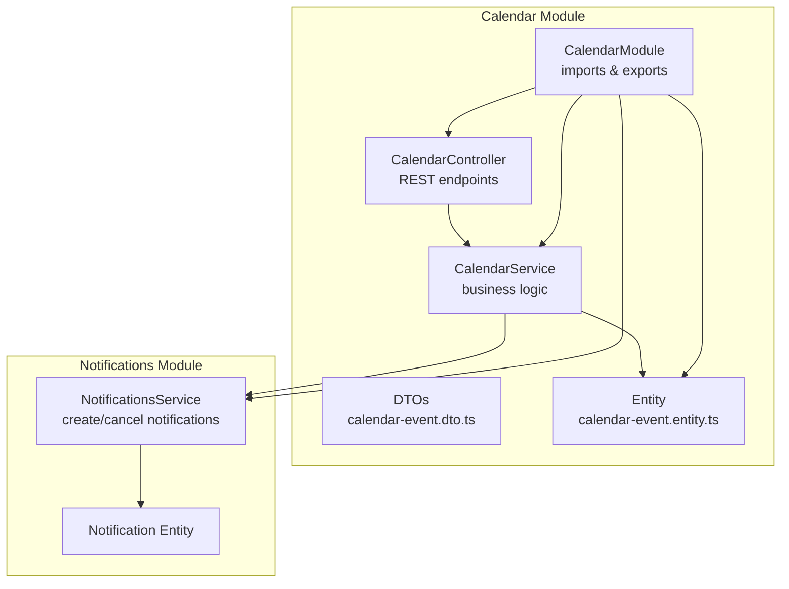
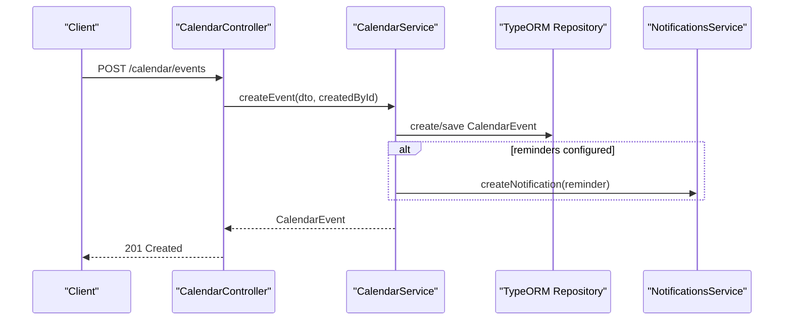
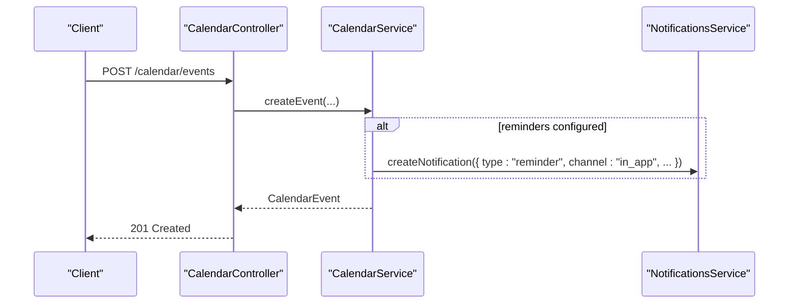
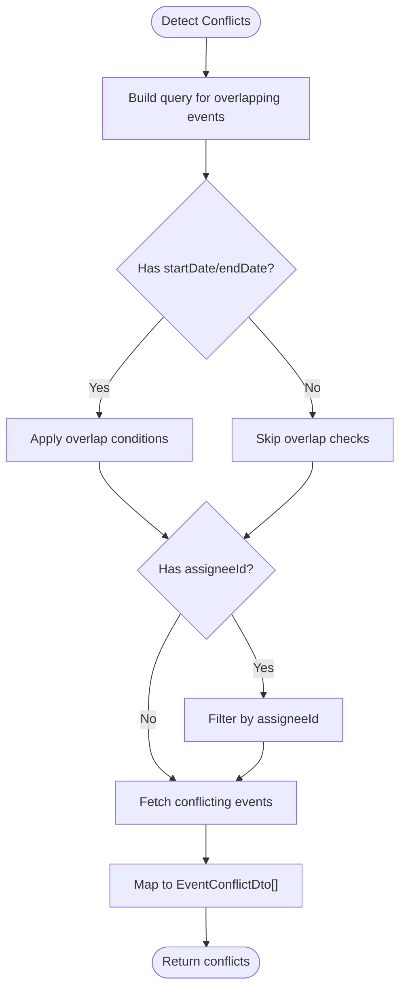
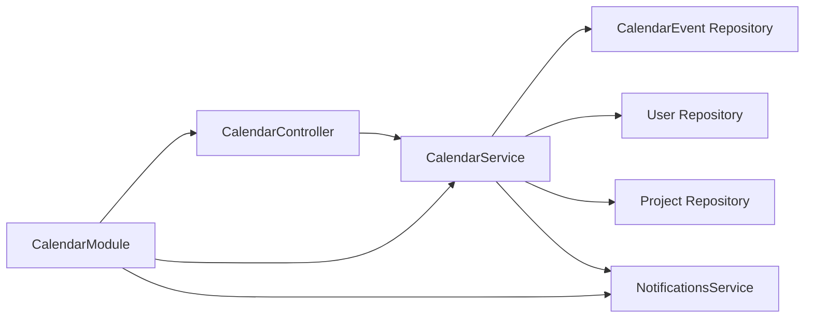

# Calendar & Events API

<cite>
**Referenced Files in This Document**
- [calendar.controller.ts](file://apps/backend/src/modules/calendar/calendar.controller.ts)
- [calendar.service.ts](file://apps/backend/src/modules/calendar/calendar.service.ts)
- [calendar-event.dto.ts](file://apps/backend/src/modules/calendar/dto/calendar-event.dto.ts)
- [calendar-event.entity.ts](file://apps/backend/src/entities/calendar-event.entity.ts)
- [calendar.module.ts](file://apps/backend/src/modules/calendar/calendar.module.ts)
- [README.md](file://apps/backend/src/modules/calendar/README.md)
- [notifications.service.ts](file://apps/backend/src/modules/notifications/notifications.service.ts)
- [notification.entity.ts](file://apps/backend/src/entities/notification.entity.ts)
- [calendar.test.ts](file://apps/backend/test/calendar.test.ts)
</cite>

## Table of Contents
1. [Introduction](#introduction)
2. [Project Structure](#project-structure)
3. [Core Components](#core-components)
4. [Architecture Overview](#architecture-overview)
5. [Detailed Component Analysis](#detailed-component-analysis)
6. [Dependency Analysis](#dependency-analysis)
7. [Performance Considerations](#performance-considerations)
8. [Troubleshooting Guide](#troubleshooting-guide)
9. [Conclusion](#conclusion)
10. [Appendices](#appendices)

## Introduction
This document provides comprehensive API documentation for the Calendar module, focusing on creating, reading, updating, and deleting calendar events, deadline tracking, and milestone management. It specifies HTTP methods, URL patterns, authentication requirements, request/response schemas using calendar-event.dto.ts, recurrence rules, integration with projects and ACCU applications for automated deadline creation, reminder system implementation and notification triggers, examples of event creation with project associations, bulk operations, and conflict detection. It also addresses common issues such as time zone handling, overlapping events, permission errors, and synchronization problems with external calendars.

## Project Structure
The Calendar module is implemented as a NestJS module with a controller, service, DTOs, and an entity. It integrates with the Notifications module for reminder and alert delivery.

**Diagram sources**
- [calendar.controller.ts](file://apps/backend/src/modules/calendar/calendar.controller.ts#L1-L120)
- [calendar.service.ts](file://apps/backend/src/modules/calendar/calendar.service.ts#L1-L120)
- [calendar-event.dto.ts](file://apps/backend/src/modules/calendar/dto/calendar-event.dto.ts#L1-L120)
- [calendar-event.entity.ts](file://apps/backend/src/entities/calendar-event.entity.ts#L1-L80)
- [calendar.module.ts](file://apps/backend/src/modules/calendar/calendar.module.ts#L1-L23)
- [notifications.service.ts](file://apps/backend/src/modules/notifications/notifications.service.ts#L1-L60)
- [notification.entity.ts](file://apps/backend/src/entities/notification.entity.ts#L1-L60)

**Section sources**
- [calendar.module.ts](file://apps/backend/src/modules/calendar/calendar.module.ts#L1-L23)
- [README.md](file://apps/backend/src/modules/calendar/README.md#L1-L40)

## Core Components
- CalendarController: Exposes REST endpoints for CRUD, deadline management, calendar views, analytics, conflict detection, and integration endpoints.
- CalendarService: Implements business logic for event CRUD, conflict detection, reminders, deadline tracking, calendar views, analytics, and integrations with ACCU applications, projects, and audits.
- DTOs: Define request/response schemas for create/update/query operations, deadlines, reminders, calendar views, and conflict detection.
- Entity: Defines the CalendarEvent model with fields for type, priority, recurrence, reminders, metadata, and relations to Project and User.
- NotificationsService: Manages notification creation and cancellation for reminders and alerts.

**Section sources**
- [calendar.controller.ts](file://apps/backend/src/modules/calendar/calendar.controller.ts#L1-L120)
- [calendar.service.ts](file://apps/backend/src/modules/calendar/calendar.service.ts#L1-L120)
- [calendar-event.dto.ts](file://apps/backend/src/modules/calendar/dto/calendar-event.dto.ts#L1-L120)
- [calendar-event.entity.ts](file://apps/backend/src/entities/calendar-event.entity.ts#L1-L80)
- [notifications.service.ts](file://apps/backend/src/modules/notifications/notifications.service.ts#L1-L60)

## Architecture Overview
The Calendar module follows a layered architecture:
- Controller handles HTTP requests and delegates to the service.
- Service encapsulates domain logic, validates inputs, checks conflicts, schedules reminders, and coordinates with the Notifications module.
- DTOs define strict schemas validated by class-validator.
- Entity persists data with TypeORM and defines indexes for performance.
- Notifications module manages reminder/alert delivery.

**Diagram sources**
- [calendar.controller.ts](file://apps/backend/src/modules/calendar/calendar.controller.ts#L45-L90)
- [calendar.service.ts](file://apps/backend/src/modules/calendar/calendar.service.ts#L40-L120)
- [notifications.service.ts](file://apps/backend/src/modules/notifications/notifications.service.ts#L27-L40)

## Detailed Component Analysis

### Authentication and Permissions
- Authentication: All endpoints are protected by JWT and Permissions guards.
- Authorization: Endpoints require specific permissions:
  - calendar.events.read, calendar.events.write, calendar.events.delete
  - Additional deadline-specific permissions are implied by the endpoints.

**Section sources**
- [calendar.controller.ts](file://apps/backend/src/modules/calendar/calendar.controller.ts#L36-L44)
- [README.md](file://apps/backend/src/modules/calendar/README.md#L155-L164)

### Request/Response Schemas
All request and response bodies are defined via DTOs. Key schemas include:
- CalendarEventCreateDto: Fields for title, description, type, priority, start/end dates, all-day flag, recurrence rule, project/assignee IDs, reminders, metadata, tenant ID.
- CalendarEventUpdateDto: Subset of create fields for updates.
- CalendarEventQueryDto: Pagination, sorting, and filtering options.
- DeadlineDto: Deadline-specific fields including dueDate, daysRemaining, isOverdue, isCompleted, completedAt, metadata.
- ReminderDto: Event ID, daysBefore, optional custom message, and notification channels.
- CalendarViewDto: Year/month/day, view type, event type filters, tenant ID.
- EventConflictDto: Conflict identification and details.

These schemas are validated using class-validator and class-transformer.

**Section sources**
- [calendar-event.dto.ts](file://apps/backend/src/modules/calendar/dto/calendar-event.dto.ts#L1-L381)
- [calendar-event.entity.ts](file://apps/backend/src/entities/calendar-event.entity.ts#L1-L137)

### Endpoints Reference

#### Event CRUD
- Create Event
  - Method: POST
  - URL: /calendar/events
  - Auth: JWT + Permissions: calendar.events.write
  - Query: userId (optional)
  - Body: CalendarEventCreateDto
  - Response: CalendarEvent
  - Notes: Validates creator, project, assignee existence; detects conflicts; schedules reminders; sets up deadline tracking if type is deadline.

- Get Events (List)
  - Method: GET
  - URL: /calendar/events
  - Auth: JWT + Permissions: calendar.events.read
  - Query: CalendarEventQueryDto (pagination, sorting, filters)
  - Response: { events: CalendarEvent[], total: number, pagination: object }

- Get Event by ID
  - Method: GET
  - URL: /calendar/events/:id
  - Auth: JWT + Permissions: calendar.events.read
  - Response: CalendarEvent

- Update Event
  - Method: PUT
  - URL: /calendar/events/:id
  - Auth: JWT + Permissions: calendar.events.write
  - Query: userId (optional)
  - Body: CalendarEventUpdateDto
  - Response: CalendarEvent
  - Notes: Re-checks conflicts if time/date changed; updates reminders if changed.

- Delete Event
  - Method: DELETE
  - URL: /calendar/events/:id
  - Auth: JWT + Permissions: calendar.events.delete
  - Response: 204 No Content
  - Notes: Cancels scheduled reminders.

- Set Custom Reminders
  - Method: POST
  - URL: /calendar/events/:id/reminders
  - Auth: JWT + Permissions: calendar.events.write
  - Body: ReminderDto
  - Response: { message: string, event: CalendarEvent, reminder: ReminderDto }

**Section sources**
- [calendar.controller.ts](file://apps/backend/src/modules/calendar/calendar.controller.ts#L45-L231)
- [calendar.service.ts](file://apps/backend/src/modules/calendar/calendar.service.ts#L40-L268)

#### Deadline Management
- Get All Deadlines
  - Method: GET
  - URL: /calendar/deadlines
  - Auth: JWT + Permissions: calendar.events.read
  - Query: CalendarEventQueryDto
  - Response: DeadlineDto[]

- Get Specific Deadline
  - Method: GET
  - URL: /calendar/deadlines/:id
  - Auth: JWT + Permissions: calendar.events.read
  - Response: DeadlineDto
  - Notes: Throws if event type is not deadline.

- Complete Deadline
  - Method: POST
  - URL: /calendar/deadlines/:id/complete
  - Auth: JWT + Permissions: calendar.events.write
  - Response: CalendarEvent
  - Notes: Marks deadline as completed with metadata; sends success notification.

**Section sources**
- [calendar.controller.ts](file://apps/backend/src/modules/calendar/calendar.controller.ts#L271-L327)
- [calendar.service.ts](file://apps/backend/src/modules/calendar/calendar.service.ts#L366-L457)

#### Calendar Views
- Monthly View
  - Method: GET
  - URL: /calendar/calendar/:year/:month
  - Auth: JWT + Permissions: calendar.events.read
  - Query: tenantId (optional), eventTypes (optional array)
  - Response: { year, month, days: [{ day, date, events: [...] }], filters }

- Daily View
  - Method: GET
  - URL: /calendar/calendar/:year/:month/:day
  - Auth: JWT + Permissions: calendar.events.read
  - Query: tenantId (optional)
  - Response: { date, events: [...] }

- Upcoming Events
  - Method: GET
  - URL: /calendar/events/upcoming
  - Auth: JWT + Permissions: calendar.events.read
  - Query: days (optional), tenantId (optional)
  - Response: { deadlines, events: [...], period }

- Overdue Deadlines
  - Method: GET
  - URL: /calendar/events/overdue
  - Auth: JWT + Permissions: calendar.events.read
  - Query: tenantId (optional)
  - Response: DeadlineDto[] filtered by tenant if provided

- Dashboard
  - Method: GET
  - URL: /calendar/events/dashboard
  - Auth: JWT + Permissions: calendar.events.read
  - Query: tenantId (optional)
  - Response: { stats, upcomingEvents, overdueEvents, timestamp }

- Stats
  - Method: GET
  - URL: /calendar/stats
  - Auth: JWT + Permissions: calendar.events.read
  - Query: tenantId (optional)
  - Response: CalendarStats

**Section sources**
- [calendar.controller.ts](file://apps/backend/src/modules/calendar/calendar.controller.ts#L80-L228)
- [calendar.service.ts](file://apps/backend/src/modules/calendar/calendar.service.ts#L482-L651)

#### Conflict Detection
- Check Conflicts
  - Method: POST
  - URL: /calendar/conflicts
  - Auth: JWT + Permissions: calendar.events.write
  - Body: CalendarEventCreateDto
  - Response: { hasConflicts: boolean, conflicts: EventConflictDto[], timestamp: string }

**Section sources**
- [calendar.controller.ts](file://apps/backend/src/modules/calendar/calendar.controller.ts#L414-L431)
- [calendar.service.ts](file://apps/backend/src/modules/calendar/calendar.service.ts#L271-L317)

#### Integration Endpoints
- Create ACCU Application Deadlines
  - Method: POST
  - URL: /calendar/accu/:applicationId/deadlines
  - Auth: JWT + Permissions: calendar.events.write
  - Body: { dueDate: Date, projectId: string, createdById: string }
  - Response: { message: string, events: CalendarEvent[], applicationId: string }
  - Notes: Creates main submission deadline and supporting documents deadline with reminders.

- Create Project Milestone Deadlines
  - Method: POST
  - URL: /calendar/projects/:projectId/milestones
  - Auth: JWT + Permissions: calendar.events.write
  - Body: { milestones: [{ name: string, dueDate: Date, priority: string }], createdById: string }
  - Response: { message: string, events: CalendarEvent[], projectId: string }
  - Notes: Creates deadline events for each milestone with reminders based on priority.

- Create Audit Events
  - Method: POST
  - URL: /calendar/audits/:auditId/events
  - Auth: JWT + Permissions: calendar.events.write
  - Body: { title: string, startDate: Date, endDate: Date, leadAuditorId: string, createdById: string }
  - Response: { message: string, events: CalendarEvent[], auditId: string }
  - Notes: Creates planning deadline, audit execution event, and report due deadline.

**Section sources**
- [calendar.controller.ts](file://apps/backend/src/modules/calendar/calendar.controller.ts#L434-L562)
- [calendar.service.ts](file://apps/backend/src/modules/calendar/calendar.service.ts#L677-L800)

### Recurrence Rules
- Field: recurrenceRule (string)
- Format: RFC 5545 RRULE
- Supported in CalendarEventCreateDto and CalendarEventUpdateDto
- Stored in CalendarEvent.entity.ts
- Note: The current implementation does not parse or expand recurring instances; it stores the rule for display and filtering. For expansion, external libraries or additional logic would be required.

**Section sources**
- [calendar-event.dto.ts](file://apps/backend/src/modules/calendar/dto/calendar-event.dto.ts#L40-L44)
- [calendar-event.entity.ts](file://apps/backend/src/entities/calendar-event.entity.ts#L66-L70)

### Reminder System and Notification Triggers
- Reminders are configured via reminders field in CalendarEventCreateDto/UpdateDto (days before).
- On create/update, reminders are scheduled if present:
  - For each daysBefore, compute reminderDate = event.startDate - daysBefore.
  - If reminderDate > now, create an in-app reminder notification.
- Reminders can be updated or canceled when reminders change or when an event is deleted.
- Notification types include reminder, warning, success.
- Channels supported: in_app, email, sms, webhook (notification entity).

**Diagram sources**
- [calendar.service.ts](file://apps/backend/src/modules/calendar/calendar.service.ts#L319-L346)
- [notifications.service.ts](file://apps/backend/src/modules/notifications/notifications.service.ts#L27-L40)
- [notification.entity.ts](file://apps/backend/src/entities/notification.entity.ts#L13-L26)

**Section sources**
- [calendar.service.ts](file://apps/backend/src/modules/calendar/calendar.service.ts#L319-L363)
- [notifications.service.ts](file://apps/backend/src/modules/notifications/notifications.service.ts#L1-L125)
- [notification.entity.ts](file://apps/backend/src/entities/notification.entity.ts#L1-L114)

### Conflict Detection
- Detects overlapping time slots for the same assignee.
- Returns EventConflictDto entries with conflictType and description.
- Used during create and update when time/date changes.

**Diagram sources**
- [calendar.service.ts](file://apps/backend/src/modules/calendar/calendar.service.ts#L271-L317)

**Section sources**
- [calendar.service.ts](file://apps/backend/src/modules/calendar/calendar.service.ts#L271-L317)

### Integration with Projects and ACCU Applications
- ACCU Application Deadlines: Creates submission and supporting documents deadlines with reminders.
- Project Milestones: Creates deadline events for each milestone with reminders based on priority.
- Audit Events: Creates planning deadline, audit execution event, and report due deadline.

**Section sources**
- [calendar.service.ts](file://apps/backend/src/modules/calendar/calendar.service.ts#L677-L800)

### Examples

#### Example: Create a Deadline Associated with a Project
- Endpoint: POST /calendar/events
- Body: CalendarEventCreateDto with type=deadline, priority, startDate, projectId, reminders
- Response: CalendarEvent with reminders scheduled

**Section sources**
- [calendar.controller.ts](file://apps/backend/src/modules/calendar/calendar.controller.ts#L45-L90)
- [calendar.service.ts](file://apps/backend/src/modules/calendar/calendar.service.ts#L40-L120)

#### Example: Bulk Operations
- The Calendar module does not expose explicit bulk endpoints. However, clients can loop over arrays of events and call POST /calendar/events multiple times. Alternatively, the integration endpoints POST /calendar/projects/:projectId/milestones and POST /calendar/accu/:applicationId/deadlines can be used to create multiple deadlines efficiently.

**Section sources**
- [calendar.controller.ts](file://apps/backend/src/modules/calendar/calendar.controller.ts#L472-L562)

#### Example: Event Creation with Project Associations
- Use projectId in CalendarEventCreateDto to associate an event with a project. Validation ensures the project exists.

**Section sources**
- [calendar.service.ts](file://apps/backend/src/modules/calendar/calendar.service.ts#L40-L70)

### Time Zone Handling
- The CalendarEvent entity stores startDate and endDate as timestamps.
- There is no explicit time zone field in the entity or DTOs.
- Recommendation: Store all timestamps in UTC and convert to user’s local time zone on the client side. The frontend Settings page demonstrates selecting time zones (e.g., America/New_York), indicating awareness of time zone considerations.

**Section sources**
- [calendar-event.entity.ts](file://apps/backend/src/entities/calendar-event.entity.ts#L57-L61)
- [calendar-event.dto.ts](file://apps/backend/src/modules/calendar/dto/calendar-event.dto.ts#L24-L33)
- [README.md](file://apps/backend/src/modules/calendar/README.md#L240-L288)

### Overlapping Events and Conflict Resolution
- Conflict detection identifies overlapping time slots for the same assignee.
- The service logs warnings when conflicts are detected during create/update.
- Clients should resolve conflicts by adjusting dates or assigning different participants.

**Section sources**
- [calendar.service.ts](file://apps/backend/src/modules/calendar/calendar.service.ts#L271-L317)

### Permission Errors
- Unauthorized or insufficient permissions result in 403/401 responses depending on guard configuration.
- Ensure the caller has the appropriate calendar.events.* permissions.

**Section sources**
- [calendar.controller.ts](file://apps/backend/src/modules/calendar/calendar.controller.ts#L36-L44)

### Synchronization Problems with External Calendars
- The Calendar module does not currently integrate with external calendar systems (e.g., Google, Outlook).
- Future enhancement roadmap includes calendar synchronization.

**Section sources**
- [README.md](file://apps/backend/src/modules/calendar/README.md#L280-L288)

## Dependency Analysis
- CalendarController depends on CalendarService.
- CalendarService depends on:
  - CalendarEvent repository (TypeORM)
  - User and Project repositories
  - NotificationsService for reminders/alerts
- CalendarModule imports TypeORM entities and NotificationsModule.

**Diagram sources**
- [calendar.controller.ts](file://apps/backend/src/modules/calendar/calendar.controller.ts#L1-L60)
- [calendar.service.ts](file://apps/backend/src/modules/calendar/calendar.service.ts#L1-L40)
- [calendar.module.ts](file://apps/backend/src/modules/calendar/calendar.module.ts#L1-L23)

**Section sources**
- [calendar.controller.ts](file://apps/backend/src/modules/calendar/calendar.controller.ts#L1-L60)
- [calendar.service.ts](file://apps/backend/src/modules/calendar/calendar.service.ts#L1-L40)
- [calendar.module.ts](file://apps/backend/src/modules/calendar/calendar.module.ts#L1-L23)

## Performance Considerations
- Pagination: All list endpoints support page and limit parameters.
- Indexing: Entities have indexes on type/priority, projectId, and startDate to optimize queries.
- Lazy loading: Relations are loaded on demand via joins.
- Query optimization: Service uses query builders with proper filtering and ordering.

**Section sources**
- [calendar-event.entity.ts](file://apps/backend/src/entities/calendar-event.entity.ts#L30-L34)
- [calendar.service.ts](file://apps/backend/src/modules/calendar/calendar.service.ts#L99-L196)
- [README.md](file://apps/backend/src/modules/calendar/README.md#L252-L259)

## Troubleshooting Guide
- Validation errors: DTO validation ensures required fields and types. Fix input according to CalendarEventCreateDto/UpdateDto.
- Not found errors: Updating/deleting non-existent events raises NotFoundException.
- Conflict errors: Overlapping events for the same assignee are detected; adjust timing or participants.
- Permission errors: Ensure the caller has calendar.events.* permissions.
- Reminder failures: Verify reminders array and notification delivery channels; check NotificationsService logs.

**Section sources**
- [calendar.service.ts](file://apps/backend/src/modules/calendar/calendar.service.ts#L198-L268)
- [calendar.service.ts](file://apps/backend/src/modules/calendar/calendar.service.ts#L319-L363)
- [calendar.test.ts](file://apps/backend/test/calendar.test.ts#L107-L121)

## Conclusion
The Calendar module provides a robust foundation for event and deadline management with strong validation, conflict detection, reminder scheduling, and integration endpoints for ACCU applications, projects, and audits. While recurrence expansion and external calendar synchronization are not implemented, the architecture supports future enhancements. Adhering to the documented schemas and permissions ensures reliable operation across clients and integrations.

## Appendices

### API Endpoints Summary
- Event CRUD: POST /calendar/events, GET /calendar/events, GET /calendar/events/:id, PUT /calendar/events/:id, DELETE /calendar/events/:id, POST /calendar/events/:id/reminders
- Deadline Management: GET /calendar/deadlines, GET /calendar/deadlines/:id, POST /calendar/deadlines/:id/complete
- Calendar Views: GET /calendar/calendar/:year/:month, GET /calendar/calendar/:year/:month/:day, GET /calendar/events/upcoming, GET /calendar/events/overdue, GET /calendar/events/dashboard, GET /calendar/stats
- Conflict Detection: POST /calendar/conflicts
- Integrations: POST /calendar/accu/:applicationId/deadlines, POST /calendar/projects/:projectId/milestones, POST /calendar/audits/:auditId/events

**Section sources**
- [calendar.controller.ts](file://apps/backend/src/modules/calendar/calendar.controller.ts#L45-L562)
- [README.md](file://apps/backend/src/modules/calendar/README.md#L41-L80)