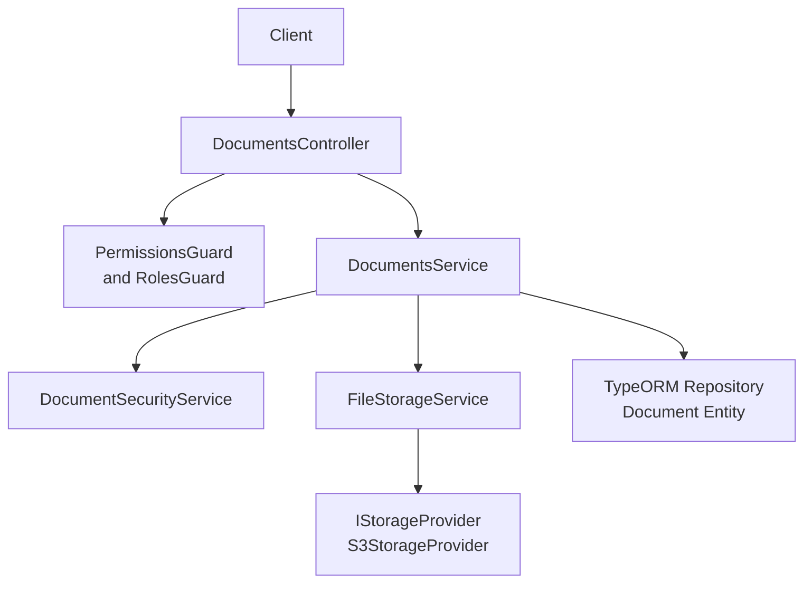
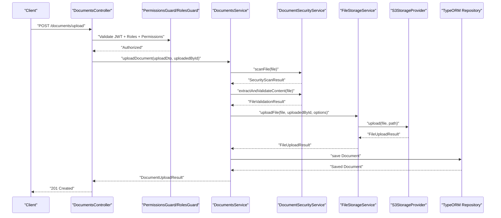
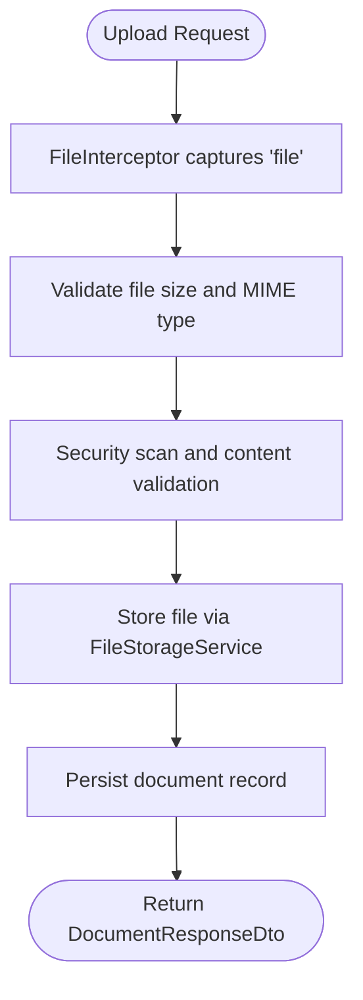
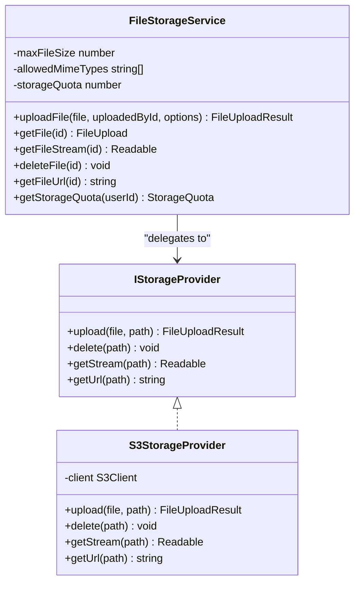
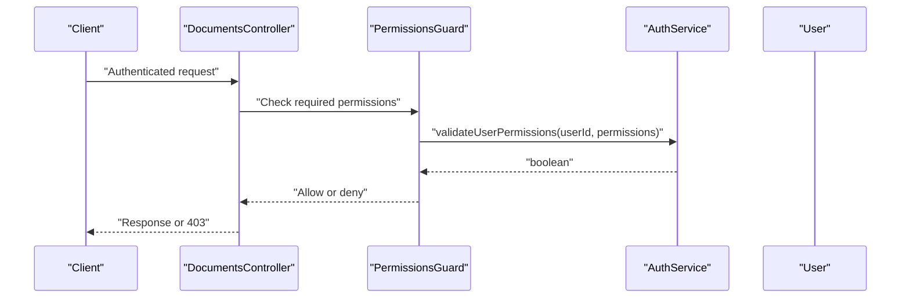
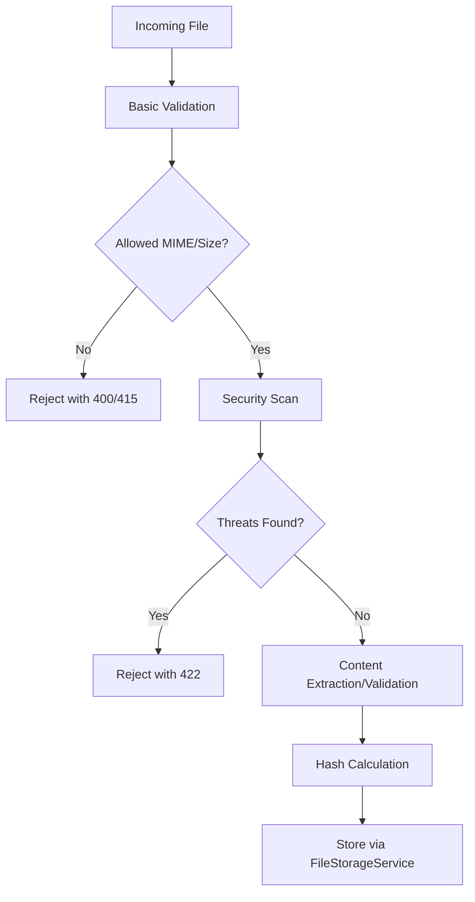
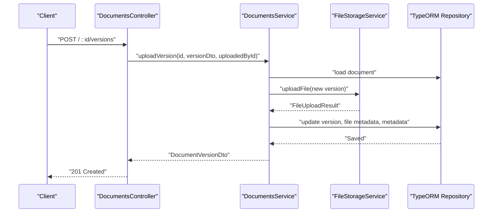
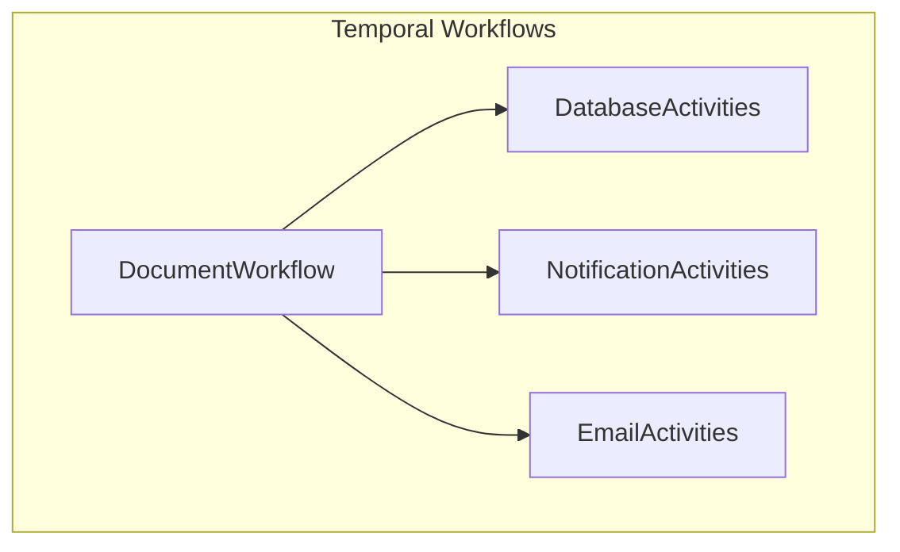
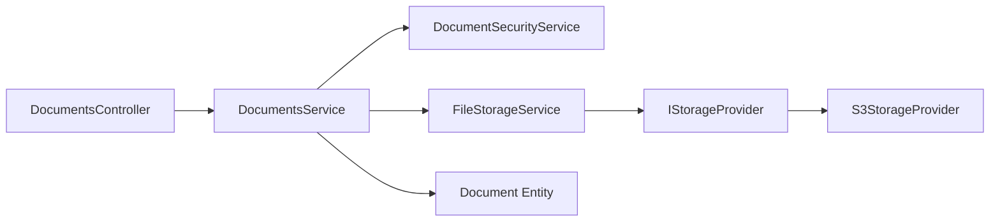

# Documents API

<cite>
**Referenced Files in This Document**
- [documents.controller.ts](file://apps/backend/src/modules/documents/documents.controller.ts)
- [documents.service.ts](file://apps/backend/src/modules/documents/documents.service.ts)
- [document-security.service.ts](file://apps/backend/src/modules/documents/document-security.service.ts)
- [file-storage.service.ts](file://apps/backend/src/modules/file-storage/file-storage.service.ts)
- [s3-storage.provider.ts](file://apps/backend/src/modules/file-storage/providers/s3-storage.provider.ts)
- [storage-provider.interface.ts](file://apps/backend/src/modules/file-storage/storage-provider.interface.ts)
- [document.dto.ts](file://apps/backend/src/modules/documents/dto/document.dto.ts)
- [document.entity.ts](file://apps/backend/src/entities/document.entity.ts)
- [permissions.guard.ts](file://apps/backend/src/common/guards/permissions.guard.ts)
- [permissions.decorator.ts](file://apps/backend/src/common/decorators/permissions.decorator.ts)
- [role.entity.ts](file://apps/backend/src/entities/role.entity.ts)
- [document-workflows.ts](file://apps/backend/src/modules/temporal/workflows/document/document-workflows.ts)
- [README.md](file://apps/backend/src/modules/documents/README.md)
</cite>

## Table of Contents
1. [Introduction](#introduction)
2. [Project Structure](#project-structure)
3. [Core Components](#core-components)
4. [Architecture Overview](#architecture-overview)
5. [Detailed Component Analysis](#detailed-component-analysis)
6. [Dependency Analysis](#dependency-analysis)
7. [Performance Considerations](#performance-considerations)
8. [Troubleshooting Guide](#troubleshooting-guide)
9. [Conclusion](#conclusion)
10. [Appendices](#appendices)

## Introduction
This document provides comprehensive API documentation for the Documents module. It covers all endpoints for document upload, retrieval, versioning, access control, and deletion. It also explains the multipart/form-data upload process, S3-compatible storage integration, document access control using role-based permissions, and integration with projects, ACCU applications, and audit workflows. Common issues such as large file uploads, permission errors, version conflicts, and storage provider failures are addressed with practical guidance.

## Project Structure
The Documents module is implemented as a NestJS controller and service layer with supporting DTOs, entities, security services, and file storage integration. The controller enforces authentication and authorization via JWT and role/permission guards. The service layer orchestrates security scanning, storage operations, and database persistence. File storage is abstracted behind a storage provider interface, enabling S3-compatible providers.

**Diagram sources**
- [documents.controller.ts](file://apps/backend/src/modules/documents/documents.controller.ts#L53-L357)
- [documents.service.ts](file://apps/backend/src/modules/documents/documents.service.ts#L1-L692)
- [document-security.service.ts](file://apps/backend/src/modules/documents/document-security.service.ts#L1-L595)
- [file-storage.service.ts](file://apps/backend/src/modules/file-storage/file-storage.service.ts#L1-L233)
- [s3-storage-provider.ts](file://apps/backend/src/modules/file-storage/providers/s3-storage.provider.ts#L1-L96)
- [document.entity.ts](file://apps/backend/src/entities/document.entity.ts#L1-L157)

**Section sources**
- [documents.controller.ts](file://apps/backend/src/modules/documents/documents.controller.ts#L53-L357)
- [documents.service.ts](file://apps/backend/src/modules/documents/documents.service.ts#L1-L692)
- [README.md](file://apps/backend/src/modules/documents/README.md#L55-L88)

## Core Components
- DocumentsController: Exposes REST endpoints for upload, listing, search, retrieval, updates, versioning, downloads, soft deletion, audit trail, and bulk operations. Enforces JWT, roles, and permissions.
- DocumentsService: Implements business logic for uploads, versioning, retrieval, downloads, soft deletion, audit trail, and bulk operations. Integrates security scanning and storage services.
- DocumentSecurityService: Performs file validation, security scanning, content extraction/validation, hashing, and integrity checks.
- FileStorageService: Validates file types and sizes, delegates upload to storage provider, records file metadata, and exposes quota and URL helpers.
- S3StorageProvider: Implements S3-compatible storage using AWS SDK, including upload, delete, stream, and signed URL generation.
- DTOs and Entities: Strongly typed request/response models and database entity definitions for documents, categories, statuses, and audit logs.

**Section sources**
- [documents.controller.ts](file://apps/backend/src/modules/documents/documents.controller.ts#L53-L357)
- [documents.service.ts](file://apps/backend/src/modules/documents/documents.service.ts#L1-L692)
- [document-security.service.ts](file://apps/backend/src/modules/documents/document-security.service.ts#L1-L595)
- [file-storage.service.ts](file://apps/backend/src/modules/file-storage/file-storage.service.ts#L1-L233)
- [s3-storage-provider.ts](file://apps/backend/src/modules/file-storage/providers/s3-storage.provider.ts#L1-L96)
- [document.dto.ts](file://apps/backend/src/modules/documents/dto/document.dto.ts#L1-L614)
- [document.entity.ts](file://apps/backend/src/entities/document.entity.ts#L1-L157)

## Architecture Overview
The Documents API follows a layered architecture:
- Presentation: NestJS controller handles HTTP requests/responses and Swagger metadata.
- Application: DocumentsService encapsulates orchestration of security, storage, and persistence.
- Domain: Document entity defines schema and helper methods.
- Infrastructure: FileStorageService abstracts storage via IStorageProvider; S3StorageProvider implements S3-compatible storage.

**Diagram sources**
- [documents.controller.ts](file://apps/backend/src/modules/documents/documents.controller.ts#L120-L135)
- [documents.service.ts](file://apps/backend/src/modules/documents/documents.service.ts#L72-L190)
- [document-security.service.ts](file://apps/backend/src/modules/documents/document-security.service.ts#L74-L127)
- [file-storage.service.ts](file://apps/backend/src/modules/file-storage/file-storage.service.ts#L64-L118)
- [s3-storage-provider.ts](file://apps/backend/src/modules/file-storage/providers/s3-storage.provider.ts#L32-L61)
- [document.entity.ts](file://apps/backend/src/entities/document.entity.ts#L1-L157)

## Detailed Component Analysis

### API Endpoints

- Base Path: /documents
- Authentication: Bearer JWT via guard
- Authorization: Roles and Permissions guards enforced per endpoint
- Content-Type for uploads: multipart/form-data

Endpoints:
- POST /upload
  - Roles: admin, super_admin, manager, user
  - Permissions: documents.write
  - Description: Upload a new document
  - Request: multipart/form-data with file and optional fields
  - Response: 201 Created with document metadata and storage result
  - Errors: 400 (invalid file/data), 413 (file too large), 415 (unsupported type)

- GET /
  - Roles: admin, super_admin, manager, user
  - Permissions: documents.read
  - Description: List documents with pagination and filtering
  - Query Params: page, limit, search, status, category, projectId, uploadedById, tags, tenantId, sortBy, sortOrder
  - Response: 200 OK with paginated data and metadata

- GET /search/tags
  - Roles: admin, super_admin, manager, user
  - Permissions: documents.read
  - Description: Search documents by tags
  - Query Params: tags (array)
  - Response: 200 OK with matching documents

- GET /stats
  - Roles: admin, super_admin, manager
  - Permissions: documents.read
  - Description: Get document statistics
  - Query Params: tenantId (optional)
  - Response: 200 OK with totals, counts by status/category, sizes

- GET /:id
  - Roles: admin, super_admin, manager, user
  - Permissions: documents.read
  - Description: Get document by ID
  - Response: 200 OK with document details

- PUT /:id
  - Roles: admin, super_admin, manager, user
  - Permissions: documents.write
  - Description: Update document metadata
  - Request: JSON body with optional fields
  - Response: 200 OK with updated document

- POST /:id/versions
  - Roles: admin, super_admin, manager, user
  - Permissions: documents.write
  - Description: Upload new version of document
  - Request: multipart/form-data with file and optional notes/metadata
  - Response: 201 Created with version details
  - Errors: 400 (missing file), 404 (document not found)

- GET /:id/versions
  - Roles: admin, super_admin, manager, user
  - Permissions: documents.read
  - Description: Get document versions
  - Response: 200 OK with version list

- GET /:id/download
  - Roles: admin, super_admin, manager, user
  - Permissions: documents.read
  - Description: Download document
  - Response: 200 OK with binary stream and appropriate headers

- DELETE /:id
  - Roles: admin, super_admin, manager
  - Permissions: documents.delete
  - Description: Soft delete document (change status to archived)
  - Response: 204 No Content

- GET /:id/audit
  - Roles: admin, super_admin, manager
  - Permissions: documents.read
  - Description: Get document audit trail
  - Response: 200 OK with audit entries

- POST /bulk
  - Roles: admin, super_admin, manager
  - Permissions: documents.write
  - Description: Bulk operations on documents
  - Request: JSON with documentIds, operation, parameters
  - Response: 200 OK with counts of updated/failed

**Section sources**
- [documents.controller.ts](file://apps/backend/src/modules/documents/documents.controller.ts#L60-L357)
- [document.dto.ts](file://apps/backend/src/modules/documents/dto/document.dto.ts#L1-L614)
- [README.md](file://apps/backend/src/modules/documents/README.md#L55-L88)

### Request and Response Formats

- Upload (multipart/form-data)
  - Fields:
    - file (required): Binary file
    - name (optional): String
    - description (optional): String
    - category (required): Enum (DocumentCategory)
    - tags (optional): Array<String>
    - projectId (optional): UUID
    - metadata (optional): Object
    - status (optional): Enum (DocumentStatus)
  - Response: DocumentResponseDto with file metadata, tags, project, uploadedBy, timestamps, formattedFileSize, fileExtension

- Version Upload (multipart/form-data)
  - Fields:
    - file (required): Binary file
    - versionNotes (optional): String
    - metadata (optional): Object
  - Response: DocumentVersionDto with version, file info, createdBy, createdAt, formattedFileSize

- Bulk Operation
  - Fields:
    - documentIds (required): Array<UUID>
    - operation (required): Enum ('update_status'|'update_category'|'add_tags'|'remove_tags'|'delete')
    - parameters (optional): Object (e.g., status, category, tags)
  - Response: { updated: number, failed: number }

- Audit Trail
  - Response: Array<DocumentAuditDto> with action, user, timestamp, metadata, optional IP/user agent

**Section sources**
- [document.dto.ts](file://apps/backend/src/modules/documents/dto/document.dto.ts#L1-L614)
- [document.entity.ts](file://apps/backend/src/entities/document.entity.ts#L1-L157)

### Multipart/Form-Data Upload Process
- The controller uses FileInterceptor('file') to capture the uploaded file.
- The service validates file size and MIME type against configured allowed types and limits.
- Security scanning runs before storage to ensure safety.
- Storage provider returns a FileUploadResult containing filename, path, URL, size, and checksum.
- The service persists document metadata and returns a formatted response.

**Diagram sources**
- [documents.controller.ts](file://apps/backend/src/modules/documents/documents.controller.ts#L120-L135)
- [documents.service.ts](file://apps/backend/src/modules/documents/documents.service.ts#L112-L189)
- [file-storage.service.ts](file://apps/backend/src/modules/file-storage/file-storage.service.ts#L64-L118)
- [document-security.service.ts](file://apps/backend/src/modules/documents/document-security.service.ts#L74-L127)

**Section sources**
- [documents.controller.ts](file://apps/backend/src/modules/documents/documents.controller.ts#L120-L135)
- [documents.service.ts](file://apps/backend/src/modules/documents/documents.service.ts#L112-L189)
- [file-storage.service.ts](file://apps/backend/src/modules/file-storage/file-storage.service.ts#L64-L118)
- [document-security.service.ts](file://apps/backend/src/modules/documents/document-security.service.ts#L74-L127)

### S3-Compatible Storage Integration
- FileStorageService implements the storage abstraction and delegates to IStorageProvider.
- S3StorageProvider uses AWS SDK to upload/delete/get objects and generates signed URLs for temporary access.
- The provider uses forcePathStyle for compatibility with MinIO and similar S3-compatible services.
- Storage provider interface ensures pluggability for alternative storage backends.

**Diagram sources**
- [storage-provider.interface.ts](file://apps/backend/src/modules/file-storage/storage-provider.interface.ts#L1-L17)
- [s3-storage-provider.ts](file://apps/backend/src/modules/file-storage/providers/s3-storage.provider.ts#L1-L96)
- [file-storage.service.ts](file://apps/backend/src/modules/file-storage/file-storage.service.ts#L1-L233)

**Section sources**
- [storage-provider.interface.ts](file://apps/backend/src/modules/file-storage/storage-provider.interface.ts#L1-L17)
- [s3-storage-provider.ts](file://apps/backend/src/modules/file-storage/providers/s3-storage.provider.ts#L1-L96)
- [file-storage.service.ts](file://apps/backend/src/modules/file-storage/file-storage.service.ts#L1-L233)

### Access Control and Permissions
- Roles: admin, super_admin, manager, user (endpoint-specific)
- Permissions: documents.read, documents.write, documents.delete
- Guards:
  - PermissionsGuard validates required permissions against the authenticated user.
  - RolesGuard restricts endpoints to allowed roles.
- Permission enum includes DOCUMENTS_READ, DOCUMENTS_WRITE, DOCUMENTS_DELETE.

**Diagram sources**
- [permissions.guard.ts](file://apps/backend/src/common/guards/permissions.guard.ts#L1-L47)
- [permissions.decorator.ts](file://apps/backend/src/common/decorators/permissions.decorator.ts#L1-L6)
- [role.entity.ts](file://apps/backend/src/entities/role.entity.ts#L1-L74)

**Section sources**
- [permissions.guard.ts](file://apps/backend/src/common/guards/permissions.guard.ts#L1-L47)
- [permissions.decorator.ts](file://apps/backend/src/common/decorators/permissions.decorator.ts#L1-L6)
- [role.entity.ts](file://apps/backend/src/entities/role.entity.ts#L1-L74)
- [documents.controller.ts](file://apps/backend/src/modules/documents/documents.controller.ts#L53-L357)

### Document Access Control Mechanisms
- DocumentSecurityService performs:
  - Basic validation (size, MIME type, empty file)
  - Dangerous/suspicious extension checks
  - Content scanning for executable code, macros, embedded files
  - File type validation via magic bytes
  - Encryption detection for PDF/Office documents
  - Integrity hashing (MD5, SHA1, SHA256)
  - Metadata sanitization and warnings
- Enhanced metadata is stored with security scan results, content validation, and extracted text previews.

**Diagram sources**
- [document-security.service.ts](file://apps/backend/src/modules/documents/document-security.service.ts#L74-L127)
- [document-security.service.ts](file://apps/backend/src/modules/documents/document-security.service.ts#L299-L334)
- [document-security.service.ts](file://apps/backend/src/modules/documents/document-security.service.ts#L339-L409)
- [document-security.service.ts](file://apps/backend/src/modules/documents/document-security.service.ts#L412-L436)
- [documents.service.ts](file://apps/backend/src/modules/documents/documents.service.ts#L96-L137)

**Section sources**
- [document-security.service.ts](file://apps/backend/src/modules/documents/document-security.service.ts#L1-L595)
- [documents.service.ts](file://apps/backend/src/modules/documents/documents.service.ts#L96-L137)

### Versioning and History
- Upload new version endpoint accepts a new file for an existing document.
- The service increments the version number and updates file metadata.
- Version history is currently represented as a single entry; future enhancements could introduce a dedicated versions table.

**Diagram sources**
- [documents.controller.ts](file://apps/backend/src/modules/documents/documents.controller.ts#L215-L265)
- [documents.service.ts](file://apps/backend/src/modules/documents/documents.service.ts#L335-L415)

**Section sources**
- [documents.controller.ts](file://apps/backend/src/modules/documents/documents.controller.ts#L215-L265)
- [documents.service.ts](file://apps/backend/src/modules/documents/documents.service.ts#L335-L415)

### Integration with Projects, ACCU Applications, and Audit Workflows
- Projects: Documents can be associated with a project via projectId; validation occurs during upload and update.
- ACCU Applications: The module integrates with ACCU application workflows via Temporal workflows for document lifecycle management, including security scanning, review, approval, publishing, and archival.
- Audit Workflows: The workflow engine tracks state transitions, timeouts, escalations, and audit trail entries for each action.

**Diagram sources**
- [document-workflows.ts](file://apps/backend/src/modules/temporal/workflows/document/document-workflows.ts#L1-L681)

**Section sources**
- [documents.service.ts](file://apps/backend/src/modules/documents/documents.service.ts#L314-L331)
- [document-workflows.ts](file://apps/backend/src/modules/temporal/workflows/document/document-workflows.ts#L1-L681)

## Dependency Analysis
- Controller depends on DocumentsService and guards.
- DocumentsService depends on DocumentSecurityService, FileStorageService, and TypeORM repositories.
- FileStorageService depends on IStorageProvider and implements validation and quota logic.
- S3StorageProvider implements IStorageProvider and uses AWS SDK.
- DTOs and entities define the contract between layers.

**Diagram sources**
- [documents.controller.ts](file://apps/backend/src/modules/documents/documents.controller.ts#L53-L357)
- [documents.service.ts](file://apps/backend/src/modules/documents/documents.service.ts#L1-L692)
- [document-security.service.ts](file://apps/backend/src/modules/documents/document-security.service.ts#L1-L595)
- [file-storage.service.ts](file://apps/backend/src/modules/file-storage/file-storage.service.ts#L1-L233)
- [storage-provider.interface.ts](file://apps/backend/src/modules/file-storage/storage-provider.interface.ts#L1-L17)
- [s3-storage-provider.ts](file://apps/backend/src/modules/file-storage/providers/s3-storage.provider.ts#L1-L96)
- [document.entity.ts](file://apps/backend/src/entities/document.entity.ts#L1-L157)

**Section sources**
- [documents.controller.ts](file://apps/backend/src/modules/documents/documents.controller.ts#L53-L357)
- [documents.service.ts](file://apps/backend/src/modules/documents/documents.service.ts#L1-L692)
- [file-storage.service.ts](file://apps/backend/src/modules/file-storage/file-storage.service.ts#L1-L233)
- [document.entity.ts](file://apps/backend/src/entities/document.entity.ts#L1-L157)

## Performance Considerations
- File size limits: Maximum 50 MB per file for uploads; configurable via environment variables.
- Storage quota: Per-tenant quota tracked and exposed via FileStorageService.
- Content scanning: Large files may exceed scanning limits; warnings are issued for oversized content.
- Streaming downloads: Binary stream returned with appropriate headers for efficient transfer.
- Pagination: Listing endpoints support pagination and sorting to reduce payload size.

[No sources needed since this section provides general guidance]

## Troubleshooting Guide
Common issues and resolutions:
- Large file uploads (413 Payload Too Large)
  - Cause: File exceeds configured max size.
  - Resolution: Reduce file size or adjust MAX_FILE_SIZE environment variable.

- Unsupported file type (415 Unsupported Media Type)
  - Cause: MIME type not in allowed list.
  - Resolution: Use allowed file types or extend allowedMimeTypes.

- Security scan failure (422 Unprocessable Entity)
  - Cause: Threats detected or content validation failed.
  - Resolution: Fix file content, remove embedded code/macros, or repackage securely.

- Permission denied (403 Forbidden)
  - Cause: Missing required permissions or roles.
  - Resolution: Ensure user has documents.read/write/delete permissions and correct role.

- Document not found (404 Not Found)
  - Cause: Invalid document ID or soft-deleted/archived document.
  - Resolution: Verify document ID and status.

- Storage provider failures
  - Cause: S3 endpoint issues, credentials missing, or network errors.
  - Resolution: Check endpoint, region, credentials, and network connectivity.

- Version conflicts
  - Cause: Attempting to upload incompatible file type for version.
  - Resolution: Ensure new version maintains the same MIME type.

**Section sources**
- [file-storage.service.ts](file://apps/backend/src/modules/file-storage/file-storage.service.ts#L74-L89)
- [document-security.service.ts](file://apps/backend/src/modules/documents/document-security.service.ts#L316-L333)
- [permissions.guard.ts](file://apps/backend/src/common/guards/permissions.guard.ts#L19-L46)
- [documents.controller.ts](file://apps/backend/src/modules/documents/documents.controller.ts#L215-L265)
- [s3-storage-provider.ts](file://apps/backend/src/modules/file-storage/providers/s3-storage.provider.ts#L32-L61)

## Conclusion
The Documents API provides a robust, secure, and scalable solution for document management with strong access control, comprehensive security scanning, and S3-compatible storage integration. It supports versioning, auditing, and bulk operations, and integrates with project and ACCU application workflows through Temporal. By following the documented endpoints, request/response formats, and troubleshooting guidance, developers can implement reliable document handling across the platform.

[No sources needed since this section summarizes without analyzing specific files]

## Appendices

### Endpoint Reference Summary
- Upload: POST /documents/upload
- List: GET /documents
- Search by tags: GET /documents/search/tags
- Stats: GET /documents/stats
- Get document: GET /documents/:id
- Update document: PUT /documents/:id
- Upload version: POST /documents/:id/versions
- Get versions: GET /documents/:id/versions
- Download: GET /documents/:id/download
- Soft delete: DELETE /documents/:id
- Audit trail: GET /documents/:id/audit
- Bulk operations: POST /documents/bulk

**Section sources**
- [documents.controller.ts](file://apps/backend/src/modules/documents/documents.controller.ts#L60-L357)
- [README.md](file://apps/backend/src/modules/documents/README.md#L55-L88)