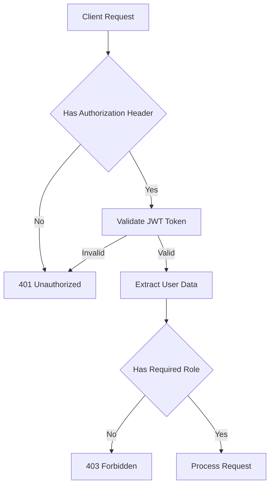

# External Integrations API

<cite>
**Referenced Files in This Document**   
- [external-integration.controller.ts](file://apps/backend/src/modules/external/external-integration.controller.ts)
- [external-integration.service.ts](file://apps/backend/src/modules/external/external-integration.service.ts)
- [integration-health.interface.ts](file://apps/backend/src/modules/external/interfaces/integration-health.interface.ts)
- [cer.controller.ts](file://apps/backend/src/modules/cer/cer.controller.ts)
- [cer.service.ts](file://apps/backend/src/modules/cer/cer.service.ts)
- [cer-application.dto.ts](file://apps/backend/src/modules/cer/dto/cer-application.dto.ts)
- [cer-client.interface.ts](file://apps/backend/src/modules/cer/interfaces/cer-client.interface.ts)
- [email.service.ts](file://apps/backend/src/modules/email/email.service.ts)
- [file-storage.service.ts](file://apps/backend/src/modules/file-storage/file-storage.service.ts)
- [configuration.ts](file://apps/backend/src/config/configuration.ts)
- [roles.guard.ts](file://apps/backend/src/common/guards/roles.guard.ts)
</cite>

## Table of Contents
1. [Introduction](#introduction)
2. [Health Check Endpoints](#health-check-endpoints)
3. [CER API Integration](#cer-api-integration)
4. [Authentication and Authorization](#authentication-and-authorization)
5. [Request/Response Schemas](#requestresponse-schemas)
6. [Error Handling](#error-handling)
7. [Retry Mechanisms and Circuit Breaker Patterns](#retry-mechanisms-and-circuit-breaker-patterns)
8. [Data Transformation](#data-transformation)
9. [Common Integration Issues](#common-integration-issues)
10. [Configuration](#configuration)

## Introduction
This document provides comprehensive API documentation for external integration endpoints in the ACCU Platform. It covers health check routes, Clean Energy Regulator (CER) API integration, and connectivity with third-party systems. The documentation details HTTP methods, URL patterns, authentication mechanisms, request/response schemas, and error handling strategies for external service failures. It also explains the CER application submission process, status polling, response parsing, retry mechanisms, and circuit breaker patterns implemented in the external integration services.

**Section sources**
- [external-integration.controller.ts](file://apps/backend/src/modules/external/external-integration.controller.ts)
- [cer.controller.ts](file://apps/backend/src/modules/cer/cer.controller.ts)

## Health Check Endpoints

The health check endpoint provides status information about external integrations including CER API, email service, and file storage.

### Health Check Route

**Diagram sources**
- [external-integration.controller.ts](file://apps/backend/src/modules/external/external-integration.controller.ts)
- [external-integration.service.ts](file://apps/backend/src/modules/external/external-integration.service.ts)

**Section sources**
- [external-integration.controller.ts](file://apps/backend/src/modules/external/external-integration.controller.ts#L12-L16)
- [external-integration.service.ts](file://apps/backend/src/modules/external/external-integration.service.ts#L19-L34)

## CER API Integration

The CER API integration handles submission of ACCU applications to the Clean Energy Regulator and status polling of submitted applications.

### CER Application Submission

**Diagram sources**
- [cer.controller.ts](file://apps/backend/src/modules/cer/cer.controller.ts#L13-L17)
- [cer.service.ts](file://apps/backend/src/modules/cer/cer.service.ts#L22-L56)

### CER Status Polling

**Diagram sources**
- [cer.controller.ts](file://apps/backend/src/modules/cer/cer.controller.ts#L19-L23)
- [cer.service.ts](file://apps/backend/src/modules/cer/cer.service.ts#L69-L90)

**Section sources**
- [cer.controller.ts](file://apps/backend/src/modules/cer/cer.controller.ts#L13-L23)
- [cer.service.ts](file://apps/backend/src/modules/cer/cer.service.ts#L22-L90)

## Authentication and Authorization

External integration endpoints require JWT-based authentication and role-based authorization.

### Authentication Flow

The system uses JWT authentication with role-based access control. The `JwtAuthGuard` validates the JWT token, and the `RolesGuard` ensures the user has the required permissions.

**Section sources**
- [external-integration.controller.ts](file://apps/backend/src/modules/external/external-integration.controller.ts#L8)
- [cer.controller.ts](file://apps/backend/src/modules/cer/cer.controller.ts#L9)
- [roles.guard.ts](file://apps/backend/src/common/guards/roles.guard.ts#L14-L40)

## Request/Response Schemas

### CER Application Submission Schema

**Diagram sources**
- [cer-application.dto.ts](file://apps/backend/src/modules/cer/dto/cer-application.dto.ts#L3-L22)

### CER Application Status Response Schema

**Diagram sources**
- [cer-application.dto.ts](file://apps/backend/src/modules/cer/dto/cer-application.dto.ts#L24-L47)

### Integration Health Response Schema

**Diagram sources**
- [integration-health.interface.ts](file://apps/backend/src/modules/external/interfaces/integration-health.interface.ts#L1-L14)

**Section sources**
- [cer-application.dto.ts](file://apps/backend/src/modules/cer/dto/cer-application.dto.ts#L3-L47)
- [integration-health.interface.ts](file://apps/backend/src/modules/external/interfaces/integration-health.interface.ts#L1-L14)

## Error Handling

The system implements comprehensive error handling for external service failures.

### External Service Error Handling

When external service calls fail, the system catches exceptions and throws appropriate HTTP exceptions with 5xx status codes. The `CerService` specifically handles CER API errors by throwing `HttpException` with `BAD_GATEWAY` status.

**Section sources**
- [cer.service.ts](file://apps/backend/src/modules/cer/cer.service.ts#L57-L63)
- [cer.service.ts](file://apps/backend/src/modules/cer/cer.service.ts#L92-L97)

## Retry Mechanisms and Circuit Breaker Patterns

The external integration service implements health checking with fallback mechanisms, though explicit retry and circuit breaker patterns are not implemented in the current code.

### Integration Health Check Pattern

The system checks the health of external services by validating configuration presence and attempting connectivity checks. For CER API, it verifies the API key is configured. For email, it checks SMTP configuration. For storage, it attempts to retrieve storage quota.

**Section sources**
- [external-integration.service.ts](file://apps/backend/src/modules/external/external-integration.service.ts#L19-L34)
- [external-integration.service.ts](file://apps/backend/src/modules/external/external-integration.service.ts#L37-L131)

## Data Transformation

The system handles data transformation between internal formats and external CER API formats.

### CER Data Transformation Flow

The `CerService` transforms internal application data into the format expected by the CER API and parses the response into internal DTOs. In development environments without a configured API key, mock responses are generated.

**Section sources**
- [cer.service.ts](file://apps/backend/src/modules/cer/cer.service.ts#L22-L56)
- [cer.service.ts](file://apps/backend/src/modules/cer/cer.service.ts#L104-L112)
- [cer.service.ts](file://apps/backend/src/modules/cer/cer.service.ts#L117-L128)

## Common Integration Issues

### Rate Limiting by External APIs
The system does not currently implement client-side rate limiting for external API calls. Rate limiting configuration exists in the system but is not applied to external integrations.

### Authentication Token Expiration
The CER integration uses API key authentication rather than OAuth tokens, so token expiration is not an issue. However, if the CER API were to implement token-based authentication, the system would need to handle token refresh logic.

### Data Format Incompatibilities
The system handles data format incompatibilities through the DTO transformation layer. The `SubmitCerApplicationDto` and `CerApplicationStatusResponseDto` classes validate incoming and outgoing data to ensure compatibility with the expected formats.

**Section sources**
- [cer.service.ts](file://apps/backend/src/modules/cer/cer.service.ts#L27-L29)
- [cer.service.ts](file://apps/backend/src/modules/cer/cer.service.ts#L71-L73)
- [cer-application.dto.ts](file://apps/backend/src/modules/cer/dto/cer-application.dto.ts#L3-L47)

## Configuration

External integrations are configured through environment variables and the configuration service.

### CER API Configuration
The CER API integration is configured with the following parameters:
- `CER_API_BASE_URL`: Base URL for the CER API
- `CER_API_KEY`: API key for authentication
- `CER_API_TIMEOUT`: Request timeout in milliseconds

These values are loaded via the `ConfigService` and used to configure the CER API client.

### Email Service Configuration
The email service is configured with SMTP settings:
- `EMAIL_HOST`: SMTP server host
- `EMAIL_PORT`: SMTP server port
- `EMAIL_USER`: SMTP username
- `EMAIL_PASSWORD`: SMTP password
- `EMAIL_FROM`: Default sender email address

### File Storage Configuration
File storage is configured with provider-specific settings:
- `FILE_STORAGE_PROVIDER`: Storage provider (local, s3, minio)
- `FILE_STORAGE_BUCKET`: Bucket name
- `FILE_STORAGE_ENDPOINT`: Provider endpoint
- `FILE_STORAGE_ACCESS_KEY_ID`: Access key
- `FILE_STORAGE_SECRET_ACCESS_KEY`: Secret key
- `FILE_STORAGE_REGION`: Region

**Section sources**
- [configuration.ts](file://apps/backend/src/config/configuration.ts#L51-L56)
- [email.service.ts](file://apps/backend/src/modules/email/email.service.ts#L21-L26)
- [file-storage.service.ts](file://apps/backend/src/modules/file-storage/file-storage.service.ts#L38-L58)
- [cer.service.ts](file://apps/backend/src/modules/cer/cer.service.ts#L12-L16)