# Notifications API

<cite>
**Referenced Files in This Document**   
- [notification.entity.ts](file://apps/backend/src/entities/notification.entity.ts)
- [notifications.service.ts](file://apps/backend/src/modules/notifications/notifications.service.ts)
- [notifications.module.ts](file://apps/backend/src/modules/notifications/notifications.module.ts)
- [accu-notification.service.ts](file://apps/backend/src/modules/accu/accu-notification.service.ts)
- [email.service.ts](file://apps/backend/src/modules/email/email.service.ts)
- [notification-activities.ts](file://apps/backend/src/modules/temporal/activities/notification-activities.ts)
- [accu-application-workflows.ts](file://apps/backend/src/modules/temporal/workflows/accu-application/accu-application-workflows.ts)
- [workflow.controller.ts](file://apps/backend/src/modules/temporal/workflow.controller.ts)
- [page.tsx](file://apps/frontend/src/app/accu-applications/page.tsx)
- [settings/page.tsx](file://apps/frontend/src/app/settings/page.tsx)
</cite>

## Table of Contents
1. [Introduction](#introduction)
2. [Core Components](#core-components)
3. [API Endpoints](#api-endpoints)
4. [Event-Driven Architecture](#event-driven-architecture)
5. [Notification Payloads](#notification-payloads)
6. [Frontend Implementation](#frontend-implementation)
7. [Delivery Integration](#delivery-integration)
8. [Common Issues](#common-issues)
9. [Conclusion](#conclusion)

## Introduction
The Notifications API provides a comprehensive system for managing user notifications within the ACCU platform. This API enables users to retrieve their notifications, mark them as read, and manage notification preferences across devices. The system is built on an event-driven architecture using Temporal workflows to automatically trigger notifications for ACCU application status changes, deadline reminders, and audit findings.

The notification system supports multiple delivery channels including in-app notifications, email, SMS, and webhooks. It provides both real-time capabilities through the frontend application and batch operations for administrative tasks. The API is designed to handle high volumes of notifications while maintaining performance and reliability.

**Section sources**
- [notification.entity.ts](file://apps/backend/src/entities/notification.entity.ts)
- [notifications.service.ts](file://apps/backend/src/modules/notifications/notifications.service.ts)

## Core Components

The Notifications system consists of several key components that work together to deliver a robust notification experience. The core entity is the Notification class, which defines the structure of all notifications in the system with properties such as type, channel, title, message, and metadata. The NotificationsService provides the primary business logic for creating, retrieving, and managing notifications, including methods for marking notifications as read and retrieving unread counts.

The system integrates with the Temporal workflow engine to provide event-driven notifications, where status changes in ACCU applications automatically trigger appropriate notifications. The AccuNotificationService specializes in handling notifications specific to ACCU applications, generating appropriate messages based on application status changes, deadline reminders, and document requirements.

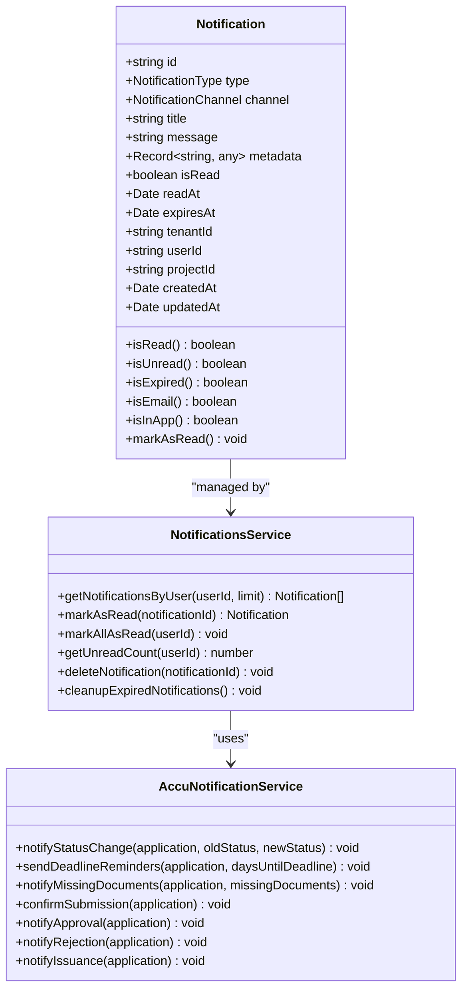

**Diagram sources **
- [notification.entity.ts](file://apps/backend/src/entities/notification.entity.ts#L28-L114)
- [notifications.service.ts](file://apps/backend/src/modules/notifications/notifications.service.ts#L19-L125)
- [accu-notification.service.ts](file://apps/backend/src/modules/accu/accu-notification.service.ts#L21-L362)

**Section sources**
- [notification.entity.ts](file://apps/backend/src/entities/notification.entity.ts#L1-L114)
- [notifications.service.ts](file://apps/backend/src/modules/notifications/notifications.service.ts#L1-L125)
- [accu-notification.service.ts](file://apps/backend/src/modules/accu/accu-notification.service.ts#L1-L362)

## API Endpoints

The Notifications API provides RESTful endpoints for managing user notifications. These endpoints require authentication via JWT tokens and appropriate permissions to access. The API supports retrieving notifications with filtering options, marking notifications as read, and managing notification preferences.

### Notification Retrieval
The API provides endpoints to retrieve user notifications with various filtering and pagination options:

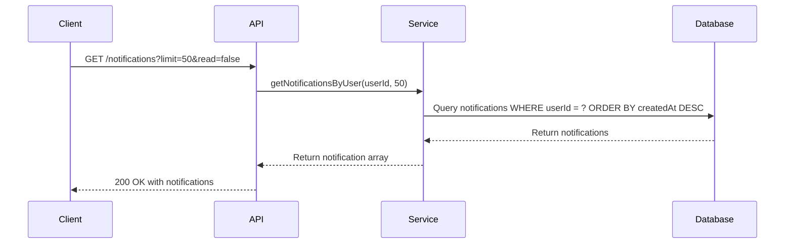

**Diagram sources **
- [notifications.service.ts](file://apps/backend/src/modules/notifications/notifications.service.ts#L40-L47)
- [workflow.controller.ts](file://apps/backend/src/modules/temporal/workflow.controller.ts#L19-L25)

### Notification Management
The API supports operations to mark notifications as read, both individually and in bulk:

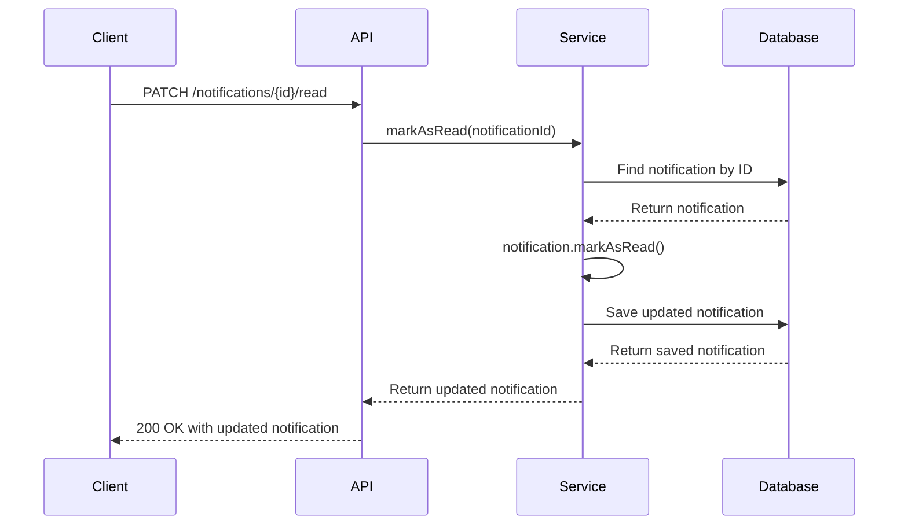

**Diagram sources **
- [notifications.service.ts](file://apps/backend/src/modules/notifications/notifications.service.ts#L53-L62)
- [workflow.controller.ts](file://apps/backend/src/modules/temporal/workflow.controller.ts#L115-L128)

### Batch Operations
The API supports batch operations for managing multiple notifications efficiently:

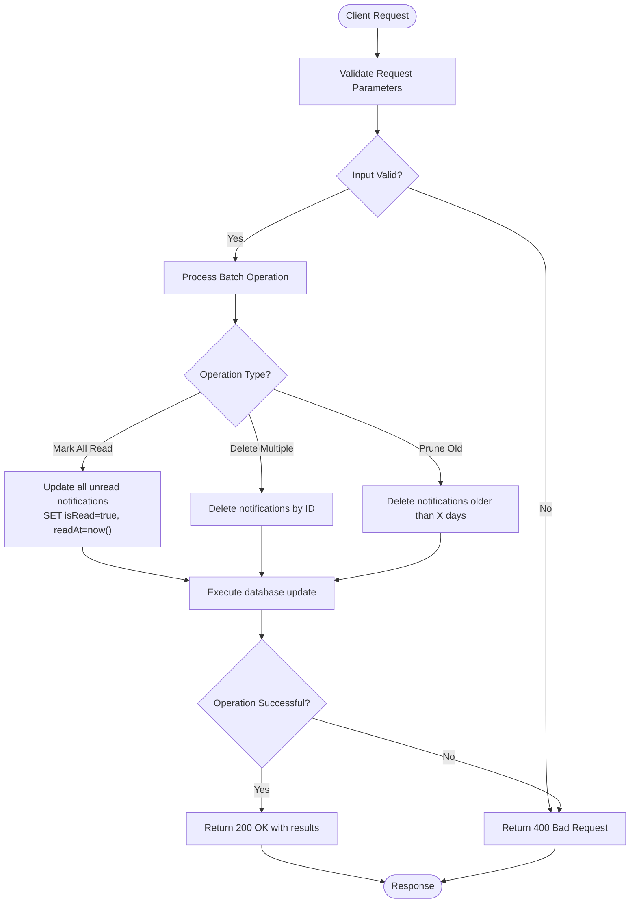

**Diagram sources **
- [notifications.service.ts](file://apps/backend/src/modules/notifications/notifications.service.ts#L68-L78)
- [notifications.unit.test.ts](file://apps/backend/test/notifications/notifications.unit.test.ts#L355-L378)

**Section sources**
- [notifications.service.ts](file://apps/backend/src/modules/notifications/notifications.service.ts#L40-L125)

## Event-Driven Architecture

The notification system is built on an event-driven architecture using Temporal workflows to automatically trigger notifications based on business events. This architecture ensures that notifications are generated consistently and reliably in response to state changes in the system.

### Temporal Workflow Integration
The ACCU application workflow uses Temporal to manage the lifecycle of ACCU applications and automatically trigger notifications at key points in the process. When an application status changes, the workflow emits signals that trigger appropriate notifications.

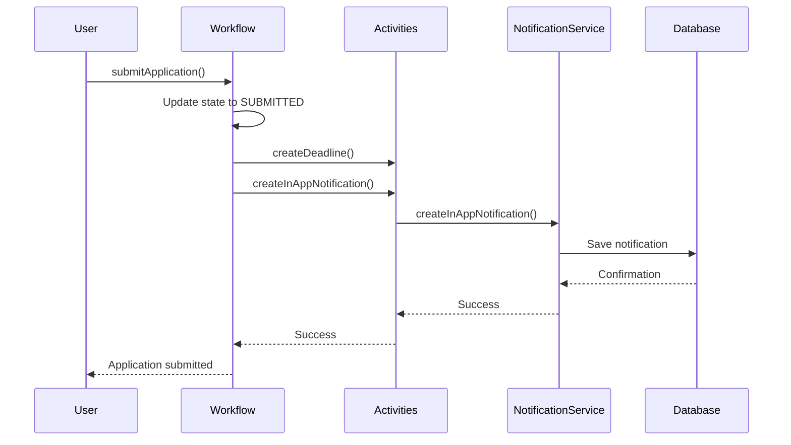

**Diagram sources **
- [accu-application-workflows.ts](file://apps/backend/src/modules/temporal/workflows/accu-application/accu-application-workflows.ts#L123-L162)
- [notification-activities.ts](file://apps/backend/src/modules/temporal/activities/notification-activities.ts#L15-L16)

### Status Change Notifications
The system automatically generates notifications when ACCU application statuses change. The workflow handles various status transitions and triggers appropriate notifications for each change:

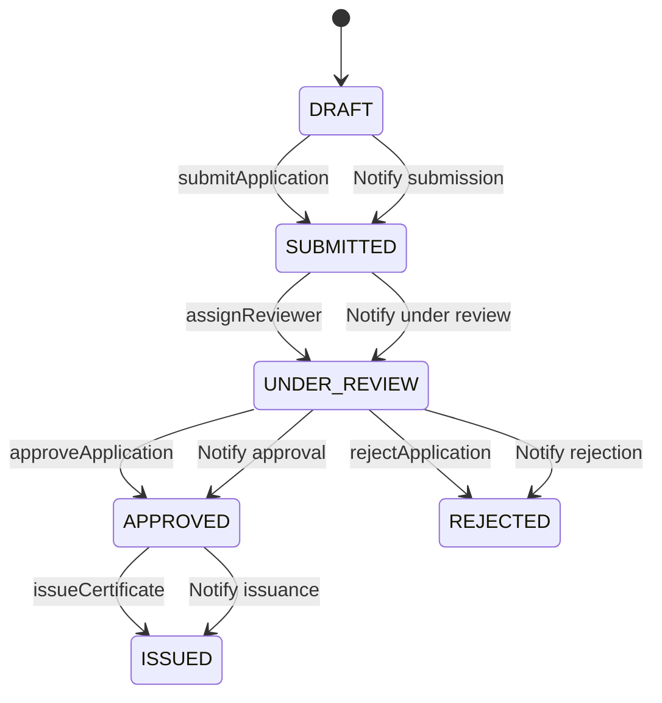

**Diagram sources **
- [accu-application-workflows.ts](file://apps/backend/src/modules/temporal/workflows/accu-application/accu-application-workflows.ts#L86-L93)
- [accu-notification.service.ts](file://apps/backend/src/modules/accu/accu-notification.service.ts#L32-L59)

**Section sources**
- [accu-application-workflows.ts](file://apps/backend/src/modules/temporal/workflows/accu-application/accu-application-workflows.ts#L1-L388)
- [notification-activities.ts](file://apps/backend/src/modules/temporal/activities/notification-activities.ts#L1-L19)

## Notification Payloads

The notification system supports rich payloads with structured metadata that provides context for each notification. The payload structure includes standard fields as well as custom metadata specific to the notification type.

### Payload Structure
The base notification payload includes essential information for display and processing:

```json
{
  "id": "uuid",
  "type": "info|warning|error|success|reminder",
  "channel": "in_app|email|sms|webhook",
  "title": "string",
  "message": "string",
  "metadata": {
    "key": "value"
  },
  "isRead": false,
  "readAt": "timestamp",
  "expiresAt": "timestamp",
  "userId": "string",
  "projectId": "string",
  "createdAt": "timestamp",
  "updatedAt": "timestamp"
}
```

### ACCU Application Notifications
Notifications related to ACCU applications include specific metadata about the application context:

```json
{
  "type": "success",
  "title": "ACCU Application Submitted",
  "message": "Your ACCU application has been successfully submitted for review.",
  "metadata": {
    "accuApplicationId": "app-123",
    "projectId": "proj-456",
    "submissionDate": "2023-01-15T10:30:00Z",
    "accuUnits": 1000,
    "methodologyId": "meth-789",
    "createdBy": "accu-system",
    "timestamp": "2023-01-15T10:30:00Z"
  }
}
```

### Deadline Reminder Notifications
Deadline reminders include urgency information and timing details:

```json
{
  "type": "warning",
  "title": "ACCU Application Deadline Reminder",
  "message": "Your ACCU application has 7 day(s) remaining until the review deadline.",
  "metadata": {
    "daysUntilDeadline": 7,
    "urgencyLevel": "warning",
    "applicationId": "app-123",
    "deadlineDate": "2023-01-22T23:59:59Z"
  }
}
```

**Section sources**
- [notification.entity.ts](file://apps/backend/src/entities/notification.entity.ts#L13-L26)
- [accu-notification.service.ts](file://apps/backend/src/modules/accu/accu-notification.service.ts#L8-L18)

## Frontend Implementation

The frontend implementation provides a user-friendly interface for viewing and managing notifications within the ACCU platform. The implementation uses React with Next.js and integrates with the backend API to provide real-time notification capabilities.

### In-App Notification Display
The frontend displays notifications in a dedicated interface that allows users to view, filter, and manage their notifications:

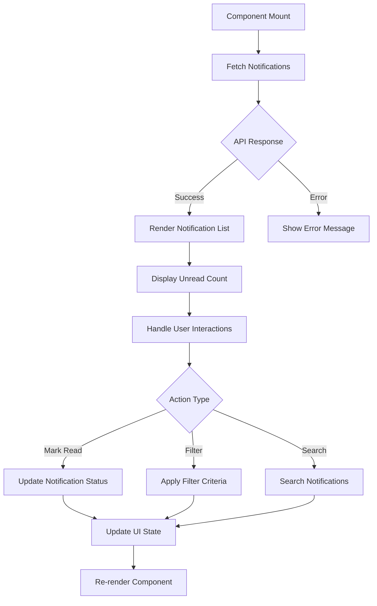

**Diagram sources **
- [page.tsx](file://apps/frontend/src/app/accu-applications/page.tsx#L39-L550)

### Notification Preferences
Users can manage their notification preferences through the settings interface, controlling which channels receive notifications:

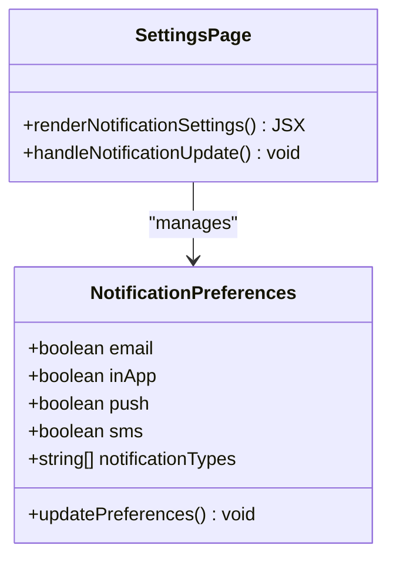

**Diagram sources **
- [settings/page.tsx](file://apps/frontend/src/app/settings/page.tsx#L574-L606)

**Section sources**
- [page.tsx](file://apps/frontend/src/app/accu-applications/page.tsx#L1-L550)
- [settings/page.tsx](file://apps/frontend/src/app/settings/page.tsx#L574-L606)

## Delivery Integration

The notification system integrates with multiple delivery channels to ensure users receive notifications through their preferred methods. The primary integration is with the email service, which handles email delivery for notifications.

### Email Service Integration
The email service is responsible for sending email notifications to users when notification channels include email:

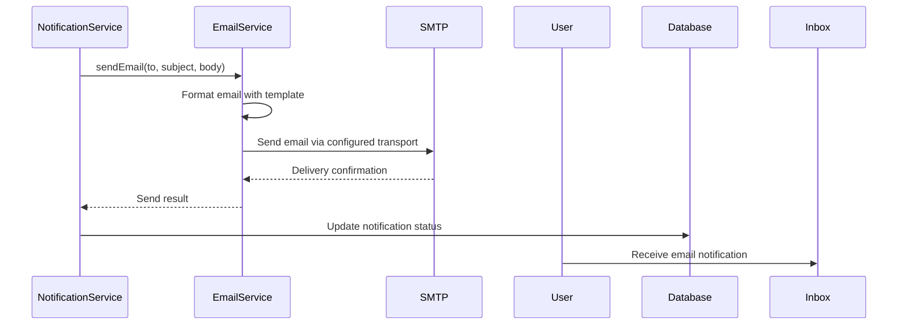

**Diagram sources **
- [email.service.ts](file://apps/backend/src/modules/email/email.service.ts#L1-L126)
- [accu-notification.service.ts](file://apps/backend/src/modules/accu/accu-notification.service.ts#L32-L59)

### Multi-Channel Delivery
The system supports multiple delivery channels through a unified interface:

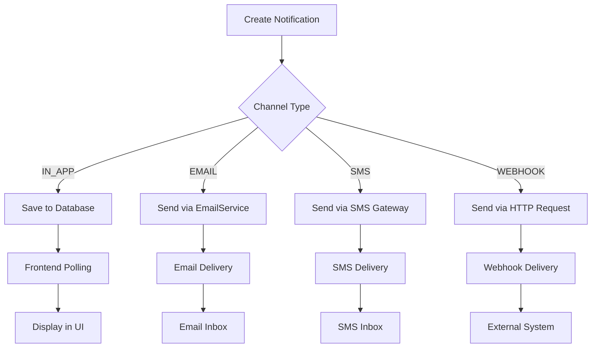

**Section sources**
- [email.service.ts](file://apps/backend/src/modules/email/email.service.ts#L1-L126)
- [notification-activities.ts](file://apps/backend/src/modules/temporal/activities/notification-activities.ts#L4-L8)

## Common Issues

The notification system addresses several common issues that can arise in production environments, including notification flooding, delivery failures, and preference synchronization.

### Notification Flooding Prevention
The system implements several strategies to prevent notification flooding:

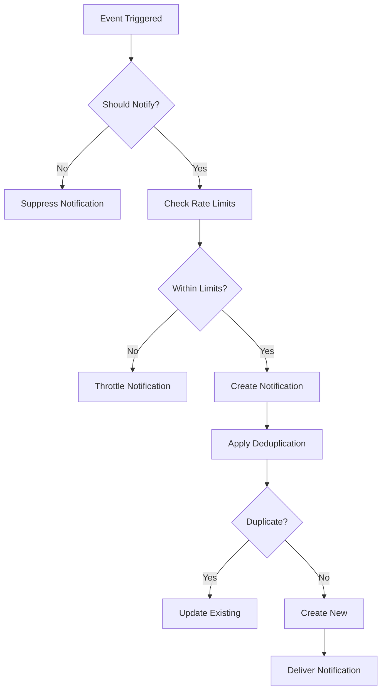

The system uses metadata-based cancellation to prevent duplicate notifications for the same event and implements rate limiting to prevent excessive notifications within short time periods.

**Section sources**
- [notifications.service.ts](file://apps/backend/src/modules/notifications/notifications.service.ts#L81-L90)
- [accu-notification.service.ts](file://apps/backend/src/modules/accu/accu-notification.service.ts#L346-L361)

### Delivery Failure Handling
The system includes robust error handling for delivery failures:

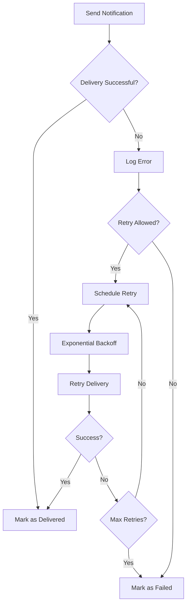

Delivery failures are logged and can be monitored through the system's monitoring tools. The system automatically retries failed deliveries with exponential backoff to handle temporary issues.

**Section sources**
- [email.service.ts](file://apps/backend/src/modules/email/email.service.ts#L59-L63)
- [notifications.service.ts](file://apps/backend/src/modules/notifications/notifications.service.ts#L34-L37)

### Preference Synchronization
Notification preferences are synchronized across devices using the user's account:

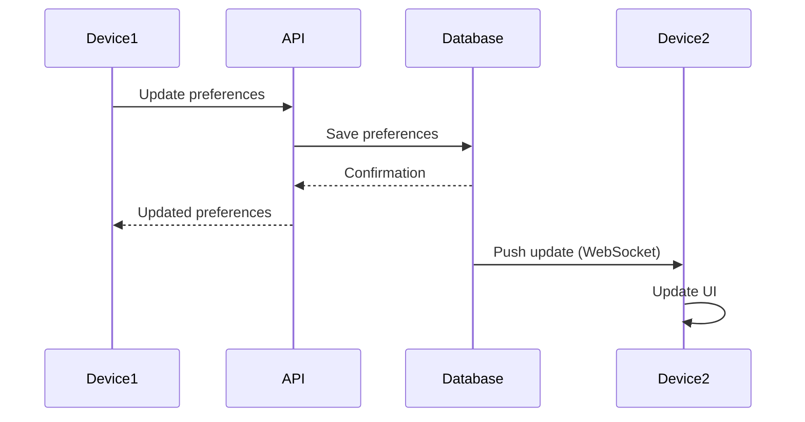

Preferences are stored in the user's profile and synchronized across all devices where the user is logged in, ensuring a consistent experience.

**Section sources**
- [settings/page.tsx](file://apps/frontend/src/app/settings/page.tsx#L574-L606)

## Conclusion
The Notifications API provides a comprehensive solution for managing user notifications within the ACCU platform. The system combines RESTful API endpoints for direct notification management with an event-driven architecture using Temporal workflows to automatically generate notifications based on business events.

Key features include support for multiple delivery channels, rich notification payloads with structured metadata, and robust error handling for delivery failures. The frontend implementation provides an intuitive interface for users to manage their notifications and preferences.

The system is designed to scale and handle high volumes of notifications while maintaining reliability and performance. By leveraging Temporal workflows, the system ensures that notifications are generated consistently and reliably in response to state changes in ACCU applications and other business entities.