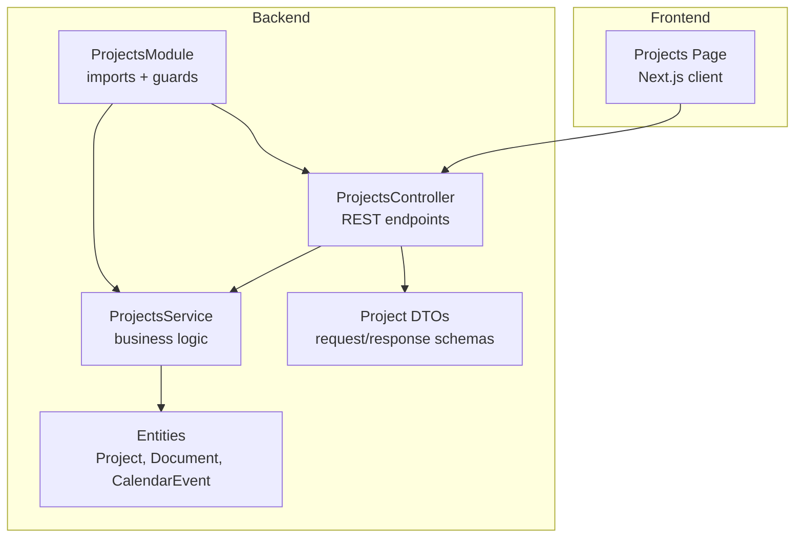
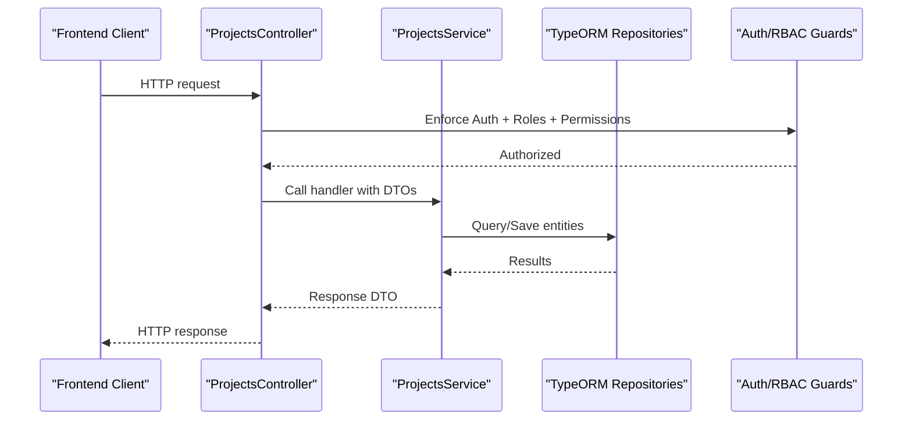
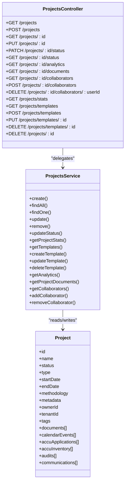

# Projects API

<cite>
**Referenced Files in This Document**
- [projects.controller.ts](file://apps/backend/src/modules/projects/projects.controller.ts)
- [projects.service.ts](file://apps/backend/src/modules/projects/projects.service.ts)
- [project.dto.ts](file://apps/backend/src/modules/projects/dto/project.dto.ts)
- [project.entity.ts](file://apps/backend/src/entities/project.entity.ts)
- [document.entity.ts](file://apps/backend/src/entities/document.entity.ts)
- [calendar-event.entity.ts](file://apps/backend/src/entities/calendar-event.entity.ts)
- [roles.guard.ts](file://apps/backend/src/common/guards/roles.guard.ts)
- [permissions.guard.ts](file://apps/backend/src/common/guards/permissions.guard.ts)
- [roles.decorator.ts](file://apps/backend/src/common/decorators/roles.decorator.ts)
- [permissions.decorator.ts](file://apps/backend/src/common/decorators/permissions.decorator.ts)
- [projects.page.tsx](file://apps/frontend/src/app/projects/page.tsx)
- [types.ts](file://packages/shared/src/types.ts)
- [projects.module.ts](file://apps/backend/src/modules/projects/projects.module.ts)
</cite>

## Table of Contents
1. [Introduction](#introduction)
2. [Project Structure](#project-structure)
3. [Core Components](#core-components)
4. [Architecture Overview](#architecture-overview)
5. [Detailed Component Analysis](#detailed-component-analysis)
6. [Dependency Analysis](#dependency-analysis)
7. [Performance Considerations](#performance-considerations)
8. [Troubleshooting Guide](#troubleshooting-guide)
9. [Conclusion](#conclusion)
10. [Appendices](#appendices)

## Introduction
This document provides comprehensive API documentation for the Projects module endpoints. It covers all RESTful routes for projects, including listing, creating, retrieving, updating, and soft-deleting projects. It also documents related endpoints for templates, collaborators, analytics, and status transitions. The document explains request/response schemas using DTOs, access control via roles and permissions, and relationships with other entities such as documents, calendar events, and ACCU applications. Frontend usage examples are included from the Next.js frontend implementation.

## Project Structure
The Projects module is implemented as a NestJS controller with a service layer and DTOs. Guards enforce authentication and authorization. Entities define the data model and relationships with other modules.

**Diagram sources**
- [projects.controller.ts](file://apps/backend/src/modules/projects/projects.controller.ts#L1-L120)
- [projects.service.ts](file://apps/backend/src/modules/projects/projects.service.ts#L1-L120)
- [projects.module.ts](file://apps/backend/src/modules/projects/projects.module.ts#L1-L39)
- [project.dto.ts](file://apps/backend/src/modules/projects/dto/project.dto.ts#L1-L120)
- [project.entity.ts](file://apps/backend/src/entities/project.entity.ts#L1-L145)
- [document.entity.ts](file://apps/backend/src/entities/document.entity.ts#L1-L157)
- [calendar-event.entity.ts](file://apps/backend/src/entities/calendar-event.entity.ts#L1-L137)
- [projects.page.tsx](file://apps/frontend/src/app/projects/page.tsx#L1-L120)

**Section sources**
- [projects.controller.ts](file://apps/backend/src/modules/projects/projects.controller.ts#L1-L120)
- [projects.service.ts](file://apps/backend/src/modules/projects/projects.service.ts#L1-L120)
- [projects.module.ts](file://apps/backend/src/modules/projects/projects.module.ts#L1-L39)

## Core Components
- ProjectsController: Exposes REST endpoints for projects, templates, collaborators, analytics, and status operations.
- ProjectsService: Implements business logic, validation, and data access against repositories.
- DTOs: Define request and response schemas for projects, templates, collaborators, and analytics.
- Guards: RolesGuard and PermissionsGuard enforce role and permission checks.
- Entities: Project, Document, CalendarEvent define relationships and computed helpers.

Key responsibilities:
- Validation and transformation via DTOs
- Access control via @Roles and @Permissions decorators
- Pagination and filtering for listing projects
- Status workflow validation and transitions
- Analytics and collaborator management

**Section sources**
- [projects.controller.ts](file://apps/backend/src/modules/projects/projects.controller.ts#L58-L173)
- [projects.service.ts](file://apps/backend/src/modules/projects/projects.service.ts#L151-L215)
- [project.dto.ts](file://apps/backend/src/modules/projects/dto/project.dto.ts#L143-L202)
- [roles.guard.ts](file://apps/backend/src/common/guards/roles.guard.ts#L1-L41)
- [permissions.guard.ts](file://apps/backend/src/common/guards/permissions.guard.ts#L1-L47)

## Architecture Overview
The Projects API follows a layered architecture:
- Controller handles HTTP requests and delegates to the service.
- Service validates inputs, enforces business rules, and interacts with repositories.
- DTOs define strict schemas for request/response bodies.
- Guards apply role and permission checks globally and per-endpoint.
- Entities encapsulate data and relationships with other modules.

**Diagram sources**
- [projects.controller.ts](file://apps/backend/src/modules/projects/projects.controller.ts#L58-L173)
- [projects.service.ts](file://apps/backend/src/modules/projects/projects.service.ts#L151-L215)
- [roles.guard.ts](file://apps/backend/src/common/guards/roles.guard.ts#L1-L41)
- [permissions.guard.ts](file://apps/backend/src/common/guards/permissions.guard.ts#L1-L47)

## Detailed Component Analysis

### Endpoint: GET /projects
- Method: GET
- URL: /projects
- Description: Retrieve paginated and filtered list of projects.
- Authentication: JWT required (AuthGuard)
- Authorization: Roles: admin, super_admin, manager, user; Permission: projects.read
- Query parameters (ProjectQueryDto):
  - page: number (default 1, min 1)
  - limit: number (default 10, min 1, max 100)
  - search: string (name/description ILIKE)
  - status: enum (draft, active, on_hold, completed, cancelled)
  - type: enum (methodology, audit, compliance, research)
  - ownerId: UUID
  - tenantId: UUID
  - tags: string[]
  - startDateFrom/To: date strings
  - endDateFrom/To: date strings
  - sortBy: string (allowed fields: name, status, type, startDate, endDate, createdAt, updatedAt)
  - sortOrder: ASC | DESC (default DESC)
- Response: ProjectsPaginatedResponseDto
  - data: ProjectResponseDto[]
  - meta: pagination metadata (page, limit, total, totalPages, hasNext, hasPrev)

Success example (JSON):
{
  "data": [
    {
      "id": "string",
      "name": "string",
      "description": "string",
      "status": "draft|active|on_hold|completed|cancelled",
      "type": "methodology|audit|compliance|research",
      "startDate": "date-time",
      "endDate": "date-time",
      "methodology": { "id": "string", "name": "string", "version": "string", "url": "string", "requirements": {} },
      "metadata": {},
      "owner": { "id": "string", "firstName": "string", "lastName": "string", "email": "string" },
      "tenantId": "string",
      "tags": ["string"],
      "createdAt": "date-time",
      "updatedAt": "date-time",
      "duration": 0,
      "isActive": true,
      "isCompleted": true,
      "isOnHold": true,
      "isDraft": true
    }
  ],
  "meta": {
    "page": 1,
    "limit": 10,
    "total": 1,
    "totalPages": 1,
    "hasNext": false,
    "hasPrev": false
  }
}

Error responses:
- 400: Invalid query parameters
- 401: Unauthorized (missing/invalid JWT)
- 403: Insufficient role or permission

Frontend usage example:
- The frontend page constructs query params (page, limit, sort, order, search, status, type) and calls GET /projects.

**Section sources**
- [projects.controller.ts](file://apps/backend/src/modules/projects/projects.controller.ts#L74-L85)
- [project.dto.ts](file://apps/backend/src/modules/projects/dto/project.dto.ts#L266-L342)
- [projects.service.ts](file://apps/backend/src/modules/projects/projects.service.ts#L220-L322)
- [projects.page.tsx](file://apps/frontend/src/app/projects/page.tsx#L63-L81)

### Endpoint: POST /projects
- Method: POST
- URL: /projects
- Description: Create a new project.
- Authentication: JWT required
- Authorization: Roles: admin, super_admin, manager, user; Permission: projects.write
- Request body: ProjectCreateDto
  - name: string (required)
  - description: string (optional)
  - type: enum (required)
  - startDate: date-time (required)
  - endDate: date-time (optional)
  - methodology: MethodologyDto (optional)
  - metadata: object (optional)
  - templateId: UUID (optional)
  - ownerId: UUID (optional)
  - tenantId: UUID (optional)
  - tags: string[] (optional)
- Response: ProjectResponseDto (201)

Validation rules:
- Owner resolution: If ownerId provided, must exist; otherwise current user becomes owner.
- Template application: If templateId provided, applies methodology defaults and metadata.
- Methodology validation: Requires id, name, version; type-specific requirements enforced.
- Status initialized to draft.

Success example (JSON):
{
  "id": "string",
  "name": "string",
  "description": "string",
  "status": "draft",
  "type": "audit|compliance|research|methodology",
  "startDate": "date-time",
  "endDate": "date-time",
  "methodology": { "id": "string", "name": "string", "version": "string", "url": "string", "requirements": {} },
  "metadata": {},
  "owner": { "id": "string", "firstName": "string", "lastName": "string", "email": "string" },
  "tenantId": "string",
  "tags": ["string"],
  "createdAt": "date-time",
  "updatedAt": "date-time",
  "duration": 0,
  "isActive": false,
  "isCompleted": false,
  "isOnHold": false,
  "isDraft": true
}

Error responses:
- 400: Invalid project data (validation failure)
- 401: Unauthorized
- 403: Insufficient role or permission
- 404: Owner user not found

**Section sources**
- [projects.controller.ts](file://apps/backend/src/modules/projects/projects.controller.ts#L58-L73)
- [project.dto.ts](file://apps/backend/src/modules/projects/dto/project.dto.ts#L143-L202)
- [projects.service.ts](file://apps/backend/src/modules/projects/projects.service.ts#L151-L215)

### Endpoint: GET /projects/:id
- Method: GET
- URL: /projects/:id
- Description: Retrieve a single project by ID.
- Authentication: JWT required
- Authorization: Roles: admin, super_admin, manager, user; Permission: projects.read
- Path param: id (UUID)
- Response: ProjectResponseDto

Success example (JSON):
{
  "id": "string",
  "name": "string",
  "description": "string",
  "status": "draft|active|on_hold|completed|cancelled",
  "type": "methodology|audit|compliance|research",
  "startDate": "date-time",
  "endDate": "date-time",
  "methodology": { "id": "string", "name": "string", "version": "string", "url": "string", "requirements": {} },
  "metadata": {},
  "owner": { "id": "string", "firstName": "string", "lastName": "string", "email": "string" },
  "tenantId": "string",
  "tags": ["string"],
  "createdAt": "date-time",
  "updatedAt": "date-time",
  "duration": 0,
  "isActive": true,
  "isCompleted": true,
  "isOnHold": true,
  "isDraft": true
}

Error responses:
- 401: Unauthorized
- 403: Insufficient role or permission
- 404: Project not found

**Section sources**
- [projects.controller.ts](file://apps/backend/src/modules/projects/projects.controller.ts#L141-L154)
- [projects.service.ts](file://apps/backend/src/modules/projects/projects.service.ts#L324-L338)

### Endpoint: PUT /projects/:id
- Method: PUT
- URL: /projects/:id
- Description: Update an existing project.
- Authentication: JWT required
- Authorization: Roles: admin, super_admin, manager, user; Permission: projects.write
- Path param: id (UUID)
- Request body: ProjectUpdateDto
  - name, description, type, startDate, endDate, methodology, metadata, tags
- Response: ProjectResponseDto

Validation rules:
- Methodology validation if provided.
- Dates converted to Date objects.

Error responses:
- 400: Invalid update data
- 401: Unauthorized
- 403: Insufficient role or permission
- 404: Project not found

**Section sources**
- [projects.controller.ts](file://apps/backend/src/modules/projects/projects.controller.ts#L156-L173)
- [project.dto.ts](file://apps/backend/src/modules/projects/dto/project.dto.ts#L204-L248)
- [projects.service.ts](file://apps/backend/src/modules/projects/projects.service.ts#L340-L367)

### Endpoint: PATCH /projects/:id/status
- Method: PATCH
- URL: /projects/:id/status
- Description: Update project status with workflow validation.
- Authentication: JWT required
- Authorization: Roles: admin, super_admin, manager, user; Permission: projects.write
- Path param: id (UUID)
- Request body: ProjectStatusUpdateDto
  - status: enum (draft, active, on_hold, completed, cancelled)
  - reason: string (optional)
  - notes: string (optional)
- Response: ProjectResponseDto

Workflow validation:
- Allowed transitions: draft -> active|cancelled; active -> on_hold|completed|cancelled; on_hold -> active|cancelled; completed/cancelled are terminal.
- Activation validation: requires name, type, startDate; audit requires methodology.
- Completion validation: requires at least one document for audit projects and an end date.

Error responses:
- 400: Invalid status transition or validation failure
- 401: Unauthorized
- 403: Insufficient role or permission
- 404: Project not found

**Section sources**
- [projects.controller.ts](file://apps/backend/src/modules/projects/projects.controller.ts#L175-L193)
- [project.dto.ts](file://apps/backend/src/modules/projects/dto/project.dto.ts#L250-L264)
- [projects.service.ts](file://apps/backend/src/modules/projects/projects.service.ts#L387-L436)

### Endpoint: GET /projects/:id/status
- Method: GET
- URL: /projects/:id/status
- Description: Get project status information including allowed transitions, progress, and overdue status.
- Authentication: JWT required
- Authorization: Roles: admin, super_admin, manager, user; Permission: projects.read
- Path param: id (UUID)
- Response: object with fields:
  - id, status, canActivate, canComplete, canCancel, allowedTransitions[], progress (0–100), isOverdue, daysUntilDeadline

Computed logic:
- allowedTransitions based on current status
- progress: 0 for draft, 25 for active/on_hold, 100 for completed
- isOverdue and daysUntilDeadline computed from endDate

**Section sources**
- [projects.controller.ts](file://apps/backend/src/modules/projects/projects.controller.ts#L195-L247)
- [projects.service.ts](file://apps/backend/src/modules/projects/projects.service.ts#L387-L436)

### Endpoint: GET /projects/:id/analytics
- Method: GET
- URL: /projects/:id/analytics
- Description: Get project analytics and metrics.
- Authentication: JWT required
- Authorization: Roles: admin, super_admin, manager, user; Permission: projects.read
- Path param: id (UUID)
- Response: ProjectAnalyticsDto

Analytics fields:
- id, name, status, type, duration, progress, documentsCount, collaboratorsCount, milestonesCount, completedMilestonesCount, daysUntilDeadline, isOverdue, owner, createdAt, updatedAt

**Section sources**
- [projects.controller.ts](file://apps/backend/src/modules/projects/projects.controller.ts#L249-L262)
- [project.dto.ts](file://apps/backend/src/modules/projects/dto/project.dto.ts#L459-L526)
- [projects.service.ts](file://apps/backend/src/modules/projects/projects.service.ts#L615-L655)

### Endpoint: GET /projects/:id/documents
- Method: GET
- URL: /projects/:id/documents
- Description: Get documents associated with a project.
- Authentication: JWT required
- Authorization: Roles: admin, super_admin, manager, user; Permission: projects.read, documents.read
- Path param: id (UUID)
- Response: Document[] (ordered by createdAt desc)

**Section sources**
- [projects.controller.ts](file://apps/backend/src/modules/projects/projects.controller.ts#L264-L277)
- [projects.service.ts](file://apps/backend/src/modules/projects/projects.service.ts#L702-L719)
- [document.entity.ts](file://apps/backend/src/entities/document.entity.ts#L1-L157)

### Endpoint: GET /projects/:id/collaborators
- Method: GET
- URL: /projects/:id/collaborators
- Description: Get collaborators for a project.
- Authentication: JWT required
- Authorization: Roles: admin, super_admin, manager, user; Permission: projects.read
- Path param: id (UUID)
- Response: ProjectCollaboratorsResponseDto
  - data: CollaboratorDto[]
  - total: number

**Section sources**
- [projects.controller.ts](file://apps/backend/src/modules/projects/projects.controller.ts#L279-L292)
- [project.dto.ts](file://apps/backend/src/modules/projects/dto/project.dto.ts#L109-L141)
- [projects.service.ts](file://apps/backend/src/modules/projects/projects.service.ts#L535-L553)

### Endpoint: POST /projects/:id/collaborators
- Method: POST
- URL: /projects/:id/collaborators
- Description: Add a collaborator to a project.
- Authentication: JWT required
- Authorization: Roles: admin, super_admin, manager; Permission: projects.write
- Path param: id (UUID)
- Request body: CollaboratorAddDto
  - collaborator: CollaboratorDto
    - userId: UUID
    - role: string
    - permissions: string[] (optional)
    - canEdit: boolean (optional)
    - canDelete: boolean (optional)
    - canManageCollaborators: boolean (optional)
- Response: ProjectCollaboratorsResponseDto

Error responses:
- 404: Project or user not found
- 409: User is already a collaborator

**Section sources**
- [projects.controller.ts](file://apps/backend/src/modules/projects/projects.controller.ts#L294-L312)
- [project.dto.ts](file://apps/backend/src/modules/projects/dto/project.dto.ts#L109-L141)
- [projects.service.ts](file://apps/backend/src/modules/projects/projects.service.ts#L555-L590)

### Endpoint: DELETE /projects/:id/collaborators/:userId
- Method: DELETE
- URL: /projects/:id/collaborators/:userId
- Description: Remove a collaborator from a project.
- Authentication: JWT required
- Authorization: Roles: admin, super_admin, manager; Permission: projects.write
- Path params: id (UUID), userId (UUID)
- Response: ProjectCollaboratorsResponseDto

**Section sources**
- [projects.controller.ts](file://apps/backend/src/modules/projects/projects.controller.ts#L314-L331)
- [projects.service.ts](file://apps/backend/src/modules/projects/projects.service.ts#L591-L613)

### Endpoint: GET /projects/stats
- Method: GET
- URL: /projects/stats
- Description: Get project statistics.
- Authentication: JWT required
- Authorization: Roles: admin, super_admin, manager; Permission: projects.read
- Query param: tenantId (optional)
- Response: object with counts and averages

**Section sources**
- [projects.controller.ts](file://apps/backend/src/modules/projects/projects.controller.ts#L87-L99)
- [projects.service.ts](file://apps/backend/src/modules/projects/projects.service.ts#L657-L700)

### Endpoint: GET /projects/templates
- Method: GET
- URL: /projects/templates
- Description: Get project templates.
- Authentication: JWT required
- Authorization: Roles: admin, super_admin, manager, user; Permission: projects.read
- Query params:
  - page: number (optional)
  - limit: number (optional)
  - type: enum (optional)
  - tags: string[] (optional)
- Response: ProjectTemplatesPaginatedResponseDto

**Section sources**
- [projects.controller.ts](file://apps/backend/src/modules/projects/projects.controller.ts#L101-L124)
- [project.dto.ts](file://apps/backend/src/modules/projects/dto/project.dto.ts#L49-L107)
- [projects.service.ts](file://apps/backend/src/modules/projects/projects.service.ts#L438-L475)

### Endpoint: POST /projects/templates
- Method: POST
- URL: /projects/templates
- Description: Create a new project template.
- Authentication: JWT required
- Authorization: Roles: admin, super_admin, manager; Permission: projects.write
- Request body: ProjectTemplateCreateDto
- Response: ProjectTemplateDto

**Section sources**
- [projects.controller.ts](file://apps/backend/src/modules/projects/projects.controller.ts#L126-L139)
- [project.dto.ts](file://apps/backend/src/modules/projects/dto/project.dto.ts#L344-L392)
- [projects.service.ts](file://apps/backend/src/modules/projects/projects.service.ts#L477-L493)

### Endpoint: PUT /projects/templates/:id
- Method: PUT
- URL: /projects/templates/:id
- Description: Update a project template.
- Authentication: JWT required
- Authorization: Roles: admin, super_admin, manager; Permission: projects.write
- Path param: id (UUID)
- Request body: ProjectTemplateUpdateDto
- Response: ProjectTemplateDto

**Section sources**
- [projects.controller.ts](file://apps/backend/src/modules/projects/projects.controller.ts#L333-L350)
- [project.dto.ts](file://apps/backend/src/modules/projects/dto/project.dto.ts#L394-L450)
- [projects.service.ts](file://apps/backend/src/modules/projects/projects.service.ts#L495-L519)

### Endpoint: DELETE /projects/templates/:id
- Method: DELETE
- URL: /projects/templates/:id
- Description: Soft delete a project template.
- Authentication: JWT required
- Authorization: Roles: admin, super_admin, manager; Permission: projects.delete
- Path param: id (UUID)
- Response: 204 No Content

**Section sources**
- [projects.controller.ts](file://apps/backend/src/modules/projects/projects.controller.ts#L352-L362)
- [projects.service.ts](file://apps/backend/src/modules/projects/projects.service.ts#L521-L533)

### Endpoint: DELETE /projects/:id
- Method: DELETE
- URL: /projects/:id
- Description: Soft delete a project (set status to cancelled).
- Authentication: JWT required
- Authorization: Roles: admin, super_admin, manager; Permission: projects.delete
- Path param: id (UUID)
- Response: 204 No Content

**Section sources**
- [projects.controller.ts](file://apps/backend/src/modules/projects/projects.controller.ts#L364-L374)
- [projects.service.ts](file://apps/backend/src/modules/projects/projects.service.ts#L369-L386)

### Convenience Endpoints
- PATCH /projects/:id/activate: Sets status to active with validation.
- PATCH /projects/:id/complete: Sets status to completed with validation.
- PATCH /projects/:id/hold: Sets status to on_hold.
- PATCH /projects/:id/resume: Resumes from on_hold to active.

All follow the same auth/permission model as PATCH /projects/:id/status.

**Section sources**
- [projects.controller.ts](file://apps/backend/src/modules/projects/projects.controller.ts#L377-L453)
- [projects.service.ts](file://apps/backend/src/modules/projects/projects.service.ts#L387-L436)

## Dependency Analysis
The Projects module depends on:
- Entities: Project, Document, CalendarEvent
- Guards: AuthGuard (JWT), RolesGuard, PermissionsGuard
- DTOs: ProjectCreateDto, ProjectUpdateDto, ProjectQueryDto, ProjectResponseDto, ProjectAnalyticsDto, ProjectCollaboratorsResponseDto, ProjectTemplate* DTOs
- Frontend: Projects page consumes /projects and related endpoints

**Diagram sources**
- [projects.controller.ts](file://apps/backend/src/modules/projects/projects.controller.ts#L58-L453)
- [projects.service.ts](file://apps/backend/src/modules/projects/projects.service.ts#L151-L800)
- [project.entity.ts](file://apps/backend/src/entities/project.entity.ts#L1-L145)

**Section sources**
- [projects.controller.ts](file://apps/backend/src/modules/projects/projects.controller.ts#L58-L453)
- [projects.service.ts](file://apps/backend/src/modules/projects/projects.service.ts#L151-L800)
- [project.entity.ts](file://apps/backend/src/entities/project.entity.ts#L1-L145)

## Performance Considerations
- Pagination: The list endpoint supports page and limit with server-side limits (max 100).
- Filtering: Uses SQL WHERE clauses with indexes on status/type and projectId for related endpoints.
- Sorting: Supports multiple fields with safe whitelist to prevent SQL injection.
- Computed fields: Analytics and status endpoints compute derived values client-side or server-side.
- Soft deletes: Projects are not physically deleted; status updates reduce query complexity.

[No sources needed since this section provides general guidance]

## Troubleshooting Guide
Common issues and resolutions:
- Validation failures (400):
  - Ensure required fields are present and formatted correctly (UUIDs, dates, enums).
  - For status updates, ensure allowed transitions and preconditions (activation requires name/type/startDate; completion requires documents/end date).
- Permission denials (403):
  - Verify user roles and permissions include projects.read/write/delete and, where applicable, documents.read.
  - Confirm JWT is attached in Authorization header.
- Not found errors (404):
  - Project, template, or user not found during collaborator add/remove or analytics retrieval.
- Data consistency:
  - Collaborator duplicates prevented; soft deletes preserve history via status transitions and metadata.

**Section sources**
- [projects.controller.ts](file://apps/backend/src/modules/projects/projects.controller.ts#L58-L173)
- [projects.service.ts](file://apps/backend/src/modules/projects/projects.service.ts#L151-L215)
- [roles.guard.ts](file://apps/backend/src/common/guards/roles.guard.ts#L1-L41)
- [permissions.guard.ts](file://apps/backend/src/common/guards/permissions.guard.ts#L1-L47)

## Conclusion
The Projects API provides a robust, secure, and extensible set of endpoints for managing projects, templates, collaborators, and analytics. Strict DTO validation, comprehensive access control, and clear status workflows ensure predictable behavior. The frontend integrates seamlessly with these endpoints to deliver a responsive user experience.

[No sources needed since this section summarizes without analyzing specific files]

## Appendices

### Access Control Details
- Guards:
  - RolesGuard: Enforces role-based access using @Roles decorator.
  - PermissionsGuard: Validates permission sets using @Permissions decorator.
- Decorators:
  - @Roles(...) and @Permissions(...) set metadata consumed by guards.
- Permissions enum (subset):
  - projects.read, projects.write, projects.delete

**Section sources**
- [roles.guard.ts](file://apps/backend/src/common/guards/roles.guard.ts#L1-L41)
- [permissions.guard.ts](file://apps/backend/src/common/guards/permissions.guard.ts#L1-L47)
- [roles.decorator.ts](file://apps/backend/src/common/decorators/roles.decorator.ts#L1-L4)
- [permissions.decorator.ts](file://apps/backend/src/common/decorators/permissions.decorator.ts#L1-L6)
- [types.ts](file://packages/shared/src/types.ts#L69-L104)

### Relationship with Other Entities
- Documents: Project has many documents; analytics include document counts; GET /projects/:id/documents lists associated documents.
- Calendar Events: Project has many calendar events; analytics include milestone counts.
- ACCU Applications and Inventory: Project has many ACCU-related entities; these are modeled in the Project entity.

**Section sources**
- [project.entity.ts](file://apps/backend/src/entities/project.entity.ts#L1-L145)
- [document.entity.ts](file://apps/backend/src/entities/document.entity.ts#L1-L157)
- [calendar-event.entity.ts](file://apps/backend/src/entities/calendar-event.entity.ts#L1-L137)

### Frontend Usage Example
- The frontend page constructs query params (page, limit, sort, order, search, status, type) and calls GET /projects.
- It performs actions (activate/pause/complete/delete) via PATCH/DELETE endpoints and reloads the list.

**Section sources**
- [projects.page.tsx](file://apps/frontend/src/app/projects/page.tsx#L63-L121)