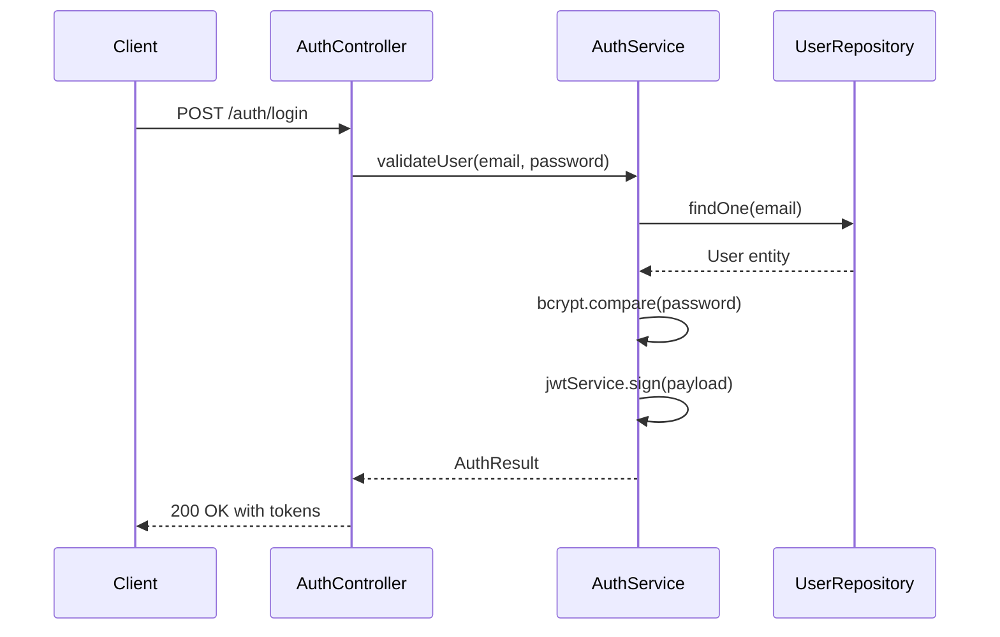
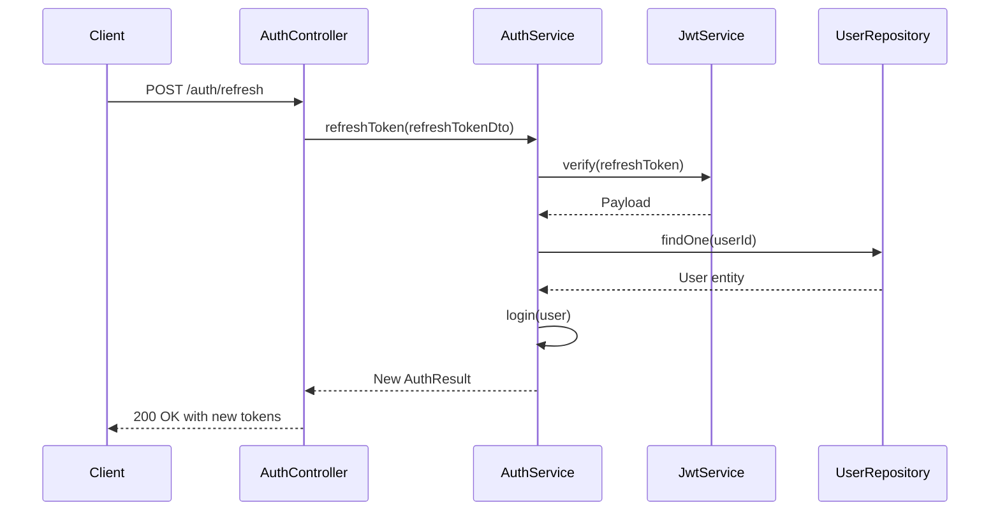
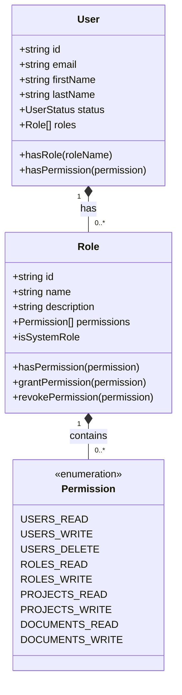
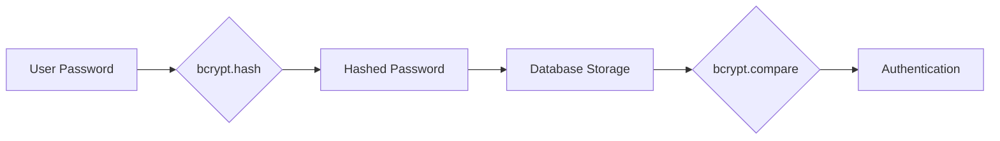
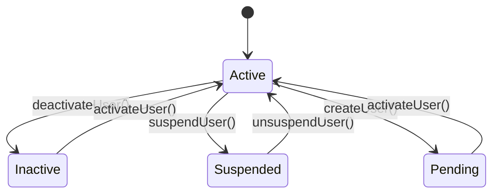

# Users & Authentication API

<cite>
**Referenced Files in This Document**   
- [auth.controller.ts](file://apps/backend/src/modules/auth/auth.controller.ts)
- [users.controller.ts](file://apps/backend/src/modules/users/users.controller.ts)
- [auth.service.ts](file://apps/backend/src/modules/auth/auth.service.ts)
- [user.entity.ts](file://apps/backend/src/entities/user.entity.ts)
- [role.entity.ts](file://apps/backend/src/entities/role.entity.ts)
- [auth-store.ts](file://apps/frontend/src/store/auth-store.ts)
- [configuration.ts](file://apps/backend/src/config/configuration.ts)
- [index.ts](file://apps/backend/src/modules/auth/dto/index.ts)
- [jwt.strategy.ts](file://apps/backend/src/modules/auth/strategies/jwt.strategy.ts)
- [jwt-refresh.strategy.ts](file://apps/backend/src/modules/auth/strategies/jwt-refresh.strategy.ts)
- [roles.guard.ts](file://apps/backend/src/common/guards/roles.guard.ts)
- [permissions.guard.ts](file://apps/backend/src/common/guards/permissions.guard.ts)
- [types.ts](file://packages/shared/src/types.ts)
</cite>

## Table of Contents
1. [Introduction](#introduction)
2. [Authentication Endpoints](#authentication-endpoints)
3. [User Management Endpoints](#user-management-endpoints)
4. [Authentication Mechanisms](#authentication-mechanisms)
5. [Request/Response Schemas](#requestresponse-schemas)
6. [Frontend Integration](#frontend-integration)
7. [Security Features](#security-features)
8. [Error Handling](#error-handling)
9. [Common Issues and Solutions](#common-issues-and-solutions)

## Introduction
The Users & Authentication API provides secure user management and authentication services for the ACCU platform. The system implements JWT-based authentication with refresh token rotation, role-based access control (RBAC), and comprehensive security measures. This documentation covers public authentication endpoints for login and registration, as well as protected user management endpoints with detailed information on request/response schemas, authentication mechanisms, and integration patterns.

## Authentication Endpoints

### POST /auth/login
Public endpoint for user authentication. Validates user credentials and returns JWT tokens.

**HTTP Method**: POST  
**URL Pattern**: /auth/login  
**Authentication**: None (public)  
**Response**: 200 OK with AuthResponseDto on success, 401 Unauthorized on invalid credentials

### POST /auth/register
Public endpoint for new user registration. Creates a new user account with hashed password.

**HTTP Method**: POST  
**URL Pattern**: /auth/register  
**Authentication**: None (public)  
**Response**: 201 Created with AuthResponseDto on success, 409 Conflict if user already exists

### POST /auth/refresh
Public endpoint for refreshing access tokens using refresh tokens. Implements token rotation.

**HTTP Method**: POST  
**URL Pattern**: /auth/refresh  
**Authentication**: Refresh token in request body  
**Response**: 200 OK with new AuthResponseDto on success, 401 Unauthorized on invalid refresh token

**Section sources**
- [auth.controller.ts](file://apps/backend/src/modules/auth/auth.controller.ts#L31-L68)
- [auth.service.ts](file://apps/backend/src/modules/auth/auth.service.ts#L142-L159)

## User Management Endpoints

### GET /users
Protected endpoint to retrieve all users with pagination and filtering. Requires appropriate roles and permissions.

**HTTP Method**: GET  
**URL Pattern**: /users  
**Authentication**: Bearer JWT token  
**Required Roles**: admin, super_admin, manager  
**Required Permissions**: USERS_READ  
**Response**: 200 OK with UsersPaginatedResponseDto on success

### POST /users
Protected endpoint to create a new user. Requires administrative privileges.

**HTTP Method**: POST  
**URL Pattern**: /users  
**Authentication**: Bearer JWT token  
**Required Roles**: admin, super_admin  
**Required Permissions**: USERS_WRITE  
**Response**: 201 Created with UserResponseDto on success, 409 Conflict if user already exists

### GET /users/:id
Protected endpoint to retrieve a specific user by ID. Access control based on roles and permissions.

**HTTP Method**: GET  
**URL Pattern**: /users/:id  
**Authentication**: Bearer JWT token  
**Required Roles**: admin, super_admin, manager  
**Required Permissions**: USERS_READ  
**Response**: 200 OK with UserResponseDto on success, 404 Not Found if user doesn't exist

### PUT /users/:id
Protected endpoint to update a user's information. Requires elevated privileges.

**HTTP Method**: PUT  
**URL Pattern**: /users/:id  
**Authentication**: Bearer JWT token  
**Required Roles**: admin, super_admin  
**Required Permissions**: USERS_WRITE  
**Response**: 200 OK with updated UserResponseDto on success, 404 Not Found if user doesn't exist

**Section sources**
- [users.controller.ts](file://apps/backend/src/modules/users/users.controller.ts#L51-L132)
- [users.controller.ts](file://apps/backend/src/modules/users/users.controller.ts#L68-L110)

## Authentication Mechanisms

### JWT Token Generation
The system implements JWT-based authentication with access and refresh tokens. When a user successfully authenticates, the system generates:

- **Access Token**: Short-lived token (15 minutes by default) for API access
- **Refresh Token**: Long-lived token (7 days by default) for token renewal

The JWT payload includes user ID, email, roles, and tenant ID for multi-tenancy support.



**Diagram sources**
- [auth.service.ts](file://apps/backend/src/modules/auth/auth.service.ts#L69-L96)
- [jwt.strategy.ts](file://apps/backend/src/modules/auth/strategies/jwt.strategy.ts#L21-L28)

### Refresh Token Rotation
The refresh token mechanism implements token rotation to enhance security. Each time a refresh token is used, a new refresh token is issued, invalidating the previous one. This prevents replay attacks and limits the window of opportunity for token theft.



**Diagram sources**
- [auth.service.ts](file://apps/backend/src/modules/auth/auth.service.ts#L142-L159)
- [jwt-refresh.strategy.ts](file://apps/backend/src/modules/auth/strategies/jwt-refresh.strategy.ts#L17-L21)

### Role-Based Access Control
The system implements a comprehensive RBAC system with roles and fine-grained permissions. The role hierarchy includes:

- **super_admin**: Full system access
- **admin**: Administrative functions
- **manager**: Team management capabilities
- **user**: Standard user access
- **auditor**: Audit-specific access
- **viewer**: Read-only access
- **guest**: Limited access

Each role has specific permissions that control access to different resources and operations.



**Diagram sources**
- [user.entity.ts](file://apps/backend/src/entities/user.entity.ts#L29-L124)
- [role.entity.ts](file://apps/backend/src/entities/role.entity.ts#L76-L133)
- [roles.guard.ts](file://apps/backend/src/common/guards/roles.guard.ts#L14-L40)

## Request/Response Schemas

### Login Request Schema
```json
{
  "email": "user@example.com",
  "password": "SecurePassword123!"
}
```

### Registration Request Schema
```json
{
  "email": "newuser@example.com",
  "firstName": "John",
  "lastName": "Doe",
  "password": "SecurePassword123!",
  "roles": ["user"],
  "tenantId": "550e8400-e29b-41d4-a716-446655440000"
}
```

### Authentication Response Schema
```json
{
  "user": {
    "id": "550e8400-e29b-41d4-a716-446655440000",
    "email": "user@example.com",
    "firstName": "John",
    "lastName": "Doe",
    "status": "active",
    "roles": [
      {
        "id": "660e8400-e29b-41d4-a716-446655440001",
        "name": "user",
        "description": "Standard user role"
      }
    ]
  },
  "accessToken": "eyJhbGciOiJIUzI1NiIsInR5cCI6IkpXVCJ9...",
  "refreshToken": "eyJhbGciOiJIUzI1NiIsInR5cCI6IkpXVCJ9...",
  "expiresIn": 900000
}
```

### User Response Schema
```json
{
  "id": "550e8400-e29b-41d4-a716-446655440000",
  "email": "user@example.com",
  "firstName": "John",
  "lastName": "Doe",
  "status": "active",
  "roles": ["user"],
  "lastLoginAt": "2023-01-01T00:00:00Z",
  "createdAt": "2023-01-01T00:00:00Z",
  "updatedAt": "2023-01-01T00:00:00Z"
}
```

**Section sources**
- [index.ts](file://apps/backend/src/modules/auth/dto/index.ts#L5-L190)
- [types.ts](file://packages/shared/src/types.ts#L55-L66)
- [user.entity.ts](file://apps/backend/src/entities/user.entity.ts#L31-L124)

## Frontend Integration

### Authentication Store
The frontend implements a Zustand-based authentication store that manages user state, tokens, and permissions. The store handles token persistence, automatic refresh, and state synchronization.

```mermaid
flowchart TD
A[Frontend App] --> B[AuthStore]
B --> C[localStorage]
B --> D[apiClient]
D --> E[Backend API]
E --> F[JWT Authentication]
F --> G[User Entity]
G --> H[Role Permissions]
B --> |login()| E
E --> |AuthResponse| B
B --> |persist user| C
B --> |set tokens| D
D --> |interceptor| E
E --> |401 Unauthorized| D
D --> |refreshAuth()| E
```

**Diagram sources**
- [auth-store.ts](file://apps/frontend/src/store/auth-store.ts#L7-L187)
- [api-client.ts](file://apps/frontend/src/lib/api-client.ts#L52-L104)

### Authentication Flow
The frontend authentication flow follows a standard pattern:

1. User submits credentials via login form
2. API client calls /auth/login endpoint
3. On success, tokens are stored in localStorage
4. User profile is retrieved and stored in the auth store
5. Subsequent requests include the access token in the Authorization header
6. When access token expires, the refresh mechanism automatically obtains new tokens

**Section sources**
- [auth-store.ts](file://apps/frontend/src/store/auth-store.ts#L28-L67)
- [api-client.ts](file://apps/frontend/src/lib/api-client.ts#L52-L66)

## Security Features

### Password Hashing
All passwords are securely hashed using bcrypt with 12 salt rounds. The hashing process occurs during user registration and password changes, ensuring that plaintext passwords are never stored in the database.



**Diagram sources**
- [auth.service.ts](file://apps/backend/src/modules/auth/auth.service.ts#L109-L110)
- [auth.service.ts](file://apps/backend/src/modules/auth/auth.service.ts#L218-L220)

### Session Management
The system implements stateless JWT-based session management with refresh token rotation. Key features include:

- Short-lived access tokens (15 minutes)
- Long-lived refresh tokens (7 days)
- Token rotation on refresh
- Automatic token refresh in frontend
- Server-side token validation

### Security Headers
The API includes standard security headers to protect against common web vulnerabilities:

- **X-Content-Type-Options**: nosniff
- **X-Frame-Options**: DENY
- **X-XSS-Protection**: 1; mode=block
- **Strict-Transport-Security**: max-age=31536000; includeSubDomains

**Section sources**
- [auth.service.ts](file://apps/backend/src/modules/auth/auth.service.ts#L109-L110)
- [configuration.ts](file://apps/backend/src/config/configuration.ts#L23-L28)
- [auth-store.ts](file://apps/frontend/src/store/auth-store.ts#L38)

## Error Handling

### Authentication Errors
The system returns standardized error responses for authentication failures:

- **401 Unauthorized**: Invalid credentials or expired/invalid tokens
- **409 Conflict**: User already exists (during registration)
- **400 Bad Request**: Invalid input data or weak passwords

### Common Error Responses
```json
// Invalid credentials
{
  "statusCode": 401,
  "message": "Invalid credentials",
  "error": "Unauthorized"
}

// User already exists
{
  "statusCode": 409,
  "message": "User with this email already exists",
  "error": "Conflict"
}

// Invalid refresh token
{
  "statusCode": 401,
  "message": "Invalid refresh token",
  "error": "Unauthorized"
}

// Insufficient permissions
{
  "statusCode": 403,
  "message": "Insufficient role permissions",
  "error": "Forbidden"
}
```

**Section sources**
- [auth.controller.ts](file://apps/backend/src/modules/auth/auth.controller.ts#L39-L40)
- [auth.controller.ts](file://apps/backend/src/modules/auth/auth.controller.ts#L52-L53)
- [auth.service.ts](file://apps/backend/src/modules/auth/auth.service.ts#L58-L59)

## Common Issues and Solutions

### Brute Force Protection
The system implements rate limiting to prevent brute force attacks. By default, users are limited to 100 requests per minute from the same IP address. This can be configured in the application settings.

### Token Theft Mitigation
To mitigate token theft risks, the system implements:

- Short access token expiration (15 minutes)
- Refresh token rotation
- HTTPS enforcement
- Secure cookie attributes
- Regular security audits

### Account Lockout Scenarios
The system handles account lockout through status management:

- **INACTIVE**: User account is disabled by admin
- **SUSPENDED**: User account is temporarily suspended
- **PENDING**: User account awaiting activation

Administrators can activate, deactivate, or suspend user accounts through the user management endpoints.



**Diagram sources**
- [user.entity.ts](file://apps/backend/src/entities/user.entity.ts#L22-L27)
- [auth.service.ts](file://apps/backend/src/modules/auth/auth.service.ts#L267-L291)
- [users.controller.ts](file://apps/backend/src/modules/users/users.controller.ts#L155-L187)