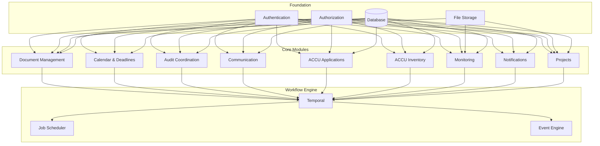
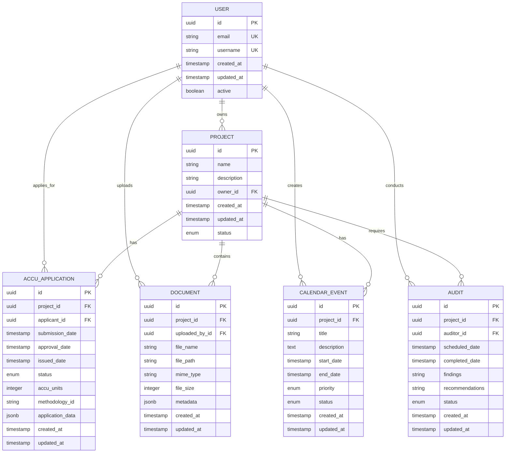
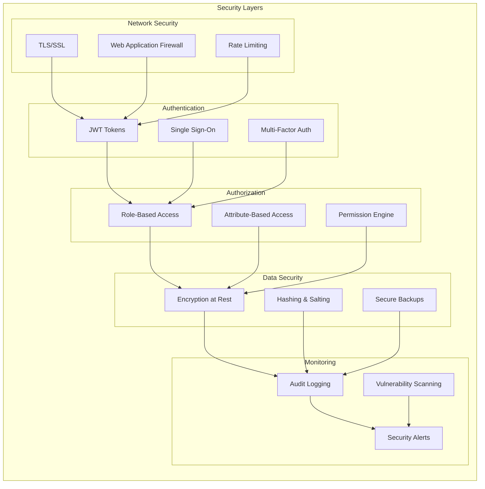
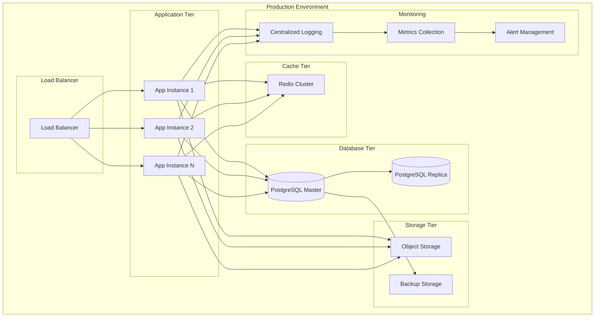

# Architecture Overview

<cite>
**Referenced Files in This Document**   
- [ACCU_Platform_Architecture_Diagram.md](file://ACCU_Platform_Architecture_Diagram.md)
- [main.ts](file://apps/backend/src/main.ts)
- [app.module.ts](file://apps/backend/src/app.module.ts)
- [temporal.module.ts](file://apps/backend/src/modules/temporal/temporal.module.ts)
- [auth.module.ts](file://apps/backend/src/modules/auth/auth.module.ts)
- [accu.module.ts](file://apps/backend/src/modules/accu/accu.module.ts)
- [projects.module.ts](file://apps/backend/src/modules/projects/projects.module.ts)
- [documents.module.ts](file://apps/backend/src/modules/documents/documents.module.ts)
- [file-storage.module.ts](file://apps/backend/src/modules/file-storage/file-storage.module.ts)
- [accu-application-workflows.ts](file://apps/backend/src/modules/temporal/workflows/accu-application/accu-application-workflows.ts)
- [project-workflows.ts](file://apps/backend/src/modules/temporal/workflows/project/project-workflows.ts)
- [docker-compose.yml](file://docker-compose.yml)
- [layout.tsx](file://apps/frontend/src/app/layout.tsx)
</cite>

## Table of Contents
1. [Introduction](#introduction)
2. [System Architecture](#system-architecture)
3. [Layered Architecture](#layered-architecture)
4. [Core Components](#core-components)
5. [Workflow Engine](#workflow-engine)
6. [Data Layer](#data-layer)
7. [External Integrations](#external-integrations)
8. [Security Architecture](#security-architecture)
9. [Deployment Architecture](#deployment-architecture)
10. [Scalability and Reliability](#scalability-and-reliability)
11. [Compliance Features](#compliance-features)

## Introduction
The ACCU Platform is a comprehensive system designed for managing Australian Carbon Credit Units (ACCU) and supporting carbon credit management workflows. The architecture follows a layered approach with clear separation of concerns, enabling scalability, reliability, and compliance with regulatory requirements. Built using modern technologies including React/Next.js for the frontend and NestJS for the backend, the platform incorporates a Temporal workflow engine to manage complex business processes. This documentation provides a detailed overview of the high-level system architecture, explaining the role of each component and their interactions across layers.

## System Architecture

```mermaid
graph TB
subgraph "Frontend Layer"
UI[React/Next.js UI]
RBAC[RBAC Frontend Components]
DASH[Dashboard & Analytics]
FORMS[Dynamic Forms]
end
subgraph "API Gateway Layer"
GATEWAY[API Gateway<br/>Rate Limiting & Auth]
AUTH[JWT Authentication]
RBAC_API[Authorization Service]
end
subgraph "Core Services Layer"
subgraph "Business Logic"
DOCS[Document Service]
CAL[Calendar Service]
AUDIT[Audit Service]
COMM[Communication Service]
ACCU_APP[ACCU Application Service]
ACCU_INV[ACCU Inventory Service]
MON[Monitoring Service]
NOTIF[Notification Service]
PROJ[Project Service]
end
subgraph "Workflow Engine"
TEMPORAL[Temporal Workflow Engine]
JOBS[Job Scheduler]
EVENTS[Event Engine]
end
subgraph "Data Services"
FILE[File Storage Service]
EMAIL[Email Service]
SEARCH[Search Service]
end
end
subgraph "Data Layer"
DB[(PostgreSQL<br/>System of Record)]
CACHE[(Redis<br/>Cache & Queues)]
STORAGE[(S3-Compatible<br/>Object Storage)]
end
subgraph "External Integrations"
CER_API[CER API]
EMAIL_SYS[Email Systems]
SENSOR[IoT Sensors]
MARKET[Market Data APIs]
CALENDAR[Calendar Systems]
end
subgraph "Infrastructure"
RAILWAY[Railway Deployment]
MONITOR[Monitoring & Logging]
BACKUP[Backup & Recovery]
SCALE[Auto-scaling]
end
%% Frontend to Gateway
UI --> GATEWAY
RBAC --> GATEWAY
DASH --> GATEWAY
FORMS --> GATEWAY
%% Gateway to Services
GATEWAY --> AUTH
GATEWAY --> RBAC_API
GATEWAY --> DOCS
GATEWAY --> CAL
GATEWAY --> AUDIT
GATEWAY --> COMM
GATEWAY --> ACCU_APP
GATEWAY --> ACCU_INV
GATEWAY --> MON
GATEWAY --> NOTIF
GATEWAY --> PROJ
%% Service to Workflow
DOCS --> TEMPORAL
CAL --> TEMPORAL
AUDIT --> TEMPORAL
COMM --> TEMPORAL
ACCU_APP --> TEMPORAL
ACCU_INV --> TEMPORAL
MON --> TEMPORAL
NOTIF --> TEMPORAL
PROJ --> TEMPORAL
TEMPORAL --> JOBS
TEMPORAL --> EVENTS
%% Services to Data
DOCS --> DB
DOCS --> STORAGE
CAL --> DB
AUDIT --> DB
COMM --> DB
COMM --> EMAIL_SYS
ACCU_APP --> DB
ACCU_INV --> DB
MON --> DB
MON --> SENSOR
NOTIF --> CACHE
PROJ --> DB
%% File and Email Services
FILE --> STORAGE
EMAIL --> EMAIL_SYS
SEARCH --> DB
%% External Integrations
COMM --> CER_API
MON --> SENSOR
ACCU_INV --> MARKET
CAL --> CALENDAR
%% Infrastructure
GATEWAY --> RAILWAY
DB --> RAILWAY
STORAGE --> RAILWAY
CACHE --> RAILWAY
TEMPORAL --> MONITOR
JOBS --> MONITOR
EVENTS --> MONITOR
DB --> BACKUP
STORAGE --> BACKUP
RAILWAY --> SCALE
```

**Diagram sources**
- [ACCU_Platform_Architecture_Diagram.md](file://ACCU_Platform_Architecture_Diagram.md)

**Section sources**
- [ACCU_Platform_Architecture_Diagram.md](file://ACCU_Platform_Architecture_Diagram.md)

## Layered Architecture

The ACCU Platform follows a layered architecture with five distinct layers: Frontend, API Gateway, Core Services, Data, and External Integrations. This separation ensures clear boundaries between components and enables independent development and scaling of each layer.

### Frontend Layer
The frontend layer is built using React and Next.js, providing a responsive and dynamic user interface for carbon credit management. It includes dashboard and analytics components, dynamic forms for data entry, and role-based access control (RBAC) components that enforce security policies at the presentation layer. The frontend communicates with the backend through the API Gateway using RESTful APIs.

**Section sources**
- [layout.tsx](file://apps/frontend/src/app/layout.tsx)

### API Gateway Layer
The API Gateway layer serves as the entry point for all client requests, providing rate limiting, authentication, and authorization services. It validates JWT tokens and enforces RBAC policies before forwarding requests to appropriate backend services. The gateway also handles CORS configuration and routes requests to the appropriate microservices based on the requested endpoint.

**Section sources**
- [main.ts](file://apps/backend/src/main.ts)
- [app.module.ts](file://apps/backend/src/app.module.ts)

### Core Services Layer
The Core Services layer contains the business logic of the application, organized into modular components. Each service handles specific domain functionality:
- Document Service: Manages document lifecycle and security
- Calendar Service: Handles deadlines and scheduling
- Audit Service: Coordinates audit processes
- Communication Service: Manages internal and external communications
- ACCU Application Service: Handles ACCU application processing
- ACCU Inventory Service: Tracks carbon credit inventory
- Monitoring Service: Collects and analyzes system metrics
- Notification Service: Manages user notifications
- Project Service: Handles project lifecycle management

These services are implemented using NestJS modules, allowing for dependency injection and loose coupling between components.

**Section sources**
- [accu.module.ts](file://apps/backend/src/modules/accu/accu.module.ts)
- [projects.module.ts](file://apps/backend/src/modules/projects/projects.module.ts)
- [documents.module.ts](file://apps/backend/src/modules/documents/documents.module.ts)

## Core Components

### React/Next.js UI
The frontend application is built with React and Next.js, providing server-side rendering for improved performance and SEO. The UI includes dynamic forms for ACCU applications, project management dashboards, document management interfaces, and calendar views for tracking deadlines. The component-based architecture allows for reusable UI elements and consistent user experience across the platform.

### API Gateway with Rate Limiting
The API Gateway implements rate limiting using NestJS ThrottlerModule to prevent abuse and ensure fair usage of system resources. It also handles JWT authentication and authorization, validating tokens and enforcing role-based access control. The gateway serves as a single entry point for all API requests, providing a consistent interface for frontend and external integrations.

### NestJS Business Services
The backend is built using NestJS, a progressive Node.js framework that provides a robust architecture for building efficient and scalable server-side applications. The business services are organized into modules that encapsulate specific domain functionality, with clear dependencies and interfaces. Each module follows the dependency injection pattern, making the code more testable and maintainable.

**Section sources**
- [app.module.ts](file://apps/backend/src/app.module.ts)
- [auth.module.ts](file://apps/backend/src/modules/auth/auth.module.ts)

## Workflow Engine

**Diagram sources**
- [ACCU_Platform_Architecture_Diagram.md](file://ACCU_Platform_Architecture_Diagram.md)
- [temporal.module.ts](file://apps/backend/src/modules/temporal/temporal.module.ts)

**Section sources**
- [temporal.module.ts](file://apps/backend/src/modules/temporal/temporal.module.ts)
- [accu-application-workflows.ts](file://apps/backend/src/modules/temporal/workflows/accu-application/accu-application-workflows.ts)
- [project-workflows.ts](file://apps/backend/src/modules/temporal/workflows/project/project-workflows.ts)

### Temporal Workflow Engine
The Temporal workflow engine is a critical component of the ACCU Platform, responsible for orchestrating complex business processes that span multiple services and require state management over time. It provides durable execution, automatic retries, and visibility into workflow state, making it ideal for managing ACCU application lifecycles, project workflows, and other long-running processes.

The workflow engine is integrated with various activities including database operations, email notifications, calendar event creation, and notification services. Workflows are defined as state machines with well-defined signals for triggering actions and queries for retrieving current state. This enables external systems to interact with running workflows and monitor their progress.

Key workflow types include:
- ACCU Application Workflow: Manages the complete lifecycle of ACCU applications from submission to issuance
- Project Workflow: Handles project lifecycle management with milestones, progress tracking, and phase transitions
- Document Workflow: Manages document review and approval processes
- Calendar Workflow: Handles deadline management and event scheduling

## Data Layer

**Diagram sources**
- [accu-application.entity.ts](file://apps/backend/src/entities/accu-application.entity.ts)
- [project.entity.ts](file://apps/backend/src/entities/project.entity.ts)
- [document.entity.ts](file://apps/backend/src/entities/document.entity.ts)
- [calendar-event.entity.ts](file://apps/backend/src/entities/calendar-event.entity.ts)
- [audit.entity.ts](file://apps/backend/src/entities/audit.entity.ts)
- [user.entity.ts](file://apps/backend/src/entities/user.entity.ts)

**Section sources**
- [accu-application.entity.ts](file://apps/backend/src/entities/accu-application.entity.ts)
- [project.entity.ts](file://apps/backend/src/entities/project.entity.ts)
- [document.entity.ts](file://apps/backend/src/entities/document.entity.ts)

The Data Layer consists of three main components: PostgreSQL as the system of record, Redis for caching and queuing, and S3-compatible object storage for file storage. PostgreSQL stores all structured data including user information, project details, ACCU applications, documents, calendar events, and audit records. Redis is used for session storage, caching frequently accessed data, and message queuing for asynchronous operations. The object storage system handles document storage, ensuring scalability and durability for large files.

## External Integrations

The ACCU Platform integrates with several external systems to extend its functionality:
- CER API: Connects to the Clean Energy Regulator system for compliance and data exchange
- Email Systems: Integrates with SMTP services for sending notifications and communications
- IoT Sensors: Connects to environmental monitoring devices for real-time data collection
- Market Data APIs: Integrates with carbon market data providers for pricing and trends
- Calendar Systems: Syncs with external calendar services for deadline management

These integrations are managed through the External Integration Service, which provides a consistent interface for communicating with external systems while handling authentication, error handling, and data transformation. The integration layer ensures that the core platform remains decoupled from external dependencies, making it easier to maintain and update integrations.

**Section sources**
- [external.module.ts](file://apps/backend/src/modules/external/external.module.ts)
- [cer.module.ts](file://apps/backend/src/modules/cer/cer.module.ts)
- [email.module.ts](file://apps/backend/src/modules/email/email.module.ts)

## Security Architecture

**Diagram sources**
- [ACCU_Platform_Architecture_Diagram.md](file://ACCU_Platform_Architecture_Diagram.md)
- [auth.module.ts](file://apps/backend/src/modules/auth/auth.module.ts)
- [main.ts](file://apps/backend/src/main.ts)

**Section sources**
- [auth.module.ts](file://apps/backend/src/modules/auth/auth.module.ts)
- [main.ts](file://apps/backend/src/main.ts)

The security architecture of the ACCU Platform is multi-layered, providing defense in depth across network, authentication, authorization, data, and monitoring layers. Network security is enforced through TLS/SSL encryption, web application firewall protection, and rate limiting to prevent denial-of-service attacks. Authentication is handled using JWT tokens with support for single sign-on and multi-factor authentication. Authorization is implemented through a combination of role-based access control (RBAC) and attribute-based access control (ABAC), allowing fine-grained permissions management.

Data security is ensured through encryption at rest for sensitive data, secure password hashing with salting, and encrypted backups. All access and modification operations are logged in audit trails, providing complete visibility into system activity. Security monitoring includes real-time alerting for suspicious activities and regular vulnerability scanning to identify and remediate potential security issues.

## Deployment Architecture

**Diagram sources**
- [ACCU_Platform_Architecture_Diagram.md](file://ACCU_Platform_Architecture_Diagram.md)
- [docker-compose.yml](file://docker-compose.yml)

**Section sources**
- [docker-compose.yml](file://docker-compose.yml)

The deployment architecture is designed for high availability and scalability, with multiple instances of the application running behind a load balancer. The application tier is horizontally scalable, allowing additional instances to be added as demand increases. The database tier uses a master-replica configuration for improved read performance and failover capabilities. Redis is deployed as a cluster for high availability and improved performance.

The monitoring stack includes centralized logging, metrics collection, and alert management, providing comprehensive visibility into system performance and health. Automated backups are performed regularly and stored securely, ensuring data durability and enabling disaster recovery. The infrastructure supports auto-scaling based on load, ensuring optimal resource utilization and cost efficiency.

## Scalability and Reliability

The ACCU Platform is designed with scalability and reliability as core principles. The architecture supports horizontal scaling of application instances, allowing the system to handle increased load by adding more instances behind the load balancer. The stateless nature of the application servers enables seamless scaling and failover.

Database performance is optimized through read replicas, connection pooling, and query optimization. Caching with Redis reduces database load and improves response times for frequently accessed data. The message queue system enables asynchronous processing of long-running operations, preventing blocking of user requests.

Reliability is ensured through multiple mechanisms:
- Database replication provides high availability and data durability
- Automated backups with point-in-time recovery enable disaster recovery
- Health checks monitor service availability and trigger automatic recovery
- Circuit breakers prevent cascading failures in distributed systems
- Retry mechanisms with exponential backoff handle transient failures

The Temporal workflow engine provides exactly-once execution semantics, ensuring that business processes are completed reliably even in the face of failures. Workflows maintain their state durably, allowing them to resume from the point of failure without duplicating work.

**Section sources**
- [docker-compose.yml](file://docker-compose.yml)
- [main.ts](file://apps/backend/src/main.ts)
- [app.module.ts](file://apps/backend/src/app.module.ts)

## Compliance Features

The ACCU Platform incorporates several features to ensure compliance with regulatory requirements for carbon credit management:

### Audit Trails
Comprehensive audit logging captures all significant operations, including user actions, data modifications, and system events. Each log entry includes timestamp, user identifier, action performed, and relevant context. Audit logs are immutable and protected from tampering, providing a reliable record for compliance audits.

### Data Integrity
Data integrity is ensured through cryptographic hashing of critical records and regular integrity checks. Digital signatures are used to verify the authenticity of documents and transactions. The system implements write-once-read-many (WORM) storage for audit-critical data, preventing modification or deletion.

### Access Control
Fine-grained access control ensures that users can only access data and functionality appropriate to their roles and responsibilities. Role-based access control (RBAC) is supplemented with attribute-based access control (ABAC) for more complex authorization scenarios. All access decisions are logged for audit purposes.

### Regulatory Reporting
The platform includes built-in reporting capabilities that generate compliance reports in standard formats required by regulatory bodies. Reports include ACCU issuance records, project performance metrics, audit findings, and carbon sequestration calculations. The reporting engine ensures data accuracy and consistency through automated validation rules.

### Data Retention
The system implements configurable data retention policies that comply with regulatory requirements. Data is automatically archived and eventually purged according to retention schedules, with appropriate notifications and approvals for data deletion.

### Security Certification
The architecture supports security certification requirements through its modular design and comprehensive security controls. The system can be configured to meet specific security standards such as ISO 27001, SOC 2, or GDPR, with appropriate documentation and evidence collection capabilities.

**Section sources**
- [audit.entity.ts](file://apps/backend/src/entities/audit.entity.ts)
- [audit-log.entity.ts](file://apps/backend/src/entities/audit-log.entity.ts)
- [auth.module.ts](file://apps/backend/src/modules/auth/auth.module.ts)
- [accu-application-workflows.ts](file://apps/backend/src/modules/temporal/workflows/accu-application/accu-application-workflows.ts)