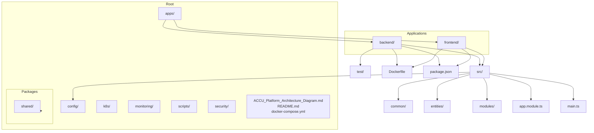
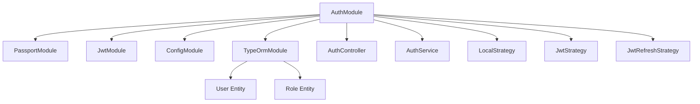
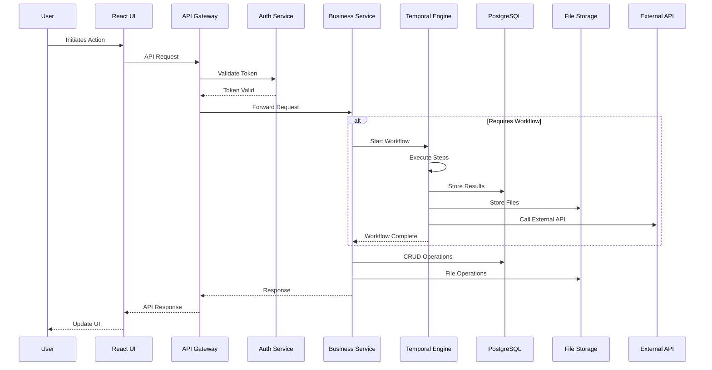
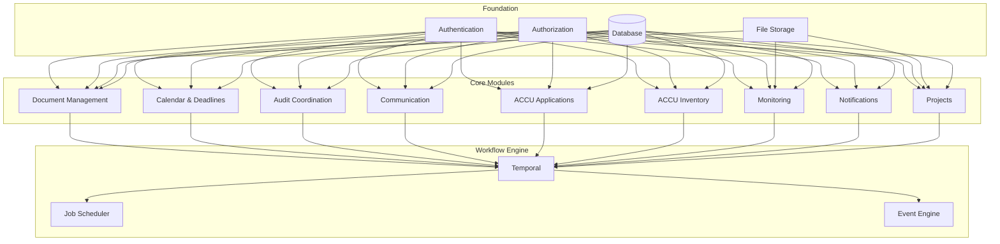
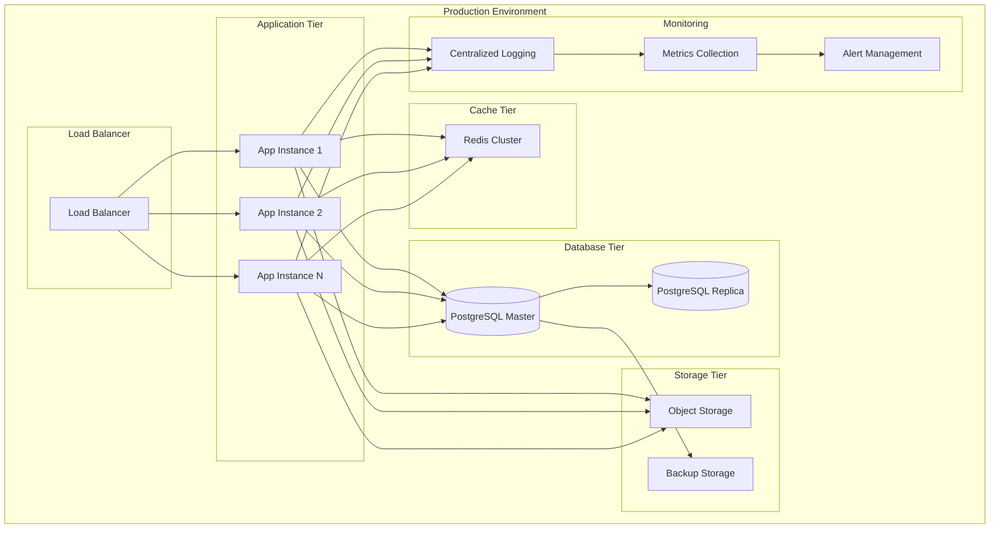

# Architecture

<cite>
**Referenced Files in This Document**   
- [app.module.ts](file://apps/backend/src/app.module.ts)
- [main.ts](file://apps/backend/src/main.ts)
- [ACCU_Platform_Architecture_Diagram.md](file://ACCU_Platform_Architecture_Diagram.md)
- [README.md](file://README.md)
- [docker-compose.yml](file://docker-compose.yml)
- [temporal.module.ts](file://apps/backend/src/modules/temporal/temporal.module.ts)
- [auth.module.ts](file://apps/backend/src/modules/auth/auth.module.ts)
- [accu.module.ts](file://apps/backend/src/modules/accu/accu.module.ts)
- [configuration.ts](file://apps/backend/src/config/configuration.ts)
- [database.config.ts](file://apps/backend/src/config/database.config.ts)
- [backend-deployment.yaml](file://k8s/backend-deployment.yaml)
- [frontend-deployment.yaml](file://k8s/frontend-deployment.yaml)
- [prometheus.yml](file://monitoring/prometheus/prometheus.yml)
</cite>

## Table of Contents
1. [Introduction](#introduction)
2. [Project Structure](#project-structure)
3. [Core Components](#core-components)
4. [Architecture Overview](#architecture-overview)
5. [Detailed Component Analysis](#detailed-component-analysis)
6. [Dependency Analysis](#dependency-analysis)
7. [Performance Considerations](#performance-considerations)
8. [Troubleshooting Guide](#troubleshooting-guide)
9. [Conclusion](#conclusion)

## Introduction
The ACCU Platform is a comprehensive system designed for managing Australian Carbon Credit Units (ACCU), providing end-to-end solutions for project management, compliance tracking, and carbon credit operations. This document outlines the high-level architecture, design patterns, system boundaries, and technical decisions that define the platform's structure and functionality. The architecture follows a modular monolith pattern with feature-based modules, enabling maintainability while supporting scalability requirements. Key architectural elements include an event-driven workflow engine using Temporal, centralized authentication via JWT tokens, and a robust API Gateway pattern for request handling and security enforcement.

## Project Structure
The ACCU Platform follows a well-organized directory structure that separates concerns and facilitates development workflows. The project is divided into applications, shared packages, configuration, and infrastructure components.

**Diagram sources**
- [ACCU_Platform_Architecture_Diagram.md](file://ACCU_Platform_Architecture_Diagram.md)
- [README.md](file://README.md)

**Section sources**
- [README.md](file://README.md)

## Core Components
The ACCU Platform consists of several core components that work together to deliver its functionality. The backend is built using NestJS, providing a structured approach to building server-side applications with TypeScript. The frontend uses Next.js 14 with React 18, enabling server-side rendering and optimized performance. The platform integrates with PostgreSQL for persistent data storage, Redis for caching and session management, and S3-compatible object storage for file management. Authentication is handled through JWT tokens with refresh token rotation, while authorization follows a role-based access control (RBAC) model. The Temporal workflow engine enables complex business processes to be orchestrated reliably, supporting long-running transactions and event-driven architectures.

**Section sources**
- [README.md](file://README.md)
- [app.module.ts](file://apps/backend/src/app.module.ts)
- [main.ts](file://apps/backend/src/main.ts)

## Architecture Overview
The ACCU Platform follows a layered architecture with clear separation of concerns between different system components. The architecture diagram illustrates the various layers and their interactions.

```mermaid
graph TB
subgraph "Frontend Layer"
UI[React/Next.js UI]
RBAC[RBAC Frontend Components]
DASH[Dashboard & Analytics]
FORMS[Dynamic Forms]
end
subgraph "API Gateway Layer"
GATEWAY[API Gateway<br/>Rate Limiting & Auth]
AUTH[JWT Authentication]
RBAC_API[Authorization Service]
end
subgraph "Core Services Layer"
subgraph "Business Logic"
DOCS[Document Service]
CAL[Calendar Service]
AUDIT[Audit Service]
COMM[Communication Service]
ACCU_APP[ACCU Application Service]
ACCU_INV[ACCU Inventory Service]
MON[Monitoring Service]
NOTIF[Notification Service]
PROJ[Project Service]
end
subgraph "Workflow Engine"
TEMPORAL[Temporal Workflow Engine]
JOBS[Job Scheduler]
EVENTS[Event Engine]
end
subgraph "Data Services"
FILE[File Storage Service]
EMAIL[Email Service]
SEARCH[Search Service]
end
end
subgraph "Data Layer"
DB[(PostgreSQL<br/>System of Record)]
CACHE[(Redis<br/>Cache & Queues)]
STORAGE[(S3-Compatible<br/>Object Storage)]
end
subgraph "External Integrations"
CER_API[CER API]
EMAIL_SYS[Email Systems]
SENSOR[IoT Sensors]
MARKET[Market Data APIs]
CALENDAR[Calendar Systems]
end
subgraph "Infrastructure"
RAILWAY[Railway Deployment]
MONITOR[Monitoring & Logging]
BACKUP[Backup & Recovery]
SCALE[Auto-scaling]
end
%% Frontend to Gateway
UI --> GATEWAY
RBAC --> GATEWAY
DASH --> GATEWAY
FORMS --> GATEWAY
%% Gateway to Services
GATEWAY --> AUTH
GATEWAY --> RBAC_API
GATEWAY --> DOCS
GATEWAY --> CAL
GATEWAY --> AUDIT
GATEWAY --> COMM
GATEWAY --> ACCU_APP
GATEWAY --> ACCU_INV
GATEWAY --> MON
GATEWAY --> NOTIF
GATEWAY --> PROJ
%% Service to Workflow
DOCS --> TEMPORAL
CAL --> TEMPORAL
AUDIT --> TEMPORAL
COMM --> TEMPORAL
ACCU_APP --> TEMPORAL
ACCU_INV --> TEMPORAL
MON --> TEMPORAL
NOTIF --> TEMPORAL
PROJ --> TEMPORAL
TEMPORAL --> JOBS
TEMPORAL --> EVENTS
%% Services to Data
DOCS --> DB
DOCS --> STORAGE
CAL --> DB
AUDIT --> DB
COMM --> DB
COMM --> EMAIL_SYS
ACCU_APP --> DB
ACCU_INV --> DB
MON --> DB
MON --> SENSOR
NOTIF --> CACHE
PROJ --> DB
%% File and Email Services
FILE --> STORAGE
EMAIL --> EMAIL_SYS
SEARCH --> DB
%% External Integrations
COMM --> CER_API
MON --> SENSOR
ACCU_INV --> MARKET
CAL --> CALENDAR
%% Infrastructure
GATEWAY --> RAILWAY
DB --> RAILWAY
STORAGE --> RAILWAY
CACHE --> RAILWAY
TEMPORAL --> MONITOR
JOBS --> MONITOR
EVENTS --> MONITOR
DB --> BACKUP
STORAGE --> BACKUP
RAILWAY --> SCALE
```

**Diagram sources**
- [ACCU_Platform_Architecture_Diagram.md](file://ACCU_Platform_Architecture_Diagram.md#L6-L139)

## Detailed Component Analysis

### Backend Application Structure
The backend application is structured as a modular monolith with feature-based modules, each encapsulating specific business capabilities. This design allows for maintainability while avoiding the complexity of microservices.

```mermaid
graph TD
AppModule[AppModule] --> AuthModule[AuthModule]
AppModule --> UsersModule[UsersModule]
AppModule --> ProjectsModule[ProjectsModule]
AppModule --> DocumentsModule[DocumentsModule]
AppModule --> CalendarModule[CalendarModule]
AppModule --> AccuModule[AccuModule]
AppModule --> AuditsModule[AuditsModule]
AppModule --> CommunicationsModule[CommunicationsModule]
AppModule --> NotificationsModule[NotificationsModule]
AppModule --> FileStorageModule[FileStorageModule]
AppModule --> EmailModule[EmailModule]
AppModule --> CerModule[CerModule]
AppModule --> ExternalModule[ExternalModule]
AppModule --> SearchModule[SearchModule]
AppModule --> ConfigModule[ConfigModule]
AppModule --> TypeOrmModule[TypeOrmModule]
AppModule --> ThrottlerModule[ThrottlerModule]
AppModule --> MulterModule[MulterModule]
```

**Diagram sources**
- [app.module.ts](file://apps/backend/src/app.module.ts#L25-L75)

**Section sources**
- [app.module.ts](file://apps/backend/src/app.module.ts#L1-L75)

### Temporal Workflow Integration
The platform utilizes Temporal as its workflow engine, enabling reliable execution of long-running business processes. The Temporal module integrates with various business services to orchestrate complex operations.

```mermaid
graph TD
TemporalModule[TemporalModule] --> AccuWorkflows[AccuApplicationWorkflowsModule]
TemporalModule --> ProjectWorkflows[ProjectWorkflowsModule]
TemporalModule --> DocumentWorkflows[DocumentWorkflowsModule]
TemporalModule --> CalendarWorkflows[CalendarWorkflowsModule]
TemporalModule --> NotificationActivities[NotificationActivitiesModule]
TemporalModule --> DatabaseActivities[DatabaseActivitiesModule]
TemporalModule --> EmailActivities[EmailActivitiesModule]
TemporalModule --> CalendarActivities[CalendarActivitiesModule]
TemporalModule --> TemporalService[TemporalService]
TemporalModule --> TemporalClient[TemporalClient]
TemporalModule --> TemporalWorker[TemporalWorker]
```

**Diagram sources**
- [temporal.module.ts](file://apps/backend/src/modules/temporal/temporal.module.ts#L19-L43)

**Section sources**
- [temporal.module.ts](file://apps/backend/src/modules/temporal/temporal.module.ts#L1-L43)

### Authentication and Authorization
The platform implements a robust authentication and authorization system using JWT tokens and Passport strategies. The AuthModule provides centralized authentication services that are consumed by other modules.

**Diagram sources**
- [auth.module.ts](file://apps/backend/src/modules/auth/auth.module.ts#L17-L44)

**Section sources**
- [auth.module.ts](file://apps/backend/src/modules/auth/auth.module.ts#L1-L44)

### Data Flow Architecture
The platform follows a consistent data flow pattern from user interaction through to data persistence and external integrations.

**Diagram sources**
- [ACCU_Platform_Architecture_Diagram.md](file://ACCU_Platform_Architecture_Diagram.md#L144-L176)

## Dependency Analysis
The platform's dependency structure reveals a well-organized architecture with clear separation of concerns and minimal circular dependencies.

**Diagram sources**
- [ACCU_Platform_Architecture_Diagram.md](file://ACCU_Platform_Architecture_Diagram.md#L237-L309)

**Section sources**
- [app.module.ts](file://apps/backend/src/app.module.ts#L25-L75)
- [temporal.module.ts](file://apps/backend/src/modules/temporal/temporal.module.ts#L19-L43)

## Performance Considerations
The ACCU Platform is designed with performance and scalability in mind. The architecture supports horizontal scaling of application instances, with load balancing distributing traffic across multiple backend instances. Caching is implemented using Redis for frequently accessed data, reducing database load and improving response times. The database layer uses PostgreSQL with master-replica configuration for read scaling and high availability. Rate limiting is enforced at the API gateway level to prevent abuse and ensure fair usage of resources. The platform also implements connection pooling and efficient query patterns to optimize database performance.

**Diagram sources**
- [ACCU_Platform_Architecture_Diagram.md](file://ACCU_Platform_Architecture_Diagram.md#L314-L372)
- [k8s/backend-deployment.yaml](file://k8s/backend-deployment.yaml#L10-L15)
- [k8s/frontend-deployment.yaml](file://k8s/frontend-deployment.yaml#L10-L15)

## Troubleshooting Guide
The platform includes comprehensive monitoring and logging capabilities to support troubleshooting and incident response. The monitoring stack consists of Prometheus for metrics collection, Grafana for visualization, and ELK (Elasticsearch, Logstash, Kibana) for log aggregation and analysis. Health checks are implemented at multiple levels, including liveness and readiness probes for Kubernetes deployments. The platform also includes structured logging with appropriate log levels and contextual information to facilitate debugging. Alerting rules are configured to notify operations teams of potential issues before they impact users.

**Section sources**
- [docker-compose.yml](file://docker-compose.yml#L129-L201)
- [monitoring/prometheus/prometheus.yml](file://monitoring/prometheus/prometheus.yml#L1-L153)
- [k8s/backend-deployment.yaml](file://k8s/backend-deployment.yaml#L120-L135)
- [k8s/frontend-deployment.yaml](file://k8s/frontend-deployment.yaml#L75-L90)

## Conclusion
The ACCU Platform architecture represents a well-balanced approach to building a complex carbon credit management system. By adopting a modular monolith design with feature-based modules, the platform achieves maintainability without the operational complexity of microservices. The integration of Temporal as a workflow engine enables reliable execution of long-running business processes, while the API Gateway pattern with centralized authentication ensures consistent security enforcement. The platform's deployment topology supports scalability and high availability, with comprehensive monitoring and logging capabilities for operational excellence. The technology stack, combining NestJS, Next.js, PostgreSQL, Redis, and Kubernetes, provides a robust foundation for current requirements and future growth.