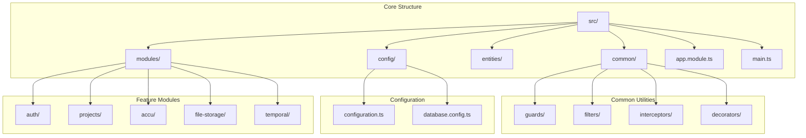
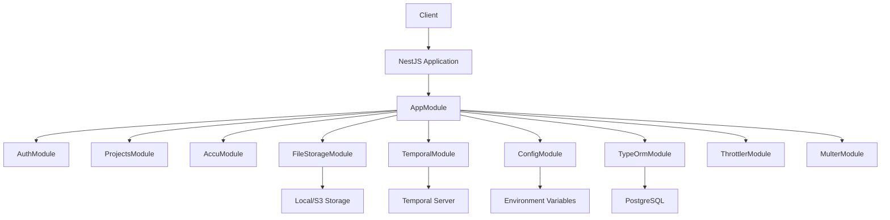
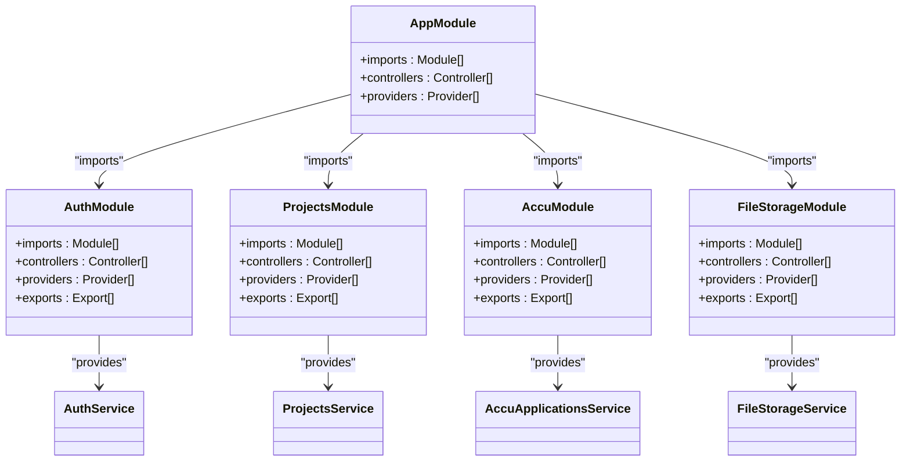
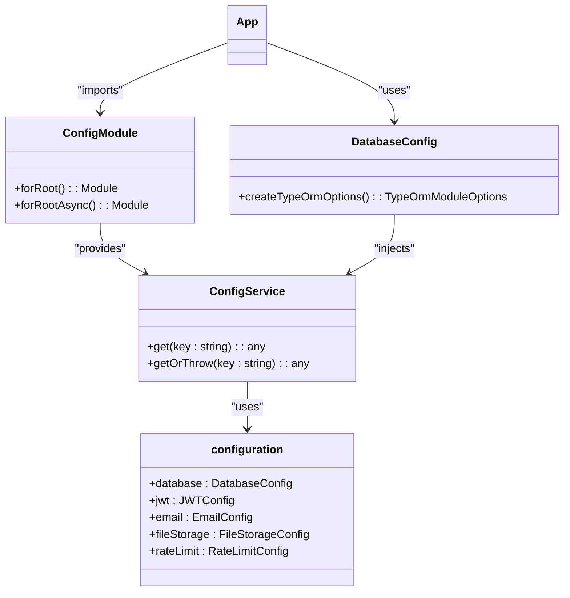
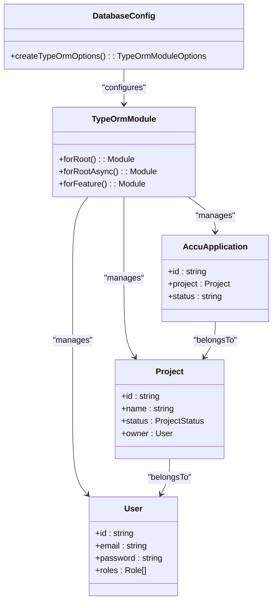
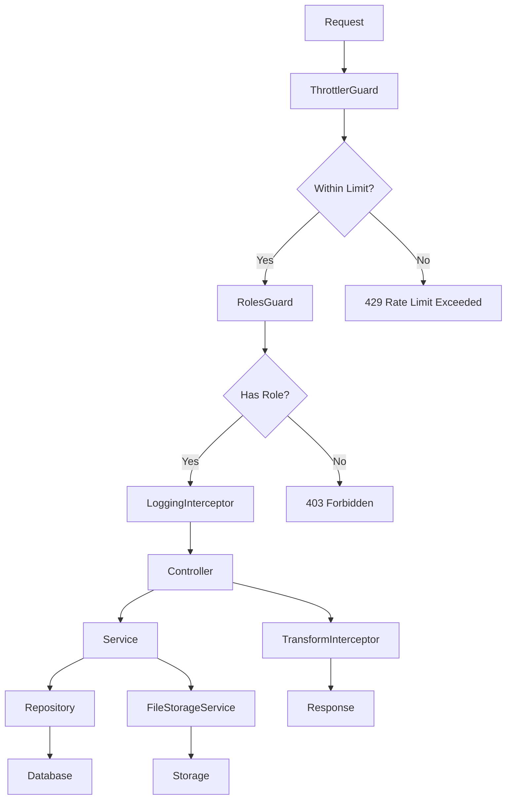
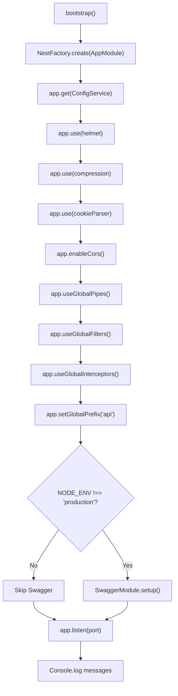
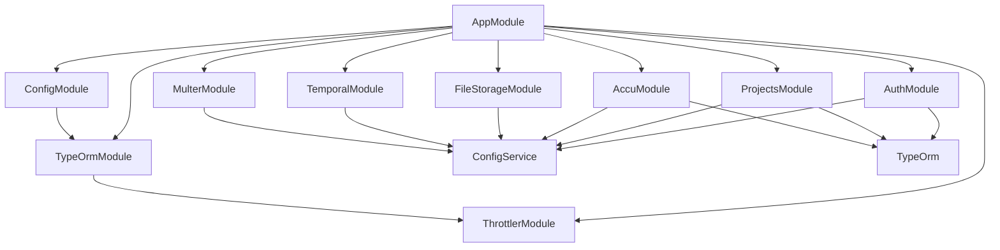

# Backend Architecture

<cite>
**Referenced Files in This Document**   
- [main.ts](file://apps/backend/src/main.ts)
- [app.module.ts](file://apps/backend/src/app.module.ts)
- [configuration.ts](file://apps/backend/src/config/configuration.ts)
- [database.config.ts](file://apps/backend/src/config/database.config.ts)
- [auth.module.ts](file://apps/backend/src/modules/auth/auth.module.ts)
- [projects.module.ts](file://apps/backend/src/modules/projects/projects.module.ts)
- [accu.module.ts](file://apps/backend/src/modules/accu/accu.module.ts)
- [file-storage.module.ts](file://apps/backend/src/modules/file-storage/file-storage.module.ts)
- [roles.guard.ts](file://apps/backend/src/common/guards/roles.guard.ts)
- [logging.interceptor.ts](file://apps/backend/src/common/interceptors/logging.interceptor.ts)
- [transform.interceptor.ts](file://apps/backend/src/common/interceptors/transform.interceptor.ts)
- [http-exception.filter.ts](file://apps/backend/src/common/filters/http-exception.filter.ts)
- [temporal.module.ts](file://apps/backend/src/modules/temporal/temporal.module.ts)
- [user.entity.ts](file://apps/backend/src/entities/user.entity.ts)
- [project.entity.ts](file://apps/backend/src/entities/project.entity.ts)
- [auth.service.ts](file://apps/backend/src/modules/auth/auth.service.ts)
- [projects.service.ts](file://apps/backend/src/modules/projects/projects.service.ts)
</cite>

## Table of Contents
1. [Introduction](#introduction)
2. [Project Structure](#project-structure)
3. [Core Components](#core-components)
4. [Architecture Overview](#architecture-overview)
5. [Detailed Component Analysis](#detailed-component-analysis)
6. [Dependency Analysis](#dependency-analysis)
7. [Performance Considerations](#performance-considerations)
8. [Troubleshooting Guide](#troubleshooting-guide)
9. [Conclusion](#conclusion)

## Introduction
The ACCU Platform backend is a NestJS application designed as a modular monolith with feature-based organization. The architecture emphasizes maintainability, feature isolation, and cohesive system integration through dependency injection, configuration management, and cross-cutting concerns. The application follows NestJS best practices with a clear separation of concerns between modules, services, controllers, and entities. This documentation provides a comprehensive overview of the backend architecture, focusing on the modular design, dependency injection system, configuration management, database integration, and cross-cutting concerns that enable the platform's functionality.

## Project Structure
The backend application follows a feature-based modular structure with clear separation of concerns. The core application resides in the `apps/backend/src` directory, organized into distinct folders for common utilities, configuration, entities, and feature modules. The `common` directory contains reusable components like guards, filters, interceptors, and decorators that implement cross-cutting concerns. The `config` directory houses configuration management with environment-specific settings. The `entities` directory contains TypeORM entities that define the data model. The `modules` directory contains feature-based modules such as AuthModule, ProjectsModule, and AccuModule, each encapsulating related functionality. This structure promotes maintainability by isolating features while maintaining cohesion through shared services and configuration.

**Diagram sources**
- [app.module.ts](file://apps/backend/src/app.module.ts)
- [main.ts](file://apps/backend/src/main.ts)

**Section sources**
- [app.module.ts](file://apps/backend/src/app.module.ts)
- [main.ts](file://apps/backend/src/main.ts)

## Core Components
The backend architecture is built around several core components that enable its functionality. The `AppModule` serves as the root module, importing and configuring all feature modules and global dependencies. The `main.ts` file contains the application bootstrap logic, setting up global configurations, middleware, and exception handling. Configuration management is handled through the `ConfigModule` and associated configuration files, providing environment-specific settings. Database integration is implemented using `TypeOrmModule` with a dedicated `DatabaseConfig` class for connection management. Cross-cutting concerns like authentication, rate limiting, and file uploads are addressed through dedicated modules and utilities. These components work together to create a cohesive system that supports the platform's requirements while maintaining modularity and maintainability.

**Section sources**
- [main.ts](file://apps/backend/src/main.ts)
- [app.module.ts](file://apps/backend/src/app.module.ts)
- [configuration.ts](file://apps/backend/src/config/configuration.ts)
- [database.config.ts](file://apps/backend/src/config/database.config.ts)

## Architecture Overview
The backend architecture follows a modular monolith design pattern with feature-based modules imported into the root `AppModule`. This approach combines the benefits of microservices (feature isolation, maintainability) with the simplicity of a monolithic deployment. The application leverages NestJS's dependency injection system to manage component relationships and promote loose coupling. Configuration is centralized through the `ConfigModule`, allowing environment-specific settings to be injected into services and modules. Database access is abstracted through TypeORM repositories, providing a clean interface for data operations. Cross-cutting concerns like authentication, rate limiting, and file handling are implemented as reusable modules that can be applied globally or to specific endpoints. The architecture supports both immediate request-response interactions and asynchronous workflows through the Temporal integration.

**Diagram sources**
- [app.module.ts](file://apps/backend/src/app.module.ts)
- [main.ts](file://apps/backend/src/main.ts)
- [database.config.ts](file://apps/backend/src/config/database.config.ts)
- [file-storage.module.ts](file://apps/backend/src/modules/file-storage/file-storage.module.ts)
- [temporal.module.ts](file://apps/backend/src/modules/temporal/temporal.module.ts)

## Detailed Component Analysis

### Module System and Dependency Injection
The application's modular architecture is centered around the `AppModule`, which imports and configures all feature modules and global dependencies. Each feature module encapsulates related functionality, including controllers, services, and entities, promoting feature isolation and maintainability. The dependency injection system manages component relationships, allowing services to be injected into controllers and other services through constructor parameters. This promotes loose coupling and makes components easier to test and maintain. The `@Injectable()` decorator marks classes as injectable providers, while the `@InjectRepository()` decorator provides access to TypeORM repositories. This pattern ensures that components receive their dependencies rather than creating them directly, enhancing flexibility and testability.

**Diagram sources**
- [app.module.ts](file://apps/backend/src/app.module.ts)
- [auth.module.ts](file://apps/backend/src/modules/auth/auth.module.ts)
- [projects.module.ts](file://apps/backend/src/modules/projects/projects.module.ts)
- [accu.module.ts](file://apps/backend/src/modules/accu/accu.module.ts)
- [file-storage.module.ts](file://apps/backend/src/modules/file-storage/file-storage.module.ts)

**Section sources**
- [app.module.ts](file://apps/backend/src/app.module.ts)
- [auth.module.ts](file://apps/backend/src/modules/auth/auth.module.ts)
- [projects.module.ts](file://apps/backend/src/modules/projects/projects.module.ts)
- [accu.module.ts](file://apps/backend/src/modules/accu/accu.module.ts)
- [file-storage.module.ts](file://apps/backend/src/modules/file-storage/file-storage.module.ts)

### Configuration Management
Configuration management is implemented through the `ConfigModule` and associated configuration files, providing a centralized and type-safe approach to environment-specific settings. The `configuration.ts` file exports a factory function that reads environment variables and returns a configuration object with typed properties for database, JWT, email, file storage, and other settings. The `DatabaseConfig` class implements the `TypeOrmOptionsFactory` interface, injecting the `ConfigService` to access configuration values and return TypeORM connection options. This approach allows configuration to be injected into any service or module that needs it, promoting consistency and reducing duplication. The configuration system supports multiple environments (development, production) through environment variable overrides and file-based configuration.

**Diagram sources**
- [app.module.ts](file://apps/backend/src/app.module.ts)
- [configuration.ts](file://apps/backend/src/config/configuration.ts)
- [database.config.ts](file://apps/backend/src/config/database.config.ts)

**Section sources**
- [configuration.ts](file://apps/backend/src/config/configuration.ts)
- [database.config.ts](file://apps/backend/src/config/database.config.ts)

### Database Integration
Database integration is implemented using TypeORM through the `TypeOrmModule`, providing a robust object-relational mapping system for PostgreSQL. The `DatabaseConfig` class implements the `TypeOrmOptionsFactory` interface, creating connection options based on configuration values. Each feature module imports `TypeOrmModule.forFeature()` with the entities it needs, ensuring that repositories are available for injection. The entity classes use TypeORM decorators to define table structure, relationships, and constraints. This approach provides a clean separation between the data access layer and business logic, making the code more maintainable and testable. The configuration supports both development and production environments, with synchronization enabled only in development for automatic schema updates.

**Diagram sources**
- [database.config.ts](file://apps/backend/src/config/database.config.ts)
- [user.entity.ts](file://apps/backend/src/entities/user.entity.ts)
- [project.entity.ts](file://apps/backend/src/entities/project.entity.ts)

**Section sources**
- [database.config.ts](file://apps/backend/src/config/database.config.ts)
- [user.entity.ts](file://apps/backend/src/entities/user.entity.ts)
- [project.entity.ts](file://apps/backend/src/entities/project.entity.ts)

### Cross-Cutting Concerns
Cross-cutting concerns are addressed through dedicated modules and utilities that can be applied globally or to specific endpoints. The `ThrottlerModule` implements rate limiting based on configuration values, protecting the application from abuse. The `MulterModule` handles file uploads, with configuration for storage location and size limits. Authentication and authorization are implemented through the `AuthModule` with JWT strategies and Passport integration. Guards, filters, and interceptors in the `common` directory handle role-based access control, exception handling, logging, and response transformation. These components are designed to be reusable across the application, ensuring consistent behavior and reducing code duplication.

**Diagram sources**
- [app.module.ts](file://apps/backend/src/app.module.ts)
- [roles.guard.ts](file://apps/backend/src/common/guards/roles.guard.ts)
- [logging.interceptor.ts](file://apps/backend/src/common/interceptors/logging.interceptor.ts)
- [transform.interceptor.ts](file://apps/backend/src/common/interceptors/transform.interceptor.ts)
- [http-exception.filter.ts](file://apps/backend/src/common/filters/http-exception.filter.ts)

**Section sources**
- [app.module.ts](file://apps/backend/src/app.module.ts)
- [roles.guard.ts](file://apps/backend/src/common/guards/roles.guard.ts)
- [logging.interceptor.ts](file://apps/backend/src/common/interceptors/logging.interceptor.ts)
- [transform.interceptor.ts](file://apps/backend/src/common/interceptors/transform.interceptor.ts)
- [http-exception.filter.ts](file://apps/backend/src/common/filters/http-exception.filter.ts)

### Startup Process and Global Configuration
The application startup process is defined in `main.ts`, which bootstraps the NestJS application and applies global configurations. The process begins by creating the application instance with the `AppModule`, then retrieving the `ConfigService` for environment-specific settings. Security middleware like Helmet and compression are applied globally, followed by CORS configuration based on environment variables. Global pipes, filters, and interceptors are registered to handle validation, exceptions, and logging consistently across all endpoints. The API prefix is set to 'api', and Swagger documentation is configured for development environments. Finally, the application listens on the configured port, with startup messages indicating the server status and documentation location.

**Diagram sources**
- [main.ts](file://apps/backend/src/main.ts)

**Section sources**
- [main.ts](file://apps/backend/src/main.ts)

## Dependency Analysis
The backend application has a well-defined dependency structure that promotes loose coupling and maintainability. The root `AppModule` imports all feature modules, creating a clear hierarchy of dependencies. Feature modules depend on shared entities and common utilities, but not on each other, ensuring feature isolation. The dependency injection system manages component relationships, with services depending on repositories and configuration rather than creating them directly. External dependencies are managed through npm packages, with clear separation between production and development dependencies. The architecture avoids circular dependencies by organizing code into distinct layers (controller, service, repository) and using forward references when necessary. This dependency structure enables independent development and testing of features while maintaining a cohesive system.

**Diagram sources**
- [app.module.ts](file://apps/backend/src/app.module.ts)
- [package.json](file://apps/backend/package.json)

**Section sources**
- [app.module.ts](file://apps/backend/src/app.module.ts)
- [package.json](file://apps/backend/package.json)

## Performance Considerations
The backend architecture incorporates several performance considerations to ensure efficient operation. Database queries are optimized through TypeORM's query builder and repository patterns, with eager loading configured where appropriate. Caching is supported through Redis configuration, though specific implementation details are not visible in the provided code. Rate limiting prevents abuse and protects server resources. Compression middleware reduces response sizes for improved network performance. The use of global interceptors for logging and transformation is designed to be non-blocking through RxJS observables. Database connection pooling is configured with a limit of 10 connections to balance resource usage and performance. The architecture supports horizontal scaling through stateless JWT authentication and externalized session storage.

**Section sources**
- [database.config.ts](file://apps/backend/src/config/database.config.ts)
- [configuration.ts](file://apps/backend/src/config/configuration.ts)
- [main.ts](file://apps/backend/src/main.ts)

## Troubleshooting Guide
When troubleshooting issues with the backend application, start by checking the console logs for startup errors or runtime exceptions. The logging interceptor provides detailed information about each request and response, including timing and status codes. For authentication issues, verify that JWT configuration values are correct and that tokens are being generated and validated properly. Database connectivity issues can be diagnosed by checking the database configuration and connection settings. Rate limiting issues may occur if the throttle settings are too restrictive for the expected traffic. File upload issues should be checked against the file storage configuration and size limits. The Swagger documentation provides a comprehensive view of available endpoints and their expected inputs and outputs, which can help identify API usage issues.

**Section sources**
- [main.ts](file://apps/backend/src/main.ts)
- [http-exception.filter.ts](file://apps/backend/src/common/filters/http-exception.filter.ts)
- [logging.interceptor.ts](file://apps/backend/src/common/interceptors/logging.interceptor.ts)
- [configuration.ts](file://apps/backend/src/config/configuration.ts)

## Conclusion
The ACCU Platform backend architecture demonstrates a well-structured NestJS application that balances modularity with cohesion. The modular monolith design with feature-based modules enables maintainability and feature isolation while operating as a cohesive system. Dependency injection promotes loose coupling and testability, while configuration management provides flexibility across environments. Database integration through TypeORM offers a robust data access layer, and cross-cutting concerns are addressed through reusable modules and utilities. The startup process applies global configurations consistently, ensuring secure and reliable operation. This architecture provides a solid foundation for the platform's functionality while supporting future growth and evolution.