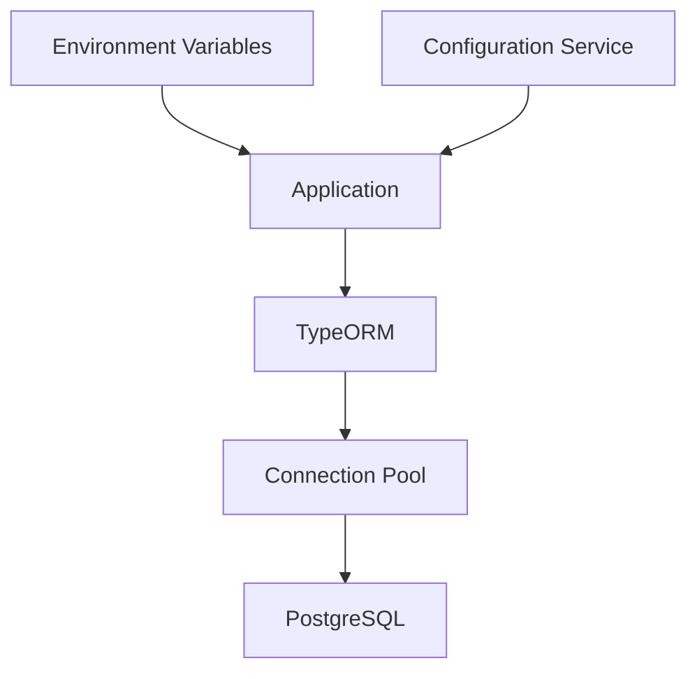
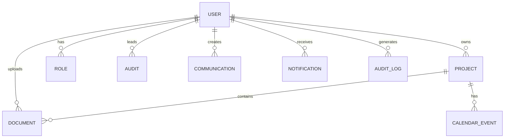
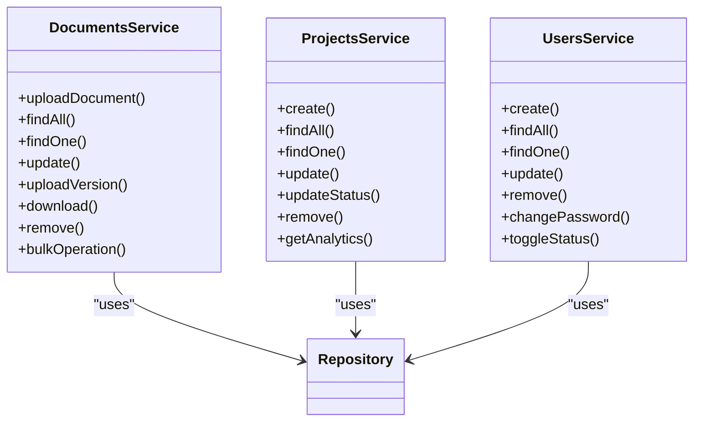
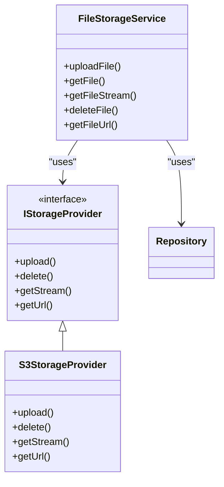
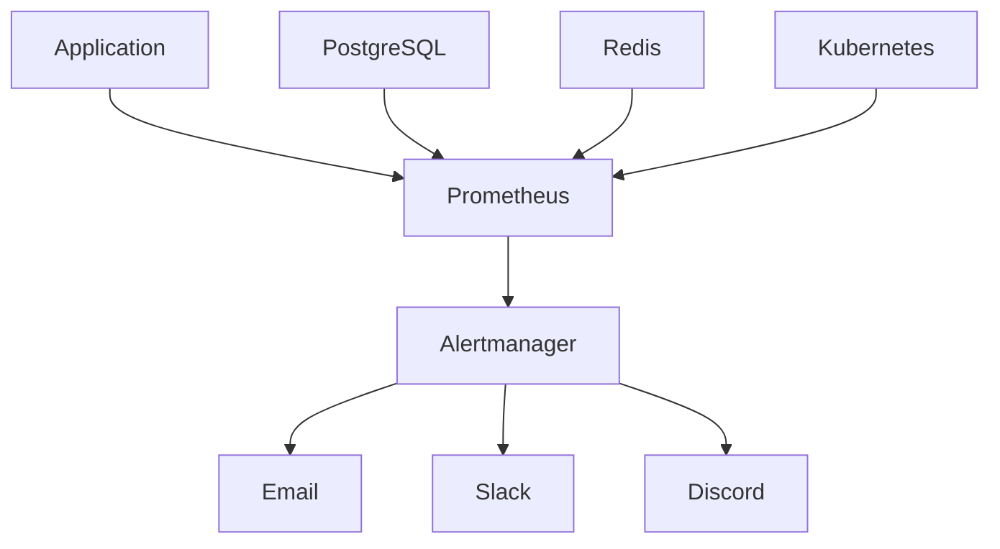

# Data Layer Architecture

<cite>
**Referenced Files in This Document**   
- [database.config.ts](file://apps/backend/src/config/database.config.ts)
- [configuration.ts](file://apps/backend/src/config/configuration.ts)
- [user.entity.ts](file://apps/backend/src/entities/user.entity.ts)
- [document.entity.ts](file://apps/backend/src/entities/document.entity.ts)
- [project.entity.ts](file://apps/backend/src/entities/project.entity.ts)
- [documents.service.ts](file://apps/backend/src/modules/documents/documents.service.ts)
- [projects.service.ts](file://apps/backend/src/modules/projects/projects.service.ts)
- [users.service.ts](file://apps/backend/src/modules/users/users.service.ts)
- [file-storage.service.ts](file://apps/backend/src/modules/file-storage/file-storage.service.ts)
- [s3-storage.provider.ts](file://apps/backend/src/modules/file-storage/providers/s3-storage.provider.ts)
- [app.module.ts](file://apps/backend/src/app.module.ts)
- [prometheus.yml](file://monitoring/prometheus/prometheus.yml)
- [alertmanager.yml](file://monitoring/alertmanager/alertmanager.yml)
</cite>

## Table of Contents
1. [Introduction](#introduction)
2. [Database Configuration](#database-configuration)
3. [Entity Schema Definition](#entity-schema-definition)
4. [Data Access Patterns](#data-access-patterns)
5. [Transaction Management](#transaction-management)
6. [Query Optimization](#query-optimization)
7. [Redis Usage](#redis-usage)
8. [S3-Compatible Storage](#s3-compatible-storage)
9. [Data Lifecycle Management](#data-lifecycle-management)
10. [Backup and Recovery](#backup-and-recovery)
11. [Monitoring and Alerting](#monitoring-and-alerting)
12. [Conclusion](#conclusion)

## Introduction

The data persistence layer of the ACCU Platform is designed to provide a robust, scalable, and secure foundation for storing and managing application data. The architecture leverages PostgreSQL as the primary relational database for structured data, Redis for caching and queuing, and S3-compatible object storage for document management. This document provides a comprehensive overview of the data layer architecture, including configuration details, data access patterns, and operational considerations.

The system uses TypeORM as the Object-Relational Mapping (ORM) framework to define and interact with the database schema. Entities are defined as TypeScript classes with decorators that map to database tables and relationships. The architecture supports multi-tenancy through tenantId fields in relevant entities, enabling data isolation between different organizations using the platform.

**Section sources**
- [app.module.ts](file://apps/backend/src/app.module.ts#L1-L75)
- [database.config.ts](file://apps/backend/src/config/database.config.ts#L1-L54)

## Database Configuration

The PostgreSQL database configuration is managed through NestJS's configuration system, with settings loaded from environment variables. The database connection is established using TypeORM with the following key parameters:

- **Connection Pooling**: Configured with a connection limit of 10 connections through the `extra.connectionLimit` setting in the TypeORM options. This helps manage database resources efficiently under load.
- **SSL Configuration**: SSL is enabled in production environments with `rejectUnauthorized: false`, allowing connections to databases with self-signed certificates while still encrypting data in transit.
- **Synchronization**: Schema synchronization is enabled only in development environments to prevent accidental schema changes in production.
- **Logging**: Query logging is enabled in development for debugging purposes.

The configuration is implemented in the `DatabaseConfig` class, which implements the `TypeOrmOptionsFactory` interface to provide TypeORM configuration options based on the current environment.

**Diagram sources**
- [database.config.ts](file://apps/backend/src/config/database.config.ts#L1-L54)
- [configuration.ts](file://apps/backend/src/config/configuration.ts#L6-L14)

**Section sources**
- [database.config.ts](file://apps/backend/src/config/database.config.ts#L1-L54)
- [configuration.ts](file://apps/backend/src/config/configuration.ts#L6-L14)

## Entity Schema Definition

The data model is defined using TypeORM entities that represent the core business objects of the application. Key entities include User, Project, Document, and related domain-specific entities. Each entity class is decorated with `@Entity` to specify the corresponding database table name.

The User entity serves as the central identity model, with relationships to roles, projects, documents, and other entities. It includes audit fields (`createdAt`, `updatedAt`) through the `@CreateDateColumn` and `@UpdateDateColumn` decorators, and implements helper methods for common operations like checking role membership and permissions.

The Document entity represents files uploaded to the system, storing metadata about the file along with references to the storage location. It includes fields for versioning, status tracking, and categorization, enabling comprehensive document management capabilities.

The Project entity represents work initiatives within the platform, with support for different project types (methodology, audit, compliance, research) and status tracking through a defined state machine.

**Diagram sources**
- [user.entity.ts](file://apps/backend/src/entities/user.entity.ts#L1-L124)
- [document.entity.ts](file://apps/backend/src/entities/document.entity.ts#L1-L157)
- [project.entity.ts](file://apps/backend/src/entities/project.entity.ts#L1-L145)

**Section sources**
- [user.entity.ts](file://apps/backend/src/entities/user.entity.ts#L1-L124)
- [document.entity.ts](file://apps/backend/src/entities/document.entity.ts#L1-L157)
- [project.entity.ts](file://apps/backend/src/entities/project.entity.ts#L1-L145)

## Data Access Patterns

The application follows a service-based architecture for data access, with dedicated service classes for each domain entity. These services encapsulate the business logic and data access operations, providing a clean interface for controllers and other components.

The DocumentsService implements comprehensive document management functionality, including upload, retrieval, update, versioning, and deletion operations. The service handles both the database record creation and the file storage operations, ensuring consistency between the metadata and the actual file.

The ProjectsService manages project lifecycle operations, including creation, status transitions, and collaboration management. It implements business rules for valid state transitions and validates project completeness before allowing completion.

The UsersService handles user management operations, including password hashing with bcrypt, role assignment, and status management. It implements soft deletion by changing the user status rather than removing records from the database.

All services use TypeORM's Repository pattern for database operations, leveraging the `@InjectRepository` decorator to inject entity-specific repositories. This approach provides type safety and access to TypeORM's query building capabilities.

**Diagram sources**
- [documents.service.ts](file://apps/backend/src/modules/documents/documents.service.ts#L1-L692)
- [projects.service.ts](file://apps/backend/src/modules/projects/projects.service.ts#L1-L800)
- [users.service.ts](file://apps/backend/src/modules/users/users.service.ts#L1-L397)

**Section sources**
- [documents.service.ts](file://apps/backend/src/modules/documents/documents.service.ts#L1-L692)
- [projects.service.ts](file://apps/backend/src/modules/projects/projects.service.ts#L1-L800)
- [users.service.ts](file://apps/backend/src/modules/users/users.service.ts#L1-L397)

## Transaction Management

The application implements transaction management to ensure data consistency across related operations. While explicit transactions are not shown in the provided code, TypeORM supports transactions through several mechanisms:

- **EntityManager transactions**: Using `entityManager.transaction()` to wrap multiple operations in a single transaction
- **Repository transactions**: Using `repository.manager.transaction()` for repository-based operations
- **QueryRunner transactions**: For more complex transaction scenarios with fine-grained control

For operations that modify both database records and external storage (like document uploads), the application follows a pattern of first performing the external operation and then the database operation. This approach minimizes the risk of orphaned files in case of database failures.

The service methods are designed to be atomic, with each public method representing a single business operation. For complex operations that involve multiple entity changes, the services could be enhanced to use explicit transactions to ensure all changes are committed or rolled back together.

## Query Optimization

The data access layer implements several query optimization techniques to improve performance:

- **Eager loading**: The User entity uses `{ eager: true }` for the roles relationship, ensuring that role information is always loaded with the user to avoid N+1 query problems when checking permissions.
- **Indexing**: Database indexes are defined on frequently queried fields such as email (unique index on User), category and status (composite index on Document), and status and type (composite index on Project).
- **Pagination**: All list endpoints implement pagination with configurable page size and number, preventing excessive data retrieval.
- **Filtering and sorting**: Query builders are used to apply filters and sorting at the database level rather than in application code.
- **Selective field loading**: The `@Exclude` decorator is used on the User entity's password field to prevent it from being included in serialized responses.

The services use TypeORM's QueryBuilder for complex queries, allowing for efficient SQL generation and execution. The findAll methods in each service implement comprehensive filtering options that are translated to SQL WHERE clauses, minimizing the amount of data transferred from the database.

## Redis Usage

Although Redis configuration is present in the configuration file, the provided code does not show explicit usage of Redis for caching or queuing. The configuration specifies Redis connection details (host, port, password) but no Redis clients or caching decorators are visible in the analyzed files.

In a complete implementation, Redis would likely be used for:
- **Caching**: Storing frequently accessed data like user sessions, project metadata, or document metadata to reduce database load
- **Queuing**: Implementing message queues for background processing of tasks like document processing, email notifications, or report generation
- **Rate limiting**: Supporting the rate limiting functionality configured in the application
- **Session storage**: Storing user session data for distributed applications

The absence of Redis usage in the provided code suggests that these features may be planned for future implementation or are configured through other means not visible in the analyzed files.

**Section sources**
- [configuration.ts](file://apps/backend/src/config/configuration.ts#L17-L21)

## S3-Compatible Storage

The file storage system is designed to support multiple storage providers through an interface-based architecture. The `IStorageProvider` interface defines the contract for storage operations, with implementations for different providers.

The `S3StorageProvider` class implements the interface for S3-compatible storage services, including AWS S3 and MinIO. It uses the AWS SDK for JavaScript (v3) to interact with the storage service, providing methods for:
- Uploading files with generated unique filenames
- Deleting files from storage
- Retrieving file streams for download
- Generating pre-signed URLs for secure file access

The provider is configurable with bucket name, region, endpoint (for MinIO), and credentials. It generates pre-signed URLs with a 1-hour expiration for secure file access without exposing storage credentials.

The `FileStorageService` acts as a facade, managing the interaction between the application and the storage provider. It handles file validation (size, MIME type), creates database records for uploaded files, and integrates with the configured storage provider.

**Diagram sources**
- [file-storage.service.ts](file://apps/backend/src/modules/file-storage/file-storage.service.ts#L1-L233)
- [s3-storage.provider.ts](file://apps/backend/src/modules/file-storage/providers/s3-storage.provider.ts#L1-L96)

**Section sources**
- [file-storage.service.ts](file://apps/backend/src/modules/file-storage/file-storage.service.ts#L1-L233)
- [s3-storage.provider.ts](file://apps/backend/src/modules/file-storage/providers/s3-storage.provider.ts#L1-L96)

## Data Lifecycle Management

The application implements data lifecycle management through several mechanisms:

- **Soft deletion**: Instead of permanently removing records, entities are marked as inactive or archived. The User entity is deactivated by changing its status to INACTIVE, while documents are archived by changing their status to ARCHIVED.
- **Versioning**: The Document entity supports versioning through a version number field that increments with each update, allowing for tracking of document changes over time.
- **Audit trails**: Entities include createdAt and updatedAt timestamps, and the Document entity includes a lastLoginAt field on the User entity, providing basic audit capabilities.
- **Metadata storage**: Both User and Document entities include JSONB fields for storing additional metadata, allowing for flexible data extension without schema changes.

The system also implements business rules for state transitions, particularly for projects, where only certain status changes are allowed based on the current state. This prevents invalid state transitions and maintains data integrity.

## Backup and Recovery

The provided code does not contain explicit backup and recovery procedures. However, the infrastructure configuration suggests that backup strategies are implemented at the infrastructure level:

- The `scripts/backup.sh` script indicates a scheduled backup process, likely configured through cron or a similar scheduling system.
- The use of Kubernetes (evident from the k8s directory) suggests that cluster-level backup solutions like Velero may be used for application and data backup.
- The PostgreSQL database can be backed up using standard tools like pg_dump or through managed database services that provide automated backups.

Recovery procedures would involve restoring from backups in the event of data loss or corruption. The use of TypeORM migrations also provides a mechanism for schema recovery and evolution.

## Monitoring and Alerting

The platform includes comprehensive monitoring and alerting capabilities through Prometheus and Alertmanager:

- **Prometheus**: Configured to scrape metrics from various components including the backend application, frontend, PostgreSQL, Redis, and Kubernetes infrastructure. The configuration defines scrape intervals and targets for each service.
- **Alertmanager**: Configured to route alerts based on severity (critical, warning, info) to appropriate notification channels including email, Slack, and Discord.
- **Alert routing**: Different receivers handle alerts of different severities, with critical alerts receiving immediate notification through multiple channels, while lower severity alerts have longer group wait times to avoid alert fatigue.
- **Inhibition rules**: Prevent related alerts from firing simultaneously, such as not alerting on high response times when a service is already reported as down.

The monitoring configuration also includes Kubernetes service discovery for automatically detecting and monitoring pods, nodes, and services within the cluster, providing comprehensive observability of the entire platform.

**Diagram sources**
- [prometheus.yml](file://monitoring/prometheus/prometheus.yml#L1-L153)
- [alertmanager.yml](file://monitoring/alertmanager/alertmanager.yml#L1-L140)

**Section sources**
- [prometheus.yml](file://monitoring/prometheus/prometheus.yml#L1-L153)
- [alertmanager.yml](file://monitoring/alertmanager/alertmanager.yml#L1-L140)

## Conclusion

The data persistence layer of the ACCU Platform provides a robust foundation for storing and managing application data. The architecture combines PostgreSQL for structured data storage, S3-compatible object storage for document management, and planned Redis integration for caching and queuing. The use of TypeORM provides a type-safe, maintainable interface to the database, while the service-based architecture ensures separation of concerns and testability.

Key strengths of the architecture include comprehensive data modeling with proper relationships and constraints, efficient query patterns with indexing and pagination, and a flexible storage abstraction that supports multiple providers. The monitoring and alerting infrastructure provides visibility into system health and performance.

Areas for potential enhancement include implementing explicit transaction management for complex operations, expanding Redis usage for caching and queuing, and formalizing backup and recovery procedures. Overall, the data layer architecture is well-designed to support the platform's requirements for scalability, reliability, and security.