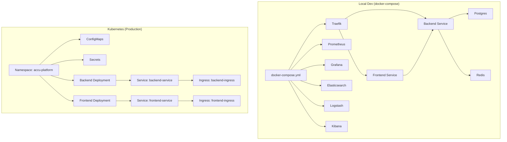
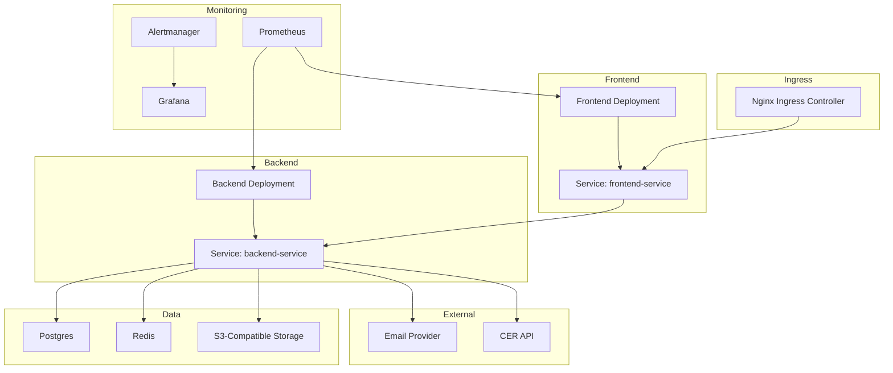
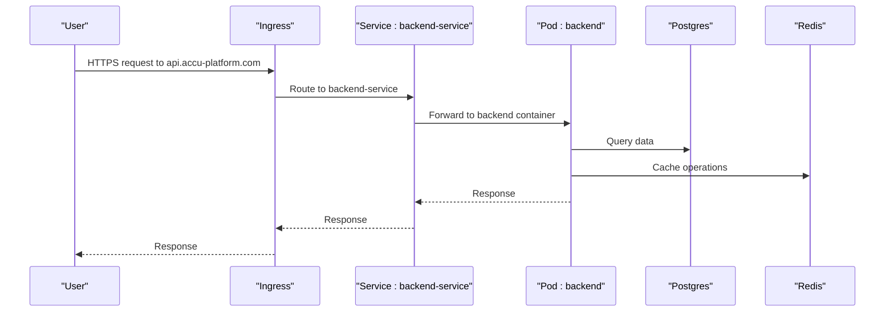
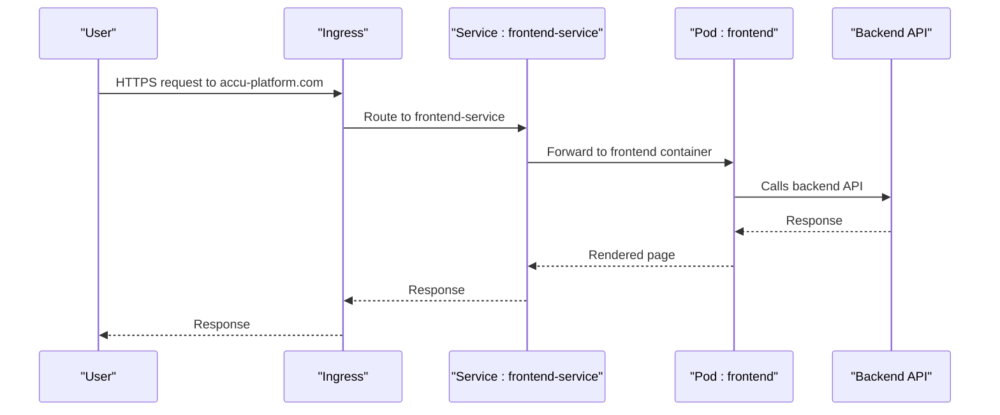
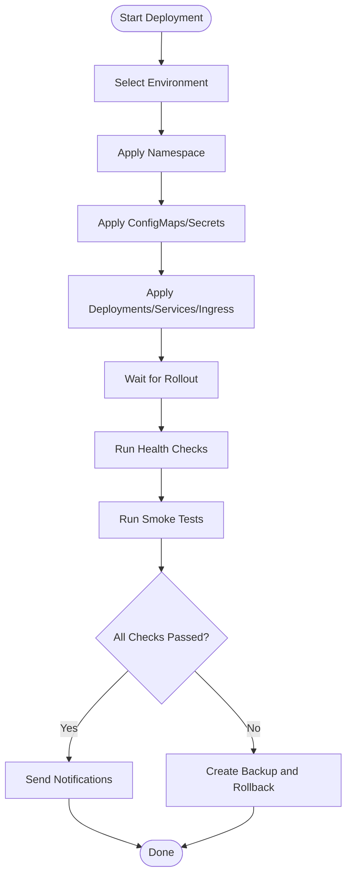
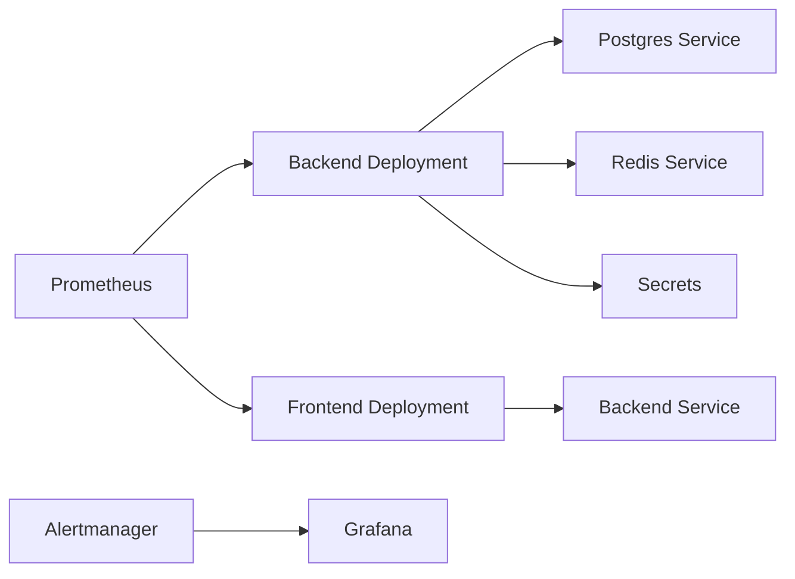

# Deployment Architecture

<cite>
**Referenced Files in This Document**
- [k8s/backend-deployment.yaml](file://k8s/backend-deployment.yaml)
- [k8s/frontend-deployment.yaml](file://k8s/frontend-deployment.yaml)
- [k8s/namespace.yaml](file://k8s/namespace.yaml)
- [k8s/configmaps.yaml](file://k8s/configmaps.yaml)
- [k8s/secrets.yaml](file://k8s/secrets.yaml)
- [k8s/security-policy.yml](file://security/security-policy.yml)
- [docker-compose.yml](file://docker-compose.yml)
- [scripts/deploy.sh](file://scripts/deploy.sh)
- [scripts/smoke-tests.sh](file://scripts/smoke-tests.sh)
- [monitoring/prometheus/prometheus.yml](file://monitoring/prometheus/prometheus.yml)
- [monitoring/alertmanager/alertmanager.yml](file://monitoring/alertmanager/alertmanager.yml)
- [monitoring/grafana/dashboards/accu-platform-overview.json](file://monitoring/grafana/dashboards/accu-platform-overview.json)
- [ACCU_Platform_Architecture_Diagram.md](file://ACCU_Platform_Architecture_Diagram.md)
</cite>

## Table of Contents
1. [Introduction](#introduction)
2. [Project Structure](#project-structure)
3. [Core Components](#core-components)
4. [Architecture Overview](#architecture-overview)
5. [Detailed Component Analysis](#detailed-component-analysis)
6. [Dependency Analysis](#dependency-analysis)
7. [Performance Considerations](#performance-considerations)
8. [Troubleshooting Guide](#troubleshooting-guide)
9. [Conclusion](#conclusion)
10. [Appendices](#appendices)

## Introduction
This document describes the Kubernetes-based deployment infrastructure for the ACCU Platform. It covers backend and frontend deployment specifications, resource limits, health checks, configuration management via ConfigMaps and Secrets, namespace isolation, network policies, deployment topology, service exposure, ingress configuration, and local development via docker-compose.yml. It also outlines scaling strategies, update mechanisms, and environment promotion workflows.

## Project Structure
The deployment-related assets are organized under k8s/, monitoring/, scripts/, and docker-compose.yml. Production manifests define namespaces, ConfigMaps, Secrets, Deployments, Services, and Ingress. Local development uses docker-compose.yml with Traefik reverse proxy and integrated monitoring stack.

**Diagram sources**
- [docker-compose.yml](file://docker-compose.yml#L1-L211)
- [k8s/backend-deployment.yaml](file://k8s/backend-deployment.yaml#L1-L199)
- [k8s/frontend-deployment.yaml](file://k8s/frontend-deployment.yaml#L1-L152)
- [k8s/namespace.yaml](file://k8s/namespace.yaml#L1-L23)
- [k8s/configmaps.yaml](file://k8s/configmaps.yaml#L1-L29)
- [k8s/secrets.yaml](file://k8s/secrets.yaml#L1-L105)

**Section sources**
- [docker-compose.yml](file://docker-compose.yml#L1-L211)
- [k8s/backend-deployment.yaml](file://k8s/backend-deployment.yaml#L1-L199)
- [k8s/frontend-deployment.yaml](file://k8s/frontend-deployment.yaml#L1-L152)
- [k8s/namespace.yaml](file://k8s/namespace.yaml#L1-L23)
- [k8s/configmaps.yaml](file://k8s/configmaps.yaml#L1-L29)
- [k8s/secrets.yaml](file://k8s/secrets.yaml#L1-L105)

## Core Components
- Namespaces: Dedicated environments for production, staging, and development.
- ConfigMaps: Environment-specific settings for backend and frontend.
- Secrets: Sensitive configuration for databases, auth, email, storage, and monitoring.
- Deployments: Backend and frontend with replica counts, resource requests/limits, probes, and security contexts.
- Services: ClusterIP services exposing backend and frontend internally.
- Ingress: Nginx-based ingress with TLS termination and rate limiting for both services.
- Monitoring: Prometheus scraping, Alertmanager routing, and Grafana dashboards.
- Local Development: docker-compose with Traefik, Postgres, Redis, Prometheus, Grafana, Elasticsearch, Logstash, Kibana.

**Section sources**
- [k8s/namespace.yaml](file://k8s/namespace.yaml#L1-L23)
- [k8s/configmaps.yaml](file://k8s/configmaps.yaml#L1-L29)
- [k8s/secrets.yaml](file://k8s/secrets.yaml#L1-L105)
- [k8s/backend-deployment.yaml](file://k8s/backend-deployment.yaml#L1-L199)
- [k8s/frontend-deployment.yaml](file://k8s/frontend-deployment.yaml#L1-L152)
- [monitoring/prometheus/prometheus.yml](file://monitoring/prometheus/prometheus.yml#L1-L153)
- [monitoring/alertmanager/alertmanager.yml](file://monitoring/alertmanager/alertmanager.yml#L1-L140)
- [monitoring/grafana/dashboards/accu-platform-overview.json](file://monitoring/grafana/dashboards/accu-platform-overview.json#L1-L229)
- [docker-compose.yml](file://docker-compose.yml#L1-L211)

## Architecture Overview
The platform follows a layered architecture:
- Frontend layer (Next.js) exposed via Ingress and served by a frontend Deployment.
- Backend layer (NestJS) exposed via Ingress and served by a backend Deployment.
- Shared services: Postgres and Redis for persistence and caching.
- External integrations: Email, S3-compatible storage, and CER API.
- Monitoring and observability: Prometheus, Alertmanager, and Grafana dashboards.

**Diagram sources**
- [k8s/backend-deployment.yaml](file://k8s/backend-deployment.yaml#L1-L199)
- [k8s/frontend-deployment.yaml](file://k8s/frontend-deployment.yaml#L1-L152)
- [monitoring/prometheus/prometheus.yml](file://monitoring/prometheus/prometheus.yml#L1-L153)
- [monitoring/alertmanager/alertmanager.yml](file://monitoring/alertmanager/alertmanager.yml#L1-L140)
- [monitoring/grafana/dashboards/accu-platform-overview.json](file://monitoring/grafana/dashboards/accu-platform-overview.json#L1-L229)

## Detailed Component Analysis

### Backend Deployment Specification
- Replicas: 3
- Strategy: RollingUpdate with maxSurge 1 and maxUnavailable 0 for zero-downtime updates.
- Resources: Requests and limits for CPU and memory configured for both backend and frontend.
- Probes: Liveness and readiness probes on HTTP endpoints with tuned intervals and timeouts.
- Security: Non-root user, read-only root filesystem, dropped capabilities, and termination grace period.
- Volumes: EmptyDir for temp and logs.
- Ingress: Nginx-based with TLS, rate limiting, SSL redirect, and cert-manager issuer.

**Diagram sources**
- [k8s/backend-deployment.yaml](file://k8s/backend-deployment.yaml#L1-L199)

**Section sources**
- [k8s/backend-deployment.yaml](file://k8s/backend-deployment.yaml#L1-L199)

### Frontend Deployment Specification
- Replicas: 3
- Strategy: RollingUpdate with maxSurge 1 and maxUnavailable 0.
- Resources: Requests and limits for CPU and memory.
- Probes: Liveness and readiness probes on HTTP endpoints.
- Security: Non-root user, read-only root filesystem, dropped capabilities.
- Ingress: Nginx-based with TLS, SSL redirect, CORS enabled, and cert-manager issuer.

**Diagram sources**
- [k8s/frontend-deployment.yaml](file://k8s/frontend-deployment.yaml#L1-L152)

**Section sources**
- [k8s/frontend-deployment.yaml](file://k8s/frontend-deployment.yaml#L1-L152)

### Configuration Management: ConfigMaps and Secrets
- ConfigMaps:
  - backend-config: Environment, port, database and Redis hostnames, API version, CORS origin, rate limit TTL and limit.
  - frontend-config: Environment, public API URL, WebSocket URL, app name, and version.
- Secrets:
  - database-secret: Database URL, username, and password placeholders.
  - auth-secrets: JWT secrets and bcrypt salt rounds.
  - email-secrets: Email service provider, user, and password placeholders.
  - storage-secrets: AWS access key, secret key, and bucket placeholders.
  - cer-secrets: CER API URL and key placeholders.
  - monitoring-secrets: Grafana admin password and Elasticsearch password placeholders.
  - webhook-secrets: Slack and Discord webhook URLs.

These are mounted into backend and frontend pods via envFrom and secretKeyRef.

**Section sources**
- [k8s/configmaps.yaml](file://k8s/configmaps.yaml#L1-L29)
- [k8s/secrets.yaml](file://k8s/secrets.yaml#L1-L105)

### Namespace Isolation Strategy
- Three namespaces are defined:
  - accu-platform (production)
  - accu-platform-staging (staging)
  - accu-platform-dev (development)
- Deployments, Services, Ingress, ConfigMaps, and Secrets are scoped to the appropriate namespace.

**Section sources**
- [k8s/namespace.yaml](file://k8s/namespace.yaml#L1-L23)

### Network Policies
- A NetworkPolicy restricts traffic to the backend:
  - Allows ingress from frontend pods and the ingress-nginx namespace on port 3000.
  - Restricts egress to Postgres (5432), Redis (6379), and DNS/Telemetry ports to kube-system.
- Additional security policies are packaged as ConfigMaps for PSP, security contexts, RBAC, and compliance.

**Section sources**
- [security/security-policy.yml](file://security/security-policy.yml#L1-L322)

### Deployment Topology and Service Exposure
- Backend:
  - Deployment with 3 replicas, ClusterIP Service, and Nginx Ingress with TLS and rate limiting.
- Frontend:
  - Deployment with 3 replicas, ClusterIP Service, and Nginx Ingress with TLS and CORS.
- Internal connectivity:
  - Backend connects to Postgres and Redis services.
  - Frontend proxies to backend Service.

**Section sources**
- [k8s/backend-deployment.yaml](file://k8s/backend-deployment.yaml#L1-L199)
- [k8s/frontend-deployment.yaml](file://k8s/frontend-deployment.yaml#L1-L152)

### Scaling Strategies
- Horizontal scaling:
  - Both backend and frontend Deployments specify replicas=3.
  - RollingUpdate strategy ensures zero-downtime updates.
- Resource limits:
  - Backend: CPU and memory requests/limits defined.
  - Frontend: CPU and memory requests/limits defined.
- Auto-scaling:
  - Not defined in the provided manifests; can be added via HPA resources externally.

**Section sources**
- [k8s/backend-deployment.yaml](file://k8s/backend-deployment.yaml#L1-L199)
- [k8s/frontend-deployment.yaml](file://k8s/frontend-deployment.yaml#L1-L152)

### Update Mechanisms
- RollingUpdate:
  - maxSurge 1 and maxUnavailable 0 ensure smooth updates.
- Health checks:
  - Liveness and readiness probes prevent routing traffic to unhealthy pods.
- Ingress annotations:
  - Rate limiting and SSL redirects enforced at the edge.

**Section sources**
- [k8s/backend-deployment.yaml](file://k8s/backend-deployment.yaml#L1-L199)
- [k8s/frontend-deployment.yaml](file://k8s/frontend-deployment.yaml#L1-L152)

### Environment Promotion Workflows
- Deployment script:
  - Supports environments: development, staging, production.
  - Applies namespace, ConfigMaps, Secrets, and manifests.
  - Builds and pushes images, waits for rollouts, runs health checks, and smoke tests.
  - Provides backup creation and rollback capability.
- Local development:
  - docker-compose.yml defines services for Postgres, Redis, backend, frontend, Traefik, Prometheus, Grafana, Elasticsearch, Logstash, and Kibana.
  - Traefik routes to backend and frontend services.

**Diagram sources**
- [scripts/deploy.sh](file://scripts/deploy.sh#L1-L318)
- [scripts/smoke-tests.sh](file://scripts/smoke-tests.sh#L1-L278)
- [docker-compose.yml](file://docker-compose.yml#L1-L211)

**Section sources**
- [scripts/deploy.sh](file://scripts/deploy.sh#L1-L318)
- [scripts/smoke-tests.sh](file://scripts/smoke-tests.sh#L1-L278)
- [docker-compose.yml](file://docker-compose.yml#L1-L211)

## Dependency Analysis
- Backend depends on:
  - Postgres service for persistence.
  - Redis service for caching.
  - Email, S3, and CER secrets for external integrations.
- Frontend depends on:
  - Backend Service for API access.
- Monitoring:
  - Prometheus scrapes backend and frontend metrics.
  - Alertmanager routes alerts to Slack/Discord and email.
  - Grafana dashboards visualize system metrics.

**Diagram sources**
- [k8s/backend-deployment.yaml](file://k8s/backend-deployment.yaml#L1-L199)
- [k8s/frontend-deployment.yaml](file://k8s/frontend-deployment.yaml#L1-L152)
- [monitoring/prometheus/prometheus.yml](file://monitoring/prometheus/prometheus.yml#L1-L153)
- [monitoring/alertmanager/alertmanager.yml](file://monitoring/alertmanager/alertmanager.yml#L1-L140)
- [monitoring/grafana/dashboards/accu-platform-overview.json](file://monitoring/grafana/dashboards/accu-platform-overview.json#L1-L229)

**Section sources**
- [k8s/backend-deployment.yaml](file://k8s/backend-deployment.yaml#L1-L199)
- [k8s/frontend-deployment.yaml](file://k8s/frontend-deployment.yaml#L1-L152)
- [monitoring/prometheus/prometheus.yml](file://monitoring/prometheus/prometheus.yml#L1-L153)
- [monitoring/alertmanager/alertmanager.yml](file://monitoring/alertmanager/alertmanager.yml#L1-L140)
- [monitoring/grafana/dashboards/accu-platform-overview.json](file://monitoring/grafana/dashboards/accu-platform-overview.json#L1-L229)

## Performance Considerations
- Resource requests and limits are defined for both backend and frontend to ensure predictable performance and fair scheduling.
- RollingUpdate with controlled surge/unavailable minimizes downtime during updates.
- Ingress rate limiting reduces potential abuse and protects backend resources.
- Metrics scraping and dashboards enable capacity planning and anomaly detection.

[No sources needed since this section provides general guidance]

## Troubleshooting Guide
- Health checks:
  - Backend: liveness probe on /health, readiness probe on /health/ready.
  - Frontend: liveness probe on /, readiness probe on /api/health.
- Monitoring:
  - Prometheus targets for backend and frontend metrics.
  - Alertmanager configurations for critical, warning, and info alerts.
  - Grafana dashboard for system status, request rates, response times, and resource usage.
- Smoke tests:
  - Automated checks for backend health, API endpoints, frontend accessibility, database connectivity, external integrations, performance, security headers, and metrics availability.

**Section sources**
- [k8s/backend-deployment.yaml](file://k8s/backend-deployment.yaml#L1-L199)
- [k8s/frontend-deployment.yaml](file://k8s/frontend-deployment.yaml#L1-L152)
- [monitoring/prometheus/prometheus.yml](file://monitoring/prometheus/prometheus.yml#L1-L153)
- [monitoring/alertmanager/alertmanager.yml](file://monitoring/alertmanager/alertmanager.yml#L1-L140)
- [monitoring/grafana/dashboards/accu-platform-overview.json](file://monitoring/grafana/dashboards/accu-platform-overview.json#L1-L229)
- [scripts/smoke-tests.sh](file://scripts/smoke-tests.sh#L1-L278)

## Conclusion
The deployment architecture separates concerns across namespaces, uses ConfigMaps and Secrets for configuration and secrets management, and exposes services via Ingress with TLS and rate limiting. Backend and frontend Deployments are horizontally scaled with rolling updates and health checks. Monitoring and alerting provide operational visibility, while docker-compose supports local development with integrated tooling. The deployment script orchestrates environment promotion, backups, and rollback, enabling safe and repeatable releases.

[No sources needed since this section summarizes without analyzing specific files]

## Appendices

### Local Development with docker-compose.yml
- Services:
  - Postgres and Redis for data and cache.
  - Backend and Frontend services with health checks.
  - Traefik reverse proxy with routers for backend and frontend.
  - Prometheus, Grafana, Elasticsearch, Logstash, and Kibana for monitoring and logging.
- Routing:
  - Traefik routes to backend on api.accu-platform.local and to frontend on accu-platform.local.

**Section sources**
- [docker-compose.yml](file://docker-compose.yml#L1-L211)

### Architecture Overview Diagram
- The repository includes a high-level architecture diagram that illustrates module dependencies, data flow, security layers, and deployment topology.

**Section sources**
- [ACCU_Platform_Architecture_Diagram.md](file://ACCU_Platform_Architecture_Diagram.md#L1-L383)