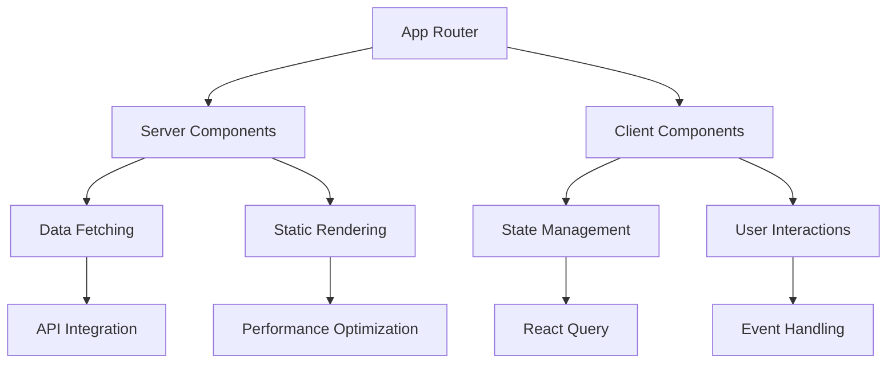
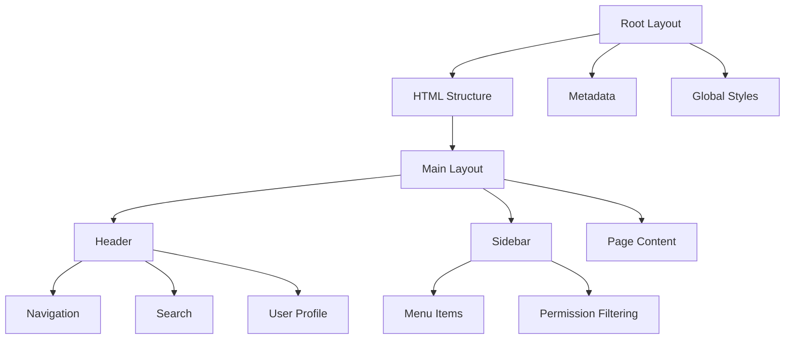
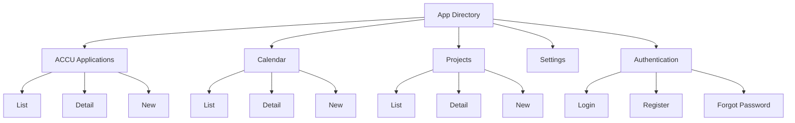
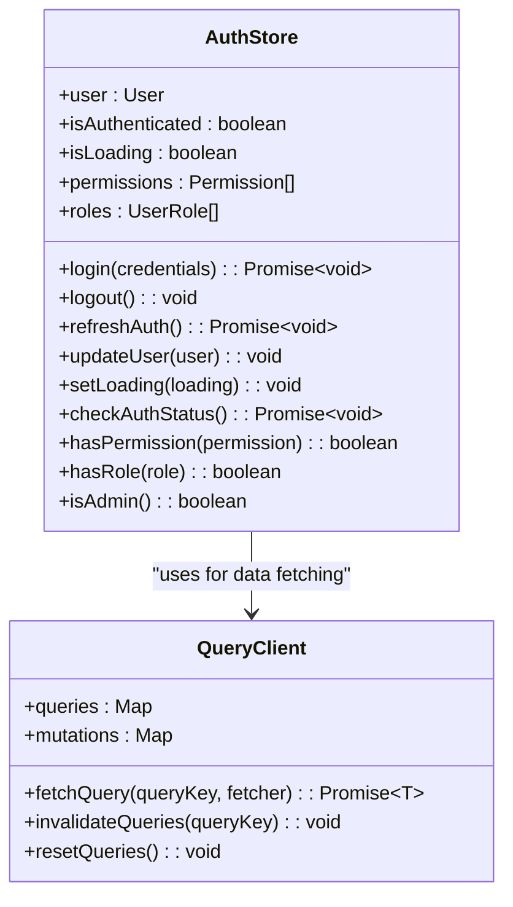
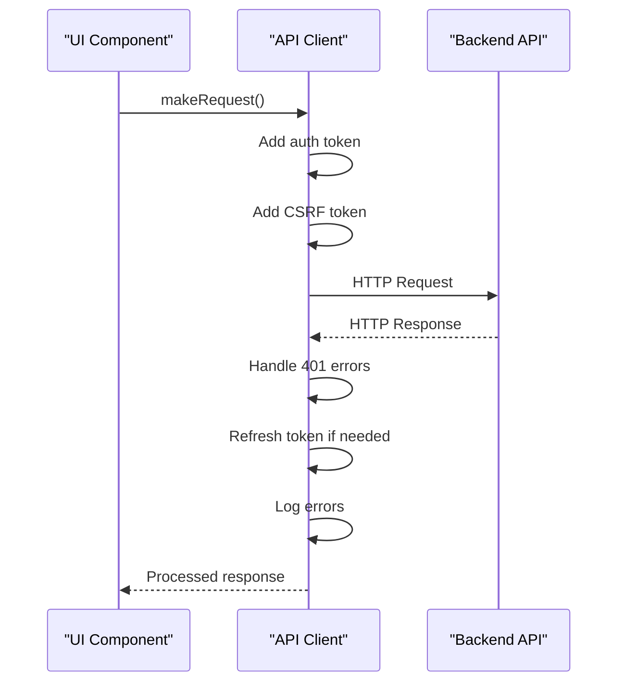
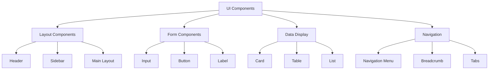
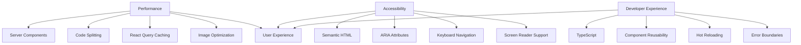

# Frontend Architecture

<cite>
**Referenced Files in This Document**   
- [layout.tsx](file://apps/frontend/src/app/layout.tsx)
- [main-layout.tsx](file://apps/frontend/src/components/layout/main-layout.tsx)
- [header.tsx](file://apps/frontend/src/components/layout/header.tsx)
- [sidebar.tsx](file://apps/frontend/src/components/layout/sidebar.tsx)
- [api-client.ts](file://apps/frontend/src/lib/api-client.ts)
- [auth-store.ts](file://apps/frontend/src/store/auth-store.ts)
- [accu-applications/page.tsx](file://apps/frontend/src/app/accu-applications/page.tsx)
- [calendar/page.tsx](file://apps/frontend/src/app/calendar/page.tsx)
- [projects/page.tsx](file://apps/frontend/src/app/projects/page.tsx)
- [settings/page.tsx](file://apps/frontend/src/app/settings/page.tsx)
- [button.tsx](file://apps/frontend/src/components/ui/button.tsx)
- [card.tsx](file://apps/frontend/src/components/ui/card.tsx)
- [utils.ts](file://apps/frontend/src/lib/utils.ts)
- [index.ts](file://apps/frontend/src/types/index.ts)
- [middleware.ts](file://apps/frontend/src/app/middleware.ts)
</cite>

## Table of Contents
1. [Introduction](#introduction)
2. [App Router Structure](#app-router-structure)
3. [Layout System](#layout-system)
4. [Routing Structure](#routing-structure)
5. [State Management](#state-management)
6. [API Integration](#api-integration)
7. [UI Component Architecture](#ui-component-architecture)
8. [Performance, Accessibility, and Developer Experience](#performance-accessibility-and-developer-experience)
9. [Conclusion](#conclusion)

## Introduction
The ACCU Platform frontend is a Next.js application built using the App Router architecture with React Server Components. This documentation provides a comprehensive overview of the frontend architecture, focusing on key aspects including the routing system, layout structure, state management, API integration, and UI component design. The application is designed to support carbon credit tracking and management with a focus on performance, accessibility, and developer experience.

The frontend architecture leverages modern React patterns and best practices to create a scalable and maintainable codebase. It integrates with a backend API to provide a comprehensive platform for managing ACCU applications, calendar events, projects, and user settings. The application follows a component-based architecture with clear separation of concerns and reusable UI elements.

**Section sources**
- [layout.tsx](file://apps/frontend/src/app/layout.tsx)
- [main-layout.tsx](file://apps/frontend/src/components/layout/main-layout.tsx)

## App Router Structure

The application utilizes Next.js App Router with React Server Components paradigm. The App Router provides a file-based routing system that maps directly to the URL structure, making it intuitive and scalable. The application is structured around server components by default, with client components explicitly marked using the "use client" directive when interactivity is required.

Server components are used for data fetching and rendering static content, while client components handle user interactions, state management, and dynamic behavior. This hybrid approach optimizes performance by minimizing client-side JavaScript bundle size while maintaining interactivity where needed. The application follows the principle of progressive enhancement, starting with server-rendered content and adding interactivity through client components.

The App Router structure enables efficient data loading and rendering, with server components able to directly access backend APIs without the need for additional client-side requests. This reduces network overhead and improves page load performance. The routing system is designed to be intuitive and maintainable, with clear file-to-route mapping that makes it easy to understand the application structure.

**Diagram sources **
- [layout.tsx](file://apps/frontend/src/app/layout.tsx)
- [accu-applications/page.tsx](file://apps/frontend/src/app/accu-applications/page.tsx)

**Section sources**
- [layout.tsx](file://apps/frontend/src/app/layout.tsx)
- [accu-applications/page.tsx](file://apps/frontend/src/app/accu-applications/page.tsx)

## Layout System

The layout system is implemented using two key components: `layout.tsx` and `main-layout.tsx`. The root `layout.tsx` file provides the global application structure, including metadata, fonts, and the basic HTML structure. It wraps all pages in the application and defines the overall document structure.

The `main-layout.tsx` component implements the application-specific layout with header and sidebar components. This layout is used for authenticated routes and provides a consistent user interface across the application. The layout includes responsive design features, with the sidebar collapsing on mobile devices and a hamburger menu for navigation.

The header component includes navigation elements, search functionality, user profile information, and notifications. It is sticky and remains visible during scrolling, providing consistent access to key application features. The sidebar component provides primary navigation with expandable sections and permission-based filtering, ensuring users only see menu items they have access to.

**Diagram sources **
- [layout.tsx](file://apps/frontend/src/app/layout.tsx)
- [main-layout.tsx](file://apps/frontend/src/components/layout/main-layout.tsx)
- [header.tsx](file://apps/frontend/src/components/layout/header.tsx)
- [sidebar.tsx](file://apps/frontend/src/components/layout/sidebar.tsx)

**Section sources**
- [layout.tsx](file://apps/frontend/src/app/layout.tsx)
- [main-layout.tsx](file://apps/frontend/src/components/layout/main-layout.tsx)
- [header.tsx](file://apps/frontend/src/components/layout/header.tsx)
- [sidebar.tsx](file://apps/frontend/src/components/layout/sidebar.tsx)

## Routing Structure

The routing structure is based on the Next.js app directory, with pages organized by feature. The application includes routes for ACCU applications, calendar, projects, settings, and authentication. Each route corresponds to a directory in the app folder, with a page.tsx file defining the page content.

The routing system includes both public and protected routes, with authentication handled through middleware. Public routes include login, register, and forgot password pages, while protected routes require authentication and are accessible only to authorized users. The middleware checks authentication status and redirects users appropriately, ensuring secure access to application features.

The application implements dynamic routing for specific entities, allowing users to navigate to individual ACCU applications, calendar events, and projects. Route parameters are used to fetch specific data and render appropriate content. The routing structure supports nested routes for complex features, with layout components providing consistent navigation and UI elements.

**Diagram sources **
- [accu-applications/page.tsx](file://apps/frontend/src/app/accu-applications/page.tsx)
- [calendar/page.tsx](file://apps/frontend/src/app/calendar/page.tsx)
- [projects/page.tsx](file://apps/frontend/src/app/projects/page.tsx)
- [settings/page.tsx](file://apps/frontend/src/app/settings/page.tsx)

**Section sources**
- [accu-applications/page.tsx](file://apps/frontend/src/app/accu-applications/page.tsx)
- [calendar/page.tsx](file://apps/frontend/src/app/calendar/page.tsx)
- [projects/page.tsx](file://apps/frontend/src/app/projects/page.tsx)
- [settings/page.tsx](file://apps/frontend/src/app/settings/page.tsx)

## State Management

State management is implemented using a combination of React Query and a custom auth store built with Zustand. The auth store handles authentication state, user information, permissions, and roles, providing a centralized location for authentication-related data.

The `auth-store.ts` file defines a Zustand store with actions for login, logout, and authentication status checking. The store uses persistence to maintain authentication state across page refreshes, storing user data and tokens in localStorage. The store also provides computed values for permission checking, making it easy to control UI elements based on user permissions.

React Query is used for managing server state and data fetching. It provides caching, background updates, and automatic refetching of data, ensuring the application displays up-to-date information. Query hooks are used throughout the application to fetch data from the backend API, with error handling and loading states managed automatically.

**Diagram sources **
- [auth-store.ts](file://apps/frontend/src/store/auth-store.ts)
- [api-client.ts](file://apps/frontend/src/lib/api-client.ts)

**Section sources**
- [auth-store.ts](file://apps/frontend/src/store/auth-store.ts)
- [api-client.ts](file://apps/frontend/src/lib/api-client.ts)

## API Integration

API integration is handled through a centralized `api-client.ts` module that wraps Axios with custom configuration and interceptors. The API client provides a consistent interface for making HTTP requests to the backend API, with built-in error handling, authentication token management, and request/response interception.

The API client includes request interceptors that automatically add authentication tokens to requests, ensuring secure communication with the backend. Response interceptors handle common error scenarios, including token refresh on 401 errors and centralized error logging. The client also implements retry logic and timeout handling to improve reliability.

The API client exposes generic HTTP methods (get, post, put, patch, delete) as well as specialized methods for file uploads and batch requests. This abstraction layer makes it easy to interact with the backend API while maintaining consistent error handling and authentication across the application.

**Diagram sources **
- [api-client.ts](file://apps/frontend/src/lib/api-client.ts)
- [accu-applications/page.tsx](file://apps/frontend/src/app/accu-applications/page.tsx)

**Section sources**
- [api-client.ts](file://apps/frontend/src/lib/api-client.ts)
- [accu-applications/page.tsx](file://apps/frontend/src/app/accu-applications/page.tsx)

## UI Component Architecture

The UI component architecture is built using Tailwind CSS for styling and Radix UI for accessible, unstyled components. The application follows a component-based design with reusable UI elements organized in a logical hierarchy.

The component structure includes layout components (header, sidebar, main layout), UI components (buttons, cards, inputs), and feature-specific components (ACCU applications, calendar, projects). UI components are designed to be reusable and consistent across the application, with variants and sizes defined using Tailwind CSS classes.

The application uses a design system approach with consistent spacing, typography, and color schemes. Components are built with accessibility in mind, following WCAG guidelines and using semantic HTML. The UI components are designed to be responsive, adapting to different screen sizes and device types.

**Diagram sources **
- [button.tsx](file://apps/frontend/src/components/ui/button.tsx)
- [card.tsx](file://apps/frontend/src/components/ui/card.tsx)
- [header.tsx](file://apps/frontend/src/components/layout/header.tsx)
- [sidebar.tsx](file://apps/frontend/src/components/layout/sidebar.tsx)

**Section sources**
- [button.tsx](file://apps/frontend/src/components/ui/button.tsx)
- [card.tsx](file://apps/frontend/src/components/ui/card.tsx)
- [header.tsx](file://apps/frontend/src/components/layout/header.tsx)
- [sidebar.tsx](file://apps/frontend/src/components/layout/sidebar.tsx)

## Performance, Accessibility, and Developer Experience

The frontend architecture is designed with performance, accessibility, and developer experience as key priorities. Performance optimizations include server-side rendering, code splitting, and efficient data fetching with React Query caching. The application minimizes client-side JavaScript by using server components for static content and only loading client components when interactivity is required.

Accessibility is implemented through semantic HTML, ARIA attributes, keyboard navigation support, and proper focus management. Components are designed to be usable with screen readers and other assistive technologies. The application follows WCAG 2.1 guidelines to ensure accessibility for all users.

Developer experience is enhanced through a well-organized code structure, comprehensive type definitions, and reusable components. The application uses TypeScript for type safety, reducing bugs and improving code maintainability. Development tools and linting rules ensure code quality and consistency across the codebase.

The architecture supports efficient development workflows with hot reloading, comprehensive error boundaries, and detailed logging. The component-based design makes it easy to add new features and modify existing ones without introducing regressions.

**Diagram sources **
- [layout.tsx](file://apps/frontend/src/app/layout.tsx)
- [middleware.ts](file://apps/frontend/src/app/middleware.ts)
- [utils.ts](file://apps/frontend/src/lib/utils.ts)
- [index.ts](file://apps/frontend/src/types/index.ts)

**Section sources**
- [layout.tsx](file://apps/frontend/src/app/layout.tsx)
- [middleware.ts](file://apps/frontend/src/app/middleware.ts)
- [utils.ts](file://apps/frontend/src/lib/utils.ts)
- [index.ts](file://apps/frontend/src/types/index.ts)

## Conclusion

The ACCU Platform frontend architecture demonstrates a modern, well-structured Next.js application that effectively leverages the App Router and React Server Components paradigm. The architecture balances server-side rendering for performance with client-side interactivity where needed, creating a fast and responsive user experience.

Key strengths of the architecture include its modular component design, robust state management, and comprehensive API integration. The layout system provides a consistent user interface across the application, while the routing structure enables intuitive navigation and feature organization.

The application prioritizes performance, accessibility, and developer experience through thoughtful design choices and modern development practices. The use of TypeScript, comprehensive type definitions, and reusable components enhances code quality and maintainability. The architecture is scalable and extensible, providing a solid foundation for future feature development and enhancement.