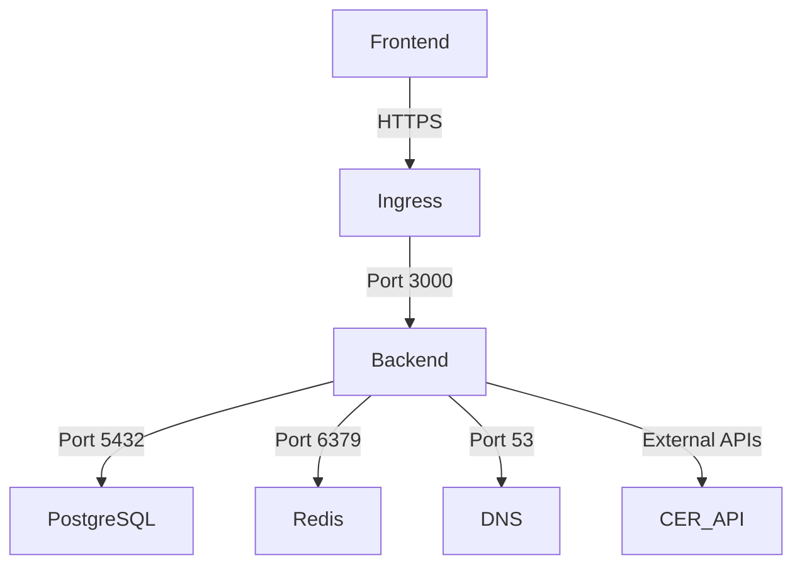
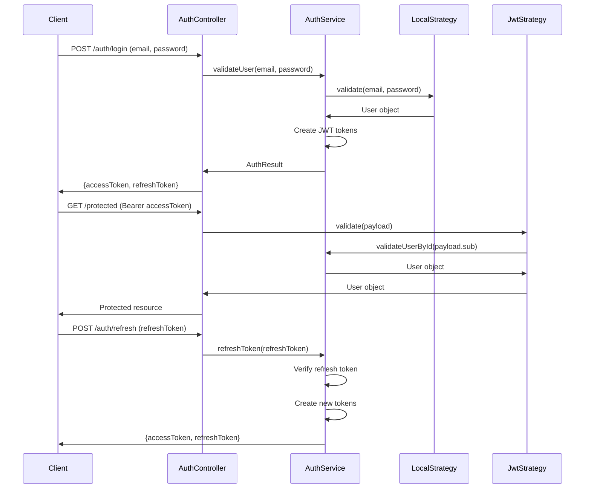
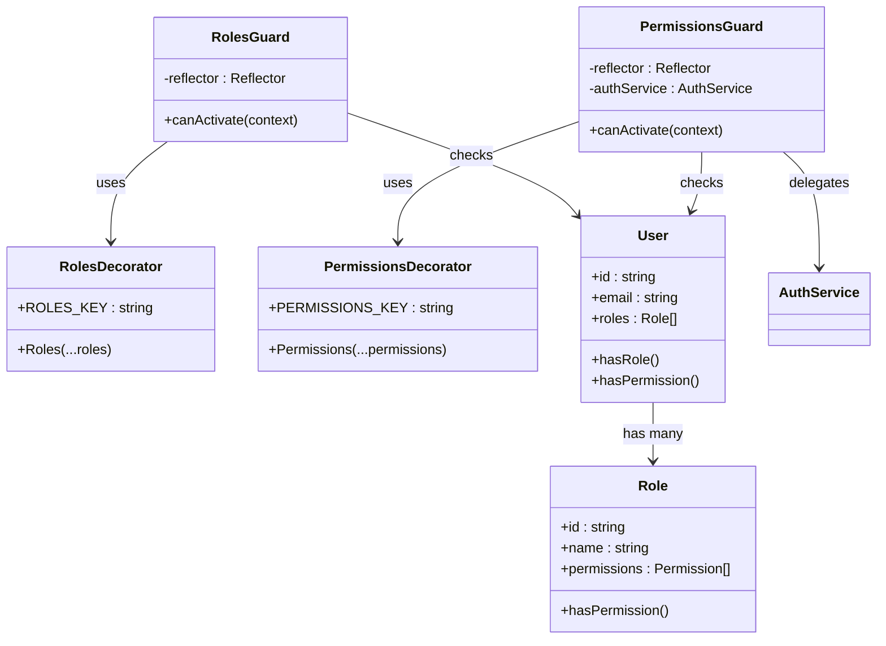
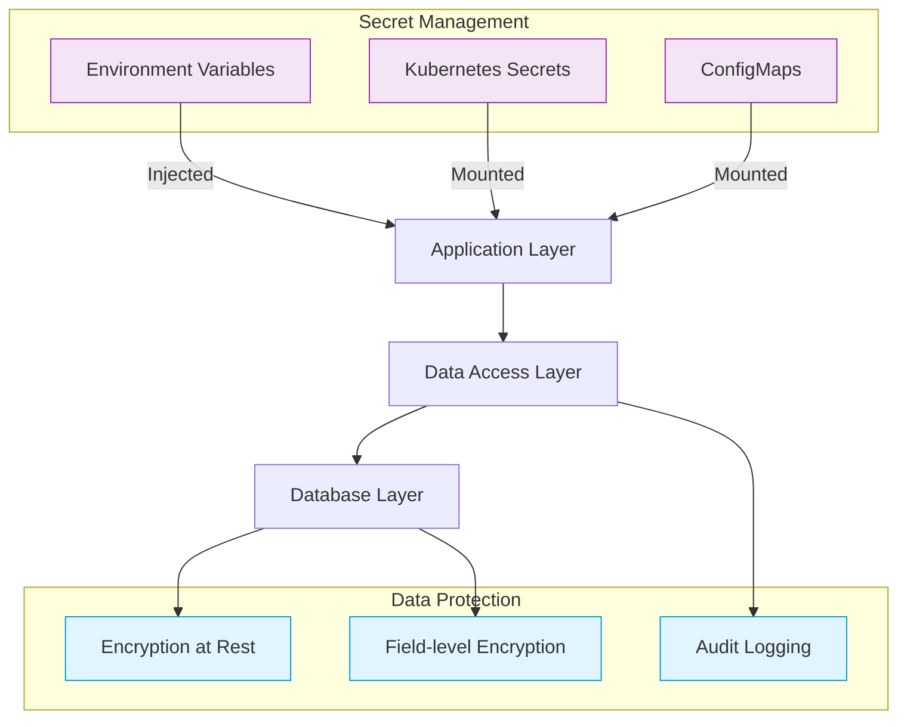
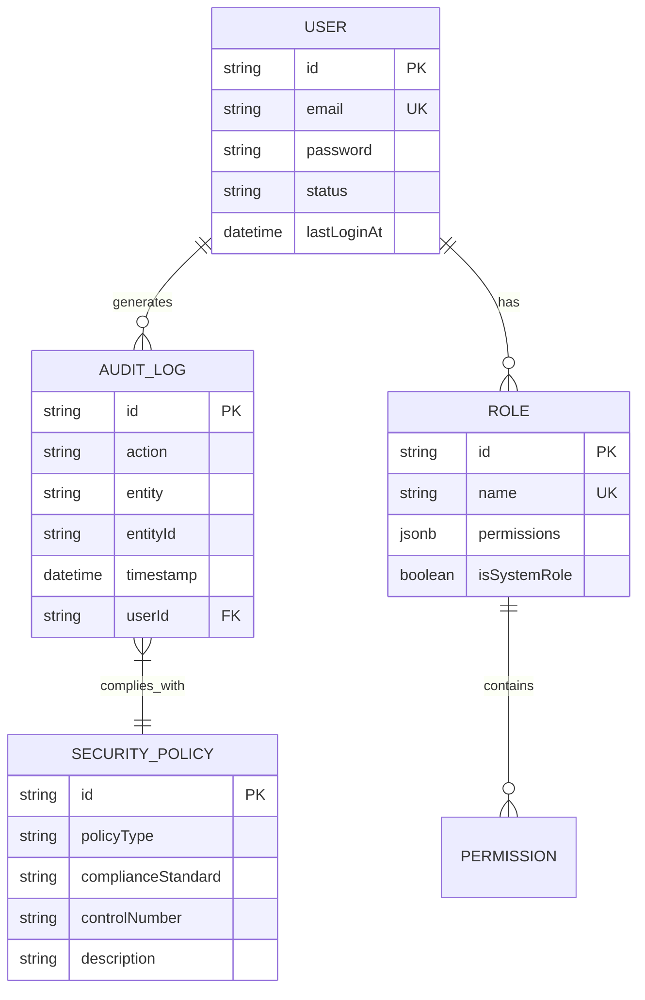
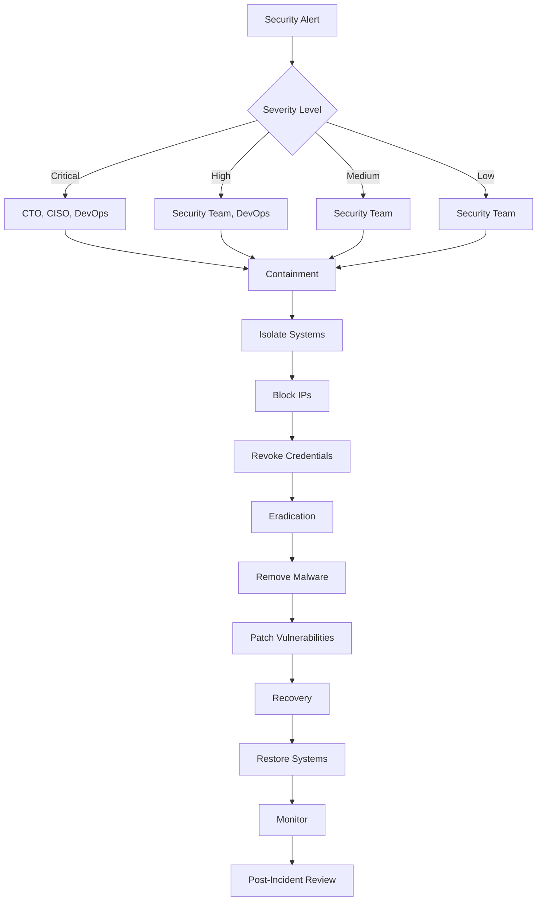

# Security Architecture

<cite>
**Referenced Files in This Document**   
- [security-policy.yml](file://security/security-policy.yml)
- [local.strategy.ts](file://apps/backend/src/modules/auth/strategies/local.strategy.ts)
- [jwt.strategy.ts](file://apps/backend/src/modules/auth/strategies/jwt.strategy.ts)
- [jwt-refresh.strategy.ts](file://apps/backend/src/modules/auth/strategies/jwt-refresh.strategy.ts)
- [auth.service.ts](file://apps/backend/src/modules/auth/auth.service.ts)
- [auth.module.ts](file://apps/backend/src/modules/auth/auth.module.ts)
- [roles.guard.ts](file://apps/backend/src/common/guards/roles.guard.ts)
- [permissions.guard.ts](file://apps/backend/src/common/guards/permissions.guard.ts)
- [permissions.decorator.ts](file://apps/backend/src/common/decorators/permissions.decorator.ts)
- [roles.decorator.ts](file://apps/backend/src/common/decorators/roles.decorator.ts)
- [configuration.ts](file://apps/backend/src/config/configuration.ts)
- [database.config.ts](file://apps/backend/src/config/database.config.ts)
- [user.entity.ts](file://apps/backend/src/entities/user.entity.ts)
- [role.entity.ts](file://apps/backend/src/entities/role.entity.ts)
- [logging.interceptor.ts](file://apps/backend/src/common/interceptors/logging.interceptor.ts)
</cite>

## Table of Contents
1. [Introduction](#introduction)
2. [Network Security Measures](#network-security-measures)
3. [Authentication Architecture](#authentication-architecture)
4. [Authorization Framework](#authorization-framework)
5. [Data Security](#data-security)
6. [Compliance Considerations](#compliance-considerations)
7. [Security Incident Response](#security-incident-response)
8. [Conclusion](#conclusion)

## Introduction
This document provides a comprehensive overview of the security architecture for the ACCU platform, detailing the multi-layered security implementation across network, authentication, authorization, and data protection domains. The system implements industry-standard security practices including TLS encryption, JWT-based authentication with refresh tokens, role-based access control, and comprehensive audit logging. The architecture is designed to protect sensitive environmental data and user information in compliance with regulatory requirements.

## Network Security Measures

The platform implements a defense-in-depth approach to network security with multiple layers of protection. The Kubernetes network policies restrict traffic flow between components, allowing only necessary communication paths. The backend service only accepts ingress traffic from the frontend application and ingress controller, while egress traffic is limited to database, cache, and DNS services.

**Diagram sources**
- [security-policy.yml](file://security/security-policy.yml#L8-L60)
- [configuration.ts](file://apps/backend/src/config/configuration.ts#L58-L62)

**Section sources**
- [security-policy.yml](file://security/security-policy.yml#L8-L60)
- [configuration.ts](file://apps/backend/src/config/configuration.ts#L58-L62)

## Authentication Architecture

The authentication system implements a secure JWT-based authentication flow with refresh token rotation. The architecture follows OAuth2 patterns with local strategy for initial authentication and JWT strategy for subsequent requests. The implementation includes password hashing with bcrypt and token expiration policies.

**Diagram sources**
- [local.strategy.ts](file://apps/backend/src/modules/auth/strategies/local.strategy.ts#L1-L21)
- [jwt.strategy.ts](file://apps/backend/src/modules/auth/strategies/jwt.strategy.ts#L1-L29)
- [jwt-refresh.strategy.ts](file://apps/backend/src/modules/auth/strategies/jwt-refresh.strategy.ts#L1-L22)
- [auth.service.ts](file://apps/backend/src/modules/auth/auth.service.ts#L69-L96)

**Section sources**
- [local.strategy.ts](file://apps/backend/src/modules/auth/strategies/local.strategy.ts#L1-L21)
- [jwt.strategy.ts](file://apps/backend/src/modules/auth/strategies/jwt.strategy.ts#L1-L29)
- [jwt-refresh.strategy.ts](file://apps/backend/src/modules/auth/strategies/jwt-refresh.strategy.ts#L1-L22)
- [auth.service.ts](file://apps/backend/src/modules/auth/auth.service.ts#L1-L315)
- [auth.module.ts](file://apps/backend/src/modules/auth/auth.module.ts#L1-L44)

## Authorization Framework

The authorization framework implements a dual-layer approach with role-based access control (RBAC) and fine-grained permission checks. The system uses NestJS guards and decorators to enforce access policies at the controller and method levels. Roles define broad access categories while permissions provide granular control over specific actions.

**Diagram sources**
- [roles.guard.ts](file://apps/backend/src/common/guards/roles.guard.ts#L1-L41)
- [permissions.guard.ts](file://apps/backend/src/common/guards/permissions.guard.ts#L1-L47)
- [permissions.decorator.ts](file://apps/backend/src/common/decorators/permissions.decorator.ts#L1-L6)
- [roles.decorator.ts](file://apps/backend/src/common/decorators/roles.decorator.ts)
- [role.entity.ts](file://apps/backend/src/entities/role.entity.ts#L1-L133)
- [user.entity.ts](file://apps/backend/src/entities/user.entity.ts#L1-L124)

**Section sources**
- [roles.guard.ts](file://apps/backend/src/common/guards/roles.guard.ts#L1-L41)
- [permissions.guard.ts](file://apps/backend/src/common/guards/permissions.guard.ts#L1-L47)
- [permissions.decorator.ts](file://apps/backend/src/common/decorators/permissions.decorator.ts#L1-L6)
- [role.entity.ts](file://apps/backend/src/entities/role.entity.ts#L1-L133)
- [user.entity.ts](file://apps/backend/src/entities/user.entity.ts#L1-L124)

## Data Security

The data security implementation includes encryption at rest, secure secret management, and comprehensive audit logging. Database connections use SSL in production environments, and sensitive fields are protected using TypeORM's exclusion features. The system implements audit trails for all user actions through the audit logging mechanism.

**Diagram sources**
- [database.config.ts](file://apps/backend/src/config/database.config.ts#L48)
- [user.entity.ts](file://apps/backend/src/entities/user.entity.ts#L39)
- [audit-log.entity.ts](file://apps/backend/src/entities/audit-log.entity.ts)
- [configuration.ts](file://apps/backend/src/config/configuration.ts)

**Section sources**
- [database.config.ts](file://apps/backend/src/config/database.config.ts#L1-L54)
- [user.entity.ts](file://apps/backend/src/entities/user.entity.ts#L1-L124)
- [configuration.ts](file://apps/backend/src/config/configuration.ts#L23-L28)

## Compliance Considerations

The security architecture is designed to meet compliance requirements for handling sensitive environmental data and user information as defined in the security policy configuration. The system implements controls aligned with CIS benchmarks and NIST 800-53 standards, including encryption at rest, access enforcement, audit review, and vulnerability scanning.

**Diagram sources**
- [security-policy.yml](file://security/security-policy.yml#L197-L260)
- [user.entity.ts](file://apps/backend/src/entities/user.entity.ts#L1-L124)
- [role.entity.ts](file://apps/backend/src/entities/role.entity.ts#L1-L133)
- [audit-log.entity.ts](file://apps/backend/src/entities/audit-log.entity.ts)

**Section sources**
- [security-policy.yml](file://security/security-policy.yml#L197-L322)

## Security Incident Response

The platform includes a comprehensive incident response framework with defined procedures for detection, containment, eradication, and recovery. The incident response plan includes escalation matrices based on severity levels and communication protocols for internal and external stakeholders.

**Diagram sources**
- [security-policy.yml](file://security/security-policy.yml#L262-L322)
- [logging.interceptor.ts](file://apps/backend/src/common/interceptors/logging.interceptor.ts#L1-L33)

**Section sources**
- [security-policy.yml](file://security/security-policy.yml#L262-L322)
- [logging.interceptor.ts](file://apps/backend/src/common/interceptors/logging.interceptor.ts#L1-L33)

## Conclusion
The ACCU platform's security architecture implements a comprehensive, multi-layered approach to protect sensitive environmental data and user information. The system combines network security measures, robust authentication with JWT tokens, fine-grained authorization through role-based access control, and comprehensive data protection mechanisms. The architecture aligns with industry standards and regulatory requirements, providing a secure foundation for the platform's operations. Continuous security monitoring, regular vulnerability scanning, and a well-defined incident response framework further enhance the overall security posture.