# Workflow Engine Architecture

<cite>
**Referenced Files in This Document**   
- [temporal.module.ts](file://apps/backend/src/modules/temporal/temporal.module.ts)
- [workflow-orchestrator.service.ts](file://apps/backend/src/modules/temporal/workflow-orchestrator.service.ts)
- [accu-application-workflows.ts](file://apps/backend/src/modules/temporal/workflows/accu-application/accu-application-workflows.ts)
- [calendar-workflows.ts](file://apps/backend/src/modules/temporal/workflows/calendar/calendar-workflows.ts)
- [project-workflows.ts](file://apps/backend/src/modules/temporal/workflows/project/project-workflows.ts)
- [document-workflows.ts](file://apps/backend/src/modules/temporal/workflows/document/document-workflows.ts)
- [calendar-activities.ts](file://apps/backend/src/modules/temporal/activities/calendar-activities.ts)
- [email-activities.ts](file://apps/backend/src/modules/temporal/activities/email-activities.ts)
- [database-activities.ts](file://apps/backend/src/modules/temporal/activities/database-activities.ts)
- [notification-activities.ts](file://apps/backend/src/modules/temporal/activities/notification-activities.ts)
- [temporal.service.ts](file://apps/backend/src/modules/temporal/temporal.service.ts)
- [temporal.worker.ts](file://apps/backend/src/modules/temporal/temporal.worker.ts)
- [workflow-monitoring.service.ts](file://apps/backend/src/modules/temporal/workflow-monitoring.service.ts)
- [configuration.ts](file://apps/backend/src/config/configuration.ts)
</cite>

## Table of Contents
1. [Introduction](#introduction)
2. [Temporal Module Integration](#temporal-module-integration)
3. [Workflow Orchestration](#workflow-orchestration)
4. [Workflow Architecture](#workflow-architecture)
5. [Activity Implementations](#activity-implementations)
6. [Event-Driven Workflow Triggers](#event-driven-workflow-triggers)
7. [State Persistence and Fault Tolerance](#state-persistence-and-fault-tolerance)
8. [Retry Mechanisms and Monitoring](#retry-mechanisms-and-monitoring)
9. [System Architecture Diagram](#system-architecture-diagram)
10. [Conclusion](#conclusion)

## Introduction
The Temporal.io workflow engine implementation provides a robust foundation for managing complex business processes within the ACCU platform. This architecture enables reliable execution of critical workflows including ACCU application lifecycles, document approvals, and compliance processes. The system integrates with the NestJS application through the TemporalModule, which orchestrates workflow execution, state management, and fault tolerance. Business services trigger workflows through an event-driven mechanism, ensuring that complex operations are executed reliably with built-in retry mechanisms, monitoring capabilities, and state persistence.

## Temporal Module Integration
The TemporalModule serves as the integration point between the NestJS application and the Temporal.io workflow engine. It imports and exports workflow and activity modules, providing the necessary services for workflow orchestration.

```mermaid
graph TB
subgraph "Temporal Module"
TemporalModule[TemporalModule]
TemporalService[TemporalService]
TemporalClient[TemporalClient]
TemporalWorker[TemporalWorker]
end
subgraph "Workflow Modules"
AccuWorkflow[AccuApplicationWorkflowsModule]
ProjectWorkflow[ProjectWorkflowsModule]
DocumentWorkflow[DocumentWorkflowsModule]
CalendarWorkflow[CalendarWorkflowsModule]
end
subgraph "Activity Modules"
NotificationActivity[NotificationActivitiesModule]
DatabaseActivity[DatabaseActivitiesModule]
EmailActivity[EmailActivitiesModule]
CalendarActivity[CalendarActivitiesModule]
end
TemporalModule --> TemporalService
TemporalModule --> TemporalClient
TemporalModule --> TemporalWorker
TemporalModule --> AccuWorkflow
TemporalModule --> ProjectWorkflow
TemporalModule --> DocumentWorkflow
TemporalModule --> CalendarWorkflow
TemporalModule --> NotificationActivity
TemporalModule --> DatabaseActivity
TemporalModule --> EmailActivity
TemporalModule --> CalendarActivity
```

**Diagram sources**
- [temporal.module.ts](file://apps/backend/src/modules/temporal/temporal.module.ts#L1-L43)

**Section sources**
- [temporal.module.ts](file://apps/backend/src/modules/temporal/temporal.module.ts#L1-L43)

## Workflow Orchestration
The WorkflowOrchestratorService manages the lifecycle of business process workflows, providing a unified interface for triggering and managing workflows across different domains. It handles ACCU application, project, document, and calendar workflows through a consistent API.

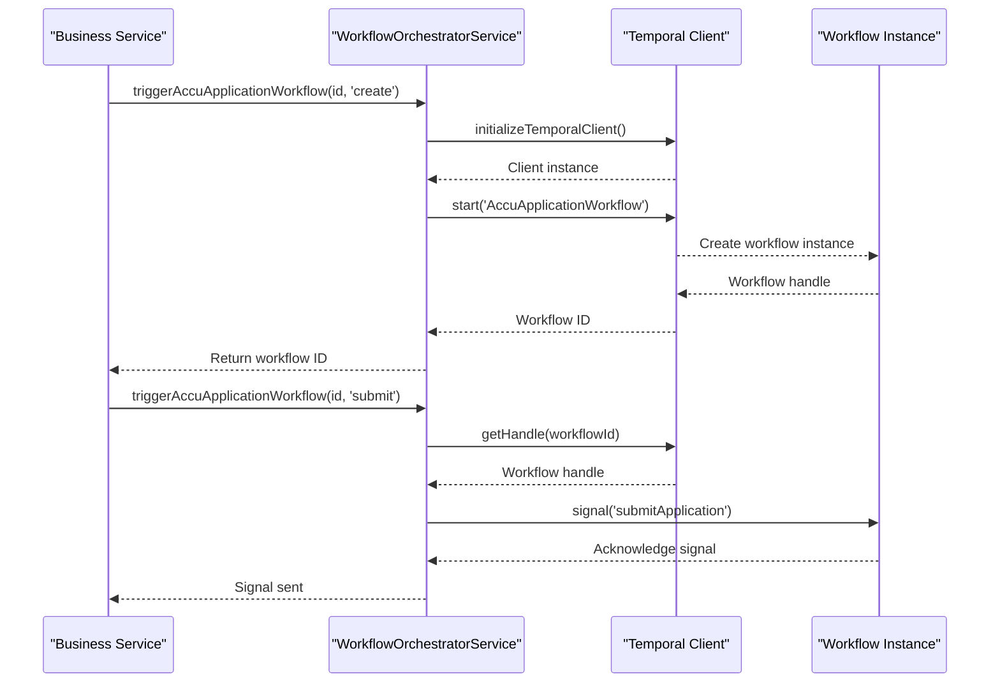

**Diagram sources**
- [workflow-orchestrator.service.ts](file://apps/backend/src/modules/temporal/workflow-orchestrator.service.ts#L1-L442)

**Section sources**
- [workflow-orchestrator.service.ts](file://apps/backend/src/modules/temporal/workflow-orchestrator.service.ts#L1-L442)

## Workflow Architecture
The workflow architecture is designed around specific business domains, with each workflow managing the state and execution of a particular business process. Workflows define signals for state transitions, queries for state inspection, and maintain comprehensive state objects.

### ACCU Application Workflows
The AccuApplicationWorkflow manages the lifecycle of ACCU applications from creation through submission, review, approval, and certificate issuance. It maintains state including application status, submission dates, reviewer assignments, and approval history.

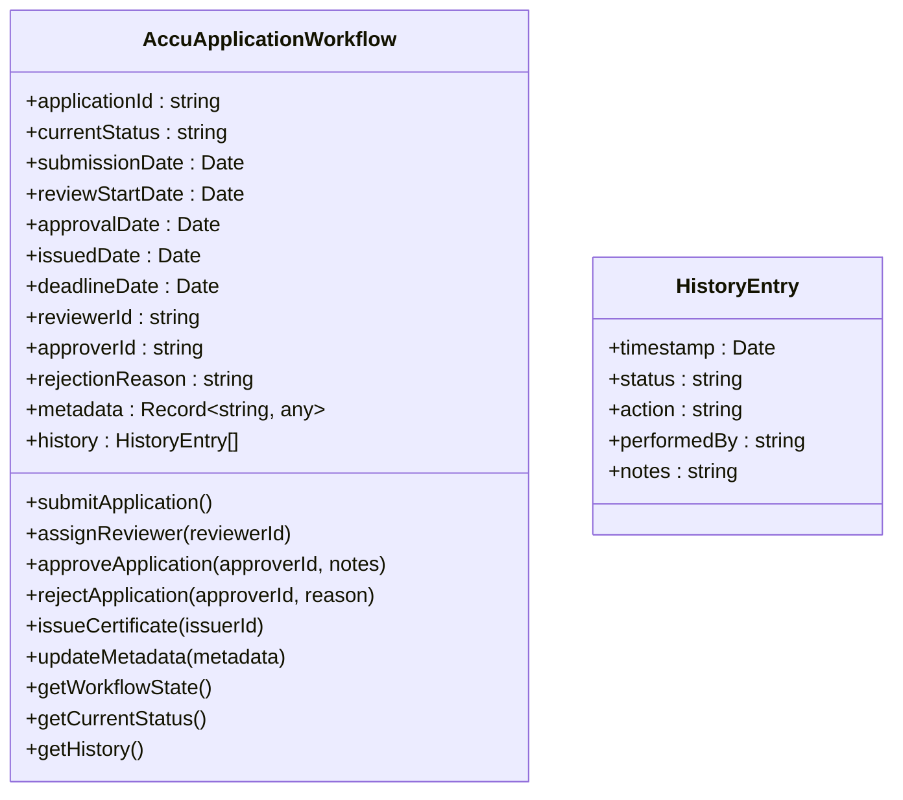

**Diagram sources**
- [accu-application-workflows.ts](file://apps/backend/src/modules/temporal/workflows/accu-application/accu-application-workflows.ts#L1-L388)

### Calendar Workflows
The CalendarWorkflow manages deadline tracking, reminder scheduling, and escalation processes. It supports multiple deadline types with configurable reminder schedules and escalation rules based on priority levels.

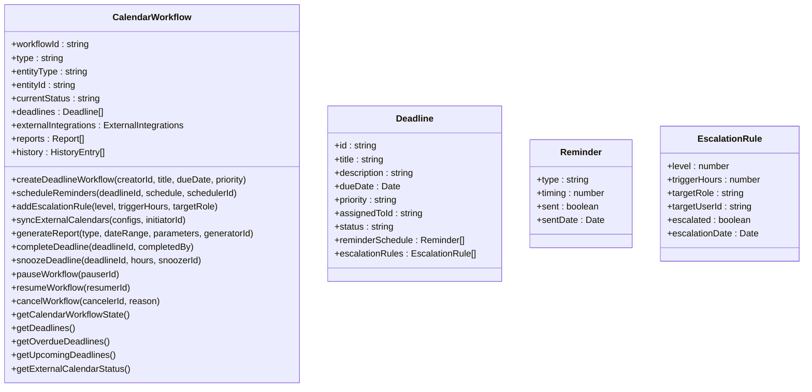

**Diagram sources**
- [calendar-workflows.ts](file://apps/backend/src/modules/temporal/workflows/calendar/calendar-workflows.ts#L1-L817)

### Project Workflows
The ProjectWorkflow manages the complete project lifecycle from initiation through planning, execution, monitoring, and closure. It tracks milestones, methodology approval, progress metrics, and automatically transitions between phases based on completion criteria.

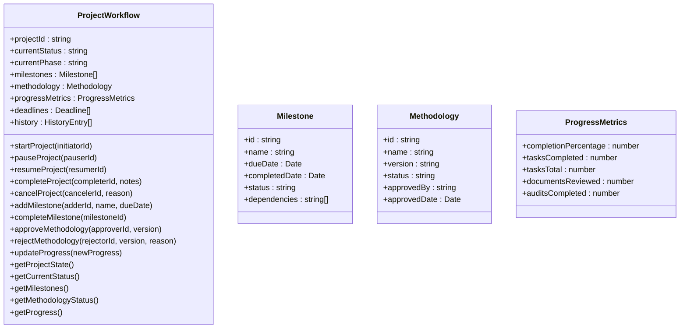

**Diagram sources**
- [project-workflows.ts](file://apps/backend/src/modules/temporal/workflows/project/project-workflows.ts#L1-L663)

### Document Workflows
The DocumentWorkflow manages the document lifecycle from draft through review, approval, publication, and archiving. It includes security scanning, access control management, and comprehensive audit trails for compliance.

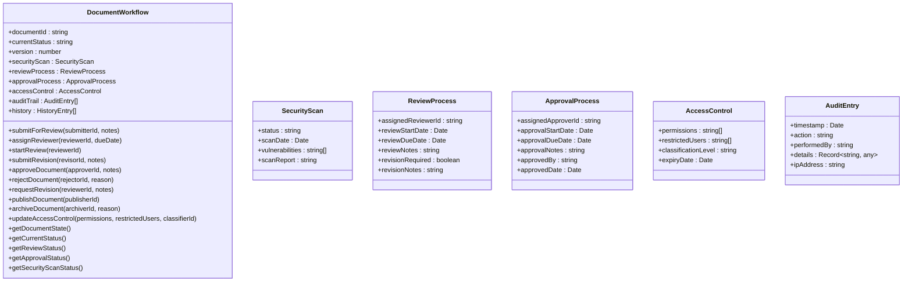

**Diagram sources**
- [document-workflows.ts](file://apps/backend/src/modules/temporal/workflows/document/document-workflows.ts#L1-L681)

## Activity Implementations
Activities represent the individual steps within workflows, encapsulating business logic and external service interactions. They are organized by functional domain and imported into workflows through proxy activities.

### Calendar Activities
The calendar-activities module provides functionality for deadline management, reminder scheduling, and external calendar synchronization.

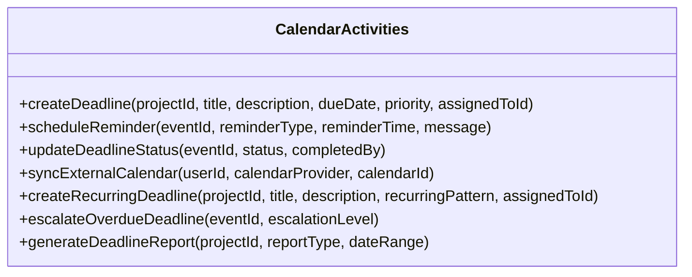

**Diagram sources**
- [calendar-activities.ts](file://apps/backend/src/modules/temporal/activities/calendar-activities.ts#L1-L27)

### Email Activities
The email-activities module handles all email communications, including status updates, approval requests, and workflow alerts.

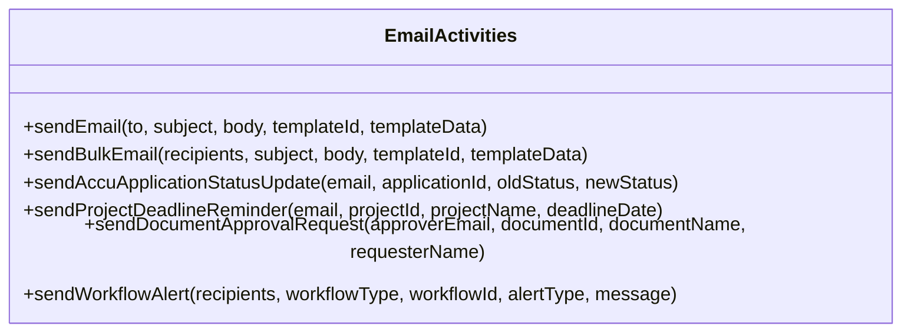

**Diagram sources**
- [email-activities.ts](file://apps/backend/src/modules/temporal/activities/email-activities.ts#L1-L21)

### Database Activities
The database-activities module provides data persistence operations for workflow state and business entities.

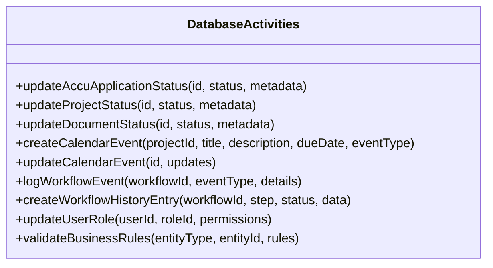

**Diagram sources**
- [database-activities.ts](file://apps/backend/src/modules/temporal/activities/database-activities.ts#L1-L27)

### Notification Activities
The notification-activities module manages various notification channels including email, SMS, push notifications, and in-app notifications.

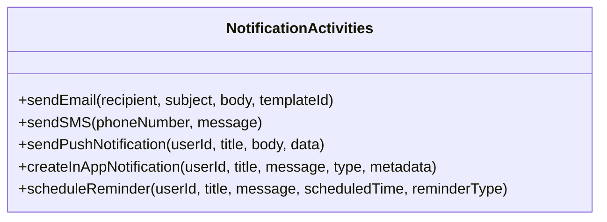

**Diagram sources**
- [notification-activities.ts](file://apps/backend/src/modules/temporal/activities/notification-activities.ts#L1-L19)

## Event-Driven Workflow Triggers
The system uses an event-driven architecture where business services trigger workflows in response to entity state changes. The WorkflowOrchestratorService listens for status changes and automatically triggers appropriate workflows.

```mermaid
flowchart TD
A[Entity Status Change] --> B{Check Entity Type}
B --> |accu_application| C[Check New Status]
B --> |project| D[Check New Status]
B --> |document| E[Check New Status]
C --> |submitted| F[triggerAccuApplicationWorkflow('submit')]
C --> |approved| G[triggerAccuApplicationWorkflow('approve')]
C --> |rejected| H[triggerAccuApplicationWorkflow('reject')]
D --> |active| I[triggerProjectWorkflow('start')]
D --> |on_hold| J[triggerProjectWorkflow('pause')]
D --> |completed| K[triggerProjectWorkflow('complete')]
E --> |review| L[triggerDocumentWorkflow('submit_review')]
E --> |approved| M[triggerDocumentWorkflow('approve')]
F --> N[Create Calendar Deadline]
G --> N
H --> N
I --> N
J --> N
K --> N
L --> N
M --> N
```

**Diagram sources**
- [workflow-orchestrator.service.ts](file://apps/backend/src/modules/temporal/workflow-orchestrator.service.ts#L287-L327)

**Section sources**
- [workflow-orchestrator.service.ts](file://apps/backend/src/modules/temporal/workflow-orchestrator.service.ts#L287-L327)

## State Persistence and Fault Tolerance
The Temporal.io engine provides built-in state persistence and fault tolerance, ensuring that workflows can survive process restarts and system failures. Workflow state is durably stored and automatically restored when workflows resume execution.

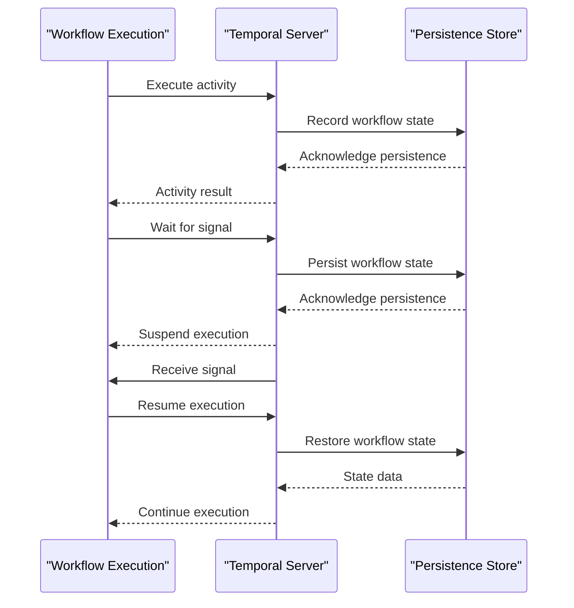

**Diagram sources**
- [temporal.service.ts](file://apps/backend/src/modules/temporal/temporal.service.ts#L23-L44)
- [temporal.worker.ts](file://apps/backend/src/modules/temporal/temporal.worker.ts#L7-L24)

**Section sources**
- [temporal.service.ts](file://apps/backend/src/modules/temporal/temporal.service.ts#L23-L44)
- [temporal.worker.ts](file://apps/backend/src/modules/temporal/temporal.worker.ts#L7-L24)

## Retry Mechanisms and Monitoring
The system implements comprehensive retry mechanisms and monitoring capabilities to ensure reliable workflow execution and timely issue resolution.

### Retry Mechanisms
Workflows are configured with timeout handling and automatic retry logic for transient failures. The system distinguishes between transient and permanent failures, applying appropriate recovery strategies.

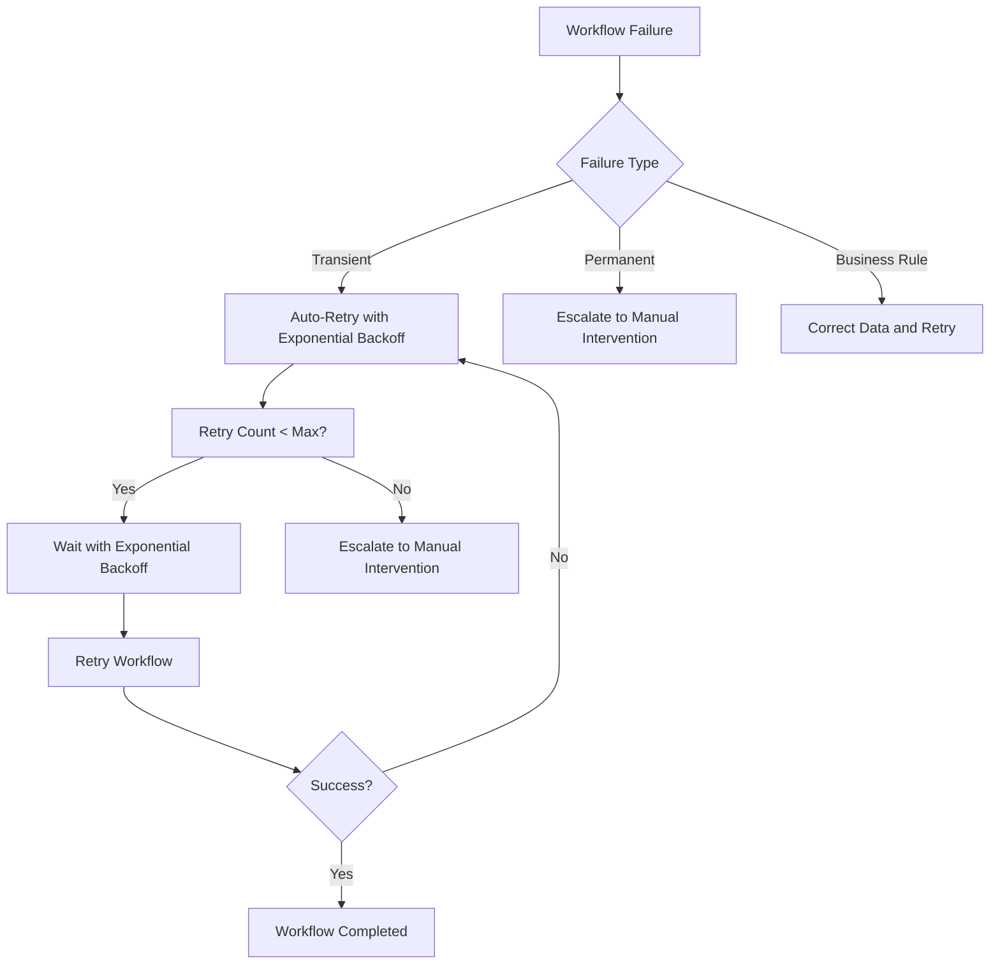

### Monitoring and Alerting
The WorkflowMonitoringService provides comprehensive monitoring, metrics collection, and automated alerting for workflow health and performance.

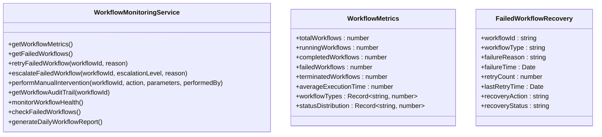

**Diagram sources**
- [workflow-monitoring.service.ts](file://apps/backend/src/modules/temporal/workflow-monitoring.service.ts#L1-L509)

**Section sources**
- [workflow-monitoring.service.ts](file://apps/backend/src/modules/temporal/workflow-monitoring.service.ts#L1-L509)

## System Architecture Diagram
The complete system architecture shows the integration between the NestJS application, Temporal.io workflow engine, and supporting services.

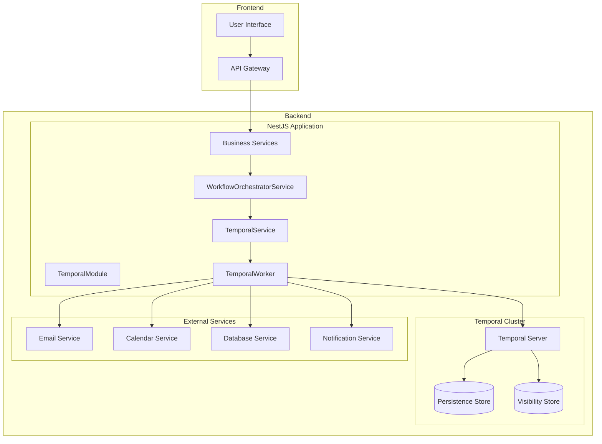

**Diagram sources**
- [temporal.module.ts](file://apps/backend/src/modules/temporal/temporal.module.ts#L1-L43)
- [workflow-orchestrator.service.ts](file://apps/backend/src/modules/temporal/workflow-orchestrator.service.ts#L1-L442)
- [temporal.service.ts](file://apps/backend/src/modules/temporal/temporal.service.ts#L1-L126)
- [temporal.worker.ts](file://apps/backend/src/modules/temporal/temporal.worker.ts#L1-L24)

## Conclusion
The Temporal.io workflow engine implementation provides a robust foundation for managing complex business processes within the ACCU platform. The architecture enables reliable execution of ACCU application lifecycles, document approvals, and compliance workflows through a combination of state persistence, fault tolerance, retry mechanisms, and comprehensive monitoring. The TemporalModule integrates seamlessly with the NestJS application, while the WorkflowOrchestratorService provides a unified interface for triggering and managing workflows. Workflow definitions encapsulate business logic with clear state management, while activity implementations handle specific operations. The event-driven nature of the system ensures that workflows are triggered appropriately in response to business events, enabling automated and reliable execution of critical processes.