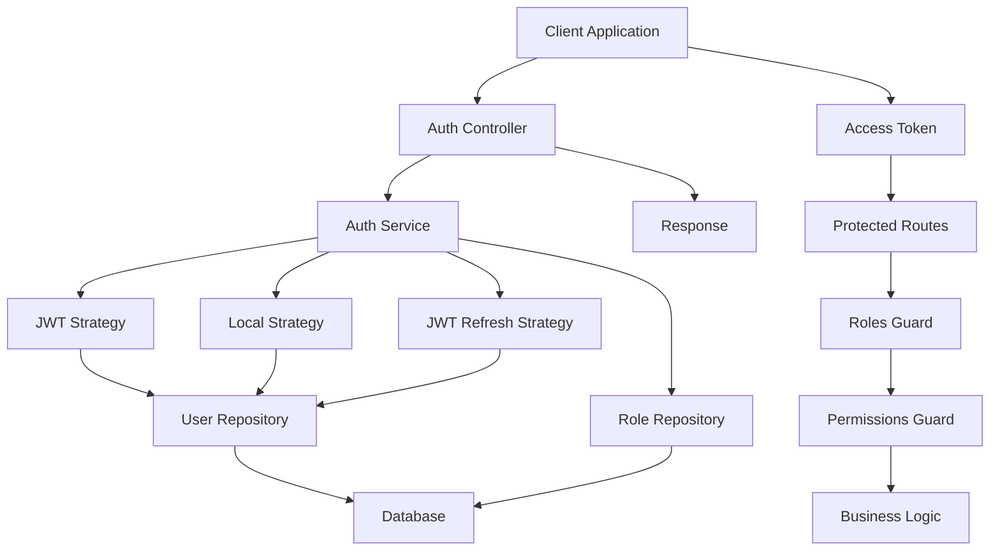
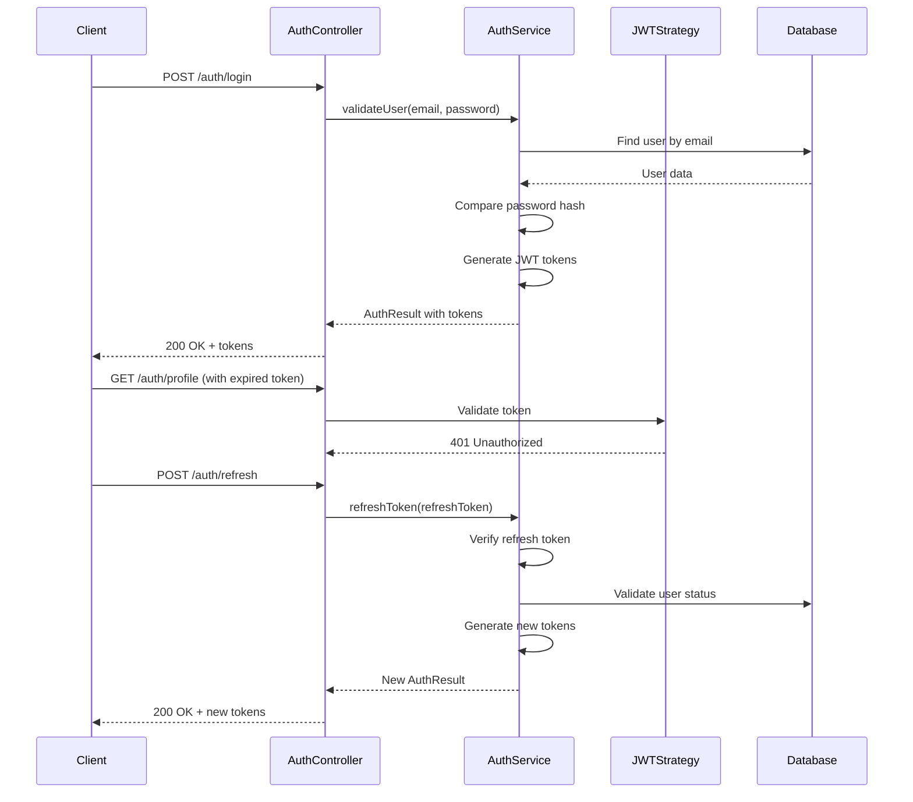
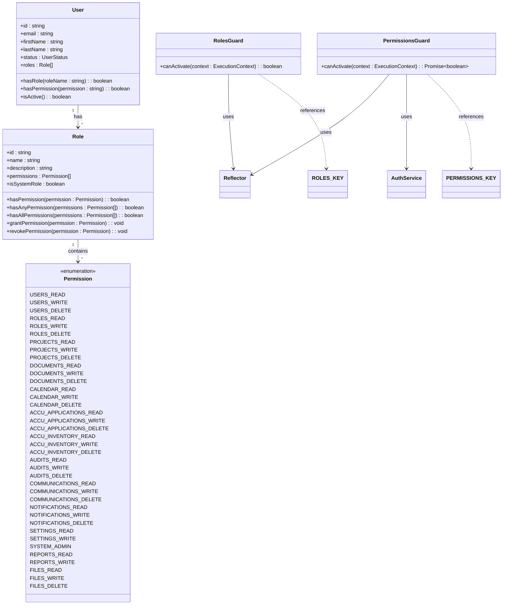
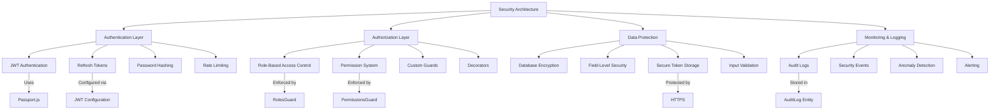
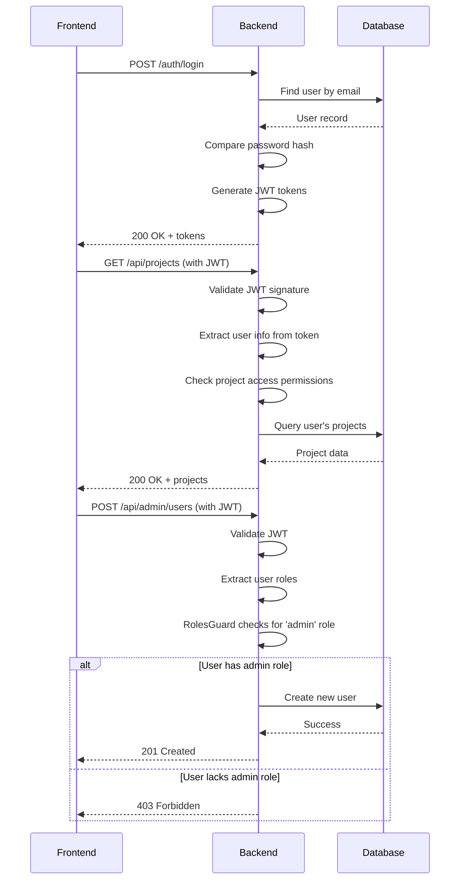

# Authentication & Authorization

<cite>
**Referenced Files in This Document**   
- [auth.controller.ts](file://apps/backend/src/modules/auth/auth.controller.ts)
- [auth.service.ts](file://apps/backend/src/modules/auth/auth.service.ts)
- [auth.module.ts](file://apps/backend/src/modules/auth/auth.module.ts)
- [jwt.strategy.ts](file://apps/backend/src/modules/auth/strategies/jwt.strategy.ts)
- [jwt-refresh.strategy.ts](file://apps/backend/src/modules/auth/strategies/jwt-refresh.strategy.ts)
- [local.strategy.ts](file://apps/backend/src/modules/auth/strategies/local.strategy.ts)
- [roles.guard.ts](file://apps/backend/src/common/guards/roles.guard.ts)
- [permissions.guard.ts](file://apps/backend/src/common/guards/permissions.guard.ts)
- [roles.decorator.ts](file://apps/backend/src/common/decorators/roles.decorator.ts)
- [permissions.decorator.ts](file://apps/backend/src/common/decorators/permissions.decorator.ts)
- [user.entity.ts](file://apps/backend/src/entities/user.entity.ts)
- [role.entity.ts](file://apps/backend/src/entities/role.entity.ts)
- [index.ts](file://apps/backend/src/modules/auth/dto/index.ts)
- [configuration.ts](file://apps/backend/src/config/configuration.ts)
</cite>

## Table of Contents
1. [Introduction](#introduction)
2. [Authentication System Overview](#authentication-system-overview)
3. [JWT-Based Authentication with Refresh Tokens](#jwt-based-authentication-with-refresh-tokens)
4. [Role-Based Access Control (RBAC) Implementation](#role-based-access-control-rbac-implementation)
5. [Security Architecture](#security-architecture)
6. [Authentication Endpoints and Public Interfaces](#authentication-endpoints-and-public-interfaces)
7. [Practical Examples and Use Cases](#practical-examples-and-use-cases)
8. [Configuration and Security Settings](#configuration-and-security-settings)

## Introduction

The ACCU Platform implements a robust authentication and authorization system designed to secure application access and manage user permissions effectively. This system combines JWT-based authentication with refresh tokens for secure session management, and a comprehensive Role-Based Access Control (RBAC) system with fine-grained permissions. The architecture follows industry best practices, leveraging NestJS's modular design, Passport.js for authentication strategies, and TypeORM for data persistence. The system ensures that only authenticated and authorized users can access protected resources while providing a seamless user experience through token refresh mechanisms.

## Authentication System Overview

The authentication system in the ACCU Platform is built on a modular architecture that separates concerns between authentication, authorization, and user management. At its core, the system uses JSON Web Tokens (JWT) for stateless authentication, allowing the platform to scale horizontally without session storage requirements. The authentication module handles user login, registration, token management, and profile operations, while the authorization system enforces access control through roles and permissions.

The system is designed with security as a primary concern, implementing password hashing with bcrypt, token expiration, and secure token storage practices. User credentials are never stored in plaintext, and sensitive operations are protected by appropriate guards and validation mechanisms. The architecture supports both short-lived access tokens and long-lived refresh tokens, enabling secure session persistence while minimizing the risk of token theft.



**Diagram sources**
- [auth.controller.ts](file://apps/backend/src/modules/auth/auth.controller.ts)
- [auth.service.ts](file://apps/backend/src/modules/auth/auth.service.ts)
- [jwt.strategy.ts](file://apps/backend/src/modules/auth/strategies/jwt.strategy.ts)

**Section sources**
- [auth.controller.ts](file://apps/backend/src/modules/auth/auth.controller.ts#L1-L152)
- [auth.service.ts](file://apps/backend/src/modules/auth/auth.service.ts#L1-L315)
- [auth.module.ts](file://apps/backend/src/modules/auth/auth.module.ts#L1-L44)

## JWT-Based Authentication with Refresh Tokens

The ACCU Platform implements a secure JWT-based authentication system that uses access tokens and refresh tokens to manage user sessions. This approach provides a balance between security and user experience by using short-lived access tokens that minimize the window of opportunity for token misuse, combined with long-lived refresh tokens that allow users to maintain their sessions without frequent re-authentication.

When a user successfully logs in via the `/auth/login` endpoint, the system validates the credentials using the LocalStrategy, which verifies the email and password against the stored user data. Upon successful validation, the AuthService generates a JWT access token with a short expiration time (15 minutes by default) and a refresh token with a longer expiration time (7 days by default). The access token contains essential user information including the user ID (sub), email, roles, and tenant ID, allowing the system to identify and authorize the user without querying the database on each request.

The refresh token mechanism allows users to obtain new access tokens without re-entering their credentials. When an access token expires, the client can use the refresh token to request a new access token via the `/auth/refresh` endpoint. This process validates the refresh token's signature and checks that it hasn't been revoked, then issues a new access token while maintaining the user's session. This approach enhances security by limiting the lifespan of access tokens while providing a seamless user experience.



**Diagram sources**
- [auth.controller.ts](file://apps/backend/src/modules/auth/auth.controller.ts#L31-L68)
- [auth.service.ts](file://apps/backend/src/modules/auth/auth.service.ts#L69-L159)
- [jwt.strategy.ts](file://apps/backend/src/modules/auth/strategies/jwt.strategy.ts#L1-L29)

**Section sources**
- [auth.service.ts](file://apps/backend/src/modules/auth/auth.service.ts#L19-L33)
- [jwt.strategy.ts](file://apps/backend/src/modules/auth/strategies/jwt.strategy.ts#L1-L29)
- [jwt-refresh.strategy.ts](file://apps/backend/src/modules/auth/strategies/jwt-refresh.strategy.ts#L1-L22)
- [configuration.ts](file://apps/backend/src/config/configuration.ts#L23-L28)

## Role-Based Access Control (RBAC) Implementation

The ACCU Platform implements a comprehensive Role-Based Access Control (RBAC) system that combines role-based and permission-based authorization mechanisms. This system allows fine-grained control over user access to different parts of the application, ensuring that users can only perform actions appropriate to their roles and responsibilities.

The RBAC implementation consists of several key components: roles, permissions, decorators, and guards. Roles represent job functions or user types within the system (such as 'admin', 'manager', 'user'), while permissions represent specific actions that can be performed (such as 'users.read', 'projects.write', 'documents.delete'). Each role contains a collection of permissions that define what actions users with that role can perform.

The system implements two types of authorization guards: RolesGuard and PermissionsGuard. These guards work in conjunction with custom decorators (@Roles and @Permissions) to protect routes and methods. The RolesGuard checks if the authenticated user has one of the required roles to access a resource, while the PermissionsGuard verifies that the user has the necessary permissions, either directly or through their assigned roles.



**Diagram sources**
- [user.entity.ts](file://apps/backend/src/entities/user.entity.ts#L1-L124)
- [role.entity.ts](file://apps/backend/src/entities/role.entity.ts#L1-L133)
- [roles.guard.ts](file://apps/backend/src/common/guards/roles.guard.ts#L1-L41)
- [permissions.guard.ts](file://apps/backend/src/common/guards/permissions.guard.ts#L1-L47)

**Section sources**
- [roles.decorator.ts](file://apps/backend/src/common/decorators/roles.decorator.ts#L1-L4)
- [permissions.decorator.ts](file://apps/backend/src/common/decorators/permissions.decorator.ts#L1-L6)
- [roles.guard.ts](file://apps/backend/src/common/guards/roles.guard.ts#L1-L41)
- [permissions.guard.ts](file://apps/backend/src/common/guards/permissions.guard.ts#L1-L47)
- [role.entity.ts](file://apps/backend/src/entities/role.entity.ts#L12-L74)

## Security Architecture

The security architecture of the ACCU Platform is designed with defense in depth principles, implementing multiple layers of protection to safeguard user data and system resources. The architecture follows a zero-trust model where every request must be authenticated and authorized, regardless of its origin.

At the foundation of the security architecture is the principle of least privilege, where users and services are granted only the minimum permissions necessary to perform their functions. This is enforced through the RBAC system, which ensures that users can only access resources and perform actions appropriate to their roles. The system also implements role hierarchy and permission inheritance, allowing for efficient management of access controls across different user types and organizational units.

The authentication flow is designed to be secure against common attacks such as brute force, credential stuffing, and token theft. Passwords are stored using bcrypt with a high work factor (12 rounds), making them resistant to rainbow table attacks. Access tokens have a short lifespan (15 minutes) to minimize the impact of token leakage, while refresh tokens are stored securely and can be invalidated when necessary. The system also includes mechanisms for detecting and responding to suspicious activity, such as multiple failed login attempts or access from unusual locations.



**Diagram sources**
- [auth.service.ts](file://apps/backend/src/modules/auth/auth.service.ts)
- [roles.guard.ts](file://apps/backend/src/common/guards/roles.guard.ts)
- [permissions.guard.ts](file://apps/backend/src/common/guards/permissions.guard.ts)
- [configuration.ts](file://apps/backend/src/config/configuration.ts)

**Section sources**
- [auth.service.ts](file://apps/backend/src/modules/auth/auth.service.ts#L1-L315)
- [roles.guard.ts](file://apps/backend/src/common/guards/roles.guard.ts#L1-L41)
- [permissions.guard.ts](file://apps/backend/src/common/guards/permissions.guard.ts#L1-L47)
- [configuration.ts](file://apps/backend/src/config/configuration.ts#L58-L62)

## Authentication Endpoints and Public Interfaces

The ACCU Platform exposes a comprehensive set of authentication endpoints that provide a complete user management and authentication experience. These endpoints follow RESTful principles and are documented using Swagger/OpenAPI annotations, making them easy to understand and integrate with client applications.

The primary authentication endpoints include:
- `POST /auth/login`: Authenticates a user with email and password, returning an access token and refresh token upon successful authentication
- `POST /auth/register`: Registers a new user with the provided information, hashing the password before storage
- `POST /auth/refresh`: Exchanges a valid refresh token for a new access token, allowing session continuation without re-authentication
- `GET /auth/profile`: Returns the current user's profile information, excluding sensitive fields like password
- `POST /auth/change-password`: Allows users to change their password after verifying their current password
- `PUT /auth/profile`: Updates the user's profile information with new details
- `POST /auth/logout`: Ends the user's current session (currently returns a success message, with potential for token blacklisting in future implementations)
- `GET /auth/validate`: Validates the current access token and returns user information if valid

Each endpoint is protected by appropriate validation and security measures. Request bodies are validated using class-validator decorators, ensuring that required fields are present and meet specified criteria (such as minimum password length). Sensitive operations like password changes require the user to be authenticated and may include additional security checks.

```mermaid
flowchart TD
A[Authentication Endpoints] --> B[/auth/login]
A --> C[/auth/register]
A --> D[/auth/refresh]
A --> E[/auth/profile]
A --> F[/auth/change-password]
A --> G[/auth/logout]
A --> H[/auth/validate]
B --> B1[Method: POST]
B1 --> B2[Body: LoginDto]
B2 --> B3[Response: AuthResponseDto]
B3 --> B4[Status: 200 on success]
B4 --> B5[Status: 401 on failure]
C --> C1[Method: POST]
C1 --> C2[Body: RegisterDto]
C2 --> C3[Response: AuthResponseDto]
C3 --> C4[Status: 201 on success]
C4 --> C5[Status: 409 on conflict]
D --> D1[Method: POST]
D1 --> D2[Body: RefreshTokenDto]
D2 --> D3[Response: AuthResponseDto]
D3 --> D4[Status: 200 on success]
D4 --> D5[Status: 401 on failure]
E --> E1[Method: GET]
E1 --> E2[Auth: Bearer Token]
E2 --> E3[Response: User profile]
E3 --> E4[Status: 200 on success]
E4 --> E5[Status: 401 on failure]
F --> F1[Method: POST]
F1 --> F2[Body: ChangePasswordDto]
F2 --> F3[Auth: Bearer Token]
F3 --> F4[Response: Success message]
F4 --> F5[Status: 200 on success]
F5 --> F6[Status: 400 on invalid current password]
G --> G1[Method: POST]
G1 --> G2[Auth: Bearer Token]
G2 --> G3[Response: Success message]
G3 --> G4[Status: 200]
H --> H1[Method: GET]
H1 --> H2[Auth: Bearer Token]
H2 --> H3[Response: Validation result]
H3 --> H4[Status: 200 on valid]
H4 --> H5[Status: 401 on invalid]
```

**Diagram sources**
- [auth.controller.ts](file://apps/backend/src/modules/auth/auth.controller.ts#L28-L152)
- [index.ts](file://apps/backend/src/modules/auth/dto/index.ts#L1-L190)

**Section sources**
- [auth.controller.ts](file://apps/backend/src/modules/auth/auth.controller.ts#L28-L152)
- [index.ts](file://apps/backend/src/modules/auth/dto/index.ts#L1-L190)
- [auth.service.ts](file://apps/backend/src/modules/auth/auth.service.ts#L36-L315)

## Practical Examples and Use Cases

The authentication and authorization system in the ACCU Platform supports various practical use cases that demonstrate its capabilities in real-world scenarios. These examples illustrate how the system handles common authentication flows and enforces access control based on user roles and permissions.

One common use case is the user login flow, where a user provides their email and password to authenticate with the system. The client application sends a POST request to the `/auth/login` endpoint with the user's credentials. The server validates the credentials against the stored user data, hashes the provided password, and compares it with the stored hash. Upon successful authentication, the server returns an access token and refresh token, which the client stores securely (typically in memory or secure storage) and uses to make subsequent authenticated requests.

Another important use case is role-based access control for administrative functions. For example, an endpoint that allows user management might be protected with the @Roles('admin') decorator, ensuring that only users with the 'admin' role can access it. When a request is made to this endpoint, the RolesGuard intercepts the request, extracts the user information from the JWT token, and checks if the user has the required 'admin' role. If the user lacks the required role, the guard throws a ForbiddenException, preventing access to the resource.



**Diagram sources**
- [auth.controller.ts](file://apps/backend/src/modules/auth/auth.controller.ts)
- [roles.guard.ts](file://apps/backend/src/common/guards/roles.guard.ts)
- [permissions.guard.ts](file://apps/backend/src/common/guards/permissions.guard.ts)

**Section sources**
- [auth.controller.ts](file://apps/backend/src/modules/auth/auth.controller.ts#L31-L152)
- [roles.guard.ts](file://apps/backend/src/common/guards/roles.guard.ts#L1-L41)
- [permissions.guard.ts](file://apps/backend/src/common/guards/permissions.guard.ts#L1-L47)

## Configuration and Security Settings

The authentication and authorization system in the ACCU Platform is highly configurable through environment variables and configuration files, allowing administrators to customize security settings based on their deployment environment and security requirements. The primary configuration is managed through the configuration.ts file, which defines various security-related parameters that control the behavior of the authentication system.

Key security settings include the JWT secret key, which is used to sign and verify JWT tokens. This key should be a long, random string and must be kept secret, as anyone with access to it can generate valid tokens for the system. The configuration also specifies the expiration times for access tokens (default 15 minutes) and refresh tokens (default 7 days), allowing administrators to balance security and user convenience based on their risk tolerance.

Additional security settings include rate limiting configuration to prevent brute force attacks on authentication endpoints, CORS settings to control which domains can access the API, and database connection security parameters. The system also supports feature flags that can enable or disable certain security features based on the deployment environment, such as enabling or disabling the workflow engine or real-time notifications.

**Section sources**
- [configuration.ts](file://apps/backend/src/config/configuration.ts#L23-L28)
- [auth.module.ts](file://apps/backend/src/modules/auth/auth.module.ts#L19-L28)
- [auth.service.ts](file://apps/backend/src/modules/auth/auth.service.ts#L294-L298)