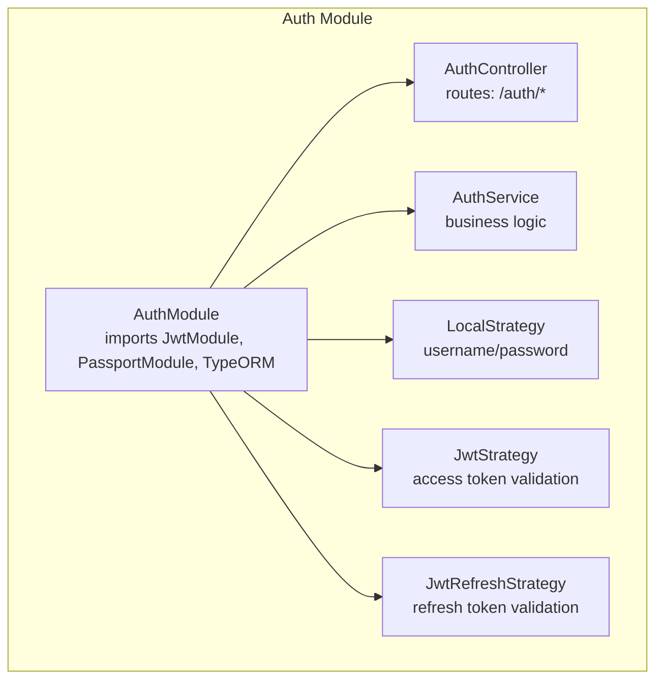
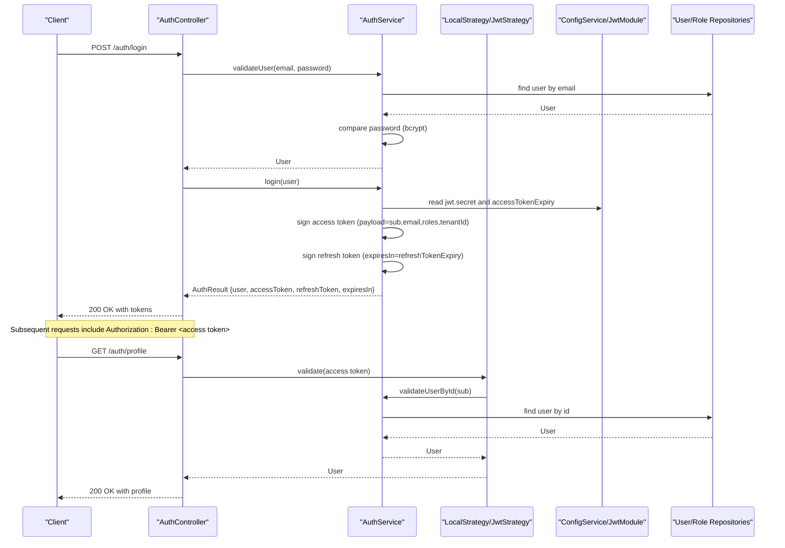
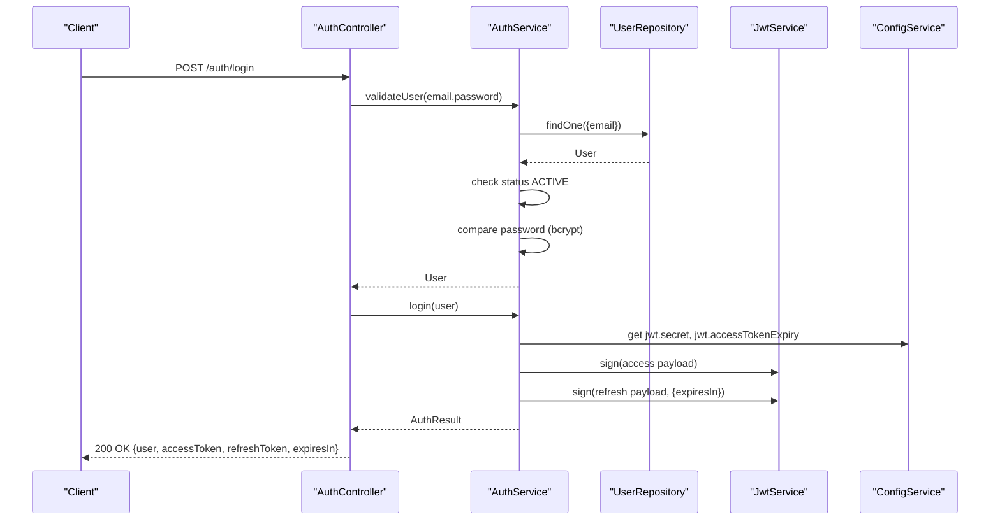
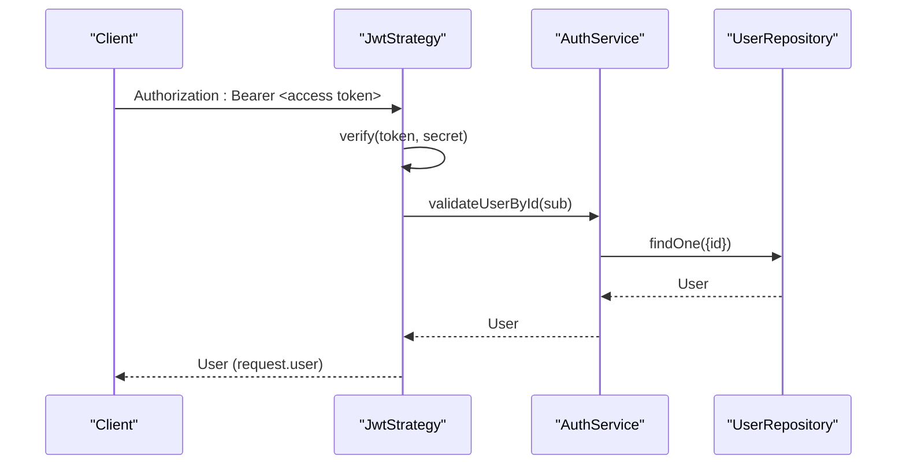
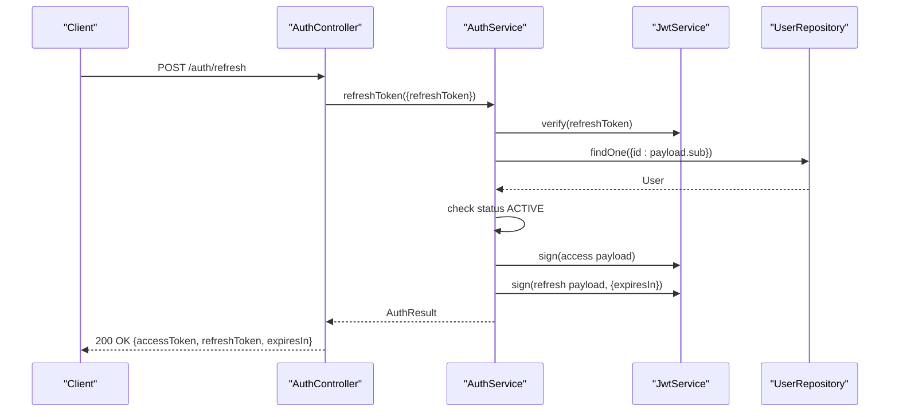
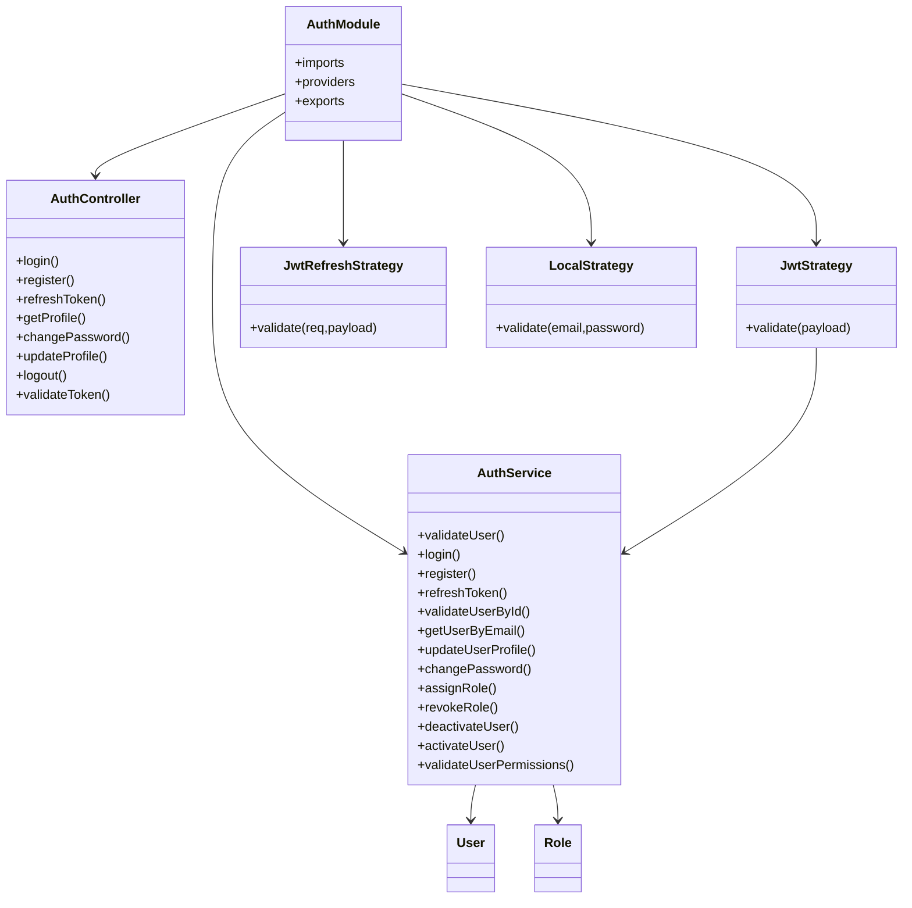

# JWT Authentication

<cite>
**Referenced Files in This Document**
- [auth.service.ts](file://apps/backend/src/modules/auth/auth.service.ts)
- [auth.controller.ts](file://apps/backend/src/modules/auth/auth.controller.ts)
- [auth.module.ts](file://apps/backend/src/modules/auth/auth.module.ts)
- [jwt.strategy.ts](file://apps/backend/src/modules/auth/strategies/jwt.strategy.ts)
- [jwt-refresh.strategy.ts](file://apps/backend/src/modules/auth/strategies/jwt-refresh.strategy.ts)
- [local.strategy.ts](file://apps/backend/src/modules/auth/strategies/local.strategy.ts)
- [configuration.ts](file://apps/backend/src/config/configuration.ts)
- [user.entity.ts](file://apps/backend/src/entities/user.entity.ts)
- [role.entity.ts](file://apps/backend/src/entities/role.entity.ts)
- [index.ts](file://apps/backend/src/modules/auth/dto/index.ts)
- [auth.integration.test.ts](file://apps/backend/test/integration/auth.integration.test.ts)
</cite>

## Table of Contents
1. [Introduction](#introduction)
2. [Project Structure](#project-structure)
3. [Core Components](#core-components)
4. [Architecture Overview](#architecture-overview)
5. [Detailed Component Analysis](#detailed-component-analysis)
6. [Dependency Analysis](#dependency-analysis)
7. [Performance Considerations](#performance-considerations)
8. [Troubleshooting Guide](#troubleshooting-guide)
9. [Conclusion](#conclusion)

## Introduction
This section documents the JWT-based authentication system in the ACCU Platform backend. It explains how JWT secures API endpoints, maintains user sessions, and integrates with NestJS Passport and JwtStrategy. It covers the login flow, token generation and validation, the structure of the JWT payload, and the roles of AuthService and AuthController. Security considerations such as token expiration, secure storage recommendations, and environment variable configuration are included, along with error handling patterns for invalid credentials and expired tokens.

## Project Structure
The authentication system is organized around a dedicated auth module with strategies, controller, service, DTOs, and configuration. The module registers Passport strategies and JWT modules, wires repositories for users and roles, and exposes endpoints for login, registration, token refresh, profile management, and logout.

**Diagram sources**
- [auth.module.ts](file://apps/backend/src/modules/auth/auth.module.ts#L1-L44)

**Section sources**
- [auth.module.ts](file://apps/backend/src/modules/auth/auth.module.ts#L1-L44)

## Core Components
- AuthService orchestrates user validation, password hashing, token signing, and refresh token verification. It defines the JWT payload shape and computes access token expiry from configuration.
- AuthController exposes endpoints for login, registration, refresh, profile retrieval/update, password change, logout, and token validation.
- Strategies integrate with Passport: LocalStrategy validates credentials, JwtStrategy validates access tokens, and JwtRefreshStrategy validates refresh tokens.
- Configuration loads JWT secret and expiry durations from environment variables.
- Entities define user and role structures used in JWT payloads and permissions checks.

**Section sources**
- [auth.service.ts](file://apps/backend/src/modules/auth/auth.service.ts#L19-L33)
- [auth.controller.ts](file://apps/backend/src/modules/auth/auth.controller.ts#L1-L152)
- [jwt.strategy.ts](file://apps/backend/src/modules/auth/strategies/jwt.strategy.ts#L1-L29)
- [jwt-refresh.strategy.ts](file://apps/backend/src/modules/auth/strategies/jwt-refresh.strategy.ts#L1-L22)
- [local.strategy.ts](file://apps/backend/src/modules/auth/strategies/local.strategy.ts#L1-L21)
- [configuration.ts](file://apps/backend/src/config/configuration.ts#L23-L28)
- [user.entity.ts](file://apps/backend/src/entities/user.entity.ts#L1-L124)
- [role.entity.ts](file://apps/backend/src/entities/role.entity.ts#L1-L133)

## Architecture Overview
The system uses bearer tokens for stateless session management. Access tokens are short-lived (15 minutes by default), while refresh tokens are long-lived (7 days by default). On successful login, the service signs two tokens and returns them to the client. Protected routes use JwtStrategy to validate access tokens. Refresh tokens are validated by JwtRefreshStrategy and processed by AuthService to issue new access tokens.

**Diagram sources**
- [auth.controller.ts](file://apps/backend/src/modules/auth/auth.controller.ts#L31-L83)
- [auth.service.ts](file://apps/backend/src/modules/auth/auth.service.ts#L46-L96)
- [jwt.strategy.ts](file://apps/backend/src/modules/auth/strategies/jwt.strategy.ts#L1-L29)
- [auth.module.ts](file://apps/backend/src/modules/auth/auth.module.ts#L18-L28)
- [configuration.ts](file://apps/backend/src/config/configuration.ts#L23-L28)

## Detailed Component Analysis

### JWT Payload Structure
The JWT payload carries essential identity and authorization claims:
- sub: user identifier
- email: user’s email
- roles: array of role names
- tenantId: optional tenant identifier for multi-tenancy
- iat/exp: issued at and expiration timestamps (managed by JwtService)

These fields are populated during login and used by JwtStrategy to resolve the authenticated user.

**Section sources**
- [auth.service.ts](file://apps/backend/src/modules/auth/auth.service.ts#L19-L33)
- [auth.service.ts](file://apps/backend/src/modules/auth/auth.service.ts#L75-L80)
- [jwt.strategy.ts](file://apps/backend/src/modules/auth/strategies/jwt.strategy.ts#L21-L28)

### Login Flow
- AuthController receives credentials and delegates to AuthService.validateUser.
- AuthService loads the user, verifies account status, and compares the password hash.
- On success, AuthService updates last login, constructs the payload, signs access and refresh tokens, and returns an AuthResult.
- AuthController returns the tokens to the client.

**Diagram sources**
- [auth.controller.ts](file://apps/backend/src/modules/auth/auth.controller.ts#L31-L43)
- [auth.service.ts](file://apps/backend/src/modules/auth/auth.service.ts#L46-L96)
- [auth.module.ts](file://apps/backend/src/modules/auth/auth.module.ts#L18-L28)
- [configuration.ts](file://apps/backend/src/config/configuration.ts#L23-L28)

**Section sources**
- [auth.controller.ts](file://apps/backend/src/modules/auth/auth.controller.ts#L31-L43)
- [auth.service.ts](file://apps/backend/src/modules/auth/auth.service.ts#L46-L96)

### Token Generation and Signing
- Access token: signed with the configured secret and default expiry from configuration.
- Refresh token: signed with the same secret but with a longer expiry configured separately.
- Expiration parsing converts “15m” to milliseconds for the AuthResult.

**Section sources**
- [auth.service.ts](file://apps/backend/src/modules/auth/auth.service.ts#L75-L96)
- [auth.service.ts](file://apps/backend/src/modules/auth/auth.service.ts#L293-L298)
- [auth.module.ts](file://apps/backend/src/modules/auth/auth.module.ts#L18-L28)
- [configuration.ts](file://apps/backend/src/config/configuration.ts#L23-L28)

### Token Validation with JwtStrategy
- JwtStrategy extracts the bearer token and validates it against the configured secret.
- On success, it resolves the user by the payload’s sub claim via AuthService.validateUserById.
- On failure or resolution errors, UnauthorizedException is thrown.

**Diagram sources**
- [jwt.strategy.ts](file://apps/backend/src/modules/auth/strategies/jwt.strategy.ts#L1-L29)
- [auth.service.ts](file://apps/backend/src/modules/auth/auth.service.ts#L161-L172)

**Section sources**
- [jwt.strategy.ts](file://apps/backend/src/modules/auth/strategies/jwt.strategy.ts#L1-L29)
- [auth.service.ts](file://apps/backend/src/modules/auth/auth.service.ts#L161-L172)

### Refresh Token Flow
- JwtRefreshStrategy validates the refresh token and passes the payload and raw token to AuthService.
- AuthService verifies the user is active and reissues a new access token (and optionally a new refresh token).
- The refresh endpoint returns a new AuthResult.

**Diagram sources**
- [auth.controller.ts](file://apps/backend/src/modules/auth/auth.controller.ts#L57-L68)
- [auth.service.ts](file://apps/backend/src/modules/auth/auth.service.ts#L142-L159)
- [jwt-refresh.strategy.ts](file://apps/backend/src/modules/auth/strategies/jwt-refresh.strategy.ts#L1-L22)

**Section sources**
- [auth.controller.ts](file://apps/backend/src/modules/auth/auth.controller.ts#L57-L68)
- [auth.service.ts](file://apps/backend/src/modules/auth/auth.service.ts#L142-L159)
- [jwt-refresh.strategy.ts](file://apps/backend/src/modules/auth/strategies/jwt-refresh.strategy.ts#L1-L22)

### Password Hashing with bcrypt
- During registration, passwords are hashed with a configurable salt factor.
- During login, AuthService compares the provided password with the stored hash.
- During password change, the old password is verified before updating to a new hashed password.

**Section sources**
- [auth.service.ts](file://apps/backend/src/modules/auth/auth.service.ts#L108-L111)
- [auth.service.ts](file://apps/backend/src/modules/auth/auth.service.ts#L204-L224)
- [auth.service.ts](file://apps/backend/src/modules/auth/auth.service.ts#L46-L67)

### Integration Between AuthController and AuthService
- AuthController delegates all business logic to AuthService, keeping routes thin and testable.
- DTOs define request/response shapes and Swagger metadata for endpoints.

**Section sources**
- [auth.controller.ts](file://apps/backend/src/modules/auth/auth.controller.ts#L31-L151)
- [index.ts](file://apps/backend/src/modules/auth/dto/index.ts#L1-L190)

### Environment Variables and Configuration
- JWT secret and expiry durations are loaded from environment variables via ConfigService.
- Defaults are provided in configuration for development safety.

**Section sources**
- [configuration.ts](file://apps/backend/src/config/configuration.ts#L23-L28)
- [auth.module.ts](file://apps/backend/src/modules/auth/auth.module.ts#L18-L28)

### Error Handling Patterns
- Invalid credentials: LocalStrategy throws UnauthorizedException.
- Invalid/missing tokens: JwtStrategy throws UnauthorizedException.
- Expired tokens: Passport-JWT rejects them automatically; JwtStrategy throws UnauthorizedException on validation failure.
- Account inactive: AuthService rejects login attempts for non-active users.
- Registration conflicts: ConflictException when email exists.
- Validation failures: BadRequestException for incorrect current password; input validation errors for malformed DTOs.

**Section sources**
- [local.strategy.ts](file://apps/backend/src/modules/auth/strategies/local.strategy.ts#L14-L20)
- [jwt.strategy.ts](file://apps/backend/src/modules/auth/strategies/jwt.strategy.ts#L21-L28)
- [auth.service.ts](file://apps/backend/src/modules/auth/auth.service.ts#L46-L67)
- [auth.service.ts](file://apps/backend/src/modules/auth/auth.service.ts#L98-L106)
- [auth.controller.ts](file://apps/backend/src/modules/auth/auth.controller.ts#L31-L43)
- [auth.integration.test.ts](file://apps/backend/test/integration/auth.integration.test.ts#L167-L238)

## Dependency Analysis
The auth module composes strategies, services, and repositories. JwtModule and PassportModule are registered with configuration from ConfigService. JwtStrategy depends on AuthService for user resolution. AuthController depends on AuthService for all operations.

**Diagram sources**
- [auth.module.ts](file://apps/backend/src/modules/auth/auth.module.ts#L1-L44)
- [auth.controller.ts](file://apps/backend/src/modules/auth/auth.controller.ts#L1-L152)
- [auth.service.ts](file://apps/backend/src/modules/auth/auth.service.ts#L1-L315)
- [jwt.strategy.ts](file://apps/backend/src/modules/auth/strategies/jwt.strategy.ts#L1-L29)
- [jwt-refresh.strategy.ts](file://apps/backend/src/modules/auth/strategies/jwt-refresh.strategy.ts#L1-L22)
- [local.strategy.ts](file://apps/backend/src/modules/auth/strategies/local.strategy.ts#L1-L21)
- [user.entity.ts](file://apps/backend/src/entities/user.entity.ts#L1-L124)
- [role.entity.ts](file://apps/backend/src/entities/role.entity.ts#L1-L133)

**Section sources**
- [auth.module.ts](file://apps/backend/src/modules/auth/auth.module.ts#L1-L44)
- [auth.service.ts](file://apps/backend/src/modules/auth/auth.service.ts#L1-L315)

## Performance Considerations
- Token verification is CPU-lightweight compared to database lookups; keep JwtModule secret and expiry in memory via ConfigService.
- Use short-lived access tokens (15 minutes) to minimize risk and reduce token lifetime overhead.
- Consider caching recent user profiles for frequently accessed endpoints to reduce DB round-trips.
- Avoid storing tokens in insecure locations (e.g., localStorage without additional protections); prefer secure, httpOnly cookies for browser clients.

[No sources needed since this section provides general guidance]

## Troubleshooting Guide
Common issues and resolutions:
- Invalid credentials on login: Verify email and password match stored hash; ensure account status is active.
- Invalid refresh token: Confirm the token was signed with the same secret and is not expired; ensure the associated user is still active.
- Unauthorized on protected routes: Ensure Authorization header includes a valid bearer token; check token expiration and secret mismatch.
- Registration conflicts: Duplicate emails cause conflict exceptions; ensure uniqueness.
- Password change failures: Current password must match the stored hash; otherwise BadRequestException is thrown.

**Section sources**
- [auth.integration.test.ts](file://apps/backend/test/integration/auth.integration.test.ts#L167-L238)
- [auth.integration.test.ts](file://apps/backend/test/integration/auth.integration.test.ts#L240-L269)
- [auth.integration.test.ts](file://apps/backend/test/integration/auth.integration.test.ts#L394-L431)
- [auth.integration.test.ts](file://apps/backend/test/integration/auth.integration.test.ts#L474-L537)

## Conclusion
The ACCU Platform employs a robust, standards-compliant JWT authentication system. Access tokens are short-lived and refresh tokens provide seamless session renewal. The design leverages NestJS Passport and JwtStrategy for secure token validation, with AuthService encapsulating business logic for user validation, password hashing, and token signing. Configuration via environment variables ensures flexibility across environments, and comprehensive error handling improves resilience and user feedback.