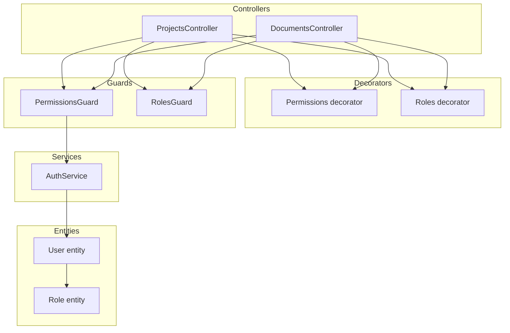
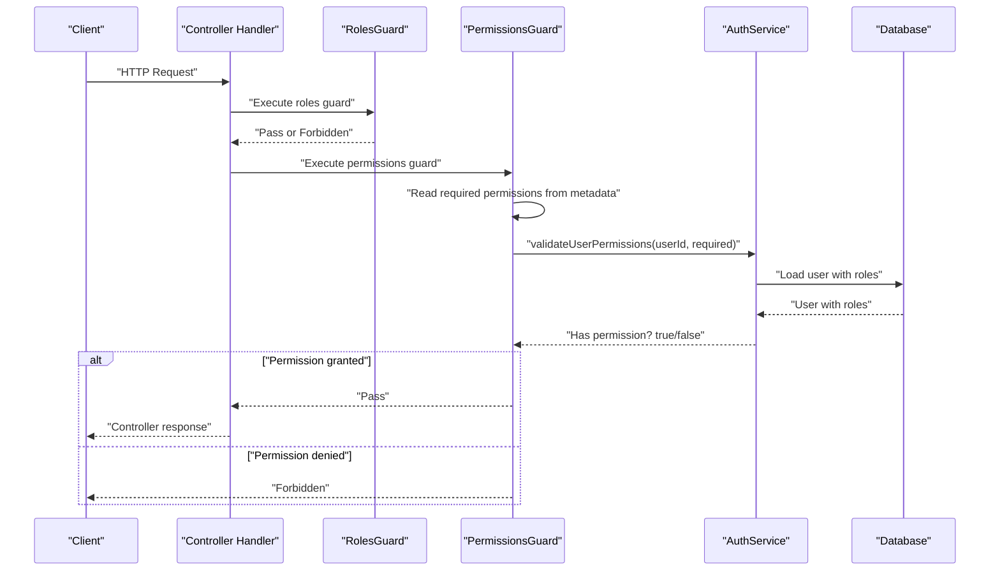
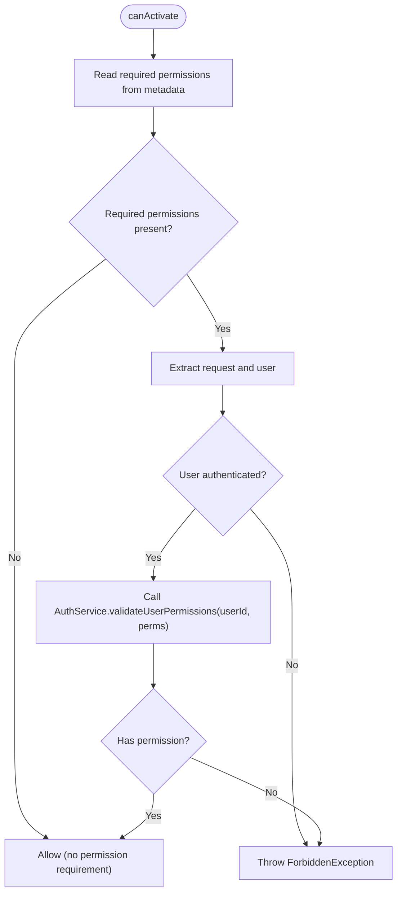
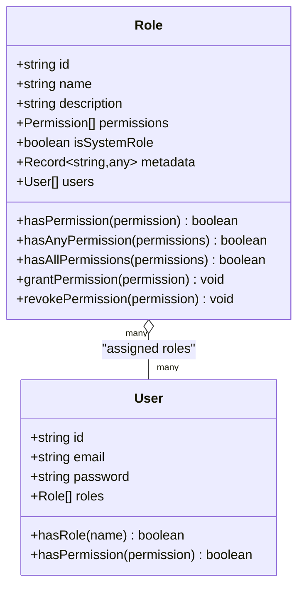
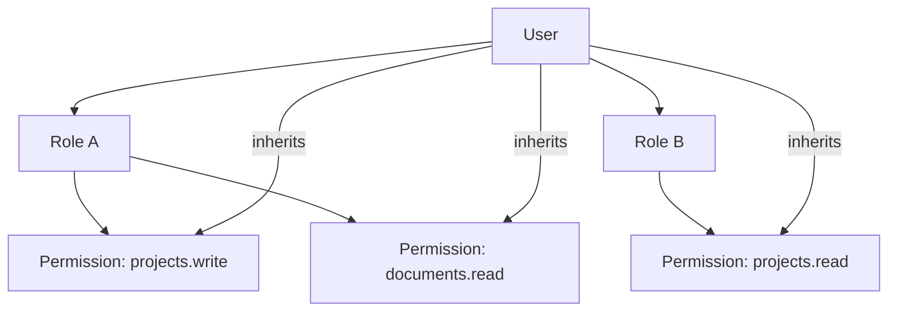
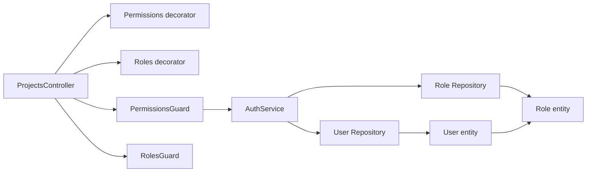
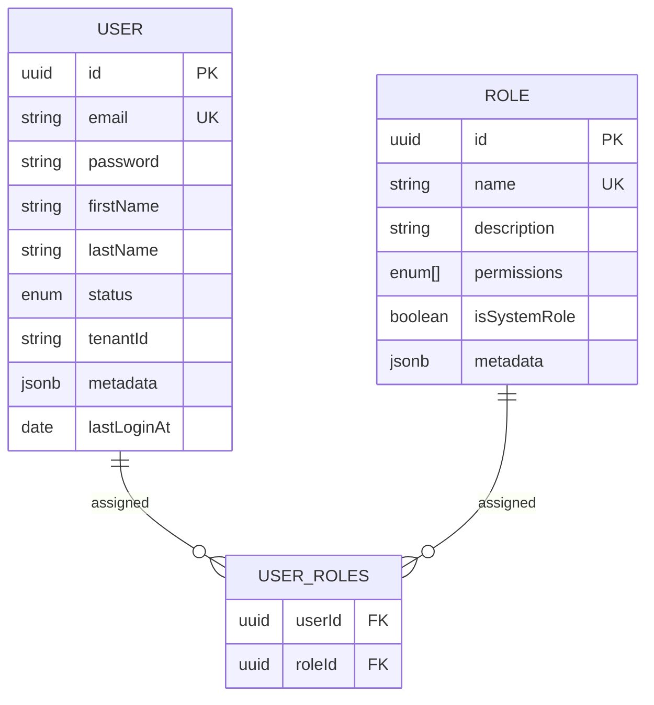

# Permission System

<cite>
**Referenced Files in This Document**
- [permissions.guard.ts](file://apps/backend/src/common/guards/permissions.guard.ts)
- [permissions.decorator.ts](file://apps/backend/src/common/decorators/permissions.decorator.ts)
- [roles.guard.ts](file://apps/backend/src/common/guards/roles.guard.ts)
- [roles.decorator.ts](file://apps/backend/src/common/decorators/roles.decorator.ts)
- [role.entity.ts](file://apps/backend/src/entities/role.entity.ts)
- [user.entity.ts](file://apps/backend/src/entities/user.entity.ts)
- [auth.service.ts](file://apps/backend/src/modules/auth/auth.service.ts)
- [projects.controller.ts](file://apps/backend/src/modules/projects/projects.controller.ts)
- [documents.controller.ts](file://apps/backend/src/modules/documents/documents.controller.ts)
- [configuration.ts](file://apps/backend/src/config/configuration.ts)
- [load-testing.test.ts](file://apps/backend/test/performance/load-testing.test.ts)
- [ACCU_Platform_Architecture_Diagram.md](file://ACCU_Platform_Architecture_Diagram.md)
- [security-policy.yml](file://security/security-policy.yml)
</cite>

## Table of Contents
1. [Introduction](#introduction)
2. [Project Structure](#project-structure)
3. [Core Components](#core-components)
4. [Architecture Overview](#architecture-overview)
5. [Detailed Component Analysis](#detailed-component-analysis)
6. [Dependency Analysis](#dependency-analysis)
7. [Performance Considerations](#performance-considerations)
8. [Troubleshooting Guide](#troubleshooting-guide)
9. [Conclusion](#conclusion)
10. [Appendices](#appendices)

## Introduction
This document explains the granular permission system in the ACCU Platform. It focuses on how permissions provide finer-grained control beyond roles, enabling specific actions such as project creation and document deletion. It documents the implementation of PermissionsGuard and its integration with AuthService.validateUserPermissions, describes how permissions are stored as arrays in the Role entity and checked against required permissions for protected endpoints, and outlines how controllers use permission decorators to protect routes. It also covers the database relationship between roles and permissions, how users inherit permissions through assigned roles, performance considerations for permission checks, and security implications with best practices for least privilege.

## Project Structure
The permission system spans several layers:
- Decorators define required permissions and roles at controller endpoints.
- Guards enforce authentication, role-based checks, and permission-based checks.
- Entities model users, roles, and permissions.
- Services implement permission validation logic.
- Controllers apply decorators to protect endpoints.

**Diagram sources**
- [projects.controller.ts](file://apps/backend/src/modules/projects/projects.controller.ts#L52-L60)
- [documents.controller.ts](file://apps/backend/src/modules/documents/documents.controller.ts#L53-L60)
- [permissions.guard.ts](file://apps/backend/src/common/guards/permissions.guard.ts#L19-L46)
- [roles.guard.ts](file://apps/backend/src/common/guards/roles.guard.ts#L14-L40)
- [auth.service.ts](file://apps/backend/src/modules/auth/auth.service.ts#L300-L315)
- [user.entity.ts](file://apps/backend/src/entities/user.entity.ts#L70-L76)
- [role.entity.ts](file://apps/backend/src/entities/role.entity.ts#L76-L104)

**Section sources**
- [projects.controller.ts](file://apps/backend/src/modules/projects/projects.controller.ts#L52-L60)
- [documents.controller.ts](file://apps/backend/src/modules/documents/documents.controller.ts#L53-L60)
- [permissions.guard.ts](file://apps/backend/src/common/guards/permissions.guard.ts#L19-L46)
- [roles.guard.ts](file://apps/backend/src/common/guards/roles.guard.ts#L14-L40)
- [auth.service.ts](file://apps/backend/src/modules/auth/auth.service.ts#L300-L315)
- [user.entity.ts](file://apps/backend/src/entities/user.entity.ts#L70-L76)
- [role.entity.ts](file://apps/backend/src/entities/role.entity.ts#L76-L104)

## Core Components
- Permissions decorator: Stores required permissions metadata on controller handlers.
- PermissionsGuard: Reads required permissions and validates them against the authenticated user’s roles.
- Roles decorator and RolesGuard: Enforce role-based access prior to permission checks.
- Role entity: Defines the Permission enum and stores permissions as an array on roles.
- User entity: Defines many-to-many relationship with roles and exposes helpers to check permissions.
- AuthService.validateUserPermissions: Performs the permission check by loading the user with roles and verifying intersection between required permissions and user role permissions.

Key implementation references:
- Decorator definition and key: [permissions.decorator.ts](file://apps/backend/src/common/decorators/permissions.decorator.ts#L1-L6)
- Guard reads metadata and calls service: [permissions.guard.ts](file://apps/backend/src/common/guards/permissions.guard.ts#L19-L46)
- Service permission validation: [auth.service.ts](file://apps/backend/src/modules/auth/auth.service.ts#L300-L315)
- Role entity permissions array and helpers: [role.entity.ts](file://apps/backend/src/entities/role.entity.ts#L76-L104), [role.entity.ts](file://apps/backend/src/entities/role.entity.ts#L112-L133)
- User entity many-to-many roles and permission helper: [user.entity.ts](file://apps/backend/src/entities/user.entity.ts#L70-L76), [user.entity.ts](file://apps/backend/src/entities/user.entity.ts#L115-L119)

**Section sources**
- [permissions.decorator.ts](file://apps/backend/src/common/decorators/permissions.decorator.ts#L1-L6)
- [permissions.guard.ts](file://apps/backend/src/common/guards/permissions.guard.ts#L19-L46)
- [auth.service.ts](file://apps/backend/src/modules/auth/auth.service.ts#L300-L315)
- [role.entity.ts](file://apps/backend/src/entities/role.entity.ts#L76-L104)
- [role.entity.ts](file://apps/backend/src/entities/role.entity.ts#L112-L133)
- [user.entity.ts](file://apps/backend/src/entities/user.entity.ts#L70-L76)
- [user.entity.ts](file://apps/backend/src/entities/user.entity.ts#L115-L119)

## Architecture Overview
The permission enforcement pipeline:
- Controllers apply @Roles and @Permissions decorators to endpoints.
- Guards execute in order: RolesGuard (role check) then PermissionsGuard (permission check).
- PermissionsGuard retrieves required permissions from metadata and calls AuthService.validateUserPermissions.
- AuthService loads the user with roles and checks if any role grants any of the required permissions.
- If permission fails, a forbidden response is returned; otherwise, the request proceeds to the controller handler.

**Diagram sources**
- [roles.guard.ts](file://apps/backend/src/common/guards/roles.guard.ts#L14-L40)
- [permissions.guard.ts](file://apps/backend/src/common/guards/permissions.guard.ts#L19-L46)
- [auth.service.ts](file://apps/backend/src/modules/auth/auth.service.ts#L300-L315)
- [projects.controller.ts](file://apps/backend/src/modules/projects/projects.controller.ts#L52-L60)
- [documents.controller.ts](file://apps/backend/src/modules/documents/documents.controller.ts#L53-L60)

## Detailed Component Analysis

### PermissionsGuard
PermissionsGuard reads required permissions from metadata and delegates validation to AuthService.validateUserPermissions. It throws a forbidden exception if the user lacks the required permissions.

**Diagram sources**
- [permissions.guard.ts](file://apps/backend/src/common/guards/permissions.guard.ts#L19-L46)
- [auth.service.ts](file://apps/backend/src/modules/auth/auth.service.ts#L300-L315)

**Section sources**
- [permissions.guard.ts](file://apps/backend/src/common/guards/permissions.guard.ts#L19-L46)

### Permissions decorator
The Permissions decorator sets metadata with a key used by PermissionsGuard to retrieve required permissions.

- Decorator key: [permissions.decorator.ts](file://apps/backend/src/common/decorators/permissions.decorator.ts#L4-L6)
- Usage in controllers: [projects.controller.ts](file://apps/backend/src/modules/projects/projects.controller.ts#L58-L60), [documents.controller.ts](file://apps/backend/src/modules/documents/documents.controller.ts#L60-L62)

**Section sources**
- [permissions.decorator.ts](file://apps/backend/src/common/decorators/permissions.decorator.ts#L1-L6)
- [projects.controller.ts](file://apps/backend/src/modules/projects/projects.controller.ts#L58-L60)
- [documents.controller.ts](file://apps/backend/src/modules/documents/documents.controller.ts#L60-L62)

### AuthService.validateUserPermissions
AuthService.load the user with roles and checks whether any role includes any of the required permissions. This implements the core permission evaluation logic.

- Validation logic: [auth.service.ts](file://apps/backend/src/modules/auth/auth.service.ts#L300-L315)
- User loading with roles: [auth.service.ts](file://apps/backend/src/modules/auth/auth.service.ts#L301-L304)

**Section sources**
- [auth.service.ts](file://apps/backend/src/modules/auth/auth.service.ts#L300-L315)

### Role entity and permissions storage
- Permission enum defines granular actions across domains (users, roles, projects, documents, calendar, audits, communications, notifications, settings, reports, files).
- Role.permissions is stored as an array of Permission values.
- Helpers to check inclusion and grant/revoke permissions.

**Diagram sources**
- [role.entity.ts](file://apps/backend/src/entities/role.entity.ts#L76-L104)
- [role.entity.ts](file://apps/backend/src/entities/role.entity.ts#L112-L133)
- [user.entity.ts](file://apps/backend/src/entities/user.entity.ts#L70-L76)
- [user.entity.ts](file://apps/backend/src/entities/user.entity.ts#L115-L119)

**Section sources**
- [role.entity.ts](file://apps/backend/src/entities/role.entity.ts#L12-L74)
- [role.entity.ts](file://apps/backend/src/entities/role.entity.ts#L76-L104)
- [role.entity.ts](file://apps/backend/src/entities/role.entity.ts#L112-L133)
- [user.entity.ts](file://apps/backend/src/entities/user.entity.ts#L70-L76)
- [user.entity.ts](file://apps/backend/src/entities/user.entity.ts#L115-L119)

### Controllers and permission decorators (examples)
Controllers apply @Roles and @Permissions to endpoints. For example:
- ProjectsController creates projects requiring PROJECTS_WRITE permission.
- DocumentsController uploads documents requiring DOCUMENTS_WRITE permission.
- Some endpoints require multiple permissions (e.g., accessing project documents requires both PROJECTS_READ and DOCUMENTS_READ).

References:
- [projects.controller.ts](file://apps/backend/src/modules/projects/projects.controller.ts#L58-L60)
- [documents.controller.ts](file://apps/backend/src/modules/documents/documents.controller.ts#L60-L62)
- [projects.controller.ts](file://apps/backend/src/modules/projects/projects.controller.ts#L264-L267)

**Section sources**
- [projects.controller.ts](file://apps/backend/src/modules/projects/projects.controller.ts#L58-L60)
- [documents.controller.ts](file://apps/backend/src/modules/documents/documents.controller.ts#L60-L62)
- [projects.controller.ts](file://apps/backend/src/modules/projects/projects.controller.ts#L264-L267)

### Conceptual Overview
- Roles are coarse-grained collections of permissions.
- Permissions are fine-grained actions scoped to resources and operations.
- Users inherit permissions through assigned roles.
- Guards enforce role-first, then permission checks.

[No sources needed since this diagram shows conceptual workflow, not actual code structure]

## Dependency Analysis
- Controllers depend on decorators and guards.
- PermissionsGuard depends on Reflector and AuthService.
- AuthService depends on repositories for User and Role.
- User and Role entities define the many-to-many relationship.

**Diagram sources**
- [projects.controller.ts](file://apps/backend/src/modules/projects/projects.controller.ts#L52-L60)
- [permissions.guard.ts](file://apps/backend/src/common/guards/permissions.guard.ts#L19-L46)
- [roles.guard.ts](file://apps/backend/src/common/guards/roles.guard.ts#L14-L40)
- [auth.service.ts](file://apps/backend/src/modules/auth/auth.service.ts#L300-L315)
- [user.entity.ts](file://apps/backend/src/entities/user.entity.ts#L70-L76)
- [role.entity.ts](file://apps/backend/src/entities/role.entity.ts#L76-L104)

**Section sources**
- [permissions.guard.ts](file://apps/backend/src/common/guards/permissions.guard.ts#L19-L46)
- [roles.guard.ts](file://apps/backend/src/common/guards/roles.guard.ts#L14-L40)
- [auth.service.ts](file://apps/backend/src/modules/auth/auth.service.ts#L300-L315)
- [user.entity.ts](file://apps/backend/src/entities/user.entity.ts#L70-L76)
- [role.entity.ts](file://apps/backend/src/entities/role.entity.ts#L76-L104)

## Performance Considerations
- Current permission check complexity:
  - AuthService.validateUserPermissions iterates over user.roles and requiredPermissions to find any match. Complexity is approximately O(R × P) where R is number of roles and P is number of required permissions.
- Potential optimizations:
  - Cache user permissions per session or per token to avoid repeated DB loads and reduce CPU cost.
  - Precompute a union of permissions per user and store in the request context for fast lookup.
  - Use Redis or in-memory cache keyed by user ID and tenant to store computed permission sets.
  - Batch permission checks for endpoints that require multiple permissions.
- Existing performance tests demonstrate caching benefits for repeated queries, indicating that caching can yield significant speedups.

References:
- Validation logic: [auth.service.ts](file://apps/backend/src/modules/auth/auth.service.ts#L300-L315)
- Performance test for caching: [load-testing.test.ts](file://apps/backend/test/performance/load-testing.test.ts#L654-L688)

**Section sources**
- [auth.service.ts](file://apps/backend/src/modules/auth/auth.service.ts#L300-L315)
- [load-testing.test.ts](file://apps/backend/test/performance/load-testing.test.ts#L654-L688)

## Troubleshooting Guide
Common issues and resolutions:
- Insufficient permissions:
  - Symptom: Forbidden response when calling a protected endpoint.
  - Cause: User lacks any of the required permissions enforced by PermissionsGuard.
  - Resolution: Assign roles that include the required permissions to the user.
  - References: [permissions.guard.ts](file://apps/backend/src/common/guards/permissions.guard.ts#L36-L43), [auth.service.ts](file://apps/backend/src/modules/auth/auth.service.ts#L300-L315)
- Missing authentication:
  - Symptom: Forbidden response before permission checks.
  - Cause: No authenticated user in request context.
  - Resolution: Ensure JWT authentication succeeds and user is attached to request.
  - References: [permissions.guard.ts](file://apps/backend/src/common/guards/permissions.guard.ts#L29-L35)
- Role vs permission confusion:
  - Symptom: Role guard passes but permission guard fails.
  - Cause: User has required roles but not the specific permission.
  - Resolution: Add the required permission to the user’s roles.
  - References: [roles.guard.ts](file://apps/backend/src/common/guards/roles.guard.ts#L31-L38), [role.entity.ts](file://apps/backend/src/entities/role.entity.ts#L76-L104)

**Section sources**
- [permissions.guard.ts](file://apps/backend/src/common/guards/permissions.guard.ts#L29-L43)
- [roles.guard.ts](file://apps/backend/src/common/guards/roles.guard.ts#L31-L38)
- [auth.service.ts](file://apps/backend/src/modules/auth/auth.service.ts#L300-L315)
- [role.entity.ts](file://apps/backend/src/entities/role.entity.ts#L76-L104)

## Conclusion
The ACCU Platform implements a robust, granular permission system layered atop roles. PermissionsGuard enforces fine-grained checks by validating required permissions against the user’s roles, while RolesGuard ensures role-level authorization precedes permission checks. The Role entity stores permissions as arrays, and users inherit permissions through assigned roles. Controllers use @Permissions decorators to declare required permissions per endpoint. For performance, caching user permission sets and optimizing validation loops are recommended. Security best practices emphasize least privilege, careful role composition, and strict enforcement of both roles and permissions.

## Appendices

### Database Relationship Between Roles and Permissions
- User and Role have a many-to-many relationship via a join table.
- Role.permissions is persisted as an array of Permission enum values.
- User inherits permissions from all assigned roles.

**Diagram sources**
- [user.entity.ts](file://apps/backend/src/entities/user.entity.ts#L70-L76)
- [role.entity.ts](file://apps/backend/src/entities/role.entity.ts#L76-L104)

**Section sources**
- [user.entity.ts](file://apps/backend/src/entities/user.entity.ts#L70-L76)
- [role.entity.ts](file://apps/backend/src/entities/role.entity.ts#L76-L104)

### How Controllers Use Permission Decorators (Conceptual)
Controllers apply @Permissions to endpoints to require specific permissions. For example:
- Creating a project requires PROJECTS_WRITE.
- Uploading a document requires DOCUMENTS_WRITE.
- Accessing project documents requires both PROJECTS_READ and DOCUMENTS_READ.

References:
- [projects.controller.ts](file://apps/backend/src/modules/projects/projects.controller.ts#L58-L60)
- [documents.controller.ts](file://apps/backend/src/modules/documents/documents.controller.ts#L60-L62)
- [projects.controller.ts](file://apps/backend/src/modules/projects/projects.controller.ts#L264-L267)

**Section sources**
- [projects.controller.ts](file://apps/backend/src/modules/projects/projects.controller.ts#L58-L60)
- [documents.controller.ts](file://apps/backend/src/modules/documents/documents.controller.ts#L60-L62)
- [projects.controller.ts](file://apps/backend/src/modules/projects/projects.controller.ts#L264-L267)

### Security Implications and Best Practices
- Least privilege: Assign only the minimal permissions necessary for a role.
- Principle separation: Keep roles broad and permissions fine-grained; combine roles to achieve least privilege.
- Regular auditing: Monitor permission assignments and endpoint access logs.
- Token scope: Ensure tokens carry only necessary claims; avoid excessive metadata.
- Infrastructure hardening: The platform includes security policies emphasizing least privilege and hardened runtime contexts.

References:
- Security policy mentions least privilege and hardened contexts: [security-policy.yml](file://security/security-policy.yml#L224-L228)
- Security architecture diagram showing authorization layers: [ACCU_Platform_Architecture_Diagram.md](file://ACCU_Platform_Architecture_Diagram.md#L178-L233)

**Section sources**
- [security-policy.yml](file://security/security-policy.yml#L224-L228)
- [ACCU_Platform_Architecture_Diagram.md](file://ACCU_Platform_Architecture_Diagram.md#L178-L233)