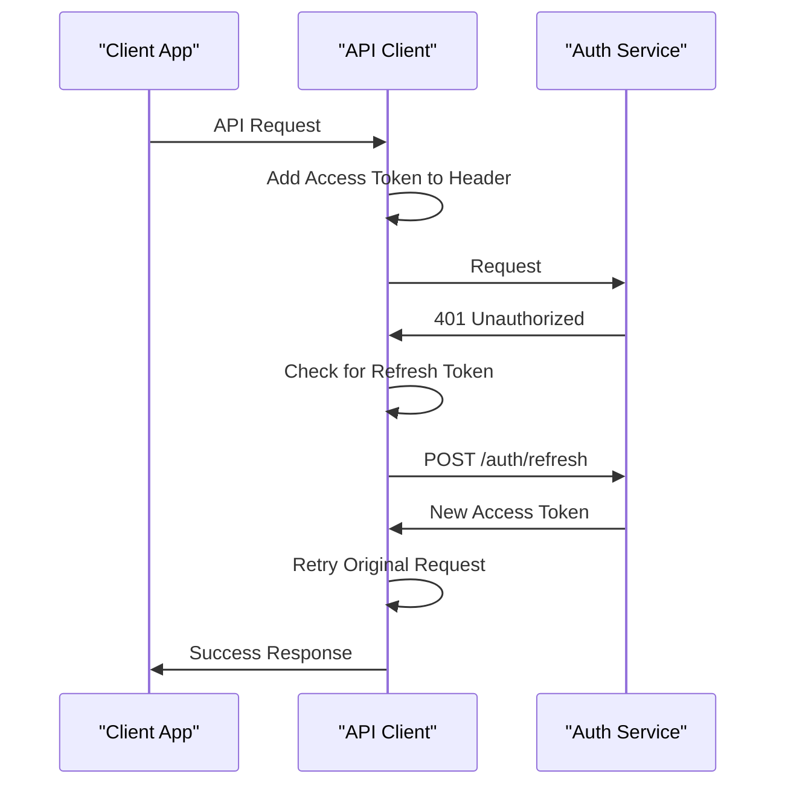
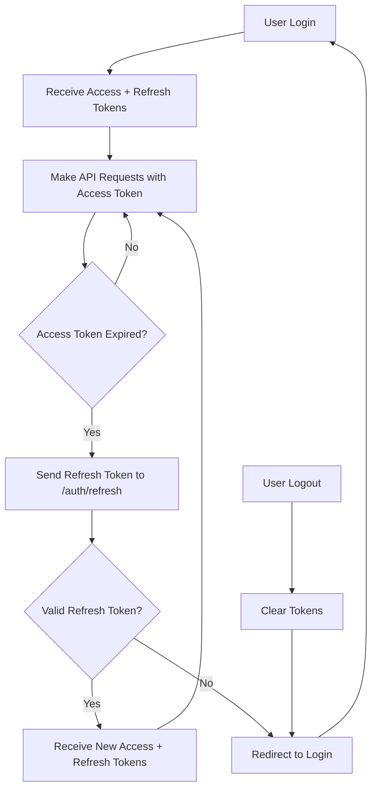

# Refresh Token Flow

<cite>
**Referenced Files in This Document**   
- [auth.service.ts](file://apps/backend/src/modules/auth/auth.service.ts)
- [auth.controller.ts](file://apps/backend/src/modules/auth/auth.controller.ts)
- [jwt-refresh.strategy.ts](file://apps/backend/src/modules/auth/strategies/jwt-refresh.strategy.ts)
- [jwt.strategy.ts](file://apps/backend/src/modules/auth/strategies/jwt.strategy.ts)
- [index.ts](file://apps/backend/src/modules/auth/dto/index.ts)
- [configuration.ts](file://apps/backend/src/config/configuration.ts)
- [api-client.ts](file://apps/frontend/src/lib/api-client.ts)
- [auth-store.ts](file://apps/frontend/src/store/auth-store.ts)
- [auth.module.ts](file://apps/backend/src/modules/auth/auth.module.ts)
</cite>

## Table of Contents
1. [Introduction](#introduction)
2. [Refresh Token Mechanism Overview](#refresh-token-mechanism-overview)
3. [Implementation Details](#implementation-details)
4. [API Endpoint Specification](#api-endpoint-specification)
5. [Security Considerations](#security-considerations)
6. [Client-Side Token Management](#client-side-token-management)
7. [Authentication Workflow](#authentication-workflow)
8. [Configuration Settings](#configuration-settings)

## Introduction
The ACCU Platform implements a secure authentication system using JWT (JSON Web Tokens) with a refresh token mechanism to balance security and user experience. This document details the refresh token flow, which enables long-lived user sessions while maintaining security through short-lived access tokens. The implementation allows users to stay authenticated without frequent re-logins, while minimizing the risk associated with token compromise.

## Refresh Token Mechanism Overview
The refresh token mechanism in the ACCU Platform follows the industry-standard pattern of using two types of tokens: short-lived access tokens and long-lived refresh tokens. Access tokens are used to authenticate API requests and have a short expiration time (15 minutes by default), reducing the window of opportunity for attackers if a token is compromised. Refresh tokens, on the other hand, are used exclusively to obtain new access tokens when they expire and have a longer lifespan (7 days by default).

When a user successfully authenticates, the system issues both an access token and a refresh token. The access token is included in the Authorization header of API requests, while the refresh token is stored securely on the client side. When the access token expires, instead of requiring the user to re-authenticate, the client can use the refresh token to obtain a new access token through the dedicated refresh endpoint.

This approach provides several benefits:
- Enhanced security by limiting the lifespan of access tokens
- Improved user experience by enabling seamless session continuation
- Reduced authentication server load by minimizing full authentication cycles
- Better control over session management and token revocation

**Section sources**
- [auth.service.ts](file://apps/backend/src/modules/auth/auth.service.ts#L69-L96)
- [auth.controller.ts](file://apps/backend/src/modules/auth/auth.controller.ts#L31-L43)

## Implementation Details
The refresh token functionality is implemented in the `AuthService.refreshToken` method, which handles the verification of refresh tokens and issuance of new access/refresh token pairs. The method takes a `RefreshTokenDto` containing the refresh token and returns an `AuthResult` object with new tokens.

The implementation follows these steps:
1. Verify the refresh token using the JWT service
2. Retrieve the user from the database using the user ID from the token payload
3. Validate that the user exists and is in an active status
4. Generate new access and refresh tokens by calling the login method
5. Return the new token pair along with user information

The method is designed to be idempotent and stateless, with no server-side storage of refresh tokens in the current implementation. This simplifies the architecture but requires careful consideration of security implications, particularly around token revocation.

The refresh token verification is handled by the `JwtRefreshStrategy`, which extends Passport's JWT strategy with a custom name ('jwt-refresh'). This strategy extracts the token from the Authorization header and validates its signature and expiration. The validate method returns a simplified payload containing the user ID and refresh token for further processing.

**Section sources**
- [auth.service.ts](file://apps/backend/src/modules/auth/auth.service.ts#L142-L159)
- [jwt-refresh.strategy.ts](file://apps/backend/src/modules/auth/strategies/jwt-refresh.strategy.ts#L7-L22)
- [jwt.strategy.ts](file://apps/backend/src/modules/auth/strategies/jwt.strategy.ts#L8-L29)

## API Endpoint Specification
The refresh token functionality is exposed through the POST /auth/refresh API endpoint, which accepts a refresh token and returns a new set of authentication tokens.

### Request Schema (RefreshTokenDto)
```typescript
class RefreshTokenDto {
  @ApiProperty({
    description: 'Refresh token',
    example: 'eyJhbGciOiJIUzI1NiIsInR5cCI6IkpXVCJ9...',
  })
  @IsString()
  refreshToken: string;
}
```

### Response Schema (AuthResponseDto)
```typescript
class AuthResponseDto {
  @ApiProperty({
    description: 'User information',
    example: {
      id: '550e8400-e29b-41d4-a716-446655440000',
      email: 'user@example.com',
      firstName: 'John',
      lastName: 'Doe',
      status: 'active',
      roles: ['user'],
    },
  })
  user: {
    id: string;
    email: string;
    firstName: string;
    lastName: string;
    status: string;
    roles: { id: string; name: string; description?: string }[];
  };

  @ApiProperty({
    description: 'JWT access token',
    example: 'eyJhbGciOiJIUzI1NiIsInR5cCI6IkpXVCJ9...',
  })
  accessToken: string;

  @ApiProperty({
    description: 'JWT refresh token',
    example: 'eyJhbGciOiJIUzI1NiIsInR5cCI6IkpXVCJ9...',
  })
  refreshToken: string;

  @ApiProperty({
    description: 'Token expiry in milliseconds',
    example: 900000,
  })
  expiresIn: number;
}
```

### HTTP Specification
- **Endpoint**: POST /auth/refresh
- **Authentication**: None (refresh token is provided in request body)
- **Success Response**: 200 OK with AuthResponseDto
- **Error Responses**:
  - 401 Unauthorized: Invalid or expired refresh token
  - 400 Bad Request: Malformed request body

The endpoint is implemented in the `AuthController.refreshToken` method, which delegates the actual token refresh logic to the `AuthService`. The controller handles request validation and response formatting, while the service handles the business logic of token verification and issuance.

**Section sources**
- [auth.controller.ts](file://apps/backend/src/modules/auth/auth.controller.ts#L57-L68)
- [index.ts](file://apps/backend/src/modules/auth/dto/index.ts#L76-L190)

## Security Considerations
The current implementation of the refresh token mechanism has several important security characteristics and considerations:

### Current Implementation Security
- **No Server-Side Storage**: Refresh tokens are not stored server-side, making the system stateless but preventing immediate token revocation
- **Token Expiration**: Refresh tokens have a 7-day expiration period configured in the JWT settings
- **User Status Validation**: The system checks that the user is active when refreshing tokens
- **Secure Transmission**: Tokens should be transmitted over HTTPS in production environments

### Security Limitations
The current implementation has a significant security limitation: the inability to revoke refresh tokens before their expiration. Since tokens are not stored server-side, there is no mechanism to blacklist compromised tokens. This means that if a refresh token is stolen, it can be used to obtain new access tokens until it expires.

### Recommended Production Enhancements
To improve security in production environments, the following enhancements are recommended:

1. **Token Blacklisting**: Implement a server-side store (e.g., Redis) to maintain a list of revoked refresh tokens
2. **Refresh Token Rotation**: Issue a new refresh token with each refresh request and invalidate the previous one
3. **Refresh Token Binding**: Bind refresh tokens to specific client characteristics (IP address, user agent)
4. **Shorter Refresh Token Lifespan**: Consider reducing the refresh token expiration to 24-48 hours
5. **Refresh Token Usage Tracking**: Log refresh token usage for anomaly detection

The logout endpoint currently does not invalidate the refresh token, which means users remain able to obtain new access tokens even after logging out. Implementing token blacklisting would address this issue.

**Section sources**
- [auth.service.ts](file://apps/backend/src/modules/auth/auth.service.ts#L142-L159)
- [auth.controller.ts](file://apps/backend/src/modules/auth/auth.controller.ts#L119-L129)
- [configuration.ts](file://apps/backend/src/config/configuration.ts#L23-L28)

## Client-Side Token Management
The frontend implementation handles refresh token management through the API client and authentication store, providing a seamless user experience while maintaining security.

### Automatic Token Refresh
The API client implements an interceptor that automatically handles token refresh when an access token expires:



**Diagram sources**
- [api-client.ts](file://apps/frontend/src/lib/api-client.ts#L45-L72)

The interceptor detects 401 Unauthorized responses and attempts to refresh the access token if a refresh token is available. If successful, it retries the original request with the new access token. If the refresh fails, it clears authentication data and redirects to the login page.

### Token Storage
Tokens are stored in the browser's localStorage:
- Access tokens in `access_token` key
- Refresh tokens in `refresh_token` key
- User information in `user` key

This approach provides persistence across browser sessions but has security implications, as localStorage is vulnerable to XSS attacks. In production, consider using HTTP-only cookies for token storage.

### Error Handling
The client handles refresh token errors gracefully:
- No refresh token available: Redirect to login
- Invalid refresh token: Clear authentication data and redirect to login
- Network errors: Display appropriate error messages

The `handleAuthError` method clears all authentication data and redirects to the login page, ensuring a clean state when authentication fails.

**Section sources**
- [api-client.ts](file://apps/frontend/src/lib/api-client.ts#L100-L135)
- [auth-store.ts](file://apps/frontend/src/store/auth-store.ts#L91-L116)

## Authentication Workflow
The relationship between access tokens and refresh tokens in the ACCU Platform authentication workflow is designed to provide both security and usability. The workflow begins with user authentication and continues through token refresh cycles until the user logs out or the refresh token expires.



**Diagram sources**
- [auth.service.ts](file://apps/backend/src/modules/auth/auth.service.ts#L142-L159)
- [api-client.ts](file://apps/frontend/src/lib/api-client.ts#L52-L66)

The workflow demonstrates how the two token types work together:
1. **Access tokens** are used for every API request and have a short lifespan
2. **Refresh tokens** are used only for obtaining new access tokens and have a longer lifespan
3. Each successful refresh generates a new pair of tokens, effectively rotating the tokens

This approach minimizes the exposure of long-lived credentials while maintaining a seamless user experience. The separation of concerns between the two token types allows for different security policies and expiration times based on their respective risks.

**Section sources**
- [auth.service.ts](file://apps/backend/src/modules/auth/auth.service.ts#L69-L96)
- [auth.controller.ts](file://apps/backend/src/modules/auth/auth.controller.ts#L57-L68)

## Configuration Settings
The refresh token behavior is configured through environment variables and the configuration service, allowing for flexible deployment across different environments.

### JWT Configuration
The JWT settings are defined in the configuration service and can be overridden through environment variables:

```typescript
// JWT configuration
jwt: {
  secret: process.env.JWT_SECRET || 'your-super-secret-jwt-key-change-this-in-production',
  accessTokenExpiry: process.env.JWT_ACCESS_EXPIRY || '15m',
  refreshTokenExpiry: process.env.JWT_REFRESH_EXPIRY || '7d',
}
```

### Environment Variables
The following environment variables control the token behavior:
- `JWT_SECRET`: The secret key used to sign JWT tokens (must be changed in production)
- `JWT_ACCESS_EXPIRY`: Expiration time for access tokens (default: 15m)
- `JWT_REFRESH_EXPIRY`: Expiration time for refresh tokens (default: 7d)

### Default Values
- Access token expiration: 15 minutes
- Refresh token expiration: 7 days
- Token signing algorithm: HS256

The configuration is injected into the authentication module through the `JwtModule.registerAsync` method, which uses the `ConfigService` to retrieve the settings. This allows for environment-specific configuration without code changes.

**Section sources**
- [configuration.ts](file://apps/backend/src/config/configuration.ts#L23-L28)
- [auth.module.ts](file://apps/backend/src/modules/auth/auth.module.ts#L19-L28)