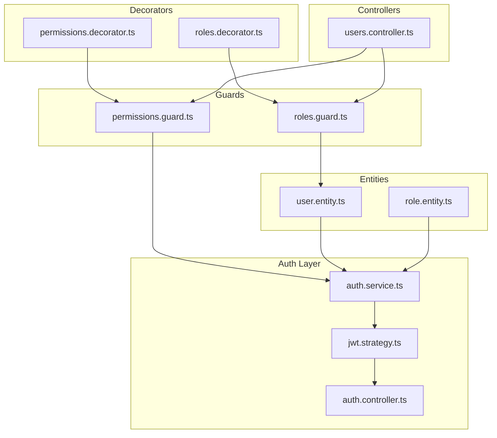
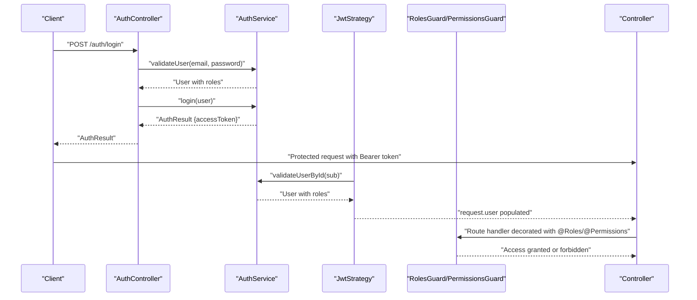
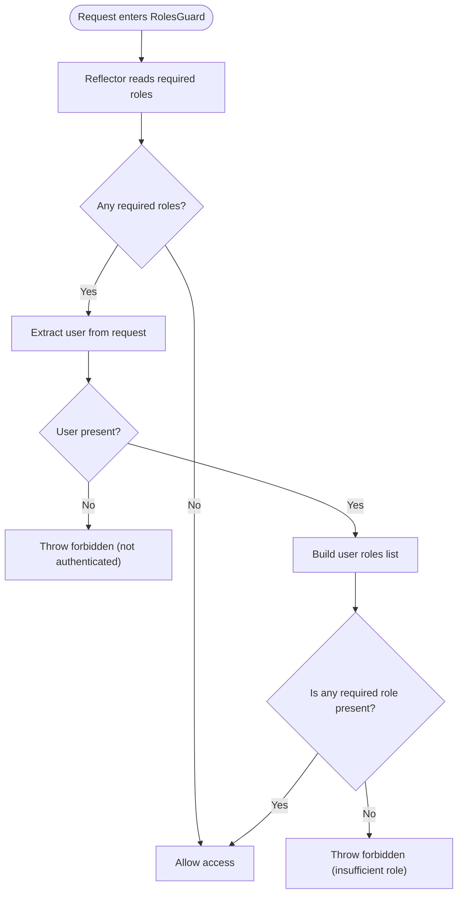
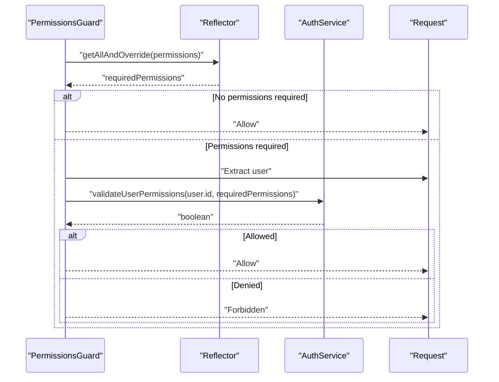
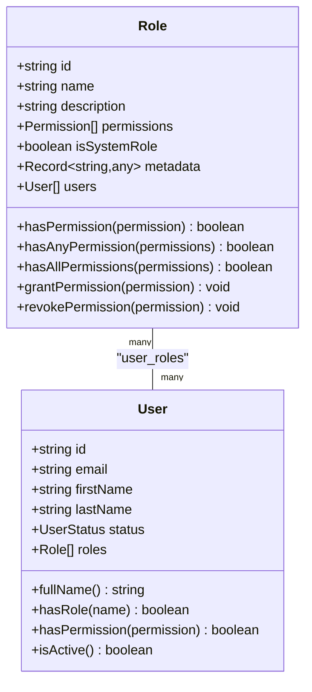
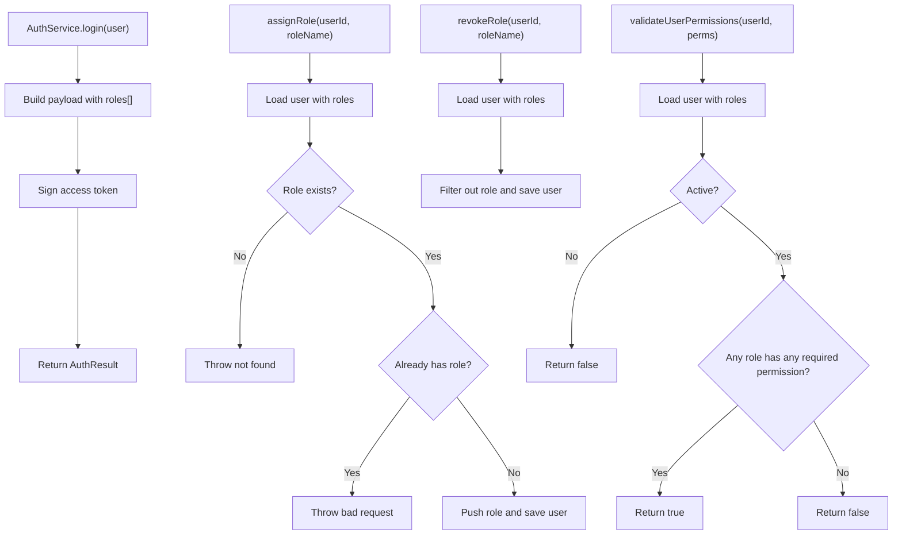
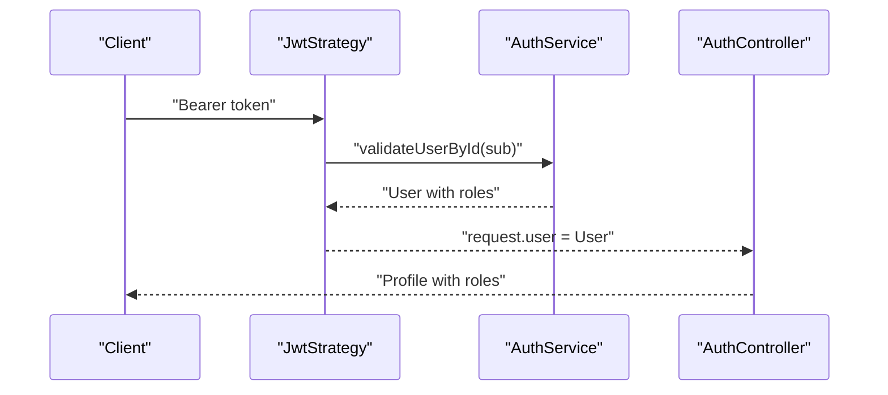
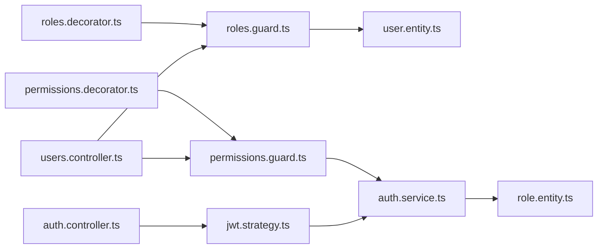

# Role-Based Access Control

<cite>
**Referenced Files in This Document**
- [roles.decorator.ts](file://apps/backend/src/common/decorators/roles.decorator.ts)
- [roles.guard.ts](file://apps/backend/src/common/guards/roles.guard.ts)
- [permissions.decorator.ts](file://apps/backend/src/common/decorators/permissions.decorator.ts)
- [permissions.guard.ts](file://apps/backend/src/common/guards/permissions.guard.ts)
- [role.entity.ts](file://apps/backend/src/entities/role.entity.ts)
- [user.entity.ts](file://apps/backend/src/entities/user.entity.ts)
- [auth.service.ts](file://apps/backend/src/modules/auth/auth.service.ts)
- [jwt.strategy.ts](file://apps/backend/src/modules/auth/strategies/jwt.strategy.ts)
- [auth.controller.ts](file://apps/backend/src/modules/auth/auth.controller.ts)
- [users.controller.ts](file://apps/backend/src/modules/users/users.controller.ts)
- [app.module.ts](file://apps/backend/src/app.module.ts)
</cite>

## Table of Contents
1. [Introduction](#introduction)
2. [Project Structure](#project-structure)
3. [Core Components](#core-components)
4. [Architecture Overview](#architecture-overview)
5. [Detailed Component Analysis](#detailed-component-analysis)
6. [Dependency Analysis](#dependency-analysis)
7. [Performance Considerations](#performance-considerations)
8. [Troubleshooting Guide](#troubleshooting-guide)
9. [Conclusion](#conclusion)

## Introduction
This section documents the Role-Based Access Control (RBAC) implementation in the ACCU Platform. It explains how roles and permissions are modeled, how the @Roles() decorator and RolesGuard enforce role-based restrictions, and how the Reflector service reads route metadata to validate user roles stored in the JWT payload. It also covers the data flow from user login to route protection, and details role assignment and revocation via AuthService methods. Finally, it addresses common issues such as role synchronization after permission changes and performance considerations for role lookups.

## Project Structure
RBAC spans several layers:
- Decorators define role and permission metadata on routes.
- Guards enforce access checks using NestJS’s Reflector.
- Entities model roles and users with many-to-many relationships.
- Auth service manages JWT payloads, role assignment/revocation, and permission validation.
- Strategies attach the authenticated user (with roles) to the request object.

**Diagram sources**
- [roles.decorator.ts](file://apps/backend/src/common/decorators/roles.decorator.ts#L1-L4)
- [permissions.decorator.ts](file://apps/backend/src/common/decorators/permissions.decorator.ts#L1-L6)
- [roles.guard.ts](file://apps/backend/src/common/guards/roles.guard.ts#L1-L41)
- [permissions.guard.ts](file://apps/backend/src/common/guards/permissions.guard.ts#L1-L47)
- [user.entity.ts](file://apps/backend/src/entities/user.entity.ts#L1-L124)
- [role.entity.ts](file://apps/backend/src/entities/role.entity.ts#L1-L133)
- [auth.service.ts](file://apps/backend/src/modules/auth/auth.service.ts#L1-L315)
- [jwt.strategy.ts](file://apps/backend/src/modules/auth/strategies/jwt.strategy.ts#L1-L29)
- [auth.controller.ts](file://apps/backend/src/modules/auth/auth.controller.ts#L1-L152)
- [users.controller.ts](file://apps/backend/src/modules/users/users.controller.ts#L1-L315)

**Section sources**
- [app.module.ts](file://apps/backend/src/app.module.ts#L1-L75)

## Core Components
- Roles decorator and guard:
  - @Roles(...) stores role names on route handlers.
  - RolesGuard reads the required roles via Reflector and compares them against the user’s roles extracted from the request.
- Permissions decorator and guard:
  - @Permissions(...) stores permission enums on route handlers.
  - PermissionsGuard reads required permissions and delegates validation to AuthService, which checks if the user’s roles include any of the required permissions.
- Entities:
  - Role defines role name, permissions array, and system role flag.
  - User has many-to-many roles with eager loading to support fast role checks.
- Auth service:
  - Builds JWT payloads containing roles.
  - Provides assignRole and revokeRole for role management.
  - Validates user permissions by checking role permission arrays.
- JWT strategy:
  - Verifies tokens and loads the user with roles into request.user.

**Section sources**
- [roles.decorator.ts](file://apps/backend/src/common/decorators/roles.decorator.ts#L1-L4)
- [roles.guard.ts](file://apps/backend/src/common/guards/roles.guard.ts#L1-L41)
- [permissions.decorator.ts](file://apps/backend/src/common/decorators/permissions.decorator.ts#L1-L6)
- [permissions.guard.ts](file://apps/backend/src/common/guards/permissions.guard.ts#L1-L47)
- [role.entity.ts](file://apps/backend/src/entities/role.entity.ts#L1-L133)
- [user.entity.ts](file://apps/backend/src/entities/user.entity.ts#L1-L124)
- [auth.service.ts](file://apps/backend/src/modules/auth/auth.service.ts#L1-L315)
- [jwt.strategy.ts](file://apps/backend/src/modules/auth/strategies/jwt.strategy.ts#L1-L29)

## Architecture Overview
The RBAC enforcement pipeline:
1. User authenticates and receives a JWT with roles embedded in the payload.
2. JWT strategy verifies the token and attaches the user (including roles) to the request.
3. Route handlers declare required roles or permissions via decorators.
4. Guards read the metadata and validate access against the user’s roles or permissions.

**Diagram sources**
- [auth.controller.ts](file://apps/backend/src/modules/auth/auth.controller.ts#L1-L152)
- [auth.service.ts](file://apps/backend/src/modules/auth/auth.service.ts#L1-L315)
- [jwt.strategy.ts](file://apps/backend/src/modules/auth/strategies/jwt.strategy.ts#L1-L29)
- [roles.guard.ts](file://apps/backend/src/common/guards/roles.guard.ts#L1-L41)
- [permissions.guard.ts](file://apps/backend/src/common/guards/permissions.guard.ts#L1-L47)
- [users.controller.ts](file://apps/backend/src/modules/users/users.controller.ts#L1-L315)

## Detailed Component Analysis

### Roles Decorator and RolesGuard
- Roles decorator:
  - Exposes a constant key and a factory that stores role names on the route handler metadata.
- RolesGuard:
  - Uses Reflector to retrieve required roles from the handler/class.
  - If no roles are required, access is granted.
  - Extracts user from request and ensures authentication.
  - Compares required roles against the user’s roles (role names).
  - Throws a forbidden error if the user lacks any required role.

**Diagram sources**
- [roles.guard.ts](file://apps/backend/src/common/guards/roles.guard.ts#L1-L41)
- [roles.decorator.ts](file://apps/backend/src/common/decorators/roles.decorator.ts#L1-L4)

**Section sources**
- [roles.decorator.ts](file://apps/backend/src/common/decorators/roles.decorator.ts#L1-L4)
- [roles.guard.ts](file://apps/backend/src/common/guards/roles.guard.ts#L1-L41)

### Permissions Decorator and PermissionsGuard
- Permissions decorator:
  - Stores permission enums on the route handler metadata.
- PermissionsGuard:
  - Reads required permissions via Reflector.
  - If none required, access is granted.
  - Extracts user from request and ensures authentication.
  - Delegates permission validation to AuthService.validateUserPermissions.
  - Throws a forbidden error if the user lacks required permissions.

**Diagram sources**
- [permissions.guard.ts](file://apps/backend/src/common/guards/permissions.guard.ts#L1-L47)
- [permissions.decorator.ts](file://apps/backend/src/common/decorators/permissions.decorator.ts#L1-L6)
- [auth.service.ts](file://apps/backend/src/modules/auth/auth.service.ts#L300-L315)

**Section sources**
- [permissions.decorator.ts](file://apps/backend/src/common/decorators/permissions.decorator.ts#L1-L6)
- [permissions.guard.ts](file://apps/backend/src/common/guards/permissions.guard.ts#L1-L47)
- [auth.service.ts](file://apps/backend/src/modules/auth/auth.service.ts#L300-L315)

### Role Model and User Model
- Role entity:
  - Unique name, optional description, array of permission enums, system role flag, and metadata.
  - Bidirectional many-to-many with User.
  - Helper methods to check permissions and grant/revoke.
- User entity:
  - Many-to-many roles with eager loading to minimize lookups during authorization.
  - Helper methods to check role and permission presence.

**Diagram sources**
- [role.entity.ts](file://apps/backend/src/entities/role.entity.ts#L1-L133)
- [user.entity.ts](file://apps/backend/src/entities/user.entity.ts#L1-L124)

**Section sources**
- [role.entity.ts](file://apps/backend/src/entities/role.entity.ts#L1-L133)
- [user.entity.ts](file://apps/backend/src/entities/user.entity.ts#L1-L124)

### Auth Service: JWT Payload, Role Assignment, and Permission Validation
- JWT payload construction:
  - The login method builds a payload containing user id, email, roles, and tenant id.
  - Roles are serialized as role names from the user’s roles collection.
- Role assignment and revocation:
  - assignRole(userId, roleName) adds a role to a user if not already assigned.
  - revokeRole(userId, roleName) removes a role from a user.
- Permission validation:
  - validateUserPermissions(userId, requiredPermissions) checks if any role of the user includes any of the required permissions.

**Diagram sources**
- [auth.service.ts](file://apps/backend/src/modules/auth/auth.service.ts#L69-L96)
- [auth.service.ts](file://apps/backend/src/modules/auth/auth.service.ts#L226-L265)
- [auth.service.ts](file://apps/backend/src/modules/auth/auth.service.ts#L300-L315)

**Section sources**
- [auth.service.ts](file://apps/backend/src/modules/auth/auth.service.ts#L69-L96)
- [auth.service.ts](file://apps/backend/src/modules/auth/auth.service.ts#L226-L265)
- [auth.service.ts](file://apps/backend/src/modules/auth/auth.service.ts#L300-L315)

### JWT Strategy and Request Population
- JwtStrategy:
  - Verifies JWT and loads the user by id from the payload.
  - Attaches the hydrated user (with roles) to request.user.
- Auth controller:
  - Demonstrates that request.user contains roles after authentication.

**Diagram sources**
- [jwt.strategy.ts](file://apps/backend/src/modules/auth/strategies/jwt.strategy.ts#L1-L29)
- [auth.service.ts](file://apps/backend/src/modules/auth/auth.service.ts#L161-L171)
- [auth.controller.ts](file://apps/backend/src/modules/auth/auth.controller.ts#L131-L151)

**Section sources**
- [jwt.strategy.ts](file://apps/backend/src/modules/auth/strategies/jwt.strategy.ts#L1-L29)
- [auth.controller.ts](file://apps/backend/src/modules/auth/auth.controller.ts#L131-L151)

### Example Usage: Controllers Using @Roles and @Permissions
- UsersController applies both RolesGuard and PermissionsGuard globally and decorates endpoints with @Roles and @Permissions to restrict sensitive operations.
- Examples include creating users, toggling statuses, assigning or revoking roles, and deleting users.

Concrete examples from the codebase:
- Create user endpoint guarded by @Roles('admin', 'super_admin') and @Permissions(Permission.USERS_WRITE).
- Toggle user status endpoint guarded by @Roles('admin', 'super_admin') and @Permissions(Permission.USERS_WRITE).
- Assign role to user endpoint guarded by @Roles('admin', 'super_admin') and @Permissions(Permission.USERS_WRITE).
- Revoke role from user endpoint guarded by @Roles('admin', 'super_admin') and @Permissions(Permission.USERS_WRITE).
- Delete user endpoint guarded by @Roles('admin', 'super_admin') and @Permissions(Permission.USERS_DELETE).

These demonstrate how roles and permissions combine to protect sensitive operations.

**Section sources**
- [users.controller.ts](file://apps/backend/src/modules/users/users.controller.ts#L45-L247)
- [users.controller.ts](file://apps/backend/src/modules/users/users.controller.ts#L249-L268)

## Dependency Analysis
- Decorators depend on NestJS SetMetadata to annotate handlers.
- Guards depend on Reflector to read metadata and on AuthService for permission checks.
- Entities define the data model for roles and users.
- Auth service depends on repositories and JWT service.
- JWT strategy depends on AuthService to hydrate the user.

**Diagram sources**
- [roles.decorator.ts](file://apps/backend/src/common/decorators/roles.decorator.ts#L1-L4)
- [roles.guard.ts](file://apps/backend/src/common/guards/roles.guard.ts#L1-L41)
- [permissions.decorator.ts](file://apps/backend/src/common/decorators/permissions.decorator.ts#L1-L6)
- [permissions.guard.ts](file://apps/backend/src/common/guards/permissions.guard.ts#L1-L47)
- [user.entity.ts](file://apps/backend/src/entities/user.entity.ts#L1-L124)
- [role.entity.ts](file://apps/backend/src/entities/role.entity.ts#L1-L133)
- [auth.service.ts](file://apps/backend/src/modules/auth/auth.service.ts#L1-L315)
- [jwt.strategy.ts](file://apps/backend/src/modules/auth/strategies/jwt.strategy.ts#L1-L29)
- [auth.controller.ts](file://apps/backend/src/modules/auth/auth.controller.ts#L1-L152)
- [users.controller.ts](file://apps/backend/src/modules/users/users.controller.ts#L1-L315)

**Section sources**
- [users.controller.ts](file://apps/backend/src/modules/users/users.controller.ts#L45-L247)
- [users.controller.ts](file://apps/backend/src/modules/users/users.controller.ts#L249-L268)

## Performance Considerations
- Eager loading of roles:
  - User roles are loaded eagerly to avoid N+1 queries and reduce authorization overhead.
- Role lookup complexity:
  - RolesGuard performs a simple set membership check against user roles.
  - PermissionsGuard performs a nested check across user roles’ permissions.
- Token payload size:
  - Roles are included in the JWT payload; keep role lists concise to minimize token size.
- Guard ordering:
  - Applying both RolesGuard and PermissionsGuard ensures early exits for unauthenticated requests and reduces unnecessary permission checks.

[No sources needed since this section provides general guidance]

## Troubleshooting Guide
Common issues and resolutions:
- User not authenticated:
  - Guards throw a forbidden error when request.user is missing. Ensure JWT strategy is configured and AuthGuard is applied before guards.
- Insufficient role permissions:
  - RolesGuard throws a forbidden error if the user lacks any required role. Verify the user’s roles and the route’s @Roles declaration.
- Insufficient permissions:
  - PermissionsGuard throws a forbidden error if the user lacks required permissions. Confirm the user’s roles include the required permissions and that the permission enums match the Role definitions.
- Role synchronization after permission changes:
  - After updating a role’s permissions or reassigning roles, ensure the user logs in again so the JWT payload reflects the latest roles. Alternatively, invalidate and regenerate tokens for affected users.
- Active user requirement:
  - AuthService.validateUserPermissions returns false for inactive users. Activate users before expecting access.

**Section sources**
- [roles.guard.ts](file://apps/backend/src/common/guards/roles.guard.ts#L24-L40)
- [permissions.guard.ts](file://apps/backend/src/common/guards/permissions.guard.ts#L29-L46)
- [auth.service.ts](file://apps/backend/src/modules/auth/auth.service.ts#L300-L315)

## Conclusion
The ACCU Platform implements a robust RBAC system using NestJS decorators and guards. RolesGuard enforces role-based access by comparing required roles against the user’s roles from the JWT payload, while PermissionsGuard validates permission-based access by delegating to AuthService. The design leverages eager role loading, clear separation of concerns, and explicit guard ordering to provide secure and efficient access control across controllers.