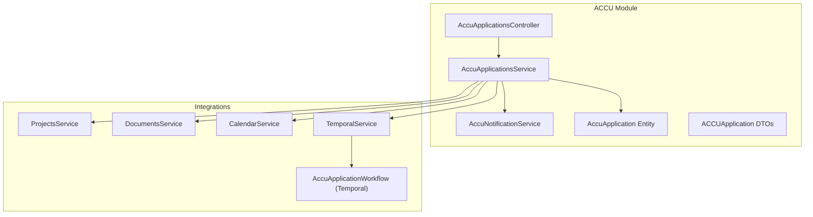
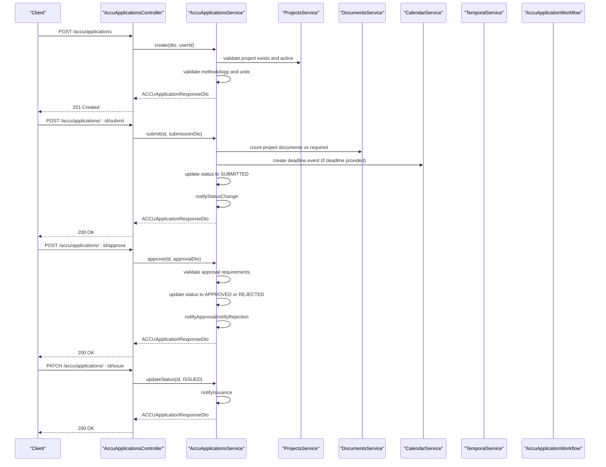
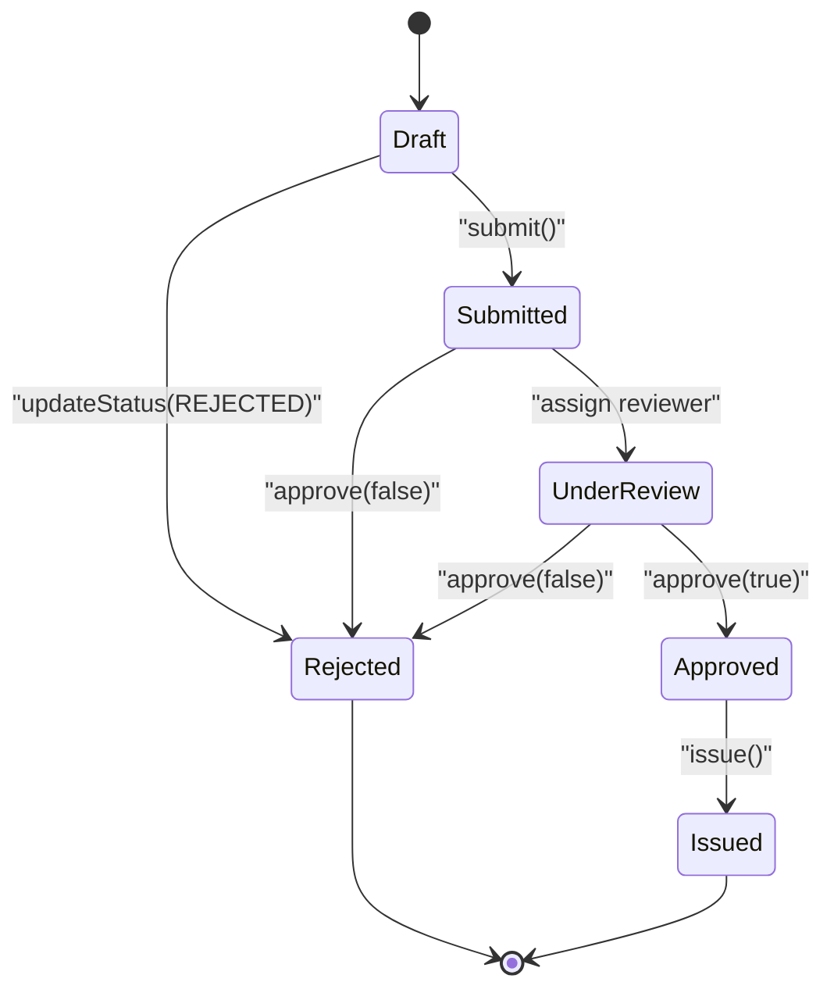
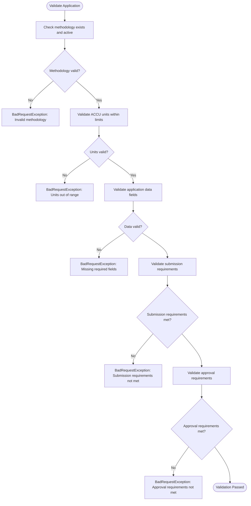
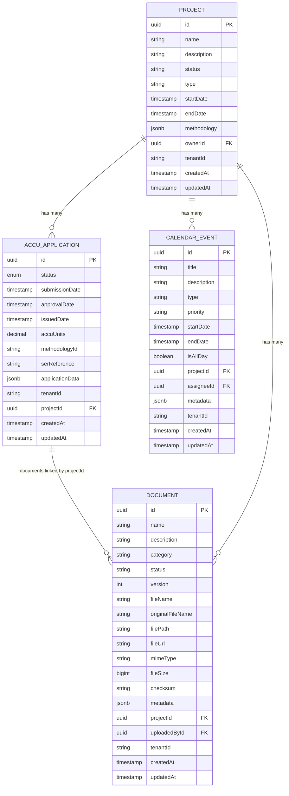
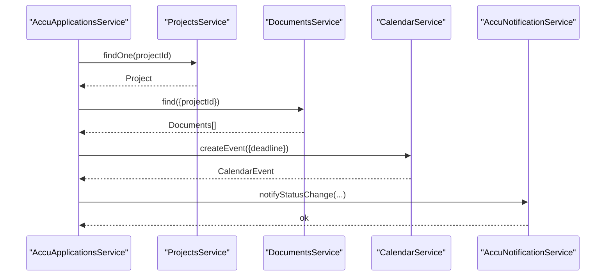
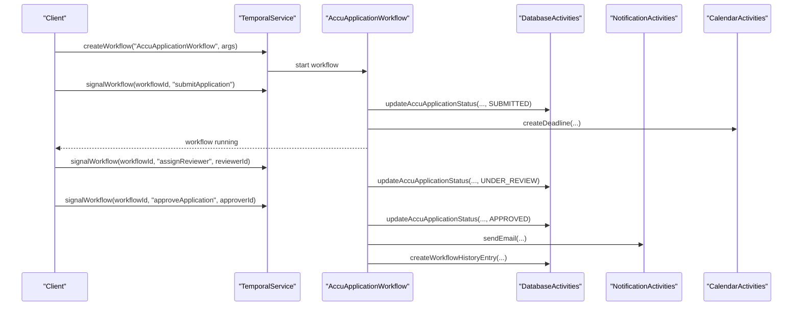
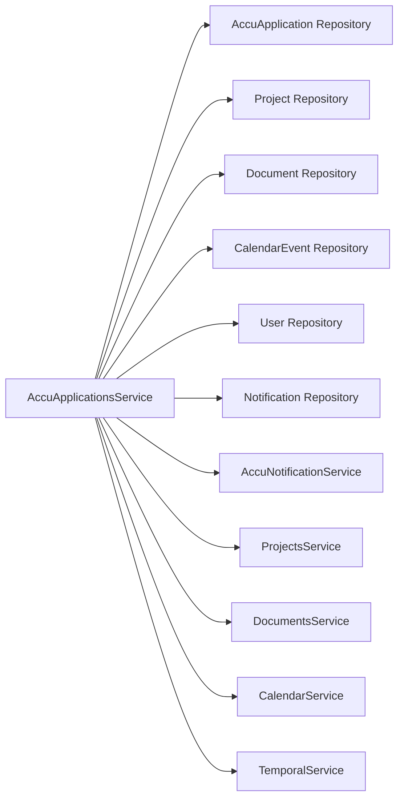

# ACCU Applications

<cite>
**Referenced Files in This Document**
- [accu-applications.controller.ts](file://apps/backend/src/modules/accu/accu-applications.controller.ts)
- [accu-applications.service.ts](file://apps/backend/src/modules/accu/accu-applications.service.ts)
- [accu.module.ts](file://apps/backend/src/modules/accu/accu.module.ts)
- [accu-application.entity.ts](file://apps/backend/src/entities/accu-application.entity.ts)
- [accu-application.dto.ts](file://apps/backend/src/modules/accu/dto/accu-application.dto.ts)
- [accu-notification.service.ts](file://apps/backend/src/modules/accu/accu-notification.service.ts)
- [temporal.service.ts](file://apps/backend/src/modules/temporal/temporal.service.ts)
- [accu-application-workflows.ts](file://apps/backend/src/modules/temporal/workflows/accu-application/accu-application-workflows.ts)
- [database-activities.ts](file://apps/backend/src/modules/temporal/activities/database-activities.ts)
- [notification-activities.ts](file://apps/backend/src/modules/temporal/activities/notification-activities.ts)
- [calendar-activities.ts](file://apps/backend/src/modules/temporal/activities/calendar-activities.ts)
- [calendar.service.ts](file://apps/backend/src/modules/calendar/calendar.service.ts)
- [projects.service.ts](file://apps/backend/src/modules/projects/projects.service.ts)
- [documents.service.ts](file://apps/backend/src/modules/documents/documents.service.ts)
- [accu-application-lifecycle.e2e.test.ts](file://apps/backend/test/e2e/accu-application-lifecycle.e2e.test.ts)
- [accu-applications.test.ts](file://apps/backend/test/accu-applications.test.ts)
</cite>

## Table of Contents
1. [Introduction](#introduction)
2. [Project Structure](#project-structure)
3. [Core Components](#core-components)
4. [Architecture Overview](#architecture-overview)
5. [Detailed Component Analysis](#detailed-component-analysis)
6. [Dependency Analysis](#dependency-analysis)
7. [Performance Considerations](#performance-considerations)
8. [Troubleshooting Guide](#troubleshooting-guide)
9. [Conclusion](#conclusion)
10. [Appendices](#appendices)

## Introduction
This document describes the ACCU Applications module, covering the complete application lifecycle from Draft to Issued, including state transitions, validation rules, and integrations with Projects, Documents, and Calendar. It also explains how approvals and notifications are orchestrated via Temporal workflows, provides code example references for service methods and REST endpoints, details DTO structures and entity relationships, and offers guidance for common issues such as failed submissions due to missing documentation.

## Project Structure
The ACCU Applications module is implemented as a NestJS module with a dedicated controller, service, and DTOs. It integrates with TypeORM entities for persistence, and interacts with other modules for notifications, calendar, projects, and documents. Temporal workflows orchestrate asynchronous approval and deadline-related tasks.

**Diagram sources**
- [accu-applications.controller.ts](file://apps/backend/src/modules/accu/accu-applications.controller.ts#L1-L200)
- [accu-applications.service.ts](file://apps/backend/src/modules/accu/accu-applications.service.ts#L1-L120)
- [accu-notification.service.ts](file://apps/backend/src/modules/accu/accu-notification.service.ts#L1-L60)
- [accu-application.entity.ts](file://apps/backend/src/entities/accu-application.entity.ts#L1-L86)
- [accu-application.dto.ts](file://apps/backend/src/modules/accu/dto/accu-application.dto.ts#L1-L120)
- [temporal.service.ts](file://apps/backend/src/modules/temporal/temporal.service.ts#L1-L126)
- [accu-application-workflows.ts](file://apps/backend/src/modules/temporal/workflows/accu-application/accu-application-workflows.ts#L1-L120)
- [calendar.service.ts](file://apps/backend/src/modules/calendar/calendar.service.ts#L1-L120)
- [projects.service.ts](file://apps/backend/src/modules/projects/projects.service.ts#L1-L120)
- [documents.service.ts](file://apps/backend/src/modules/documents/documents.service.ts#L1-L120)

**Section sources**
- [accu.module.ts](file://apps/backend/src/modules/accu/accu.module.ts#L1-L28)
- [accu-applications.controller.ts](file://apps/backend/src/modules/accu/accu-applications.controller.ts#L1-L120)
- [accu-applications.service.ts](file://apps/backend/src/modules/accu/accu-applications.service.ts#L1-L120)

## Core Components
- AccuApplicationsController: Exposes REST endpoints for creating, querying, updating, transitioning statuses, submitting, approving/rejecting, issuing, retrieving analytics, deadlines, and documents.
- AccuApplicationsService: Implements business logic for lifecycle transitions, validations, notifications, and analytics.
- AccuNotificationService: Manages in-app and system notifications for lifecycle events.
- AccuApplication Entity: Defines the persisted state and computed helpers for status checks.
- ACCUApplication DTOs: Strongly typed request/response DTOs for validation and API documentation.
- TemporalService and Workflows: Orchestrates asynchronous approvals, deadlines, and escalations.

Key responsibilities:
- Validate methodology and ACCU units per methodology.
- Enforce status transitions and submission/approval requirements.
- Integrate with Calendar for deadlines and Reminders.
- Trigger notifications on status changes and milestones.
- Orchestrate approvals via Temporal signals and queries.

**Section sources**
- [accu-applications.controller.ts](file://apps/backend/src/modules/accu/accu-applications.controller.ts#L51-L210)
- [accu-applications.service.ts](file://apps/backend/src/modules/accu/accu-applications.service.ts#L120-L220)
- [accu-application.entity.ts](file://apps/backend/src/entities/accu-application.entity.ts#L1-L86)
- [accu-application.dto.ts](file://apps/backend/src/modules/accu/dto/accu-application.dto.ts#L1-L120)
- [accu-notification.service.ts](file://apps/backend/src/modules/accu/accu-notification.service.ts#L1-L120)
- [temporal.service.ts](file://apps/backend/src/modules/temporal/temporal.service.ts#L1-L126)
- [accu-application-workflows.ts](file://apps/backend/src/modules/temporal/workflows/accu-application/accu-application-workflows.ts#L1-L120)

## Architecture Overview
The ACCU Applications module follows a layered architecture:
- REST layer: Controllers expose endpoints with Swagger metadata and guard-based permissions.
- Service layer: Business logic encapsulated in services with repositories injected.
- Integration layer: Services call other modules (Projects, Documents, Calendar) and Temporal.
- Persistence: TypeORM entities and repositories.
- Orchestration: Temporal workflows manage approvals and deadlines asynchronously.

**Diagram sources**
- [accu-applications.controller.ts](file://apps/backend/src/modules/accu/accu-applications.controller.ts#L171-L242)
- [accu-applications.service.ts](file://apps/backend/src/modules/accu/accu-applications.service.ts#L377-L489)
- [calendar.service.ts](file://apps/backend/src/modules/calendar/calendar.service.ts#L676-L715)
- [temporal.service.ts](file://apps/backend/src/modules/temporal/temporal.service.ts#L69-L105)
- [accu-application-workflows.ts](file://apps/backend/src/modules/temporal/workflows/accu-application/accu-application-workflows.ts#L120-L220)

## Detailed Component Analysis

### Application Lifecycle and State Transitions
The lifecycle progresses through the following states:
- Draft → Submitted → Under Review → Approved → Issued
- Draft → Rejected (directly)
- Submitted → Rejected (directly)
- Under Review → Approved/Rejected
- Approved → Issued (directly)

Allowed transitions are enforced by validation logic. Submission and approval requirements ensure completeness before moving forward.

**Diagram sources**
- [accu-applications.service.ts](file://apps/backend/src/modules/accu/accu-applications.service.ts#L837-L850)
- [accu-application.entity.ts](file://apps/backend/src/entities/accu-application.entity.ts#L12-L19)

**Section sources**
- [accu-applications.service.ts](file://apps/backend/src/modules/accu/accu-applications.service.ts#L837-L850)
- [accu-application.entity.ts](file://apps/backend/src/entities/accu-application.entity.ts#L12-L19)

### Validation Rules
- Methodology validation: Ensures methodology exists and is active; enforces maximum ACCU units per methodology.
- ACCU units: Must be non-negative and within methodology limits.
- Application data: Must include required fields (e.g., description).
- Submission requirements: Minimum units, presence of description, valid methodology, and adequate documents.
- Approval requirements: Application must be submitted and all required documents must be present.

**Diagram sources**
- [accu-applications.service.ts](file://apps/backend/src/modules/accu/accu-applications.service.ts#L818-L906)

**Section sources**
- [accu-applications.service.ts](file://apps/backend/src/modules/accu/accu-applications.service.ts#L818-L906)
- [accu-application.dto.ts](file://apps/backend/src/modules/accu/dto/accu-application.dto.ts#L63-L115)

### REST Endpoints and Service Methods
Common endpoints and their service methods:
- POST /accu/applications → create(createDto, userId) in AccuApplicationsService
- GET /accu/applications → findAll(query) in AccuApplicationsService
- GET /accu/applications/:id → findOne(id) in AccuApplicationsService
- PUT /accu/applications/:id → update(id, updateDto) in AccuApplicationsService
- PATCH /accu/applications/:id/status → updateStatus(id, statusDto) in AccuApplicationsService
- POST /accu/applications/:id/submit → submit(id, submissionDto) in AccuApplicationsService
- POST /accu/applications/:id/approve → approve(id, approvalDto) in AccuApplicationsService
- POST /accu/applications/:id/reject → approve(id, {approved:false,...}) in AccuApplicationsService
- PATCH /accu/applications/:id/issue → updateStatus(id, {status: ISSUED}) in AccuApplicationsService
- GET /accu/applications/:id/analytics → getAnalytics(id) in AccuApplicationsService
- GET /accu/applications/:id/deadlines → getApplicationDeadlines(id) in AccuApplicationsService
- GET /accu/applications/:id/documents → getApplicationDocuments(id) in AccuApplicationsService
- POST /accu/applications/:id/documents → addDocument(id, documentDto) in AccuApplicationsService

Example references:
- [create](file://apps/backend/src/modules/accu/accu-applications.controller.ts#L58-L74)
- [submit](file://apps/backend/src/modules/accu/accu-applications.controller.ts#L171-L189)
- [approve](file://apps/backend/src/modules/accu/accu-applications.controller.ts#L191-L209)
- [updateStatus](file://apps/backend/src/modules/accu/accu-applications.controller.ts#L151-L169)
- [getAnalytics](file://apps/backend/src/modules/accu/accu-applications.controller.ts#L309-L322)
- [getApplicationDeadlines](file://apps/backend/src/modules/accu/accu-applications.controller.ts#L294-L308)
- [getApplicationDocuments](file://apps/backend/src/modules/accu/accu-applications.controller.ts#L259-L272)
- [addDocument](file://apps/backend/src/modules/accu/accu-applications.controller.ts#L274-L293)

**Section sources**
- [accu-applications.controller.ts](file://apps/backend/src/modules/accu/accu-applications.controller.ts#L58-L210)
- [accu-applications.service.ts](file://apps/backend/src/modules/accu/accu-applications.service.ts#L120-L220)

### DTO Structure and Entity Relationships
- ACCUApplicationCreateDto and ACCUApplicationUpdateDto define input validation for creating/updating applications.
- ACCUApplicationResponseDto defines the output shape for responses.
- ACCUStatus enum drives state transitions and computed helpers on the entity.
- Relationships:
  - AccuApplication belongs to Project (many-to-one).
  - AccuApplication stores JSONB applicationData for flexible project details.
  - AccuApplication tracks submissionDate, approvalDate, issuedDate.

**Diagram sources**
- [accu-application.entity.ts](file://apps/backend/src/entities/accu-application.entity.ts#L1-L86)
- [accu-application.dto.ts](file://apps/backend/src/modules/accu/dto/accu-application.dto.ts#L1-L120)
- [calendar.service.ts](file://apps/backend/src/modules/calendar/calendar.service.ts#L1-L120)

**Section sources**
- [accu-application.entity.ts](file://apps/backend/src/entities/accu-application.entity.ts#L1-L86)
- [accu-application.dto.ts](file://apps/backend/src/modules/accu/dto/accu-application.dto.ts#L1-L120)

### Integration Points with Projects, Documents, and Calendar
- ProjectsService validates project existence and status before creating applications.
- DocumentsService provides document management; applications link documents via metadata and project-scoped queries.
- CalendarService creates deadlines and reminders for submission and review phases.
- Notifications are sent through AccuNotificationService for status changes, approvals, rejections, and issuance.

**Diagram sources**
- [accu-applications.service.ts](file://apps/backend/src/modules/accu/accu-applications.service.ts#L377-L489)
- [projects.service.ts](file://apps/backend/src/modules/projects/projects.service.ts#L1-L120)
- [documents.service.ts](file://apps/backend/src/modules/documents/documents.service.ts#L1-L120)
- [calendar.service.ts](file://apps/backend/src/modules/calendar/calendar.service.ts#L676-L715)
- [accu-notification.service.ts](file://apps/backend/src/modules/accu/accu-notification.service.ts#L1-L120)

**Section sources**
- [accu-applications.service.ts](file://apps/backend/src/modules/accu/accu-applications.service.ts#L377-L489)
- [projects.service.ts](file://apps/backend/src/modules/projects/projects.service.ts#L1-L120)
- [documents.service.ts](file://apps/backend/src/modules/documents/documents.service.ts#L1-L120)
- [calendar.service.ts](file://apps/backend/src/modules/calendar/calendar.service.ts#L676-L715)
- [accu-notification.service.ts](file://apps/backend/src/modules/accu/accu-notification.service.ts#L1-L120)

### Temporal Workflow Orchestration
Temporal orchestrates approvals and deadlines:
- Signals: submitApplication, assignReviewer, approveApplication, rejectApplication, issueCertificate, updateMetadata.
- Queries: getWorkflowState, getCurrentStatus, getHistory.
- Activities: database updates, notifications, email, and calendar deadline creation.
- Workflows enforce timeouts and escalation paths for review and approval.

**Diagram sources**
- [temporal.service.ts](file://apps/backend/src/modules/temporal/temporal.service.ts#L69-L105)
- [accu-application-workflows.ts](file://apps/backend/src/modules/temporal/workflows/accu-application/accu-application-workflows.ts#L1-L120)
- [database-activities.ts](file://apps/backend/src/modules/temporal/activities/database-activities.ts#L1-L27)
- [notification-activities.ts](file://apps/backend/src/modules/temporal/activities/notification-activities.ts#L1-L19)
- [calendar-activities.ts](file://apps/backend/src/modules/temporal/activities/calendar-activities.ts#L1-L60)

**Section sources**
- [temporal.service.ts](file://apps/backend/src/modules/temporal/temporal.service.ts#L1-L126)
- [accu-application-workflows.ts](file://apps/backend/src/modules/temporal/workflows/accu-application/accu-application-workflows.ts#L1-L120)
- [database-activities.ts](file://apps/backend/src/modules/temporal/activities/database-activities.ts#L1-L27)
- [notification-activities.ts](file://apps/backend/src/modules/temporal/activities/notification-activities.ts#L1-L19)
- [calendar-activities.ts](file://apps/backend/src/modules/temporal/activities/calendar-activities.ts#L1-L60)

## Dependency Analysis
- Coupling: AccuApplicationsService depends on repositories for AccuApplication, Project, Document, CalendarEvent, User, and Notification. It also depends on AccuNotificationService.
- Integrations: ProjectsService, DocumentsService, CalendarService, and TemporalService are invoked for cross-module operations.
- External dependencies: Temporal SDK for workflow orchestration and activities.

**Diagram sources**
- [accu-applications.service.ts](file://apps/backend/src/modules/accu/accu-applications.service.ts#L1-L120)
- [accu.module.ts](file://apps/backend/src/modules/accu/accu.module.ts#L1-L28)

**Section sources**
- [accu-applications.service.ts](file://apps/backend/src/modules/accu/accu-applications.service.ts#L1-L120)
- [accu.module.ts](file://apps/backend/src/modules/accu/accu.module.ts#L1-L28)

## Performance Considerations
- Pagination and filtering: findAll supports pagination and multiple filters to reduce payload sizes.
- Batch operations: Use bulk operations where applicable (e.g., bulk document operations).
- Indexing: Entities include indexes on status and projectId to speed up queries.
- Asynchronous processing: Temporal workflows offload long-running tasks (approvals, reminders, escalations).
- Caching: Consider caching frequently accessed methodology requirements and project metadata.
- Concurrency: Validate uniqueness and constraints at the database level; handle race conditions with transactions and retry logic.
- Monitoring: Track workflow execution times and failure rates; configure alerts for overdue deadlines.

[No sources needed since this section provides general guidance]

## Troubleshooting Guide
Common issues and resolutions:
- Failed submission due to missing documentation:
  - Cause: Required documents below threshold for methodology.
  - Resolution: Upload required documents; the service sends a notification listing missing documents and allows submission with warnings.
  - References: [validateSubmissionRequirements](file://apps/backend/src/modules/accu/accu-applications.service.ts#L852-L889), [notifyMissingDocuments](file://apps/backend/src/modules/accu/accu-notification.service.ts#L90-L112)
- Invalid status transition:
  - Cause: Attempting to move directly from Draft to Approved or from Rejected to Submitted.
  - Resolution: Follow the allowed sequence; use submit() then assign reviewer/approve().
  - References: [validateStatusTransition](file://apps/backend/src/modules/accu/accu-applications.service.ts#L837-L850)
- Approval failures:
  - Cause: Missing required documents or application not submitted.
  - Resolution: Ensure submissionDate exists and required documents count meets methodology requirements.
  - References: [validateApprovalRequirements](file://apps/backend/src/modules/accu/accu-applications.service.ts#L891-L906)
- Temporal workflow errors:
  - Cause: Activity timeouts or invalid signals.
  - Resolution: Inspect workflow logs; verify activity availability and signal payloads.
  - References: [TemporalService](file://apps/backend/src/modules/temporal/temporal.service.ts#L1-L126), [AccuApplicationWorkflow](file://apps/backend/src/modules/temporal/workflows/accu-application/accu-application-workflows.ts#L310-L388)
- E2E validation failures:
  - Cause: Invalid DTO fields (negative units, empty methodology, missing description).
  - Resolution: Fix DTO fields according to validation rules.
  - References: [E2E tests](file://apps/backend/test/e2e/accu-application-lifecycle.e2e.test.ts#L667-L726), [Unit tests](file://apps/backend/test/accu-applications.test.ts#L141-L199)

**Section sources**
- [accu-applications.service.ts](file://apps/backend/src/modules/accu/accu-applications.service.ts#L837-L906)
- [accu-notification.service.ts](file://apps/backend/src/modules/accu/accu-notification.service.ts#L90-L112)
- [temporal.service.ts](file://apps/backend/src/modules/temporal/temporal.service.ts#L1-L126)
- [accu-application-workflows.ts](file://apps/backend/src/modules/temporal/workflows/accu-application/accu-application-workflows.ts#L310-L388)
- [accu-application-lifecycle.e2e.test.ts](file://apps/backend/test/e2e/accu-application-lifecycle.e2e.test.ts#L667-L726)
- [accu-applications.test.ts](file://apps/backend/test/accu-applications.test.ts#L141-L199)

## Conclusion
The ACCU Applications module provides a robust, validated, and integrated workflow for managing ACCU applications across Draft, Submitted, Under Review, Approved, and Issued states. It enforces strong validation rules, integrates with Projects, Documents, and Calendar, and orchestrates approvals and deadlines via Temporal. The design supports scalability and compliance through structured DTOs, repository-backed persistence, and asynchronous workflows.

[No sources needed since this section summarizes without analyzing specific files]

## Appendices

### Example References
- Create application: [controller](file://apps/backend/src/modules/accu/accu-applications.controller.ts#L58-L74), [service](file://apps/backend/src/modules/accu/accu-applications.service.ts#L66-L131)
- Submit application: [controller](file://apps/backend/src/modules/accu/accu-applications.controller.ts#L171-L189), [service](file://apps/backend/src/modules/accu/accu-applications.service.ts#L377-L423)
- Approve application: [controller](file://apps/backend/src/modules/accu/accu-applications.controller.ts#L191-L209), [service](file://apps/backend/src/modules/accu/accu-applications.service.ts#L425-L489)
- Issue application: [controller](file://apps/backend/src/modules/accu/accu-applications.controller.ts#L412-L430), [service](file://apps/backend/src/modules/accu/accu-applications.service.ts#L301-L375)
- Analytics and deadlines: [controller](file://apps/backend/src/modules/accu/accu-applications.controller.ts#L294-L322), [service](file://apps/backend/src/modules/accu/accu-applications.service.ts#L573-L646)
- Documents integration: [controller](file://apps/backend/src/modules/accu/accu-applications.controller.ts#L259-L293), [service](file://apps/backend/src/modules/accu/accu-applications.service.ts#L521-L571)

**Section sources**
- [accu-applications.controller.ts](file://apps/backend/src/modules/accu/accu-applications.controller.ts#L58-L210)
- [accu-applications.service.ts](file://apps/backend/src/modules/accu/accu-applications.service.ts#L301-L489)