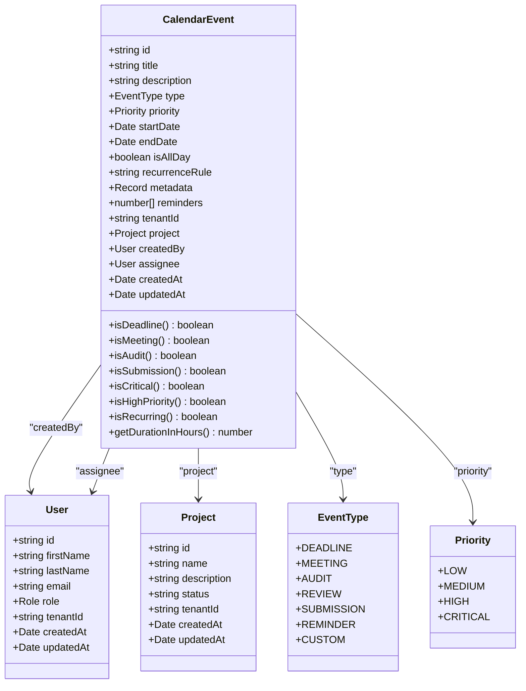
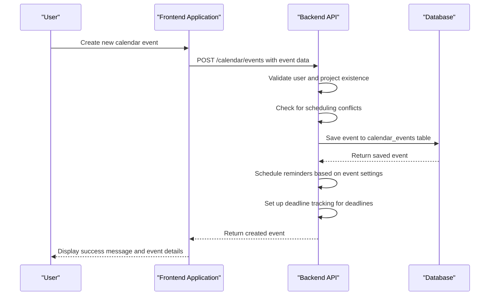
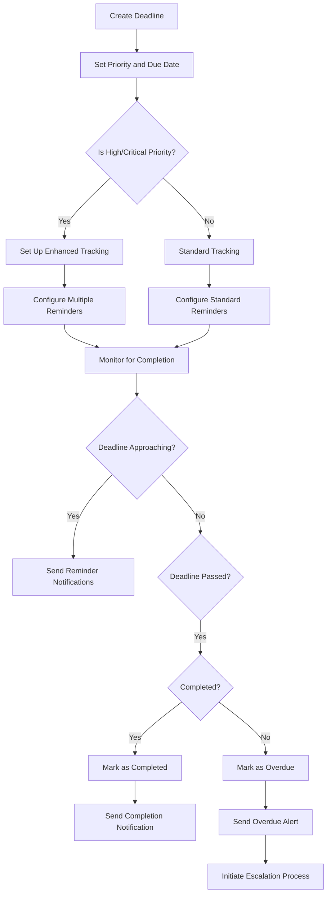
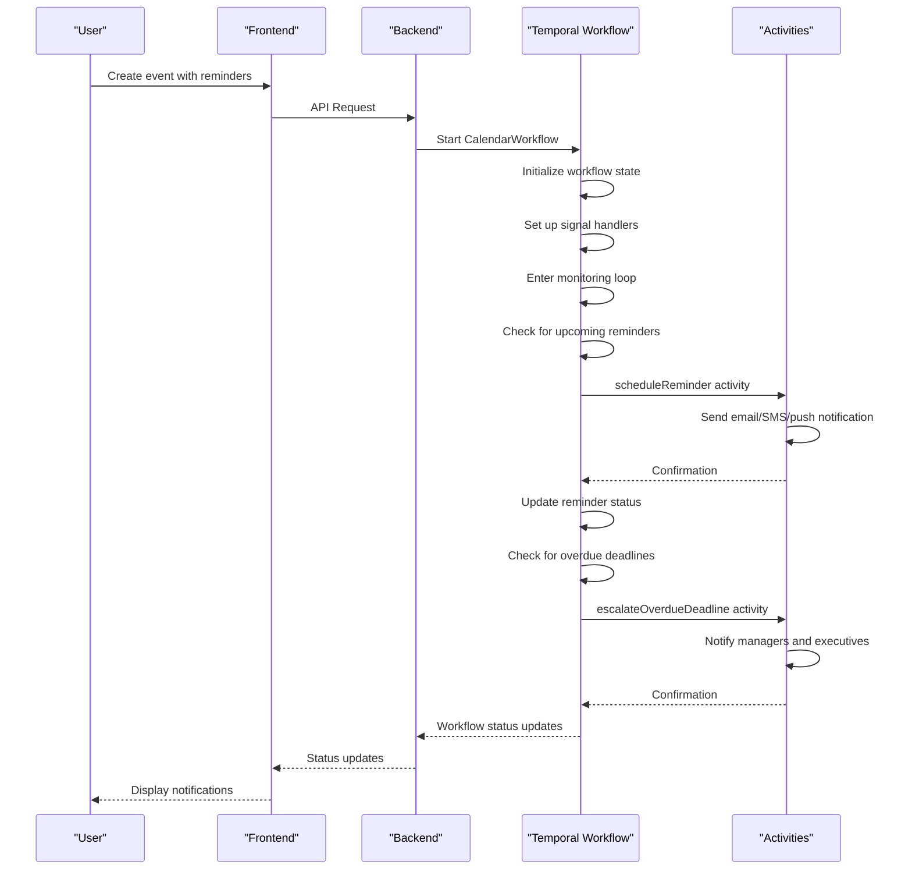
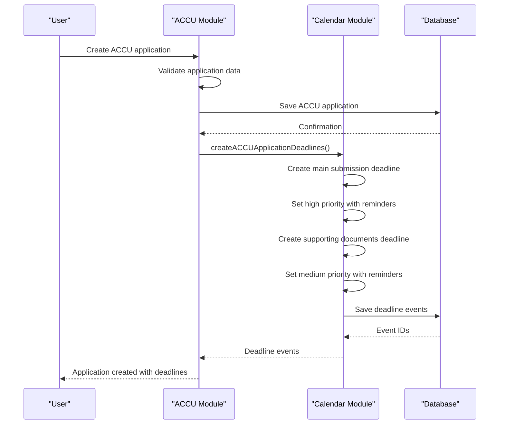
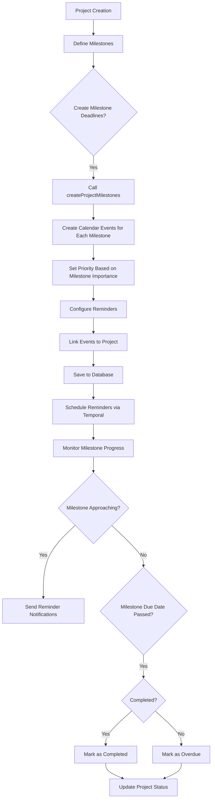
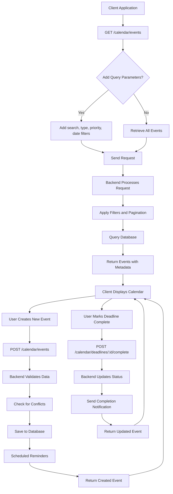
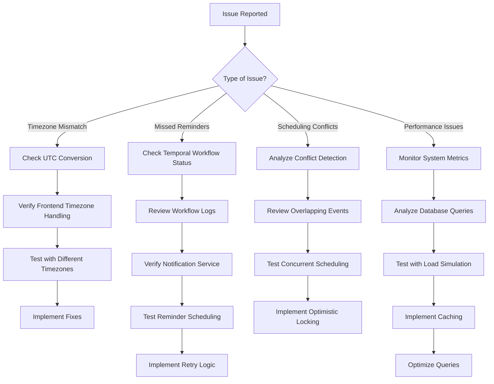
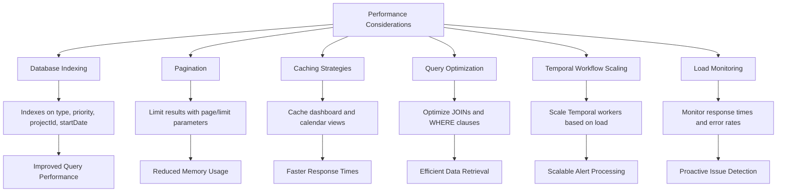

# Calendar & Deadline Tracking

<cite>
**Referenced Files in This Document**   
- [calendar-event.entity.ts](file://apps/backend/src/entities/calendar-event.entity.ts)
- [calendar.service.ts](file://apps/backend/src/modules/calendar/calendar.service.ts)
- [calendar.controller.ts](file://apps/backend/src/modules/calendar/calendar.controller.ts)
- [calendar-event.dto.ts](file://apps/backend/src/modules/calendar/dto/calendar-event.dto.ts)
- [calendar-workflows.ts](file://apps/backend/src/modules/temporal/workflows/calendar/calendar-workflows.ts)
- [calendar-activities.ts](file://apps/backend/src/modules/temporal/activities/calendar-activities.ts)
- [accu-applications.service.ts](file://apps/backend/src/modules/accu/accu-applications.service.ts)
- [page.tsx](file://apps/frontend/src/app/calendar/page.tsx)
- [api-client.ts](file://apps/frontend/src/lib/api-client.ts)
</cite>

## Table of Contents
1. [Introduction](#introduction)
2. [Data Model](#data-model)
3. [Event Creation and Management](#event-creation-and-management)
4. [Deadline and Milestone Tracking](#deadline-and-milestone-tracking)
5. [Recurring Events and Automated Alerts](#recurring-events-and-automated-alerts)
6. [Integration with ACCU Applications](#integration-with-accu-applications)
7. [Integration with Projects](#integration-with-projects)
8. [API Usage](#api-usage)
9. [Common Issues and Debugging](#common-issues-and-debugging)
10. [Performance Considerations](#performance-considerations)

## Introduction
The Calendar & Deadline Tracking module provides a comprehensive system for managing events, deadlines, and milestones within the ProjectCloudACCU platform. This module enables users to create, track, and manage various types of calendar events including deadlines, meetings, audits, and submissions. The system integrates with other modules such as ACCU applications and projects, providing automated reminders and deadline tracking through Temporal workflows. The module supports recurring events, conflict detection, and comprehensive analytics for calendar management.

## Data Model
The Calendar & Deadline Tracking module is centered around the CalendarEvent entity, which represents all types of calendar entries including deadlines, meetings, and other scheduled events. The data model includes relationships with Users and Projects, allowing for assignment and contextual organization of events.

**Diagram sources**
- [calendar-event.entity.ts](file://apps/backend/src/entities/calendar-event.entity.ts#L1-L137)

**Section sources**
- [calendar-event.entity.ts](file://apps/backend/src/entities/calendar-event.entity.ts#L1-L137)

## Event Creation and Management
The Calendar & Deadline Tracking module provides comprehensive functionality for creating and managing calendar events. Users can create various types of events including deadlines, meetings, audits, reviews, submissions, reminders, and custom events. Each event can be assigned a priority level (low, medium, high, or critical) and can be associated with a specific project and assigned user.

Event creation includes validation of user and project existence, conflict detection for scheduling overlaps, and automatic setup of reminders and deadline tracking. The system supports both one-time and recurring events, with recurrence rules following the RFC 5545 RRULE format. Events can be filtered, searched, and paginated based on various criteria including type, priority, date range, and project association.

The module also provides calendar views for monthly, weekly, and daily perspectives, allowing users to visualize their schedule and upcoming events. Conflict detection is performed when creating or updating events to prevent scheduling overlaps, particularly for events assigned to the same user.

**Diagram sources**
- [calendar.service.ts](file://apps/backend/src/modules/calendar/calendar.service.ts#L41-L92)
- [calendar.controller.ts](file://apps/backend/src/modules/calendar/calendar.controller.ts#L45-L65)

**Section sources**
- [calendar.service.ts](file://apps/backend/src/modules/calendar/calendar.service.ts#L41-L92)
- [calendar.controller.ts](file://apps/backend/src/modules/calendar/calendar.controller.ts#L45-L65)

## Deadline and Milestone Tracking
The module provides specialized functionality for tracking deadlines and milestones, with dedicated methods for managing deadline-specific operations. Deadlines can be retrieved, marked as completed, and monitored for overdue status. The system automatically tracks the number of days remaining until a deadline and identifies whether a deadline is overdue.

For deadline management, the system provides methods to retrieve all deadlines, upcoming deadlines, and overdue deadlines. When a deadline is marked as completed, the system updates the event metadata and sends a completion notification to the relevant users. The module also provides analytics on deadline status, including counts of overdue and completed deadlines.

Milestone tracking is integrated with project management, allowing project milestones to be created as calendar events with appropriate deadlines and reminders. The system supports tracking of milestone progress and provides notifications for approaching milestone deadlines.

**Diagram sources**
- [calendar.service.ts](file://apps/backend/src/modules/calendar/calendar.service.ts#L366-L457)
- [calendar.controller.ts](file://apps/backend/src/modules/calendar/calendar.controller.ts#L271-L326)

**Section sources**
- [calendar.service.ts](file://apps/backend/src/modules/calendar/calendar.service.ts#L366-L457)
- [calendar.controller.ts](file://apps/backend/src/modules/calendar/calendar.controller.ts#L271-L326)

## Recurring Events and Automated Alerts
The Calendar & Deadline Tracking module implements automated alerts and reminders through Temporal workflows, providing reliable and scalable event processing. The Temporal workflow system manages deadline tracking, reminder scheduling, escalation processes, and external calendar synchronization.

The CalendarWorkflow handles various types of calendar-related processes including deadline management, reminder scheduling, escalation, external synchronization, and recurring events. The workflow maintains state for each calendar entity and processes signals for creating deadlines, scheduling reminders, adding escalation rules, and generating reports.

Reminders are scheduled based on the event's priority level, with different reminder patterns for critical, high, medium, and low priority events. Critical deadlines receive multiple reminders through various channels (email, SMS, push, in-app) at different intervals before the due date. The system also implements escalation rules that trigger notifications to higher-level stakeholders when deadlines become overdue.

**Diagram sources**
- [calendar-workflows.ts](file://apps/backend/src/modules/temporal/workflows/calendar/calendar-workflows.ts#L173-L227)
- [calendar-activities.ts](file://apps/backend/src/modules/temporal/activities/calendar-activities.ts#L1-L23)

**Section sources**
- [calendar-workflows.ts](file://apps/backend/src/modules/temporal/workflows/calendar/calendar-workflows.ts#L173-L227)
- [calendar-activities.ts](file://apps/backend/src/modules/temporal/activities/calendar-activities.ts#L1-L23)

## Integration with ACCU Applications
The Calendar & Deadline Tracking module integrates with ACCU applications to automatically create and manage deadlines related to the ACCU application process. When an ACCU application is created or updated, the system can automatically generate relevant calendar events to track key milestones and submission deadlines.

The integration creates multiple deadline events for each ACCU application, including the main submission deadline and supporting documents deadline. The main submission deadline is set as a high-priority event with reminders scheduled at 7, 3, and 1 day before the due date. The supporting documents deadline is created one week before the main submission deadline and is set as a medium-priority event with reminders at 3 and 1 day before.

This integration ensures that all ACCU application deadlines are properly tracked in the calendar system, with automated reminders to prevent missed submissions. The events are linked to the specific ACCU application and project, providing context and traceability.

**Diagram sources**
- [calendar.service.ts](file://apps/backend/src/modules/calendar/calendar.service.ts#L677-L714)
- [accu-applications.service.ts](file://apps/backend/src/modules/accu/accu-applications.service.ts#L380-L423)

**Section sources**
- [calendar.service.ts](file://apps/backend/src/modules/calendar/calendar.service.ts#L677-L714)
- [accu-applications.service.ts](file://apps/backend/src/modules/accu/accu-applications.service.ts#L380-L423)

## Integration with Projects
The module provides integration with the project management system to create milestone deadlines and track project progress. Project milestones can be created as calendar events with specific due dates, priorities, and reminder schedules. This integration ensures that key project milestones are visible in the calendar and properly tracked with automated reminders.

When creating project milestones, the system generates calendar events for each milestone with appropriate priority levels and reminder configurations. Critical milestones receive more frequent reminders and have escalation rules configured to notify project managers and executives if deadlines are at risk of being missed.

The integration also supports audit-related events, creating a series of calendar events for the audit process including planning deadlines, execution periods, and report submission deadlines. This ensures comprehensive tracking of the audit lifecycle with appropriate notifications and reminders.

**Diagram sources**
- [calendar.service.ts](file://apps/backend/src/modules/calendar/calendar.service.ts#L718-L741)
- [calendar.controller.ts](file://apps/backend/src/modules/calendar/calendar.controller.ts#L472-L517)

**Section sources**
- [calendar.service.ts](file://apps/backend/src/modules/calendar/calendar.service.ts#L718-L741)
- [calendar.controller.ts](file://apps/backend/src/modules/calendar/calendar.controller.ts#L472-L517)

## API Usage
The Calendar & Deadline Tracking module provides a comprehensive REST API for managing calendar events and retrieving calendar data. The API supports CRUD operations for events, specialized endpoints for deadlines and reminders, and various query parameters for filtering and pagination.

To fetch a user's calendar events, clients can use the GET /calendar/events endpoint with optional query parameters for filtering by type, priority, date range, project, and other criteria. The response includes pagination information and can be sorted by various fields.

For managing event subscriptions, the API provides endpoints to create, update, and delete calendar events, as well as specialized endpoints for marking deadlines as complete and managing reminders. The API uses standard HTTP status codes and follows REST conventions for resource management.

**Diagram sources**
- [calendar.controller.ts](file://apps/backend/src/modules/calendar/calendar.controller.ts#L45-L231)
- [page.tsx](file://apps/frontend/src/app/calendar/page.tsx#L65-L84)
- [api-client.ts](file://apps/frontend/src/lib/api-client.ts#L168-L191)

**Section sources**
- [calendar.controller.ts](file://apps/backend/src/modules/calendar/calendar.controller.ts#L45-L231)
- [page.tsx](file://apps/frontend/src/app/calendar/page.tsx#L65-L84)
- [api-client.ts](file://apps/frontend/src/lib/api-client.ts#L168-L191)

## Common Issues and Debugging
The Calendar & Deadline Tracking module may encounter several common issues that require specific debugging strategies. One frequent issue is timezone mismatches, where events appear at incorrect times due to differences between the user's local timezone and the server's timezone. This can be resolved by ensuring all datetime values are stored in UTC and properly converted to the user's local timezone in the frontend.

Another common issue is missed reminders, which can occur due to workflow processing delays or notification service failures. To debug this issue, check the Temporal workflow logs for any errors in the reminder scheduling process and verify that the notification service is operational. The system maintains a history of workflow events that can be queried to trace the execution of reminder workflows.

Scheduling conflicts can also occur when multiple users attempt to schedule events simultaneously. The system includes conflict detection that identifies overlapping events for the same assignee, but in high-concurrency scenarios, additional locking mechanisms may be required. Monitoring the conflict detection logs can help identify patterns of frequent conflicts that may indicate the need for process improvements.

For performance issues with calendar synchronization, particularly with large numbers of concurrent users, the system provides analytics endpoints that can be used to monitor load and identify bottlenecks. Implementing caching strategies for frequently accessed calendar views and optimizing database queries can help improve performance.

**Diagram sources**
- [calendar.service.ts](file://apps/backend/src/modules/calendar/calendar.service.ts#L271-L316)
- [calendar-workflows.ts](file://apps/backend/src/modules/temporal/workflows/calendar/calendar-workflows.ts#L625-L686)
- [page.tsx](file://apps/frontend/src/app/calendar/page.tsx#L592-L607)

**Section sources**
- [calendar.service.ts](file://apps/backend/src/modules/calendar/calendar.service.ts#L271-L316)
- [calendar-workflows.ts](file://apps/backend/src/modules/temporal/workflows/calendar/calendar-workflows.ts#L625-L686)
- [page.tsx](file://apps/frontend/src/app/calendar/page.tsx#L592-L607)

## Performance Considerations
The Calendar & Deadline Tracking module is designed to handle large numbers of concurrent users and events efficiently. The system uses database indexing on key fields such as event type, priority, project ID, and start date to optimize query performance. Pagination is implemented for all list endpoints to prevent excessive data transfer and memory usage.

For calendar synchronization with large datasets, the system implements efficient querying with appropriate filters and limits. The Temporal workflow system provides scalable processing of reminders and automated alerts, with the ability to distribute workflow execution across multiple workers.

To optimize performance with large numbers of concurrent users, consider implementing caching strategies for frequently accessed calendar views, particularly for dashboard data and monthly views. The system's analytics endpoints can be used to monitor performance metrics and identify potential bottlenecks.

Database query optimization is critical for maintaining performance, particularly for complex queries involving multiple joins and filters. The use of query builders with proper indexing ensures that calendar data can be retrieved efficiently even with large datasets. For very large installations, consider implementing database sharding or read replicas to distribute the load.

**Diagram sources**
- [calendar-event.entity.ts](file://apps/backend/src/entities/calendar-event.entity.ts#L30-L34)
- [calendar.service.ts](file://apps/backend/src/modules/calendar/calendar.service.ts#L99-L181)
- [calendar-workflows.ts](file://apps/backend/src/modules/temporal/workflows/calendar/calendar-workflows.ts#L625-L686)

**Section sources**
- [calendar-event.entity.ts](file://apps/backend/src/entities/calendar-event.entity.ts#L30-L34)
- [calendar.service.ts](file://apps/backend/src/modules/calendar/calendar.service.ts#L99-L181)
- [calendar-workflows.ts](file://apps/backend/src/modules/temporal/workflows/calendar/calendar-workflows.ts#L625-L686)