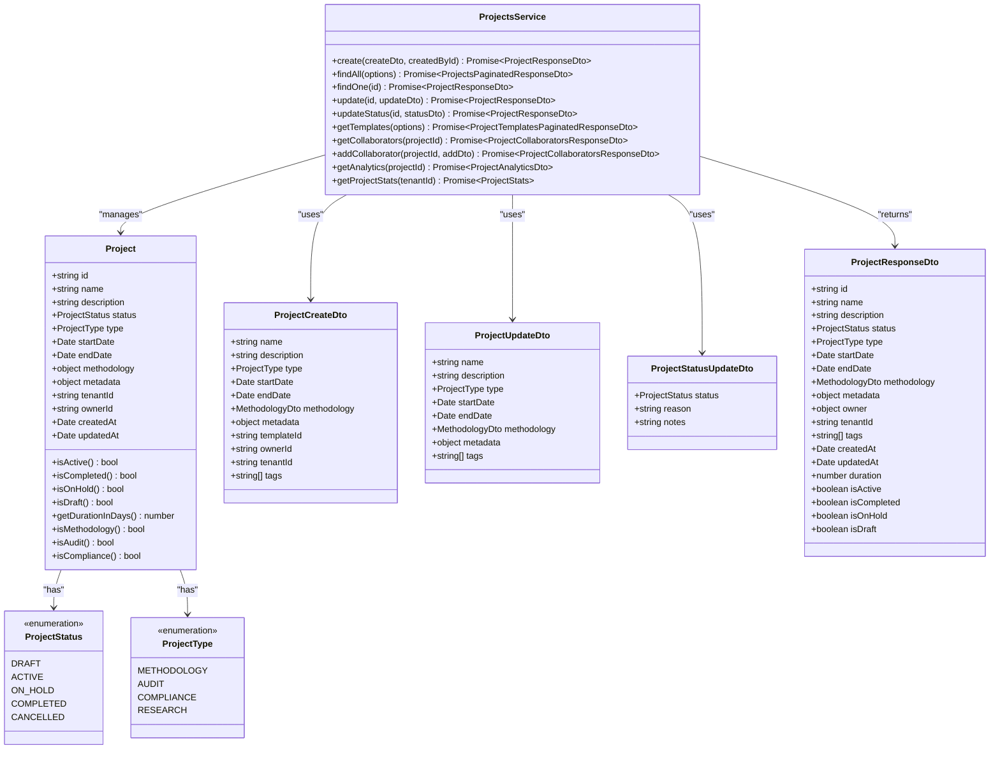
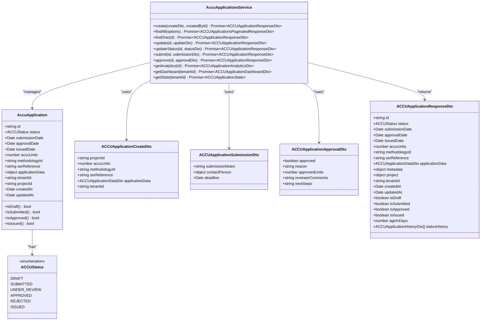

# Core Modules

<cite>
**Referenced Files in This Document**   
- [projects.module.ts](file://apps/backend/src/modules/projects/projects.module.ts)
- [projects.service.ts](file://apps/backend/src/modules/projects/projects.service.ts)
- [project.dto.ts](file://apps/backend/src/modules/projects/dto/project.dto.ts)
- [project.entity.ts](file://apps/backend/src/entities/project.entity.ts)
- [accu.module.ts](file://apps/backend/src/modules/accu/accu.module.ts)
- [accu-applications.service.ts](file://apps/backend/src/modules/accu/accu-applications.service.ts)
- [accu-application.dto.ts](file://apps/backend/src/modules/accu/dto/accu-application.dto.ts)
- [accu-application.entity.ts](file://apps/backend/src/entities/accu-application.entity.ts)
- [documents.module.ts](file://apps/backend/src/modules/documents/documents.module.ts)
- [documents.service.ts](file://apps/backend/src/modules/documents/documents.service.ts)
- [document.dto.ts](file://apps/backend/src/modules/documents/dto/document.dto.ts)
- [document.entity.ts](file://apps/backend/src/entities/document.entity.ts)
- [calendar.module.ts](file://apps/backend/src/modules/calendar/calendar.module.ts)
- [calendar.service.ts](file://apps/backend/src/modules/calendar/calendar.service.ts)
- [calendar-event.dto.ts](file://apps/backend/src/modules/calendar/dto/calendar-event.dto.ts)
- [calendar-event.entity.ts](file://apps/backend/src/entities/calendar-event.entity.ts)
</cite>

## Table of Contents
1. [Project Management](#project-management)
2. [ACCU Applications](#accu-applications)
3. [Document Management](#document-management)
4. [Calendar & Deadline Tracking](#calendar--deadline-tracking)

## Project Management

The Project Management module serves as the central organizational unit for all activities within the ACCU Platform. It provides a structured framework for creating, tracking, and managing projects across various types including audits, compliance initiatives, and research projects. The module supports project lifecycle management from creation through to completion or cancellation, with comprehensive status tracking and workflow validation.

The module is implemented as a NestJS module with dependency injection, utilizing TypeORM for database operations. It maintains relationships with other core entities such as users (as owners), documents, calendar events, and ACCU applications. The service layer provides business logic for project creation, status transitions, template management, and collaboration features.



**Diagram sources**
- [project.entity.ts](file://apps/backend/src/entities/project.entity.ts#L19-L145)
- [projects.service.ts](file://apps/backend/src/modules/projects/projects.service.ts#L135-L800)
- [project.dto.ts](file://apps/backend/src/modules/projects/dto/project.dto.ts#L143-L695)

**Section sources**
- [projects.module.ts](file://apps/backend/src/modules/projects/projects.module.ts#L1-L39)
- [projects.service.ts](file://apps/backend/src/modules/projects/projects.service.ts#L1-L800)
- [project.dto.ts](file://apps/backend/src/modules/projects/dto/project.dto.ts#L1-L695)
- [project.entity.ts](file://apps/backend/src/entities/project.entity.ts#L1-L145)

### Implementation Details

The Project Management module provides a comprehensive API for project lifecycle management. Key implementation details include:

- **Project Creation**: Projects can be created using templates that define default settings, required fields, and methodology requirements. The service validates methodology requirements based on project type during creation.
- **Status Transitions**: The module enforces valid status transitions (e.g., draft → active, active → completed) with business logic validation. For example, audit projects require methodology definition before activation.
- **Template System**: In-memory template storage provides predefined configurations for common project types (ISO 14064-2 Carbon Audit, Regulatory Compliance, Research & Development).
- **Collaboration**: Supports adding/removing collaborators with role-based permissions and access control.
- **Analytics**: Provides project analytics including duration, progress calculation, document counts, and deadline tracking.

### Configuration Options

The module supports the following configuration options through environment variables and module configuration:

- **Template Management**: Templates can be created, updated, and deleted through the service layer
- **Status Workflow**: Status transition rules are defined in the service with validation for each transition
- **Multi-tenancy**: Tenant ID support for multi-tenant deployments
- **Field Requirements**: Required and optional fields can be configured per template

### Usage Patterns

Common usage patterns for the Project Management module include:

#### Creating a New Project
```typescript
// Create a new audit project using the ISO 14064-2 template
const createDto = {
  name: 'Q4 Carbon Audit 2024',
  description: 'Quarterly carbon footprint assessment',
  type: ProjectType.AUDIT,
  startDate: new Date('2024-10-01'),
  endDate: new Date('2024-12-31'),
  templateId: 'template-iso14064'
};

const project = await projectsService.create(createDto, currentUser.id);
```

#### Updating Project Status
```typescript
// Update project status to active
const statusDto = {
  status: ProjectStatus.ACTIVE,
  reason: 'Project planning completed',
  notes: 'All initial documentation has been reviewed'
};

const updatedProject = await projectsService.updateStatus(projectId, statusDto);
```

#### Adding Project Collaborators
```typescript
// Add a collaborator to the project
const addDto = {
  collaborator: {
    userId: 'user-123',
    role: 'reviewer',
    canEdit: true,
    canManageCollaborators: false
  }
};

await projectsService.addCollaborator(projectId, addDto);
```

#### Retrieving Project Analytics
```typescript
// Get analytics for a specific project
const analytics = await projectsService.getAnalytics(projectId);
console.log(`Project progress: ${analytics.progress}%`);
console.log(`Days until deadline: ${analytics.daysUntilDeadline}`);
```

## ACCU Applications

The ACCU Applications module manages the lifecycle of ACCU (Australian Carbon Credit Unit) applications within the platform. It provides a structured workflow for creating, submitting, reviewing, and approving ACCU applications linked to specific projects. The module handles the complex state transitions required for ACCU applications and integrates with other modules for document management and deadline tracking.

The module is implemented as a NestJS module with dependency injection, utilizing TypeORM for database operations. It maintains relationships with projects, documents, and calendar events. The service layer provides business logic for application creation, status transitions, submission workflows, and integration with notification systems.



**Diagram sources**
- [accu-application.entity.ts](file://apps/backend/src/entities/accu-application.entity.ts#L12-L86)
- [accu-applications.service.ts](file://apps/backend/src/modules/accu/accu-applications.service.ts#L51-L800)
- [accu-application.dto.ts](file://apps/backend/src/modules/accu/dto/accu-application.dto.ts#L58-L610)

**Section sources**
- [accu.module.ts](file://apps/backend/src/modules/accu/accu.module.ts#L1-L28)
- [accu-applications.service.ts](file://apps/backend/src/modules/accu/accu-applications.service.ts#L1-L800)
- [accu-application.dto.ts](file://apps/backend/src/modules/accu/dto/accu-application.dto.ts#L1-L610)
- [accu-application.entity.ts](file://apps/backend/src/entities/accu-application.entity.ts#L1-L86)

### Implementation Details

The ACCU Applications module provides a comprehensive API for managing ACCU application lifecycles. Key implementation details include:

- **Application Lifecycle**: Manages the complete lifecycle from draft creation through submission, review, approval/rejection, and issuance.
- **Status Transitions**: Enforces valid status transitions with business logic validation (e.g., only draft applications can be updated, only submitted applications can be approved).
- **Submission Workflow**: Handles the submission process with support for submission notes, contact person information, and deadline tracking.
- **Approval Process**: Supports approval/rejection decisions with configurable approved units, reviewer comments, and next steps.
- **Integration**: Integrates with the notification system to send status change notifications and with the calendar module to create submission deadlines.
- **Analytics**: Provides application analytics including processing time, success rate, and document completion metrics.

### Configuration Options

The module supports the following configuration options:

- **Methodology Requirements**: Different methodologies have specific requirements that are validated during application creation and status transitions.
- **Notification Settings**: Configurable notification templates for status changes, submission confirmations, and approval/rejection notifications.
- **Deadline Management**: Automatic creation of submission deadlines and supporting document deadlines.
- **Multi-tenancy**: Tenant ID support for multi-tenant deployments.

### Usage Patterns

Common usage patterns for the ACCU Applications module include:

#### Creating a New ACCU Application
```typescript
// Create a new ACCU application for a project
const createDto = {
  projectId: 'project-123',
  accuUnits: 1000,
  methodologyId: 'methodology-iso14064-2',
  applicationData: {
    description: 'Carbon sequestration project',
    location: {
      address: '123 Green Street, Eco City',
      coordinates: { lat: -33.8688, lng: 151.2093 },
      jurisdiction: 'NSW'
    },
    baseline: {
      period: { start: new Date('2023-01-01'), end: new Date('2023-12-31') },
      methodology: 'ISO 14064-2',
      data: { emissions: 5000 }
    }
  }
};

const application = await accuApplicationsService.create(createDto, currentUser.id);
```

#### Submitting an ACCU Application
```typescript
// Submit a draft application
const submissionDto = {
  submissionNotes: 'All required documentation has been attached',
  contactPerson: {
    name: 'John Smith',
    email: 'john.smith@company.com',
    phone: '+61 2 1234 5678',
    position: 'Project Manager'
  },
  deadline: new Date('2024-11-15')
};

const submittedApplication = await accuApplicationsService.submit(applicationId, submissionDto);
```

#### Approving an ACCU Application
```typescript
// Approve a submitted application
const approvalDto = {
  approved: true,
  reason: 'Application meets all requirements',
  approvedUnits: 950, // Slightly less than requested
  reviewerComments: 'Minor adjustments required to methodology calculations',
  nextSteps: 'Issue ACCU units and update registry'
};

const approvedApplication = await accuApplicationsService.approve(applicationId, approvalDto);
```

#### Retrieving Application Analytics
```typescript
// Get analytics for an application
const analytics = await accuApplicationsService.getAnalytics(applicationId);
console.log(`Application progress: ${analytics.progress}%`);
console.log(`Days until next deadline: ${analytics.daysUntilNextDeadline}`);
console.log(`Document completion: ${analytics.documentCompletion}%`);
```

## Document Management

The Document Management module provides comprehensive document handling capabilities for the ACCU Platform. It supports document upload, versioning, security scanning, metadata management, and access control. The module integrates with file storage providers (local and S3) and provides enhanced security features including file scanning and content validation.

The module is implemented as a NestJS module with dependency injection, utilizing TypeORM for database operations and Multer for file handling. It maintains relationships with users (as uploaders) and projects. The service layer provides business logic for document operations, while the document security service handles security scanning and content validation.

```mermaid
classDiagram
class Document {
+string id
+string name
+string description
+DocumentCategory category
+DocumentStatus status
+number version
+string fileName
+string originalFileName
+string filePath
+string fileUrl
+string mimeType
+number fileSize
+string checksum
+object metadata
+string[] tags
+string tenantId
+string uploadedById
+string projectId
+Date createdAt
+Date updatedAt
+isDraft() bool
+isInReview() bool
+isApproved() bool
+isRejected() bool
+isArchived() bool
+isMethodologyDocument() bool
+isAuditDocument() bool
+isComplianceDocument() bool
+getFileExtension() string
+formatFileSize() string
}
class DocumentStatus {
<<enumeration>>
DRAFT
REVIEW
APPROVED
REJECTED
ARCHIVED
}
class DocumentCategory {
<<enumeration>>
METHODOLOGY
AUDIT_REPORT
COMPLIANCE_DOCUMENT
EVIDENCE
CORRESPONDENCE
OTHER
}
class DocumentsService {
+uploadDocument(uploadDto, uploadedById) Promise~DocumentUploadResult~
+findAll(options) Promise~DocumentsPaginatedResponseDto~
+findOne(id) Promise~DocumentResponseDto~
+update(id, updateDto) Promise~DocumentResponseDto~
+uploadVersion(id, versionDto, uploadedById) Promise~DocumentVersionDto~
+getVersions(id) Promise~DocumentVersionDto[]~
+download(id) Promise~Buffer~
+remove(id) Promise~void~
+getAuditTrail(id) Promise~DocumentAuditDto[]~
+bulkOperation(operationDto) Promise~{updated, failed}~
+searchByTags(tags) Promise~DocumentResponseDto[]~
+getDocumentStats(tenantId) Promise~{total, byStatus, byCategory, totalSize, averageFileSize}~
}
class DocumentUploadDto {
+File file
+string name
+string description
+DocumentCategory category
+string[] tags
+string projectId
+object metadata
+DocumentStatus status
}
class DocumentUpdateDto {
+string name
+string description
+DocumentCategory category
+string[] tags
+string projectId
+object metadata
+DocumentStatus status
}
class DocumentVersionUploadDto {
+File file
+string versionNotes
+object metadata
}
class DocumentResponseDto {
+string id
+string name
+string description
+DocumentCategory category
+DocumentStatus status
+number version
+object file
+string[] tags
+object metadata
+object project
+object uploadedBy
+string tenantId
+Date createdAt
+Date updatedAt
+string formattedFileSize
+string fileExtension
}
Document --> DocumentStatus : "has"
Document --> DocumentCategory : "has"
DocumentsService --> Document : "manages"
DocumentsService --> DocumentUploadDto : "uses"
DocumentsService --> DocumentUpdateDto : "uses"
DocumentsService --> DocumentVersionUploadDto : "uses"
DocumentsService --> DocumentResponseDto : "returns"
```

**Diagram sources**
- [document.entity.ts](file://apps/backend/src/entities/document.entity.ts#L13-L157)
- [documents.service.ts](file://apps/backend/src/modules/documents/documents.service.ts#L57-L692)
- [document.dto.ts](file://apps/backend/src/modules/documents/dto/document.dto.ts#L1-L614)

**Section sources**
- [documents.module.ts](file://apps/backend/src/modules/documents/documents.module.ts#L1-L53)
- [documents.service.ts](file://apps/backend/src/modules/documents/documents.service.ts#L1-L692)
- [document.dto.ts](file://apps/backend/src/modules/documents/dto/document.dto.ts#L1-L614)
- [document.entity.ts](file://apps/backend/src/entities/document.entity.ts#L1-L157)

### Implementation Details

The Document Management module provides comprehensive document handling capabilities. Key implementation details include:

- **File Upload**: Supports file uploads with size limits (50MB) and MIME type restrictions for security.
- **Security Scanning**: Integrates with document security service to scan files for malware and validate content.
- **Versioning**: Supports document versioning with version notes and metadata tracking.
- **Metadata Management**: Enhanced metadata includes security scan results, content validation, and file hashes.
- **Bulk Operations**: Supports bulk operations on multiple documents (status updates, category changes, tag management).
- **Search**: Provides search capabilities by tags and full-text search on document names and descriptions.

### Configuration Options

The module supports the following configuration options:

- **File Storage**: Configurable file storage providers (local or S3) through the file-storage module.
- **Security Settings**: Configurable security scanning rules and content validation parameters.
- **MIME Type Restrictions**: Configurable allowed MIME types for file uploads.
- **File Size Limits**: Configurable maximum file size (50MB default).
- **Versioning**: Versioning strategy and retention policies.

### Usage Patterns

Common usage patterns for the Document Management module include:

#### Uploading a New Document
```typescript
// Upload a new document to a project
const uploadDto = {
  file: requestFile,
  name: 'Q4 Audit Report',
  description: 'Final audit report for Q4 2024',
  category: DocumentCategory.AUDIT_REPORT,
  projectId: 'project-123',
  tags: ['audit', 'q4', 'final'],
  metadata: {
    department: 'Compliance',
    confidentiality: 'internal'
  }
};

const result = await documentsService.uploadDocument(uploadDto, currentUser.id);
```

#### Uploading a New Version
```typescript
// Upload a new version of an existing document
const versionDto = {
  file: updatedFile,
  versionNotes: 'Updated with additional compliance requirements',
  metadata: {
    changes: 'Added new regulatory requirements',
    reviewedBy: 'Jane Doe'
  }
};

const newVersion = await documentsService.uploadVersion(documentId, versionDto, currentUser.id);
```

#### Performing Bulk Operations
```typescript
// Update status of multiple documents
const operationDto = {
  documentIds: ['doc-1', 'doc-2', 'doc-3'],
  operation: 'update_status',
  parameters: {
    status: DocumentStatus.APPROVED
  }
};

const result = await documentsService.bulkOperation(operationDto);
console.log(`Updated ${result.updated} documents, ${result.failed} failed`);
```

#### Searching Documents by Tags
```typescript
// Find all documents with specific tags
const taggedDocuments = await documentsService.searchByTags(['audit', 'compliance']);
taggedDocuments.forEach(doc => {
  console.log(`${doc.name} (${doc.category}): ${doc.description}`);
});
```

## Calendar & Deadline Tracking

The Calendar & Deadline Tracking module provides comprehensive scheduling and deadline management capabilities for the ACCU Platform. It supports event creation, recurrence, reminders, deadline tracking, and integration with other modules. The module handles scheduling conflicts, provides calendar views, and integrates with the notification system for reminders.

The module is implemented as a NestJS module with dependency injection, utilizing TypeORM for database operations. It maintains relationships with projects, users (as assignees and creators), and integrates with the notifications module. The service layer provides business logic for event management, conflict detection, and deadline tracking.

```mermaid
classDiagram
class CalendarEvent {
+string id
+string title
+string description
+EventType type
+Priority priority
+Date startDate
+Date endDate
+boolean isAllDay
+string recurrenceRule
+object metadata
+number[] reminders
+string tenantId
+string projectId
+string createdById
+string assigneeId
+Date createdAt
+Date updatedAt
+isDeadline() bool
+isMeeting() bool
+isAudit() bool
+isSubmission() bool
+isCritical() bool
+isHighPriority() bool
+isRecurring() bool
+getDurationInHours() number
}
class EventType {
<<enumeration>>
DEADLINE
MEETING
AUDIT
REVIEW
SUBMISSION
REMINDER
CUSTOM
}
class Priority {
<<enumeration>>
LOW
MEDIUM
HIGH
CRITICAL
}
class CalendarService {
+createEvent(createDto, createdById) Promise~CalendarEvent~
+getEvents(query) Promise~{events, total, pagination}~
+getEventById(id) Promise~CalendarEvent~
+updateEvent(id, updateDto, updatedById) Promise~CalendarEvent~
+deleteEvent(id) Promise~void~
+detectConflicts(eventData, excludeEventId) Promise~EventConflict[]~
+scheduleReminders(event) Promise~void~
+updateReminders(event) Promise~void~
+cancelReminders(event) Promise~void~
+getDeadlines(query) Promise~DeadlineDto[]~
+getOverdueDeadlines() Promise~DeadlineDto[]~
+getUpcomingDeadlines(days) Promise~DeadlineDto[]~
+completeDeadline(id) Promise~CalendarEvent~
+setupDeadlineTracking(deadline) Promise~void~
+getCalendarView(year, month, day, tenantId) Promise~any~
+getCalendarStats(tenantId) Promise~CalendarStats~
+createACCUApplicationDeadlines(applicationId, dueDate, projectId, createdById) Promise~CalendarEvent[]~
+createProjectMilestones(projectId, milestones, createdById) Promise~CalendarEvent[]~
+createAuditEvents(auditId, auditData, createdById) Promise~CalendarEvent[]~
}
class CalendarEventCreateDto {
+string title
+string description
+EventType type
+Priority priority
+Date startDate
+Date endDate
+boolean isAllDay
+string recurrenceRule
+string projectId
+string assigneeId
+number[] reminders
+object metadata
+string tenantId
}
class DeadlineDto {
+string id
+string title
+Date dueDate
+Priority priority
+string projectId
+string assigneeId
+number daysRemaining
+boolean isOverdue
+boolean isCompleted
+Date completedAt
+object metadata
}
CalendarEvent --> EventType : "has"
CalendarEvent --> Priority : "has"
CalendarService --> CalendarEvent : "manages"
CalendarService --> CalendarEventCreateDto : "uses"
CalendarService --> DeadlineDto : "returns"
```

**Diagram sources**
- [calendar-event.entity.ts](file://apps/backend/src/entities/calendar-event.entity.ts#L13-L137)
- [calendar.service.ts](file://apps/backend/src/modules/calendar/calendar.service.ts#L27-L800)
- [calendar-event.dto.ts](file://apps/backend/src/modules/calendar/dto/calendar-event.dto.ts#L1-L381)

**Section sources**
- [calendar.module.ts](file://apps/backend/src/modules/calendar/calendar.module.ts#L1-L23)
- [calendar.service.ts](file://apps/backend/src/modules/calendar/calendar.service.ts#L1-L800)
- [calendar-event.dto.ts](file://apps/backend/src/modules/calendar/dto/calendar-event.dto.ts#L1-L381)
- [calendar-event.entity.ts](file://apps/backend/src/entities/calendar-event.entity.ts#L1-L137)

### Implementation Details

The Calendar & Deadline Tracking module provides comprehensive scheduling capabilities. Key implementation details include:

- **Event Management**: Supports creation, updating, and deletion of events with various types (deadline, meeting, audit, etc.).
- **Conflict Detection**: Detects scheduling conflicts based on time overlap and assignee availability.
- **Reminders**: Supports configurable reminders with multiple notification channels.
- **Deadline Tracking**: Specialized handling for deadlines with completion tracking and overdue detection.
- **Calendar Views**: Provides daily, weekly, and monthly calendar views.
- **Integrations**: Creates automatic calendar events for ACCU applications, project milestones, and audits.

### Configuration Options

The module supports the following configuration options:

- **Reminder Settings**: Configurable default reminders (1, 7, 30 days before).
- **Event Types**: Configurable event types and their display properties.
- **Priority Levels**: Configurable priority levels and their visual representation.
- **Recurrence Rules**: Supports RFC 5545 RRULE format for recurring events.
- **Multi-tenancy**: Tenant ID support for multi-tenant deployments.

### Usage Patterns

Common usage patterns for the Calendar & Deadline Tracking module include:

#### Creating a New Event
```typescript
// Create a new meeting event
const createDto = {
  title: 'Project Kickoff Meeting',
  description: 'Initial meeting to discuss project scope and timeline',
  type: EventType.MEETING,
  priority: Priority.HIGH,
  startDate: new Date('2024-10-15T09:00:00'),
  endDate: new Date('2024-10-15T10:30:00'),
  projectId: 'project-123',
  assigneeId: 'user-456',
  reminders: [1, 7] // 1 day and 1 week before
};

const event = await calendarService.createEvent(createDto, currentUser.id);
```

#### Creating ACCU Application Deadlines
```typescript
// Automatically create deadlines for an ACCU application
const deadlines = await calendarService.createACCUApplicationDeadlines(
  'application-789',
  new Date('2024-11-15'),
  'project-123',
  currentUser.id
);

console.log(`Created ${deadlines.length} deadlines for ACCU application`);
```

#### Getting Upcoming Deadlines
```typescript
// Get all upcoming deadlines for the next 30 days
const upcomingDeadlines = await calendarService.getUpcomingDeadlines(30);
upcomingDeadlines.forEach(deadline => {
  console.log(`${deadline.title}: ${deadline.daysRemaining} days remaining`);
  if (deadline.isOverdue) {
    console.log('⚠️  This deadline is overdue!');
  }
});
```

#### Completing a Deadline
```typescript
// Mark a deadline as completed
const completedEvent = await calendarService.completeDeadline('event-123');
console.log(`Deadline "${completedEvent.title}" has been completed`);
```