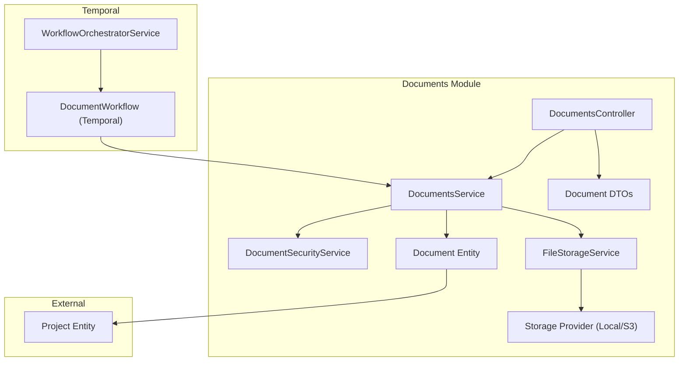
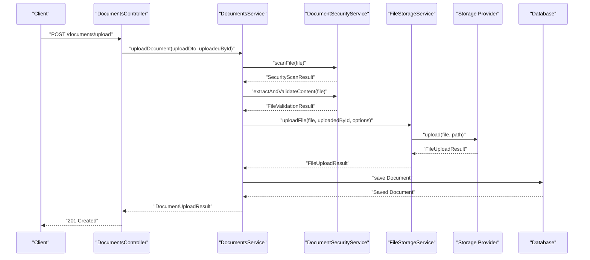
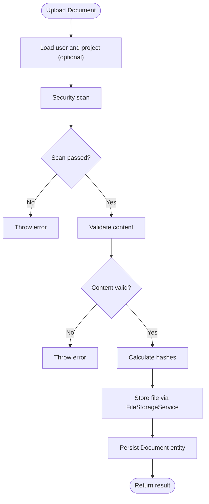
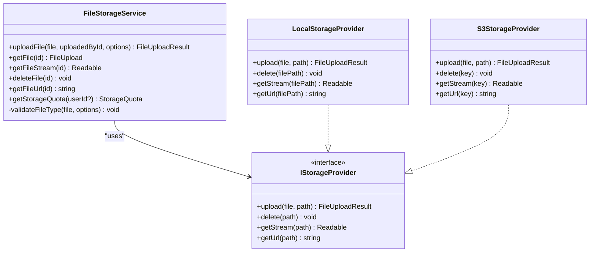
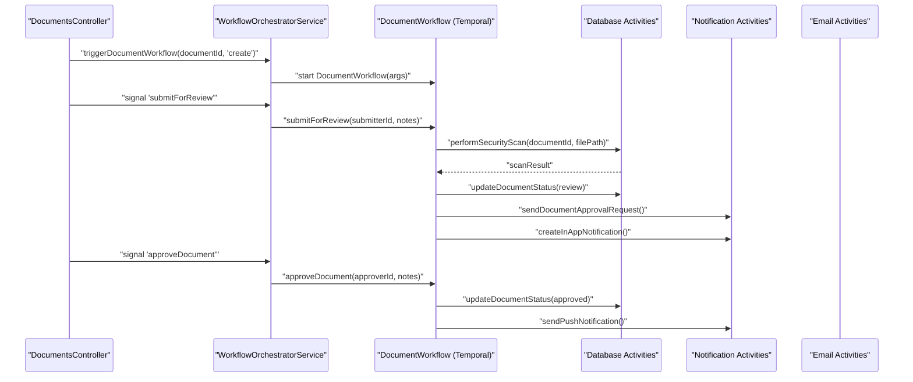
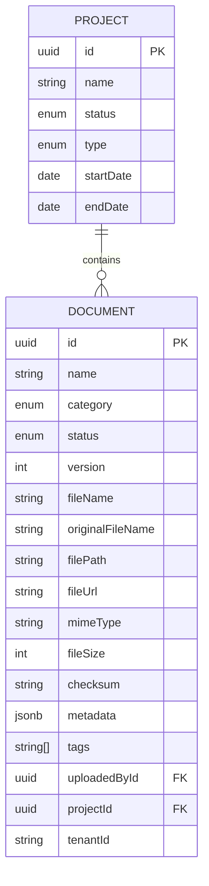
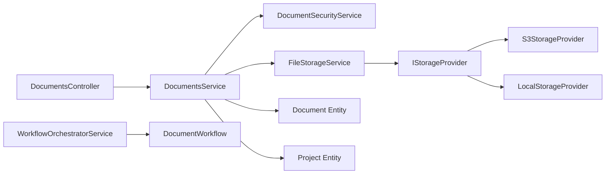

# Document Management

<cite>
**Referenced Files in This Document**
- [documents.controller.ts](file://apps/backend/src/modules/documents/documents.controller.ts)
- [documents.service.ts](file://apps/backend/src/modules/documents/documents.service.ts)
- [document-security.service.ts](file://apps/backend/src/modules/documents/document-security.service.ts)
- [document.entity.ts](file://apps/backend/src/entities/document.entity.ts)
- [document.dto.ts](file://apps/backend/src/modules/documents/dto/document.dto.ts)
- [documents.module.ts](file://apps/backend/src/modules/documents/documents.module.ts)
- [file-storage.service.ts](file://apps/backend/src/modules/file-storage/file-storage.service.ts)
- [s3-storage.provider.ts](file://apps/backend/src/modules/file-storage/providers/s3-storage.provider.ts)
- [local-storage.provider.ts](file://apps/backend/src/modules/file-storage/providers/local-storage.provider.ts)
- [storage-provider.interface.ts](file://apps/backend/src/modules/file-storage/storage-provider.interface.ts)
- [configuration.ts](file://apps/backend/src/config/configuration.ts)
- [document-workflows.ts](file://apps/backend/src/modules/temporal/workflows/document/document-workflows.ts)
- [workflow-orchestrator.service.ts](file://apps/backend/src/modules/temporal/workflow-orchestrator.service.ts)
- [project.entity.ts](file://apps/backend/src/entities/project.entity.ts)
- [README.md](file://apps/backend/src/modules/documents/README.md)
</cite>

## Table of Contents
1. [Introduction](#introduction)
2. [Project Structure](#project-structure)
3. [Core Components](#core-components)
4. [Architecture Overview](#architecture-overview)
5. [Detailed Component Analysis](#detailed-component-analysis)
6. [Dependency Analysis](#dependency-analysis)
7. [Performance Considerations](#performance-considerations)
8. [Troubleshooting Guide](#troubleshooting-guide)
9. [Conclusion](#conclusion)
10. [Appendices](#appendices)

## Introduction
This document describes the Document Management module of the ACCU Platform. It covers document upload, versioning, access control, and workflow integration with Temporal. It explains the service layer implementation for secure document handling, including encryption detection, content validation, and permission checks. It also provides usage examples for uploading, retrieving, and sharing documents via API endpoints, details the relationships between documents and Projects and ACCU Applications, and addresses common issues such as file size limits, unsupported formats, and permission inheritance. Finally, it includes performance optimization tips for large document repositories and integration with S3-compatible storage providers, along with security best practices for handling sensitive compliance documentation.

## Project Structure
The Document Management module is organized around a clear separation of concerns:
- Controller: Exposes REST endpoints for document operations.
- Service: Implements business logic, integrates with storage and security services.
- Security Service: Performs file validation, content scanning, and integrity checks.
- Entities: Define the Document model and related enumerations.
- DTOs: Validate and shape request/response payloads.
- File Storage: Provides pluggable storage backends (local and S3-compatible).
- Temporal Workflows: Orchestrates document lifecycle workflows (review, approval, publishing, archiving) and integrates with notifications.

**Diagram sources**
- [documents.controller.ts](file://apps/backend/src/modules/documents/documents.controller.ts#L1-L357)
- [documents.service.ts](file://apps/backend/src/modules/documents/documents.service.ts#L1-L692)
- [document-security.service.ts](file://apps/backend/src/modules/documents/document-security.service.ts#L1-L595)
- [file-storage.service.ts](file://apps/backend/src/modules/file-storage/file-storage.service.ts#L1-L233)
- [s3-storage.provider.ts](file://apps/backend/src/modules/file-storage/providers/s3-storage.provider.ts#L1-L96)
- [local-storage.provider.ts](file://apps/backend/src/modules/file-storage/providers/local-storage.provider.ts#L1-L69)
- [document-workflows.ts](file://apps/backend/src/modules/temporal/workflows/document/document-workflows.ts#L1-L681)
- [workflow-orchestrator.service.ts](file://apps/backend/src/modules/temporal/workflow-orchestrator.service.ts#L1-L442)
- [document.entity.ts](file://apps/backend/src/entities/document.entity.ts#L1-L157)
- [project.entity.ts](file://apps/backend/src/entities/project.entity.ts#L1-L145)

**Section sources**
- [documents.controller.ts](file://apps/backend/src/modules/documents/documents.controller.ts#L1-L357)
- [documents.service.ts](file://apps/backend/src/modules/documents/documents.service.ts#L1-L692)
- [document-security.service.ts](file://apps/backend/src/modules/documents/document-security.service.ts#L1-L595)
- [file-storage.service.ts](file://apps/backend/src/modules/file-storage/file-storage.service.ts#L1-L233)
- [s3-storage.provider.ts](file://apps/backend/src/modules/file-storage/providers/s3-storage.provider.ts#L1-L96)
- [local-storage.provider.ts](file://apps/backend/src/modules/file-storage/providers/local-storage.provider.ts#L1-L69)
- [document-workflows.ts](file://apps/backend/src/modules/temporal/workflows/document/document-workflows.ts#L1-L681)
- [workflow-orchestrator.service.ts](file://apps/backend/src/modules/temporal/workflow-orchestrator.service.ts#L1-L442)
- [document.entity.ts](file://apps/backend/src/entities/document.entity.ts#L1-L157)
- [project.entity.ts](file://apps/backend/src/entities/project.entity.ts#L1-L145)

## Core Components
- DocumentsController: Exposes endpoints for upload, listing, search, versioning, download, deletion, audit, and bulk operations. It enforces authentication and permission guards and uses DTOs for validation.
- DocumentsService: Implements the core business logic, including security scanning, content validation, file upload via FileStorageService, metadata enrichment, versioning, and soft deletion.
- DocumentSecurityService: Validates file types, performs content scanning for suspicious patterns, detects encryption/password protection, calculates integrity hashes, and sanitizes metadata.
- FileStorageService: Validates file size and type, delegates upload to a storage provider, records file metadata, and computes checksums.
- Storage Providers: LocalStorageProvider and S3StorageProvider implement a common interface for file persistence and URL generation.
- Temporal Workflows: DocumentWorkflow orchestrates document lifecycle transitions (submit for review, assign reviewer, start review, submit revision, approve, reject, publish, archive, update access control) and integrates with database and notification activities.
- WorkflowOrchestratorService: Starts and signals Temporal workflows for documents, projects, and applications, and handles event-driven triggers and scheduled checks.

**Section sources**
- [documents.controller.ts](file://apps/backend/src/modules/documents/documents.controller.ts#L1-L357)
- [documents.service.ts](file://apps/backend/src/modules/documents/documents.service.ts#L1-L692)
- [document-security.service.ts](file://apps/backend/src/modules/documents/document-security.service.ts#L1-L595)
- [file-storage.service.ts](file://apps/backend/src/modules/file-storage/file-storage.service.ts#L1-L233)
- [storage-provider.interface.ts](file://apps/backend/src/modules/file-storage/storage-provider.interface.ts#L1-L17)
- [s3-storage.provider.ts](file://apps/backend/src/modules/file-storage/providers/s3-storage.provider.ts#L1-L96)
- [local-storage.provider.ts](file://apps/backend/src/modules/file-storage/providers/local-storage.provider.ts#L1-L69)
- [document-workflows.ts](file://apps/backend/src/modules/temporal/workflows/document/document-workflows.ts#L1-L681)
- [workflow-orchestrator.service.ts](file://apps/backend/src/modules/temporal/workflow-orchestrator.service.ts#L1-L442)

## Architecture Overview
The module follows a layered architecture:
- Presentation: NestJS controller validates inputs and delegates to the service.
- Service: Coordinates security scanning, storage, and persistence.
- Persistence: TypeORM entity stores document metadata and links to Project and User.
- Storage: Pluggable provider abstraction supports local filesystem and S3-compatible storage.
- Orchestration: Temporal workflows manage document lifecycle and notifications.

**Diagram sources**
- [documents.controller.ts](file://apps/backend/src/modules/documents/documents.controller.ts#L120-L135)
- [documents.service.ts](file://apps/backend/src/modules/documents/documents.service.ts#L72-L190)
- [document-security.service.ts](file://apps/backend/src/modules/documents/document-security.service.ts#L74-L127)
- [file-storage.service.ts](file://apps/backend/src/modules/file-storage/file-storage.service.ts#L64-L118)
- [s3-storage.provider.ts](file://apps/backend/src/modules/file-storage/providers/s3-storage.provider.ts#L32-L61)
- [local-storage.provider.ts](file://apps/backend/src/modules/file-storage/providers/local-storage.provider.ts#L19-L42)

## Detailed Component Analysis

### DocumentsController
- Authentication and Authorization: Uses JWT guard and combined RolesGuard and PermissionsGuard. Endpoints require specific permissions (e.g., DOCUMENTS_WRITE, DOCUMENTS_READ, DOCUMENTS_DELETE).
- Endpoints:
  - Upload: multipart/form-data upload with file, name, description, category, tags, projectId, metadata, status.
  - List/Search: paginated listing with filters (search, status, category, projectId, uploadedById, tags, tenantId), sort, and tags search endpoint.
  - Versions: uploadVersion and getVersions for versioning.
  - Download: returns file buffer with appropriate headers.
  - Audit: returns a simplified audit trail.
  - Bulk: batch operations on documents.
- Validation: Uses DTOs and Swagger annotations for API documentation and request validation.

**Section sources**
- [documents.controller.ts](file://apps/backend/src/modules/documents/documents.controller.ts#L60-L357)
- [document.dto.ts](file://apps/backend/src/modules/documents/dto/document.dto.ts#L1-L614)

### DocumentsService
- Upload pipeline:
  - Security scan and content validation.
  - File hashing for integrity.
  - Storage upload with provider abstraction.
  - Enhanced metadata with security results and extracted text preview.
  - Document creation with tenant scoping and optional project association.
- Versioning:
  - Increment version on new uploads.
  - Maintain same MIME type for subsequent versions.
  - Store version notes and metadata.
- Retrieval and filtering:
  - findAll with pagination, filtering, and sorting.
  - findOne with relations.
  - searchByTags using array overlap operator.
- Download:
  - Retrieves file buffer from storage provider and streams to client.
- Deletion:
  - Soft delete by setting status to ARCHIVED.
- Audit:
  - Simplified audit trail for demonstration.
- Bulk operations:
  - Supports updating status/category, adding/removing tags, and deleting (archiving).

**Diagram sources**
- [documents.service.ts](file://apps/backend/src/modules/documents/documents.service.ts#L72-L190)
- [document-security.service.ts](file://apps/backend/src/modules/documents/document-security.service.ts#L74-L127)
- [file-storage.service.ts](file://apps/backend/src/modules/file-storage/file-storage.service.ts#L64-L118)

**Section sources**
- [documents.service.ts](file://apps/backend/src/modules/documents/documents.service.ts#L1-L692)

### DocumentSecurityService
- File validation pipeline:
  - Basic validation: size, MIME type, empty file, suspiciously small file.
  - Dangerous and suspicious extensions detection.
  - Content scanning for executable code, macros, embedded files, and suspicious patterns.
  - File type validation via magic numbers and content parsing for PDF/Office/text.
  - Encryption detection for PDF and Office documents.
  - Integrity hashing (MD5, SHA1, SHA256).
  - Metadata sanitization and warnings.
- Content extraction:
  - PDF parsing and text extraction.
  - Office document text extraction via raw text extraction.
  - Text file validation and content checks.

**Section sources**
- [document-security.service.ts](file://apps/backend/src/modules/documents/document-security.service.ts#L1-L595)

### FileStorageService and Storage Providers
- FileStorageService:
  - Validates file size and type against configured limits and allowed lists.
  - Delegates upload to injected storage provider.
  - Computes checksum and records file metadata.
  - Provides URL generation and streaming helpers.
- Storage Providers:
  - LocalStorageProvider: writes to filesystem, constructs URLs, supports stream retrieval.
  - S3StorageProvider: uploads to S3-compatible storage, generates signed URLs, computes checksums.

**Diagram sources**
- [file-storage.service.ts](file://apps/backend/src/modules/file-storage/file-storage.service.ts#L1-L233)
- [storage-provider.interface.ts](file://apps/backend/src/modules/file-storage/storage-provider.interface.ts#L1-L17)
- [local-storage.provider.ts](file://apps/backend/src/modules/file-storage/providers/local-storage.provider.ts#L1-L69)
- [s3-storage.provider.ts](file://apps/backend/src/modules/file-storage/providers/s3-storage.provider.ts#L1-L96)

**Section sources**
- [file-storage.service.ts](file://apps/backend/src/modules/file-storage/file-storage.service.ts#L1-L233)
- [storage-provider.interface.ts](file://apps/backend/src/modules/file-storage/storage-provider.interface.ts#L1-L17)
- [local-storage.provider.ts](file://apps/backend/src/modules/file-storage/providers/local-storage.provider.ts#L1-L69)
- [s3-storage.provider.ts](file://apps/backend/src/modules/file-storage/providers/s3-storage.provider.ts#L1-L96)

### Temporal Workflows and Orchestration
- DocumentWorkflow:
  - Manages document lifecycle: draft, review, approved, rejected, published, archived.
  - Handles security scanning, reviewer assignment, review start, revision submission, approvals, rejections, publication, archiving, and access control updates.
  - Emits audit trail entries and workflow history.
  - Includes timeout handling and escalation notifications.
- WorkflowOrchestratorService:
  - Starts and signals Temporal workflows for documents, projects, and applications.
  - Triggers workflows on status changes and runs scheduled checks for overdue items.
  - Provides status queries and termination utilities.

**Diagram sources**
- [workflow-orchestrator.service.ts](file://apps/backend/src/modules/temporal/workflow-orchestrator.service.ts#L165-L232)
- [document-workflows.ts](file://apps/backend/src/modules/temporal/workflows/document/document-workflows.ts#L134-L413)

**Section sources**
- [document-workflows.ts](file://apps/backend/src/modules/temporal/workflows/document/document-workflows.ts#L1-L681)
- [workflow-orchestrator.service.ts](file://apps/backend/src/modules/temporal/workflow-orchestrator.service.ts#L1-L442)

### Relationship to Projects and ACCU Applications
- Document entity belongs to a Project via a nullable foreign key and relation. This enables grouping documents by project and supports project-level filtering and reporting.
- Workflow orchestration integrates document workflows with project and application workflows, triggering actions on status changes and deadlines.

**Diagram sources**
- [project.entity.ts](file://apps/backend/src/entities/project.entity.ts#L1-L145)
- [document.entity.ts](file://apps/backend/src/entities/document.entity.ts#L1-L157)

**Section sources**
- [project.entity.ts](file://apps/backend/src/entities/project.entity.ts#L1-L145)
- [document.entity.ts](file://apps/backend/src/entities/document.entity.ts#L1-L157)
- [workflow-orchestrator.service.ts](file://apps/backend/src/modules/temporal/workflow-orchestrator.service.ts#L1-L442)

## Dependency Analysis
- Controller depends on DocumentsService and DTOs.
- DocumentsService depends on DocumentSecurityService, FileStorageService, and TypeORM repositories for Document, User, and Project.
- FileStorageService depends on IStorageProvider and environment configuration.
- Storage providers depend on AWS SDK for S3 or Node filesystem APIs.
- Temporal integration depends on configuration and activity proxies.

**Diagram sources**
- [documents.controller.ts](file://apps/backend/src/modules/documents/documents.controller.ts#L1-L357)
- [documents.service.ts](file://apps/backend/src/modules/documents/documents.service.ts#L1-L692)
- [document-security.service.ts](file://apps/backend/src/modules/documents/document-security.service.ts#L1-L595)
- [file-storage.service.ts](file://apps/backend/src/modules/file-storage/file-storage.service.ts#L1-L233)
- [storage-provider.interface.ts](file://apps/backend/src/modules/file-storage/storage-provider.interface.ts#L1-L17)
- [s3-storage.provider.ts](file://apps/backend/src/modules/file-storage/providers/s3-storage.provider.ts#L1-L96)
- [local-storage.provider.ts](file://apps/backend/src/modules/file-storage/providers/local-storage.provider.ts#L1-L69)
- [document.entity.ts](file://apps/backend/src/entities/document.entity.ts#L1-L157)
- [project.entity.ts](file://apps/backend/src/entities/project.entity.ts#L1-L145)
- [workflow-orchestrator.service.ts](file://apps/backend/src/modules/temporal/workflow-orchestrator.service.ts#L1-L442)
- [document-workflows.ts](file://apps/backend/src/modules/temporal/workflows/document/document-workflows.ts#L1-L681)

**Section sources**
- [documents.module.ts](file://apps/backend/src/modules/documents/documents.module.ts#L1-L53)
- [configuration.ts](file://apps/backend/src/config/configuration.ts#L1-L95)

## Performance Considerations
- File size limits:
  - Upload limit is 50MB per file enforced by both multer configuration and file storage service validation.
  - Storage quota monitoring is available via FileStorageService.
- Streaming downloads:
  - Use storage provider streams for large files to avoid loading entire content into memory.
- Caching:
  - Cache document metadata in application layer; avoid caching file content for security reasons.
- Pagination and filtering:
  - Use server-side pagination and efficient database queries with indexes on category, status, and projectId.
- Storage backends:
  - Prefer S3-compatible storage for scalability and durability; configure signed URLs for secure access.
- Concurrency:
  - Limit concurrent uploads and consider queueing for heavy processing.

[No sources needed since this section provides general guidance]

## Troubleshooting Guide
Common issues and resolutions:
- File too large (413):
  - The upload size exceeds the configured limit. Reduce file size or adjust MAX_FILE_SIZE.
- Unsupported file type (415):
  - The MIME type is not in the allowed list. Ensure the file type is among the supported formats.
- Security scan failure (422):
  - The file failed security validation or content validation. Review scan results and fix issues (e.g., remove suspicious content).
- Document not found (404):
  - The document ID is invalid or was soft deleted. Verify the ID and status.
- Insufficient permissions (403):
  - The user lacks required permissions (DOCUMENTS_READ/WRITE/DELETE). Ensure the user has the correct role and permissions.
- Download failures:
  - Verify storage provider connectivity and URL generation. Check signed URL expiration for S3 provider.

**Section sources**
- [documents.controller.ts](file://apps/backend/src/modules/documents/documents.controller.ts#L118-L121)
- [file-storage.service.ts](file://apps/backend/src/modules/file-storage/file-storage.service.ts#L74-L89)
- [document-security.service.ts](file://apps/backend/src/modules/documents/document-security.service.ts#L311-L334)
- [documents.service.ts](file://apps/backend/src/modules/documents/documents.service.ts#L456-L475)

## Conclusion
The Document Management module provides a robust, secure, and extensible foundation for document handling. It integrates strong security validation, flexible storage backends, and lifecycle workflows orchestrated by Temporal. The module supports versioning, tagging, search, and soft deletion, and it maintains clear relationships with Projects and applications. By following the performance and security recommendations and leveraging the provided APIs, teams can efficiently manage compliance and operational documents at scale.

[No sources needed since this section summarizes without analyzing specific files]

## Appendices

### API Usage Examples
- Upload a document:
  - Endpoint: POST /documents/upload
  - Payload: multipart/form-data with file, name, description, category, tags, projectId, metadata, status.
- Retrieve a document:
  - Endpoint: GET /documents/:id
- List documents:
  - Endpoint: GET /documents
  - Query params: page, limit, search, status, category, projectId, uploadedById, tags, tenantId, sortBy, sortOrder.
- Upload a new version:
  - Endpoint: POST /documents/:id/versions
  - Payload: multipart/form-data with file, versionNotes, metadata.
- Download a document:
  - Endpoint: GET /documents/:id/download
- Search by tags:
  - Endpoint: GET /documents/search/tags?tags=tag1&tags=tag2
- Bulk operations:
  - Endpoint: POST /documents/bulk
  - Payload: documentIds[], operation, parameters.

**Section sources**
- [documents.controller.ts](file://apps/backend/src/modules/documents/documents.controller.ts#L60-L357)
- [README.md](file://apps/backend/src/modules/documents/README.md#L177-L209)

### Security Best Practices for Compliance Documents
- Enforce strict file type restrictions and content validation.
- Use signed URLs for temporary access to sensitive files.
- Maintain audit trails for all document actions.
- Implement access control updates via workflow signals.
- Regularly monitor storage quotas and retention policies.
- Consider integrating virus scanning and sandboxed processing for high-risk content.

**Section sources**
- [document-security.service.ts](file://apps/backend/src/modules/documents/document-security.service.ts#L1-L595)
- [s3-storage.provider.ts](file://apps/backend/src/modules/file-storage/providers/s3-storage.provider.ts#L87-L94)
- [document-workflows.ts](file://apps/backend/src/modules/temporal/workflows/document/document-workflows.ts#L590-L622)