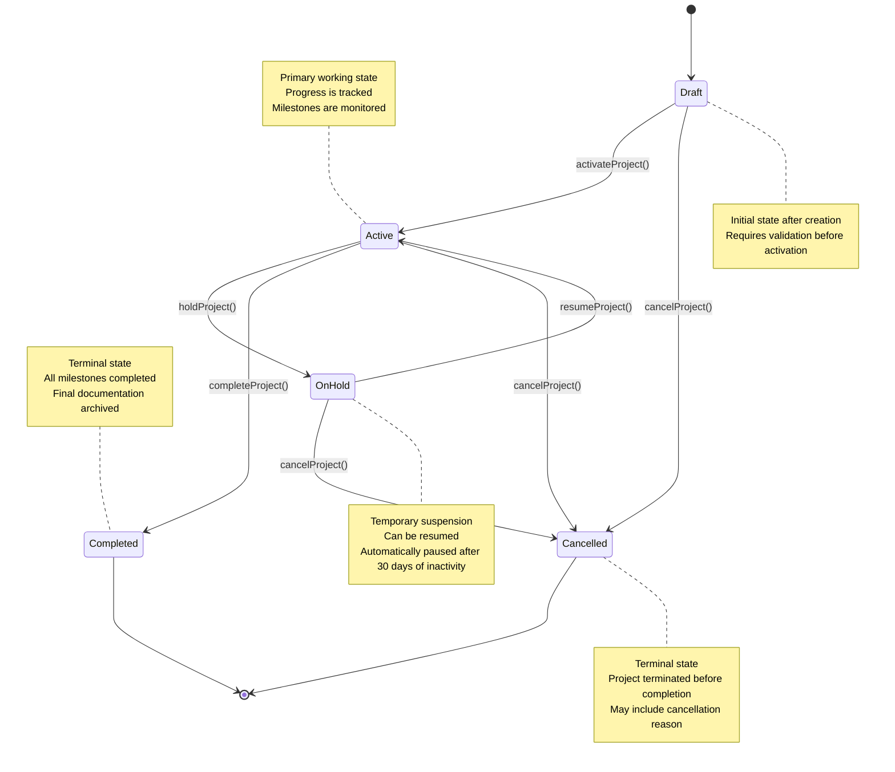
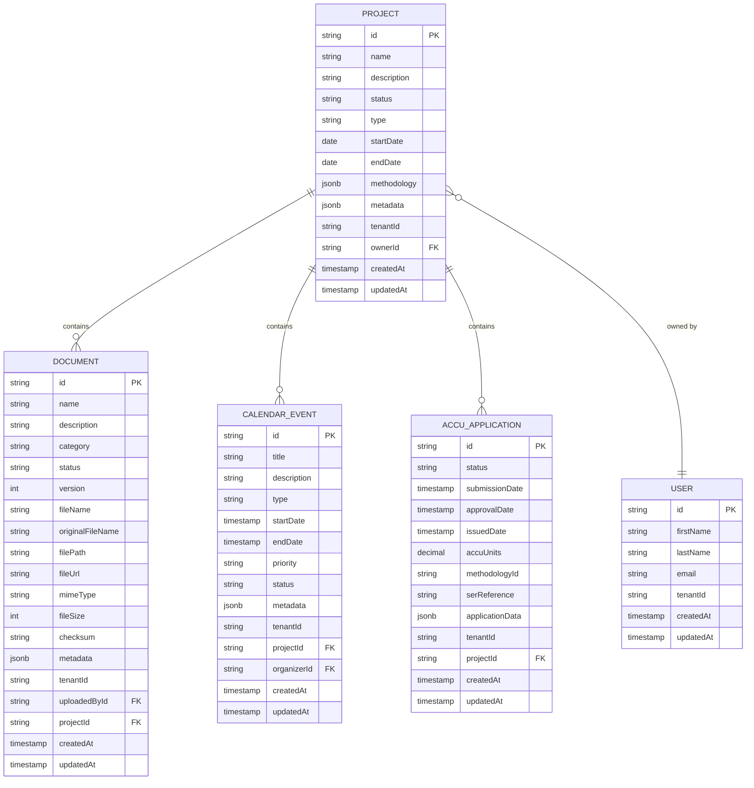
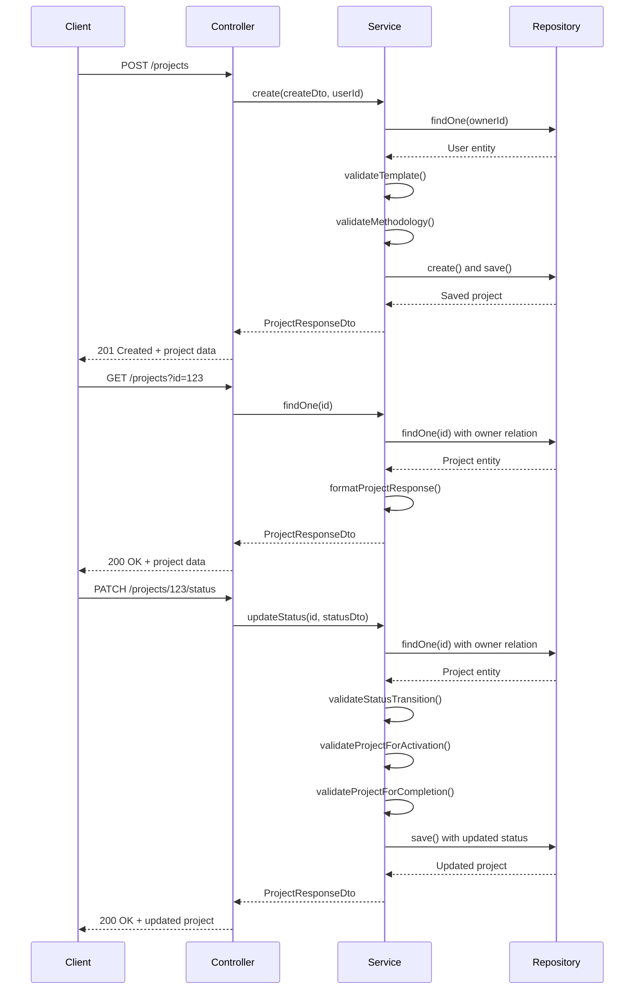
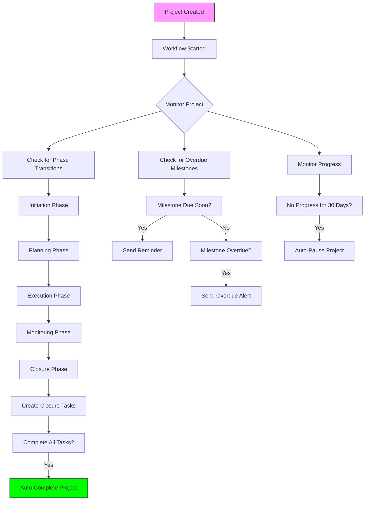

# Project Management

<cite>
**Referenced Files in This Document**   
- [projects.controller.ts](file://apps/backend/src/modules/projects/projects.controller.ts)
- [projects.service.ts](file://apps/backend/src/modules/projects/projects.service.ts)
- [project.dto.ts](file://apps/backend/src/modules/projects/dto/project.dto.ts)
- [project.entity.ts](file://apps/backend/src/entities/project.entity.ts)
- [project-workflows.ts](file://apps/backend/src/modules/temporal/workflows/project/project-workflows.ts)
- [accu-applications.service.ts](file://apps/backend/src/modules/accu/accu-applications.service.ts)
- [documents.service.ts](file://apps/backend/src/modules/documents/documents.service.ts)
- [accu-application.entity.ts](file://apps/backend/src/entities/accu-application.entity.ts)
- [document.entity.ts](file://apps/backend/src/entities/document.entity.ts)
</cite>

## Table of Contents
1. [Introduction](#introduction)
2. [Project Lifecycle Management](#project-lifecycle-management)
3. [Status Tracking and Transitions](#status-tracking-and-transitions)
4. [Methodology Integration](#methodology-integration)
5. [Domain Model](#domain-model)
6. [Service Layer Methods](#service-layer-methods)
7. [Controller Endpoints](#controller-endpoints)
8. [DTOs and Data Transfer](#dtos-and-data-transfer)
9. [Temporal Workflow Integration](#temporal-workflow-integration)
10. [Integration with ACCU Applications](#integration-with-accu-applications)
11. [Integration with Documents Module](#integration-with-documents-module)
12. [Common Issues and Solutions](#common-issues-and-solutions)

## Introduction
The Project Management module is a core component of the ACCU platform, providing comprehensive functionality for managing projects throughout their lifecycle. This module enables users to create, track, and manage projects with various types including audits, compliance initiatives, and research projects. The system integrates with other modules such as ACCU Applications and Documents, and leverages Temporal workflows for automated milestone tracking and project lifecycle management. This documentation provides detailed information about the implementation of the Project Management module, covering its domain model, service layer methods, controller endpoints, DTOs, and integration points.

## Project Lifecycle Management
The Project Management module implements a comprehensive lifecycle management system that guides projects from creation through completion or cancellation. Projects progress through several distinct states, each with specific business rules and validation requirements. The lifecycle begins with project creation in a draft state, allowing users to define project parameters before activation. Once activated, projects enter the active state where work is performed and progress is tracked. Projects can be temporarily paused (on hold) when work is suspended, and can later be resumed. The lifecycle concludes with either completion (successful conclusion) or cancellation (termination before completion).

The lifecycle is enforced through a combination of service layer validation and Temporal workflows. When a project is created, it is automatically assigned a draft status and associated with the creating user as the owner. Before a project can be activated, it must meet specific validation criteria including having a name, type, and start date. For audit-type projects, a methodology must also be defined. The system prevents invalid state transitions, such as attempting to complete a project that is still in draft status.

Temporal workflows enhance the lifecycle management by automating certain processes and enforcing business rules. The workflow monitors project progress and can automatically transition projects between phases based on predefined criteria. For example, a project automatically transitions from the planning phase to execution phase when the methodology is approved and milestones are defined. The workflow also implements timeout rules, such as automatically pausing a project after 30 days of inactivity, ensuring that stale projects do not remain in an active state indefinitely.

**Section sources**
- [projects.service.ts](file://apps/backend/src/modules/projects/projects.service.ts#L148-L215)
- [project-workflows.ts](file://apps/backend/src/modules/temporal/workflows/project/project-workflows.ts#L134-L663)
- [project.entity.ts](file://apps/backend/src/entities/project.entity.ts#L19-L25)

## Status Tracking and Transitions
The Project Management module implements a robust status tracking system with well-defined state transitions. Projects can exist in one of five statuses: draft, active, on hold, completed, or cancelled. Each status represents a distinct phase in the project lifecycle and has specific business rules governing transitions to other states. The system enforces these rules through validation in the service layer, preventing invalid transitions such as moving directly from draft to completed status.

The valid status transitions form a directed graph where:
- Draft projects can transition to active (activation) or cancelled (cancellation)
- Active projects can transition to on hold (pausing), completed (completion), or cancelled (cancellation)
- On hold projects can transition to active (resumption) or cancelled (cancellation)
- Completed and cancelled projects are terminal states with no outgoing transitions

These transition rules are implemented in the `validateStatusTransition` method of the `ProjectsService` class, which checks whether a requested status change is permitted based on the current status. The system also provides convenience endpoints for common operations such as activating, completing, putting on hold, and resuming projects, which internally call the status update method with the appropriate target status.

In addition to the basic status, the system tracks additional computed properties that provide insight into project state. These include boolean flags for common status checks (isActive, isCompleted, isOnHold, isDraft) and temporal properties such as days until deadline and overdue status. The system also maintains a status history in the project metadata, recording each status change with timestamps, reasons, and notes, providing an audit trail of project state evolution.



**Diagram sources**
- [projects.service.ts](file://apps/backend/src/modules/projects/projects.service.ts#L746-L758)
- [project.entity.ts](file://apps/backend/src/entities/project.entity.ts#L111-L126)
- [projects.controller.ts](file://apps/backend/src/modules/projects/projects.controller.ts#L378-L452)

## Methodology Integration
The Project Management module incorporates methodology integration as a core feature, allowing projects to be associated with specific methodologies that define their requirements and processes. Methodologies are structured objects containing an ID, name, version, optional URL, and requirements specific to the project type. The system validates methodology requirements based on the project type, ensuring that audit projects have verification requirements and compliance projects have reporting frequency requirements.

Methodologies can be applied to projects in several ways. When creating a project, users can either specify a methodology directly or use a template that includes a predefined methodology. If a template is used and no methodology is explicitly provided, the template's methodology is automatically applied to the project. This allows organizations to standardize methodologies across similar project types while still permitting customization when needed.

The integration with methodologies affects various aspects of project management. For audit-type projects, the methodology requirements influence validation rules, such as requiring verification for audit projects. The methodology information is stored in the project entity as a JSONB field, allowing flexible storage of methodology-specific data. This design enables the system to support multiple methodology frameworks without requiring schema changes for each new methodology.

```mermaid
classDiagram
class Project {
+string id
+string name
+ProjectStatus status
+ProjectType type
+Date startDate
+Date endDate
+Methodology methodology
+Record<string, any> metadata
+isActive() boolean
+isCompleted() boolean
+isOnHold() boolean
+isDraft() boolean
+getDurationInDays() number
}
class Methodology {
+string id
+string name
+string version
+string url
+Record<string, any> requirements
}
class ProjectTemplateDto {
+string id
+string name
+string description
+ProjectType type
+Methodology methodology
+Record<string, any> defaultSettings
+string[] requiredFields
+string[] optionalFields
+boolean isActive
+string version
+string[] tags
}
Project --> Methodology : "has"
ProjectTemplateDto --> Methodology : "defines"
note right of Methodology
Structured object containing methodology
specifications including ID, name, version,
URL, and type-specific requirements
end note
note left of Project
Projects reference methodologies which
define their requirements and processes.
Methodology validation occurs during
project creation and updates.
end note
```

**Diagram sources**
- [project.dto.ts](file://apps/backend/src/modules/projects/dto/project.dto.ts#L21-L47)
- [project.entity.ts](file://apps/backend/src/entities/project.entity.ts#L66-L71)
- [projects.service.ts](file://apps/backend/src/modules/projects/projects.service.ts#L724-L741)

## Domain Model
The domain model for the Project Management module centers around the Project entity, which represents a project with its core attributes and relationships. The Project entity includes fundamental properties such as name, description, status, type, start and end dates, and methodology information. It also contains metadata stored as JSONB for flexible, schema-less data storage, allowing for project-specific configuration and tracking information.

The Project entity establishes relationships with several other entities in the system. It has a many-to-one relationship with the User entity, representing the project owner. It also has one-to-many relationships with Document, CalendarEvent, AccuApplication, AccuInventoryItem, Audit, and Communication entities, reflecting the various artifacts and activities associated with a project. These relationships enable the system to aggregate project-related data from multiple sources and provide a comprehensive view of project information.

The domain model includes several enumerations that define valid values for key properties. ProjectStatus defines the five possible states a project can be in (draft, active, on hold, completed, cancelled), while ProjectType defines the categories of projects supported by the system (methodology, audit, compliance, research). These enumerations ensure data consistency and enable type-safe operations throughout the application.



**Diagram sources**
- [project.entity.ts](file://apps/backend/src/entities/project.entity.ts)
- [user.entity.ts](file://apps/backend/src/entities/user.entity.ts)
- [document.entity.ts](file://apps/backend/src/entities/document.entity.ts)
- [calendar-event.entity.ts](file://apps/backend/src/entities/calendar-event.entity.ts)
- [accu-application.entity.ts](file://apps/backend/src/entities/accu-application.entity.ts)

## Service Layer Methods
The ProjectsService class implements the core business logic for project management, exposing methods for creating, retrieving, updating, and deleting projects. The service layer follows a clean architecture pattern, with methods that validate input, enforce business rules, and interact with the database through TypeORM repositories. Each method returns DTOs (Data Transfer Objects) that shape the data for presentation to clients, ensuring that only relevant information is exposed.

Key methods in the service layer include:
- `create()`: Handles project creation with validation of owner, template application, and methodology requirements
- `findAll()`: Retrieves projects with pagination, filtering, and sorting options
- `findOne()`: Retrieves a specific project by ID
- `update()`: Updates project properties with validation of methodology requirements
- `updateStatus()`: Updates project status with workflow validation and status transition rules
- `getAnalytics()`: Calculates project metrics including duration, progress, and deadline status

The service layer also implements specialized methods for template management, collaborator management, and statistics. Template methods allow for the creation, retrieval, and modification of project templates that define standard configurations for specific project types. Collaborator methods manage the relationship between users and projects, allowing users to be added or removed as collaborators with specific roles and permissions. Statistics methods provide aggregated data about projects across the system, useful for dashboards and reporting.

**Section sources**
- [projects.service.ts](file://apps/backend/src/modules/projects/projects.service.ts)
- [project.dto.ts](file://apps/backend/src/modules/projects/dto/project.dto.ts)
- [project.entity.ts](file://apps/backend/src/entities/project.entity.ts)

## Controller Endpoints
The ProjectsController exposes a comprehensive REST API for project management, following RESTful conventions and leveraging NestJS decorators for routing, validation, and documentation. The controller implements standard CRUD operations (Create, Read, Update, Delete) along with specialized endpoints for common operations and complex queries. All endpoints are protected by authentication and authorization guards, ensuring that only authorized users can access project data.

The API endpoints include:
- `POST /projects`: Creates a new project in draft status
- `GET /projects`: Retrieves projects with pagination, filtering, and sorting
- `GET /projects/:id`: Retrieves a specific project by ID
- `PUT /projects/:id`: Updates a project's properties
- `PATCH /projects/:id/status`: Updates a project's status with validation
- `GET /projects/:id/status`: Retrieves detailed status information including allowed transitions
- `GET /projects/stats`: Retrieves project statistics and metrics
- `GET /projects/templates`: Retrieves project templates
- `POST /projects/templates`: Creates a new project template

The controller also provides convenience endpoints for common status transitions, such as `PATCH /projects/:id/activate`, `PATCH /projects/:id/complete`, `PATCH /projects/:id/hold`, and `PATCH /projects/:id/resume`. These endpoints provide a more intuitive API for clients by mapping common operations to descriptive URLs rather than requiring clients to understand the underlying status transition logic.



**Diagram sources**
- [projects.controller.ts](file://apps/backend/src/modules/projects/projects.controller.ts)
- [projects.service.ts](file://apps/backend/src/modules/projects/projects.service.ts)
- [project.entity.ts](file://apps/backend/src/entities/project.entity.ts)

## DTOs and Data Transfer
The Project Management module uses Data Transfer Objects (DTOs) extensively to define the structure of data transferred between the client and server. DTOs provide type safety, validation, and documentation through NestJS decorators, ensuring that data conforms to expected formats and constraints. The module defines several DTOs for different operations, each tailored to the specific requirements of the corresponding endpoint.

Key DTOs include:
- `ProjectCreateDto`: Defines the structure for creating a new project, with validation rules for required fields like name, type, and start date
- `ProjectUpdateDto`: Defines the structure for updating a project, with optional fields allowing partial updates
- `ProjectQueryDto`: Defines the structure for querying projects, including pagination, filtering, and sorting parameters
- `ProjectResponseDto`: Defines the structure for project responses, including computed properties like duration and status flags
- `ProjectTemplateDto`: Defines the structure for project templates, including default settings and required fields
- `ProjectAnalyticsDto`: Defines the structure for project analytics data, including metrics like progress and deadline status

The DTOs leverage class-validator decorators to enforce validation rules at the API boundary, preventing invalid data from reaching the service layer. For example, the `ProjectCreateDto` requires the name field to be a non-empty string with a maximum length of 255 characters, and the startDate field to be a valid date string. The use of DTOs also enables automatic Swagger documentation generation, providing clear API documentation for developers.

**Section sources**
- [project.dto.ts](file://apps/backend/src/modules/projects/dto/project.dto.ts)
- [projects.controller.ts](file://apps/backend/src/modules/projects/projects.controller.ts)
- [projects.service.ts](file://apps/backend/src/modules/projects/projects.service.ts)

## Temporal Workflow Integration
The Project Management module integrates with Temporal workflows to provide automated project milestone tracking and lifecycle management. The Temporal workflow, implemented in `ProjectWorkflow`, orchestrates various activities related to project management, including status updates, deadline creation, and notifications. The workflow maintains state for each project, tracking milestones, progress metrics, and history of actions.

The workflow is triggered when a project is created and continues to run for the duration of the project's lifecycle. It implements several key features:
- Automatic phase transitions based on project progress and time elapsed
- Milestone tracking with deadline reminders and overdue detection
- Progress monitoring with automatic pausing after 30 days of inactivity
- Closure phase automation with creation of final deliverables checklist
- History tracking of all workflow events and state changes

The workflow communicates with the main application through signals and queries. Signals allow the application to notify the workflow of external events, such as milestone completion or methodology approval, while queries allow the application to retrieve the current state of the workflow. This bidirectional communication enables tight integration between the workflow and the rest of the system, ensuring that project state is consistently synchronized.



**Diagram sources**
- [project-workflows.ts](file://apps/backend/src/modules/temporal/workflows/project/project-workflows.ts)
- [projects.service.ts](file://apps/backend/src/modules/projects/projects.service.ts)
- [projects.controller.ts](file://apps/backend/src/modules/projects/projects.controller.ts)

## Integration with ACCU Applications
The Project Management module integrates closely with the ACCU Applications module, establishing a parent-child relationship where ACCU applications are created within the context of a project. This integration enables the tracking of ACCU unit applications as deliverables of specific projects, particularly audit and compliance projects. The relationship is implemented through a one-to-many association from Project to AccuApplication, with the projectId serving as a foreign key in the ACCU application entity.

When creating an ACCU application, the system validates that the associated project exists and is in an appropriate state (not completed or cancelled). This prevents the creation of ACCU applications for projects that are no longer active. The integration also enables project-level analytics that include ACCU application metrics, such as the number of applications submitted and approved within a project.

The integration supports methodology alignment between projects and ACCU applications. When a project is created with a specific methodology, this methodology can be inherited by ACCU applications created within the project, ensuring consistency in approach and requirements. This alignment is particularly important for audit projects, where the methodology defines the verification requirements that must be met by ACCU applications.

**Section sources**
- [accu-applications.service.ts](file://apps/backend/src/modules/accu/accu-applications.service.ts#L69-L131)
- [accu-application.entity.ts](file://apps/backend/src/entities/accu-application.entity.ts)
- [project.entity.ts](file://apps/backend/src/entities/project.entity.ts)

## Integration with Documents Module
The Project Management module integrates with the Documents module to manage project-related documents, establishing a one-to-many relationship where projects can contain multiple documents. This integration enables the organization and tracking of all documentation associated with a project, including methodology documents, audit reports, compliance documentation, and evidence files. The relationship is implemented through a foreign key (projectId) in the Document entity that references the Project entity.

The integration provides several key features:
- Document upload and management within the context of a project
- Security scanning and content validation of uploaded documents
- Version control for document updates
- Access control based on project permissions
- Document categorization by type (methodology, audit report, compliance document, etc.)

The system enforces business rules related to document requirements for specific project types. For example, audit projects must have at least one document before they can be completed, ensuring that all necessary evidence is present. The integration also supports document templates that can be applied to projects, allowing organizations to standardize document requirements across similar project types.

**Section sources**
- [documents.service.ts](file://apps/backend/src/modules/documents/documents.service.ts#L72-L184)
- [document.entity.ts](file://apps/backend/src/entities/document.entity.ts)
- [project.entity.ts](file://apps/backend/src/entities/project.entity.ts)

## Common Issues and Solutions
The Project Management module addresses several common issues that arise in project management systems. One frequent issue is permission errors during project creation, which typically occur when users lack the necessary PROJECTS_WRITE permission or when attempting to assign ownership to a user who does not exist. The system handles this by validating the owner user ID against the user database and returning a clear error message when the user is not found.

Another common issue is incomplete project activation, where users attempt to activate projects that do not meet the minimum requirements. The system prevents this by validating that projects have a name, type, and start date before activation, and for audit projects, that a methodology is defined. The API provides a status endpoint that returns information about which transitions are allowed, helping clients understand why a particular action is not permitted.

Data consistency issues are addressed through the use of database transactions and validation rules. For example, when updating a project's status, the system validates the transition against the allowed transitions matrix before making any changes. The integration with Temporal workflows further enhances data consistency by ensuring that automated processes follow the same business rules as manual operations.

For performance considerations, the system implements pagination for project queries and uses database indexing on frequently queried fields such as status, type, and projectId. The service layer also employs efficient querying patterns, using TypeORM's query builder to retrieve only the necessary data and relations, reducing database load and improving response times.

**Section sources**
- [projects.service.ts](file://apps/backend/src/modules/projects/projects.service.ts#L152-L169)
- [projects.service.ts](file://apps/backend/src/modules/projects/projects.service.ts#L763-L771)
- [projects.controller.ts](file://apps/backend/src/modules/projects/projects.controller.ts#L222-L247)
- [projects.service.ts](file://apps/backend/src/modules/projects/projects.service.ts#L238-L307)