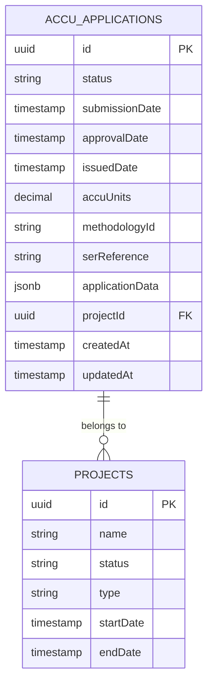
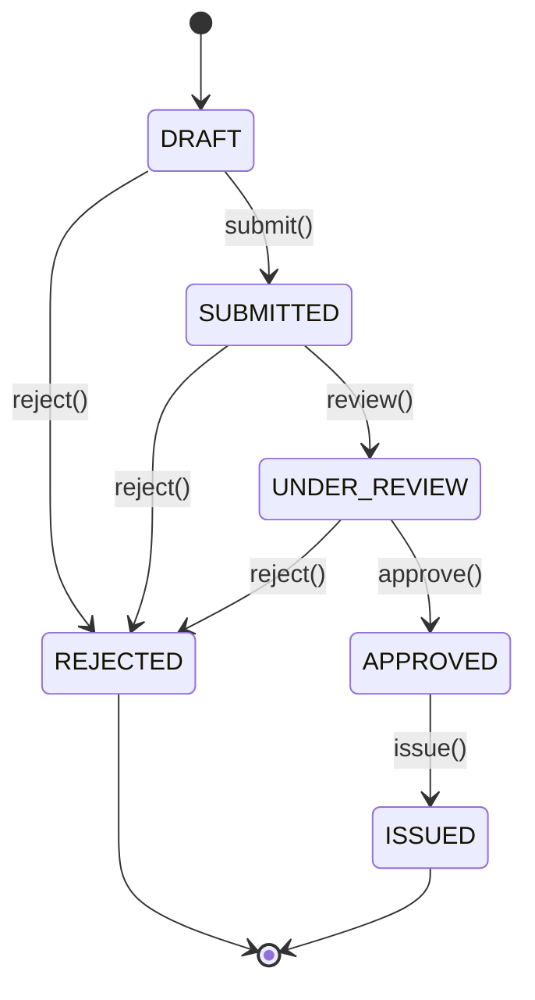
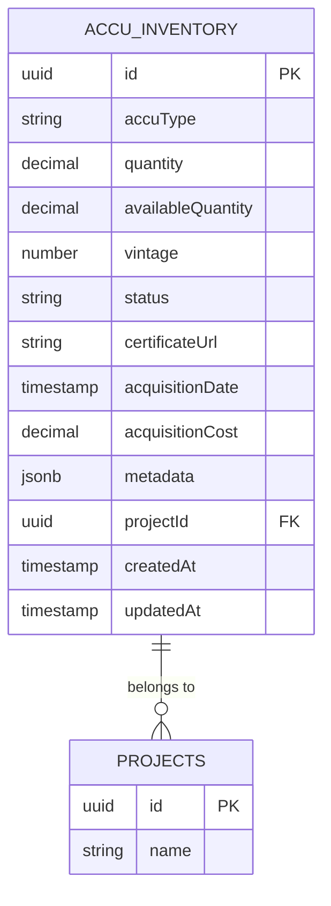
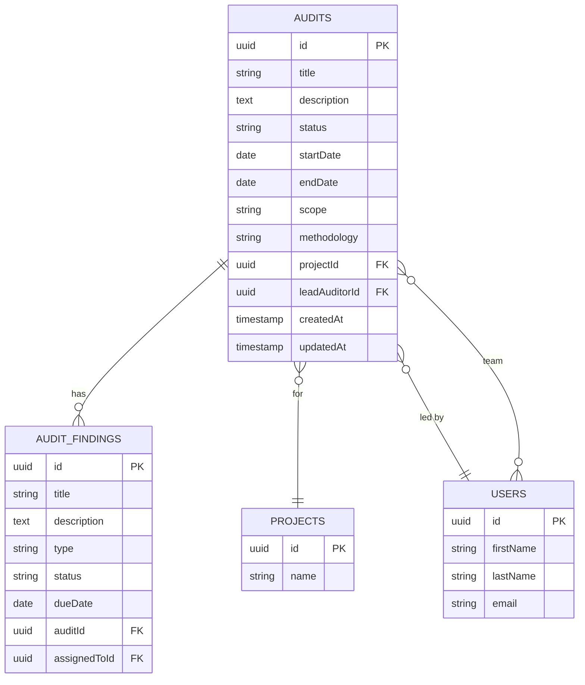
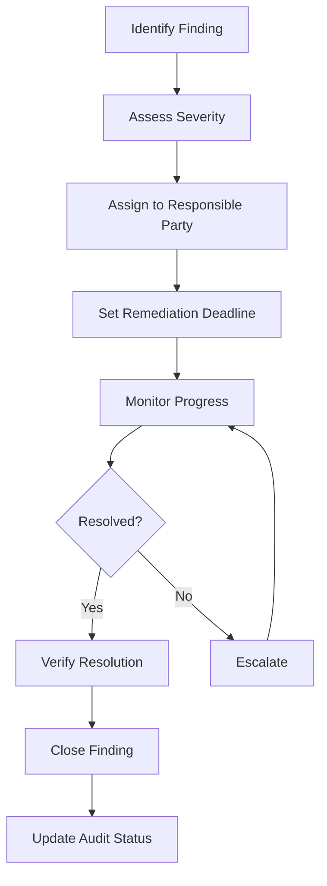
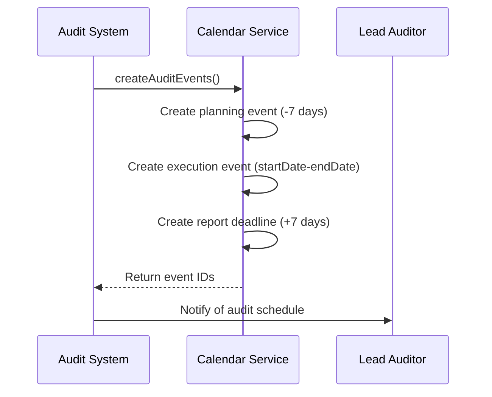
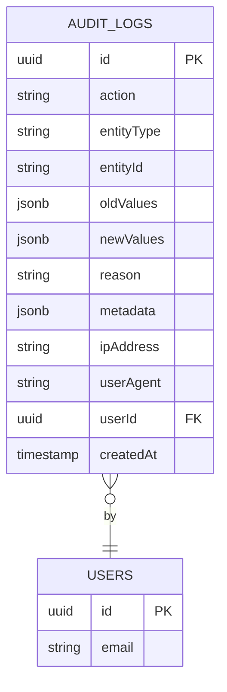

# ACCU Application and Audit Models

<cite>
**Referenced Files in This Document**   
- [accu-application.entity.ts](file://apps/backend/src/entities/accu-application.entity.ts)
- [accu-inventory-item.entity.ts](file://apps/backend/src/entities/accu-inventory-item.entity.ts)
- [audit.entity.ts](file://apps/backend/src/entities/audit.entity.ts)
- [audit-finding.entity.ts](file://apps/backend/src/entities/audit-finding.entity.ts)
- [audit-log.entity.ts](file://apps/backend/src/entities/audit-log.entity.ts)
- [project.entity.ts](file://apps/backend/src/entities/project.entity.ts)
- [user.entity.ts](file://apps/backend/src/entities/user.entity.ts)
- [accu-application.dto.ts](file://apps/backend/src/modules/accu/dto/accu-application.dto.ts)
- [accu-applications.service.ts](file://apps/backend/src/modules/accu/accu-applications.service.ts)
- [accu-applications.controller.ts](file://apps/backend/src/modules/accu/accu-applications.controller.ts)
- [calendar.service.ts](file://apps/backend/src/modules/calendar/calendar.service.ts)
</cite>

## Table of Contents
1. [Introduction](#introduction)
2. [ACCU Application Data Model](#accu-application-data-model)
3. [ACCU Application Lifecycle](#accu-application-lifecycle)
4. [ACCU Inventory Management](#accu-inventory-management)
5. [Audit Data Model](#audit-data-model)
6. [Audit Findings and Remediation](#audit-findings-and-remediation)
7. [Audit Scheduling and Calendar Integration](#audit-scheduling-and-calendar-integration)
8. [Data Access and Compliance Reporting](#data-access-and-compliance-reporting)
9. [Performance Considerations](#performance-considerations)
10. [Regulatory Requirements](#regulatory-requirements)
11. [Conclusion](#conclusion)

## Introduction
This document provides comprehensive documentation for the ACCU Application and Audit data models within the ACCU platform. The system is designed to manage carbon credit applications (ACCU) and audit processes with robust data integrity, compliance tracking, and integration capabilities. The ACCU application model handles the lifecycle of carbon credit applications from draft to issuance, while the audit model manages compliance audits with detailed findings and remediation tracking. Both models are integrated with projects and users, supporting multi-tenancy and regulatory requirements for data retention and immutability.

**Section sources**
- [accu-application.entity.ts](file://apps/backend/src/entities/accu-application.entity.ts)
- [audit.entity.ts](file://apps/backend/src/entities/audit.entity.ts)

## ACCU Application Data Model

The ACCU application entity represents a carbon credit application within the system, capturing all necessary data for processing, review, and approval. The model is designed with comprehensive fields to support the entire application lifecycle, integration with projects, and regulatory compliance.

**Diagram sources**
- [accu-application.entity.ts](file://apps/backend/src/entities/accu-application.entity.ts)
- [project.entity.ts](file://apps/backend/src/entities/project.entity.ts)

### Core Attributes
The ACCU application entity contains several key attributes that define its state and data:

- **id**: Primary key (UUID) uniquely identifying the application
- **status**: Current state of the application (enum: draft, submitted, under_review, approved, rejected, issued)
- **accuUnits**: Number of ACCU units requested (decimal with precision 15, scale 2)
- **methodologyId**: Reference to the carbon credit methodology used
- **serReference**: SER (Scientific and Economic Review) reference number
- **applicationData**: JSONB field storing structured application data including project description, location, baseline emissions, and activities
- **projectId**: Foreign key linking to the associated project
- **tenantId**: Identifier for multi-tenancy support
- **createdAt/updatedAt**: Timestamps for record creation and modification

### Integration with Projects
Each ACCU application is associated with a project through a many-to-one relationship. The project entity serves as the container for the application, providing context and ownership. The integration ensures that applications inherit tenant context from their parent project and maintains referential integrity through foreign key constraints.

**Section sources**
- [accu-application.entity.ts](file://apps/backend/src/entities/accu-application.entity.ts)
- [project.entity.ts](file://apps/backend/src/entities/project.entity.ts)

## ACCU Application Lifecycle

The ACCU application follows a well-defined state machine with specific transitions between states. The lifecycle ensures proper workflow progression from creation to final disposition, with appropriate validation and business rules applied at each transition.

**Diagram sources**
- [accu-application.entity.ts](file://apps/backend/src/entities/accu-application.entity.ts)
- [accu-applications.service.ts](file://apps/backend/src/modules/accu/accu-applications.service.ts)

### State Transitions
The application lifecycle enforces strict state transitions to maintain data integrity and compliance:

- **DRAFT → SUBMITTED**: When an application is submitted for review
- **DRAFT → REJECTED**: When a draft application is rejected (typically for cancellation)
- **SUBMITTED → UNDER_REVIEW**: When the application enters the review phase
- **SUBMITTED → REJECTED**: When a submitted application fails review
- **UNDER_REVIEW → APPROVED**: When the application passes review
- **UNDER_REVIEW → REJECTED**: When the application fails review
- **APPROVED → ISSUED**: When ACCU units are issued for an approved application

### Lifecycle Management
The system enforces business rules during state transitions:

- Only draft applications can be updated
- Only submitted or under review applications can be approved/rejected
- Only approved applications can be issued
- Applications in rejected or issued states are terminal and cannot transition further
- Status changes automatically update relevant timestamps (submissionDate, approvalDate, issuedDate)

**Section sources**
- [accu-application.entity.ts](file://apps/backend/src/entities/accu-application.entity.ts)
- [accu-applications.service.ts](file://apps/backend/src/modules/accu/accu-applications.service.ts)

## ACCU Inventory Management

The ACCU inventory system tracks issued ACCU units through the accu-inventory-item entity. This model enables detailed tracking of carbon credits from issuance through retirement, supporting trading and compliance reporting.

**Diagram sources**
- [accu-inventory-item.entity.ts](file://apps/backend/src/entities/accu-inventory-item.entity.ts)
- [project.entity.ts](file://apps/backend/src/entities/project.entity.ts)

### Inventory States
The inventory items can exist in several states:

- **HELD**: Units are held in inventory, available for use
- **TRADED**: Units have been traded to another party
- **RETIRED**: Units have been retired for compliance purposes
- **RESERVED**: Units are reserved for specific purposes

### Unit Tracking
The inventory model supports comprehensive tracking of ACCU units:

- **quantity**: Total number of units in the inventory item
- **availableQuantity**: Number of units available for use (may be less than total due to reservations)
- **vintage**: Year of issuance for the units
- **acquisitionDate**: Date when the units were acquired
- **acquisitionCost**: Cost basis for the units
- **certificateUrl**: Link to the official certificate documentation
- **metadata**: Additional structured data about the inventory item

**Section sources**
- [accu-inventory-item.entity.ts](file://apps/backend/src/entities/accu-inventory-item.entity.ts)

## Audit Data Model

The audit entity represents a compliance audit within the system, capturing all relevant information about the audit scope, team, and execution. The model is designed to support comprehensive audit management with integration to projects and users.

**Diagram sources**
- [audit.entity.ts](file://apps/backend/src/entities/audit.entity.ts)
- [audit-finding.entity.ts](file://apps/backend/src/entities/audit-finding.entity.ts)
- [project.entity.ts](file://apps/backend/src/entities/project.entity.ts)
- [user.entity.ts](file://apps/backend/src/entities/user.entity.ts)

### Core Audit Attributes
The audit entity contains essential information for managing the audit process:

- **id**: Primary key (UUID) uniquely identifying the audit
- **title**: Descriptive title of the audit
- **description**: Detailed description of the audit scope and objectives
- **status**: Current state of the audit (planned, in_progress, completed, cancelled)
- **startDate/endDate**: Scheduled dates for the audit execution
- **scope**: Description of the audit scope
- **methodology**: Audit methodology being applied
- **projectId**: Foreign key linking to the audited project
- **leadAuditorId**: Foreign key linking to the lead auditor (User)
- **auditTeam**: Many-to-many relationship with users participating in the audit team

**Section sources**
- [audit.entity.ts](file://apps/backend/src/entities/audit.entity.ts)

## Audit Findings and Remediation

Audit findings represent specific observations or issues identified during an audit. The findings model supports detailed tracking of issues, their severity, and remediation progress.

### Finding Attributes
The audit-finding entity captures comprehensive information about each finding:

- **id**: Primary key (UUID) uniquely identifying the finding
- **title**: Brief title summarizing the finding
- **description**: Detailed description of the finding
- **type**: Severity level of the finding (observation, minor, major, critical)
- **status**: Current status of the finding (mirrors type enum, with closed state)
- **evidence**: Supporting evidence or documentation for the finding
- **dueDate**: Deadline for remediation
- **auditId**: Foreign key linking to the parent audit
- **assignedToId**: Foreign key linking to the user responsible for remediation

### Severity Levels
The system defines a hierarchy of severity levels for audit findings:

- **OBSERVATION**: Notable observations that don't represent compliance issues
- **MINOR**: Minor non-conformities with limited impact
- **MAJOR**: Major non-conformities with significant impact
- **CRITICAL**: Critical issues that could invalidate the audit or represent severe compliance failures
- **CLOSED**: Status indicating the finding has been resolved

### Remediation Tracking
The findings model supports remediation tracking through:

- Assignment to specific users for resolution
- Due dates for remediation actions
- Status tracking from identification to closure
- Evidence documentation to support resolution
- Integration with the audit lifecycle to ensure all findings are addressed before audit completion

**Diagram sources**
- [audit-finding.entity.ts](file://apps/backend/src/entities/audit-finding.entity.ts)
- [audit.entity.ts](file://apps/backend/src/entities/audit.entity.ts)

**Section sources**
- [audit-finding.entity.ts](file://apps/backend/src/entities/audit-finding.entity.ts)

## Audit Scheduling and Calendar Integration

The system integrates audit management with calendar functionality to ensure proper scheduling and deadline tracking. This integration creates automated calendar events for key audit milestones.

### Scheduling Rules
The audit scheduling system enforces the following rules:

- **Planning Deadline**: Created 7 days before the audit start date
- **Execution Period**: Calendar event spanning the audit startDate to endDate
- **Report Deadline**: Created 7 days after the audit end date
- All events are assigned to the lead auditor
- Critical priority is assigned to audit execution and report deadline events
- Reminders are configured based on event priority

### Calendar Event Creation
When an audit is created or updated, the system automatically generates the following calendar events:

1. **Audit Planning**: Due 7 days before audit start
2. **Audit Execution**: Spanning the audit period
3. **Audit Report Due**: Due 7 days after audit completion

**Diagram sources**
- [calendar.service.ts](file://apps/backend/src/modules/calendar/calendar.service.ts)
- [audit.entity.ts](file://apps/backend/src/entities/audit.entity.ts)

**Section sources**
- [calendar.service.ts](file://apps/backend/src/modules/calendar/calendar.service.ts)

## Data Access and Compliance Reporting

The system provides comprehensive data access patterns for compliance reporting and audit trail generation. These patterns support both real-time queries and historical analysis.

### Query Patterns
The ACCU application service implements optimized query patterns for common reporting needs:

- **List Applications**: Paginated retrieval with filtering by status, project, methodology, and date ranges
- **Application Dashboard**: Aggregated statistics including total applications, status distribution, processing times, and success rates
- **Application Analytics**: Detailed metrics for individual applications including progress, document completion, and estimated processing time
- **Status History**: Complete audit trail of status changes with reasons and timestamps

### Foreign Key Relationships
The data model establishes critical foreign key relationships:

- **ACCU Applications → Projects**: Each application belongs to a single project
- **Audits → Projects**: Each audit is conducted on a specific project
- **Audits → Users**: Each audit has a lead auditor and team members
- **Audit Findings → Audits**: Each finding belongs to a specific audit
- **Audit Findings → Users**: Findings can be assigned to specific users for remediation

### Constraints
The system enforces several data integrity constraints:

- **Unique Application Numbers**: While not explicitly implemented as a database constraint, the business logic prevents duplicate draft applications for the same project
- **Audit Scheduling Rules**: The calendar integration enforces standard scheduling rules for audit events
- **Referential Integrity**: Foreign key constraints ensure valid relationships between entities
- **Status Validation**: Enum constraints ensure only valid status values are stored

**Section sources**
- [accu-applications.service.ts](file://apps/backend/src/modules/accu/accu-applications.service.ts)
- [accu-application.dto.ts](file://apps/backend/src/modules/accu/dto/accu-application.dto.ts)
- [audit.entity.ts](file://apps/backend/src/entities/audit.entity.ts)

## Performance Considerations

The system incorporates several performance optimizations for querying historical ACCU data and maintaining data integrity during state transitions.

### Query Optimization
The data model includes database indexes to optimize common query patterns:

- **ACCU Applications**: Indexes on status and projectId for efficient filtering
- **Audit Logs**: Composite index on entityType and entityId, plus indexes on userId, action, and createdAt for fast audit trail queries
- **Audit Findings**: Implicit index through foreign key relationship with audit

### Historical Data Queries
For querying historical ACCU data, the system employs:

- **Pagination**: All list endpoints support pagination to prevent excessive data transfer
- **Filtering**: Comprehensive filtering options by status, dates, project, and methodology
- **Aggregation**: Pre-computed statistics endpoints for dashboard and reporting needs
- **Caching**: Strategic caching of frequently accessed data (not shown in code but implied by architecture)

### State Transition Performance
During state transitions, the system maintains data integrity through:

- **Transaction Management**: Database transactions ensure atomic updates
- **Validation**: Pre-transition validation prevents invalid state changes
- **Event Logging**: Status changes are logged in both the application metadata and audit logs
- **Notification System**: Asynchronous notifications prevent blocking the main transaction

**Section sources**
- [accu-application.entity.ts](file://apps/backend/src/entities/accu-application.entity.ts)
- [audit-log.entity.ts](file://apps/backend/src/entities/audit-log.entity.ts)
- [accu-applications.service.ts](file://apps/backend/src/modules/accu/accu-applications.service.ts)

## Regulatory Requirements

The system addresses regulatory requirements for data retention and immutability of audit logs through several design patterns and implementation choices.

### Data Retention
The data model supports regulatory data retention requirements through:

- **Timestamps**: Creation and update timestamps on all entities
- **Audit Logs**: Comprehensive audit trail capturing all significant actions
- **Metadata Preservation**: Status history and change reasons preserved in application metadata
- **Soft Deletes**: Deletion is implemented as status change rather than physical removal

### Audit Log Immutability
The audit log entity is designed to ensure immutability:

- **Minimal Update Capability**: Only creation timestamp is automatically set; no update timestamp
- **Comprehensive Context**: Each log entry captures action, entity type, entity ID, user, IP address, and user agent
- **Change Tracking**: oldValues and newValues fields capture data changes
- **Indexed for Performance**: Multiple indexes support fast retrieval of audit trails

### Compliance Features
Additional compliance features include:

- **Multi-tenancy Support**: tenantId fields enable data segregation for different organizations
- **Role-Based Access Control**: Integration with roles and permissions system
- **Data Encryption**: While not visible in entity models, the architecture supports encryption at rest
- **Immutable Timestamps**: CreateDateColumn ensures creation timestamps cannot be modified

**Diagram sources**
- [audit-log.entity.ts](file://apps/backend/src/entities/audit-log.entity.ts)
- [user.entity.ts](file://apps/backend/src/entities/user.entity.ts)

**Section sources**
- [audit-log.entity.ts](file://apps/backend/src/entities/audit-log.entity.ts)

## Conclusion
The ACCU Application and Audit models provide a comprehensive foundation for managing carbon credit applications and compliance audits. The data models are designed with careful attention to business requirements, regulatory compliance, and performance considerations. Key strengths include well-defined state machines for application and audit lifecycles, robust integration with projects and users, comprehensive audit trail capabilities, and optimized data access patterns for reporting. The system balances flexibility with data integrity, supporting the complex workflows required for carbon credit management while ensuring compliance with regulatory requirements for data retention and immutability.