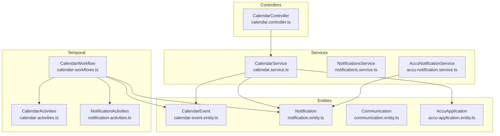
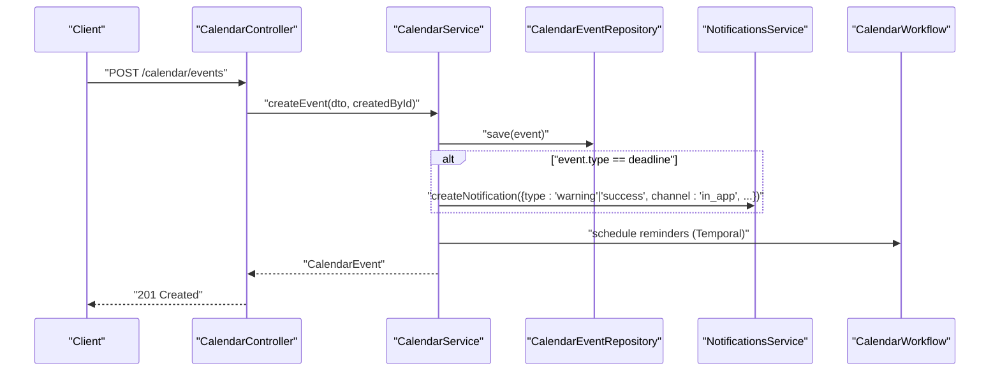
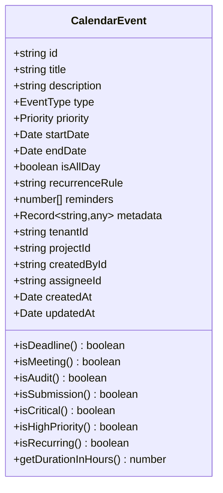
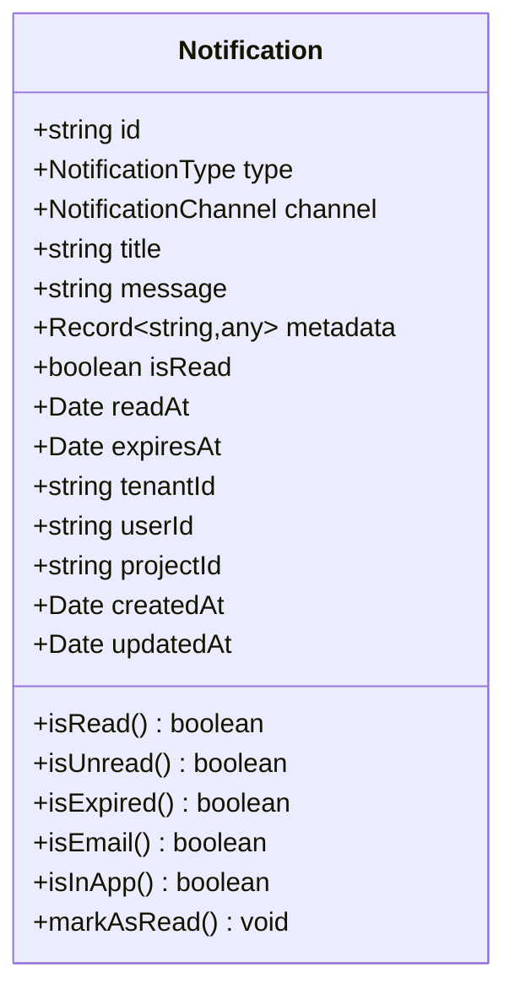
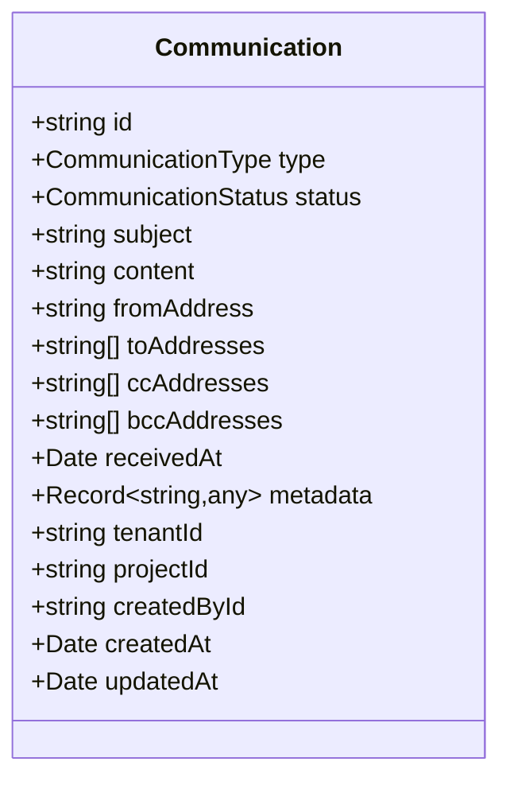
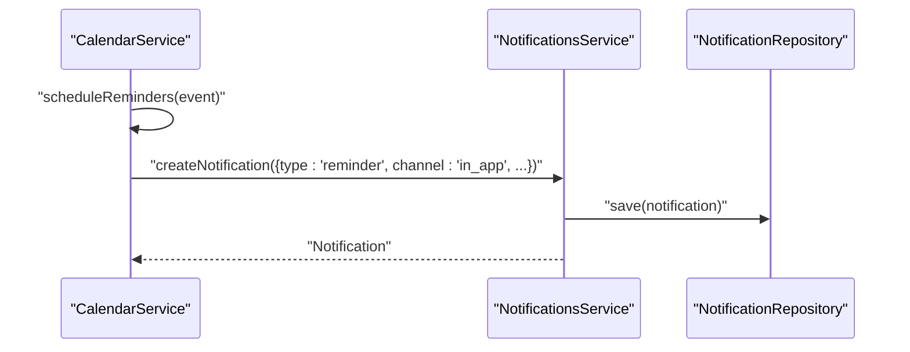
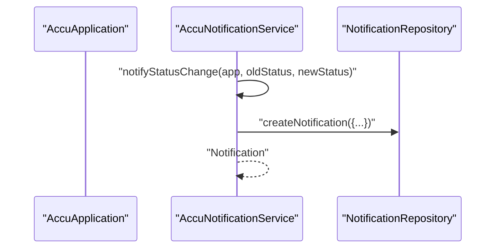
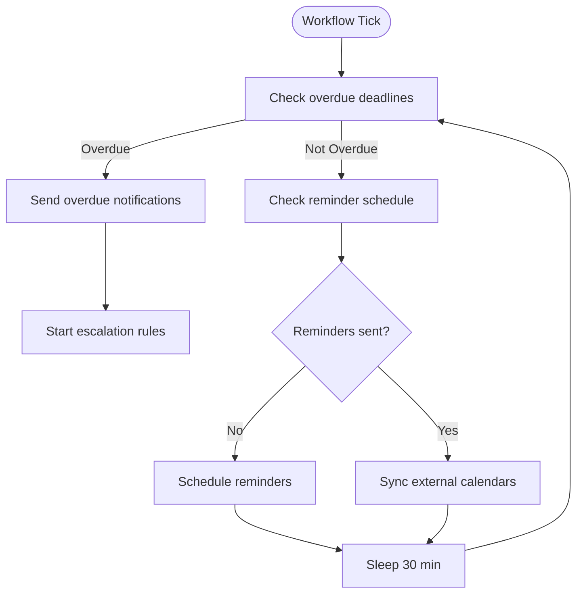
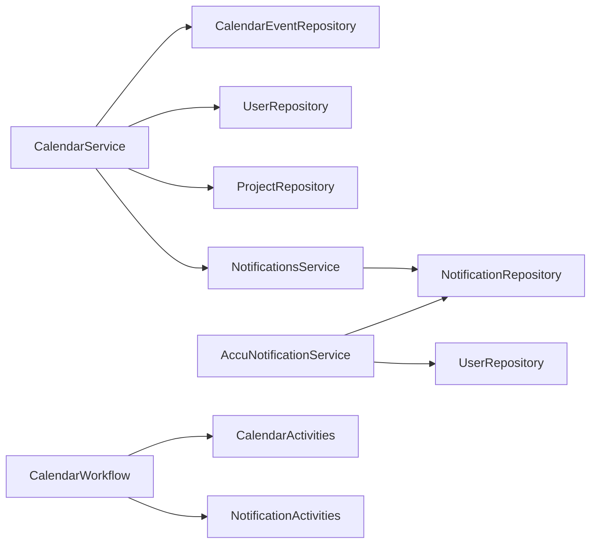

# Calendar and Notification Models

<cite>
**Referenced Files in This Document**
- [calendar-event.entity.ts](file://apps/backend/src/entities/calendar-event.entity.ts)
- [notification.entity.ts](file://apps/backend/src/entities/notification.entity.ts)
- [communication.entity.ts](file://apps/backend/src/entities/communication.entity.ts)
- [accu-application.entity.ts](file://apps/backend/src/entities/accu-application.entity.ts)
- [calendar.service.ts](file://apps/backend/src/modules/calendar/calendar.service.ts)
- [notifications.service.ts](file://apps/backend/src/modules/notifications/notifications.service.ts)
- [accu-notification.service.ts](file://apps/backend/src/modules/accu/accu-notification.service.ts)
- [calendar.controller.ts](file://apps/backend/src/modules/calendar/calendar.controller.ts)
- [calendar-event.dto.ts](file://apps/backend/src/modules/calendar/dto/calendar-event.dto.ts)
- [calendar-workflows.ts](file://apps/backend/src/modules/temporal/workflows/calendar/calendar-workflows.ts)
- [calendar-activities.ts](file://apps/backend/src/modules/temporal/activities/calendar-activities.ts)
- [notification-activities.ts](file://apps/backend/src/modules/temporal/activities/notification-activities.ts)
</cite>

## Table of Contents
1. [Introduction](#introduction)
2. [Project Structure](#project-structure)
3. [Core Components](#core-components)
4. [Architecture Overview](#architecture-overview)
5. [Detailed Component Analysis](#detailed-component-analysis)
6. [Dependency Analysis](#dependency-analysis)
7. [Performance Considerations](#performance-considerations)
8. [Troubleshooting Guide](#troubleshooting-guide)
9. [Conclusion](#conclusion)
10. [Appendices](#appendices)

## Introduction
This document explains the CalendarEvent, Notification, and Communication entities and how they collaborate to manage deadlines, milestones, reminders, and notifications. It covers:
- How CalendarEvent tracks deadlines, milestones, and reminders with start/end times and recurrence patterns
- Notification types, delivery channels, read status, and user preferences
- Communication’s role in message threading and delivery tracking
- Relationships such as notifications triggered by calendar events or ACCU application status changes
- Indexing strategies for time-based queries and notification delivery performance
- Data validation rules for event scheduling and message content
- Data access patterns for dashboards and daily briefings
- Scaling real-time notification delivery and handling delivery failures
- Guidance on implementing the 90-day rule compliance through these models

## Project Structure
The relevant models and services are organized under the backend module:
- Entities: calendar-event.entity.ts, notification.entity.ts, communication.entity.ts, accu-application.entity.ts
- Services: calendar.service.ts, notifications.service.ts, accu-notification.service.ts
- Controllers: calendar.controller.ts
- DTOs: calendar-event.dto.ts
- Temporal workflows and activities: calendar-workflows.ts, calendar-activities.ts, notification-activities.ts

**Diagram sources**
- [calendar-event.entity.ts](file://apps/backend/src/entities/calendar-event.entity.ts#L1-L137)
- [notification.entity.ts](file://apps/backend/src/entities/notification.entity.ts#L1-L114)
- [communication.entity.ts](file://apps/backend/src/entities/communication.entity.ts#L1-L97)
- [accu-application.entity.ts](file://apps/backend/src/entities/accu-application.entity.ts#L1-L86)
- [calendar.service.ts](file://apps/backend/src/modules/calendar/calendar.service.ts#L1-L800)
- [notifications.service.ts](file://apps/backend/src/modules/notifications/notifications.service.ts#L1-L125)
- [accu-notification.service.ts](file://apps/backend/src/modules/accu/accu-notification.service.ts#L1-L362)
- [calendar.controller.ts](file://apps/backend/src/modules/calendar/calendar.controller.ts#L1-L563)
- [calendar-workflows.ts](file://apps/backend/src/modules/temporal/workflows/calendar/calendar-workflows.ts#L1-L817)
- [calendar-activities.ts](file://apps/backend/src/modules/temporal/activities/calendar-activities.ts#L1-L23)
- [notification-activities.ts](file://apps/backend/src/modules/temporal/activities/notification-activities.ts#L1-L19)

**Section sources**
- [calendar-event.entity.ts](file://apps/backend/src/entities/calendar-event.entity.ts#L1-L137)
- [notification.entity.ts](file://apps/backend/src/entities/notification.entity.ts#L1-L114)
- [communication.entity.ts](file://apps/backend/src/entities/communication.entity.ts#L1-L97)
- [calendar.service.ts](file://apps/backend/src/modules/calendar/calendar.service.ts#L1-L800)
- [notifications.service.ts](file://apps/backend/src/modules/notifications/notifications.service.ts#L1-L125)
- [accu-notification.service.ts](file://apps/backend/src/modules/accu/accu-notification.service.ts#L1-L362)
- [calendar.controller.ts](file://apps/backend/src/modules/calendar/calendar.controller.ts#L1-L563)
- [calendar-workflows.ts](file://apps/backend/src/modules/temporal/workflows/calendar/calendar-workflows.ts#L1-L817)
- [calendar-activities.ts](file://apps/backend/src/modules/temporal/activities/calendar-activities.ts#L1-L23)
- [notification-activities.ts](file://apps/backend/src/modules/temporal/activities/notification-activities.ts#L1-L19)

## Core Components
- CalendarEvent: Represents deadlines, meetings, audits, reviews, submissions, reminders, and custom events. Supports start/end times, all-day flag, recurrence rule, reminders array, priority, and metadata. Provides helpers for type/priority checks and duration calculation.
- Notification: Represents in-app, email, SMS, and webhook notifications with type, channel, read status, expiration, and metadata. Provides helpers for channel checks and read state.
- Communication: Represents inbound/outbound messages (email, phone, meeting, letter, CER notice) with status, recipients, timestamps, attachments, and metadata. Supports threading via project and creator links.
- AccuApplication: Tracks lifecycle statuses (draft, submitted, under review, approved, rejected, issued) with timestamps and application data, enabling ACCU-related notifications.

Key relationships:
- CalendarEvent belongs to a Project and User (createdBy/assignee), and stores tenantId for multi-tenancy.
- Notification belongs to a User and Project, with optional tenantId.
- Communication belongs to a Project and User (createdBy), with optional tenantId.
- AccuApplication belongs to a Project and tracks status transitions.

**Section sources**
- [calendar-event.entity.ts](file://apps/backend/src/entities/calendar-event.entity.ts#L1-L137)
- [notification.entity.ts](file://apps/backend/src/entities/notification.entity.ts#L1-L114)
- [communication.entity.ts](file://apps/backend/src/entities/communication.entity.ts#L1-L97)
- [accu-application.entity.ts](file://apps/backend/src/entities/accu-application.entity.ts#L1-L86)

## Architecture Overview
The system integrates calendar-driven deadlines with notification delivery and optional external calendar sync via Temporal workflows. Controllers orchestrate requests, services encapsulate business logic, and entities define persistence and relationships.

**Diagram sources**
- [calendar.controller.ts](file://apps/backend/src/modules/calendar/calendar.controller.ts#L46-L65)
- [calendar.service.ts](file://apps/backend/src/modules/calendar/calendar.service.ts#L41-L110)
- [notifications.service.ts](file://apps/backend/src/modules/notifications/notifications.service.ts#L27-L40)
- [calendar-workflows.ts](file://apps/backend/src/modules/temporal/workflows/calendar/calendar-workflows.ts#L626-L753)

## Detailed Component Analysis

### CalendarEvent Model
- Fields and semantics:
  - title, description, type (deadline/meeting/audit/review/submission/reminder/custom), priority (low/medium/high/critical)
  - startDate, endDate, isAllDay, recurrenceRule (RFC 5545 RRULE format), reminders (days before)
  - metadata (arbitrary JSON), tenantId, projectId, createdById, assigneeId
  - relations to Project and User (createdBy, assignee)
- Helpers:
  - Type checks (isDeadline, isMeeting, isAudit, isSubmission)
  - Priority checks (isCritical, isHighPriority)
  - Recurrence detection (isRecurring)
  - Duration calculation (getDurationInHours)
- Indexes:
  - Composite: type+priority, projectId, startDate
- Validation:
  - DTO enforces presence and types for required fields, UUIDs for project/assignee/creator, arrays for reminders, and optional recurrenceRule.

**Diagram sources**
- [calendar-event.entity.ts](file://apps/backend/src/entities/calendar-event.entity.ts#L1-L137)

**Section sources**
- [calendar-event.entity.ts](file://apps/backend/src/entities/calendar-event.entity.ts#L1-L137)
- [calendar-event.dto.ts](file://apps/backend/src/modules/calendar/dto/calendar-event.dto.ts#L1-L70)

### Notification Model
- Fields and semantics:
  - type (info/warning/error/success/reminder), channel (in_app/email/sms/webhook)
  - title, message, metadata, isRead, readAt, expiresAt, tenantId
  - userId, projectId
  - relations to User and Project
- Helpers:
  - Channel checks (isEmail, isInApp)
  - Read state (isRead, isUnread, isExpired)
  - Mark as read (markAsRead)
- Indexes:
  - userId, type+channel, isRead

**Diagram sources**
- [notification.entity.ts](file://apps/backend/src/entities/notification.entity.ts#L1-L114)

**Section sources**
- [notification.entity.ts](file://apps/backend/src/entities/notification.entity.ts#L1-L114)
- [notifications.service.ts](file://apps/backend/src/modules/notifications/notifications.service.ts#L1-L125)

### Communication Model
- Fields and semantics:
  - type (email/phone/meeting/letter/cer_notice), status (received/read/replied/action_required/archived)
  - subject, content, fromAddress, toAddresses/ccAddresses/bccAddresses
  - receivedAt, attachments (filename/url/size), metadata, tenantId
  - projectId, createdById
  - relations to Project and User (createdBy)
- Threading and tracking:
  - Status progression supports message lifecycle
  - Metadata can carry thread identifiers or external IDs
  - Attachments enable document linkage

**Diagram sources**
- [communication.entity.ts](file://apps/backend/src/entities/communication.entity.ts#L1-L97)

**Section sources**
- [communication.entity.ts](file://apps/backend/src/entities/communication.entity.ts#L1-L97)

### Relationship: Calendar Events and Notifications
- CalendarService creates notifications for:
  - New high-priority deadlines (warning in-app)
  - Deadline completion (success in-app)
  - Upcoming deadlines (via reminders array and scheduling)
- NotificationsService persists notifications and supports:
  - Bulk creation, read/unread management, cancellation by metadata, cleanup of expired notifications

**Diagram sources**
- [calendar.service.ts](file://apps/backend/src/modules/calendar/calendar.service.ts#L319-L363)
- [notifications.service.ts](file://apps/backend/src/modules/notifications/notifications.service.ts#L27-L40)

**Section sources**
- [calendar.service.ts](file://apps/backend/src/modules/calendar/calendar.service.ts#L319-L363)
- [notifications.service.ts](file://apps/backend/src/modules/notifications/notifications.service.ts#L1-L125)

### Relationship: ACCU Application Status Changes and Notifications
- AccuNotificationService sends notifications for:
  - Status transitions (draft, submitted, under review, approved, rejected, issued)
  - Approval/rejection with details
  - Issuance and certificate availability
  - Deadline reminders based on days remaining
- These notifications link to the application via metadata and can target the project owner.

**Diagram sources**
- [accu-notification.service.ts](file://apps/backend/src/modules/accu/accu-notification.service.ts#L29-L87)
- [accu-application.entity.ts](file://apps/backend/src/entities/accu-application.entity.ts#L1-L86)

**Section sources**
- [accu-notification.service.ts](file://apps/backend/src/modules/accu/accu-notification.service.ts#L1-L362)
- [accu-application.entity.ts](file://apps/backend/src/entities/accu-application.entity.ts#L1-L86)

### Real-Time Delivery and Escalation via Temporal
- CalendarWorkflow schedules reminders and escalations based on priority and due dates.
- Activities handle sending emails/SMS/push, creating in-app notifications, and updating calendar events.
- External calendar sync is supported with periodic synchronization and error logging.

**Diagram sources**
- [calendar-workflows.ts](file://apps/backend/src/modules/temporal/workflows/calendar/calendar-workflows.ts#L626-L753)
- [calendar-activities.ts](file://apps/backend/src/modules/temporal/activities/calendar-activities.ts#L1-L23)
- [notification-activities.ts](file://apps/backend/src/modules/temporal/activities/notification-activities.ts#L1-L19)

**Section sources**
- [calendar-workflows.ts](file://apps/backend/src/modules/temporal/workflows/calendar/calendar-workflows.ts#L1-L817)
- [calendar-activities.ts](file://apps/backend/src/modules/temporal/activities/calendar-activities.ts#L1-L23)
- [notification-activities.ts](file://apps/backend/src/modules/temporal/activities/notification-activities.ts#L1-L19)

## Dependency Analysis
- CalendarService depends on:
  - CalendarEventRepository, UserRepository, ProjectRepository
  - NotificationsService for reminder and deadline tracking notifications
- NotificationsService depends on NotificationRepository
- AccuNotificationService depends on NotificationRepository and UserRepository
- Temporal workflows depend on activity proxies for database and notification operations

**Diagram sources**
- [calendar.service.ts](file://apps/backend/src/modules/calendar/calendar.service.ts#L1-L80)
- [notifications.service.ts](file://apps/backend/src/modules/notifications/notifications.service.ts#L1-L38)
- [accu-notification.service.ts](file://apps/backend/src/modules/accu/accu-notification.service.ts#L1-L40)
- [calendar-workflows.ts](file://apps/backend/src/modules/temporal/workflows/calendar/calendar-workflows.ts#L1-L56)

**Section sources**
- [calendar.service.ts](file://apps/backend/src/modules/calendar/calendar.service.ts#L1-L80)
- [notifications.service.ts](file://apps/backend/src/modules/notifications/notifications.service.ts#L1-L38)
- [accu-notification.service.ts](file://apps/backend/src/modules/accu/accu-notification.service.ts#L1-L40)
- [calendar-workflows.ts](file://apps/backend/src/modules/temporal/workflows/calendar/calendar-workflows.ts#L1-L56)

## Performance Considerations
- Indexing for time-based queries:
  - CalendarEvent: composite (type, priority), projectId, startDate
  - Notification: userId, (type, channel), isRead
- Pagination and filtering:
  - CalendarService applies filters and pagination to reduce result sets
- Concurrency:
  - Dashboard endpoints use parallel queries for upcoming/overdue deadlines
- Temporal scheduling:
  - Workflows check every 30 minutes and batch operations to minimize overhead
- Cleanup:
  - NotificationsService periodically deletes expired notifications

[No sources needed since this section provides general guidance]

## Troubleshooting Guide
- Conflicting events:
  - CalendarService detects overlaps and logs warnings; conflicts are surfaced to callers
- Notification delivery failures:
  - NotificationsService supports cancellation by metadata and cleanup of expired notifications
  - Temporal activities handle delivery and can log errors during external sync
- Dashboard anomalies:
  - Verify tenantId filtering and ensure startDate filters align with expectations

**Section sources**
- [calendar.service.ts](file://apps/backend/src/modules/calendar/calendar.service.ts#L271-L317)
- [notifications.service.ts](file://apps/backend/src/modules/notifications/notifications.service.ts#L81-L125)
- [calendar-workflows.ts](file://apps/backend/src/modules/temporal/workflows/calendar/calendar-workflows.ts#L367-L418)

## Conclusion
The CalendarEvent, Notification, and Communication models form a cohesive foundation for deadline tracking, reminders, and notifications. They integrate with controllers, services, and Temporal workflows to support scalable, time-aware operations. Indexing, DTO validation, and service-layer helpers ensure robustness and performance. The ACCU application integration demonstrates how status changes drive targeted notifications.

[No sources needed since this section summarizes without analyzing specific files]

## Appendices

### Data Access Patterns for Dashboards and Daily Briefings
- Dashboard endpoint aggregates:
  - Stats, upcoming deadlines, and overdue deadlines
- Daily/Weekly/Monthly views:
  - CalendarController exposes endpoints for calendar views filtered by tenantId and event types
- Deadline DTO mapping:
  - Days remaining, overdue flag, completion state derived from event metadata

**Section sources**
- [calendar.controller.ts](file://apps/backend/src/modules/calendar/calendar.controller.ts#L80-L118)
- [calendar.controller.ts](file://apps/backend/src/modules/calendar/calendar.controller.ts#L329-L397)
- [calendar.service.ts](file://apps/backend/src/modules/calendar/calendar.service.ts#L556-L674)

### Data Validation Rules for Event Scheduling and Message Content
- CalendarEventCreateDto enforces:
  - Required strings for title/description
  - Enum constraints for type and priority
  - Date constraints for start/end
  - Optional all-day flag, recurrence rule, reminders array, metadata, tenantId
  - Optional UUIDs for project/assignee/creator
- CalendarEventUpdateDto mirrors validations for updates
- Communication content and recipient lists validated via DTO constraints

**Section sources**
- [calendar-event.dto.ts](file://apps/backend/src/modules/calendar/dto/calendar-event.dto.ts#L1-L135)
- [communication.entity.ts](file://apps/backend/src/entities/communication.entity.ts#L1-L97)

### Implementing the 90-Day Rule Compliance
- Use CalendarEvent metadata to track compliance-relevant timestamps and statuses.
- Use Notification metadata to attach compliance references and deadlines.
- Use Communication metadata to link external notices and evidence.
- Temporal workflows can enforce escalation and reporting cadences aligned with the 90-day rule.

[No sources needed since this section provides general guidance]