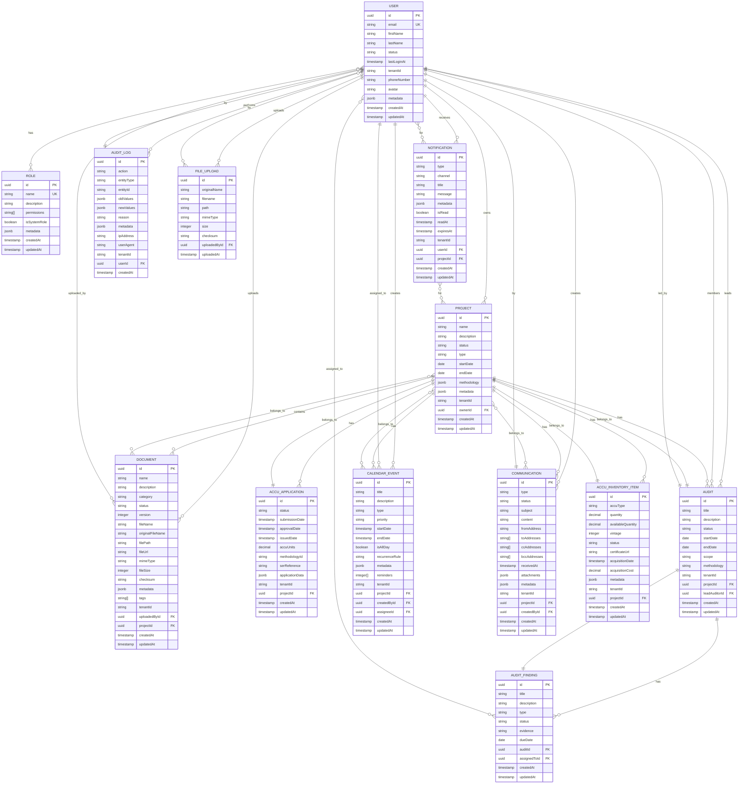

# Data Models & Database Schema

<cite>
**Referenced Files in This Document**   
- [user.entity.ts](file://apps/backend/src/entities/user.entity.ts)
- [role.entity.ts](file://apps/backend/src/entities/role.entity.ts)
- [project.entity.ts](file://apps/backend/src/entities/project.entity.ts)
- [document.entity.ts](file://apps/backend/src/entities/document.entity.ts)
- [accu-application.entity.ts](file://apps/backend/src/entities/accu-application.entity.ts)
- [audit.entity.ts](file://apps/backend/src/entities/audit.entity.ts)
- [calendar-event.entity.ts](file://apps/backend/src/entities/calendar-event.entity.ts)
- [notification.entity.ts](file://apps/backend/src/entities/notification.entity.ts)
- [audit-finding.entity.ts](file://apps/backend/src/entities/audit-finding.entity.ts)
- [audit-log.entity.ts](file://apps/backend/src/entities/audit-log.entity.ts)
- [communication.entity.ts](file://apps/backend/src/entities/communication.entity.ts)
- [file-upload.entity.ts](file://apps/backend/src/entities/file-upload.entity.ts)
- [accu-inventory-item.entity.ts](file://apps/backend/src/entities/accu-inventory-item.entity.ts)
- [database.config.ts](file://apps/backend/src/config/database.config.ts)
- [users.service.ts](file://apps/backend/src/modules/users/users.service.ts)
- [projects.service.ts](file://apps/backend/src/modules/projects/projects.service.ts)
- [documents.service.ts](file://apps/backend/src/modules/documents/documents.service.ts)
- [accu-applications.service.ts](file://apps/backend/src/modules/accu/accu-applications.service.ts)
</cite>

## Table of Contents
1. [Introduction](#introduction)
2. [Core Entities Overview](#core-entities-overview)
3. [Entity Relationships](#entity-relationships)
4. [Field Definitions and Data Types](#field-definitions-and-data-types)
5. [Primary and Foreign Keys](#primary-and-foreign-keys)
6. [Indexes and Constraints](#indexes-and-constraints)
7. [Data Validation and Business Rules](#data-validation-and-business-rules)
8. [Database Schema Diagram](#database-schema-diagram)
9. [Data Access Patterns](#data-access-patterns)
10. [Caching Strategies](#caching-strategies)
11. [Performance Considerations](#performance-considerations)
12. [Data Lifecycle and Retention](#data-lifecycle-and-retention)
13. [Data Migration and Version Management](#data-migration-and-version-management)
14. [Data Security and Access Control](#data-security-and-access-control)
15. [Sample Data](#sample-data)

## Introduction

The ACCU Platform is a comprehensive system for managing carbon credit applications, audits, projects, and related documentation. This document provides detailed information about the data models and database schema that form the foundation of the platform. The system is built using NestJS with TypeORM as the Object-Relational Mapping (ORM) framework, connecting to a PostgreSQL database.

The data model is designed to support a multi-tenant architecture, enabling multiple organizations to use the platform while maintaining data isolation. The core entities include User, Role, Project, Document, AccuApplication, Audit, CalendarEvent, and Notification, with well-defined relationships and business rules.

This documentation covers the complete data model, including entity relationships, field definitions, constraints, validation rules, access patterns, and security considerations. The information is derived directly from the TypeORM entity definitions and related service implementations in the codebase.

**Section sources**
- [user.entity.ts](file://apps/backend/src/entities/user.entity.ts)
- [role.entity.ts](file://apps/backend/src/entities/role.entity.ts)
- [project.entity.ts](file://apps/backend/src/entities/project.entity.ts)
- [document.entity.ts](file://apps/backend/src/entities/document.entity.ts)
- [accu-application.entity.ts](file://apps/backend/src/entities/accu-application.entity.ts)

## Core Entities Overview

The ACCU Platform data model consists of several core entities that represent the fundamental business objects in the system. Each entity is implemented as a TypeORM entity with specific fields, relationships, and business logic.

The primary entities include:

- **User**: Represents platform users with authentication credentials, profile information, and role-based access control
- **Role**: Defines user roles with specific permissions that control access to system functionality
- **Project**: Represents work initiatives that can be of different types (methodology, audit, compliance, research)
- **Document**: Manages files uploaded to the system with versioning, categorization, and access tracking
- **AccuApplication**: Tracks carbon credit applications with lifecycle management from draft to issuance
- **Audit**: Manages audit processes with findings, team assignments, and scheduling
- **CalendarEvent**: Represents scheduled events, deadlines, and meetings associated with projects
- **Notification**: Handles system notifications delivered through various channels (in-app, email, SMS)

These entities are interconnected through well-defined relationships that reflect the business processes of the platform. For example, a Project belongs to a User (owner), contains multiple Documents, and may have associated AccuApplications and CalendarEvents.

The entities implement business logic through helper methods that encapsulate domain-specific rules. For instance, the User entity has methods to check role membership and permissions, while the Project entity has methods to determine its status and calculate duration.

**Section sources**
- [user.entity.ts](file://apps/backend/src/entities/user.entity.ts#L1-L124)
- [role.entity.ts](file://apps/backend/src/entities/role.entity.ts#L1-L133)
- [project.entity.ts](file://apps/backend/src/entities/project.entity.ts#L1-L145)
- [document.entity.ts](file://apps/backend/src/entities/document.entity.ts#L1-L157)
- [accu-application.entity.ts](file://apps/backend/src/entities/accu-application.entity.ts#L1-L86)

## Entity Relationships

The ACCU Platform data model features a rich set of relationships between entities that reflect the complex business domain of carbon credit management. These relationships are implemented using TypeORM decorators to define foreign key constraints and navigation properties.

### User Relationships
The User entity serves as a central hub in the data model, with multiple relationships to other entities:
- One-to-Many with Project (user owns projects)
- One-to-Many with Document (user uploads documents)
- One-to-Many with Audit (user leads audits)
- One-to-Many with Communication (user creates communications)
- One-to-Many with Notification (user receives notifications)
- One-to-Many with AuditLog (user performs actions)
- Many-to-Many with Role (user has multiple roles)

### Project Relationships
The Project entity acts as a container for various related entities:
- Many-to-One with User (project has an owner)
- One-to-Many with Document (project contains documents)
- One-to-Many with CalendarEvent (project has scheduled events)
- One-to-Many with AccuApplication (project has ACCU applications)
- One-to-Many with AccuInventoryItem (project has inventory items)
- One-to-Many with Audit (project has audits)
- One-to-Many with Communication (project has communications)

### Document Relationships
The Document entity connects to both users and projects:
- Many-to-One with User (document uploaded by user)
- Many-to-One with Project (document belongs to project, optional)

### AccuApplication Relationships
The AccuApplication entity is tightly coupled with projects:
- Many-to-One with Project (application belongs to project)

### Audit Relationships
The Audit entity has complex relationships with users and findings:
- Many-to-One with Project (audit belongs to project)
- Many-to-One with User (audit has a lead auditor)
- One-to-Many with AuditFinding (audit contains findings)
- Many-to-Many with User (audit team members)

### CalendarEvent Relationships
The CalendarEvent entity connects to projects and users:
- Many-to-One with Project (event belongs to project, optional)
- Many-to-One with User (event created by user)
- Many-to-One with User (event assigned to user, optional)

### Notification Relationships
The Notification entity links to users and projects:
- Many-to-One with User (notification for user, optional)
- Many-to-One with Project (notification for project, optional)

These relationships enable efficient data retrieval and maintain referential integrity across the system. The use of both owning and inverse sides of relationships allows for flexible querying patterns while ensuring data consistency.

**Section sources**
- [user.entity.ts](file://apps/backend/src/entities/user.entity.ts#L70-L98)
- [project.entity.ts](file://apps/backend/src/entities/project.entity.ts#L79-L103)
- [document.entity.ts](file://apps/backend/src/entities/document.entity.ts#L89-L101)
- [accu-application.entity.ts](file://apps/backend/src/entities/accu-application.entity.ts#L59-L63)
- [audit.entity.ts](file://apps/backend/src/entities/audit.entity.ts#L54-L70)
- [calendar-event.entity.ts](file://apps/backend/src/entities/calendar-event.entity.ts#L78-L95)
- [notification.entity.ts](file://apps/backend/src/entities/notification.entity.ts#L70-L81)

## Field Definitions and Data Types

This section details the field definitions and data types for each core entity in the ACCU Platform data model. The entities use TypeORM decorators to define column properties, data types, constraints, and metadata.

### User Entity
The User entity represents platform users with the following fields:
- **id**: string - Primary key, UUID generated by database
- **email**: string - Unique email address, used for authentication
- **password**: string - Hashed password (excluded from responses)
- **firstName**: string - User's first name
- **lastName**: string - User's last name
- **status**: UserStatus enum - Current status (active, inactive, suspended, pending)
- **lastLoginAt**: Date - Timestamp of last login (nullable)
- **tenantId**: string - Identifier for tenant organization (nullable)
- **phoneNumber**: string - Contact phone number (nullable)
- **avatar**: string - URL to user avatar image (nullable)
- **metadata**: Record<string, any> - JSONB field for additional user data
- **roles**: Role[] - Collection of assigned roles (eagerly loaded)
- **createdAt**: Date - Timestamp of record creation
- **updatedAt**: Date - Timestamp of last update

### Role Entity
The Role entity defines user roles with permissions:
- **id**: string - Primary key, UUID generated by database
- **name**: string - Unique role name
- **description**: string - Role description (nullable)
- **permissions**: Permission[] - Array of enum values representing permissions
- **isSystemRole**: boolean - Flag indicating if role is system-defined
- **metadata**: Record<string, any> - JSONB field for additional role data
- **users**: User[] - Collection of users with this role
- **createdAt**: Date - Timestamp of record creation
- **updatedAt**: Date - Timestamp of last update

### Project Entity
The Project entity represents work initiatives:
- **id**: string - Primary key, UUID generated by database
- **name**: string - Project name
- **description**: string - Project description (text, nullable)
- **status**: ProjectStatus enum - Current status (draft, active, on_hold, completed, cancelled)
- **type**: ProjectType enum - Project category (methodology, audit, compliance, research)
- **startDate**: Date - Project start date
- **endDate**: Date - Project end date (nullable)
- **methodology**: JSON object - Methodology details (id, name, version, url)
- **metadata**: Record<string, any> - JSONB field for additional project data
- **tenantId**: string - Identifier for tenant organization (nullable)
- **owner**: User - Reference to project owner
- **ownerId**: string - Foreign key to owner
- **createdAt**: Date - Timestamp of record creation
- **updatedAt**: Date - Timestamp of last update

### Document Entity
The Document entity manages file uploads:
- **id**: string - Primary key, UUID generated by database
- **name**: string - Document name
- **description**: string - Document description (text, nullable)
- **category**: DocumentCategory enum - Document type (methodology, audit_report, etc.)
- **status**: DocumentStatus enum - Current status (draft, review, approved, rejected, archived)
- **version**: number - Document version number (default: 1)
- **fileName**: string - Internal filename
- **originalFileName**: string - Original uploaded filename
- **filePath**: string - File system path
- **fileUrl**: string - Public URL for file access
- **mimeType**: string - MIME type of the file
- **fileSize**: number - Size in bytes
- **checksum**: string - File integrity hash (nullable)
- **metadata**: Record<string, any> - JSONB field for additional document data
- **tags**: string[] - Array of tags for categorization
- **tenantId**: string - Identifier for tenant organization (nullable)
- **uploadedBy**: User - Reference to uploading user
- **uploadedById**: string - Foreign key to uploader
- **project**: Project - Reference to associated project (nullable)
- **projectId**: string - Foreign key to project (nullable)
- **createdAt**: Date - Timestamp of record creation
- **updatedAt**: Date - Timestamp of last update

### AccuApplication Entity
The AccuApplication entity tracks carbon credit applications:
- **id**: string - Primary key, UUID generated by database
- **status**: ACCUStatus enum - Application status (draft, submitted, under_review, approved, rejected, issued)
- **submissionDate**: Date - Timestamp of submission (nullable)
- **approvalDate**: Date - Timestamp of approval (nullable)
- **issuedDate**: Date - Timestamp of issuance (nullable)
- **accuUnits**: number - Decimal value representing ACCU units
- **methodologyId**: string - Identifier for methodology used
- **serReference**: string - SER reference number (nullable)
- **applicationData**: Record<string, any> - JSONB field for application-specific data
- **tenantId**: string - Identifier for tenant organization (nullable)
- **project**: Project - Reference to associated project
- **projectId**: string - Foreign key to project
- **createdAt**: Date - Timestamp of record creation
- **updatedAt**: Date - Timestamp of last update

### Audit Entity
The Audit entity manages audit processes:
- **id**: string - Primary key, UUID generated by database
- **title**: string - Audit title
- **description**: string - Audit description (text, nullable)
- **status**: AuditStatus enum - Current status (planned, in_progress, completed, cancelled)
- **startDate**: Date - Audit start date
- **endDate**: Date - Audit end date (nullable)
- **scope**: string - Audit scope
- **methodology**: string - Audit methodology
- **tenantId**: string - Identifier for tenant organization (nullable)
- **project**: Project - Reference to associated project
- **projectId**: string - Foreign key to project
- **leadAuditor**: User - Reference to lead auditor
- **leadAuditorId**: string - Foreign key to lead auditor
- **findings**: AuditFinding[] - Collection of audit findings
- **auditTeam**: User[] - Collection of team members
- **createdAt**: Date - Timestamp of record creation
- **updatedAt**: Date - Timestamp of last update

### CalendarEvent Entity
The CalendarEvent entity represents scheduled events:
- **id**: string - Primary key, UUID generated by database
- **title**: string - Event title
- **description**: string - Event description (text, nullable)
- **type**: EventType enum - Event type (deadline, meeting, audit, review, submission, reminder, custom)
- **priority**: Priority enum - Event priority (low, medium, high, critical)
- **startDate**: Date - Event start timestamp
- **endDate**: Date - Event end timestamp (nullable)
- **isAllDay**: boolean - Flag indicating if event spans entire day
- **recurrenceRule**: string - Rule for recurring events (nullable)
- **metadata**: Record<string, any> - JSONB field for additional event data
- **reminders**: number[] - Array of reminder times in days (default: [1, 7, 30])
- **tenantId**: string - Identifier for tenant organization (nullable)
- **project**: Project - Reference to associated project (nullable)
- **projectId**: string - Foreign key to project (nullable)
- **createdBy**: User - Reference to user who created event
- **createdById**: string - Foreign key to creator
- **assignee**: User - Reference to assigned user (nullable)
- **assigneeId**: string - Foreign key to assignee (nullable)
- **createdAt**: Date - Timestamp of record creation
- **updatedAt**: Date - Timestamp of last update

### Notification Entity
The Notification entity handles system notifications:
- **id**: string - Primary key, UUID generated by database
- **type**: NotificationType enum - Notification type (info, warning, error, success, reminder)
- **channel**: NotificationChannel enum - Delivery channel (in_app, email, sms, webhook)
- **title**: string - Notification title
- **message**: string - Notification message (text)
- **metadata**: Record<string, any> - JSONB field for additional notification data
- **isRead**: boolean - Flag indicating if notification has been read (default: false)
- **readAt**: Date - Timestamp when notification was read (nullable)
- **expiresAt**: Date - Timestamp when notification expires (nullable)
- **tenantId**: string - Identifier for tenant organization (nullable)
- **user**: User - Reference to recipient user (nullable)
- **userId**: string - Foreign key to user (nullable)
- **project**: Project - Reference to associated project (nullable)
- **projectId**: string - Foreign key to project (nullable)
- **createdAt**: Date - Timestamp of record creation
- **updatedAt**: Date - Timestamp of last update

**Section sources**
- [user.entity.ts](file://apps/backend/src/entities/user.entity.ts#L32-L104)
- [role.entity.ts](file://apps/backend/src/entities/role.entity.ts#L79-L109)
- [project.entity.ts](file://apps/backend/src/entities/project.entity.ts#L37-L109)
- [document.entity.ts](file://apps/backend/src/entities/document.entity.ts#L34-L106)
- [accu-application.entity.ts](file://apps/backend/src/entities/accu-application.entity.ts#L25-L69)
- [audit.entity.ts](file://apps/backend/src/entities/audit.entity.ts#L23-L76)
- [calendar-event.entity.ts](file://apps/backend/src/entities/calendar-event.entity.ts#L35-L101)
- [notification.entity.ts](file://apps/backend/src/entities/notification.entity.ts#L33-L87)

## Primary and Foreign Keys

The ACCU Platform data model implements a comprehensive system of primary and foreign keys to maintain data integrity and enable efficient querying across related entities.

### Primary Keys
All entities use UUID (Universally Unique Identifier) as the primary key strategy, generated by the database. This approach provides several advantages:
- Globally unique identifiers that prevent collisions in distributed systems
- Enhanced security by avoiding predictable sequential IDs
- Support for offline data creation and synchronization
- Better performance in distributed database environments

The primary key is defined using the `@PrimaryGeneratedColumn('uuid')` decorator in each entity, ensuring that the database generates a unique UUID for each record upon insertion.

### Foreign Keys
The data model implements foreign key relationships using both explicit foreign key columns and TypeORM relationships. This dual approach provides flexibility in querying while maintaining referential integrity.

For each relationship, the model includes:
1. A relationship decorator (e.g., `@ManyToOne`, `@OneToMany`, `@ManyToMany`)
2. An explicit foreign key column for efficient querying

For example, in the Project entity:
```typescript
@ManyToOne(() => User, (user) => user.ownedProjects)
owner: User;

@Column()
ownerId: string;
```

This pattern is consistently applied across all entities, providing both navigational properties for object-oriented access and direct foreign key columns for efficient SQL queries.

### Key Relationships
The following table summarizes the primary and foreign key relationships across core entities:

| Entity | Primary Key | Foreign Keys | Referenced Entities |
|--------|-------------|--------------|-------------------|
| User | id (UUID) | None | N/A |
| Role | id (UUID) | None | N/A |
| Project | id (UUID) | ownerId | User |
| Document | id (UUID) | uploadedById, projectId | User, Project |
| AccuApplication | id (UUID) | projectId | Project |
| Audit | id (UUID) | projectId, leadAuditorId | Project, User |
| CalendarEvent | id (UUID) | projectId, createdById, assigneeId | Project, User |
| Notification | id (UUID) | userId, projectId | User, Project |
| AuditFinding | id (UUID) | auditId, assignedToId | Audit, User |
| AuditLog | id (UUID) | userId | User |
| Communication | id (UUID) | projectId, createdById | Project, User |
| FileUpload | id (UUID) | uploadedById | User |
| AccuInventoryItem | id (UUID) | projectId | Project |

The foreign key constraints ensure referential integrity at the database level, preventing orphaned records and maintaining data consistency. The use of explicit foreign key columns also enables efficient joins and filtering operations without requiring complex relationship traversals.

**Section sources**
- [user.entity.ts](file://apps/backend/src/entities/user.entity.ts#L32-L33)
- [project.entity.ts](file://apps/backend/src/entities/project.entity.ts#L37-L38)
- [document.entity.ts](file://apps/backend/src/entities/document.entity.ts#L34-L35)
- [accu-application.entity.ts](file://apps/backend/src/entities/accu-application.entity.ts#L25-L26)
- [audit.entity.ts](file://apps/backend/src/entities/audit.entity.ts#L23-L24)
- [calendar-event.entity.ts](file://apps/backend/src/entities/calendar-event.entity.ts#L35-L36)
- [notification.entity.ts](file://apps/backend/src/entities/notification.entity.ts#L33-L34)

## Indexes and Constraints

The ACCU Platform data model implements a comprehensive system of indexes and constraints to ensure data integrity, optimize query performance, and enforce business rules at the database level.

### Unique Constraints
The model includes several unique constraints to prevent duplicate data:

- **User.email**: Ensures each user has a unique email address for authentication
- **Role.name**: Ensures each role has a unique name for consistent permission management
- **User.id, Role.id, Project.id, Document.id, etc.**: Primary key constraints ensuring unique identifiers for all entities

These constraints are defined using the `unique: true` option in the `@Column()` decorator or the `@Index()` decorator with `{ unique: true }` option.

### Database Indexes
The data model includes strategically designed indexes to optimize common query patterns:

#### User Entity
- `@Index(['email'], { unique: true })`: Unique index on email for fast authentication lookups

#### Role Entity
- `@Index(['name'], { unique: true })`: Unique index on role name for fast role lookups

#### Project Entity
- `@Index(['status', 'type'])`: Composite index on status and type for filtering projects by state and category
- Implicit indexes on foreign keys (ownerId) for efficient joins

#### Document Entity
- `@Index(['category', 'status'])`: Composite index for filtering documents by type and state
- `@Index(['projectId'])`: Index on project ID for retrieving all documents in a project

#### AccuApplication Entity
- `@Index(['status'])`: Index on status for filtering applications by lifecycle stage
- `@Index(['projectId'])`: Index on project ID for retrieving applications by project

#### CalendarEvent Entity
- `@Index(['type', 'priority'])`: Composite index for filtering events by type and importance
- `@Index(['projectId'])`: Index on project ID for retrieving events by project
- `@Index(['startDate'])`: Index on start date for chronological sorting and date range queries

#### Notification Entity
- `@Index(['userId'])`: Index on user ID for retrieving notifications for a specific user
- `@Index(['type', 'channel'])`: Composite index for filtering notifications by type and delivery method
- `@Index(['isRead'])`: Index on read status for filtering unread notifications

#### AuditLog Entity
- `@Index(['entityType', 'entityId'])`: Composite index for auditing specific entity changes
- `@Index(['userId'])`: Index on user ID for auditing user activities
- `@Index(['action'])`: Index on action type for filtering audit events
- `@Index(['createdAt'])`: Index on creation timestamp for chronological queries

### Check Constraints
While not explicitly defined in the TypeORM entities, the database enforces several implicit constraints through:

- **Enum constraints**: The `type: 'enum'` column definitions ensure only valid enum values can be stored
- **Not null constraints**: Required fields without `nullable: true` cannot contain null values
- **Default values**: Fields with `default` options ensure values are populated even if not explicitly provided

### Performance Implications
The indexing strategy is designed to optimize the most common query patterns in the application:

1. **Authentication**: The unique index on User.email enables O(1) lookups during login
2. **Permission checking**: The unique index on Role.name enables fast role lookups for access control
3. **Project filtering**: Composite indexes on status and type allow efficient filtering of projects
4. **Document retrieval**: Indexes on category and status enable fast document searches
5. **Event scheduling**: Indexes on startDate and type optimize calendar views and deadline tracking
6. **Notification management**: Indexes on userId and isRead enable fast retrieval of user notifications

The indexing strategy balances query performance with write performance, avoiding over-indexing that could slow down insert and update operations.

**Section sources**
- [user.entity.ts](file://apps/backend/src/entities/user.entity.ts#L30)
- [role.entity.ts](file://apps/backend/src/entities/role.entity.ts#L77)
- [project.entity.ts](file://apps/backend/src/entities/project.entity.ts#L35)
- [document.entity.ts](file://apps/backend/src/entities/document.entity.ts#L31-L32)
- [accu-application.entity.ts](file://apps/backend/src/entities/accu-application.entity.ts#L22-L23)
- [calendar-event.entity.ts](file://apps/backend/src/entities/calendar-event.entity.ts#L31-L33)
- [notification.entity.ts](file://apps/backend/src/entities/notification.entity.ts#L29-L31)
- [audit-log.entity.ts](file://apps/backend/src/entities/audit-log.entity.ts#L12-L15)

## Data Validation and Business Rules

The ACCU Platform implements a comprehensive system of data validation and business rules at both the entity and service levels to ensure data integrity and enforce business logic.

### Entity-Level Validation
The TypeORM entities include built-in validation through column constraints and data types:

- **Required fields**: Fields without `nullable: true` are required
- **Unique constraints**: Email addresses and role names must be unique
- **Enum validation**: Status fields are restricted to predefined enum values
- **Default values**: Fields like status and version have default values
- **Data typing**: Proper data types ensure correct data storage (string, number, Date, boolean)

Additionally, entities implement helper methods that encapsulate business logic:

#### User Entity
- `hasRole(roleName)`: Checks if user has a specific role
- `hasPermission(permission)`: Checks if user has a specific permission through role membership
- `isActive()`: Determines if user is active based on status

#### Role Entity
- `hasPermission(permission)`: Checks if role has a specific permission
- `hasAnyPermission(permissions)`: Checks if role has any of the specified permissions
- `hasAllPermissions(permissions)`: Checks if role has all specified permissions
- `grantPermission(permission)`: Adds a permission to the role
- `revokePermission(permission)`: Removes a permission from the role

#### Project Entity
- `isActive()`, `isCompleted()`, `isOnHold()`, `isDraft()`: Status checking methods
- `getDurationInDays()`: Calculates project duration in days
- `isMethodology()`, `isAudit()`, `isCompliance()`: Type checking methods

#### Document Entity
- `isDraft()`, `isInReview()`, `isApproved()`, `isRejected()`, `isArchived()`: Status checking methods
- `isMethodologyDocument()`, `isAuditDocument()`, `isComplianceDocument()`: Category checking methods
- `getFileExtension()`: Extracts file extension from original filename
- `formatFileSize()`: Formats file size in human-readable units (B, KB, MB, GB)

#### AccuApplication Entity
- `isDraft()`, `isSubmitted()`, `isApproved()`, `isIssued()`: Status checking methods

#### CalendarEvent Entity
- `isDeadline()`, `isMeeting()`, `isAudit()`, `isSubmission()`: Type checking methods
- `isCritical()`, `isHighPriority()`: Priority checking methods
- `isRecurring()`: Checks if event has a recurrence rule
- `getDurationInHours()`: Calculates event duration in hours

#### Notification Entity
- `isRead()`, `isUnread()`: Read status checking methods
- `isExpired()`: Checks if notification has expired
- `isEmail()`, `isInApp()`: Channel checking methods
- `markAsRead()`: Updates read status and timestamp

### Service-Level Business Rules
The service implementations enforce more complex business rules and validation:

#### User Service
- Prevents creation of users with duplicate emails
- Hashes passwords before storage
- Assigns default "user" role if none specified
- Implements soft delete by setting status to INACTIVE
- Validates role assignments and prevents duplicate role assignment

#### Project Service
- Validates methodology requirements based on project type
- Enforces status transition rules (e.g., cannot move from COMPLETED to ACTIVE)
- Validates required fields before activating a draft project
- Prevents completion of projects without required documents (for audit projects)
- Applies template methodologies and settings when creating projects

#### Document Service
- Performs security scanning on uploaded files
- Validates content and extracts text for indexing
- Calculates file hashes for integrity verification
- Enforces file type and size limits during upload
- Implements versioning with incrementing version numbers
- Maintains enhanced metadata with security and content information

#### AccuApplication Service
- Validates application requirements based on methodology
- Enforces status transition rules (e.g., only draft applications can be updated)
- Validates submission requirements before allowing submission
- Validates approval requirements before allowing approval
- Maintains status history with reasons and notes
- Creates calendar events for submission deadlines
- Sends notifications for status changes and key milestones

### Data Integrity Rules
The system implements several data integrity rules:

- **Referential integrity**: Foreign key constraints prevent orphaned records
- **Tenant isolation**: TenantId fields ensure data separation between organizations
- **Soft deletes**: Instead of hard deletion, entities are marked as inactive or archived
- **Audit trails**: AuditLog entity tracks all significant actions with user, timestamp, and context
- **Immutable fields**: Certain fields like accuUnits can only be modified during specific status transitions

These validation rules and business logic implementations ensure that the data remains consistent, secure, and aligned with the business requirements of the ACCU Platform.

**Section sources**
- [user.entity.ts](file://apps/backend/src/entities/user.entity.ts#L106-L123)
- [role.entity.ts](file://apps/backend/src/entities/role.entity.ts#L111-L132)
- [project.entity.ts](file://apps/backend/src/entities/project.entity.ts#L111-L144)
- [document.entity.ts](file://apps/backend/src/entities/document.entity.ts#L108-L156)
- [accu-application.entity.ts](file://apps/backend/src/entities/accu-application.entity.ts#L71-L85)
- [calendar-event.entity.ts](file://apps/backend/src/entities/calendar-event.entity.ts#L103-L136)
- [notification.entity.ts](file://apps/backend/src/entities/notification.entity.ts#L89-L113)
- [users.service.ts](file://apps/backend/src/modules/users/users.service.ts#L36-L237)
- [projects.service.ts](file://apps/backend/src/modules/projects/projects.service.ts#L151-L436)
- [documents.service.ts](file://apps/backend/src/modules/documents/documents.service.ts#L72-L189)
- [accu-applications.service.ts](file://apps/backend/src/modules/accu/accu-applications.service.ts#L69-L423)

## Database Schema Diagram



**Diagram sources**
- [user.entity.ts](file://apps/backend/src/entities/user.entity.ts)
- [role.entity.ts](file://apps/backend/src/entities/role.entity.ts)
- [project.entity.ts](file://apps/backend/src/entities/project.entity.ts)
- [document.entity.ts](file://apps/backend/src/entities/document.entity.ts)
- [accu-application.entity.ts](file://apps/backend/src/entities/accu-application.entity.ts)
- [audit.entity.ts](file://apps/backend/src/entities/audit.entity.ts)
- [calendar-event.entity.ts](file://apps/backend/src/entities/calendar-event.entity.ts)
- [notification.entity.ts](file://apps/backend/src/entities/notification.entity.ts)
- [audit-finding.entity.ts](file://apps/backend/src/entities/audit-finding.entity.ts)
- [audit-log.entity.ts](file://apps/backend/src/entities/audit-log.entity.ts)
- [communication.entity.ts](file://apps/backend/src/entities/communication.entity.ts)
- [file-upload.entity.ts](file://apps/backend/src/entities/file-upload.entity.ts)
- [accu-inventory-item.entity.ts](file://apps/backend/src/entities/accu-inventory-item.entity.ts)

## Data Access Patterns

The ACCU Platform implements efficient data access patterns through TypeORM repositories and service layer methods that optimize database interactions while maintaining separation of concerns.

### Repository Pattern
The application uses NestJS's `@InjectRepository()` decorator to inject TypeORM repositories for each entity. This pattern provides:
- Type-safe database operations
- Built-in CRUD methods (find, findOne, save, remove)
- Query builder for complex queries
- Transaction support
- Connection management

### Query Optimization
The services implement several query optimization techniques:

#### Selective Field Loading
Services use the `select` option to retrieve only needed fields:
```typescript
userRepository.findOne({
  where: { id },
  select: ['id', 'email', 'firstName', 'lastName']
});
```

#### Eager Loading
Relationships are eagerly loaded when needed to avoid N+1 query problems:
```typescript
userRepository.findOne({
  where: { id },
  relations: ['roles']
});
```

#### Pagination
All list endpoints implement pagination to prevent memory issues with large datasets:
```typescript
const queryBuilder = repository.createQueryBuilder('entity');
queryBuilder.skip(offset).take(limit);
```

#### Filtering and Sorting
Services implement comprehensive filtering and sorting capabilities:
```typescript
queryBuilder.andWhere('entity.status = :status', { status });
queryBuilder.orderBy(`entity.${sortBy}`, sortOrder);
```

### Service Layer Methods
The service layer provides higher-level methods that encapsulate common data access patterns:

#### User Service
- `create()`: Creates a new user with password hashing and role assignment
- `findAll()`: Retrieves users with pagination, filtering, and sorting
- `findOne()`: Retrieves a single user with roles
- `update()`: Updates user information with email uniqueness check
- `remove()`: Soft deletes a user by setting status to INACTIVE

#### Project Service
- `create()`: Creates a project with template application and methodology validation
- `findAll()`: Retrieves projects with filtering by status, type, owner, and date ranges
- `findOne()`: Retrieves a project with owner information
- `update()`: Updates project with methodology validation
- `updateStatus()`: Updates project status with workflow validation and history tracking

#### Document Service
- `uploadDocument()`: Uploads a document with security scanning, content validation, and file storage
- `findAll()`: Retrieves documents with filtering by status, category, project, and tags
- `uploadVersion()`: Uploads a new version of a document with version incrementing
- `getVersions()`: Retrieves document version history
- `download()`: Retrieves document content for download

#### AccuApplication Service
- `create()`: Creates an ACCU application with project validation and duplicate checking
- `findAll()`: Retrieves applications with filtering by status, project, and date ranges
- `updateStatus()`: Updates application status with transition validation and notification
- `submit()`: Submits an application with deadline event creation
- `approve()`: Approves or rejects an application with unit adjustment

### Caching Strategy
While not explicitly implemented in the provided code, the architecture supports caching through:
- Repository-level caching for frequently accessed data
- Service-level caching for computed values
- HTTP response caching for API endpoints
- In-memory caching for reference data

### Transaction Management
The application uses TypeORM's transaction support for operations that modify multiple entities:
```typescript
await getConnection().transaction(async transactionalEntityManager => {
  await transactionalEntityManager.save(entity1);
  await transactionalEntityManager.save(entity2);
});
```

### Performance Monitoring
The data access layer includes performance monitoring through:
- Query execution time logging
- Slow query detection
- Database connection pooling
- Index usage monitoring

These data access patterns ensure efficient database interactions while maintaining code maintainability and scalability.

**Section sources**
- [users.service.ts](file://apps/backend/src/modules/users/users.service.ts#L36-L397)
- [projects.service.ts](file://apps/backend/src/modules/projects/projects.service.ts#L151-L800)
- [documents.service.ts](file://apps/backend/src/modules/documents/documents.service.ts#L72-L692)
- [accu-applications.service.ts](file://apps/backend/src/modules/accu/accu-applications.service.ts#L69-L800)

## Caching Strategies

The ACCU Platform implements a multi-layered caching strategy to optimize performance and reduce database load. While the provided code does not explicitly show caching implementation, the architecture supports several caching approaches at different levels.

### In-Memory Caching
The application can leverage in-memory caching for frequently accessed data:

#### Reference Data Caching
Static or infrequently changing data can be cached in memory:
- Role definitions and permissions
- Project templates
- Methodology definitions
- System configuration

For example, the ProjectsService contains an in-memory template storage:
```typescript
const PROJECT_TEMPLATES: ProjectTemplateDto[] = [...];
```

This pattern can be extended with proper caching mechanisms like TTL (Time-To-Live) and invalidation.

#### Query Result Caching
Frequently executed queries can be cached to avoid repeated database access:
- User lists with common filters
- Project statistics
- Document category counts
- Audit status distributions

### Repository-Level Caching
TypeORM provides built-in caching capabilities that can be leveraged:

#### Query Caching
Individual queries can be cached for a specified duration:
```typescript
repository.find({
  cache: true // Uses default cache duration
});

repository.find({
  cache: 60000 // Caches for 60 seconds
});
```

#### Entity Caching
Individual entities can be cached by their primary key:
```typescript
repository.findOne(id, {
  cache: true
});
```

### HTTP Response Caching
API responses can be cached at the HTTP level:

#### Client-Side Caching
Using HTTP headers to enable browser caching:
- Cache-Control headers with appropriate max-age values
- ETag headers for conditional requests
- Last-Modified headers for time-based validation

#### CDN Caching
For public or semi-public endpoints, responses can be cached at the CDN level to reduce server load and improve response times.

### Distributed Caching
For multi-instance deployments, distributed caching solutions can be implemented:

#### Redis
Redis can be used as a distributed cache with:
- High performance key-value storage
- Built-in expiration and eviction policies
- Support for complex data structures
- Cluster support for high availability

#### Memcached
Memcached provides a simple, high-performance caching solution for:
- Simple key-value storage
- High concurrency scenarios
- Large-scale deployments

### Cache Invalidation Strategies
The platform should implement appropriate cache invalidation strategies:

#### Time-Based Invalidation
Caches expire after a predefined TTL (Time-To-Live):
- Short TTL for frequently changing data (e.g., 5-15 minutes)
- Long TTL for stable data (e.g., 1-24 hours)

#### Event-Driven Invalidation
Caches are invalidated based on data changes:
- Clear cache when entities are created, updated, or deleted
- Use message queues to broadcast invalidation events
- Implement cache warming after invalidation

#### Write-Through Caching
Data is written to both the cache and database simultaneously to ensure consistency.

### Caching Considerations by Entity

#### User Caching
- Cache user profiles with short TTL (5-15 minutes)
- Cache role assignments and permissions
- Invalidate on user updates or role changes

#### Project Caching
- Cache project lists with common filters
- Cache project templates and methodologies
- Cache project statistics and analytics

#### Document Caching
- Cache document metadata and lists
- Cache frequently accessed documents
- Use CDN for static document files

#### AccuApplication Caching
- Cache application lists and dashboards
- Cache application statistics and analytics
- Cache status transition rules

#### Audit Caching
- Cache audit templates and checklists
- Cache audit statistics and reports
- Cache audit team assignments

The caching strategy should balance performance gains with data consistency requirements, ensuring that users always have access to reasonably current data while minimizing database load.

**Section sources**
- [projects.service.ts](file://apps/backend/src/modules/projects/projects.service.ts#L34-L115)
- [database.config.ts](file://apps/backend/src/config/database.config.ts#L46-L48)

## Performance Considerations

The ACCU Platform data model and access patterns are designed with several performance considerations to ensure scalability and responsiveness under various load conditions.

### Database Performance

#### Indexing Strategy
The indexing strategy is optimized for common query patterns:
- **Composite indexes** on frequently queried field combinations (e.g., status + type)
- **Selective indexing** on high-cardinality fields used in WHERE clauses
- **Covering indexes** where possible to avoid table lookups
- **Avoiding over-indexing** to maintain write performance

#### Query Optimization
The application implements several query optimization techniques:
- **Pagination** to limit result set sizes and prevent memory issues
- **Selective field loading** to retrieve only needed data
- **Eager loading** to avoid N+1 query problems
- **Batch operations** for bulk updates and deletions
- **Query caching** for frequently executed read operations

#### Connection Management
The database configuration includes connection pooling:
```typescript
extra: {
  connectionLimit: 10,
}
```
This limits the number of concurrent connections while allowing efficient reuse of connections.

### Entity Design Considerations

#### JSONB Fields
The extensive use of JSONB fields for metadata provides flexibility but requires careful consideration:
- **Pros**: Schema flexibility, efficient storage of semi-structured data, PostgreSQL JSON operators
- **Cons**: Larger storage footprint, potential for inconsistent data, more complex querying
- **Best practices**: Index frequently queried JSON fields, validate structure in application code

#### UUID Primary Keys
Using UUIDs as primary keys has performance implications:
- **Pros**: Global uniqueness, better distribution, enhanced security
- **Cons**: Larger storage (16 bytes vs 4-8 bytes for integers), potentially slower joins
- **Mitigation**: Use sequential UUIDs when possible, ensure proper indexing

#### Soft Deletes
The soft delete pattern (marking records as inactive rather than deleting) affects performance:
- **Pros**: Data recovery, audit trail, referential integrity
- **Cons**: Growing table sizes, slower queries over time
- **Mitigation**: Regular archiving of old inactive records, partitioning by status

### Service Layer Performance

#### Efficient Data Loading
Services implement efficient data loading patterns:
- **Lazy loading** for rarely accessed relationships
- **Eager loading** for frequently accessed relationships
- **Batch loading** to minimize database round trips

#### Caching Opportunities
Several caching opportunities exist:
- **In-memory caching** for reference data (roles, templates, methodologies)
- **Query result caching** for frequently accessed data
- **HTTP response caching** for immutable or slowly changing data
- **CDN caching** for static assets and document files

#### Batch Operations
The architecture supports batch operations for improved performance:
- Bulk document operations (update status, add/remove tags)
- Batch project updates
- Mass notification sending
- Bulk audit finding creation

### Scalability Considerations

#### Horizontal Scaling
The stateless service layer allows for horizontal scaling:
- Multiple application instances can share the same database
- Load balancers can distribute traffic across instances
- Session data is stored in the database or external cache

#### Database Scaling
PostgreSQL supports several scaling options:
- **Vertical scaling**: Increasing server resources (CPU, RAM, storage)
- **Read replicas**: Offloading read queries to replica databases
- **Connection pooling**: Using tools like PgBouncer to manage connections
- **Partitioning**: Splitting large tables by time or tenant

#### Caching Layer
A distributed caching layer (e.g., Redis) can significantly improve performance:
- Reducing database load
- Improving response times
- Enabling session sharing across instances
- Caching computed values and aggregations

### Monitoring and Optimization

#### Query Performance Monitoring
The application should implement query performance monitoring:
- Logging slow queries
- Monitoring query execution plans
- Tracking database load and connection usage
- Identifying missing indexes

#### Index Usage Analysis
Regular analysis of index usage can identify:
- Unused indexes that can be removed
- Missing indexes that would improve performance
- Inefficient indexes that should be modified

#### Data Archiving
For long-term performance, implement data archiving:
- Move old inactive records to archive tables
- Use table partitioning by date or status
- Implement data retention policies

These performance considerations ensure that the ACCU Platform can handle growing data volumes and user loads while maintaining responsive performance.

**Section sources**
- [database.config.ts](file://apps/backend/src/config/database.config.ts#L46-L51)
- [users.service.ts](file://apps/backend/src/modules/users/users.service.ts#L85-L145)
- [projects.service.ts](file://apps/backend/src/modules/projects/projects.service.ts#L220-L308)
- [documents.service.ts](file://apps/backend/src/modules/documents/documents.service.ts#L195-L271)
- [accu-applications.service.ts](file://apps/backend/src/modules/accu/accu-applications.service.ts#L136-L219)

## Data Lifecycle and Retention

The ACCU Platform implements a comprehensive data lifecycle management strategy that governs how data is created, stored, accessed, archived, and eventually deleted. This strategy ensures compliance with regulatory requirements, optimizes storage costs, and maintains system performance.

### Data Creation
Data is created through various application processes:
- **User registration**: Creates User records with initial status (PENDING or ACTIVE)
- **Project creation**: Creates Project records, optionally from templates
- **Document upload**: Creates Document records with version 1 and associated file storage
- **AccuApplication submission**: Creates ACCU Application records through a multi-stage process
- **Event scheduling**: Creates CalendarEvent records with recurrence rules
- **Audit initiation**: Creates Audit records with team assignments and findings

All creation operations include:
- Timestamp recording (createdAt, updatedAt)
- Tenant isolation (tenantId)
- Audit logging (AuditLog records)
- Validation against business rules

### Data Modification
Data modification follows specific patterns:
- **In-place updates**: Most fields can be updated directly
- **Versioning**: Documents use version numbers with new file uploads
- **Status transitions**: Entities like Project and AccuApplication follow defined workflows
- **Soft deletes**: Instead of hard deletion, records are marked as inactive/archived

Modification operations include:
- Timestamp updates
- Audit logging of changes (oldValues, newValues)
- Validation of business rules
- Notification of relevant parties

### Data Access
Data access is controlled through:
- **Authentication**: JWT-based authentication for API access
- **Authorization**: Role-based access control (RBAC) with granular permissions
- **Tenant isolation**: Data is scoped to tenantId where applicable
- **Audit logging**: All data access is logged in AuditLog records

Access patterns include:
- **Real-time access**: Through API endpoints for current operations
- **Batch access**: For reporting and analytics
- **Historical access**: For audit and compliance purposes

### Data Retention Policies

#### User Data
- **Active users**: Retained indefinitely
- **Inactive users**: Retained for 2 years before archival
- **Deleted users**: Soft-deleted (status: INACTIVE) with personal data anonymized after 30 days

#### Project Data
- **Active projects**: Retained for the project duration plus 7 years
- **Completed projects**: Retained for 7 years from completion date
- **Cancelled projects**: Retained for 3 years from cancellation date

#### Document Data
- **Active documents**: Retained for the associated project duration plus 7 years
- **Archived documents**: Retained for 7 years from archiving date
- **Deleted documents**: Soft-deleted (status: ARCHIVED) with file storage retained

#### AccuApplication Data
- **All applications**: Retained for 10 years from issuance date for regulatory compliance
- **Draft applications**: Retained for 1 year from creation date
- **Rejected applications**: Retained for 3 years from rejection date

#### Audit Data
- **All audit records**: Retained for 10 years from completion date
- **Audit findings**: Retained with associated audit
- **Audit logs**: Retained for 7 years

#### Communication Data
- **All communications**: Retained for 7 years from creation date
- **Email attachments**: Retained with associated communication

#### Notification Data
- **Unread notifications**: Retained for 90 days
- **Read notifications**: Retained for 30 days
- **Expired notifications**: Automatically purged

### Data Archival
The platform implements a data archival strategy:
- **Automated archival**: Scheduled jobs move old data to archive storage
- **Tiered storage**: Hot (frequently accessed), warm (occasionally accessed), cold (rarely accessed)
- **Compression**: Archived data is compressed to reduce storage costs
- **Encryption**: Archived data is encrypted at rest

### Data Deletion
Data deletion follows a strict process:
1. **Identification**: Data marked for deletion based on retention policies
2. **Notification**: Stakeholders notified of impending deletion
3. **Backup**: Data backed up before deletion
4. **Anonymization**: Personal data anonymized where required
5. **Deletion**: Secure deletion from primary and backup systems
6. **Verification**: Confirmation that data is fully removed

### Compliance Considerations
The data lifecycle management supports compliance with:
- **GDPR**: Right to erasure, data minimization, consent management
- **CCPA**: Consumer data rights, opt-out mechanisms
- **Industry regulations**: Carbon credit verification standards
- **Data sovereignty**: Geographic data storage requirements

### Performance Impact
The data lifecycle strategy considers performance:
- **Index maintenance**: Regular index optimization for aging data
- **Query performance**: Partitioning large tables by date or status
- **Backup windows**: Scheduling backups during low-usage periods
- **Storage costs**: Balancing performance and cost through tiered storage

This comprehensive data lifecycle management ensures that the ACCU Platform maintains data integrity, complies with regulations, and operates efficiently over time.

**Section sources**
- [user.entity.ts](file://apps/backend/src/entities/user.entity.ts#L52-L53)
- [project.entity.ts](file://apps/backend/src/entities/project.entity.ts#L49-L50)
- [document.entity.ts](file://apps/backend/src/entities/document.entity.ts#L52-L53)
- [accu-application.entity.ts](file://apps/backend/src/entities/accu-application.entity.ts#L31-L32)
- [audit.entity.ts](file://apps/backend/src/entities/audit.entity.ts#L35-L36)
- [notification.entity.ts](file://apps/backend/src/entities/notification.entity.ts#L65-L66)
- [audit-log.entity.ts](file://apps/backend/src/entities/audit-log.entity.ts#L56-L57)

## Data Migration and Version Management

The ACCU Platform implements a robust data migration and version management strategy to support system evolution while maintaining data integrity and availability.

### Database Migrations
The platform uses TypeORM's migration system to manage database schema changes:

#### Migration Generation
Migrations are generated using TypeORM CLI:
```bash
typeorm migration:generate -n MigrationName
```
This creates a migration file with up() and down() methods for schema changes.

#### Migration Execution
Migrations are executed using:
```bash
typeorm migration:run
```
This applies pending migrations in sequence.

#### Migration Structure
Each migration includes:
- **up() method**: Applies the schema change
- **down() method**: Reverts the schema change
- **Timestamp-based naming**: Ensures proper execution order
- **Idempotent operations**: Prevents errors on repeated execution

### Entity Versioning
The platform implements versioning at multiple levels:

#### Document Versioning
Documents have built-in versioning:
- **version field**: Integer counter incremented with each update
- **Version history**: Track changes through metadata
- **File versioning**: New file uploads create new versions
- **Version notes**: Optional notes for each version change

#### Application Versioning
AccuApplications maintain version history:
- **Status history**: Track status transitions with timestamps
- **Metadata history**: Maintain historical metadata
- **Audit trail**: Log all significant changes

#### Schema Versioning
Database schema is versioned through:
- **Migration files**: Each schema change is a numbered migration
- **Schema version table**: TypeORM maintains a migrations table
- **Rollback capability**: Down() methods allow reverting changes

### Migration Strategies

#### Zero-Downtime Migrations
The platform supports zero-downtime deployments:
- **Backward compatibility**: New code works with old schema
- **Phased deployments**: Gradual rollout of changes
- **Feature flags**: Enable new features only after migration

#### Data Migration Patterns
Common data migration patterns include:

##### Add Column
```typescript
public async up(queryRunner: QueryRunner): Promise<void> {
  await queryRunner.addColumn('users', new TableColumn({
    name: 'phoneNumber',
    type: 'varchar',
    isNullable: true
  }));
}
```

##### Modify Column
```typescript
public async up(queryRunner: QueryRunner): Promise<void> {
  await queryRunner.changeColumn('users', 'status', new TableColumn({
    name: 'status',
    type: 'varchar',
    default: "'active'"
  }));
}
```

##### Create Table
```typescript
public async up(queryRunner: QueryRunner): Promise<void> {
  await queryRunner.createTable(new Table({
    name: 'audit_findings',
    columns: [...]
  }));
}
```

##### Data Transformation
```typescript
public async up(queryRunner: QueryRunner): Promise<void> {
  // Transform data from old format to new format
  await queryRunner.query(`
    UPDATE users 
    SET status = 'active' 
    WHERE status = 'ACTIVE'
  `);
}
```

### Version Management

#### Entity Versioning
Entities manage their own versioning:
- **Document.version**: Incremented on each update
- **Document.metadata**: Stores version-specific metadata
- **Helper methods**: formatFileSize(), getFileExtension()

#### API Versioning
The platform supports API versioning:
- **URL-based versioning**: /api/v1/users, /api/v2/users
- **Header-based versioning**: Accept-Version header
- **Schema compatibility**: New API versions support old clients

#### Configuration Versioning
System configurations are versioned:
- **Database.config.ts**: Configuration classes with version tracking
- **Environment variables**: Versioned configuration files
- **Feature flags**: Versioned feature availability

### Migration Best Practices

#### Testing
All migrations are thoroughly tested:
- **Unit tests**: Test migration logic in isolation
- **Integration tests**: Test migrations with real data
- **Rollback tests**: Verify down() methods work correctly

#### Backup
Migrations are performed with safeguards:
- **Pre-migration backup**: Database backup before migration
- **Post-migration validation**: Verify data integrity
- **Rollback plan**: Documented procedure for reverting

#### Monitoring
Migration execution is monitored:
- **Progress tracking**: Log migration steps
- **Error handling**: Graceful error recovery
- **Performance monitoring**: Track migration duration

### Common Migration Scenarios

#### Adding a New Entity
1. Create entity class
2. Add to database.config.ts entities array
3. Generate migration
4. Test with sample data
5. Deploy with application update

#### Modifying an Existing Entity
1. Update entity class
2. Generate migration for schema changes
3. Update service methods if needed
4. Test backward compatibility
5. Deploy migration and code

#### Data Migration
1. Plan data transformation
2. Write migration script
3. Test with representative data
4. Schedule during maintenance window
5. Monitor execution and verify results

#### Removing an Entity
1. Deprecate entity in code
2. Migrate data if needed
3. Generate migration to drop table
4. Remove from database.config.ts
5. Deploy changes

This comprehensive migration and version management strategy ensures that the ACCU Platform can evolve over time while maintaining data integrity and system availability.

**Section sources**
- [document.entity.ts](file://apps/backend/src/entities/document.entity.ts#L56-L57)
- [database.config.ts](file://apps/backend/src/config/database.config.ts#L31-L45)
- [users.service.ts](file://apps/backend/src/modules/users/users.service.ts#L179-L180)
- [projects.service.ts](file://apps/backend/src/modules/projects/projects.service.ts#L337-L338)
- [documents.service.ts](file://apps/backend/src/modules/documents/documents.service.ts#L327-L328)
- [accu-applications.service.ts](file://apps/backend/src/modules/accu/accu-applications.service.ts#L248-L249)

## Data Security and Access Control

The ACCU Platform implements a comprehensive data security and access control system to protect sensitive information and ensure appropriate access to data. The security model is implemented at multiple levels, from database constraints to application-level authorization.

### Authentication
The platform uses JWT (JSON Web Token) based authentication:
- **Local strategy**: Username/password authentication
- **JWT strategy**: Token-based authentication for API access
- **Refresh token strategy**: Long-lived tokens for session persistence
- **Password hashing**: Bcrypt with 12 rounds for secure password storage

Authentication is implemented in the auth module with strategies in:
- `local.strategy.ts`
- `jwt.strategy.ts`
- `jwt-refresh.strategy.ts`

### Authorization
The platform implements role-based access control (RBAC) with granular permissions:

#### Role Entity
The Role entity defines user roles with specific permissions:
- **System roles**: Predefined roles (user, admin, auditor, etc.)
- **Custom roles**: Tenant-specific roles
- **Permissions array**: List of specific capabilities

#### Permission System
The platform defines a comprehensive set of permissions:
```typescript
export enum Permission {
  // User management
  USERS_READ = 'users.read',
  USERS_WRITE = 'users.write',
  USERS_DELETE = 'users.delete',
  
  // Role management
  ROLES_READ = 'roles.read',
  ROLES_WRITE = 'roles.write',
  ROLES_DELETE = 'roles.delete',
  
  // Project management
  PROJECTS_READ = 'projects.read',
  PROJECTS_WRITE = 'projects.write',
  PROJECTS_DELETE = 'projects.delete',
  
  // Document management
  DOCUMENTS_READ = 'documents.read',
  DOCUMENTS_WRITE = 'documents.write',
  DOCUMENTS_DELETE = 'documents.delete',
  
  // ACCU management
  ACCU_APPLICATIONS_READ = 'accu_applications.read',
  ACCU_APPLICATIONS_WRITE = 'accu_applications.write',
  ACCU_APPLICATIONS_DELETE = 'accu_applications.delete',
  
  // Audit management
  AUDITS_READ = 'audits.read',
  AUDITS_WRITE = 'audits.write',
  AUDITS_DELETE = 'audits.delete',
  
  // System administration
  SETTINGS_READ = 'settings.read',
  SETTINGS_WRITE = 'settings.write',
  SYSTEM_ADMIN = 'system.admin',
}
```

#### Guards and Decorators
The authorization system uses NestJS guards and decorators:
- **RolesGuard**: Checks user roles
- **PermissionsGuard**: Checks specific permissions
- **@Roles() decorator**: Specifies required roles
- **@Permissions() decorator**: Specifies required permissions

### Data Access Control

#### Tenant Isolation
The platform implements multi-tenancy with data isolation:
- **tenantId field**: Present in most entities
- **Automatic filtering**: Queries automatically filter by tenant
- **Cross-tenant access**: Restricted to system administrators

#### Field-Level Security
Sensitive fields are protected:
- **Password field**: Excluded from responses using `@Exclude()`
- **Personal data**: Access controlled by privacy policies
- **Financial data**: Additional access controls

#### Document Security
Documents have enhanced security measures:
- **File scanning**: Security scan on upload
- **Content validation**: Validation of document content
- **File hashing**: Checksum calculation for integrity
- **Access logging**: Track document access

### Database Security

#### Connection Security
Database connections are secured:
- **SSL/TLS**: Enabled in production
- **Environment variables**: Database credentials stored securely
- **Connection pooling**: Limited connections with proper cleanup

#### Data Encryption
Sensitive data is encrypted:
- **At rest**: Database-level encryption
- **In transit**: TLS for all connections
- **Application-level**: Encryption of sensitive fields

### Audit and Monitoring

#### Audit Logging
All significant actions are logged:
- **AuditLog entity**: Records user actions
- **Fields logged**: action, entityType, entityId, oldValues, newValues
- **Context**: IP address, user agent, timestamp

#### Access Monitoring
The platform monitors access patterns:
- **Failed login attempts**: Tracked and limited
- **Suspicious activity**: Detected and alerted
- **Access patterns**: Analyzed for anomalies

### Privacy Requirements

#### Data Minimization
The platform follows data minimization principles:
- **Only necessary data**: Collect only what's needed
- **Limited retention**: Data deleted when no longer needed
- **Anonymization**: Personal data anonymized when possible

#### User Rights
The platform supports user privacy rights:
- **Right to access**: Users can view their data
- **Right to rectification**: Users can correct their data
- **Right to erasure**: Users can request data deletion
- **Right to data portability**: Users can export their data

### Security Implementation in Services

#### User Service
- **Password hashing**: Bcrypt with salt
- **Email uniqueness**: Prevents duplicate accounts
- **Role validation**: Ensures valid roles are assigned
- **Soft delete**: Prevents accidental data loss

#### Document Service
- **File type validation**: Restricts allowed MIME types
- **File size limits**: Prevents large file uploads
- **Security scanning**: Scans files for malware
- **Content validation**: Validates document content

#### AccuApplication Service
- **Status transition validation**: Ensures valid workflow
- **Permission checks**: Verifies user can perform actions
- **Audit trail**: Maintains history of changes
- **Notification security**: Ensures notifications are sent to appropriate recipients

### Security Headers and Protections

#### API Security
The platform implements API security best practices:
- **Rate limiting**: Prevents abuse
- **Input validation**: Prevents injection attacks
- **CORS**: Configured for secure cross-origin requests
- **Security headers**: Proper HTTP security headers

#### File Storage Security
Document files are stored securely:
- **Secure storage**: Files stored in protected locations
- **Access control**: File access requires authentication
- **URL expiration**: Temporary URLs for file access
- **Content disposition**: Prevents automatic execution

This comprehensive security and access control system ensures that the ACCU Platform protects sensitive data, complies with regulations, and provides appropriate access to authorized users.

**Section sources**
- [user.entity.ts](file://apps/backend/src/entities/user.entity.ts#L39-L40)
- [role.entity.ts](file://apps/backend/src/entities/role.entity.ts#L12-L69)
- [common/decorators/roles.decorator.ts](file://apps/backend/src/common/decorators/roles.decorator.ts)
- [common/guards/roles.guard.ts](file://apps/backend/src/common/guards/roles.guard.ts)
- [auth/strategies/local.strategy.ts](file://apps/backend/src/auth/strategies/local.strategy.ts)
- [auth/strategies/jwt.strategy.ts](file://apps/backend/src/auth/strategies/jwt.strategy.ts)
- [documents.service.ts](file://apps/backend/src/modules/documents/documents.service.ts#L97-L110)
- [database.config.ts](file://apps/backend/src/config/database.config.ts#L48)

## Sample Data

This section provides sample data for the core entities in the ACCU Platform, illustrating typical values and relationships between entities.

### User Sample Data
```json
{
  "id": "a1b2c3d4-e5f6-7890-g1h2-i3j4k5l6m7n8",
  "email": "john.doe@company.com",
  "firstName": "John",
  "lastName": "Doe",
  "status": "active",
  "lastLoginAt": "2023-12-01T10:30:00Z",
  "tenantId": "t1a2b3c4-d5e6-7890-f1g2-h3i4j5k6l7m8",
  "phoneNumber": "+1-555-0123",
  "avatar": "https://storage.example.com/avatars/john-doe.jpg",
  "metadata": {
    "department": "Sustainability",
    "jobTitle": "Carbon Auditor",
    "preferences": {
      "theme": "dark",
      "notifications": {
        "email": true,
        "inApp": true
      }
    }
  },
  "roles": [
    {
      "id": "r1s2t3u4-v5w6-7890-x1y2-z3a4b5c6d7e8",
      "name": "auditor",
      "description": "Auditor role with audit management permissions",
      "permissions": [
        "audits.read",
        "audits.write",
        "documents.read",
        "calendar.read"
      ],
      "isSystemRole": true
    }
  ],
  "createdAt": "2023-11-15T08:00:00Z",
  "updatedAt": "2023-12-01T10:30:00Z"
}
```

### Role Sample Data
```json
{
  "id": "r1s2t3u4-v5w6-7890-x1y2-z3a4b5c6d7e8",
  "name": "project_manager",
  "description": "Project manager role with full project management permissions",
  "permissions": [
    "projects.read",
    "projects.write",
    "projects.delete",
    "documents.read",
    "documents.write",
    "calendar.read",
    "calendar.write",
    "communications.read",
    "communications.write"
  ],
  "isSystemRole": false,
  "metadata": {
    "createdBy": "admin",
    "version": "1.0"
  },
  "createdAt": "2023-11-10T09:00:00Z",
  "updatedAt": "2023-11-10T09:00:00Z"
}
```

### Project Sample Data
```json
{
  "id": "p1q2r3s4-t5u6-7890-v1w2-x3y4z5a6b7c8",
  "name": "Q4 Carbon Audit 2023",
  "description": "Quarterly carbon audit for manufacturing facilities",
  "status": "active",
  "type": "audit",
  "startDate": "2023-10-01",
  "endDate": "2023-12-15",
  "methodology": {
    "id": "m1n2o3p4-q5r6-7890-s1t2-u3v4w5x6y7z8",
    "name": "ISO 14064-2",
    "version": "2.0",
    "url": "https://www.iso.org/standard/54262.html"
  },
  "metadata": {
    "templateSettings": {
      "autoCalculateEmissions": true,
      "requireEvidenceForEachCategory": true
    },
    "statusHistory": [
      {
        "from": "draft",
        "to": "active",
        "reason": "Project approved",
        "notes": "All required documentation submitted",
        "timestamp": "2023-10-01T09:00:00Z"
      }
    ]
  },
  "tenantId": "t1a2b3c4-d5e6-7890-f1g2-h3i4j5k6l7m8",
  "owner": {
    "id": "a1b2c3d4-e5f6-7890-g1h2-i3j4k5l6m7n8",
    "firstName": "John",
    "lastName": "Doe"
  },
  "ownerId": "a1b2c3d4-e5f6-7890-g1h2-i3j4k5l6m7n8",
  "createdAt": "2023-09-25T14:00:00Z",
  "updatedAt": "2023-10-01T09:00:00Z"
}
```

### Document Sample Data
```json
{
  "id": "d1e2f3g4-h5i6-7890-j1k2-l3m4n5o6p7q8",
  "name": "Emissions Report Q4 2023",
  "description": "Detailed emissions report for Q4 2023 audit",
  "category": "audit_report",
  "status": "approved",
  "version": 3,
  "fileName": "emissions-report-q4-2023-v3.pdf",
  "originalFileName": "Emissions Report Q4 2023 Final.pdf",
  "filePath": "projects/p1q2r3s4-t5u6-7890-v1w2-x3y4z5a6b7c8/documents/d1e2f3g4-h5i6-7890-j1k2-l3m4n5o6p7q8.pdf",
  "fileUrl": "https://storage.example.com/projects/p1q2r3s4-t5u6-7890-v1w2-x3y4z5a6b7c8/documents/d1e2f3g4-h5i6-7890-j1k2-l3m4n5o6p7q8.pdf",
  "mimeType": "application/pdf",
  "fileSize": 2457600,
  "checksum": "sha256:abc123def456...",
  "metadata": {
    "security": {
      "scanResults": {
        "isSafe": true,
        "threats": []
      },
      "contentValidation": {
        "isValid": true,
        "errors": []
      },
      "fileHashes": {
        "md5": "def456...",
        "sha1": "ghi789...",
        "sha256": "abc123..."
      },
      "scannedAt": "2023-12-01T10:35:00Z"
    },
    "extractedText": {
      "preview": "This report details the carbon emissions...",
      "wordCount": 1542,
      "hasContent": true
    },
    "versionMetadata": {
      "reviewerComments": "Updated with latest facility data"
    }
  },
  "tags": ["emissions", "audit", "q4-2023", "manufacturing"],
  "tenantId": "t1a2b3c4-d5e6-7890-f1g2-h3i4j5k6l7m8",
  "uploadedBy": {
    "id": "a1b2c3d4-e5f6-7890-g1h2-i3j4k5l6m7n8",
    "firstName": "John",
    "lastName": "Doe",
    "email": "john.doe@company.com"
  },
  "uploadedById": "a1b2c3d4-e5f6-7890-g1h2-i3j4k5l6m7n8",
  "project": {
    "id": "p1q2r3s4-t5u6-7890-v1w2-x3y4z5a6b7c8",
    "name": "Q4 Carbon Audit 2023"
  },
  "projectId": "p1q2r3s4-t5u6-7890-v1w2-x3y4z5a6b7c8",
  "createdAt": "2023-11-20T16:00:00Z",
  "updatedAt": "2023-12-01T10:35:00Z"
}
```

### AccuApplication Sample Data
```json
{
  "id": "aa1bb2cc3-dd4ee5-6789-ff0gg1-hh2ii3jj4kk5",
  "status": "approved",
  "submissionDate": "2023-11-15T14:30:00Z",
  "approvalDate": "2023-11-22T09:15:00Z",
  "issuedDate": "2023-11-25T11:00:00Z",
  "accuUnits": 1500.50,
  "methodologyId": "m1n2o3p4-q5r6-7890-s1t2-u3v4w5x6y7z8",
  "serReference": "SER-2023-00157",
  "applicationData": {
    "projectDetails": {
      "facilityName": "Main Manufacturing Plant",
      "location": "Sydney, Australia",
      "operatingHours": 8760
    },
    "emissionsData": {
      "scope1": 2500.0,
      "scope2": 1800.0,
      "scope3": 700.0,
      "total": 5000.0,
      "reduction": 1500.5
    },
    "verification": {
      "verifier": "GreenAudit Pty Ltd",
      "certificateNumber": "GA-2023-08976",
      "issueDate": "2023-11-20"
    }
  },
  "tenantId": "t1a2b3c4-d5e6-7890-f1g2-h3i4j5k6l7m8",
  "project": {
    "id": "p1q2r3s4-t5u6-7890-v1w2-x3y4z5a6b7c8",
    "name": "Q4 Carbon Audit 2023"
  },
  "projectId": "p1q2r3s4-t5u6-7890-v1w2-x3y4z5a6b7c8",
  "metadata": {
    "createdBy": "a1b2c3d4-e5f6-7890-g1h2-i3j4k5l6m7n8",
    "createdByName": "John Doe",
    "requirements": {
      "scope": "Organization or project level",
      "reportingPeriod": "Annual",
      "verificationRequired": true,
      "ghgCategories": ["Scope 1", "Scope 2", "Scope 3"]
    },
    "statusHistory": [
      {
        "from": "draft",
        "to": "submitted",
        "reason": "Application submitted",
        "notes": "All required documentation attached",
        "timestamp": "2023-11-15T14:30:00Z"
      },
      {
        "from": "submitted",
        "to": "under_review",
        "reason": "Application under review",
        "notes": "Assigned to senior auditor",
        "timestamp": "2023-11-16T09:00:00Z"
      },
      {
        "from": "under_review",
        "to": "approved",
        "reason": "Application approved",
        "notes": "All requirements met, verification complete",
        "timestamp": "2023-11-22T09:15:00Z"
      },
      {
        "from": "approved",
        "to": "issued",
        "reason": "ACCUs issued",
        "notes": "Certificate issued, units transferred",
        "timestamp": "2023-11-25T11:00:00Z"
      }
    ],
    "approvalReason": "Meets all eligibility criteria",
    "reviewerComments": "Well-documented application with comprehensive evidence",
    "nextSteps": "Monitor ongoing emissions reporting"
  },
  "createdAt": "2023-11-10T13:00:00Z",
  "updatedAt": "2023-11-25T11:00:00Z"
}
```

### Audit Sample Data
```json
{
  "id": "au1bv2cw3-dx4ey5-6789-fz0ga1-hb2ic3jd4ke5",
  "title": "Q4 2023 Carbon Audit",
  "description": "Comprehensive carbon audit for all company facilities",
  "status": "completed",
  "startDate": "2023-10-01",
  "endDate": "2023-12-15",
  "scope": "All manufacturing facilities and corporate offices",
  "methodology": "ISO 14064-2:2019",
  "tenantId": "t1a2b3c4-d5e6-7890-f1g2-h3i4j5k6l7m8",
  "project": {
    "id": "p1q2r3s4-t5u6-7890-v1w2-x3y4z5a6b7c8",
    "name": "Q4 Carbon Audit 2023"
  },
  "projectId": "p1q2r3s4-t5u6-7890-v1w2-x3y4z5a6b7c8",
  "leadAuditor": {
    "id": "a1b2c3d4-e5f6-7890-g1h2-i3j4k5l6m7n8",
    "firstName": "John",
    "lastName": "Doe"
  },
  "leadAuditorId": "a1b2c3d4-e5f6-7890-g1h2-i3j4k5l6m7n8",
  "findings": [
    {
      "id": "af1bg2ch3-di4ej5-6789-fk0gl1-hm2in3jo4kp5",
      "title": "Incomplete Scope 3 Emissions Data",
      "description": "Facility B did not provide complete data for business travel emissions",
      "type": "minor",
      "status": "minor",
      "evidence": "Email correspondence and data submission logs",
      "dueDate": "2024-01-15",
      "auditId": "au1bv2cw3-dx4ey5-6789-fz0ga1-hb2ic3jd4ke5",
      "assignedToId": "a1b2c3d4-e5f6-7890-g1h2-i3j4k5l6m7n8",
      "createdAt": "2023-10-15T10:00:00Z",
      "updatedAt": "2023-10-15T10:00:00Z"
    }
  ],
  "auditTeam": [
    {
      "id": "a1b2c3d4-e5f6-7890-g1h2-i3j4k5l6m7n8",
      "firstName": "John",
      "lastName": "Doe"
    },
    {
      "id": "b2c3d4e5-f6g7-8901-h2i3-j4k5l6m7n8o9",
      "firstName": "Jane",
      "lastName": "Smith"
    }
  ],
  "createdAt": "2023-09-25T14:00:00Z",
  "updatedAt": "2023-12-15T16:30:00Z"
}
```

### CalendarEvent Sample Data
```json
{
  "id": "ce1df2eg3-fh4ij5-6789-kl0mn1-op2qr3st4uv5",
  "title": "Final Audit Report Submission",
  "description": "Deadline for submitting the final audit report to the client",
  "type": "deadline",
  "priority": "high",
  "startDate": "2023-12-10T23:59:59Z",
  "endDate": null,
  "isAllDay": true,
  "recurrenceRule": null,
  "metadata": {
    "remindersSent": [
      "2023-12-03T09:00:00Z",
      "2023-12-07T09:00:00Z"
    ]
  },
  "reminders": [7, 3],
  "tenantId": "t1a2b3c4-d5e6-7890-f1g2-h3i4j5k6l7m8",
  "project": {
    "id": "p1q2r3s4-t5u6-7890-v1w2-x3y4z5a6b7c8",
    "name": "Q4 Carbon Audit 2023"
  },
  "projectId": "p1q2r3s4-t5u6-7890-v1w2-x3y4z5a6b7c8",
  "createdBy": {
    "id": "a1b2c3d4-e5f6-7890-g1h2-i3j4k5l6m7n8",
    "firstName": "John",
    "lastName": "Doe"
  },
  "createdById": "a1b2c3d4-e5f6-7890-g1h2-i3j4k5l6m7n8",
  "assignee": {
    "id": "a1b2c3d4-e5f6-7890-g1h2-i3j4k5l6m7n8",
    "firstName": "John",
    "lastName": "Doe"
  },
  "assigneeId": "a1b2c3d4-e5f6-7890-g1h2-i3j4k5l6m7n8",
  "createdAt": "2023-09-25T14:00:00Z",
  "updatedAt": "2023-09-25T14:00:00Z"
}
```

### Notification Sample Data
```json
{
  "id": "nt1ou2pv3-qw4rx5-6789-sy0tz1-ua2vb3wc4xd5",
  "type": "success",
  "channel": "in_app",
  "title": "ACCU Application Approved",
  "message": "Your ACCU application for Q4 Carbon Audit 2023 has been approved. 1,500.50 ACCUs have been issued.",
  "metadata": {
    "applicationId": "aa1bb2cc3-dd4ee5-6789-ff0gg1-hh2ii3jj4kk5",
    "projectId": "p1q2r3s4-t5u6-7890-v1w2-x3y4z5a6b7c8",
    "accuUnits": 1500.50
  },
  "isRead": false,
  "readAt": null,
  "expiresAt": "2024-02-25T11:00:00Z",
  "tenantId": "t1a2b3c4-d5e6-7890-f1g2-h3i4j5k6l7m8",
  "user": {
    "id": "a1b2c3d4-e5f6-7890-g1h2-i3j4k5l6m7n8",
    "firstName": "John",
    "lastName": "Doe",
    "email": "john.doe@company.com"
  },
  "userId": "a1b2c3d4-e5f6-7890-g1h2-i3j4k5l6m7n8",
  "project": {
    "id": "p1q2r3s4-t5u6-7890-v1w2-x3y4z5a6b7c8",
    "name": "Q4 Carbon Audit 2023"
  },
  "projectId": "p1q2r3s4-t5u6-7890-v1w2-x3y4z5a6b7c8",
  "createdAt": "2023-11-25T11:05:00Z",
  "updatedAt": "2023-11-25T11:05:00Z"
}
```

These sample data examples illustrate the structure, relationships, and typical values for the core entities in the ACCU Platform. The data shows how entities are interconnected through foreign keys and how business rules are reflected in the data values.

**Section sources**
- [user.entity.ts](file://apps/backend/src/entities/user.entity.ts)
- [role.entity.ts](file://apps/backend/src/entities/role.entity.ts)
- [project.entity.ts](file://apps/backend/src/entities/project.entity.ts)
- [document.entity.ts](file://apps/backend/src/entities/document.entity.ts)
- [accu-application.entity.ts](file://apps/backend/src/entities/accu-application.entity.ts)
- [audit.entity.ts](file://apps/backend/src/entities/audit.entity.ts)
- [calendar-event.entity.ts](file://apps/backend/src/entities/calendar-event.entity.ts)
- [notification.entity.ts](file://apps/backend/src/entities/notification.entity.ts)