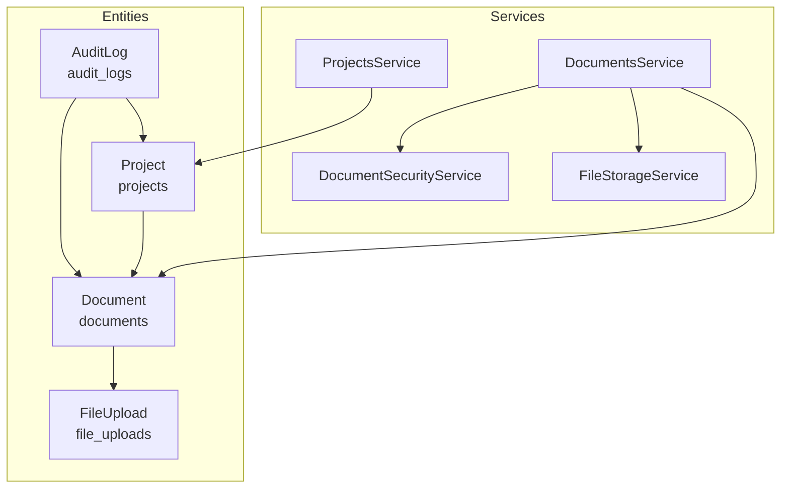
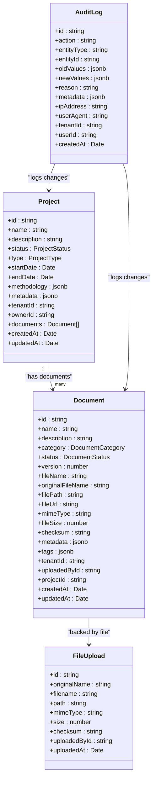
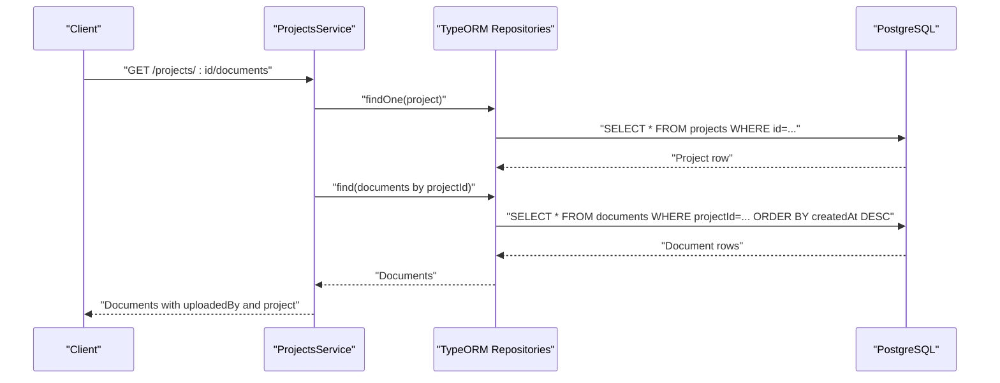
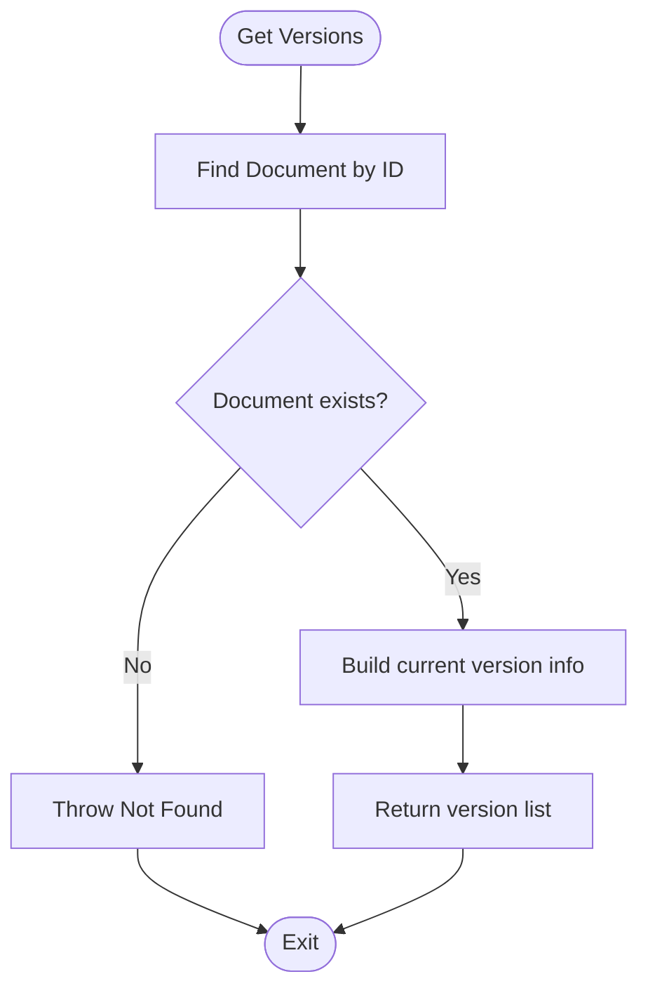
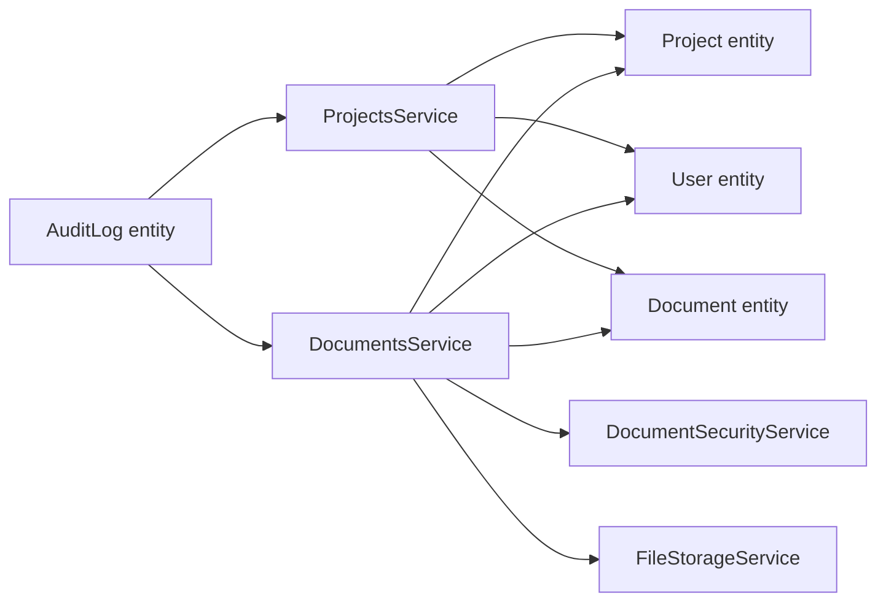

# Project and Document Management Models

<cite>
**Referenced Files in This Document**
- [project.entity.ts](file://apps/backend/src/entities/project.entity.ts)
- [document.entity.ts](file://apps/backend/src/entities/document.entity.ts)
- [file-upload.entity.ts](file://apps/backend/src/entities/file-upload.entity.ts)
- [projects.service.ts](file://apps/backend/src/modules/projects/projects.service.ts)
- [documents.service.ts](file://apps/backend/src/modules/documents/documents.service.ts)
- [document-security.service.ts](file://apps/backend/src/modules/documents/document-security.service.ts)
- [file-storage.service.ts](file://apps/backend/src/modules/file-storage/file-storage.service.ts)
- [project.dto.ts](file://apps/backend/src/modules/projects/dto/project.dto.ts)
- [document.dto.ts](file://apps/backend/src/modules/documents/dto/document.dto.ts)
- [audit-log.entity.ts](file://apps/backend/src/entities/audit-log.entity.ts)
- [database.config.ts](file://apps/backend/src/config/database.config.ts)
</cite>

## Table of Contents
1. [Introduction](#introduction)
2. [Project Structure](#project-structure)
3. [Core Components](#core-components)
4. [Architecture Overview](#architecture-overview)
5. [Detailed Component Analysis](#detailed-component-analysis)
6. [Dependency Analysis](#dependency-analysis)
7. [Performance Considerations](#performance-considerations)
8. [Troubleshooting Guide](#troubleshooting-guide)
9. [Conclusion](#conclusion)
10. [Appendices](#appendices)

## Introduction
This document explains the Project, Document, and FileUpload entities and their relationships within the platform. It covers:
- Hierarchical relationships: projects contain documents; documents are backed by file uploads.
- Key fields: project methodology, status, and timeline; document versioning, categorization, and access control; file metadata and content type.
- Foreign keys, indexes, and soft-delete semantics.
- Validation rules for naming and status transitions.
- Access patterns for retrieving project documentation trees and version histories.
- Caching strategies and performance optimizations for large document queries.
- Security requirements for document confidentiality and audit logging.

## Project Structure
The relevant models and services are organized under the backend module:
- Entities define the relational schema and indexes.
- Services encapsulate business logic for CRUD, validation, and workflows.
- DTOs define input/output contracts for APIs.
- File storage and security services integrate with document workflows.

**Diagram sources**
- [project.entity.ts](file://apps/backend/src/entities/project.entity.ts#L1-L145)
- [document.entity.ts](file://apps/backend/src/entities/document.entity.ts#L1-L157)
- [file-upload.entity.ts](file://apps/backend/src/entities/file-upload.entity.ts#L1-L41)
- [audit-log.entity.ts](file://apps/backend/src/entities/audit-log.entity.ts#L1-L58)
- [projects.service.ts](file://apps/backend/src/modules/projects/projects.service.ts#L1-L860)
- [documents.service.ts](file://apps/backend/src/modules/documents/documents.service.ts#L1-L692)
- [document-security.service.ts](file://apps/backend/src/modules/documents/document-security.service.ts#L1-L595)
- [file-storage.service.ts](file://apps/backend/src/modules/file-storage/file-storage.service.ts#L1-L233)

**Section sources**
- [project.entity.ts](file://apps/backend/src/entities/project.entity.ts#L1-L145)
- [document.entity.ts](file://apps/backend/src/entities/document.entity.ts#L1-L157)
- [file-upload.entity.ts](file://apps/backend/src/entities/file-upload.entity.ts#L1-L41)
- [audit-log.entity.ts](file://apps/backend/src/entities/audit-log.entity.ts#L1-L58)
- [projects.service.ts](file://apps/backend/src/modules/projects/projects.service.ts#L1-L860)
- [documents.service.ts](file://apps/backend/src/modules/documents/documents.service.ts#L1-L692)
- [document-security.service.ts](file://apps/backend/src/modules/documents/document-security.service.ts#L1-L595)
- [file-storage.service.ts](file://apps/backend/src/modules/file-storage/file-storage.service.ts#L1-L233)
- [database.config.ts](file://apps/backend/src/config/database.config.ts#L1-L54)

## Core Components
- Project entity
  - Enumerations: ProjectStatus, ProjectType.
  - Fields: name, description, status, type, startDate, endDate, methodology JSON, metadata JSON, tenantId, owner reference.
  - Relationships: owner (User), documents (Document), calendarEvents, accuApplications, accuInventory, audits, communications.
  - Indexes: composite on status and type; computed helpers for lifecycle checks and duration.
- Document entity
  - Enumerations: DocumentStatus, DocumentCategory.
  - Fields: name, description, category, status, version, fileName, originalFileName, filePath, fileUrl, mimeType, fileSize, checksum, metadata JSON, tags JSON, tenantId, uploadedBy, projectId.
  - Relationships: uploadedBy (User), project (Project).
  - Indexes: category/status, projectId; helper methods for status checks, file extension, and formatted size.
- FileUpload entity
  - Fields: originalName, filename, path, mimeType, size, checksum, uploadedBy, uploadedById, uploadedAt.
  - Relationship: uploadedBy (User).
- AuditLog entity
  - Fields: action, entityType, entityId, oldValues, newValues, reason, metadata, ipAddress, userAgent, tenantId, user, userId, createdAt.
  - Indexes: entityType/entityId, userId, action, createdAt.

Validation and DTOs:
- Project DTOs enforce constraints for name length, UUIDs, dates, enums, and nested methodology structure.
- Document DTOs enforce constraints for categories, statuses, tags, and pagination parameters.

**Section sources**
- [project.entity.ts](file://apps/backend/src/entities/project.entity.ts#L1-L145)
- [document.entity.ts](file://apps/backend/src/entities/document.entity.ts#L1-L157)
- [file-upload.entity.ts](file://apps/backend/src/entities/file-upload.entity.ts#L1-L41)
- [audit-log.entity.ts](file://apps/backend/src/entities/audit-log.entity.ts#L1-L58)
- [project.dto.ts](file://apps/backend/src/modules/projects/dto/project.dto.ts#L1-L695)
- [document.dto.ts](file://apps/backend/src/modules/documents/dto/document.dto.ts#L1-L614)

## Architecture Overview
The system uses a layered architecture:
- Entities define the data model and relationships.
- Services encapsulate business rules, validation, and workflows.
- Controllers (not shown here) expose REST endpoints validated by DTOs.
- File storage and security services integrate with document workflows.
- Audit logs capture changes for compliance.

**Diagram sources**
- [project.entity.ts](file://apps/backend/src/entities/project.entity.ts#L1-L145)
- [document.entity.ts](file://apps/backend/src/entities/document.entity.ts#L1-L157)
- [file-upload.entity.ts](file://apps/backend/src/entities/file-upload.entity.ts#L1-L41)
- [audit-log.entity.ts](file://apps/backend/src/entities/audit-log.entity.ts#L1-L58)

## Detailed Component Analysis

### Project Model
Key fields and behavior:
- Status lifecycle: DRAFT, ACTIVE, ON_HOLD, COMPLETED, CANCELLED with helper methods.
- Timeline: startDate and optional endDate; computed duration in days.
- Methodology: structured JSON with id, name, version, optional url and requirements.
- Multi-tenancy: tenantId for isolation.
- Ownership: owner relationship and ownerId.
- Related collections: documents, calendar events, applications, inventory, audits, communications.

Validation and transitions:
- Status transitions are validated against allowed transitions.
- Activation requires name, type, and start date; audit-type projects require methodology.
- Completion requires at least one document for audit projects and an end date.

Indexes:
- Composite index on status and type to accelerate filtering.
- Computed helpers simplify lifecycle checks.

**Section sources**
- [project.entity.ts](file://apps/backend/src/entities/project.entity.ts#L1-L145)
- [projects.service.ts](file://apps/backend/src/modules/projects/projects.service.ts#L387-L436)
- [projects.service.ts](file://apps/backend/src/modules/projects/projects.service.ts#L743-L790)
- [project.dto.ts](file://apps/backend/src/modules/projects/dto/project.dto.ts#L1-L695)

### Document Model
Key fields and behavior:
- Versioning: integer version incremented on updates.
- Categorization: DocumentCategory enum (methodology, audit_report, compliance_document, evidence, correspondence, other).
- Access control: tenantId and tags for coarse-grained grouping; security scanning and classification levels in workflows.
- Metadata: JSON for arbitrary attributes and extracted text previews.
- File metadata: fileName, originalFileName, filePath, fileUrl, mimeType, fileSize, checksum.
- Relationships: uploadedBy (User), project (Project).

Validation and workflows:
- Security scanning and content validation occur during upload.
- File hashing ensures integrity.
- Version upload increments version and updates metadata with version notes and timestamps.

Indexes:
- category/status composite index.
- projectId index for efficient project-scoped queries.

**Section sources**
- [document.entity.ts](file://apps/backend/src/entities/document.entity.ts#L1-L157)
- [documents.service.ts](file://apps/backend/src/modules/documents/documents.service.ts#L72-L190)
- [documents.service.ts](file://apps/backend/src/modules/documents/documents.service.ts#L332-L415)
- [document-security.service.ts](file://apps/backend/src/modules/documents/document-security.service.ts#L1-L595)
- [document.dto.ts](file://apps/backend/src/modules/documents/dto/document.dto.ts#L1-L614)

### FileUpload Model
Purpose:
- Tracks uploaded files at the storage layer, independent of documents.
- Stores originalName, filename, path, mimeType, size, checksum, and uploadedBy.

Integration:
- Documents reference file storage via filePath and fileUrl; FileUpload records persist metadata for auditing and quotas.

**Section sources**
- [file-upload.entity.ts](file://apps/backend/src/entities/file-upload.entity.ts#L1-L41)
- [file-storage.service.ts](file://apps/backend/src/modules/file-storage/file-storage.service.ts#L1-L233)

### Audit Logging
Purpose:
- Capture actions across entities (Project, Document) with user context, IP, user agent, and timestamps.
- Indexes on entityType/entityId, userId, action, createdAt enable efficient querying.

**Section sources**
- [audit-log.entity.ts](file://apps/backend/src/entities/audit-log.entity.ts#L1-L58)

### Data Access Patterns

#### Retrieving Project Documentation Trees
- Fetch project with owner and documents.
- Order documents by createdAt descending for latest-first presentation.
- Optionally join uploadedBy and project for enriched views.

**Diagram sources**
- [projects.service.ts](file://apps/backend/src/modules/projects/projects.service.ts#L704-L719)

**Section sources**
- [projects.service.ts](file://apps/backend/src/modules/projects/projects.service.ts#L704-L719)

#### Retrieving Document Version Histories
- Current implementation returns the current document as the only version.
- Future enhancement would introduce a dedicated document_versions table and join to track changes.

**Diagram sources**
- [documents.service.ts](file://apps/backend/src/modules/documents/documents.service.ts#L418-L451)

**Section sources**
- [documents.service.ts](file://apps/backend/src/modules/documents/documents.service.ts#L418-L451)

### Validation Rules

#### Project Naming and Status Transitions
- Project name length constraints enforced by DTOs.
- Status transitions validated against allowed transitions.
- Activation requires minimal fields; audit-type projects require methodology.
- Completion requires at least one document for audit projects and an end date.

**Section sources**
- [project.dto.ts](file://apps/backend/src/modules/projects/dto/project.dto.ts#L1-L695)
- [projects.service.ts](file://apps/backend/src/modules/projects/projects.service.ts#L743-L790)

#### Document Naming and Content Validation
- Document name and category constraints enforced by DTOs.
- Security scanning and content validation performed on upload.
- Allowed MIME types and size limits enforced.
- Integrity ensured via checksum calculation.

**Section sources**
- [document.dto.ts](file://apps/backend/src/modules/documents/dto/document.dto.ts#L1-L614)
- [documents.service.ts](file://apps/backend/src/modules/documents/documents.service.ts#L96-L148)
- [document-security.service.ts](file://apps/backend/src/modules/documents/document-security.service.ts#L1-L595)

### Security and Compliance

#### Confidentiality Controls
- Classification levels and access control policies are modeled in workflows.
- Security scanning and content validation reduce risk.
- Audit logs capture actions and metadata for compliance.

**Section sources**
- [document-security.service.ts](file://apps/backend/src/modules/documents/document-security.service.ts#L1-L595)
- [audit-log.entity.ts](file://apps/backend/src/entities/audit-log.entity.ts#L1-L58)

## Dependency Analysis

**Diagram sources**
- [projects.service.ts](file://apps/backend/src/modules/projects/projects.service.ts#L1-L860)
- [documents.service.ts](file://apps/backend/src/modules/documents/documents.service.ts#L1-L692)
- [document-security.service.ts](file://apps/backend/src/modules/documents/document-security.service.ts#L1-L595)
- [file-storage.service.ts](file://apps/backend/src/modules/file-storage/file-storage.service.ts#L1-L233)
- [audit-log.entity.ts](file://apps/backend/src/entities/audit-log.entity.ts#L1-L58)

**Section sources**
- [projects.service.ts](file://apps/backend/src/modules/projects/projects.service.ts#L1-L860)
- [documents.service.ts](file://apps/backend/src/modules/documents/documents.service.ts#L1-L692)
- [document-security.service.ts](file://apps/backend/src/modules/documents/document-security.service.ts#L1-L595)
- [file-storage.service.ts](file://apps/backend/src/modules/file-storage/file-storage.service.ts#L1-L233)
- [audit-log.entity.ts](file://apps/backend/src/entities/audit-log.entity.ts#L1-L58)

## Performance Considerations
- Indexes
  - Project: composite index on status and type.
  - Document: category/status composite index and projectId index.
  - AuditLog: indexes on entityType/entityId, userId, action, createdAt.
- Pagination and filtering
  - Services implement pagination and filtering for both projects and documents.
- Large document queries
  - Prefer selective projections and pagination.
  - Use indexes to minimize scans.
- Caching
  - Frequently accessed project metadata (e.g., stats, analytics) can be cached with TTL.
  - Cache invalidation on write operations for affected keys.
- File storage
  - Enforce size limits and allowed MIME types to prevent oversized or unsafe uploads.
  - Offload file serving to CDN or object storage for scalability.

[No sources needed since this section provides general guidance]

## Troubleshooting Guide
- Project status transition failures
  - Validate that the transition is allowed and preconditions are met (activation and completion rules).
- Document upload failures
  - Check MIME type and size limits; review security scan results and content validation outcomes.
- Missing or slow query results
  - Verify presence of required indexes; confirm pagination parameters and filters.
- Audit trail discrepancies
  - Confirm that audit logs are generated for create/update/delete operations and that indexes are present.

**Section sources**
- [projects.service.ts](file://apps/backend/src/modules/projects/projects.service.ts#L743-L790)
- [documents.service.ts](file://apps/backend/src/modules/documents/documents.service.ts#L96-L148)
- [audit-log.entity.ts](file://apps/backend/src/entities/audit-log.entity.ts#L1-L58)

## Conclusion
The Project, Document, and FileUpload models form a cohesive data layer supporting hierarchical documentation workflows. Strong validation, indexing, and security measures ensure reliability and compliance. Services encapsulate business logic and integrate with file storage and security components. Performance can be optimized through targeted indexes, pagination, and caching strategies.

[No sources needed since this section summarizes without analyzing specific files]

## Appendices

### Foreign Keys and Cascade Behavior
- Project.ownerId references User.id.
- Document.uploadedById references User.id.
- Document.projectId references Project.id.
- FileUpload.uploadedById references User.id.
- AuditLog.userId references User.id.

Cascade behavior:
- No explicit cascade deletes are defined in the referenced files. Soft deletes are used for Projects (status to CANCELLED) and Documents (status to ARCHIVED).

**Section sources**
- [project.entity.ts](file://apps/backend/src/entities/project.entity.ts#L76-L104)
- [document.entity.ts](file://apps/backend/src/entities/document.entity.ts#L86-L106)
- [file-upload.entity.ts](file://apps/backend/src/entities/file-upload.entity.ts#L28-L41)
- [audit-log.entity.ts](file://apps/backend/src/entities/audit-log.entity.ts#L41-L58)
- [projects.service.ts](file://apps/backend/src/modules/projects/projects.service.ts#L370-L385)
- [documents.service.ts](file://apps/backend/src/modules/documents/documents.service.ts#L477-L493)

### Critical Indexes
- Project: status, type composite index.
- Document: category, status composite index; projectId index.
- AuditLog: entityType/entityId, userId, action, createdAt indexes.

**Section sources**
- [project.entity.ts](file://apps/backend/src/entities/project.entity.ts#L34-L36)
- [document.entity.ts](file://apps/backend/src/entities/document.entity.ts#L30-L33)
- [audit-log.entity.ts](file://apps/backend/src/entities/audit-log.entity.ts#L11-L16)

### Data Validation Rules Summary
- Project DTOs enforce name length, UUIDs, dates, enums, and nested methodology structure.
- Document DTOs enforce categories, statuses, tags, and pagination parameters.
- Security scanning validates file type, content, and integrity; enforces allowed MIME types and size limits.

**Section sources**
- [project.dto.ts](file://apps/backend/src/modules/projects/dto/project.dto.ts#L1-L695)
- [document.dto.ts](file://apps/backend/src/modules/documents/dto/document.dto.ts#L1-L614)
- [document-security.service.ts](file://apps/backend/src/modules/documents/document-security.service.ts#L1-L595)
- [file-storage.service.ts](file://apps/backend/src/modules/file-storage/file-storage.service.ts#L193-L215)