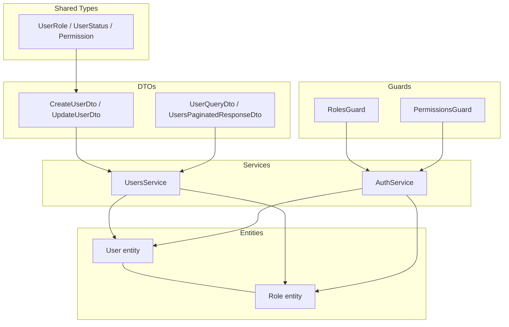
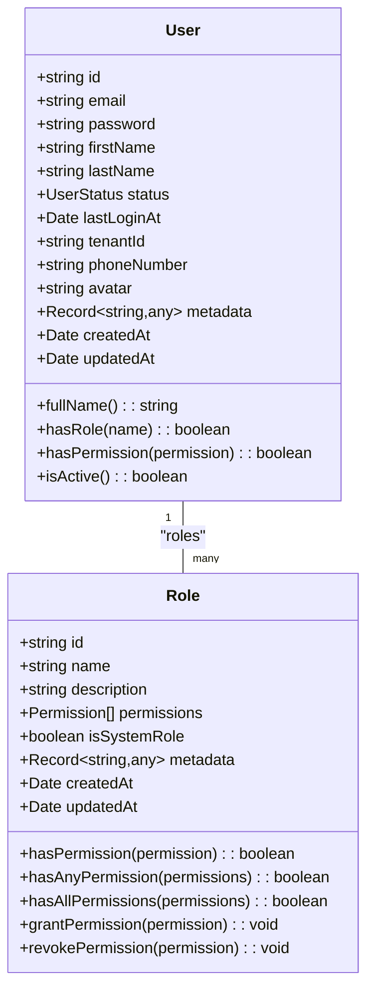
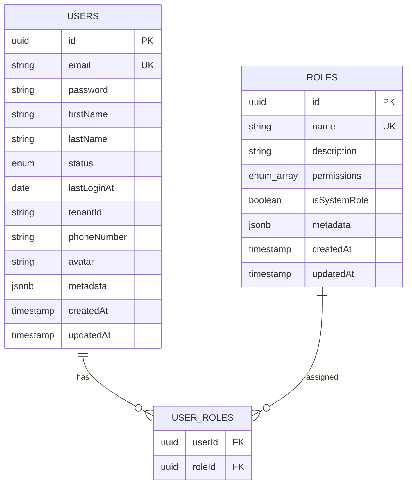
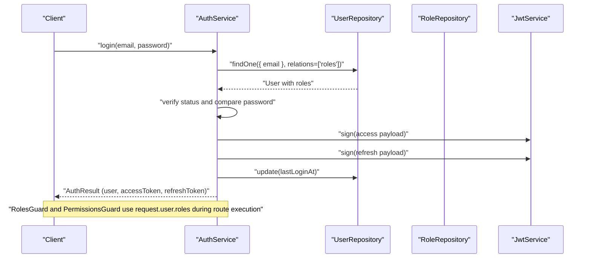
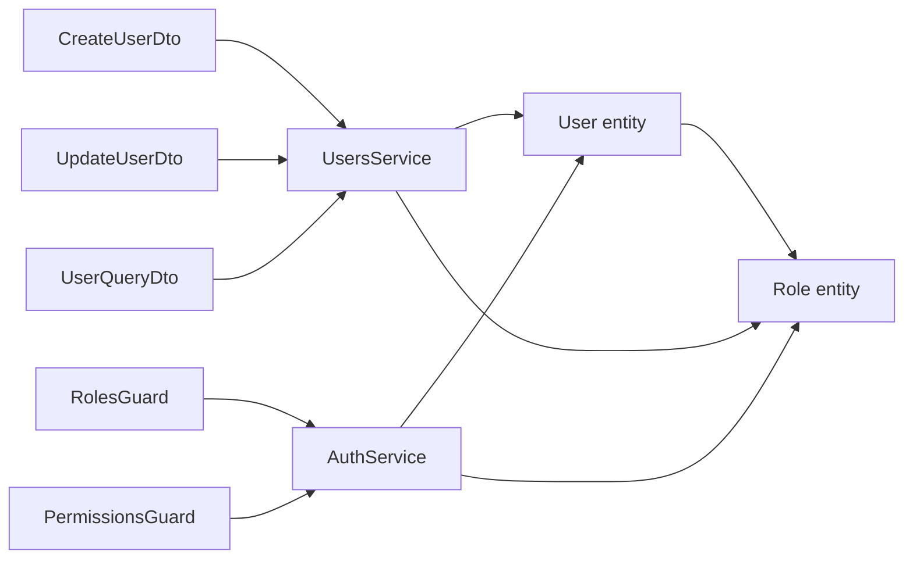

# User and Role Management Models

<cite>
**Referenced Files in This Document**
- [user.entity.ts](file://apps/backend/src/entities/user.entity.ts)
- [role.entity.ts](file://apps/backend/src/entities/role.entity.ts)
- [users.service.ts](file://apps/backend/src/modules/users/users.service.ts)
- [auth.service.ts](file://apps/backend/src/modules/auth/auth.service.ts)
- [roles.guard.ts](file://apps/backend/src/common/guards/roles.guard.ts)
- [permissions.guard.ts](file://apps/backend/src/common/guards/permissions.guard.ts)
- [roles.decorator.ts](file://apps/backend/src/common/decorators/roles.decorator.ts)
- [index.ts](file://apps/backend/src/modules/users/dto/index.ts)
- [types.ts](file://packages/shared/src/types.ts)
- [audit-log.entity.ts](file://apps/backend/src/entities/audit-log.entity.ts)
</cite>

## Table of Contents
1. [Introduction](#introduction)
2. [Project Structure](#project-structure)
3. [Core Components](#core-components)
4. [Architecture Overview](#architecture-overview)
5. [Detailed Component Analysis](#detailed-component-analysis)
6. [Dependency Analysis](#dependency-analysis)
7. [Performance Considerations](#performance-considerations)
8. [Troubleshooting Guide](#troubleshooting-guide)
9. [Conclusion](#conclusion)
10. [Appendices](#appendices)

## Introduction
This document provides comprehensive data model documentation for the User and Role entities, focusing on field definitions, relationships, constraints, and access patterns. It explains how users and roles are modeled with a many-to-many relationship, how role permissions are enforced via guards and JWT tokens, and how to extend roles with custom permissions. It also covers security considerations around password hashing, sensitive data protection, and audit implications of role changes.

## Project Structure
The User and Role models live under the backend entities directory and are consumed by services and guards for authentication and authorization flows. DTOs define request/response shapes and validation rules. Guards enforce role and permission-based access control. Shared types define enums and schemas used across the platform.

**Diagram sources**
- [user.entity.ts](file://apps/backend/src/entities/user.entity.ts#L1-L124)
- [role.entity.ts](file://apps/backend/src/entities/role.entity.ts#L1-L133)
- [users.service.ts](file://apps/backend/src/modules/users/users.service.ts#L1-L397)
- [auth.service.ts](file://apps/backend/src/modules/auth/auth.service.ts#L1-L315)
- [roles.guard.ts](file://apps/backend/src/common/guards/roles.guard.ts#L1-L41)
- [permissions.guard.ts](file://apps/backend/src/common/guards/permissions.guard.ts#L1-L47)
- [index.ts](file://apps/backend/src/modules/users/dto/index.ts#L1-L418)
- [types.ts](file://packages/shared/src/types.ts#L1-L120)

**Section sources**
- [user.entity.ts](file://apps/backend/src/entities/user.entity.ts#L1-L124)
- [role.entity.ts](file://apps/backend/src/entities/role.entity.ts#L1-L133)
- [users.service.ts](file://apps/backend/src/modules/users/users.service.ts#L1-L397)
- [auth.service.ts](file://apps/backend/src/modules/auth/auth.service.ts#L1-L315)
- [roles.guard.ts](file://apps/backend/src/common/guards/roles.guard.ts#L1-L41)
- [permissions.guard.ts](file://apps/backend/src/common/guards/permissions.guard.ts#L1-L47)
- [index.ts](file://apps/backend/src/modules/users/dto/index.ts#L1-L418)
- [types.ts](file://packages/shared/src/types.ts#L1-L120)

## Core Components
- User entity
  - Fields: id, email, password, firstName, lastName, status, lastLoginAt, tenantId, phoneNumber, avatar, metadata, createdAt, updatedAt
  - Relationships: roles (many-to-many), ownedProjects, uploadedDocuments, leadAudits, auditTeamMemberships, communications, notifications, auditLogs
  - Constraints: unique email index; virtual helpers for fullName, role checks, permission checks, and status checks
- Role entity
  - Fields: id, name, description, permissions (enum array), isSystemRole, metadata, createdAt, updatedAt
  - Relationships: users (many-to-many)
  - Constraints: unique name index; helper methods for permission checks and grants
- Services
  - UsersService: CRUD, pagination, filtering, role assignment/revoke, password change, status toggles, stats
  - AuthService: user validation, login/logout token issuance, registration, refresh token handling, profile updates, password change, role assignment/revoke, permission validation
- Guards
  - RolesGuard: enforces role-based access using decorator-provided roles
  - PermissionsGuard: enforces permission-based access using Role permissions
- DTOs
  - CreateUserDto, UpdateUserDto, UserQueryDto, UsersPaginatedResponseDto, ChangeUserPasswordDto
- Shared types
  - UserRole, UserStatus, Permission enums used across the platform

**Section sources**
- [user.entity.ts](file://apps/backend/src/entities/user.entity.ts#L1-L124)
- [role.entity.ts](file://apps/backend/src/entities/role.entity.ts#L1-L133)
- [users.service.ts](file://apps/backend/src/modules/users/users.service.ts#L1-L397)
- [auth.service.ts](file://apps/backend/src/modules/auth/auth.service.ts#L1-L315)
- [roles.guard.ts](file://apps/backend/src/common/guards/roles.guard.ts#L1-L41)
- [permissions.guard.ts](file://apps/backend/src/common/guards/permissions.guard.ts#L1-L47)
- [index.ts](file://apps/backend/src/modules/users/dto/index.ts#L1-L418)
- [types.ts](file://packages/shared/src/types.ts#L1-L120)

## Architecture Overview
The User and Role models form the foundation of authentication and authorization. Users carry roles, which carry permissions. Guards use these relationships to enforce access control. JWT tokens embed user roles for runtime enforcement.

**Diagram sources**
- [user.entity.ts](file://apps/backend/src/entities/user.entity.ts#L1-L124)
- [role.entity.ts](file://apps/backend/src/entities/role.entity.ts#L1-L133)

**Section sources**
- [user.entity.ts](file://apps/backend/src/entities/user.entity.ts#L1-L124)
- [role.entity.ts](file://apps/backend/src/entities/role.entity.ts#L1-L133)

## Detailed Component Analysis

### User Model
- Field definitions
  - Identity: id (UUID primary key)
  - Contact: email (unique), phoneNumber
  - Profile: firstName, lastName, avatar, fullName computed property
  - Status: status (enum), lastLoginAt, tenantId
  - Security: password stored hashed
  - Metadata: metadata (JSONB)
  - Timestamps: createdAt, updatedAt
- Relationship: many-to-many with Role via roles collection
- Access patterns
  - isActive() checks status
  - hasRole(name) and hasPermission(permission) leverage roles collection
- Validation and constraints
  - Unique email index
  - Password hashing handled by services

**Section sources**
- [user.entity.ts](file://apps/backend/src/entities/user.entity.ts#L1-L124)

### Role Model
- Field definitions
  - Identity: id (UUID primary key)
  - Identity: name (unique)
  - Description: description
  - Permissions: permissions (enum array)
  - Flags: isSystemRole
  - Metadata: metadata (JSONB)
  - Timestamps: createdAt, updatedAt
- Relationship: many-to-many with User via users collection
- Access patterns
  - hasPermission(permission), hasAnyPermission(permissions), hasAllPermissions(permissions)
  - grantPermission(permission), revokePermission(permission) for dynamic permission management
- Validation and constraints
  - Unique name index

**Section sources**
- [role.entity.ts](file://apps/backend/src/entities/role.entity.ts#L1-L133)

### Many-to-Many Relationship: Users and Roles
- Join table configuration
  - Table: user_roles
  - Columns: userId (references User.id), roleId (references Role.id)
- Eager loading
  - User.roles loaded eagerly to simplify guard checks and JWT payload building
- Cascade behaviors
  - No explicit cascade options are defined on the many-to-many relationship; removal of a user-role association is handled by service methods that modify the roles collection and save the user

**Diagram sources**
- [user.entity.ts](file://apps/backend/src/entities/user.entity.ts#L60-L80)
- [role.entity.ts](file://apps/backend/src/entities/role.entity.ts#L76-L110)

**Section sources**
- [user.entity.ts](file://apps/backend/src/entities/user.entity.ts#L60-L80)
- [role.entity.ts](file://apps/backend/src/entities/role.entity.ts#L76-L110)

### Authentication and Authorization Flows
- Local strategy validation
  - AuthService.validateUser loads user with roles, verifies account status, and compares hashed passwords
- JWT issuance
  - AuthService.login builds payload with sub, email, roles, tenantId, signs access and refresh tokens, updates lastLoginAt
- Guard enforcement
  - RolesGuard reads required roles from decorator and checks user roles
  - PermissionsGuard delegates to AuthService.validateUserPermissions to check if user has any required permission
- DTO-driven flows
  - UsersService and AuthService accept CreateUserDto, UpdateUserDto, UserQueryDto, ChangeUserPasswordDto

**Diagram sources**
- [auth.service.ts](file://apps/backend/src/modules/auth/auth.service.ts#L46-L96)
- [roles.guard.ts](file://apps/backend/src/common/guards/roles.guard.ts#L1-L41)
- [permissions.guard.ts](file://apps/backend/src/common/guards/permissions.guard.ts#L1-L47)

**Section sources**
- [auth.service.ts](file://apps/backend/src/modules/auth/auth.service.ts#L46-L96)
- [roles.guard.ts](file://apps/backend/src/common/guards/roles.guard.ts#L1-L41)
- [permissions.guard.ts](file://apps/backend/src/common/guards/permissions.guard.ts#L1-L47)

### Data Access Patterns and Queries
- User lookup
  - By ID: UsersService.findOne(id) with relations: ['roles']
  - By email: UsersService.findByEmail(email) with relations: ['roles']
  - By tenantId: UsersService.findAll(options) filters by tenantId
- Filtering and pagination
  - UsersService.findAll applies ILIKE search on firstName/lastName/email, filters by status and role name, sorts by allowed fields, paginates, and returns UsersPaginatedResponseDto
- Role assignment and revocation
  - UsersService.assignRole(userId, roleName) adds role to user.roles and saves
  - UsersService.revokeRole(userId, roleName) removes role from user.roles and saves
- Common queries
  - List users with role filter: queryBuilder.leftJoinAndSelect('user.roles', 'role').andWhere('role.name = :role', { role })
  - Count user stats by status: UsersService.getUserStats(tenantId?)

**Section sources**
- [users.service.ts](file://apps/backend/src/modules/users/users.service.ts#L82-L162)
- [users.service.ts](file://apps/backend/src/modules/users/users.service.ts#L164-L219)
- [users.service.ts](file://apps/backend/src/modules/users/users.service.ts#L286-L332)
- [users.service.ts](file://apps/backend/src/modules/users/users.service.ts#L347-L397)

### Security Considerations
- Password hashing strategy
  - bcrypt is used with 12 rounds for both registration and password changes in both UsersService and AuthService
- Sensitive data protection
  - Password field is excluded from serialization via class-transformer in User entity
  - UsersService.formatUserResponse excludes password from responses
  - AuthService.login returns a user object without password
- Audit implications of role changes
  - There is no dedicated audit log for user-role assignments in the referenced files
  - The AuditLog entity exists and can be used to record role change actions; however, the current services do not emit audit logs for role assignments
  - Recommendation: emit audit logs for role assignment/revoke operations with old/new values and metadata

**Section sources**
- [users.service.ts](file://apps/backend/src/modules/users/users.service.ts#L36-L80)
- [users.service.ts](file://apps/backend/src/modules/users/users.service.ts#L240-L258)
- [auth.service.ts](file://apps/backend/src/modules/auth/auth.service.ts#L98-L140)
- [auth.service.ts](file://apps/backend/src/modules/auth/auth.service.ts#L204-L224)
- [user.entity.ts](file://apps/backend/src/entities/user.entity.ts#L35-L41)
- [audit-log.entity.ts](file://apps/backend/src/entities/audit-log.entity.ts#L1-L58)

### Extending Roles with Custom Permissions
- Add new permissions
  - Extend Permission enum in Role entity
  - Grant permissions to roles using Role.grantPermission or via service methods
- Enforce permissions
  - Use PermissionsGuard with required permissions
  - AuthService.validateUserPermissions checks if user has any required permission
- Best practices
  - Keep permissions granular and aligned with business capabilities
  - Avoid hardcoding permission checks; centralize in guards and services
  - Use Role helper methods for permission checks and grants

**Section sources**
- [role.entity.ts](file://apps/backend/src/entities/role.entity.ts#L12-L74)
- [role.entity.ts](file://apps/backend/src/entities/role.entity.ts#L111-L133)
- [permissions.guard.ts](file://apps/backend/src/common/guards/permissions.guard.ts#L1-L47)
- [auth.service.ts](file://apps/backend/src/modules/auth/auth.service.ts#L300-L315)

### Role Lifecycle Management
- Creating default roles
  - During registration or user creation, roles can be resolved by name; a default 'user' role is used if none provided
- Assigning and revoking roles
  - UsersService.assignRole and revokeRole manage role membership
- Status management
  - UsersService.activateUser/deactivateUser toggle User.status
  - AuthService.validateUser checks status before allowing login
- Soft delete vs. role changes
  - User removal sets status to INACTIVE; role changes do not delete users

**Section sources**
- [users.service.ts](file://apps/backend/src/modules/users/users.service.ts#L51-L80)
- [users.service.ts](file://apps/backend/src/modules/users/users.service.ts#L286-L332)
- [users.service.ts](file://apps/backend/src/modules/users/users.service.ts#L239-L275)
- [auth.service.ts](file://apps/backend/src/modules/auth/auth.service.ts#L46-L67)

## Dependency Analysis
- Entities depend on each other via many-to-many relationship
- Services depend on repositories for User and Role
- Guards depend on AuthService for permission validation and on request.user for roles
- DTOs validate and shape request/response payloads
- Shared types define enums used across services and guards

**Diagram sources**
- [user.entity.ts](file://apps/backend/src/entities/user.entity.ts#L60-L80)
- [role.entity.ts](file://apps/backend/src/entities/role.entity.ts#L76-L110)
- [users.service.ts](file://apps/backend/src/modules/users/users.service.ts#L1-L397)
- [auth.service.ts](file://apps/backend/src/modules/auth/auth.service.ts#L1-L315)
- [roles.guard.ts](file://apps/backend/src/common/guards/roles.guard.ts#L1-L41)
- [permissions.guard.ts](file://apps/backend/src/common/guards/permissions.guard.ts#L1-L47)
- [index.ts](file://apps/backend/src/modules/users/dto/index.ts#L1-L200)

**Section sources**
- [user.entity.ts](file://apps/backend/src/entities/user.entity.ts#L60-L80)
- [role.entity.ts](file://apps/backend/src/entities/role.entity.ts#L76-L110)
- [users.service.ts](file://apps/backend/src/modules/users/users.service.ts#L1-L397)
- [auth.service.ts](file://apps/backend/src/modules/auth/auth.service.ts#L1-L315)
- [roles.guard.ts](file://apps/backend/src/common/guards/roles.guard.ts#L1-L41)
- [permissions.guard.ts](file://apps/backend/src/common/guards/permissions.guard.ts#L1-L47)
- [index.ts](file://apps/backend/src/modules/users/dto/index.ts#L1-L200)

## Performance Considerations
- Eager loading roles on User improves guard performance by avoiding N+1 queries
- Pagination and filtering in UsersService.findAll reduce memory footprint for large datasets
- Using unique indexes on email and role name minimizes lookup overhead
- Consider indexing user.tenantId for multi-tenant queries

[No sources needed since this section provides general guidance]

## Troubleshooting Guide
- Authentication failures
  - Ensure user status is ACTIVE; inactive accounts cannot authenticate
  - Verify password hashing consistency and bcrypt rounds
- Authorization failures
  - Confirm roles are loaded (relations: ['roles']) when checking permissions
  - Ensure PermissionsGuard is applied and required permissions match Role.permissions
- Role assignment errors
  - Check that role exists and user does not already have the role
  - Validate that role name matches unique role.name index

**Section sources**
- [auth.service.ts](file://apps/backend/src/modules/auth/auth.service.ts#L46-L67)
- [users.service.ts](file://apps/backend/src/modules/users/users.service.ts#L286-L332)
- [permissions.guard.ts](file://apps/backend/src/common/guards/permissions.guard.ts#L1-L47)

## Conclusion
The User and Role models provide a robust foundation for authentication and authorization. The many-to-many relationship with eager loading simplifies runtime checks, while guards and DTOs enforce access control and data integrity. Security is strengthened by bcrypt-based password hashing and sensitive field exclusion. Extending roles with custom permissions is straightforward via the Role entity and guards. For improved auditability, consider emitting audit logs for role assignment changes.

[No sources needed since this section summarizes without analyzing specific files]

## Appendices

### Field Definitions and Constraints Summary
- User
  - id: UUID, primary key
  - email: unique, indexed
  - password: hashed, excluded from serialization
  - firstName, lastName, avatar, phoneNumber, tenantId, metadata
  - status: enum (ACTIVE, INACTIVE, SUSPENDED, PENDING)
  - timestamps: createdAt, updatedAt
  - relationships: roles (many-to-many), ownedProjects, uploadedDocuments, leadAudits, auditTeamMemberships, communications, notifications, auditLogs
- Role
  - id: UUID, primary key
  - name: unique, indexed
  - description: optional
  - permissions: enum array
  - isSystemRole: boolean flag
  - timestamps: createdAt, updatedAt
  - relationships: users (many-to-many)

**Section sources**
- [user.entity.ts](file://apps/backend/src/entities/user.entity.ts#L1-L124)
- [role.entity.ts](file://apps/backend/src/entities/role.entity.ts#L1-L133)

### Example Queries and Operations
- Lookup user by email
  - UsersService.findByEmail(email)
- Paginate users with role filter
  - UsersService.findAll({ role: 'roleName', page, limit, sortBy, sortOrder })
- Assign role to user
  - UsersService.assignRole(userId, roleName)
- Revoke role from user
  - UsersService.revokeRole(userId, roleName)
- Change user password
  - UsersService.changePassword(id, ChangeUserPasswordDto)
  - AuthService.changePassword(userId, oldPassword, newPassword)

**Section sources**
- [users.service.ts](file://apps/backend/src/modules/users/users.service.ts#L276-L332)
- [users.service.ts](file://apps/backend/src/modules/users/users.service.ts#L240-L258)
- [auth.service.ts](file://apps/backend/src/modules/auth/auth.service.ts#L204-L224)

### JWT Payload and Guard Integration
- JWT payload includes sub, email, roles[], tenantId
- RolesGuard checks required roles against request.user.roles
- PermissionsGuard checks required permissions via AuthService.validateUserPermissions

**Section sources**
- [auth.service.ts](file://apps/backend/src/modules/auth/auth.service.ts#L75-L96)
- [roles.guard.ts](file://apps/backend/src/common/guards/roles.guard.ts#L1-L41)
- [permissions.guard.ts](file://apps/backend/src/common/guards/permissions.guard.ts#L1-L47)