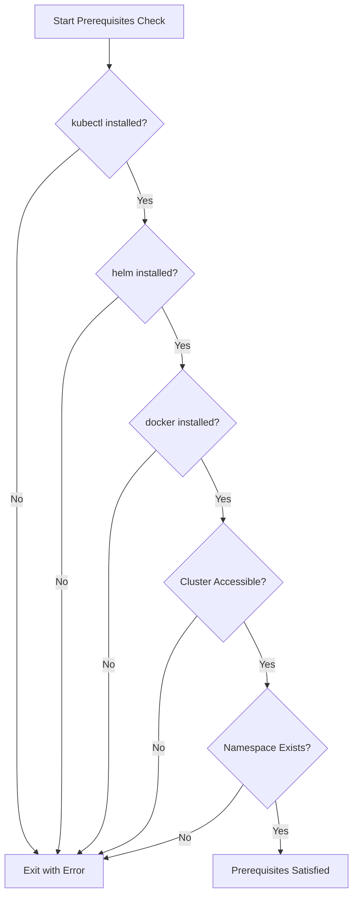
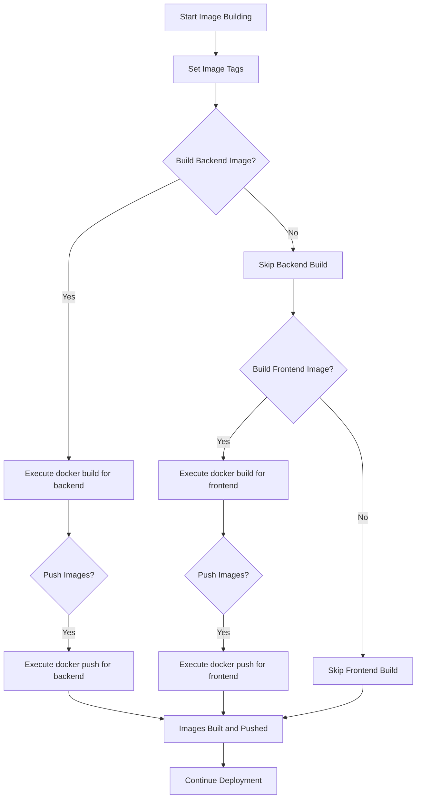
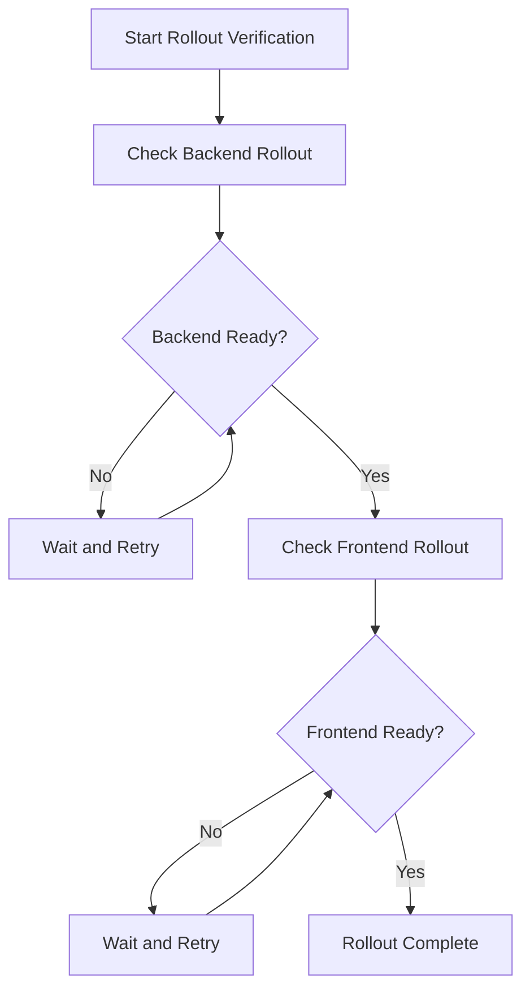
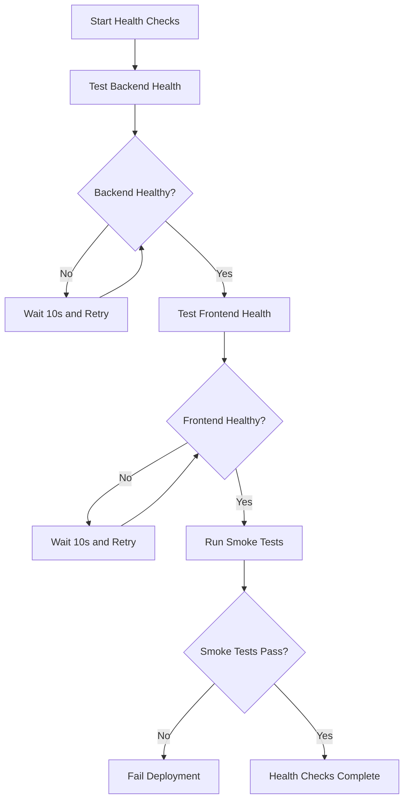
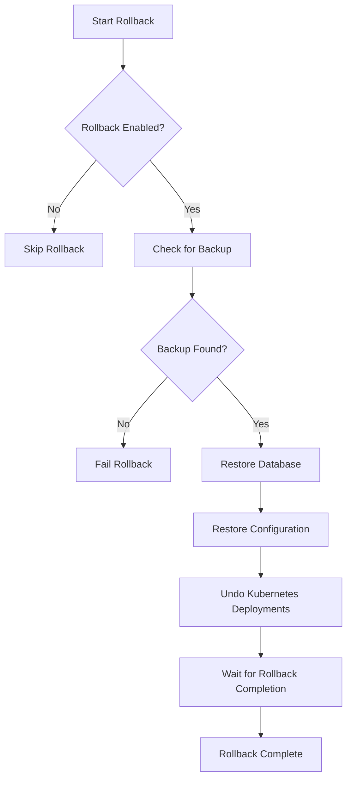
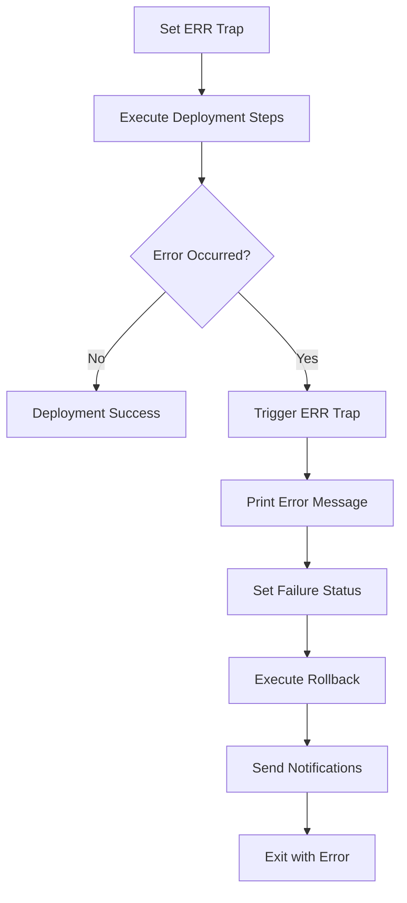
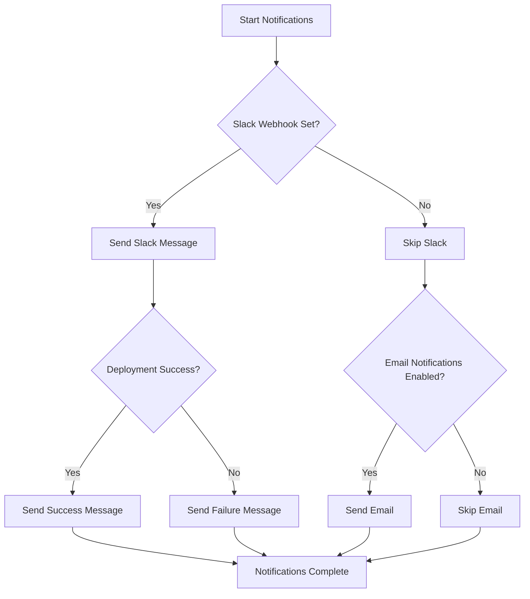
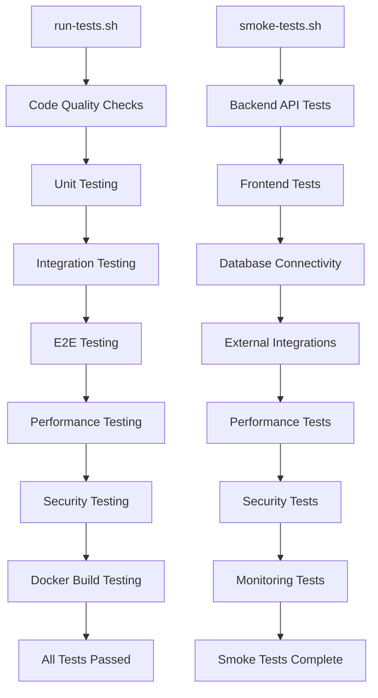
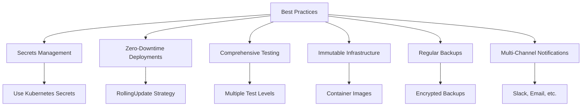

# CI/CD Pipeline

<cite>
**Referenced Files in This Document**   
- [deploy.sh](file://scripts/deploy.sh)
- [run-tests.sh](file://scripts/run-tests.sh)
- [smoke-tests.sh](file://scripts/smoke-tests.sh)
- [backup.sh](file://scripts/backup.sh)
- [notify.sh](file://scripts/notify.sh)
- [backend-deployment.yaml](file://k8s/backend-deployment.yaml)
- [frontend-deployment.yaml](file://k8s/frontend-deployment.yaml)
- [configmaps.yaml](file://k8s/configmaps.yaml)
- [secrets.yaml](file://k8s/secrets.yaml)
- [webhooks.json](file://config/webhooks.json)
- [Dockerfile](file://apps/backend/Dockerfile)
- [Dockerfile](file://apps/frontend/Dockerfile)
- [package.json](file://package.json)
</cite>

## Table of Contents
1. [Introduction](#introduction)
2. [Deployment Automation Script](#deployment-automation-script)
3. [Prerequisites Checking](#prerequisites-checking)
4. [Backup Creation](#backup-creation)
5. [Docker Image Building and Pushing](#docker-image-building-and-pushing)
6. [Kubernetes Manifest Application](#kubernetes-manifest-application)
7. [Rollout Status Verification](#rollout-status-verification)
8. [Health Checks and Smoke Testing](#health-checks-and-smoke-testing)
9. [Rollback Mechanisms](#rollback-mechanisms)
10. [Environment Variables](#environment-variables)
11. [Error Handling with Trap](#error-handling-with-trap)
12. [Notification System](#notification-system)
13. [Test Execution Scripts](#test-execution-scripts)
14. [CI/CD Tool Integration](#ci-cd-tool-integration)
15. [Environment Support](#environment-support)
16. [Common Issues and Troubleshooting](#common-issues-and-troubleshooting)
17. [Best Practices](#best-practices)
18. [Conclusion](#conclusion)

## Introduction
The ACCU Platform employs a comprehensive CI/CD pipeline designed to ensure reliable, secure, and efficient deployments across multiple environments. The pipeline is orchestrated through a series of bash scripts that handle deployment automation, testing, backup, and notification processes. This documentation provides a detailed analysis of the CI/CD operations, focusing on the deployment automation script (deploy.sh) and its integration with other components of the pipeline. The system supports zero-downtime deployments, automated rollback mechanisms, and comprehensive health verification to maintain platform stability and reliability.

## Deployment Automation Script
The deployment automation script (deploy.sh) serves as the central orchestrator for the ACCU Platform's CI/CD pipeline. It coordinates a sequence of operations including prerequisites checking, backup creation, Docker image building, Kubernetes manifest application, rollout verification, health checks, and rollback procedures. The script is designed to be idempotent and resilient, with comprehensive error handling and notification capabilities. It supports multiple environments (development, staging, production) through parameterized execution and environment-specific configurations. The script follows a structured execution flow that ensures deployment integrity and provides detailed logging for audit and troubleshooting purposes.

**Section sources**
- [deploy.sh](file://scripts/deploy.sh#L1-L318)

## Prerequisites Checking
The deployment script begins with a comprehensive prerequisites checking phase that validates the availability and functionality of essential tools and services. This phase verifies the presence of kubectl, helm, and docker commands in the system path, ensuring that the Kubernetes and containerization tools are properly installed. It also tests connectivity to the Kubernetes cluster using kubectl cluster-info and confirms the existence of the target namespace (accu-platform). The prerequisites check is implemented as a dedicated function (check_prerequisites) that performs these validations sequentially and exits with an appropriate error code if any prerequisite is not satisfied. This early validation prevents deployment attempts in incomplete or misconfigured environments, reducing the risk of partial or failed deployments.

**Diagram sources**
- [deploy.sh](file://scripts/deploy.sh#L38-L73)

## Backup Creation
The backup creation process is a critical component of the deployment pipeline, designed to ensure data integrity and enable reliable rollback capabilities. The script implements backup functionality through the create_backup function, which is conditionally executed based on the BACKUP_ENABLED environment variable. For non-development environments, the script creates comprehensive backups including database dumps (using pg_dump), Kubernetes configuration snapshots (using kubectl get all,configmaps,secrets -o yaml), and application state preservation (via Redis BGSAVE). The backup files are timestamped and stored in a designated backups directory, with the latest backup reference maintained in a text file for quick access during rollback operations. This multi-layered backup approach ensures that both data and configuration states are preserved before any deployment changes are applied.

**Section sources**
- [deploy.sh](file://scripts/deploy.sh#L75-L97)
- [backup.sh](file://scripts/backup.sh#L52-L96)

## Docker Image Building and Pushing
The deployment script handles Docker image building and pushing as a core part of the deployment process. It constructs image tags using the GITHUB_SHA environment variable (or 'latest' as fallback) and builds images for both the backend and frontend applications using their respective Dockerfiles. The image building process is implemented in the deploy_application function, which executes docker build commands with appropriate tags. Image pushing to the container registry (GHCR) is conditional, controlled by the PUSH_IMAGES environment variable, allowing for flexibility in different deployment scenarios. The script uses consistent image naming conventions (ghcr.io/accu-platform/backend and ghcr.io/accu-platform/frontend) to ensure proper versioning and traceability. This approach enables reproducible builds and facilitates rollback to previous versions when necessary.

**Diagram sources**
- [deploy.sh](file://scripts/deploy.sh#L104-L117)
- [Dockerfile](file://apps/backend/Dockerfile#L1-L54)
- [Dockerfile](file://apps/frontend/Dockerfile#L1-L56)

## Kubernetes Manifest Application
The deployment script applies Kubernetes manifests to update the platform's infrastructure configuration. This process is implemented in the deploy_application function, which sequentially applies namespace, configuration, secret, and deployment manifests using kubectl apply commands. The script deploys both backend and frontend components, ensuring that all necessary resources are created or updated in the target namespace. The manifest application follows a specific order to establish dependencies correctly, starting with namespace and configuration resources before deploying the application components. This approach ensures that required configurations and secrets are available before the application pods start, preventing startup failures due to missing configuration. The use of declarative manifests enables consistent and reproducible deployments across different environments.

**Section sources**
- [deploy.sh](file://scripts/deploy.sh#L119-L125)
- [backend-deployment.yaml](file://k8s/backend-deployment.yaml#L1-L199)
- [frontend-deployment.yaml](file://k8s/frontend-deployment.yaml#L1-L152)
- [configmaps.yaml](file://k8s/configmaps.yaml#L1-L29)
- [secrets.yaml](file://k8s/secrets.yaml#L1-L105)

## Rollout Status Verification
The deployment script implements rollout status verification to ensure that application updates are successfully deployed and running. This process uses kubectl rollout status commands with configurable timeout periods (controlled by HEALTH_CHECK_TIMEOUT) to monitor the deployment progress of both backend and frontend components. The verification process waits for the Kubernetes deployments to complete their rollout, ensuring that all pods are running and ready according to their readiness probes. This step is critical for preventing premature continuation of the deployment process before the applications are fully operational. The rollout verification provides real-time feedback on the deployment progress and fails the deployment if the timeout is exceeded, triggering the rollback mechanism.

**Diagram sources**
- [deploy.sh](file://scripts/deploy.sh#L127-L134)

## Health Checks and Smoke Testing
The deployment pipeline incorporates comprehensive health checks and smoke testing to validate the functionality of the deployed application. The health_checks function performs HTTP-based health verification for both backend and frontend services, using curl to test the /health endpoints with a configurable timeout period. The script implements a retry mechanism with exponential backoff, attempting health checks up to 30 times with 10-second intervals between attempts. Following successful health checks, the script executes smoke tests by calling the smoke-tests.sh script, which performs a series of functional validations across different components of the application. This multi-layered verification approach ensures that the application is not only running but also functioning correctly after deployment.

**Diagram sources**
- [deploy.sh](file://scripts/deploy.sh#L137-L190)
- [smoke-tests.sh](file://scripts/smoke-tests.sh#L57-L278)

## Rollback Mechanisms
The deployment script implements robust rollback mechanisms to recover from failed deployments and maintain platform availability. The rollback functionality is encapsulated in the rollback_deployment function, which is triggered when health checks fail or other deployment errors occur. The rollback process first verifies the existence of a previous backup by reading the latest_backup.txt file, then restores the database from the SQL dump, reapplies the previous configuration, and executes kubectl rollout undo commands for both backend and frontend deployments. The script waits for the rollback completion using kubectl rollout status with the same timeout as the initial deployment. This comprehensive rollback approach ensures that the platform can quickly recover to a known good state in case of deployment issues, minimizing downtime and data inconsistency.

**Diagram sources**
- [deploy.sh](file://scripts/deploy.sh#L192-L228)

## Environment Variables
The deployment script utilizes a comprehensive set of environment variables to control its behavior and enable configuration across different environments. Key variables include DEPLOY_ENV for specifying the target environment (development, staging, production), BACKUP_ENABLED and ROLLBACK_ENABLED for controlling backup and rollback functionality, HEALTH_CHECK_TIMEOUT for setting the deployment timeout period, and PUSH_IMAGES for determining whether to push images to the container registry. The script also uses SLACK_WEBHOOK_URL for notifications and GITHUB_SHA for image versioning. These environment variables provide flexibility in deployment configuration, allowing the same script to be used across different environments with appropriate parameterization. The variables are documented in the script's help function, making them discoverable for users and CI/CD systems.

**Section sources**
- [deploy.sh](file://scripts/deploy.sh#L7-L12)
- [deploy.sh](file://scripts/deploy.sh#L293-L298)

## Error Handling with Trap
The deployment script implements sophisticated error handling using bash trap functionality to ensure graceful failure and cleanup. The main function sets up an ERR trap that captures any errors during execution and triggers a comprehensive cleanup and rollback sequence. This trap executes when any command in the script fails (due to the set -e directive), invoking the error handling routine that prints an error message, sets the deployment status to failure, executes the rollback procedure, and sends notifications. This approach ensures that even if the deployment fails at any point, the system will attempt to restore a previous stable state and notify stakeholders. The trap mechanism provides a safety net that prevents partial deployments from leaving the system in an inconsistent state.

**Diagram sources**
- [deploy.sh](file://scripts/deploy.sh#L262-L264)

## Notification System
The deployment pipeline includes a comprehensive notification system that provides real-time updates on deployment status through multiple channels. The primary notification mechanism uses Slack webhooks to send messages to designated channels, with different messages for successful deployments and failures. The script also supports email notifications when the EMAIL_NOTIFICATIONS variable is enabled. The notification system is implemented in the send_notifications function, which is called at the end of the deployment process. For successful deployments, it sends a positive confirmation message, while for failures, it alerts the team about the issue and rollback initiation. This multi-channel notification approach ensures that stakeholders are promptly informed of deployment outcomes, enabling rapid response to any issues.

**Diagram sources**
- [deploy.sh](file://scripts/deploy.sh#L231-L253)
- [notify.sh](file://scripts/notify.sh#L57-L430)
- [webhooks.json](file://config/webhooks.json#L1-L76)

## Test Execution Scripts
The CI/CD pipeline incorporates multiple test execution scripts to ensure code quality and functionality before and after deployment. The run-tests.sh script serves as the primary testing orchestrator, performing a comprehensive suite of tests including code quality checks (linting and type checking), unit tests for both backend and frontend components, integration tests, end-to-end tests, performance tests, security audits, and Docker build validation. The smoke-tests.sh script focuses on post-deployment validation, performing functional tests across various components including backend API endpoints, frontend accessibility, database connectivity, external integrations, performance metrics, security headers, and monitoring endpoints. These test scripts are integrated into the deployment pipeline to prevent the deployment of code that fails quality or functionality checks.

**Section sources**
- [run-tests.sh](file://scripts/run-tests.sh#L1-L224)
- [smoke-tests.sh](file://scripts/smoke-tests.sh#L1-L278)

## CI/CD Tool Integration
The ACCU Platform's CI/CD pipeline is designed for integration with standard CI/CD tools and platforms, despite the absence of explicit configuration files in the repository. The deployment scripts are structured to work seamlessly with popular CI/CD systems like GitHub Actions, GitLab CI, or Jenkins through environment variable injection and standardized exit codes. The scripts follow convention over configuration principles, using standard environment variables (like GITHUB_SHA) and producing consistent output that can be captured by CI/CD systems. The modular design of the scripts allows them to be incorporated into larger CI/CD workflows, where run-tests.sh can serve as a pre-deployment gate, deploy.sh as the deployment executor, and smoke-tests.sh as the post-deployment validation step. This integration capability ensures that the pipeline can be easily adopted by different CI/CD platforms.

**Section sources**
- [deploy.sh](file://scripts/deploy.sh#L106-L107)
- [run-tests.sh](file://scripts/run-tests.sh#L28-L30)

## Environment Support
The deployment pipeline supports multiple environments (development, staging, production) through parameterized execution and environment-specific configurations. The DEPLOY_ENV parameter accepts environment names and defaults to production if not specified. The script implements different behaviors based on the target environment, such as disabling backups for development deployments to improve speed. Environment-specific configurations are managed through Kubernetes ConfigMaps and Secrets, with different values applied based on the deployment context. The pipeline also supports environment-specific testing strategies, with more comprehensive testing for staging and production environments compared to development. This multi-environment support enables a progressive deployment strategy, where changes are validated in lower environments before reaching production.

**Section sources**
- [deploy.sh](file://scripts/deploy.sh#L7-L8)
- [deploy.sh](file://scripts/deploy.sh#L268-L270)
- [configmaps.yaml](file://k8s/configmaps.yaml#L7-L29)

## Common Issues and Troubleshooting
The deployment pipeline is designed to handle several common issues that may occur during the deployment process. Deployment timeouts can occur when the HEALTH_CHECK_TIMEOUT period is insufficient for applications to become ready, which can be resolved by increasing the timeout value. Image build failures may result from missing dependencies or code issues, which are typically identified by the run-tests.sh script before deployment. Rollback scenarios are handled automatically when health checks fail, with the system restoring from the previous backup. Other common issues include missing prerequisites (kubectl, helm, docker), cluster connectivity problems, namespace existence, and insufficient permissions. The script provides detailed error messages and logging to assist in troubleshooting these issues, and the comprehensive backup and rollback mechanisms ensure that the system can recover from most deployment problems.

**Section sources**
- [deploy.sh](file://scripts/deploy.sh#L43-L69)
- [deploy.sh](file://scripts/deploy.sh#L156-L158)
- [deploy.sh](file://scripts/deploy.sh#L175-L177)

## Best Practices
The ACCU Platform's CI/CD pipeline implements several best practices for secure and reliable deployments. Secrets management is handled through Kubernetes Secrets and environment variables, ensuring that sensitive information is not hardcoded in the deployment scripts. The pipeline supports zero-downtime deployments through Kubernetes RollingUpdate strategy with maxUnavailable set to 0, ensuring that application availability is maintained during updates. Comprehensive testing at multiple levels (unit, integration, E2E, smoke) provides confidence in deployment quality. The use of immutable infrastructure principles, where deployments are achieved through new container images rather than in-place modifications, enhances reliability and reproducibility. Regular backups with encryption and compression ensure data protection, while multi-channel notifications provide visibility into deployment status. These best practices collectively contribute to a robust and reliable deployment process.

**Diagram sources**
- [secrets.yaml](file://k8s/secrets.yaml#L1-L105)
- [backend-deployment.yaml](file://k8s/backend-deployment.yaml#L10-L16)
- [frontend-deployment.yaml](file://k8s/frontend-deployment.yaml#L10-L16)

## Conclusion
The CI/CD pipeline for the ACCU Platform represents a comprehensive and robust deployment system that prioritizes reliability, security, and maintainability. Through the integration of automated testing, comprehensive backups, health verification, and automatic rollback mechanisms, the pipeline ensures that deployments are both safe and efficient. The modular design of the deployment scripts allows for flexibility across different environments while maintaining consistency in deployment processes. The emphasis on zero-downtime deployments, proper secrets management, and comprehensive monitoring reflects industry best practices in modern software delivery. This pipeline provides a solid foundation for continuous delivery of the ACCU Platform, enabling rapid iteration while maintaining high availability and data integrity.