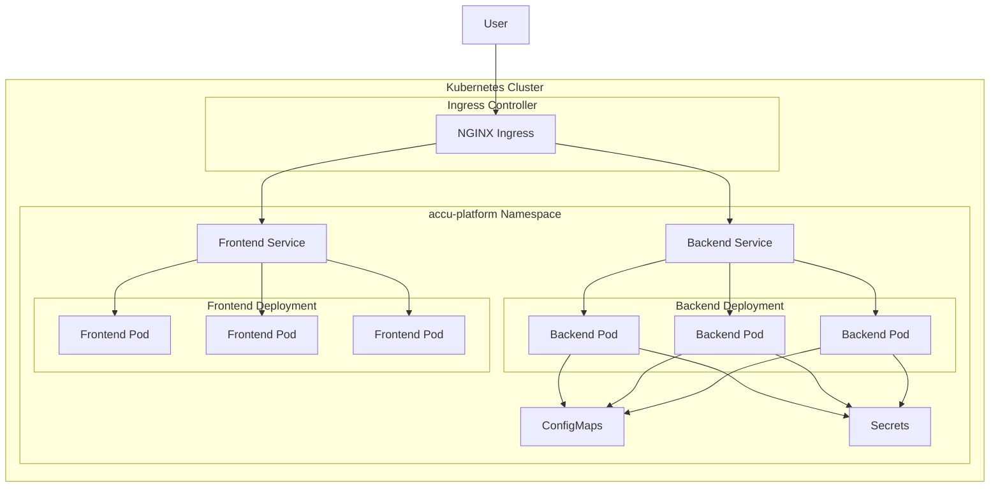
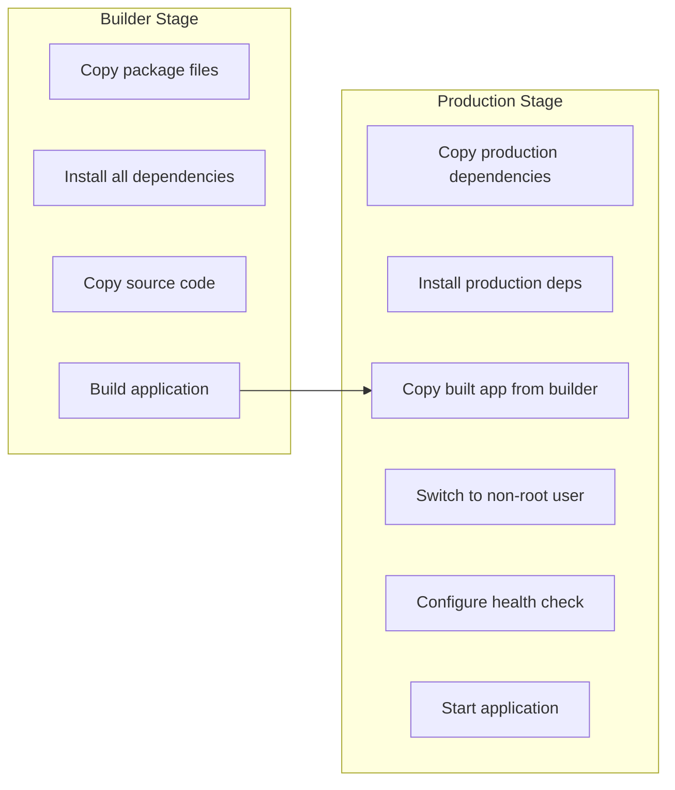
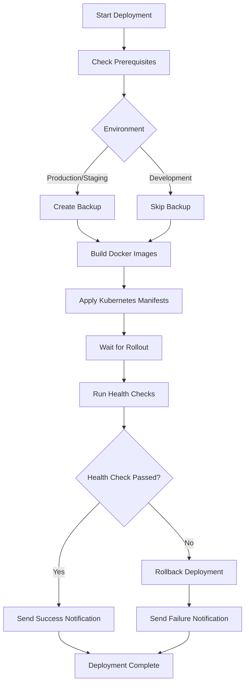
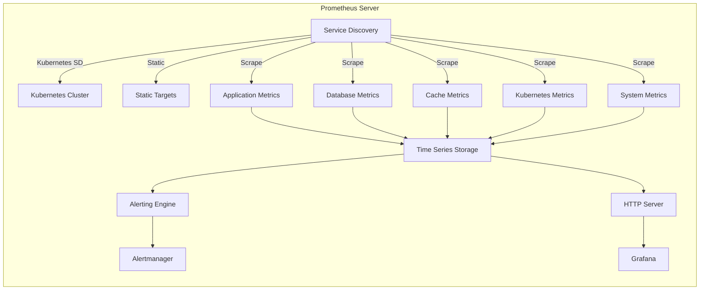
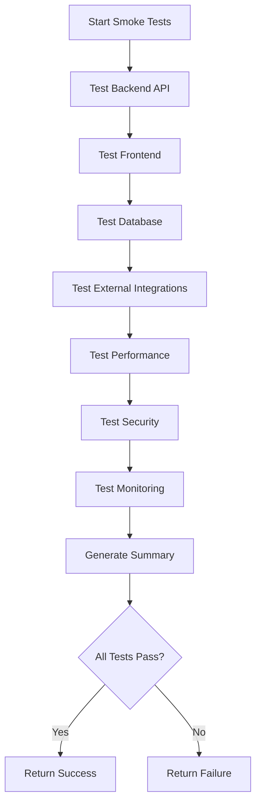
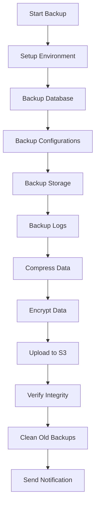

# Deployment & Operations

<cite>
**Referenced Files in This Document**   
- [backend-deployment.yaml](file://k8s/backend-deployment.yaml)
- [frontend-deployment.yaml](file://k8s/frontend-deployment.yaml)
- [configmaps.yaml](file://k8s/configmaps.yaml)
- [secrets.yaml](file://k8s/secrets.yaml)
- [namespace.yaml](file://k8s/namespace.yaml)
- [prometheus.yml](file://monitoring/prometheus/prometheus.yml)
- [alert_rules.yml](file://monitoring/prometheus/alert_rules.yml)
- [alertmanager.yml](file://monitoring/alertmanager/alertmanager.yml)
- [accu-platform-overview.json](file://monitoring/grafana/dashboards/accu-platform-overview.json)
- [deploy.sh](file://scripts/deploy.sh)
- [backup.sh](file://scripts/backup.sh)
- [smoke-tests.sh](file://scripts/smoke-tests.sh)
- [Dockerfile](file://apps/backend/Dockerfile)
- [Dockerfile](file://apps/frontend/Dockerfile)
- [docker-compose.yml](file://docker-compose.yml)
- [ACCU_Platform_Architecture_Diagram.md](file://ACCU_Platform_Architecture_Diagram.md)
- [README.md](file://README.md)
</cite>

## Table of Contents
1. [Introduction](#introduction)
2. [Kubernetes Configuration](#kubernetes-configuration)
3. [Docker Deployment](#docker-deployment)
4. [CI/CD Pipeline](#cicd-pipeline)
5. [Monitoring Setup](#monitoring-setup)
6. [Operational Runbooks](#operational-runbooks)
7. [Disaster Recovery](#disaster-recovery)
8. [Scaling Strategy](#scaling-strategy)
9. [High Availability](#high-availability)
10. [Troubleshooting Guide](#troubleshooting-guide)

## Introduction

The ACCU Platform deployment and operations framework ensures reliable, scalable, and secure operation of the Australian Carbon Credit Units platform. This document details the comprehensive infrastructure and operational procedures that support the platform's mission-critical functions in carbon credit management and compliance tracking.

The deployment architecture follows a microservices pattern with clear separation between frontend and backend components, deployed on Kubernetes for orchestration and scalability. The system incorporates industry-standard practices for containerization, continuous integration and deployment, monitoring, and disaster recovery.

Key operational principles include:
- **Reliability**: Through redundant components and automated health checks
- **Scalability**: Via Kubernetes horizontal pod autoscaling and load balancing
- **Security**: With role-based access control, encrypted secrets, and network policies
- **Observability**: Comprehensive monitoring with Prometheus and Grafana
- **Resilience**: Automated rollback capabilities and regular backup procedures

The platform's operational design supports both development agility and production stability, enabling rapid feature delivery while maintaining system integrity and compliance requirements.

**Section sources**
- [ACCU_Platform_Architecture_Diagram.md](file://ACCU_Platform_Architecture_Diagram.md)
- [README.md](file://README.md)

## Kubernetes Configuration

The ACCU Platform utilizes Kubernetes for container orchestration, providing a robust foundation for deployment, scaling, and management of application components. The Kubernetes configuration implements best practices for security, availability, and maintainability.

### Deployment Configuration

The platform consists of two primary deployments: backend and frontend, each configured with high availability settings. The backend deployment (backend-deployment.yaml) specifies three replicas to ensure service continuity during node failures or maintenance. The rolling update strategy with maxSurge: 1 and maxUnavailable: 0 enables zero-downtime deployments by ensuring new pods are ready before old ones are terminated.

**Diagram sources**
- [backend-deployment.yaml](file://k8s/backend-deployment.yaml)
- [frontend-deployment.yaml](file://k8s/frontend-deployment.yaml)
- [configmaps.yaml](file://k8s/configmaps.yaml)
- [secrets.yaml](file://k8s/secrets.yaml)

### Service and Ingress Configuration

The platform exposes services through a layered networking approach. Internal communication occurs via ClusterIP services, while external access is managed through Ingress resources with TLS termination. The backend service is exposed at api.accu-platform.com with automatic SSL certificate management via cert-manager and Let's Encrypt.

The Ingress configuration includes rate limiting (100 requests per minute) to protect against abuse and ensure fair resource allocation among users. This helps maintain system stability during traffic spikes and prevents denial-of-service scenarios.

### Security Configuration

Security is implemented at multiple levels within the Kubernetes configuration. Pod security contexts enforce non-root execution (runAsNonRoot: true) with a dedicated user ID (1001). Container security contexts drop all capabilities and enforce read-only root filesystems to minimize the attack surface.

The configuration uses Kubernetes Secrets for sensitive data (database credentials, API keys, JWT secrets) and ConfigMaps for non-sensitive configuration. A dedicated service account (accu-platform-sa) with least-privilege RBAC permissions provides controlled access to cluster resources.

**Section sources**
- [backend-deployment.yaml](file://k8s/backend-deployment.yaml)
- [frontend-deployment.yaml](file://k8s/frontend-deployment.yaml)
- [secrets.yaml](file://k8s/secrets.yaml)
- [configmaps.yaml](file://k8s/configmaps.yaml)
- [namespace.yaml](file://k8s/namespace.yaml)

## Docker Deployment

The ACCU Platform utilizes Docker for containerization, enabling consistent deployment across development, staging, and production environments. The Docker configuration follows security and performance best practices.

### Backend Docker Configuration

The backend Dockerfile implements a multi-stage build process to optimize image size and security. The build stage uses Node.js 18 Alpine to compile the TypeScript application, while the production stage uses a minimal Alpine base image with only production dependencies.

**Diagram sources**
- [Dockerfile](file://apps/backend/Dockerfile)

The production image runs as a non-root user (UID 1001) to reduce the impact of potential security vulnerabilities. The health check configuration aligns with Kubernetes liveness and readiness probes, ensuring consistent health assessment across the stack.

### Frontend Docker Configuration

The frontend Dockerfile follows a similar multi-stage pattern, building the Next.js application in the first stage and deploying it in a minimal production environment. The production stage includes curl for health checks and dumb-init for proper signal handling and process management.

Both Docker configurations use Alpine Linux for minimal footprint and reduced attack surface. The images are tagged with the Git commit SHA for traceability and version control.

### Local Development with Docker Compose

For local development and testing, the platform provides a docker-compose.yml file that orchestrates all required services:
- PostgreSQL 15 database
- Redis 7 for caching and sessions
- Backend API service
- Frontend application
- Traefik reverse proxy
- Prometheus monitoring
- Grafana dashboard
- ELK stack for logging

This local environment mirrors the production architecture, enabling developers to test features in a realistic setting before deployment.

**Section sources**
- [Dockerfile](file://apps/backend/Dockerfile)
- [Dockerfile](file://apps/frontend/Dockerfile)
- [docker-compose.yml](file://docker-compose.yml)

## CI/CD Pipeline

The ACCU Platform implements a robust CI/CD pipeline through the deploy.sh script, automating the deployment process while ensuring reliability and rollback capabilities.

### Deployment Automation

The deployment script (deploy.sh) follows a comprehensive workflow:
1. Prerequisite validation (kubectl, helm, docker, cluster connectivity)
2. Backup creation (database, configuration, application state)
3. Docker image building and optional registry push
4. Kubernetes manifest application
5. Rollout status verification
6. Health checks and smoke testing
7. Notification dispatch

**Diagram sources**
- [deploy.sh](file://scripts/deploy.sh)

### Rollback Mechanism

The deployment system includes automated rollback capabilities for production stability. If health checks or smoke tests fail, the system automatically:
1. Restores the database from the pre-deployment backup
2. Restores configuration from the backup
3. Rolls back Kubernetes deployments using kubectl rollout undo
4. Notifies the operations team of the failure

This ensures minimal downtime and rapid recovery from failed deployments.

### Environment Variables

The deployment process supports configurable parameters through environment variables:
- BACKUP_ENABLED: Toggle backup creation
- ROLLBACK_ENABLED: Enable/disable automated rollback
- HEALTH_CHECK_TIMEOUT: Timeout for rollout status checks
- PUSH_IMAGES: Whether to push images to the registry
- SLACK_WEBHOOK_URL: Endpoint for deployment notifications

**Section sources**
- [deploy.sh](file://scripts/deploy.sh)

## Monitoring Setup

The ACCU Platform implements comprehensive monitoring with Prometheus for metrics collection, Alertmanager for alert routing, and Grafana for visualization.

### Prometheus Configuration

The Prometheus configuration (prometheus.yml) scrapes metrics from multiple sources:
- Application metrics from backend and frontend services
- Database metrics from PostgreSQL
- Cache metrics from Redis
- Kubernetes cluster metrics (API servers, nodes, pods)
- System metrics via Node Exporter and cAdvisor

**Diagram sources**
- [prometheus.yml](file://monitoring/prometheus/prometheus.yml)

### Alerting Rules

The platform implements a comprehensive alerting strategy through alert_rules.yml, categorized by severity:

**Critical Alerts** (immediate response required):
- ServiceDown: Any service unavailable for >1 minute
- BackendHighErrorRate: >10% error rate in backend API
- PostgreSQLDown: Database unavailable
- RedisDown: Cache service down
- HighDiskUsage: >90% disk usage

**Warning Alerts** (investigate and resolve):
- BackendHighResponseTime: 95th percentile >500ms
- PostgreSQLTooManyConnections: >80% of max connections
- RedisHighMemoryUsage: >90% memory usage
- HighCPUUsage: >80% CPU utilization
- HighMemoryUsage: >85% memory usage

**Info Alerts** (monitor trends):
- LowUserActivity: Login rate below threshold
- HighDocumentUploadFailure: >20% failure rate

### Alert Routing

Alertmanager (alertmanager.yml) routes alerts based on severity to appropriate channels:
- **Critical alerts**: Email, Slack (#alerts-critical), Discord (with danger color)
- **Warning alerts**: Email, Slack (#alerts-warning)
- **Info alerts**: Email, Slack (#alerts-info)

The configuration includes inhibition rules to prevent alert storms. For example, if a ServiceDown alert is firing, related alerts like BackendHighResponseTime are suppressed to avoid notification overload.

### Grafana Dashboards

The platform includes a comprehensive Grafana dashboard (accu-platform-overview.json) with key metrics:
- System status (service availability)
- Request rate and response time
- Error rates
- Database connections
- Redis memory usage
- System resource utilization (CPU, memory, disk)
- Active user metrics

The dashboard supports environment filtering and auto-refresh for real-time monitoring.

**Section sources**
- [prometheus.yml](file://monitoring/prometheus/prometheus.yml)
- [alert_rules.yml](file://monitoring/prometheus/alert_rules.yml)
- [alertmanager.yml](file://monitoring/alertmanager/alertmanager.yml)
- [accu-platform-overview.json](file://monitoring/grafana/dashboards/accu-platform-overview.json)

## Operational Runbooks

The ACCU Platform includes comprehensive operational runbooks for routine and emergency procedures.

### Routine Operations

**Daily Checks:**
1. Verify all services are running (kubectl get pods)
2. Check dashboard for any active alerts
3. Review application logs for errors
4. Verify backup completion

**Weekly Tasks:**
1. Test backup restoration process
2. Review security logs
3. Check for software updates
4. Validate disaster recovery plan

### Incident Response

**Service Outage Procedure:**
1. Verify outage scope (single service vs. entire platform)
2. Check monitoring dashboards for root cause
3. Review recent deployment history
4. Check resource utilization (CPU, memory, disk)
5. Restart affected services if appropriate
6. Roll back recent deployment if issue persists
7. Notify stakeholders of status and ETA

**High Error Rate:**
1. Identify affected endpoints from metrics
2. Check for database connection issues
3. Verify external service connectivity
4. Review recent code changes
5. Scale affected services if under load
6. Implement rate limiting if under attack

### Smoke Testing

The smoke-tests.sh script verifies deployment integrity through automated checks:
- Backend API endpoints (health, documentation, auth)
- Frontend accessibility and static assets
- Database connectivity
- External integrations (email, file storage, CER API)
- Performance benchmarks
- Security headers
- Monitoring endpoints

**Diagram sources**
- [smoke-tests.sh](file://scripts/smoke-tests.sh)

**Section sources**
- [smoke-tests.sh](file://scripts/smoke-tests.sh)

## Disaster Recovery

The ACCU Platform implements a comprehensive disaster recovery strategy through regular backups and restoration procedures.

### Backup Strategy

The backup.sh script performs full platform backups with the following components:
- **Database**: PostgreSQL dump with pg_dump
- **Configurations**: Kubernetes resources (deployments, services, configmaps, secrets)
- **Storage**: File uploads from S3 or local storage
- **Logs**: Application and system logs

**Diagram sources**
- [backup.sh](file://scripts/backup.sh)

### Encryption and Security

Backups are secured with multiple layers:
- **Encryption**: AES256 encryption with GPG using randomly generated keys
- **Compression**: Gzip compression to reduce storage costs
- **Retention**: 30-day retention policy with automatic cleanup
- **Access Control**: Encrypted keys stored separately from backup data

### Restoration Procedure

In the event of data loss or corruption:
1. Identify the most recent valid backup
2. Restore database from SQL dump
3. Restore Kubernetes configurations
4. Restore file storage from archive
5. Verify data integrity
6. Restart services
7. Validate functionality with smoke tests

The backup system generates a manifest file for each backup, documenting the backup timestamp, components, size, and storage location for audit purposes.

**Section sources**
- [backup.sh](file://scripts/backup.sh)

## Scaling Strategy

The ACCU Platform implements a multi-layered scaling strategy to handle varying loads while maintaining performance and cost efficiency.

### Horizontal Pod Autoscaling

The platform uses Kubernetes Horizontal Pod Autoscaler (HPA) to automatically adjust the number of pod replicas based on CPU and memory utilization. The current configuration maintains three replicas for both backend and frontend services, with the ability to scale up during traffic spikes.

### Resource Management

Resource requests and limits are configured to ensure fair allocation:
- **Backend**: 512Mi memory request, 1Gi limit; 250m CPU request, 500m limit
- **Frontend**: 256Mi memory request, 512Mi limit; 100m CPU request, 200m limit

These values balance performance requirements with cluster efficiency, preventing any single service from consuming excessive resources.

### Database Scaling

The PostgreSQL database is configured for high availability with master-replica replication. Read queries can be distributed across replicas to improve performance, while write operations are directed to the master node.

### Caching Strategy

Redis is used for multiple caching purposes:
- Session storage
- API response caching
- Frequently accessed data
- Rate limiting counters

This reduces database load and improves response times for common operations.

**Section sources**
- [backend-deployment.yaml](file://k8s/backend-deployment.yaml)
- [frontend-deployment.yaml](file://k8s/frontend-deployment.yaml)
- [ACCU_Platform_Architecture_Diagram.md](file://ACCU_Platform_Architecture_Diagram.md)

## High Availability

The ACCU Platform is designed for high availability with multiple redundancy mechanisms.

### Multi-Zone Deployment

The Kubernetes cluster is deployed across multiple availability zones to protect against zone failures. Pod anti-affinity rules ensure that replicas are distributed across different nodes and zones.

### Health Probes

Comprehensive health checking is implemented at multiple levels:
- **Liveness Probes**: Detect when containers need restart
- **Readiness Probes**: Determine when pods are ready to receive traffic
- **Startup Probes**: Handle slow-starting containers

The backend service uses separate endpoints for liveness (/health) and readiness (/health/ready), allowing independent assessment of service health and readiness.

### Traffic Management

The platform uses NGINX Ingress with TLS termination and rate limiting to manage incoming traffic. The ingress controller distributes requests across available pods using round-robin load balancing.

### Failover Procedures

Automated failover is implemented through:
- Kubernetes self-healing (restarting failed pods)
- Service discovery (automatically routing around failed instances)
- Database replication (automatic failover to replica)
- DNS failover (via cloud provider)

**Section sources**
- [backend-deployment.yaml](file://k8s/backend-deployment.yaml)
- [frontend-deployment.yaml](file://k8s/frontend-deployment.yaml)
- [ACCU_Platform_Architecture_Diagram.md](file://ACCU_Platform_Architecture_Diagram.md)

## Troubleshooting Guide

This section provides guidance for diagnosing and resolving common issues with the ACCU Platform.

### Common Issues and Solutions

**Service Not Responding:**
1. Check pod status: `kubectl get pods -n accu-platform`
2. Review pod logs: `kubectl logs <pod-name> -n accu-platform`
3. Verify service configuration: `kubectl get service -n accu-platform`
4. Check resource limits and requests
5. Examine liveness and readiness probe configuration

**High Response Times:**
1. Check database performance and connection pool
2. Review Redis cache hit rate
3. Analyze application logs for slow operations
4. Check for memory pressure or CPU throttling
5. Verify network connectivity between services

**Deployment Failures:**
1. Check image availability in registry
2. Verify secret and configmap existence
3. Review resource requirements vs. cluster capacity
4. Check persistent volume claims
5. Validate environment variable configuration

### Diagnostic Commands

Essential troubleshooting commands:
- `kubectl describe pod <pod-name>`: Detailed pod information
- `kubectl exec -it <pod-name> -- sh`: Access container shell
- `kubectl port-forward <pod-name> 3000`: Local port forwarding
- `kubectl get events --sort-by=.metadata.creationTimestamp`: Recent cluster events
- `kubectl top pods`: Resource utilization

### Log Analysis

Application logs are structured for easy analysis:
- Error logs include stack traces and context
- Access logs follow standard format for parsing
- Audit logs capture user actions and system events
- Logs are aggregated to centralized logging system

When investigating issues, focus on correlated events across multiple services and time periods to identify root causes.

**Section sources**
- [backend-deployment.yaml](file://k8s/backend-deployment.yaml)
- [frontend-deployment.yaml](file://k8s/frontend-deployment.yaml)
- [deploy.sh](file://scripts/deploy.sh)
- [smoke-tests.sh](file://scripts/smoke-tests.sh)