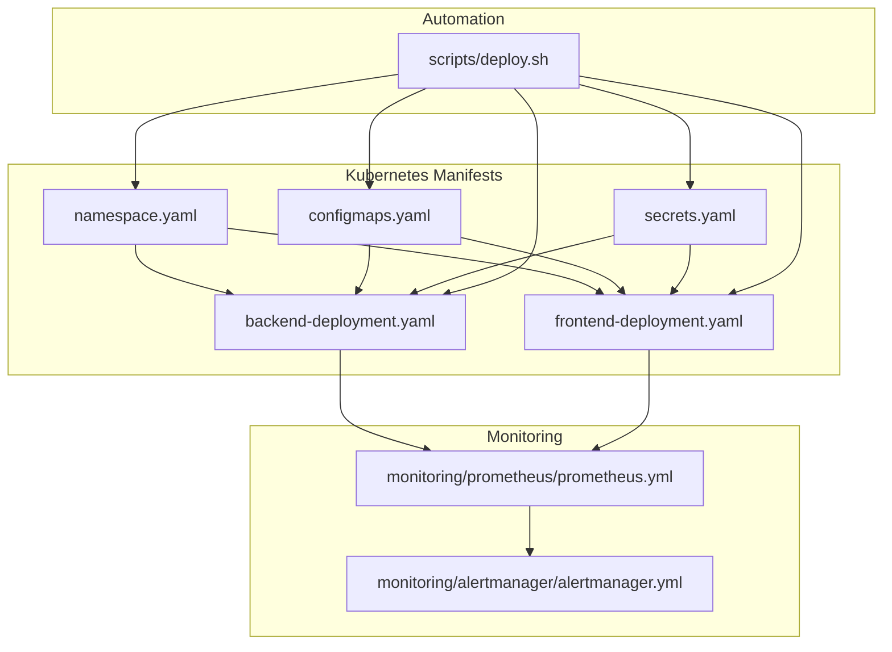
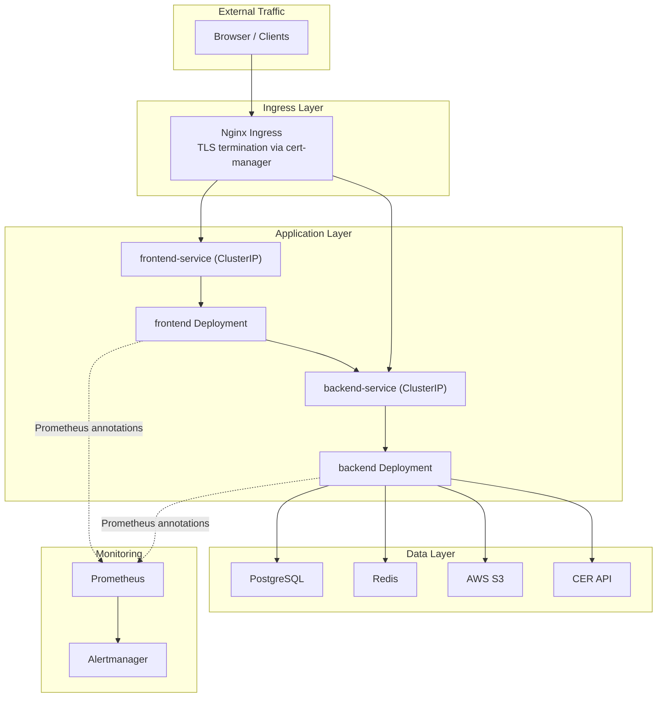
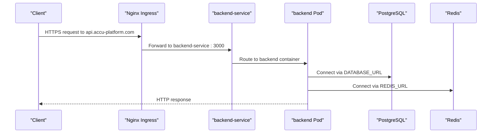
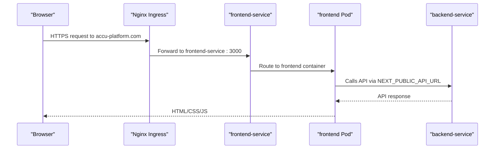
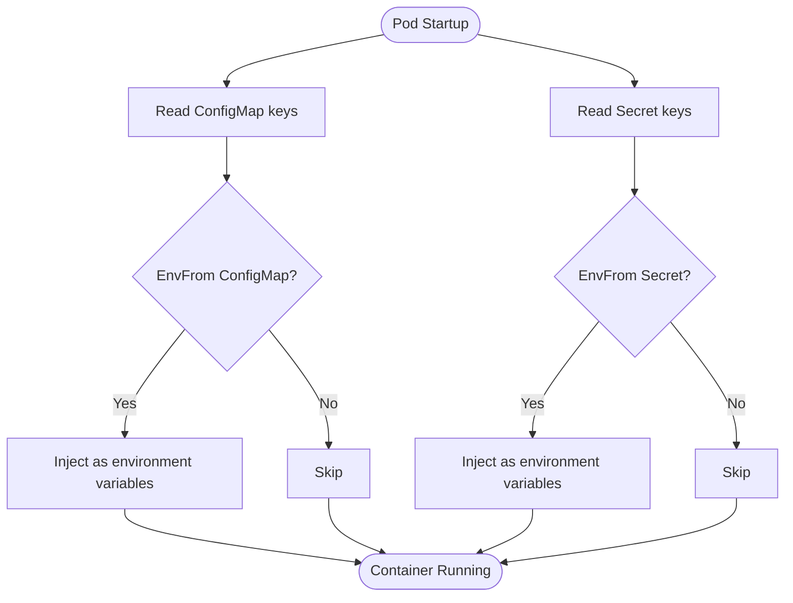
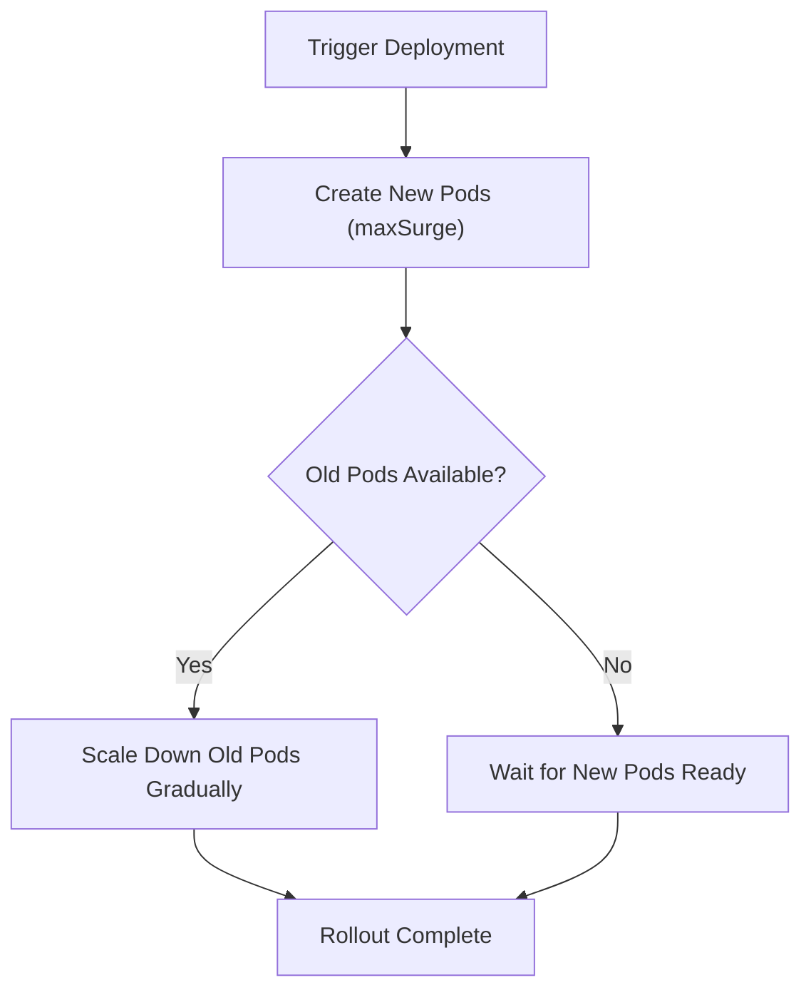
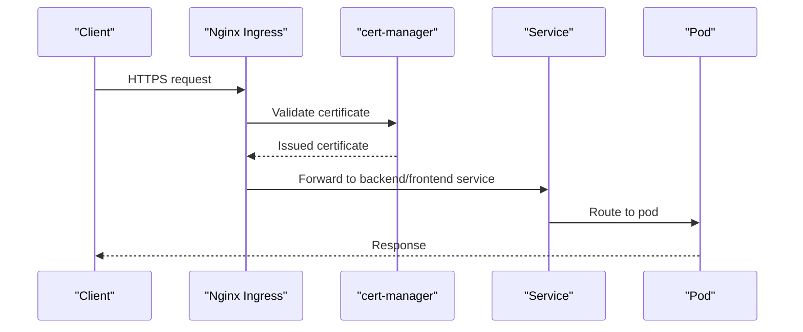
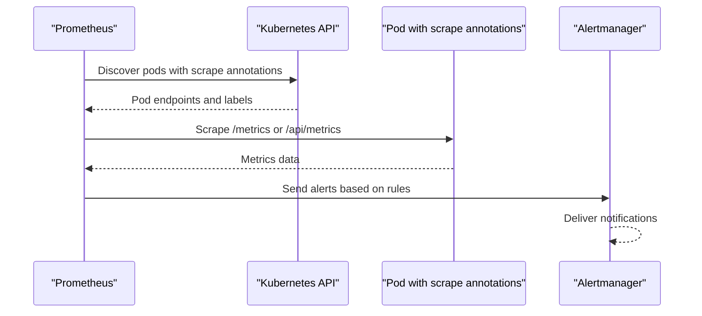
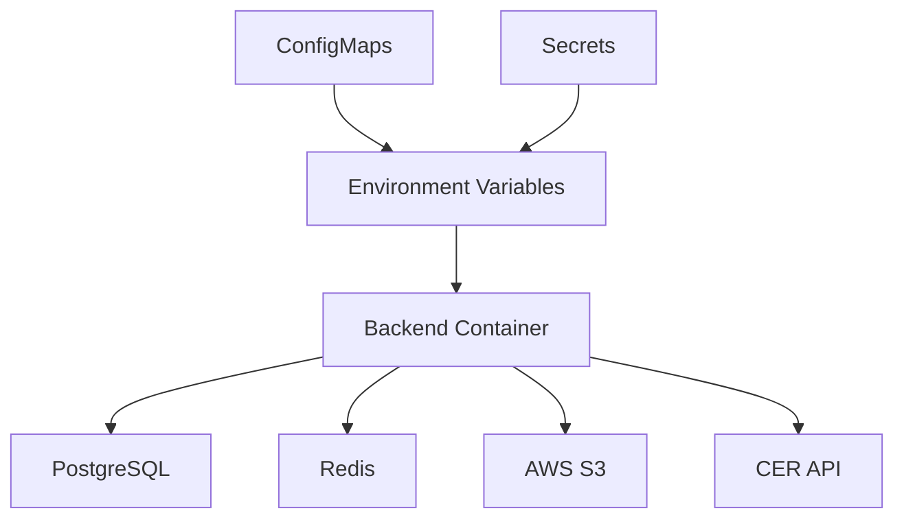
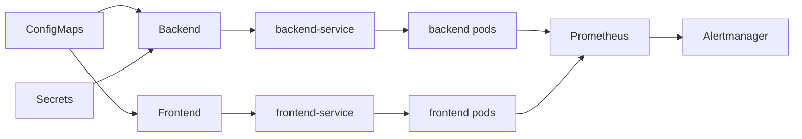

# Kubernetes Configuration

<cite>
**Referenced Files in This Document**
- [namespace.yaml](file://k8s/namespace.yaml)
- [configmaps.yaml](file://k8s/configmaps.yaml)
- [secrets.yaml](file://k8s/secrets.yaml)
- [backend-deployment.yaml](file://k8s/backend-deployment.yaml)
- [frontend-deployment.yaml](file://k8s/frontend-deployment.yaml)
- [prometheus.yml](file://monitoring/prometheus/prometheus.yml)
- [alertmanager.yml](file://monitoring/alertmanager/alertmanager.yml)
- [security-policy.yml](file://security/security-policy.yml)
- [deploy.sh](file://scripts/deploy.sh)
- [Dockerfile.backend](file://apps/backend/Dockerfile)
- [Dockerfile.frontend](file://apps/frontend/Dockerfile)
</cite>

## Table of Contents
1. [Introduction](#introduction)
2. [Project Structure](#project-structure)
3. [Core Components](#core-components)
4. [Architecture Overview](#architecture-overview)
5. [Detailed Component Analysis](#detailed-component-analysis)
6. [Dependency Analysis](#dependency-analysis)
7. [Performance Considerations](#performance-considerations)
8. [Troubleshooting Guide](#troubleshooting-guide)
9. [Conclusion](#conclusion)
10. [Appendices](#appendices)

## Introduction
This document describes the Kubernetes configuration for the ACCU Platform, focusing on the deployment manifests for backend and frontend applications, services, and ingress. It explains pod specifications, container configurations, resource limits, liveness and readiness probes, security contexts, and the use of ConfigMaps and Secrets for environment configuration and sensitive data. It also covers rolling updates for zero-downtime deployments, ingress-based network policies with TLS termination, Prometheus monitoring annotations, and integration with external systems such as the database, email, and CER API. Practical examples are provided via file references to the actual YAML manifests.

## Project Structure
The Kubernetes manifests are organized under the k8s directory, with separate files for namespace, ConfigMaps, Secrets, backend deployment, and frontend deployment. Monitoring configuration resides under monitoring, and deployment automation is handled by a shell script.

**Diagram sources**
- [namespace.yaml](file://k8s/namespace.yaml#L1-L23)
- [configmaps.yaml](file://k8s/configmaps.yaml#L1-L29)
- [secrets.yaml](file://k8s/secrets.yaml#L1-L105)
- [backend-deployment.yaml](file://k8s/backend-deployment.yaml#L1-L199)
- [frontend-deployment.yaml](file://k8s/frontend-deployment.yaml#L1-L152)
- [prometheus.yml](file://monitoring/prometheus/prometheus.yml#L1-L153)
- [alertmanager.yml](file://monitoring/alertmanager/alertmanager.yml#L1-L140)
- [deploy.sh](file://scripts/deploy.sh#L1-L318)

**Section sources**
- [namespace.yaml](file://k8s/namespace.yaml#L1-L23)
- [configmaps.yaml](file://k8s/configmaps.yaml#L1-L29)
- [secrets.yaml](file://k8s/secrets.yaml#L1-L105)
- [backend-deployment.yaml](file://k8s/backend-deployment.yaml#L1-L199)
- [frontend-deployment.yaml](file://k8s/frontend-deployment.yaml#L1-L152)
- [prometheus.yml](file://monitoring/prometheus/prometheus.yml#L1-L153)
- [alertmanager.yml](file://monitoring/alertmanager/alertmanager.yml#L1-L140)
- [deploy.sh](file://scripts/deploy.sh#L1-L318)

## Core Components
- Namespaces: Dedicated namespaces for production, staging, and development environments.
- ConfigMaps: Provide non-sensitive configuration values such as API URLs, ports, and feature flags.
- Secrets: Store sensitive data including database credentials, JWT secrets, email credentials, AWS S3 keys, and CER API credentials.
- Deployments: Backend and frontend deployments with rolling update strategy, resource requests/limits, probes, and security contexts.
- Services: ClusterIP services expose backend and frontend pods internally.
- Ingress: Nginx ingress with TLS termination managed by cert-manager, rate limiting, and SSL redirect.
- Monitoring: Prometheus scraping annotations on pods and Alertmanager configuration for notifications.

**Section sources**
- [namespace.yaml](file://k8s/namespace.yaml#L1-L23)
- [configmaps.yaml](file://k8s/configmaps.yaml#L1-L29)
- [secrets.yaml](file://k8s/secrets.yaml#L1-L105)
- [backend-deployment.yaml](file://k8s/backend-deployment.yaml#L1-L199)
- [frontend-deployment.yaml](file://k8s/frontend-deployment.yaml#L1-L152)
- [prometheus.yml](file://monitoring/prometheus/prometheus.yml#L1-L153)
- [alertmanager.yml](file://monitoring/alertmanager/alertmanager.yml#L1-L140)

## Architecture Overview
The platform consists of two primary applications behind an ingress controller:
- Backend: exposes HTTP API, integrates with database, Redis, email, AWS S3, and CER API.
- Frontend: serves Next.js application, connects to backend via API URL and WebSocket URL.
- Ingress: terminates TLS, rate limits traffic, and forwards to backend service.
- Monitoring: Prometheus scrapes metrics from backend and frontend pods; Alertmanager handles notifications.

**Diagram sources**
- [backend-deployment.yaml](file://k8s/backend-deployment.yaml#L1-L199)
- [frontend-deployment.yaml](file://k8s/frontend-deployment.yaml#L1-L152)
- [prometheus.yml](file://monitoring/prometheus/prometheus.yml#L1-L153)
- [alertmanager.yml](file://monitoring/alertmanager/alertmanager.yml#L1-L140)

## Detailed Component Analysis

### Backend Deployment and Service
- Deployment:
  - Rolling update strategy with surge and unavailable constraints for zero downtime.
  - Pod security context sets non-root user and filesystem group.
  - Container security context drops all capabilities, disallows privilege escalation, and enforces read-only root filesystem.
  - Resources define requests and limits for CPU and memory.
  - Liveness and readiness probes use HTTP GET against health endpoints.
  - Volumes include temporary and logs directories mounted as emptyDir.
- Service:
  - ClusterIP service exposing port 3000 targeting the HTTP port.
- Ingress:
  - Nginx ingress with TLS using cert-manager issuer and TLS secret.
  - Annotations enable rate limiting and enforce SSL redirects.
  - Host routing to backend service.

**Diagram sources**
- [backend-deployment.yaml](file://k8s/backend-deployment.yaml#L1-L199)
- [configmaps.yaml](file://k8s/configmaps.yaml#L1-L29)
- [secrets.yaml](file://k8s/secrets.yaml#L1-L105)

**Section sources**
- [backend-deployment.yaml](file://k8s/backend-deployment.yaml#L1-L199)
- [configmaps.yaml](file://k8s/configmaps.yaml#L1-L29)
- [secrets.yaml](file://k8s/secrets.yaml#L1-L105)

### Frontend Deployment and Service
- Deployment:
  - Rolling update strategy identical to backend.
  - Security context mirrors backend’s hardening.
  - Resources define requests and limits for CPU and memory.
  - Liveness probe checks root path; readiness probe checks API health endpoint.
  - Volume mount for temporary directory.
- Service:
  - ClusterIP service exposing port 3000.
- Ingress:
  - Nginx ingress with TLS and CORS headers for cross-origin support.
  - Host routing to frontend service.

**Diagram sources**
- [frontend-deployment.yaml](file://k8s/frontend-deployment.yaml#L1-L152)
- [configmaps.yaml](file://k8s/configmaps.yaml#L20-L29)
- [secrets.yaml](file://k8s/secrets.yaml#L1-L105)

**Section sources**
- [frontend-deployment.yaml](file://k8s/frontend-deployment.yaml#L1-L152)
- [configmaps.yaml](file://k8s/configmaps.yaml#L20-L29)
- [secrets.yaml](file://k8s/secrets.yaml#L1-L105)

### ConfigMaps and Secrets
- ConfigMaps:
  - backend-config: includes NODE_ENV, PORT, DATABASE_HOST, DATABASE_PORT, DATABASE_NAME, REDIS_HOST, REDIS_PORT, API_VERSION, CORS_ORIGIN, and rate limit settings.
  - frontend-config: includes NODE_ENV, NEXT_PUBLIC_API_URL, NEXT_PUBLIC_WS_URL, NEXT_PUBLIC_APP_NAME, NEXT_PUBLIC_VERSION.
- Secrets:
  - database-secret: stores database URL, username, and password.
  - auth-secrets: stores JWT secrets and bcrypt salt rounds.
  - email-secrets: stores email service provider, username, and password.
  - storage-secrets: stores AWS access keys, secret key, and bucket.
  - cer-secrets: stores CER API URL and API key.
  - monitoring-secrets: stores Grafana and Elasticsearch passwords.
  - webhook-secrets: stores Slack and Discord webhook URLs.
  - ServiceAccount and RBAC: accu-platform-sa with minimal watch/list/get permissions.

**Diagram sources**
- [configmaps.yaml](file://k8s/configmaps.yaml#L1-L29)
- [secrets.yaml](file://k8s/secrets.yaml#L1-L105)
- [backend-deployment.yaml](file://k8s/backend-deployment.yaml#L42-L113)
- [frontend-deployment.yaml](file://k8s/frontend-deployment.yaml#L42-L67)

**Section sources**
- [configmaps.yaml](file://k8s/configmaps.yaml#L1-L29)
- [secrets.yaml](file://k8s/secrets.yaml#L1-L105)
- [backend-deployment.yaml](file://k8s/backend-deployment.yaml#L42-L113)
- [frontend-deployment.yaml](file://k8s/frontend-deployment.yaml#L42-L67)

### Rolling Update Strategy and Zero Downtime
- Both backend and frontend deployments use RollingUpdate with:
  - maxSurge: 1
  - maxUnavailable: 0
- This ensures new pods are started before old ones are terminated, achieving zero downtime during updates.
- The deployment automation script applies manifests and waits for rollout status with a configurable timeout.

**Diagram sources**
- [backend-deployment.yaml](file://k8s/backend-deployment.yaml#L10-L16)
- [frontend-deployment.yaml](file://k8s/frontend-deployment.yaml#L10-L16)
- [deploy.sh](file://scripts/deploy.sh#L120-L133)

**Section sources**
- [backend-deployment.yaml](file://k8s/backend-deployment.yaml#L10-L16)
- [frontend-deployment.yaml](file://k8s/frontend-deployment.yaml#L10-L16)
- [deploy.sh](file://scripts/deploy.sh#L120-L133)

### Ingress, TLS Termination, and Network Policies
- Ingress:
  - Nginx ingress class with cert-manager issuer for TLS.
  - TLS secret configured for backend and frontend hosts.
  - Backend ingress includes rate limiting annotations and SSL redirect.
  - Frontend ingress includes CORS headers for cross-origin requests.
- Network policies:
  - NetworkPolicy restricts backend ingress to frontend pods and ingress-nginx namespace, and allows egress to PostgreSQL, Redis, and DNS.
  - Additional security policies and PodSecurityPolicy configuration are provided via ConfigMaps.

**Diagram sources**
- [backend-deployment.yaml](file://k8s/backend-deployment.yaml#L172-L199)
- [frontend-deployment.yaml](file://k8s/frontend-deployment.yaml#L123-L152)
- [security-policy.yml](file://security/security-policy.yml#L1-L322)

**Section sources**
- [backend-deployment.yaml](file://k8s/backend-deployment.yaml#L172-L199)
- [frontend-deployment.yaml](file://k8s/frontend-deployment.yaml#L123-L152)
- [security-policy.yml](file://security/security-policy.yml#L1-L322)

### Prometheus Monitoring Annotations and Scraping
- Pods:
  - Backend and frontend deployments include Prometheus scrape annotations to expose metrics endpoints.
- Prometheus:
  - Scrapes backend metrics at /metrics and frontend metrics at /api/metrics.
  - Adds Kubernetes pod discovery and relabeling to match scrape annotations.
- Alertmanager:
  - Configured with receivers for critical, warning, and info alerts, including email, Slack, and Discord integrations.

**Diagram sources**
- [backend-deployment.yaml](file://k8s/backend-deployment.yaml#L24-L28)
- [frontend-deployment.yaml](file://k8s/frontend-deployment.yaml#L24-L28)
- [prometheus.yml](file://monitoring/prometheus/prometheus.yml#L1-L153)
- [alertmanager.yml](file://monitoring/alertmanager/alertmanager.yml#L1-L140)

**Section sources**
- [backend-deployment.yaml](file://k8s/backend-deployment.yaml#L24-L28)
- [frontend-deployment.yaml](file://k8s/frontend-deployment.yaml#L24-L28)
- [prometheus.yml](file://monitoring/prometheus/prometheus.yml#L1-L153)
- [alertmanager.yml](file://monitoring/alertmanager/alertmanager.yml#L1-L140)

### Integration with External Systems
- Database:
  - Backend reads DATABASE_URL from Secret; ConfigMap defines DATABASE_HOST and DATABASE_PORT.
- Email:
  - Backend reads EMAIL_SERVICE, EMAIL_USER, EMAIL_PASSWORD from Secret.
- AWS S3:
  - Backend reads AWS_ACCESS_KEY_ID, AWS_SECRET_ACCESS_KEY, AWS_REGION, AWS_S3_BUCKET from Secrets and ConfigMap.
- CER API:
  - Backend reads CER_API_URL and CER_API_KEY from Secret.

**Diagram sources**
- [configmaps.yaml](file://k8s/configmaps.yaml#L1-L29)
- [secrets.yaml](file://k8s/secrets.yaml#L1-L105)
- [backend-deployment.yaml](file://k8s/backend-deployment.yaml#L42-L113)

**Section sources**
- [configmaps.yaml](file://k8s/configmaps.yaml#L1-L29)
- [secrets.yaml](file://k8s/secrets.yaml#L1-L105)
- [backend-deployment.yaml](file://k8s/backend-deployment.yaml#L42-L113)

## Dependency Analysis
- Backend depends on:
  - ConfigMaps for non-sensitive configuration.
  - Secrets for database, auth, email, storage, and CER API credentials.
  - Services for internal connectivity to PostgreSQL and Redis.
- Frontend depends on:
  - ConfigMaps for API and app metadata.
  - Service for backend connectivity.
- Monitoring depends on:
  - Prometheus scrape annotations on pods.
  - Alertmanager configuration for notifications.

**Diagram sources**
- [configmaps.yaml](file://k8s/configmaps.yaml#L1-L29)
- [secrets.yaml](file://k8s/secrets.yaml#L1-L105)
- [backend-deployment.yaml](file://k8s/backend-deployment.yaml#L1-L199)
- [frontend-deployment.yaml](file://k8s/frontend-deployment.yaml#L1-L152)
- [prometheus.yml](file://monitoring/prometheus/prometheus.yml#L1-L153)
- [alertmanager.yml](file://monitoring/alertmanager/alertmanager.yml#L1-L140)

**Section sources**
- [configmaps.yaml](file://k8s/configmaps.yaml#L1-L29)
- [secrets.yaml](file://k8s/secrets.yaml#L1-L105)
- [backend-deployment.yaml](file://k8s/backend-deployment.yaml#L1-L199)
- [frontend-deployment.yaml](file://k8s/frontend-deployment.yaml#L1-L152)
- [prometheus.yml](file://monitoring/prometheus/prometheus.yml#L1-L153)
- [alertmanager.yml](file://monitoring/alertmanager/alertmanager.yml#L1-L140)

## Performance Considerations
- Resource requests and limits:
  - Backend: CPU requests/limits and memory requests/limits are defined in the deployment manifest.
  - Frontend: CPU requests/limits and memory requests/limits are defined in the deployment manifest.
- Horizontal Pod Autoscaling:
  - Not defined in the provided manifests. To enable autoscaling, create HPA resources targeting backend and frontend deployments based on CPU utilization or custom metrics.
- Probes:
  - Liveness and readiness probes are configured to prevent traffic to unhealthy pods and to restart failing containers.
- Image pull policy:
  - Images are pulled on each deployment; ensure registry credentials are configured if pulling from private registries.

[No sources needed since this section provides general guidance]

## Troubleshooting Guide
- Image pull failures:
  - Verify registry credentials and image tags. Ensure the image exists in the container registry.
  - Check the deployment automation script for image building and pushing steps.
- Health check timeouts:
  - Confirm that the backend and frontend expose the expected health endpoints and that probes align with the application’s readiness.
  - Adjust probe timing and thresholds if necessary.
- Secret mounting errors:
  - Ensure Secret names and keys match those referenced in the deployments.
  - Validate that Secrets are created in the same namespace as the deployments.
- Ingress TLS issues:
  - Confirm cert-manager issuer and TLS secret names match the ingress configuration.
  - Verify DNS resolution for the configured hosts.
- Monitoring scrape failures:
  - Ensure Prometheus scrape annotations are present and Prometheus is configured to discover pods with these annotations.

**Section sources**
- [deploy.sh](file://scripts/deploy.sh#L100-L133)
- [backend-deployment.yaml](file://k8s/backend-deployment.yaml#L120-L135)
- [frontend-deployment.yaml](file://k8s/frontend-deployment.yaml#L75-L90)
- [backend-deployment.yaml](file://k8s/backend-deployment.yaml#L172-L199)
- [frontend-deployment.yaml](file://k8s/frontend-deployment.yaml#L123-L152)
- [prometheus.yml](file://monitoring/prometheus/prometheus.yml#L95-L120)

## Conclusion
The ACCU Platform Kubernetes configuration establishes a secure, observable, and resilient deployment for backend and frontend applications. Rolling updates, strict security contexts, and robust monitoring ensure reliable operations. External integrations are managed via ConfigMaps and Secrets, while ingress provides TLS termination and rate limiting. The provided manifests and automation script form a solid foundation for production-grade deployments.

[No sources needed since this section summarizes without analyzing specific files]

## Appendices

### Practical Examples from Manifests
- Environment variable injection:
  - Backend injects NODE_ENV, PORT, DATABASE_URL, JWT secrets, email credentials, AWS keys, and CER API credentials from ConfigMaps and Secrets.
  - Frontend injects NODE_ENV, NEXT_PUBLIC_API_URL, NEXT_PUBLIC_WS_URL, NEXT_PUBLIC_APP_NAME, NEXT_PUBLIC_VERSION from ConfigMaps.
- Volume mounts:
  - Backend mounts temporary and logs directories as emptyDir volumes.
  - Frontend mounts a temporary directory as emptyDir.
- Health check endpoints:
  - Backend uses /health and /health/ready.
  - Frontend uses / and /api/health.

**Section sources**
- [backend-deployment.yaml](file://k8s/backend-deployment.yaml#L42-L113)
- [frontend-deployment.yaml](file://k8s/frontend-deployment.yaml#L42-L67)
- [backend-deployment.yaml](file://k8s/backend-deployment.yaml#L120-L135)
- [frontend-deployment.yaml](file://k8s/frontend-deployment.yaml#L75-L90)

### Container Runtime Details
- Backend Dockerfile:
  - Multi-stage build, non-root user, health check, and exposed port.
- Frontend Dockerfile:
  - Multi-stage build, non-root user, health check, and exposed port.

**Section sources**
- [Dockerfile.backend](file://apps/backend/Dockerfile#L1-L54)
- [Dockerfile.frontend](file://apps/frontend/Dockerfile#L1-L56)