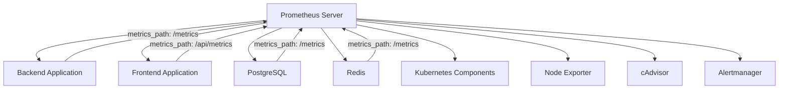

# Monitoring & Alerting

<cite>
**Referenced Files in This Document**   
- [prometheus.yml](file://monitoring/prometheus/prometheus.yml)
- [alert_rules.yml](file://monitoring/prometheus/alert_rules.yml)
- [alertmanager.yml](file://monitoring/alertmanager/alertmanager.yml)
- [accu-platform-overview.json](file://monitoring/grafana/dashboards/accu-platform-overview.json)
- [backend-deployment.yaml](file://k8s/backend-deployment.yaml)
- [frontend-deployment.yaml](file://k8s/frontend-deployment.yaml)
- [main.ts](file://apps/backend/src/main.ts)
- [configuration.ts](file://apps/backend/src/config/configuration.ts)
- [Dockerfile](file://apps/backend/Dockerfile)
- [smoke-tests.sh](file://scripts/smoke-tests.sh)
</cite>

## Table of Contents
1. [Introduction](#introduction)
2. [Prometheus Configuration](#prometheus-configuration)
3. [Alerting Rules](#alerting-rules)
4. [Grafana Dashboard](#grafana-dashboard)
5. [Alert Notification Channels](#alert-notification-channels)
6. [Common Issues and Troubleshooting](#common-issues-and-troubleshooting)
7. [Observability Strategy Integration](#observability-strategy-integration)
8. [Conclusion](#conclusion)

## Introduction
The ACCU Platform employs a comprehensive monitoring and alerting system built on the Prometheus, Alertmanager, and Grafana stack to ensure system reliability, performance, and availability. This documentation details the monitoring setup, including metric collection from backend, frontend, PostgreSQL, Redis, and Kubernetes components, alerting rules for proactive issue detection, and visualization through Grafana dashboards. The system is designed to provide real-time insights into system health, support compliance requirements, and enable rapid incident response.

## Prometheus Configuration

The Prometheus configuration in `prometheus.yml` defines scrape targets for various components of the ACCU Platform with specific metrics paths and intervals. The global scrape interval is set to 15 seconds, with evaluation of alerting rules occurring at the same frequency.



**Diagram sources**
- [prometheus.yml](file://monitoring/prometheus/prometheus.yml#L1-L153)

**Section sources**
- [prometheus.yml](file://monitoring/prometheus/prometheus.yml#L1-L153)
- [backend-deployment.yaml](file://k8s/backend-deployment.yaml#L25-L27)
- [frontend-deployment.yaml](file://k8s/frontend-deployment.yaml#L25-L27)

### Backend and Frontend Scraping
The backend application is scraped every 10 seconds at the `/metrics` endpoint, while the frontend application is scraped at the `/api/metrics` endpoint with the same interval. Both applications expose metrics in Prometheus format, which are automatically collected by Prometheus based on the annotations in their Kubernetes deployment configurations.

### Database and Cache Monitoring
PostgreSQL and Redis are monitored with a 30-second scrape interval. The PostgreSQL exporter and Redis exporter expose metrics at the `/metrics` endpoint, allowing Prometheus to collect database connection counts, query performance, memory usage, and other critical metrics.

### Kubernetes Infrastructure Monitoring
The configuration includes comprehensive Kubernetes monitoring through multiple job configurations:
- `kubernetes-apiservers`: Monitors the API server health
- `kubernetes-nodes`: Collects node-level metrics
- `kubernetes-system`: Gathers system metrics via cAdvisor
- `kubernetes-pods`: Monitors individual pods based on annotations
- `node-exporter` and `cadvisor`: Dedicated jobs for node and container metrics

The `kubernetes-pods` job uses relabeling to identify pods that should be scraped based on the `prometheus.io/scrape` annotation, allowing fine-grained control over which pods expose metrics.

## Alerting Rules

Alerting rules are defined in `alert_rules.yml` and organized into groups that cover different aspects of the platform's health. These rules are evaluated periodically based on the global evaluation interval.

```mermaid
graph TD
A[Alert Rules] --> B[Application Availability]
A --> C[Backend Health]
A --> D[Frontend Health]
A --> E[Database Health]
A --> F[Redis Health]
A --> G[System Resources]
A --> H[Kubernetes Health]
A --> I[Business Metrics]
B --> B1[ServiceDown]
C --> C1[BackendHighResponseTime]
C --> C2[BackendHighErrorRate]
D --> D1[FrontendHighResponseTime]
D --> D2[FrontendHighErrorRate]
E --> E1[PostgreSQLDown]
E --> E2[PostgreSQLTooManyConnections]
F --> F1[RedisDown]
F --> F2[RedisHighMemoryUsage]
G --> G1[HighCPUUsage]
G --> G2[HighMemoryUsage]
G --> G3[HighDiskUsage]
H --> H1[PodCrashLooping]
H --> H2[PodNotReady]
H --> H3[DeploymentReplicasMismatch]
I --> I1[LowUserActivity]
I --> I2[HighDocumentUploadFailure]
```



**Diagram sources**
- [alert_rules.yml](file://monitoring/prometheus/alert_rules.yml#L1-L163)

**Section sources**
- [alert_rules.yml](file://monitoring/prometheus/alert_rules.yml#L1-L163)
- [alertmanager.yml](file://monitoring/alertmanager/alertmanager.yml#L12-L39)

### Application-Level Alerts
The alerting system includes rules for monitoring application availability and performance:
- `ServiceDown`: Triggers when a service is unreachable for more than 1 minute
- `BackendHighResponseTime`: Fires when the 95th percentile response time exceeds 500ms
- `BackendHighErrorRate`: Activates when HTTP 5xx error rate exceeds 0.1 requests per second
- `FrontendHighResponseTime`: Triggers when frontend response time exceeds 1 second
- `FrontendHighErrorRate`: Fires when frontend error rate exceeds 0.05 requests per second

### Infrastructure and Resource Alerts
Critical infrastructure components are monitored with specific thresholds:
- `PostgreSQLDown` and `RedisDown`: Alert when database or cache services are unavailable
- `PostgreSQLTooManyConnections`: Triggers when connection usage exceeds 80% of maximum
- `RedisHighMemoryUsage`: Fires when Redis memory usage exceeds 90%
- `HighCPUUsage`, `HighMemoryUsage`, `HighDiskUsage`: System resource thresholds at 80%, 85%, and 90% respectively

### Kubernetes and Business Metrics
The alerting system also monitors Kubernetes cluster health and business-critical metrics:
- `PodCrashLooping`: Detects pods that are repeatedly restarting
- `PodNotReady`: Alerts when pods remain in a non-ready state for more than 5 minutes
- `DeploymentReplicasMismatch`: Triggers when available replicas don't match desired replicas
- `LowUserActivity`: Identifies periods of unusually low user login activity
- `HighDocumentUploadFailure`: Alerts when document upload error rate is high

## Grafana Dashboard

The 'ACCU Platform Overview' dashboard in Grafana provides a comprehensive view of system health with multiple panels displaying key metrics. The dashboard is configured with a 30-second refresh interval and displays data from the last hour by default.

```mermaid
graph TD
A[Grafana Dashboard] --> B[System Status]
A --> C[Request Rate]
A --> D[Response Time]
A --> E[Error Rate]
A --> F[Database Connections]
A --> G[Redis Memory Usage]
A --> H[CPU Usage]
A --> I[Memory Usage]
A --> J[Disk Usage]
A --> K[Active Users]
B --> |up{job=~\"accu-.*\"}| A
C --> |rate(http_requests_total{job=~\"accu-.*\"}[5m])| A
D --> |histogram_quantile(0.95, rate(http_request_duration_seconds_bucket{job=~\"accu-.*\"}[5m]))| A
E --> |rate(http_requests_total{job=~\"accu-.*\",status=~\"4..|5..\"}[5m])| A
F --> |pg_stat_database_numbackends| A
G --> |redis_memory_used_bytes / redis_memory_max_bytes * 100| A
H --> |100 - (avg by(instance) (rate(node_cpu_seconds_total{mode=\"idle\"}[5m])) * 100)| A
I --> |(1 - (node_memory_MemAvailable_bytes / node_memory_MemTotal_bytes)) * 100| A
J --> |(1 - (node_filesystem_avail_bytes / node_filesystem_size_bytes)) * 100| A
K --> |rate(http_requests_total{job=\"accu-backend\",endpoint=\"/api/auth/login\"}[1h]) * 3600| A
```

**Diagram sources**
- [accu-platform-overview.json](file://monitoring/grafana/dashboards/accu-platform-overview.json#L1-L229)

**Section sources**
- [accu-platform-overview.json](file://monitoring/grafana/dashboards/accu-platform-overview.json#L1-L229)
- [alert_rules.yml](file://monitoring/prometheus/alert_rules.yml#L15-L32)

### Key Dashboard Panels
The dashboard includes the following key panels:

#### System Status
The system status panel uses the `up` metric with a threshold-based color scheme to show the availability of all ACCU-related services. Green indicates the service is up (value 1), while red indicates it is down (value 0).

#### Request Rate and Response Time
These panels display the rate of HTTP requests and response time percentiles (50th and 95th) for both backend and frontend services. The request rate is calculated using the `rate()` function over a 5-minute window, while response time uses `histogram_quantile()` to calculate percentiles from histogram buckets.

#### Error Rate
The error rate panel tracks HTTP requests with status codes in the 4xx and 5xx ranges, helping identify issues with client errors or server failures.

#### Database and Redis Monitoring
The database connections panel shows active PostgreSQL connections compared to the maximum allowed, while the Redis memory usage panel displays memory utilization as a percentage of the configured maximum.

#### System Resource Utilization
CPU, memory, and disk usage panels provide insights into node-level resource consumption. CPU usage is calculated by measuring non-idle CPU time, memory usage by comparing available to total memory, and disk usage by comparing used to total disk space.

#### Active Users
The active users panel estimates user activity by calculating the rate of login requests over the past hour, multiplied by 3600 to convert to logins per hour.

## Alert Notification Channels

Alert notifications are configured in `alertmanager.yml` with a routing strategy based on alert severity. The system supports multiple notification channels including email, Slack, and Discord.

```mermaid
graph TD
A[Incoming Alert] --> B{Severity}
B --> |critical| C[Critical Alerts]
B --> |warning| D[Warning Alerts]
B --> |info| E[Info Alerts]
C --> F[Email]
C --> G[Slack]
C --> H[Discord]
D --> I[Email]
D --> J[Slack]
E --> K[Email]
E --> L[Slack]
F --> M[devops@accu-platform.com]
G --> N[#alerts-critical]
H --> O[Discord Webhook]
I --> P[devops@accu-platform.com]
J --> Q[#alerts-warning]
K --> R[devops@accu-platform.com]
L --> S[#alerts-info]
```

**Diagram sources**
- [alertmanager.yml](file://monitoring/alertmanager/alertmanager.yml#L1-L140)

**Section sources**
- [alertmanager.yml](file://monitoring/alertmanager/alertmanager.yml#L1-L140)
- [alert_rules.yml](file://monitoring/prometheus/alert_rules.yml#L8-L9)

### Routing and Inhibition
The Alertmanager configuration includes a sophisticated routing strategy:
- Critical alerts are routed to the `critical-alerts` receiver with immediate notification (0s group wait) and a 15-minute repeat interval
- Warning alerts go to the `warning-alerts` receiver with a 5-minute group wait and 2-hour repeat interval
- Info alerts are sent to the `info-alerts` receiver with a 10-minute group wait and 24-hour repeat interval

Inhibition rules prevent alert noise by suppressing related alerts when a more critical issue is detected. For example, when a `ServiceDown` alert is firing, related alerts like `BackendHighResponseTime` and `BackendHighErrorRate` are inhibited to avoid alert fatigue.

### Notification Templates
Each receiver includes customized notification templates with relevant alert information:
- Email notifications include the alert summary and description in the body
- Slack messages use formatted text with emoji indicators for severity
- Discord notifications include rich embeds with color coding based on severity

The templates include dynamic content such as alert annotations, labels, and timestamps to provide context for incident response.

## Common Issues and Troubleshooting

### Metric Scraping Failures
Metric scraping failures can occur due to various reasons:
- Network connectivity issues between Prometheus and targets
- Incorrect metrics path configuration
- Target application not exposing metrics endpoint
- Authentication/authorization issues for secured endpoints

The smoke tests in `smoke-tests.sh` include a monitoring test that verifies the availability of the metrics endpoint, helping identify scraping issues early.

### Alert Fatigue
To prevent alert fatigue, the system employs several strategies:
- Proper alert grouping by `alertname`, `cluster`, and `service`
- Appropriate `group_wait` and `repeat_interval` settings
- Inhibition rules to suppress less critical alerts during major incidents
- Severity-based routing to ensure critical alerts receive immediate attention

### Dashboard Performance Optimization
Large dashboards can impact Grafana performance. The ACCU Platform dashboard is optimized by:
- Using appropriate time ranges (1 hour default)
- Limiting the number of series in each panel
- Using efficient PromQL queries with proper range vectors
- Avoiding overly frequent refresh intervals

## Observability Strategy Integration

The monitoring and alerting setup is a key component of the ACCU Platform's overall observability strategy, which also includes logging and distributed tracing. This integrated approach provides comprehensive visibility into system behavior and supports compliance requirements by maintaining audit trails of system health and incident response.

The monitoring system integrates with the platform's compliance framework by:
- Maintaining historical metrics for audit purposes
- Providing evidence of system availability and performance
- Documenting incident response through alert notifications
- Supporting capacity planning with long-term trend analysis

## Conclusion
The ACCU Platform's monitoring and alerting system provides comprehensive visibility into application and infrastructure health. By leveraging Prometheus for metric collection, Alertmanager for intelligent alert routing, and Grafana for visualization, the platform ensures high availability and rapid incident response. The configuration is designed to balance comprehensive monitoring with operational efficiency, minimizing alert fatigue while ensuring critical issues are promptly identified and addressed.