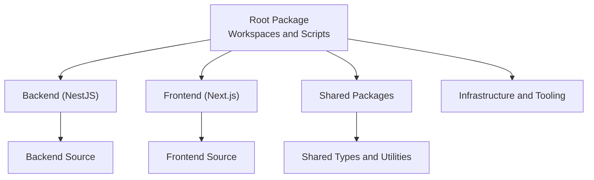
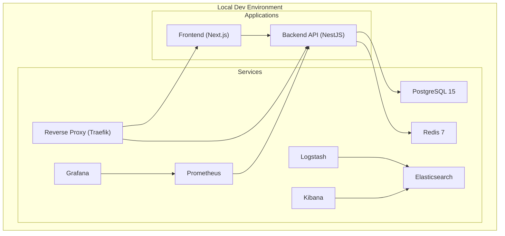
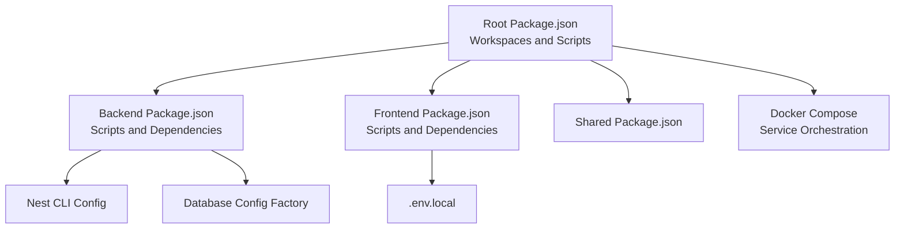
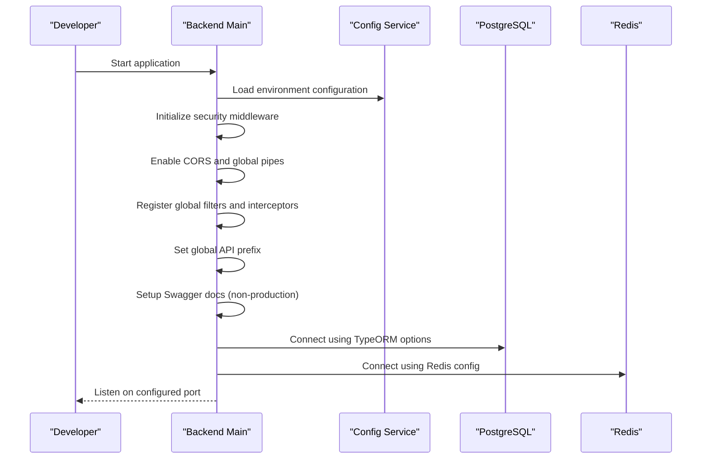

# Getting Started

<cite>
**Referenced Files in This Document**
- [README.md](file://README.md)
- [package.json](file://package.json)
- [docker-compose.yml](file://docker-compose.yml)
- [apps/backend/package.json](file://apps/backend/package.json)
- [apps/backend/src/main.ts](file://apps/backend/src/main.ts)
- [apps/backend/src/config/configuration.ts](file://apps/backend/src/config/configuration.ts)
- [apps/backend/src/config/database.config.ts](file://apps/backend/src/config/database.config.ts)
- [apps/backend/nest-cli.json](file://apps/backend/nest-cli.json)
- [apps/backend/Dockerfile](file://apps/backend/Dockerfile)
- [apps/frontend/package.json](file://apps/frontend/package.json)
- [apps/frontend/QUICK_START.md](file://apps/frontend/QUICK_START.md)
- [apps/frontend/.env.local](file://apps/frontend/.env.local)
- [apps/frontend/Dockerfile](file://apps/frontend/Dockerfile)
- [scripts/run-tests.sh](file://scripts/run-tests.sh)
- [apps/backend/test/setup/unit-setup.ts](file://apps/backend/test/setup/unit-setup.ts)
</cite>

## Table of Contents
1. [Introduction](#introduction)
2. [Project Structure](#project-structure)
3. [Core Components](#core-components)
4. [Architecture Overview](#architecture-overview)
5. [Detailed Component Analysis](#detailed-component-analysis)
6. [Dependency Analysis](#dependency-analysis)
7. [Performance Considerations](#performance-considerations)
8. [Troubleshooting Guide](#troubleshooting-guide)
9. [Conclusion](#conclusion)
10. [Appendices](#appendices)

## Introduction
This guide helps new developers quickly set up and begin working with the ACCU Platform codebase. It covers prerequisites, environment setup, development workflow, running the application locally, executing tests, and common troubleshooting steps. The content balances conceptual overviews for beginners with precise technical details for experienced developers, aligning with the repository’s terminology and structure.

## Project Structure
The ACCU Platform follows a monorepo layout with a backend NestJS API, a Next.js frontend, shared packages, and supporting infrastructure and tooling.

**Diagram sources**
- [package.json](file://package.json#L1-L36)
- [apps/backend/package.json](file://apps/backend/package.json#L1-L30)
- [apps/frontend/package.json](file://apps/frontend/package.json#L1-L20)

**Section sources**
- [README.md](file://README.md#L1-L22)
- [package.json](file://package.json#L1-L36)

## Core Components
- Backend API (NestJS): Provides REST endpoints, authentication, database integration, file storage, and optional workflow engine integrations.
- Frontend (Next.js): React-based SPA with app router, state management, and UI primitives.
- Shared packages: Reusable types and utilities across backend and frontend.
- Development scripts: Unified commands to build, test, lint, and run the platform locally.

Key entry points:
- Backend bootstrap initializes security middleware, global pipes, filters, interceptors, Swagger docs, and global prefix.
- Frontend quick start provides environment defaults and development commands.

**Section sources**
- [apps/backend/src/main.ts](file://apps/backend/src/main.ts#L1-L97)
- [apps/frontend/QUICK_START.md](file://apps/frontend/QUICK_START.md#L1-L32)
- [package.json](file://package.json#L10-L36)

## Architecture Overview
The platform uses a layered architecture with clear separation between frontend, backend, and shared packages. Docker Compose orchestrates services for local development, including PostgreSQL, Redis, reverse proxy, and monitoring stacks.

**Diagram sources**
- [docker-compose.yml](file://docker-compose.yml#L1-L211)

**Section sources**
- [README.md](file://README.md#L38-L46)
- [docker-compose.yml](file://docker-compose.yml#L1-L211)

## Detailed Component Analysis

### Prerequisites and Environment Setup
- Prerequisites:
  - Node.js 18+
  - Docker and Docker Compose
  - PostgreSQL 15+
  - Redis 7+

- Local environment variables:
  - Backend: DATABASE_URL, REDIS_URL, JWT_SECRET, MINIO_* (for development), CER_API_URL, etc.
  - Frontend: NEXT_PUBLIC_API_URL, NEXT_PUBLIC_WS_URL

- Development scripts:
  - Start both apps concurrently
  - Build all apps
  - Run tests across backend and frontend
  - Lint and type-check
  - Database migrations, seeding, and reset

Practical example: Start the development environment and access the frontend and backend APIs.

**Section sources**
- [README.md](file://README.md#L25-L37)
- [README.md](file://README.md#L61-L81)
- [README.md](file://README.md#L82-L101)
- [package.json](file://package.json#L10-L36)

### Backend Development Environment
- Bootstrap and configuration:
  - Security middleware: Helmet, compression, cookie parser
  - CORS enabled for frontend origins
  - Global validation pipe with transformation
  - Global exception filter and interceptors
  - Swagger documentation exposed under /api/docs in non-production environments
  - Global API prefix set to /api
  - Port configurable via environment

- Configuration module:
  - Centralized environment-driven configuration for database, Redis, JWT, file storage, email, external APIs, rate limiting, CORS, feature flags, and Temporal.

- Database configuration:
  - TypeORM options factory loads entities and applies synchronization/logging based on environment.

- Docker:
  - Multi-stage build with health checks and non-root user.

Common use cases:
- Start backend in development mode
- Configure JWT secrets and database URLs
- Enable/disable features via environment flags
- Run database migrations and seed data

**Section sources**
- [apps/backend/src/main.ts](file://apps/backend/src/main.ts#L1-L97)
- [apps/backend/src/config/configuration.ts](file://apps/backend/src/config/configuration.ts#L1-L95)
- [apps/backend/src/config/database.config.ts](file://apps/backend/src/config/database.config.ts#L1-L54)
- [apps/backend/Dockerfile](file://apps/backend/Dockerfile#L1-L54)
- [apps/backend/package.json](file://apps/backend/package.json#L1-L30)

### Frontend Development Environment
- Quick start:
  - Prerequisites check, install dependencies, environment setup, development server, and navigation to the app.

- Project structure overview:
  - App Router pages, reusable components, UI primitives, layout components, error handling, utilities, state management, and types.

- Development commands:
  - Dev, build, start, lint, type-check, and test commands.

- API integration expectations:
  - Backend reachable at http://localhost:3001 with documented endpoints.

- Default test credentials:
  - Provided for convenience during local testing.

Common use cases:
- Start the frontend dev server
- Authenticate and navigate the dashboard
- Perform CRUD operations across sections
- Customize branding and settings

**Section sources**
- [apps/frontend/QUICK_START.md](file://apps/frontend/QUICK_START.md#L1-L32)
- [apps/frontend/QUICK_START.md](file://apps/frontend/QUICK_START.md#L33-L54)
- [apps/frontend/QUICK_START.md](file://apps/frontend/QUICK_START.md#L149-L165)
- [apps/frontend/QUICK_START.md](file://apps/frontend/QUICK_START.md#L203-L214)
- [apps/frontend/QUICK_START.md](file://apps/frontend/QUICK_START.md#L192-L202)
- [apps/frontend/.env.local](file://apps/frontend/.env.local#L1-L3)
- [apps/frontend/package.json](file://apps/frontend/package.json#L1-L20)

### Running the Application Locally
Recommended approach:
- Option A: Use root scripts to start backend and frontend concurrently
- Option B: Use Docker Compose to spin up all services (PostgreSQL, Redis, backend, frontend, Traefik, monitoring)

Step-by-step:
1. Install prerequisites and clone the repository.
2. Install dependencies at the root level.
3. Start services:
   - Concurrency: npm run dev
   - Docker: npm run docker:up
4. Access:
   - Frontend: http://localhost:3000
   - Backend API: http://localhost:4000 or http://localhost:3001 depending on port mapping
   - API Docs: http://localhost:4000/api/docs

**Section sources**
- [README.md](file://README.md#L23-L37)
- [package.json](file://package.json#L10-L16)
- [docker-compose.yml](file://docker-compose.yml#L42-L109)

### Executing Tests
- Unit tests:
  - Backend: npm run test (Jest)
  - Frontend: npm run test (Jest)

- Integration tests:
  - Backend: npm run test:e2e (Jest with E2E config)

- E2E tests:
  - Frontend: npm run test:e2e (Playwright)

- Automated pipeline script:
  - Comprehensive CI-like pipeline covering linting, type-checking, unit tests, integration tests, E2E tests, performance tests, security audit, and Docker builds.

- Unit test setup:
  - Environment variables for test databases and Redis
  - Mocks for external services (Redis, Temporal client, file storage, email, CER API)
  - Custom Jest matchers and factories for entities

Practical example: Run all tests with a single command or execute the automated pipeline script.

**Section sources**
- [apps/backend/package.json](file://apps/backend/package.json#L1-L30)
- [apps/frontend/package.json](file://apps/frontend/package.json#L1-L20)
- [scripts/run-tests.sh](file://scripts/run-tests.sh#L1-L224)
- [apps/backend/test/setup/unit-setup.ts](file://apps/backend/test/setup/unit-setup.ts#L1-L86)

### Initial Configuration
- Backend configuration module:
  - Database host/port/credentials, synchronize/logging flags
  - Redis host/port/password
  - JWT secret/expiry settings
  - File storage provider and S3-compatible MinIO defaults
  - Email SMTP settings
  - External API endpoints (e.g., CER)
  - Rate limiting, CORS, feature flags, and Temporal engine settings

- Frontend environment:
  - NEXT_PUBLIC_API_URL and NEXT_PUBLIC_WS_URL
  - App name and environment

- Nest CLI configuration:
  - Source root, webpack, and TypeScript config path

**Section sources**
- [apps/backend/src/config/configuration.ts](file://apps/backend/src/config/configuration.ts#L1-L95)
- [apps/frontend/.env.local](file://apps/frontend/.env.local#L1-L3)
- [apps/backend/nest-cli.json](file://apps/backend/nest-cli.json#L1-L10)

## Dependency Analysis
The platform uses a workspace-based monorepo managed by npm. Root scripts orchestrate backend and frontend builds, tests, and development tasks. Docker Compose defines service dependencies and health checks.

**Diagram sources**
- [package.json](file://package.json#L1-L36)
- [apps/backend/package.json](file://apps/backend/package.json#L1-L30)
- [apps/frontend/package.json](file://apps/frontend/package.json#L1-L20)
- [apps/backend/nest-cli.json](file://apps/backend/nest-cli.json#L1-L10)
- [apps/backend/src/config/database.config.ts](file://apps/backend/src/config/database.config.ts#L1-L54)
- [apps/frontend/.env.local](file://apps/frontend/.env.local#L1-L3)
- [docker-compose.yml](file://docker-compose.yml#L1-L211)

**Section sources**
- [package.json](file://package.json#L1-L36)
- [apps/backend/package.json](file://apps/backend/package.json#L1-L30)
- [apps/frontend/package.json](file://apps/frontend/package.json#L1-L20)

## Performance Considerations
- Use Docker Compose for local development to ensure consistent resource allocation and service readiness.
- Enable health checks for backend and frontend containers to detect startup issues early.
- Leverage environment flags to toggle features and reduce overhead during development.
- Keep database synchronization enabled only in development to simplify schema changes; disable in production.

[No sources needed since this section provides general guidance]

## Troubleshooting Guide
Common setup issues and resolutions:
- Port conflicts:
  - Frontend runs on 3000; backend on 4000 by default. Adjust ports or kill conflicting processes.
- API connection issues:
  - Verify backend URL in frontend environment variables and ensure backend is healthy.
- TypeScript errors:
  - Run type checking to identify and fix type mismatches.
- Build errors:
  - Clean caches and rebuild applications.
- Docker-related issues:
  - Ensure Docker and Docker Compose are installed and running. Confirm service health checks pass.

Helpful commands:
- Start both apps concurrently
- Build all applications
- Run tests across backend and frontend
- Lint and type-check
- Database migration and seed/reset

**Section sources**
- [apps/frontend/QUICK_START.md](file://apps/frontend/QUICK_START.md#L215-L249)
- [README.md](file://README.md#L82-L101)
- [package.json](file://package.json#L10-L36)

## Conclusion
With the prerequisites met and environment variables configured, you can start the ACCU Platform locally using either root scripts or Docker Compose. The backend and frontend are ready for development, testing, and iteration. Use the troubleshooting tips to resolve common setup issues and refer to the detailed component analyses for deeper customization and configuration.

[No sources needed since this section summarizes without analyzing specific files]

## Appendices

### Appendix A: Step-by-Step Setup Checklist
- Install prerequisites
- Clone repository
- Install dependencies
- Configure environment variables
- Start services (concurrently or via Docker)
- Access frontend and backend
- Run tests

**Section sources**
- [README.md](file://README.md#L23-L37)
- [README.md](file://README.md#L61-L81)
- [package.json](file://package.json#L10-L16)
- [docker-compose.yml](file://docker-compose.yml#L42-L109)

### Appendix B: Backend Startup Flow

**Diagram sources**
- [apps/backend/src/main.ts](file://apps/backend/src/main.ts#L1-L97)
- [apps/backend/src/config/configuration.ts](file://apps/backend/src/config/configuration.ts#L1-L95)
- [apps/backend/src/config/database.config.ts](file://apps/backend/src/config/database.config.ts#L1-L54)