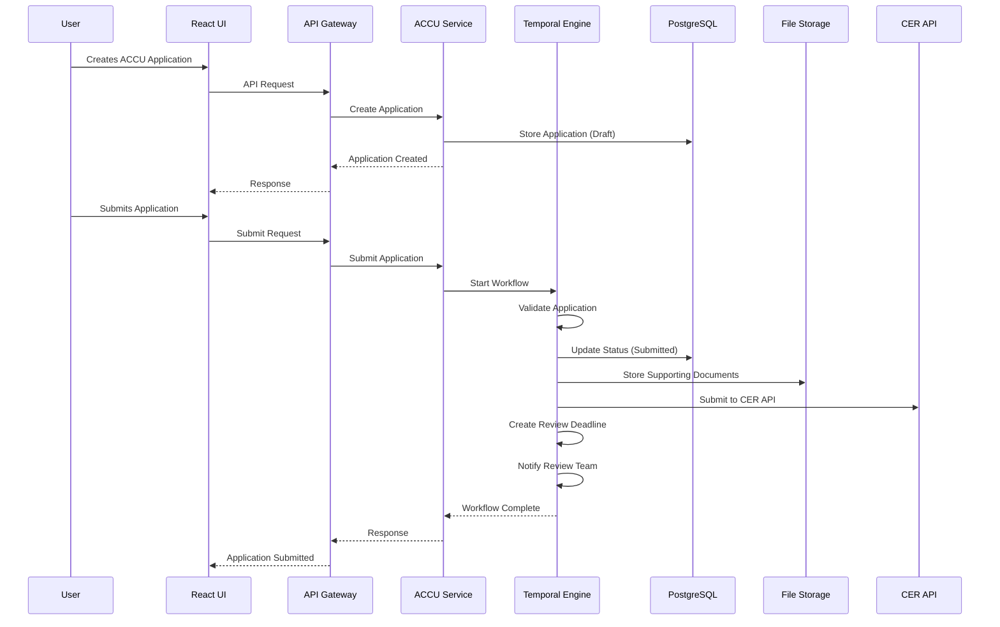
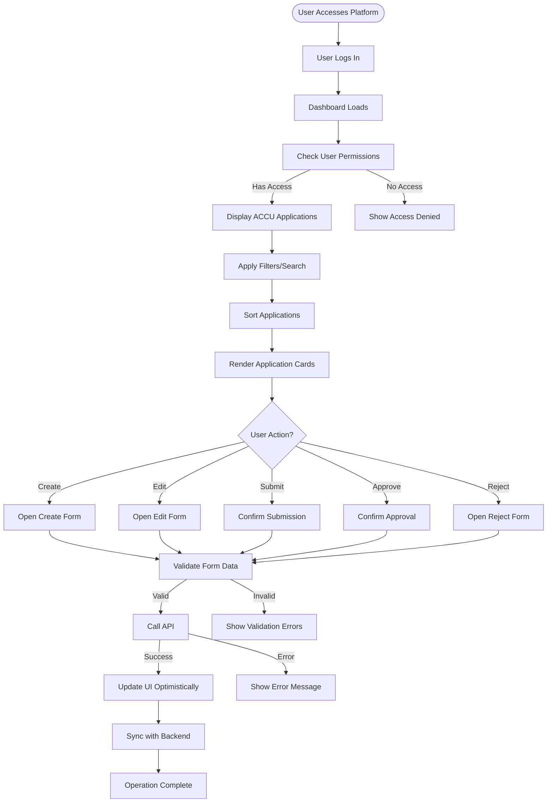

# System Overview

<cite>
**Referenced Files in This Document**   
- [ACCU_Platform_Architecture_Diagram.md](file://ACCU_Platform_Architecture_Diagram.md)
- [README.md](file://README.md)
- [app.module.ts](file://apps/backend/src/app.module.ts)
- [main.ts](file://apps/backend/src/main.ts)
- [accu.module.ts](file://apps/backend/src/modules/accu/accu.module.ts)
- [accu-applications.controller.ts](file://apps/backend/src/modules/accu/accu-applications.controller.ts)
- [accu-applications.service.ts](file://apps/backend/src/modules/accu/accu-applications.service.ts)
- [accu-application-workflows.ts](file://apps/backend/src/modules/temporal/workflows/accu-application/accu-application-workflows.ts)
- [accu-application.entity.ts](file://apps/backend/src/entities/accu-application.entity.ts)
- [cer.service.ts](file://apps/backend/src/modules/cer/cer.service.ts)
- [temporal.module.ts](file://apps/backend/src/modules/temporal/temporal.module.ts)
- [page.tsx](file://apps/frontend/src/app/accu-applications/page.tsx)
- [types.ts](file://packages/shared/src/types.ts)
- [layout.tsx](file://apps/frontend/src/app/layout.tsx)
</cite>

## Table of Contents
1. [Introduction](#introduction)
2. [Core Functionality](#core-functionality)
3. [Architecture Overview](#architecture-overview)
4. [ACCU Application Lifecycle](#accu-application-lifecycle)
5. [Temporal Workflows](#temporal-workflows)
6. [CER Integration](#cer-integration)
7. [Frontend Implementation](#frontend-implementation)
8. [Data Model](#data-model)
9. [Security and Access Control](#security-and-access-control)
10. [API Endpoints](#api-endpoints)

## Introduction

The ACCU Platform is a comprehensive solution for managing Australian Carbon Credit Units (ACCU), providing end-to-end capabilities for project management, compliance tracking, and carbon credit operations. The platform is designed to streamline the complex process of ACCU application submission, review, and approval, while ensuring compliance with regulatory requirements and providing robust tracking and reporting capabilities.

Built using a modern technology stack, the platform consists of a Next.js frontend and a NestJS backend, with PostgreSQL as the primary database and Redis for caching and queuing. The architecture is modular and scalable, with clear separation of concerns between different components and services.

The platform's core functionality revolves around ACCU Applications, which represent the formal submissions for carbon credit units. These applications are managed through a well-defined lifecycle, from creation and submission to review, approval, and issuance. The platform leverages Temporal workflows to orchestrate complex business processes, ensuring reliability and consistency in handling ACCU applications.

**Section sources**
- [README.md](file://README.md#L1-L151)
- [layout.tsx](file://apps/frontend/src/app/layout.tsx#L1-L29)

## Core Functionality

The ACCU Platform provides a comprehensive suite of features for managing carbon credit operations. At its core, the platform enables users to create, submit, and track ACCU applications throughout their lifecycle. Each ACCU application is associated with a specific project and contains detailed information about the carbon reduction activities, methodology used, and the number of ACCU units being applied for.

The platform supports multiple stages in the ACCU application process: draft, submitted, under review, approved, rejected, and issued. Users can create applications in draft mode, populate them with required information, and submit them for review. Once submitted, applications enter a review process where they can be evaluated by authorized personnel. Approved applications can then be issued, resulting in the formal allocation of ACCU units.

In addition to application management, the platform provides robust document management capabilities, allowing users to upload and associate supporting documents with their applications. Calendar integration ensures that important deadlines and review periods are tracked and communicated effectively. The platform also includes a comprehensive notification system that keeps stakeholders informed about application status changes and upcoming deadlines.

A key feature of the platform is its integration with the Clean Energy Regulator (CER) systems. This integration enables automated submission of ACCU applications to the CER and retrieval of application status updates, reducing manual effort and improving accuracy. The platform also supports reporting and analytics, providing insights into application trends, processing times, and success rates.

**Section sources**
- [README.md](file://README.md#L1-L151)
- [accu-applications.controller.ts](file://apps/backend/src/modules/accu/accu-applications.controller.ts#L1-L505)
- [accu-applications.service.ts](file://apps/backend/src/modules/accu/accu-applications.service.ts#L1-L800)

## Architecture Overview

The ACCU Platform follows a layered architecture with clear separation between frontend, backend, data storage, and external integrations. The architecture is designed to be scalable, maintainable, and secure, following best practices for modern web applications.

```mermaid
graph TB
subgraph "Frontend Layer"
UI[React/Next.js UI]
RBAC[RBAC Frontend Components]
DASH[Dashboard & Analytics]
FORMS[Dynamic Forms]
end
subgraph "API Gateway Layer"
GATEWAY[API Gateway<br/>Rate Limiting & Auth]
AUTH[JWT Authentication]
RBAC_API[Authorization Service]
end
subgraph "Core Services Layer"
subgraph "Business Logic"
DOCS[Document Service]
CAL[Calendar Service]
AUDIT[Audit Service]
COMM[Communication Service]
ACCU_APP[ACCU Application Service]
ACCU_INV[ACCU Inventory Service]
MON[Monitoring Service]
NOTIF[Notification Service]
PROJ[Project Service]
end
subgraph "Workflow Engine"
TEMPORAL[Temporal Workflow Engine]
JOBS[Job Scheduler]
EVENTS[Event Engine]
end
subgraph "Data Services"
FILE[File Storage Service]
EMAIL[Email Service]
SEARCH[Search Service]
end
end
subgraph "Data Layer"
DB[(PostgreSQL<br/>System of Record)]
CACHE[(Redis<br/>Cache & Queues)]
STORAGE[(S3-Compatible<br/>Object Storage)]
end
subgraph "External Integrations"
CER_API[CER API]
EMAIL_SYS[Email Systems]
SENSOR[IoT Sensors]
MARKET[Market Data APIs]
CALENDAR[Calendar Systems]
end
subgraph "Infrastructure"
RAILWAY[Railway Deployment]
MONITOR[Monitoring & Logging]
BACKUP[Backup & Recovery]
SCALE[Auto-scaling]
end
%% Frontend to Gateway
UI --> GATEWAY
RBAC --> GATEWAY
DASH --> GATEWAY
FORMS --> GATEWAY
%% Gateway to Services
GATEWAY --> AUTH
GATEWAY --> RBAC_API
GATEWAY --> DOCS
GATEWAY --> CAL
GATEWAY --> AUDIT
GATEWAY --> COMM
GATEWAY --> ACCU_APP
GATEWAY --> ACCU_INV
GATEWAY --> MON
GATEWAY --> NOTIF
GATEWAY --> PROJ
%% Service to Workflow
DOCS --> TEMPORAL
CAL --> TEMPORAL
AUDIT --> TEMPORAL
COMM --> TEMPORAL
ACCU_APP --> TEMPORAL
ACCU_INV --> TEMPORAL
MON --> TEMPORAL
NOTIF --> TEMPORAL
PROJ --> TEMPORAL
TEMPORAL --> JOBS
TEMPORAL --> EVENTS
%% Services to Data
DOCS --> DB
DOCS --> STORAGE
CAL --> DB
AUDIT --> DB
COMM --> DB
COMM --> EMAIL_SYS
ACCU_APP --> DB
ACCU_INV --> DB
MON --> DB
MON --> SENSOR
NOTIF --> CACHE
PROJ --> DB
%% File and Email Services
FILE --> STORAGE
EMAIL --> EMAIL_SYS
SEARCH --> DB
%% External Integrations
COMM --> CER_API
MON --> SENSOR
ACCU_INV --> MARKET
CAL --> CALENDAR
%% Infrastructure
GATEWAY --> RAILWAY
DB --> RAILWAY
STORAGE --> RAILWAY
CACHE --> RAILWAY
TEMPORAL --> MONITOR
JOBS --> MONITOR
EVENTS --> MONITOR
DB --> BACKUP
STORAGE --> BACKUP
RAILWAY --> SCALE
```



**Diagram sources**
- [ACCU_Platform_Architecture_Diagram.md](file://ACCU_Platform_Architecture_Diagram.md#L5-L139)

## ACCU Application Lifecycle

The ACCU application lifecycle is a central component of the platform, representing the complete journey of an ACCU application from creation to issuance. The lifecycle is managed through a well-defined state machine with six distinct states: draft, submitted, under review, approved, rejected, and issued.

Applications begin in the draft state, where users can create and edit application details without triggering any formal processes. When ready, users can submit the application, transitioning it to the submitted state. This triggers a series of automated processes, including validation checks and notification of relevant stakeholders.

Once submitted, applications move to the under review state, where they are evaluated by authorized reviewers. During this phase, additional information may be requested, and the application may be sent back for revisions. Reviewers can either approve or reject the application based on compliance with regulatory requirements and internal policies.

Approved applications transition to the approved state, where they await final issuance. This final step formally allocates the ACCU units and updates the organization's carbon credit inventory. Rejected applications are closed with appropriate documentation of the reasons for rejection, providing transparency and enabling future improvements.

The platform maintains a complete audit trail of all state transitions, capturing who made each change, when it occurred, and any associated notes or comments. This ensures full traceability and supports compliance reporting requirements. The lifecycle is enforced through both business logic in the application service and workflow orchestration in Temporal, ensuring consistency and reliability.

**Section sources**
- [accu-application.entity.ts](file://apps/backend/src/entities/accu-application.entity.ts#L1-L86)
- [accu-applications.service.ts](file://apps/backend/src/modules/accu/accu-applications.service.ts#L1-L800)
- [types.ts](file://packages/shared/src/types.ts#L206-L223)

## Temporal Workflows

Temporal workflows play a crucial role in orchestrating the complex business processes associated with ACCU applications. The platform uses Temporal to manage long-running workflows that coordinate multiple activities across different services, ensuring reliability and consistency even in the face of failures or system restarts.

The ACCU application workflow is implemented as a Temporal workflow that coordinates the various stages of the application lifecycle. The workflow listens for signals representing key events such as application submission, reviewer assignment, approval, rejection, and issuance. When these signals are received, the workflow executes the appropriate activities and updates the application state accordingly.

Each workflow maintains its own state, including the current application status, timestamps for key events, and metadata about the processing history. This state is persisted by Temporal, allowing the workflow to resume from exactly where it left off in case of interruptions. The workflow also implements timeout handling, automatically escalating applications that remain in a particular state for too long without progressing.

The workflow coordinates activities across multiple services, including database updates, calendar event creation, email notifications, and external API calls. These activities are executed as separate units of work that can be retried independently if they fail. This decoupling ensures that transient failures in one service don't block the entire workflow.

Temporal's query capabilities allow external systems to inspect the current state of a workflow without affecting its execution. This enables real-time monitoring and reporting on application processing status, providing valuable insights into workflow performance and bottlenecks.



**Diagram sources**
- [accu-application-workflows.ts](file://apps/backend/src/modules/temporal/workflows/accu-application/accu-application-workflows.ts#L1-L388)
- [temporal.module.ts](file://apps/backend/src/modules/temporal/temporal.module.ts#L1-L43)

## CER Integration

The integration with the Clean Energy Regulator (CER) systems is a critical component of the ACCU Platform, enabling automated submission of ACCU applications and retrieval of status updates. This integration reduces manual effort, minimizes errors, and ensures timely processing of applications.

The CER integration is implemented as a dedicated service that handles communication with the CER API. The service provides methods for submitting new applications, checking the status of existing applications, and retrieving detailed information about application processing. These methods are designed to handle the specific requirements and constraints of the CER API, including authentication, rate limiting, and error handling.

When an ACCU application is approved within the platform, the CER integration service automatically prepares and submits the application to the CER system. The submission includes all required information and documentation, formatted according to CER specifications. The service handles authentication using API keys and manages request retries in case of transient failures.

After submission, the service periodically checks the status of the application with the CER system, updating the platform's records with the latest information. This includes tracking the application through various processing stages and capturing any requests for additional information or clarifications from the CER.

The integration is designed with robust error handling and logging to ensure reliability and facilitate troubleshooting. In case of persistent failures, the system alerts administrators and provides detailed information about the nature of the problem. The service also includes comprehensive monitoring and metrics collection to track integration performance and identify potential issues.

For development and testing purposes, the service includes a mock mode that simulates CER API responses without making actual external calls. This allows developers to test the integration logic and user experience without consuming CER API quotas or affecting production data.

**Section sources**
- [cer.service.ts](file://apps/backend/src/modules/cer/cer.service.ts#L1-L130)
- [cer.module.ts](file://apps/backend/src/modules/cer/cer.module.ts#L1-L13)

## Frontend Implementation

The frontend of the ACCU Platform is built using Next.js with React, providing a responsive and intuitive user interface for managing ACCU applications. The interface is designed to guide users through the application process while providing comprehensive visibility into application status and history.

The main ACCU applications page serves as the central hub for managing applications, displaying a list of all applications with key information such as status, project, ACCU units, and dates. Users can filter and search applications based on various criteria, including status, project, and methodology. The interface uses color-coded badges and icons to quickly convey application status and important information.

Each application is presented in a card format that shows essential details at a glance, with actions appropriate to the current state. For draft applications, users can edit or submit the application. Submitted applications can be approved or rejected by authorized users. The interface also provides quick access to related documents, deadlines, and communication history.

The application creation and editing forms use a step-by-step approach, guiding users through the required information and documentation. Form validation ensures data quality and completeness before submission. The interface also provides contextual help and guidance based on the selected methodology and project type.

The frontend leverages React Query for efficient data fetching and caching, minimizing API calls and providing a responsive user experience. It also implements optimistic updates, immediately reflecting user actions in the interface while the backend processes the request. Error boundaries and loading states provide clear feedback during operations.



**Diagram sources**
- [page.tsx](file://apps/frontend/src/app/accu-applications/page.tsx#L1-L550)
- [layout.tsx](file://apps/frontend/src/app/layout.tsx#L1-L29)

## Data Model

The data model for the ACCU Platform is designed to support the complex relationships between projects, applications, documents, and other entities involved in carbon credit management. The model is implemented using TypeORM with PostgreSQL as the underlying database.

At the core of the data model is the ACCUApplication entity, which represents a formal application for Australian Carbon Credit Units. Each application is associated with a project and contains information about the methodology used, the number of ACCU units requested, and the current status in the application lifecycle. The application entity also includes timestamps for key events such as submission, approval, and issuance.

The Project entity represents the carbon reduction projects that generate ACCU units. Each project has a status, type, and associated metadata. Projects can have multiple ACCU applications over time, and the data model maintains this relationship through foreign key constraints.

The Document entity supports the management of supporting documentation for applications. Documents are linked to projects and can be associated with specific applications. The entity tracks document metadata such as version, status, and access permissions, ensuring proper document control and auditability.

Additional entities support related functionality:
- CalendarEvent: Tracks deadlines, reviews, and other time-sensitive activities
- Audit: Manages audit coordination and findings
- Communication: Stores correspondence related to applications
- Notification: Handles user notifications and alerts
- User and Role: Implements authentication and authorization

The data model includes comprehensive audit trails, with createdAt and updatedAt timestamps on all entities. Soft deletion is implemented for most entities, preserving historical data while allowing for logical removal from active views. Indexes are strategically placed on frequently queried fields to optimize performance.

**Section sources**
- [accu-application.entity.ts](file://apps/backend/src/entities/accu-application.entity.ts#L1-L86)
- [types.ts](file://packages/shared/src/types.ts#L206-L223)
- [app.module.ts](file://apps/backend/src/app.module.ts#L1-L75)

## Security and Access Control

The ACCU Platform implements a comprehensive security model to protect sensitive data and ensure appropriate access to functionality. The security architecture follows a defense-in-depth approach, with multiple layers of protection at the network, application, and data levels.

Authentication is implemented using JWT (JSON Web Tokens) with refresh tokens, providing secure user sessions and protection against common attacks such as CSRF and session fixation. The platform supports role-based access control (RBAC) with fine-grained permissions that can be assigned to users and roles. Permissions are defined for specific actions on resources, such as "accu_applications.read" or "documents.write".

The platform implements attribute-based access control (ABAC) in addition to RBAC, allowing for more sophisticated authorization rules based on attributes of the user, resource, and environment. For example, a user might be able to edit an application only if they are the owner and the application is in draft status.

All API endpoints are protected by authentication and authorization guards that verify the user's identity and permissions before allowing access. The backend uses NestJS guards and decorators to enforce these checks consistently across all endpoints. Sensitive operations require additional verification, such as confirmation dialogs or multi-factor authentication.

Data security is ensured through encryption at rest for sensitive data and secure transmission using TLS. The platform implements comprehensive audit logging, recording all significant actions and access attempts. These logs are stored securely and can be used for compliance reporting and incident investigation.

The frontend implements additional security measures, including input validation, output encoding to prevent XSS attacks, and content security policies. The platform also includes rate limiting and protection against common web vulnerabilities such as SQL injection and cross-site scripting.

**Section sources**
- [main.ts](file://apps/backend/src/main.ts#L1-L102)
- [app.module.ts](file://apps/backend/src/app.module.ts#L1-L75)
- [types.ts](file://packages/shared/src/types.ts#L69-L102)

## API Endpoints

The ACCU Platform exposes a comprehensive REST API for managing ACCU applications and related resources. The API follows RESTful principles and is documented using Swagger/OpenAPI, providing clear documentation and interactive testing capabilities.

The primary endpoints for ACCU application management are organized under the `/api/accu/applications` path:

- `POST /api/accu/applications`: Create a new ACCU application in draft status
- `GET /api/accu/applications`: Retrieve a list of applications with pagination and filtering
- `GET /api/accu/applications/:id`: Retrieve a specific application by ID
- `PUT /api/accu/applications/:id`: Update an application (only allowed for draft applications)
- `PATCH /api/accu/applications/:id/status`: Update the status of an application
- `POST /api/accu/applications/:id/submit`: Submit an application for review
- `POST /api/accu/applications/:id/approve`: Approve an application
- `POST /api/accu/applications/:id/reject`: Reject an application
- `DELETE /api/accu/applications/:id`: Delete a draft application

Additional endpoints provide related functionality:
- `GET /api/accu/applications/:id/history`: Retrieve the status history of an application
- `GET /api/accu/applications/:id/documents`: Retrieve documents associated with an application
- `POST /api/accu/applications/:id/documents`: Add a document to an application
- `GET /api/accu/applications/:id/deadlines`: Retrieve deadlines associated with an application
- `GET /api/accu/applications/dashboard`: Retrieve dashboard data for applications
- `GET /api/accu/applications/stats`: Retrieve statistics about applications

The API uses consistent response formats with success/error indicators, data payloads, and optional pagination information. Error responses include descriptive messages and error codes to facilitate troubleshooting. All endpoints require authentication via JWT and enforce appropriate authorization based on user roles and permissions.

```mermaid
classDiagram
class ACCUApplicationsController {
+create(createApplicationDto : ACCUApplicationCreateDto, req) : Promise~ACCUApplicationResponseDto~
+findAll(query : ACCUApplicationQueryDto) : Promise~ACCUApplicationsPaginatedResponseDto~
+getDashboard(tenantId? : string) : Promise~ACCUApplicationDashboardDto~
+getStats(tenantId? : string) : Promise~ACCUApplicationStatsDto~
+findOne(id : string) : Promise~ACCUApplicationResponseDto~
+update(id : string, updateApplicationDto : ACCUApplicationUpdateDto) : Promise~ACCUApplicationResponseDto~
+updateStatus(id : string, statusDto : ACCUApplicationStatusDto) : Promise~ACCUApplicationResponseDto~
+submit(id : string, submissionDto : ACCUApplicationSubmissionDto) : Promise~ACCUApplicationResponseDto~
+approve(id : string, approvalDto : ACCUApplicationApprovalDto) : Promise~ACCUApplicationResponseDto~
+reject(id : string, rejectionDto : { reason : string; notes? : string }) : Promise~ACCUApplicationResponseDto~
+getHistory(id : string) : Promise~ACCUApplicationHistoryDto[]
+getDocuments(id : string) : Promise~Document[]
+addDocument(id : string, documentDto : ACCUApplicationDocumentDto) : Promise~void~
+getDeadlines(id : string) : Promise~ACCUApplicationDeadlineDto[]
+getAnalytics(id : string) : Promise~ACCUApplicationAnalyticsDto~
+remove(id : string) : Promise~void~
}
class ACCUApplicationsService {
+create(createDto : ACCUApplicationCreateDto, createdById : string) : Promise~ACCUApplicationResponseDto~
+findAll(options : ACCUApplicationsListOptions) : Promise~ACCUApplicationsPaginatedResponseDto~
+getDashboard(tenantId? : string) : Promise~ACCUApplicationDashboardDto~
+getStats(tenantId? : string) : Promise~ACCUApplicationStats~
+findOne(id : string) : Promise~ACCUApplicationResponseDto~
+update(id : string, updateDto : ACCUApplicationUpdateDto) : Promise~ACCUApplicationResponseDto~
+updateStatus(id : string, statusDto : ACCUApplicationStatusDto) : Promise~ACCUApplicationResponseDto~
+submit(id : string, submissionDto : ACCUApplicationSubmissionDto) : Promise~ACCUApplicationResponseDto~
+approve(id : string, approvalDto : ACCUApplicationApprovalDto) : Promise~ACCUApplicationResponseDto~
+getStatusHistory(id : string) : Promise~ACCUApplicationHistoryDto[]
+getApplicationDocuments(id : string) : Promise~Document[]
+addDocument(id : string, documentDto : ACCUApplicationDocumentDto) : Promise~void~
+getApplicationDeadlines(id : string) : Promise~ACCUApplicationDeadlineDto[]
+getAnalytics(id : string) : Promise~ACCUApplicationAnalyticsDto~
+remove(id : string) : Promise~void~
}
ACCUApplicationsController --> ACCUApplicationsService : "delegates to"
```

**Diagram sources**
- [accu-applications.controller.ts](file://apps/backend/src/modules/accu/accu-applications.controller.ts#L1-L505)
- [accu-applications.service.ts](file://apps/backend/src/modules/accu/accu-applications.service.ts#L1-L800)