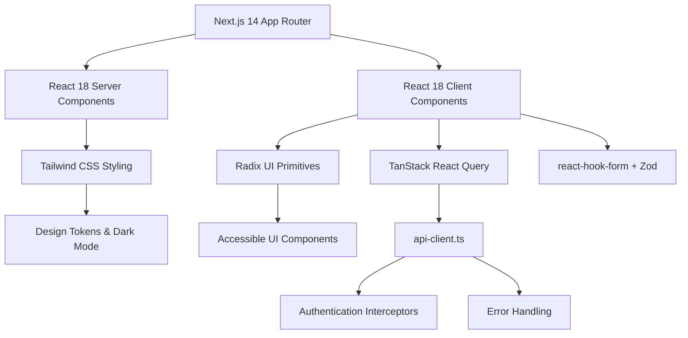
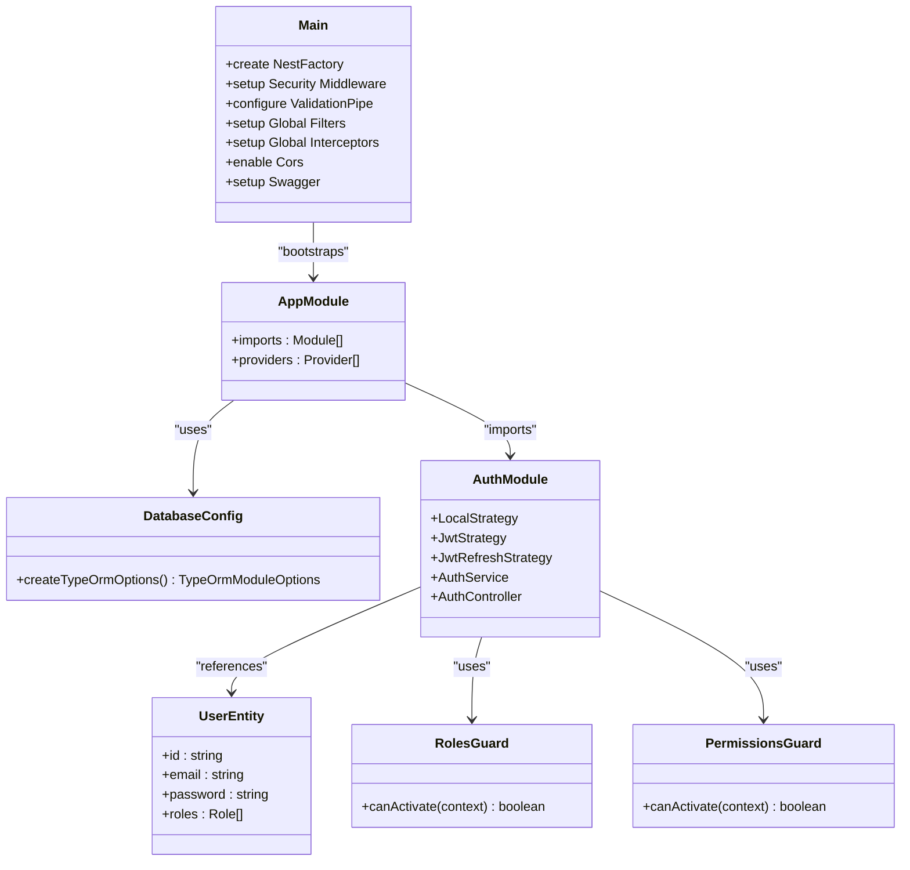
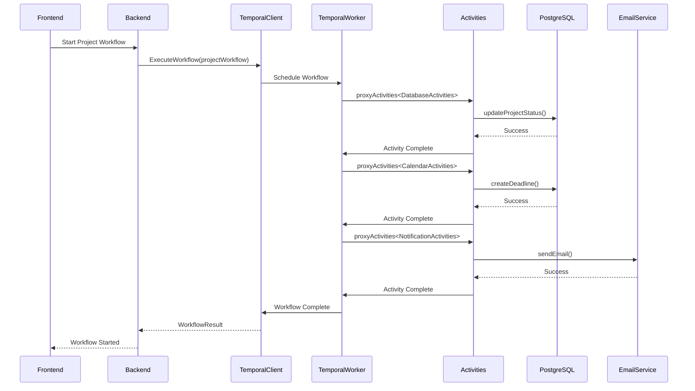
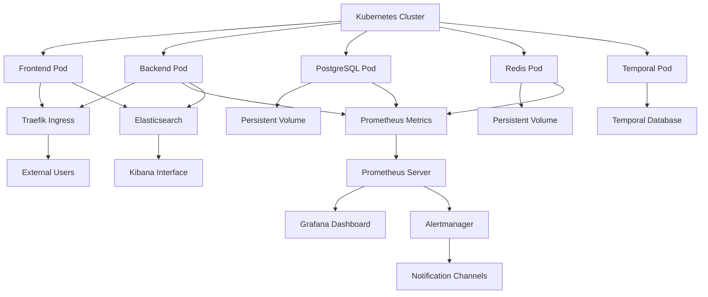
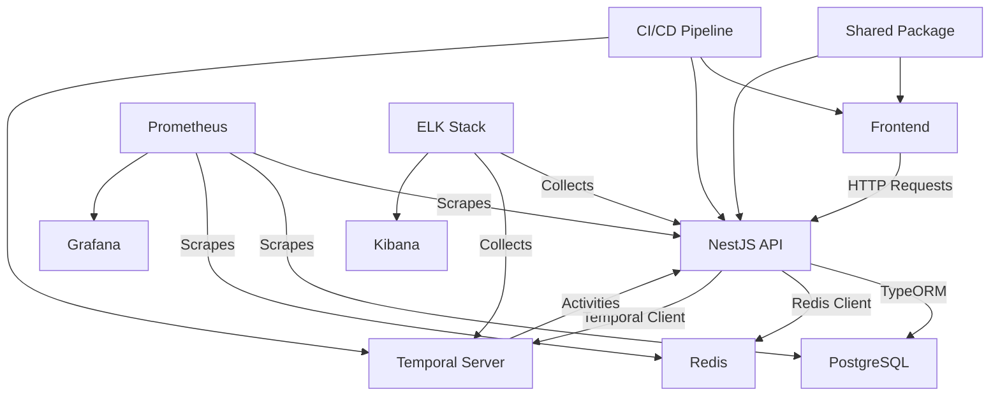

# Technology Stack

<cite>
**Referenced Files in This Document**   
- [package.json](file://apps/frontend/package.json)
- [package.json](file://apps/backend/package.json)
- [next.config.js](file://apps/frontend/next.config.js)
- [tailwind.config.js](file://apps/frontend/tailwind.config.js)
- [docker-compose.yml](file://docker-compose.yml)
- [app.module.ts](file://apps/backend/src/app.module.ts)
- [main.ts](file://apps/backend/src/main.ts)
- [configuration.ts](file://apps/backend/src/config/configuration.ts)
- [database.config.ts](file://apps/backend/src/config/database.config.ts)
- [temporal.module.ts](file://apps/backend/src/modules/temporal/temporal.module.ts)
- [project-workflows.ts](file://apps/backend/src/modules/temporal/workflows/project/project-workflows.ts)
- [calendar-workflows.ts](file://apps/backend/src/modules/temporal/workflows/calendar/calendar-workflows.ts)
- [layout.tsx](file://apps/frontend/src/app/layout.tsx)
- [api-client.ts](file://apps/frontend/src/lib/api-client.ts)
- [workflow.ts](file://apps/frontend/src/types/workflow.ts)
- [k8s/backend-deployment.yaml](file://k8s/backend-deployment.yaml)
- [k8s/frontend-deployment.yaml](file://k8s/frontend-deployment.yaml)
- [monitoring/prometheus/prometheus.yml](file://monitoring/prometheus/prometheus.yml)
- [monitoring/grafana/dashboards/accu-platform-overview.json](file://monitoring/grafana/dashboards/accu-platform-overview.json)
</cite>

## Table of Contents
1. [Introduction](#introduction)
2. [Frontend Technologies](#frontend-technologies)
3. [Backend Technologies](#backend-technologies)
4. [Workflow Engine](#workflow-engine)
5. [Infrastructure Components](#infrastructure-components)
6. [Technology Integration Patterns](#technology-integration-patterns)
7. [Version Compatibility](#version-compatibility)
8. [Conclusion](#conclusion)

## Introduction
The ACCU Platform is a comprehensive solution for managing Australian Carbon Credit Units (ACCU) with a sophisticated technology stack designed for scalability, reliability, and maintainability. This document provides an in-depth analysis of the platform's technology stack, covering frontend, backend, workflow orchestration, and infrastructure components. The architecture follows a modern microservices pattern with clear separation of concerns between the Next.js 14 frontend, NestJS backend API, Temporal.io workflow engine, and Kubernetes-based infrastructure. The platform leverages TypeScript across all layers for type safety and developer productivity, with shared types and utilities in the @accu/shared package.

## Frontend Technologies

The frontend of the ACCU Platform is built using a modern React-based stack with Next.js 14 as the foundation framework. This technology choice provides server-side rendering capabilities, improved SEO, and a seamless developer experience through the App Router feature. The UI is constructed using React 18 components with server and client components appropriately separated to optimize performance. State management is handled through a combination of React Context and Zustand for global state, while form handling leverages react-hook-form with Zod validation through the @hookform/resolvers package.

Styling is implemented using Tailwind CSS with a custom configuration that supports dark mode and design tokens for consistent theming across the application. The tailwind.config.js file defines a comprehensive design system with semantic color variables (hsl(var(--color-name))) that enable easy theme switching and accessibility compliance. The configuration extends the default theme with custom border radii, animations, and keyframes for accordions and other interactive elements.

UI components are built using Radix UI primitives, which provide accessible, unstyled components that can be customized with Tailwind classes. The component library includes @radix-ui/react-dialog, @radix-ui/react-dropdown-menu, @radix-ui/react-tabs, and other interactive components that ensure WCAG compliance. These are further enhanced with Lucide icons and animated transitions using framer-motion for a polished user experience.

Data fetching is managed through TanStack React Query (previously React Query), which provides a powerful caching layer and automatic background refetching. The api-client.ts implementation wraps Axios with interceptors for authentication token management, automatic refresh of JWT tokens, and centralized error handling. This client handles common scenarios like 401 unauthorized responses by automatically attempting token refresh before redirecting to the login page if refresh fails.

**Diagram sources**
- [next.config.js](file://apps/frontend/next.config.js)
- [tailwind.config.js](file://apps/frontend/tailwind.config.js)
- [api-client.ts](file://apps/frontend/src/lib/api-client.ts)
- [layout.tsx](file://apps/frontend/src/app/layout.tsx)

**Section sources**
- [package.json](file://apps/frontend/package.json)
- [next.config.js](file://apps/frontend/next.config.js)
- [tailwind.config.js](file://apps/frontend/tailwind.config.js)
- [api-client.ts](file://apps/frontend/src/lib/api-client.ts)

## Backend Technologies

The backend of the ACCU Platform is implemented using NestJS, a progressive Node.js framework that provides a robust architecture for building efficient and scalable server-side applications. NestJS leverages TypeScript and follows object-oriented programming, functional programming, and functional reactive programming principles. The framework's modular architecture is evident in the app.module.ts file, which imports various feature modules (AuthModule, UsersModule, ProjectsModule, etc.) and configures core services like database connections and rate limiting.

The API layer uses Express (via @nestjs/platform-express) with enhanced security middleware including Helmet for HTTP header protection, compression for response compression, and cookie-parser for cookie handling. The main.ts bootstrap file configures global pipes, filters, and interceptors that apply across all endpoints. The ValidationPipe ensures input validation with class-validator and class-transformer, automatically validating DTOs and transforming payloads to their corresponding classes. The HttpExceptionFilter provides centralized error handling, while logging and transformation interceptors add request logging and response formatting.

Data persistence is handled through TypeORM with PostgreSQL as the primary database. The DatabaseConfig class implements TypeOrmOptionsFactory to provide database configuration from environment variables, supporting both development and production environments. Entity classes (user.entity.ts, project.entity.ts, etc.) define the data model with decorators for columns, relationships, and constraints. The configuration supports SSL in production and includes connection pooling with a limit of 10 connections.

Authentication and authorization are implemented using Passport with JWT strategy. The auth module includes local strategy for username/password login, JWT strategy for token-based authentication, and refresh token strategy for token renewal. Custom decorators (@Roles, @Permissions) and guards (RolesGuard, PermissionsGuard) provide role-based access control across endpoints. The jwt configuration in configuration.ts defines token expiration times (15 minutes for access tokens, 7 days for refresh tokens) and secret management.

**Diagram sources**
- [app.module.ts](file://apps/backend/src/app.module.ts)
- [main.ts](file://apps/backend/src/main.ts)
- [database.config.ts](file://apps/backend/src/config/database.config.ts)
- [configuration.ts](file://apps/backend/src/config/configuration.ts)

**Section sources**
- [package.json](file://apps/backend/package.json)
- [app.module.ts](file://apps/backend/src/app.module.ts)
- [main.ts](file://apps/backend/src/main.ts)
- [database.config.ts](file://apps/backend/src/config/database.config.ts)

## Workflow Engine

The ACCU Platform utilizes Temporal.io as its workflow orchestration engine, providing reliable, durable, and scalable execution of long-running business processes. Temporal is integrated into the NestJS backend through the TemporalModule, which configures the Temporal client, worker, and workflow definitions. The temporal configuration in configuration.ts specifies connection details, namespace, task queue, and concurrency settings for workflow and activity execution.

Workflow definitions are organized by domain (accu-application, project, document, calendar) with each having dedicated workflow and activity modules. The project-workflows.ts file demonstrates a typical workflow structure using Temporal's workflow functions like proxyActivities, defineSignal, setHandler, and sleep. Workflows coordinate multiple activities across different domains, such as updating project status in the database, creating calendar events, sending notifications, and validating business rules.

Activities represent individual units of work that can be executed independently. The codebase defines several activity interfaces (DatabaseActivities, NotificationActivities, EmailActivities, CalendarActivities) that are proxied in workflows. Each activity has a timeout configuration (typically 1-2 minutes) to prevent indefinite blocking. The separation of workflow logic from activity implementation allows for retries, timeouts, and error handling at the activity level while maintaining workflow state.

The calendar-workflows.ts implementation showcases advanced Temporal features including signals for external events (pauseWorkflow, resumeWorkflow, cancelWorkflow), queries for workflow state inspection (getCalendarWorkflowState, getDeadlines), and complex scheduling logic for reminders and recurring deadlines. The workflow maintains state in memory and persists it automatically through Temporal's event sourcing mechanism, allowing for fault tolerance and the ability to reconstruct state at any point.

**Diagram sources**
- [temporal.module.ts](file://apps/backend/src/modules/temporal/temporal.module.ts)
- [project-workflows.ts](file://apps/backend/src/modules/temporal/workflows/project/project-workflows.ts)
- [calendar-workflows.ts](file://apps/backend/src/modules/temporal/workflows/calendar/calendar-workflows.ts)

**Section sources**
- [configuration.ts](file://apps/backend/src/config/configuration.ts)
- [temporal.module.ts](file://apps/backend/src/modules/temporal/temporal.module.ts)
- [project-workflows.ts](file://apps/backend/src/modules/temporal/workflows/project/project-workflows.ts)

## Infrastructure Components

The ACCU Platform is deployed using containerization and orchestration technologies that enable scalability, reliability, and efficient resource utilization. Docker is used to containerize both frontend and backend applications, with Dockerfiles in each app directory defining the build process. The docker-compose.yml file orchestrates the complete development environment, including PostgreSQL, Redis, backend API, frontend application, Traefik reverse proxy, and monitoring components.

Kubernetes is used for production deployments, with configuration files in the k8s directory defining deployments, services, configmaps, and secrets. The backend-deployment.yaml and frontend-deployment.yaml files specify pod templates, resource limits, environment variables, and health checks. The platform uses Kubernetes namespaces for environment isolation and ConfigMaps/Secrets for configuration management, separating sensitive data from application code.

Monitoring is implemented using the Prometheus and Grafana stack. Prometheus scrapes metrics from various services including the backend API, PostgreSQL, and Redis, with configuration in monitoring/prometheus/prometheus.yml. Alerting rules are defined to detect anomalies and trigger notifications. Grafana provides visualization of platform metrics through dashboards like accu-platform-overview.json, which displays key performance indicators, system health, and workflow execution metrics.

The infrastructure also includes Redis for caching and session storage, PostgreSQL for persistent data storage, and Traefik as a reverse proxy and load balancer. The docker-compose.yml file defines health checks for each service, ensuring that dependencies are available before starting dependent services. Log aggregation is handled by the ELK stack (Elasticsearch, Logstash, Kibana), providing centralized logging and search capabilities.

**Diagram sources**
- [docker-compose.yml](file://docker-compose.yml)
- [k8s/backend-deployment.yaml](file://k8s/backend-deployment.yaml)
- [k8s/frontend-deployment.yaml](file://k8s/frontend-deployment.yaml)
- [monitoring/prometheus/prometheus.yml](file://monitoring/prometheus/prometheus.yml)
- [monitoring/grafana/dashboards/accu-platform-overview.json](file://monitoring/grafana/dashboards/accu-platform-overview.json)

**Section sources**
- [docker-compose.yml](file://docker-compose.yml)
- [k8s/backend-deployment.yaml](file://k8s/backend-deployment.yaml)
- [k8s/frontend-deployment.yaml](file://k8s/frontend-deployment.yaml)
- [monitoring/prometheus/prometheus.yml](file://monitoring/prometheus/prometheus.yml)

## Technology Integration Patterns

The ACCU Platform demonstrates several effective integration patterns between its various technologies. The Next.js App Router integrates with the NestJS API through API routes that proxy requests to the backend service. The api-client.ts implementation in the frontend uses environment variables (NEXT_PUBLIC_API_URL) to determine the backend endpoint, allowing for different configurations in development and production.

The shared package (@accu/shared) serves as a contract between frontend and backend, containing shared types, constants, and utilities. This package is used as a workspace dependency in both frontend and backend package.json files, ensuring type consistency across the stack. The shared package includes Zod schemas for runtime type checking and date-fns for date manipulation, reducing duplication and ensuring consistency.

Temporal workflows integrate with the NestJS application through dependency injection, with the TemporalModule providing the Temporal client and worker as injectable services. Workflow definitions can access NestJS services through activities, creating a clean separation between orchestration logic and business logic. The workflow-orchestrator.service.ts (referenced in the project structure) likely provides an abstraction layer for starting and managing workflows from within NestJS controllers.

The monitoring stack integrates with the application through metrics endpoints exposed by the backend API. The NestJS application likely uses Prometheus client libraries to expose metrics on a /metrics endpoint, which Prometheus scrapes at regular intervals. Custom metrics track workflow execution times, API request rates, and error rates, providing visibility into system performance and reliability.

**Diagram sources**
- [package.json](file://apps/frontend/package.json)
- [package.json](file://apps/backend/package.json)
- [packages/shared/package.json](file://packages/shared/package.json)
- [api-client.ts](file://apps/frontend/src/lib/api-client.ts)
- [temporal.module.ts](file://apps/backend/src/modules/temporal/temporal.module.ts)

**Section sources**
- [package.json](file://apps/frontend/package.json)
- [package.json](file://apps/backend/package.json)
- [packages/shared/package.json](file://packages/shared/package.json)
- [api-client.ts](file://apps/frontend/src/lib/api-client.ts)

## Version Compatibility

The ACCU Platform maintains careful version compatibility across its technology stack to ensure stability and security. The frontend uses Next.js 14 with React 18, which are compatible versions that support the App Router and React Server Components. Tailwind CSS v3.3.3 is compatible with PostCSS 8 and works seamlessly with the Next.js build system. Radix UI components are versioned to work with React 18 features like concurrent rendering.

The backend uses NestJS 10, which is built on Express 4 and supports TypeScript 5. TypeORM v0.3.17 is compatible with PostgreSQL 15 and Node.js 18+. The Temporal.io client and worker libraries are version 1.7.0, which maintain compatibility with the Temporal server version used in the infrastructure. All TypeScript dependencies target version 5.1.x, ensuring consistent type checking and language features across the codebase.

The infrastructure components are also version-aligned: PostgreSQL 15, Redis 7, and Traefik v3.0. The monitoring stack uses the latest versions of Prometheus, Grafana, and ELK components that are known to work well together. Docker Compose version 3.8 provides compatibility with modern Docker features while maintaining backward compatibility.

Version compatibility is managed through the package.json files in each application and the shared package. The use of exact versions (e.g., "next": "14.0.0") rather than caret or tilde ranges ensures consistent builds across environments. The shared package has minimal dependencies (Zod and date-fns) to reduce version conflicts and ensure compatibility with both frontend and backend.

**Section sources**
- [package.json](file://apps/frontend/package.json)
- [package.json](file://apps/backend/package.json)
- [packages/shared/package.json](file://packages/shared/package.json)
- [docker-compose.yml](file://docker-compose.yml)

## Conclusion

The ACCU Platform's technology stack represents a modern, well-architected solution for managing carbon credit units with a focus on reliability, scalability, and developer experience. The combination of Next.js 14 and React 18 provides a responsive, accessible frontend with excellent performance characteristics. NestJS offers a robust, modular backend framework with strong typing and dependency injection. Temporal.io enables reliable orchestration of complex business workflows with built-in fault tolerance and observability.

The infrastructure components provide a solid foundation for deployment, monitoring, and scaling, with Kubernetes enabling production-grade reliability and Prometheus/Grafana providing comprehensive observability. The integration patterns between components are well-designed, with clear boundaries and contracts that enable independent development and testing. The version compatibility across the stack ensures stability and reduces the risk of dependency conflicts.

This technology stack positions the ACCU Platform for long-term success, with modern tools that are actively maintained and have strong community support. The architecture allows for incremental improvements and the addition of new features without major refactoring, making it well-suited for the evolving requirements of carbon credit management.