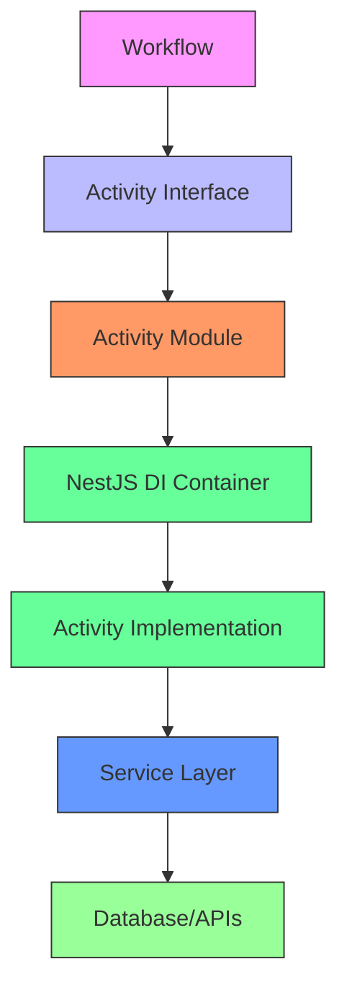
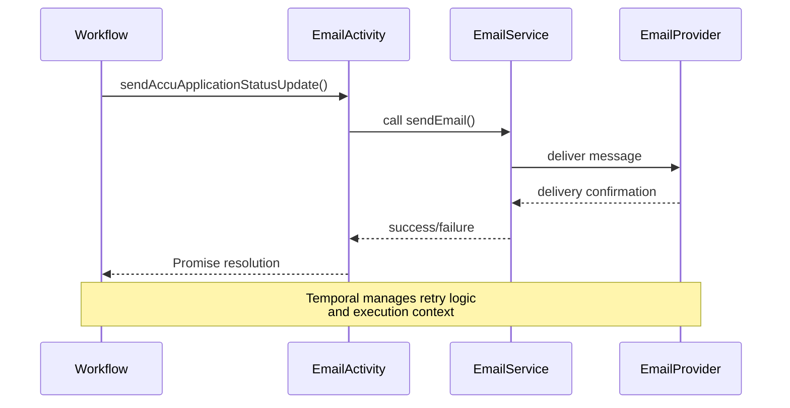
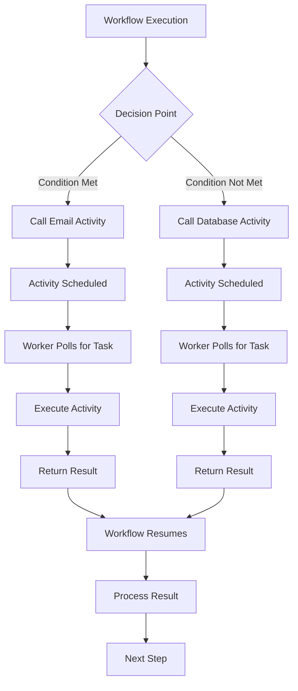

# Activity Implementation

<cite>
**Referenced Files in This Document**   
- [email-activities.ts](file://apps/backend/src/modules/temporal/activities/email-activities.ts)
- [email-activities.module.ts](file://apps/backend/src/modules/temporal/activities/email-activities.module.ts)
- [notification-activities.ts](file://apps/backend/src/modules/temporal/activities/notification-activities.ts)
- [notification-activities.module.ts](file://apps/backend/src/modules/temporal/activities/notification-activities.module.ts)
- [database-activities.ts](file://apps/backend/src/modules/temporal/activities/database-activities.ts)
- [database-activities.module.ts](file://apps/backend/src/modules/temporal/activities/database-activities.module.ts)
- [calendar-activities.ts](file://apps/backend/src/modules/temporal/activities/calendar-activities.ts)
- [calendar-activities.module.ts](file://apps/backend/src/modules/temporal/activities/calendar-activities.module.ts)
- [email.service.ts](file://apps/backend/src/modules/email/email.service.ts)
- [notifications.service.ts](file://apps/backend/src/modules/notifications/notifications.service.ts)
- [calendar.service.ts](file://apps/backend/src/modules/calendar/calendar.service.ts)
- [temporal.worker.ts](file://apps/backend/src/modules/temporal/temporal.worker.ts)
</cite>

## Table of Contents
1. [Introduction](#introduction)
2. [Activity Structure and Definition](#activity-structure-and-definition)
3. [Module Integration and Dependency Injection](#module-integration-and-dependency-injection)
4. [Activity Execution Context](#activity-execution-context)
5. [Email Activities Implementation](#email-activities-implementation)
6. [Notification Activities Implementation](#notification-activities-implementation)
7. [Database Activities Implementation](#database-activities-implementation)
8. [Calendar Activities Implementation](#calendar-activities-implementation)
9. [Workflow Integration and Invocation](#workflow-integration-and-invocation)
10. [Reliability Features](#reliability-features)
11. [Performance Considerations](#performance-considerations)
12. [Best Practices](#best-practices)

## Introduction
This document provides a comprehensive analysis of activity implementation within the Temporal workflow engine in the ACCU platform. Activities represent discrete units of work that are orchestrated by workflows and executed by Temporal workers. They encapsulate business logic for operations such as database updates, email sending, calendar management, and notification dispatching. This documentation details the structure, integration, execution, and best practices for implementing reliable and testable activities within the NestJS application architecture.

## Activity Structure and Definition

Temporal activities in this codebase are defined as TypeScript interfaces that specify the contract for executable operations. Each activity interface declares methods that represent specific business operations, with clearly typed parameters and Promise-based return signatures to support asynchronous execution.

The activities are organized into domain-specific modules including email, notification, database, and calendar operations. Each activity interface follows a consistent pattern where methods represent atomic business operations with descriptive names that indicate their purpose and scope.

All activities utilize the `proxyActivities` function from the Temporal SDK to create a proxy that enables workflow orchestration. This proxy handles the communication between workflows and activity implementations, abstracting the underlying execution mechanics.

**Section sources**
- [email-activities.ts](file://apps/backend/src/modules/temporal/activities/email-activities.ts#L3-L9)
- [notification-activities.ts](file://apps/backend/src/modules/temporal/activities/notification-activities.ts#L3-L9)
- [database-activities.ts](file://apps/backend/src/modules/temporal/activities/database-activities.ts#L3-L13)
- [calendar-activities.ts](file://apps/backend/src/modules/temporal/activities/calendar-activities.ts#L3-L11)

## Module Integration and Dependency Injection

Activities are integrated into the NestJS dependency injection system through dedicated module classes. Each activity type has a corresponding module (e.g., EmailActivitiesModule, NotificationActivitiesModule) that registers the activity interface as a provider and exports it for use throughout the application.

The module pattern enables proper dependency injection and facilitates testing by allowing activity implementations to be easily mocked or replaced. This architectural approach aligns with NestJS best practices and ensures that activities are properly instantiated and managed by the application's dependency injection container.

The module configuration is minimal but essential, declaring the activity interface as both a provider and export to make it available to workflows and other components that need to reference the activity definitions.

**Diagram sources**
- [email-activities.module.ts](file://apps/backend/src/modules/temporal/activities/email-activities.module.ts#L1-L8)
- [notification-activities.module.ts](file://apps/backend/src/modules/temporal/activities/notification-activities.module.ts#L1-L8)
- [database-activities.module.ts](file://apps/backend/src/modules/temporal/activities/database-activities.module.ts#L1-L8)
- [calendar-activities.module.ts](file://apps/backend/src/modules/temporal/activities/calendar-activities.module.ts#L1-L8)

**Section sources**
- [email-activities.module.ts](file://apps/backend/src/modules/temporal/activities/email-activities.module.ts#L1-L8)
- [notification-activities.module.ts](file://apps/backend/src/modules/temporal/activities/notification-activities.module.ts#L1-L8)

## Activity Execution Context

Activities execute within the context of Temporal workers, which are responsible for polling the Temporal service for activity tasks and executing them. The worker runtime handles the lifecycle of activity execution, including serialization, deserialization, and communication with the Temporal server.

Each activity runs in an isolated execution context with defined timeouts and retry policies. The startToCloseTimeout parameter specified in the activity proxy configuration determines the maximum time allowed for an activity to complete before it is considered failed. This timeout is set according to the expected duration of the operation, with more complex operations like database updates allocated longer timeouts (2 minutes) compared to simpler operations like notifications (1 minute).

Activities are stateless and idempotent by design, allowing them to be safely retried in case of failures or timeouts. The Temporal framework ensures that activities are executed exactly once from the workflow's perspective, even if they are retried due to worker failures or network issues.

**Section sources**
- [email-activities.ts](file://apps/backend/src/modules/temporal/activities/email-activities.ts#L19-L21)
- [notification-activities.ts](file://apps/backend/src/modules/temporal/activities/notification-activities.ts#L17-L19)
- [database-activities.ts](file://apps/backend/src/modules/temporal/activities/database-activities.ts#L25-L27)
- [calendar-activities.ts](file://apps/backend/src/modules/temporal/activities/calendar-activities.ts#L21-L23)

## Email Activities Implementation

The email activities provide a comprehensive interface for sending various types of email communications within the application. The EmailActivities interface defines methods for sending individual emails, bulk emails, and domain-specific notifications such as application status updates, project deadline reminders, and document approval requests.

These activities serve as an abstraction layer between workflows and the underlying email service implementation. When invoked, email activities delegate to the email.service.ts implementation to handle the actual email delivery through the configured email provider. This separation of concerns allows workflows to focus on orchestration logic while the details of email delivery are encapsulated within the service layer.

The activity methods include specialized functions for different business scenarios, ensuring that workflows can trigger appropriate communications with minimal configuration. For example, the sendAccuApplicationStatusUpdate method handles the specific requirements for notifying users about changes to their application status.

**Diagram sources**
- [email-activities.ts](file://apps/backend/src/modules/temporal/activities/email-activities.ts#L3-L9)
- [email.service.ts](file://apps/backend/src/modules/email/email.service.ts)

**Section sources**
- [email-activities.ts](file://apps/backend/src/modules/temporal/activities/email-activities.ts#L3-L9)
- [email.service.ts](file://apps/backend/src/modules/email/email.service.ts)

## Notification Activities Implementation

The notification activities provide a multi-channel notification system that supports email, SMS, push notifications, in-app notifications, and scheduled reminders. The NotificationActivities interface defines a comprehensive set of methods for delivering notifications through various channels, enabling workflows to communicate with users through their preferred methods.

These activities integrate with the notifications.service.ts implementation to create and deliver notifications across different channels. The service layer handles the persistence of notification records in the database and coordinates delivery through external providers. This architecture ensures that notifications are reliably delivered while maintaining a record of all communications for auditing and tracking purposes.

The activity design supports both immediate and scheduled notifications, with the scheduleReminder method allowing workflows to set up future notifications based on specific events or deadlines. This capability is particularly useful for deadline reminders and status update notifications.

**Section sources**
- [notification-activities.ts](file://apps/backend/src/modules/temporal/activities/notification-activities.ts#L3-L9)
- [notifications.service.ts](file://apps/backend/src/modules/notifications/notifications.service.ts)

## Database Activities Implementation

The database activities encapsulate various data persistence operations required by workflows, including updating entity statuses, creating calendar events, logging workflow events, and validating business rules. The DatabaseActivities interface provides a comprehensive set of methods for interacting with the application's data layer in a controlled and auditable manner.

These activities serve as a gateway between workflows and the database, ensuring that all data modifications go through a consistent and monitored path. By centralizing database operations within activities, the system can enforce business rules, maintain audit trails, and ensure data consistency across different workflow executions.

Key operations include updating the status of ACCU applications, projects, and documents, as well as creating workflow history entries that provide visibility into workflow execution. The validateBusinessRules method allows workflows to check whether specific business constraints are satisfied before proceeding with certain operations.

**Section sources**
- [database-activities.ts](file://apps/backend/src/modules/temporal/activities/database-activities.ts#L3-L13)
- [temporal.worker.ts](file://apps/backend/src/modules/temporal/temporal.worker.ts)

## Calendar Activities Implementation

The calendar activities provide functionality for managing deadlines, events, and reminders within the application. The CalendarActivities interface defines methods for creating deadlines, scheduling reminders, updating deadline statuses, and synchronizing with external calendar systems.

These activities enable workflows to coordinate time-based operations and ensure that important deadlines are tracked and communicated appropriately. The createDeadline method allows workflows to establish new deadlines with associated metadata such as priority and assignment, while the updateDeadlineStatus method enables workflows to mark deadlines as completed or update their status.

The escalateOverdueDeadline method provides automated escalation capabilities for deadlines that have passed their due date, ensuring that overdue tasks receive appropriate attention. The generateDeadlineReport method supports reporting and analytics by creating summaries of deadline status across projects.

**Section sources**
- [calendar-activities.ts](file://apps/backend/src/modules/temporal/activities/calendar-activities.ts#L3-L11)
- [calendar.service.ts](file://apps/backend/src/modules/calendar/calendar.service.ts)

## Workflow Integration and Invocation

Activities are invoked from workflows using the imported activity functions created through the proxyActivities mechanism. Workflows import the specific activity functions they need and call them like regular functions, with the Temporal framework handling the underlying execution mechanics.

When a workflow calls an activity function, the Temporal SDK serializes the function call and its parameters, then schedules the activity for execution by an available worker. The workflow execution is suspended until the activity completes, at which point the result is deserialized and returned to the workflow.

This invocation model enables workflows to coordinate complex business processes by composing multiple activities in a specific sequence, with the ability to handle results and make decisions based on activity outcomes. The promise-based return type of activities allows workflows to use async/await syntax for clean and readable orchestration code.

**Diagram sources**
- [email-activities.ts](file://apps/backend/src/modules/temporal/activities/email-activities.ts)
- [database-activities.ts](file://apps/backend/src/modules/temporal/activities/database-activities.ts)
- [temporal.worker.ts](file://apps/backend/src/modules/temporal/temporal.worker.ts)

**Section sources**
- [email-activities.ts](file://apps/backend/src/modules/temporal/activities/email-activities.ts)
- [database-activities.ts](file://apps/backend/src/modules/temporal/activities/database-activities.ts)

## Reliability Features

The activity implementation incorporates several reliability features to ensure robust execution in distributed environments. Idempotency is a core principle, with activities designed to produce the same result when executed multiple times with the same input parameters. This enables safe retry behavior in case of failures.

Timeouts are configured at the activity level to prevent indefinite execution and ensure that workflows can progress even if an activity encounters issues. The startToCloseTimeout parameter defines the maximum time allowed for an activity to complete, with different timeouts set based on the expected duration of the operation.

Retry policies are implicitly managed by the Temporal framework, which automatically retries activities in case of failures according to configurable retry policies. This includes handling transient failures such as network issues or temporary service unavailability.

Error handling is implemented through promise rejection, with activities throwing errors that are propagated back to the calling workflow. Workflows can then implement appropriate error handling strategies, such as retrying the activity, compensating for the failure, or failing the entire workflow.

**Section sources**
- [email-activities.ts](file://apps/backend/src/modules/temporal/activities/email-activities.ts#L19-L21)
- [notification-activities.ts](file://apps/backend/src/modules/temporal/activities/notification-activities.ts#L17-L19)
- [database-activities.ts](file://apps/backend/src/modules/temporal/activities/database-activities.ts#L25-L27)

## Performance Considerations

The activity implementation considers several performance aspects to ensure efficient execution and resource utilization. Timeouts are carefully configured to balance reliability with responsiveness, preventing activities from running indefinitely while allowing sufficient time for completion.

The separation of activities from their implementations allows for optimization of the underlying service layers without affecting workflow logic. For example, the email service can implement connection pooling or batching to improve delivery performance without requiring changes to the activity interface or workflows.

Activity granularity is designed to balance the overhead of activity execution with the need for monitoring and retry capabilities. Each activity represents a meaningful unit of work that can be monitored, retried, and audited independently, while avoiding excessive fragmentation that could impact performance.

The use of asynchronous execution and promise-based returns enables non-blocking operation, allowing workers to handle multiple activities concurrently and improving overall throughput.

**Section sources**
- [email-activities.ts](file://apps/backend/src/modules/temporal/activities/email-activities.ts#L19-L21)
- [temporal.worker.ts](file://apps/backend/src/modules/temporal/temporal.worker.ts)

## Best Practices

The activity implementation follows several best practices for building reliable and maintainable workflow systems:

1. **Single Responsibility**: Each activity performs a single, well-defined operation, making them easier to test, debug, and reuse.

2. **Clear Interface Design**: Activity interfaces use descriptive method names and well-typed parameters to make their purpose and usage clear.

3. **Appropriate Granularity**: Activities are designed at a meaningful level of abstraction, representing discrete business operations rather than low-level technical steps.

4. **Idempotency**: Activities are designed to be idempotent, ensuring safe retry behavior in distributed environments.

5. **Proper Error Handling**: Activities use promise rejection for error reporting, enabling workflows to implement appropriate error handling strategies.

6. **Configurable Timeouts**: Activities have appropriately configured timeouts based on their expected execution duration.

7. **Separation of Concerns**: Activities delegate to service layers for implementation details, keeping workflow orchestration logic separate from operational details.

8. **Comprehensive Coverage**: The activity set covers all major business operations required by workflows, providing a complete toolkit for process orchestration.

Following these practices ensures that activities are reliable, testable, and maintainable components of the workflow system.

**Section sources**
- [email-activities.ts](file://apps/backend/src/modules/temporal/activities/email-activities.ts)
- [notification-activities.ts](file://apps/backend/src/modules/temporal/activities/notification-activities.ts)
- [database-activities.ts](file://apps/backend/src/modules/temporal/activities/database-activities.ts)
- [calendar-activities.ts](file://apps/backend/src/modules/temporal/activities/calendar-activities.ts)