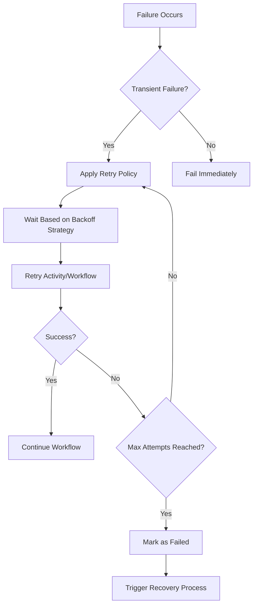
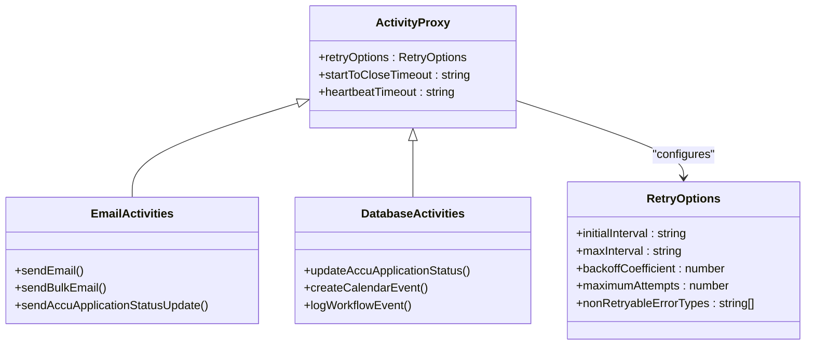
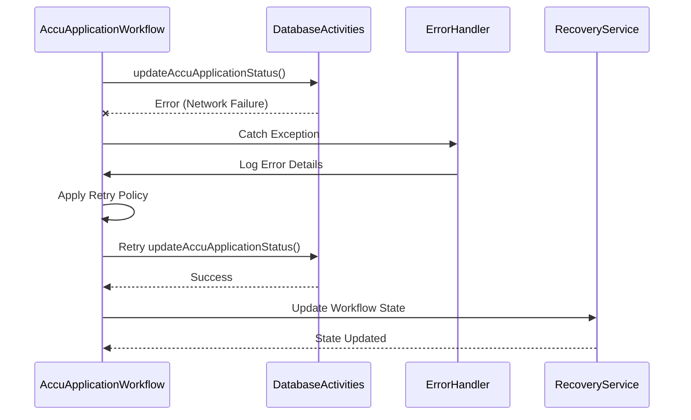
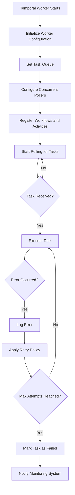
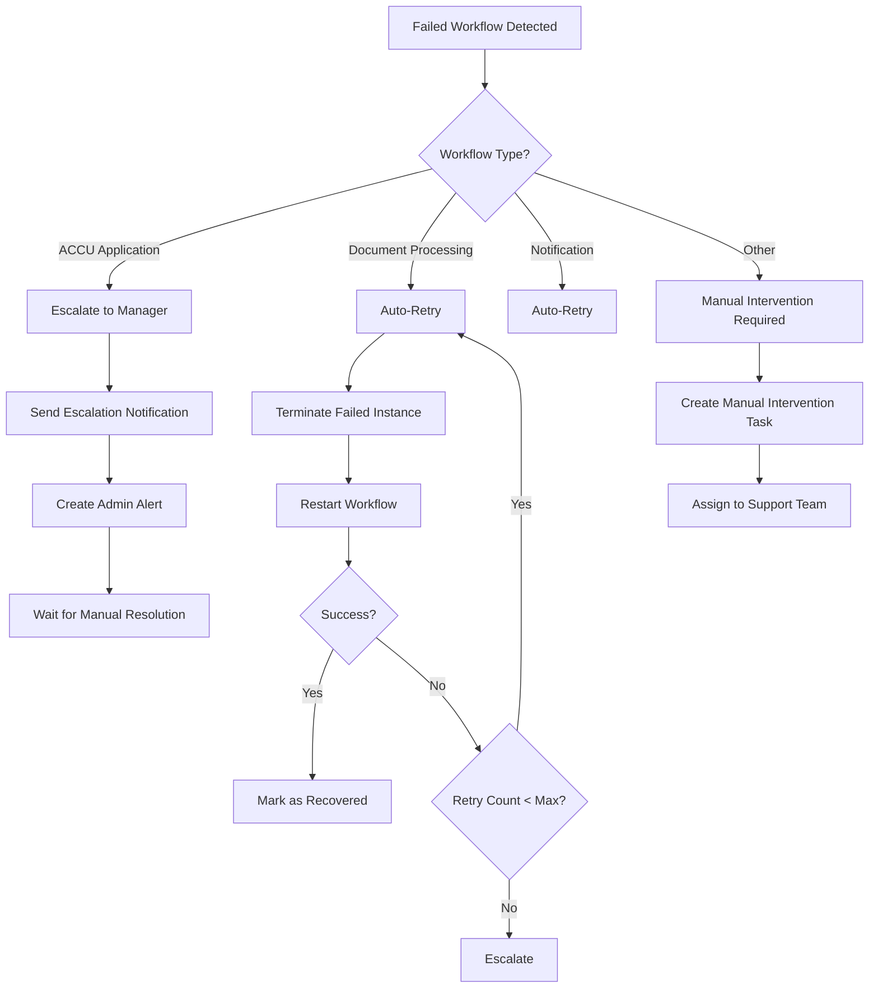
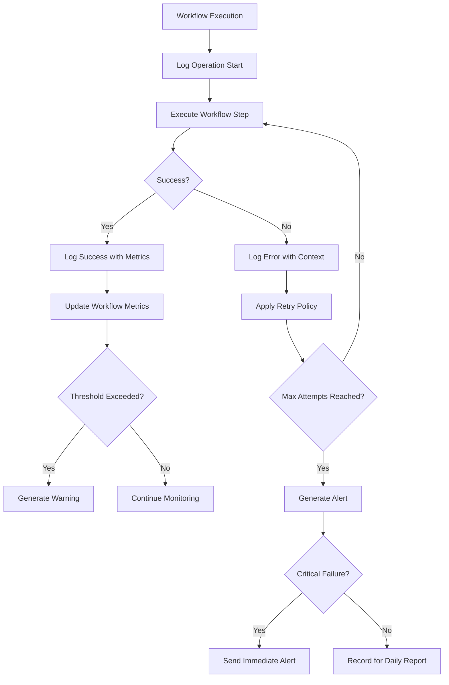

# Error Handling and Retries

<cite>
**Referenced Files in This Document**   
- [email-activities.ts](file://apps/backend/src/modules/temporal/activities/email-activities.ts)
- [accu-application-workflows.ts](file://apps/backend/src/modules/temporal/workflows/accu-application/accu-application-workflows.ts)
- [temporal.worker.ts](file://apps/backend/src/modules/temporal/temporal.worker.ts)
- [temporal.service.ts](file://apps/backend/src/modules/temporal/temporal.service.ts)
- [workflow-monitoring.service.ts](file://apps/backend/src/modules/temporal/workflow-monitoring.service.ts)
- [database-activities.ts](file://apps/backend/src/modules/temporal/activities/database-activities.ts)
- [notification-activities.ts](file://apps/backend/src/modules/temporal/activities/notification-activities.ts)
- [workflow.controller.ts](file://apps/backend/src/modules/temporal/workflow.controller.ts)
- [workflow-orchestrator.service.ts](file://apps/backend/src/modules/temporal/workflow-orchestrator.service.ts)
- [configuration.ts](file://apps/backend/src/config/configuration.ts)
</cite>

## Table of Contents
1. [Introduction](#introduction)
2. [Temporal Retry Mechanisms](#temporal-retry-mechanisms)
3. [Activity-Level Retry Configuration](#activity-level-retry-configuration)
4. [Workflow-Level Error Handling](#workflow-level-error-handling)
5. [Global Error Handling Configuration](#global-error-handling-configuration)
6. [Failed Workflow Monitoring and Recovery](#failed-workflow-monitoring-and-recovery)
7. [Best Practices for Logging and Alerting](#best-practices-for-logging-and-alerting)
8. [Conclusion](#conclusion)

## Introduction
The Temporal workflow engine in the ACCU platform provides robust fault tolerance through comprehensive error handling and retry mechanisms. This document details how the system handles transient failures, implements retry policies, and ensures workflow reliability across various components. The implementation leverages Temporal's built-in capabilities for activity retries, workflow retries, and exception handling to maintain system resilience in the face of network issues, service outages, and other transient failures.

**Section sources**
- [accu-application-workflows.ts](file://apps/backend/src/modules/temporal/workflows/accu-application/accu-application-workflows.ts#L1-L388)
- [email-activities.ts](file://apps/backend/src/modules/temporal/activities/email-activities.ts#L1-L21)

## Temporal Retry Mechanisms
The Temporal workflow engine provides built-in fault tolerance through multiple layers of retry mechanisms. The system implements both activity-level and workflow-level retries to handle transient failures gracefully. Activity retries are configured with exponential backoff patterns, while workflow retries handle more significant failures that require complete workflow restarts.

The retry system is designed to handle common transient failures such as network connectivity issues, database timeouts, and temporary service unavailability. Each retry attempt follows a carefully configured backoff strategy to prevent overwhelming downstream services while ensuring timely recovery from temporary outages.

**Diagram sources**
- [accu-application-workflows.ts](file://apps/backend/src/modules/temporal/workflows/accu-application/accu-application-workflows.ts#L1-L388)
- [email-activities.ts](file://apps/backend/src/modules/temporal/activities/email-activities.ts#L1-L21)

**Section sources**
- [accu-application-workflows.ts](file://apps/backend/src/modules/temporal/workflows/accu-application/accu-application-workflows.ts#L1-L388)
- [email-activities.ts](file://apps/backend/src/modules/temporal/activities/email-activities.ts#L1-L21)

## Activity-Level Retry Configuration
Activity-level retry policies are configured through the Temporal SDK with specific parameters for initial interval, maximum interval, backoff coefficient, and maximum attempts. These configurations are implemented in activity proxies throughout the codebase, with different settings based on the criticality and nature of each activity.

The retry policy configuration includes:
- **Initial interval**: The delay before the first retry attempt
- **Maximum interval**: The upper limit for retry delays
- **Backoff coefficient**: The multiplier applied to the interval after each failed attempt
- **Maximum attempts**: The total number of retry attempts before permanent failure

For example, email activities are configured with a 2-minute timeout and appropriate retry policies to handle transient network issues when sending notifications. The system uses different retry configurations for different activity types based on their failure characteristics and business criticality.

**Diagram sources**
- [email-activities.ts](file://apps/backend/src/modules/temporal/activities/email-activities.ts#L1-L21)
- [database-activities.ts](file://apps/backend/src/modules/temporal/activities/database-activities.ts#L1-L27)
- [notification-activities.ts](file://apps/backend/src/modules/temporal/activities/notification-activities.ts#L1-L19)

**Section sources**
- [email-activities.ts](file://apps/backend/src/modules/temporal/activities/email-activities.ts#L1-L21)
- [database-activities.ts](file://apps/backend/src/modules/temporal/activities/database-activities.ts#L1-L27)
- [notification-activities.ts](file://apps/backend/src/modules/temporal/activities/notification-activities.ts#L1-L19)

## Workflow-Level Error Handling
Workflow-level error handling in the ACCU platform is implemented through comprehensive exception handling in the `accu-application-workflows.ts` file. The system uses try-catch blocks around critical workflow sections and implements compensation logic for failed operations. When errors occur, the workflow captures the failure context and triggers appropriate recovery processes.

The workflow implementation includes manual intervention points that allow administrators to resolve issues that cannot be automatically recovered. Signal handlers are used to process external events and error conditions, while query handlers provide visibility into the current workflow state for debugging purposes.

In the ACCU application workflow, specific error handling patterns include:
- Validation of business rules before critical operations
- Timeout handling for reviewer assignment and approval processes
- Automatic escalation when deadlines are missed
- State persistence to ensure recovery from failures

**Diagram sources**
- [accu-application-workflows.ts](file://apps/backend/src/modules/temporal/workflows/accu-application/accu-application-workflows.ts#L1-L388)
- [database-activities.ts](file://apps/backend/src/modules/temporal/activities/database-activities.ts#L1-L27)

**Section sources**
- [accu-application-workflows.ts](file://apps/backend/src/modules/temporal/workflows/accu-application/accu-application-workflows.ts#L1-L388)

## Global Error Handling Configuration
The global error handling configuration is managed through the `temporal.worker.ts` and `temporal.service.ts` files, which set up the Temporal worker with appropriate error handling and monitoring capabilities. The worker configuration includes settings for concurrent pollers and executions, which impact how errors are handled under load.

The Temporal service implements comprehensive error logging and monitoring, capturing failures at multiple levels of the workflow execution stack. Error handling is integrated with the application's logging system, ensuring that all workflow failures are properly recorded and available for analysis.

Configuration options in `configuration.ts` allow environment-specific tuning of Temporal parameters, including connection settings and namespace configuration. These settings impact how the system handles connection failures and service discovery issues.

**Diagram sources**
- [temporal.worker.ts](file://apps/backend/src/modules/temporal/temporal.worker.ts#L1-L24)
- [temporal.service.ts](file://apps/backend/src/modules/temporal/temporal.service.ts#L1-L126)
- [configuration.ts](file://apps/backend/src/config/configuration.ts#L1-L95)

**Section sources**
- [temporal.worker.ts](file://apps/backend/src/modules/temporal/temporal.worker.ts#L1-L24)
- [temporal.service.ts](file://apps/backend/src/modules/temporal/temporal.service.ts#L1-L126)
- [configuration.ts](file://apps/backend/src/config/configuration.ts#L1-L95)

## Failed Workflow Monitoring and Recovery
Failed workflow monitoring and recovery is implemented through the `workflow-monitoring.service.ts` and associated controller endpoints. The system provides comprehensive monitoring capabilities including workflow metrics, failed workflow detection, and automated recovery processes.

The monitoring service includes scheduled tasks that run at different intervals:
- Every 5 minutes: Health monitoring and failure rate alerts
- Every hour: Failed workflow checks and auto-retry processing
- Daily: Comprehensive workflow reporting

Recovery mechanisms include:
- Automatic retry of failed workflows for transient errors
- Escalation to manual intervention for persistent failures
- Manual intervention capabilities through API endpoints
- Audit trails for all recovery actions

The system distinguishes between different types of failures and applies appropriate recovery strategies based on workflow type and failure context. Critical workflows like ACCU application processing are escalated to human operators, while less critical workflows may be automatically retried.

**Diagram sources**
- [workflow-monitoring.service.ts](file://apps/backend/src/modules/temporal/workflow-monitoring.service.ts#L1-L509)
- [workflow.controller.ts](file://apps/backend/src/modules/temporal/workflow.controller.ts#L1-L346)
- [workflow-orchestrator.service.ts](file://apps/backend/src/modules/temporal/workflow-orchestrator.service.ts#L1-L442)

**Section sources**
- [workflow-monitoring.service.ts](file://apps/backend/src/modules/temporal/workflow-monitoring.service.ts#L1-L509)
- [workflow.controller.ts](file://apps/backend/src/modules/temporal/workflow.controller.ts#L1-L346)
- [workflow-orchestrator.service.ts](file://apps/backend/src/modules/temporal/workflow-orchestrator.service.ts#L1-L442)

## Best Practices for Logging and Alerting
The system implements comprehensive logging and alerting practices to ensure visibility into workflow execution and failures. All workflow operations are logged with appropriate severity levels, and structured logging is used to facilitate analysis and monitoring.

Key logging practices include:
- Detailed error logging with context information
- Structured log format for machine readability
- Correlation IDs to trace workflow execution
- Performance metrics logging for monitoring

Alerting is configured based on critical metrics:
- High failure rates (more than 10% of workflows failing)
- Stuck workflows running beyond expected duration
- High workflow load that may impact system performance
- Critical service connectivity issues

The monitoring system generates daily reports that summarize workflow performance and highlight areas requiring attention. These reports include recommendations for optimization and troubleshooting based on observed patterns.

**Diagram sources**
- [workflow-monitoring.service.ts](file://apps/backend/src/modules/temporal/workflow-monitoring.service.ts#L1-L509)
- [temporal.service.ts](file://apps/backend/src/modules/temporal/temporal.service.ts#L1-L126)

**Section sources**
- [workflow-monitoring.service.ts](file://apps/backend/src/modules/temporal/workflow-monitoring.service.ts#L1-L509)
- [temporal.service.ts](file://apps/backend/src/modules/temporal/temporal.service.ts#L1-L126)

## Conclusion
The Temporal workflow engine in the ACCU platform provides a comprehensive error handling and retry framework that ensures system reliability and resilience. Through a combination of activity-level retries, workflow-level error handling, and global monitoring, the system can gracefully handle transient failures and recover from more significant issues.

The implementation demonstrates best practices in workflow error management, including appropriate retry policies, clear escalation paths, and comprehensive monitoring. By leveraging Temporal's built-in fault tolerance features, the platform maintains high availability and data consistency even in the face of infrastructure issues and service outages.

[No sources needed since this section summarizes without analyzing specific files]