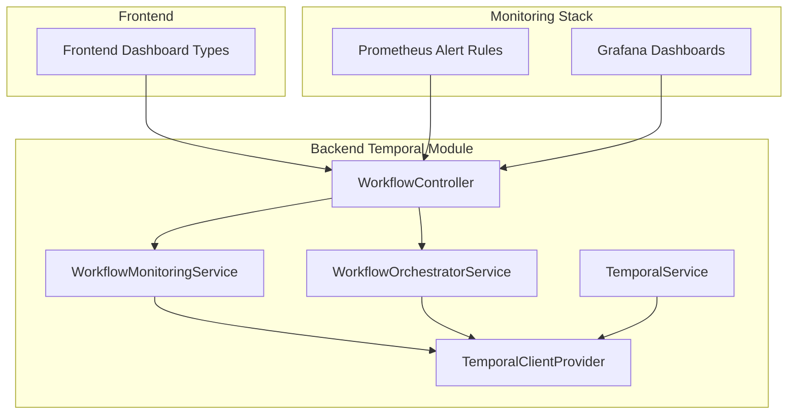
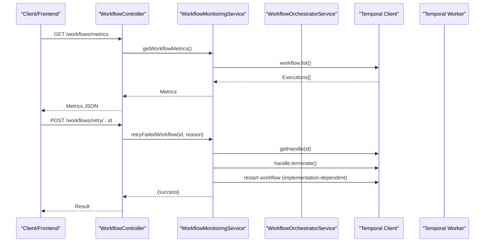
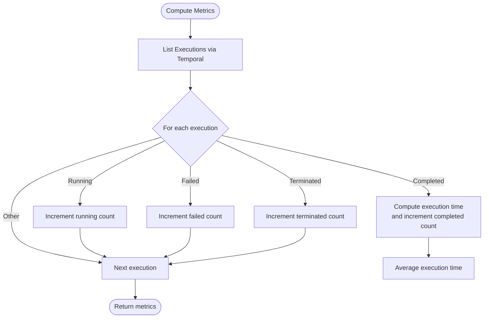
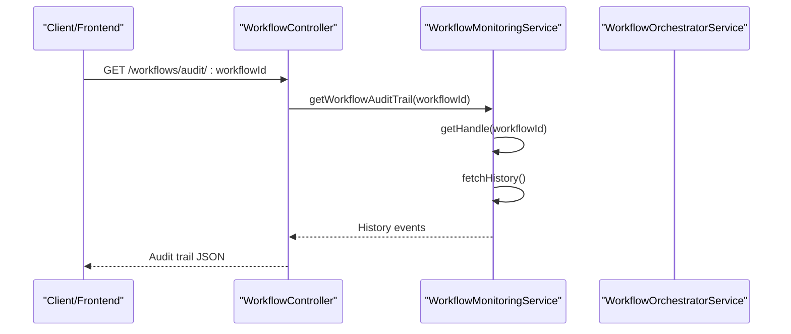
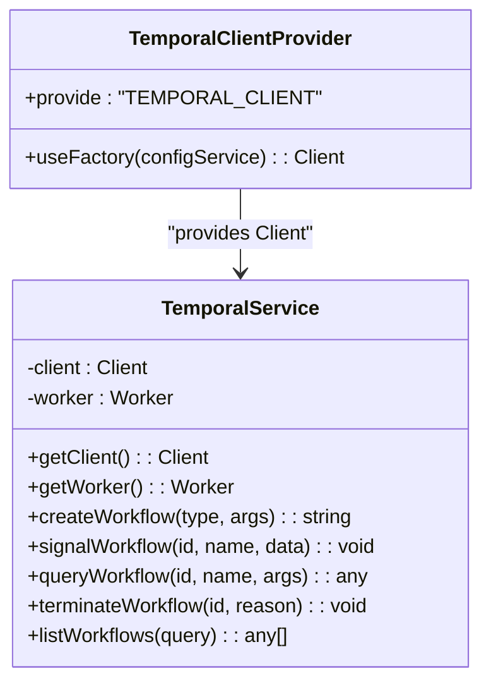
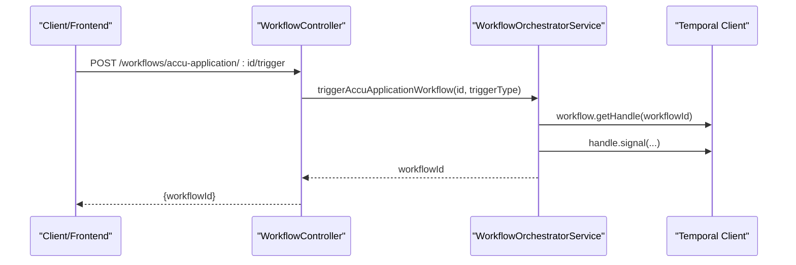
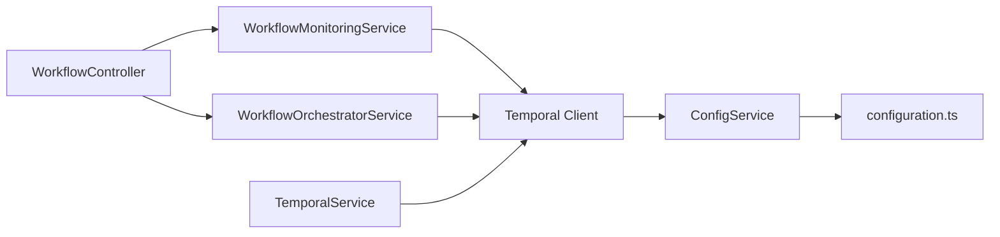

# Monitoring and Debugging

<cite>
**Referenced Files in This Document**
- [workflow-monitoring.service.ts](file://apps/backend/src/modules/temporal/workflow-monitoring.service.ts)
- [workflow.controller.ts](file://apps/backend/src/modules/temporal/workflow.controller.ts)
- [temporal.client.ts](file://apps/backend/src/modules/temporal/temporal.client.ts)
- [temporal.service.ts](file://apps/backend/src/modules/temporal/temporal.service.ts)
- [workflow-orchestrator.service.ts](file://apps/backend/src/modules/temporal/workflow-orchestrator.service.ts)
- [configuration.ts](file://apps/backend/src/config/configuration.ts)
- [alert_rules.yml](file://monitoring/prometheus/alert_rules.yml)
- [accu-platform-overview.json](file://monitoring/grafana/dashboards/accu-platform-overview.json)
- [workflow.ts](file://apps/frontend/src/types/workflow.ts)
- [temporal.module.ts](file://apps/backend/src/modules/temporal/temporal.module.ts)
- [accu-application-workflows.ts](file://apps/backend/src/modules/temporal/workflows/accu-application/accu-application-workflows.ts)
- [project-workflows.ts](file://apps/backend/src/modules/temporal/workflows/project/project-workflows.ts)
</cite>

## Table of Contents
1. [Introduction](#introduction)
2. [Project Structure](#project-structure)
3. [Core Components](#core-components)
4. [Architecture Overview](#architecture-overview)
5. [Detailed Component Analysis](#detailed-component-analysis)
6. [Dependency Analysis](#dependency-analysis)
7. [Performance Considerations](#performance-considerations)
8. [Troubleshooting Guide](#troubleshooting-guide)
9. [Conclusion](#conclusion)
10. [Appendices](#appendices)

## Introduction
This document explains the monitoring and debugging capabilities of the Temporal workflow engine within the backend module. It covers how workflow metrics and visibility are exposed via the monitoring service and controller, how the Temporal client integrates with the platform’s monitoring stack (Prometheus/Grafana), and how to debug workflows using history inspection, signals, queries, and manual interventions. It also provides guidance for troubleshooting common issues such as timeouts, activity failures, and version mismatches.

## Project Structure
The monitoring and debugging features are centered around the Temporal module, which includes:
- A monitoring service that queries Temporal visibility APIs, computes metrics, and performs automated actions.
- A controller that exposes endpoints for external consumption and integration with frontend dashboards.
- A Temporal client/provider configured from NestJS configuration.
- An orchestrator service that triggers workflows and exposes status and query helpers.
- Configuration for Temporal connectivity and TLS.
- Prometheus alert rules and Grafana dashboards for platform-wide observability.

**Diagram sources**
- [workflow-monitoring.service.ts](file://apps/backend/src/modules/temporal/workflow-monitoring.service.ts#L1-L120)
- [workflow.controller.ts](file://apps/backend/src/modules/temporal/workflow.controller.ts#L1-L120)
- [temporal.client.ts](file://apps/backend/src/modules/temporal/temporal.client.ts#L1-L22)
- [temporal.service.ts](file://apps/backend/src/modules/temporal/temporal.service.ts#L1-L126)
- [workflow-orchestrator.service.ts](file://apps/backend/src/modules/temporal/workflow-orchestrator.service.ts#L1-L120)
- [alert_rules.yml](file://monitoring/prometheus/alert_rules.yml#L1-L163)
- [accu-platform-overview.json](file://monitoring/grafana/dashboards/accu-platform-overview.json#L1-L229)
- [workflow.ts](file://apps/frontend/src/types/workflow.ts#L240-L266)

**Section sources**
- [temporal.module.ts](file://apps/backend/src/modules/temporal/temporal.module.ts#L1-L43)
- [configuration.ts](file://apps/backend/src/config/configuration.ts#L78-L95)

## Core Components
- WorkflowMonitoringService: Computes workflow metrics, detects stuck or failing workflows, escalates issues, and provides audit trails via Temporal visibility APIs.
- WorkflowController: Exposes endpoints for metrics, failed workflows, status, audit trails, retries, escalations, manual interventions, and workflow triggers.
- TemporalClientProvider: Provides a configured Temporal client instance with TLS support.
- TemporalService: Initializes the Temporal client and worker, and exposes helpers to start, signal, query, terminate, and list workflows.
- WorkflowOrchestratorService: Bridges domain entities to workflow triggers and exposes status and query helpers.

**Section sources**
- [workflow-monitoring.service.ts](file://apps/backend/src/modules/temporal/workflow-monitoring.service.ts#L1-L120)
- [workflow.controller.ts](file://apps/backend/src/modules/temporal/workflow.controller.ts#L1-L120)
- [temporal.client.ts](file://apps/backend/src/modules/temporal/temporal.client.ts#L1-L22)
- [temporal.service.ts](file://apps/backend/src/modules/temporal/temporal.service.ts#L1-L126)
- [workflow-orchestrator.service.ts](file://apps/backend/src/modules/temporal/workflow-orchestrator.service.ts#L1-L120)

## Architecture Overview
The monitoring and debugging architecture integrates NestJS controllers with Temporal clients and workers. Metrics and visibility are computed by the monitoring service and surfaced through the controller. The platform’s monitoring stack (Prometheus and Grafana) monitors backend health and can be extended to include workflow-specific metrics.

**Diagram sources**
- [workflow.controller.ts](file://apps/backend/src/modules/temporal/workflow.controller.ts#L19-L61)
- [workflow-monitoring.service.ts](file://apps/backend/src/modules/temporal/workflow-monitoring.service.ts#L118-L171)
- [temporal.service.ts](file://apps/backend/src/modules/temporal/temporal.service.ts#L69-L116)

## Detailed Component Analysis

### WorkflowMonitoringService
Responsibilities:
- Compute workflow metrics (counts by status, average execution time, distribution by type).
- Detect and escalate failing workflows.
- Perform manual interventions (signal, terminate, query).
- Fetch audit trails by retrieving workflow history.
- Run scheduled checks for stuck workflows and high failure rates.

Key implementation patterns:
- Uses Temporal client workflow.list() to enumerate executions and compute metrics.
- Uses workflow.getHandle() to inspect status, terminate, signal, or query workflows.
- Uses cron jobs to periodically evaluate health and act on thresholds.

**Diagram sources**
- [workflow-monitoring.service.ts](file://apps/backend/src/modules/temporal/workflow-monitoring.service.ts#L60-L118)

**Section sources**
- [workflow-monitoring.service.ts](file://apps/backend/src/modules/temporal/workflow-monitoring.service.ts#L1-L120)
- [workflow-monitoring.service.ts](file://apps/backend/src/modules/temporal/workflow-monitoring.service.ts#L120-L210)
- [workflow-monitoring.service.ts](file://apps/backend/src/modules/temporal/workflow-monitoring.service.ts#L210-L266)

### WorkflowController
Endpoints:
- GET /workflows/metrics
- GET /workflows/failed
- GET /workflows/status/:workflowId
- GET /workflows/audit/:workflowId
- POST /workflows/retry/:workflowId
- POST /workflows/escalate/:workflowId
- POST /workflows/intervene/:workflowId
- POST /workflows/terminate/:workflowId
- Entity-specific triggers and status endpoints for ACCU applications, projects, documents, and calendar workflows
- Listing and filtering workflows by type or status

Authorization and permissions:
- Uses JWT and permission guards to protect endpoints.

**Diagram sources**
- [workflow.controller.ts](file://apps/backend/src/modules/temporal/workflow.controller.ts#L35-L49)
- [workflow-monitoring.service.ts](file://apps/backend/src/modules/temporal/workflow-monitoring.service.ts#L248-L266)

**Section sources**
- [workflow.controller.ts](file://apps/backend/src/modules/temporal/workflow.controller.ts#L1-L120)
- [workflow.controller.ts](file://apps/backend/src/modules/temporal/workflow.controller.ts#L120-L261)

### Temporal Client and Service
- TemporalClientProvider: Creates a Temporal client with configurable address, namespace, and TLS settings.
- TemporalService: Initializes the client and worker, and exposes helpers to start, signal, query, terminate, and list workflows.

**Diagram sources**
- [temporal.client.ts](file://apps/backend/src/modules/temporal/temporal.client.ts#L1-L22)
- [temporal.service.ts](file://apps/backend/src/modules/temporal/temporal.service.ts#L1-L126)

**Section sources**
- [temporal.client.ts](file://apps/backend/src/modules/temporal/temporal.client.ts#L1-L22)
- [temporal.service.ts](file://apps/backend/src/modules/temporal/temporal.service.ts#L1-L126)

### WorkflowOrchestratorService
- Triggers workflows for domain entities (ACCU applications, projects, documents, calendar).
- Handles entity status changes to drive workflow transitions.
- Provides status queries and termination helpers.

**Diagram sources**
- [workflow.controller.ts](file://apps/backend/src/modules/temporal/workflow.controller.ts#L115-L138)
- [workflow-orchestrator.service.ts](file://apps/backend/src/modules/temporal/workflow-orchestrator.service.ts#L37-L100)

**Section sources**
- [workflow-orchestrator.service.ts](file://apps/backend/src/modules/temporal/workflow-orchestrator.service.ts#L1-L200)
- [workflow-orchestrator.service.ts](file://apps/backend/src/modules/temporal/workflow-orchestrator.service.ts#L200-L442)

### Frontend Integration and Types
- Frontend types define real-time workflow updates and analytics structures that can be consumed by dashboards.

**Section sources**
- [workflow.ts](file://apps/frontend/src/types/workflow.ts#L240-L266)

## Dependency Analysis
- WorkflowController depends on WorkflowMonitoringService and WorkflowOrchestratorService.
- WorkflowMonitoringService and WorkflowOrchestratorService both depend on the Temporal client.
- TemporalService provides the client and worker; TemporalClientProvider is exported for injection.
- Configuration drives Temporal address, namespace, TLS, and task queue settings.

**Diagram sources**
- [workflow.controller.ts](file://apps/backend/src/modules/temporal/workflow.controller.ts#L1-L120)
- [workflow-monitoring.service.ts](file://apps/backend/src/modules/temporal/workflow-monitoring.service.ts#L1-L120)
- [workflow-orchestrator.service.ts](file://apps/backend/src/modules/temporal/workflow-orchestrator.service.ts#L1-L120)
- [temporal.client.ts](file://apps/backend/src/modules/temporal/temporal.client.ts#L1-L22)
- [temporal.service.ts](file://apps/backend/src/modules/temporal/temporal.service.ts#L1-L126)
- [configuration.ts](file://apps/backend/src/config/configuration.ts#L78-L95)

**Section sources**
- [temporal.module.ts](file://apps/backend/src/modules/temporal/temporal.module.ts#L1-L43)
- [configuration.ts](file://apps/backend/src/config/configuration.ts#L78-L95)

## Performance Considerations
- Use pagination or filtered queries when listing workflows to avoid large payloads.
- Prefer targeted queries (by type or status) for dashboard endpoints.
- Cache frequently accessed metrics for short intervals to reduce Temporal API load.
- Tune Temporal worker concurrency and timeouts according to workload characteristics.
- Monitor backend API latency and error rates to detect upstream issues affecting workflow operations.

[No sources needed since this section provides general guidance]

## Troubleshooting Guide

### Using Visibility APIs and Audit Trails
- Retrieve workflow status and history via the controller endpoints.
- Use the monitoring service to fetch audit trails and sanitize sensitive event attributes.

**Section sources**
- [workflow.controller.ts](file://apps/backend/src/modules/temporal/workflow.controller.ts#L35-L49)
- [workflow-monitoring.service.ts](file://apps/backend/src/modules/temporal/workflow-monitoring.service.ts#L248-L266)

### Workflow Replay and Event History Inspection
- Temporal workflows can be replayed locally using the CLI to reproduce issues deterministically.
- Inspect event history to identify the exact point of failure and correlate with logs.

[No sources needed since this section provides general guidance]

### Logging Strategies
- Centralize logs from backend services and Temporal workers.
- Include correlation IDs and workflow IDs in logs for end-to-end tracing.
- Use structured logging for downstream analysis and alerting.

[No sources needed since this section provides general guidance]

### Integration with Prometheus and Grafana
- Prometheus alert rules monitor backend health and can be extended to include workflow-specific metrics.
- Grafana dashboards visualize system-wide metrics; integrate workflow metrics by exposing them via backend endpoints or exporters.

**Section sources**
- [alert_rules.yml](file://monitoring/prometheus/alert_rules.yml#L1-L163)
- [accu-platform-overview.json](file://monitoring/grafana/dashboards/accu-platform-overview.json#L1-L229)

### Alerts for Stuck or Failing Workflows
- The monitoring service includes scheduled checks for high failure rates and stuck workflows.
- Extend Prometheus rules to capture workflow-level anomalies and route them to Alertmanager.

**Section sources**
- [workflow-monitoring.service.ts](file://apps/backend/src/modules/temporal/workflow-monitoring.service.ts#L268-L318)
- [alert_rules.yml](file://monitoring/prometheus/alert_rules.yml#L1-L163)

### Common Issues and Remedies
- Timeouts:
  - Increase activity or workflow timeouts in workflow definitions.
  - Ensure adequate worker concurrency and resource allocation.
- Activity Failures:
  - Validate external service availability and retry policies.
  - Inspect activity logs and adjust backoff strategies.
- Version Mismatches:
  - Align worker and client SDK versions.
  - Use compatible workflow and activity signatures; avoid breaking changes to signals and queries.

**Section sources**
- [accu-application-workflows.ts](file://apps/backend/src/modules/temporal/workflows/accu-application/accu-application-workflows.ts#L1-L120)
- [project-workflows.ts](file://apps/backend/src/modules/temporal/workflows/project/project-workflows.ts#L1-L120)

## Conclusion
The Temporal integration provides robust monitoring and debugging capabilities through dedicated services and controllers, visibility APIs, and scheduled health checks. By combining these with Prometheus and Grafana, teams can observe workflow health, automate remediation, and quickly diagnose issues using audit trails and history inspection. Extending alerts and dashboards with workflow-specific metrics enables proactive operational excellence.

[No sources needed since this section summarizes without analyzing specific files]

## Appendices

### Endpoint Reference
- GET /workflows/metrics
- GET /workflows/failed
- GET /workflows/status/:workflowId
- GET /workflows/audit/:workflowId
- POST /workflows/retry/:workflowId
- POST /workflows/escalate/:workflowId
- POST /workflows/intervene/:workflowId
- POST /workflows/terminate/:workflowId
- Entity-specific triggers and status endpoints for ACCU applications, projects, documents, and calendar workflows
- Listing and filtering workflows by type or status

**Section sources**
- [workflow.controller.ts](file://apps/backend/src/modules/temporal/workflow.controller.ts#L1-L261)

### Configuration Keys for Temporal
- temporal.address
- temporal.namespace
- temporal.taskQueue
- temporal.maxConcurrentWorkflowPollers
- temporal.maxConcurrentActivityPollers
- temporal.maxConcurrentWorkflowExecutions
- temporal.maxConcurrentActivityExecutions
- temporal.tls.enabled
- temporal.tls.serverNameOverride
- temporal.tls.rootCA
- temporal.tls.clientCert
- temporal.tls.clientKey

**Section sources**
- [configuration.ts](file://apps/backend/src/config/configuration.ts#L78-L95)