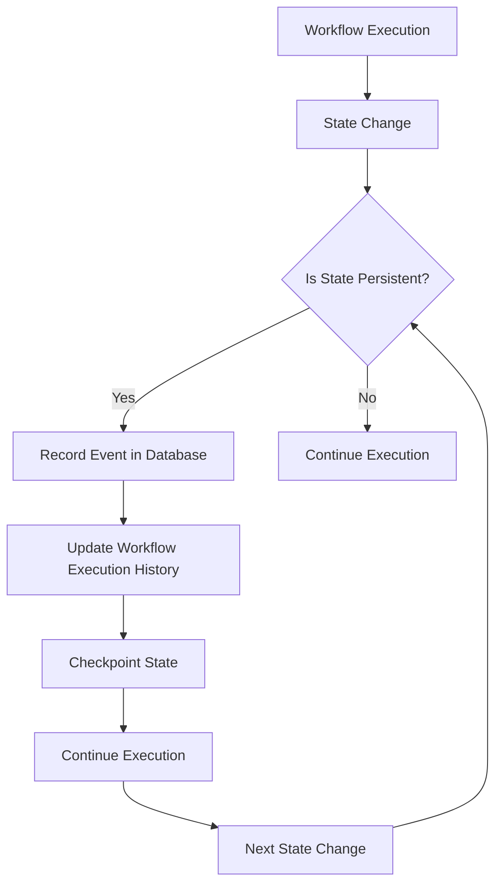
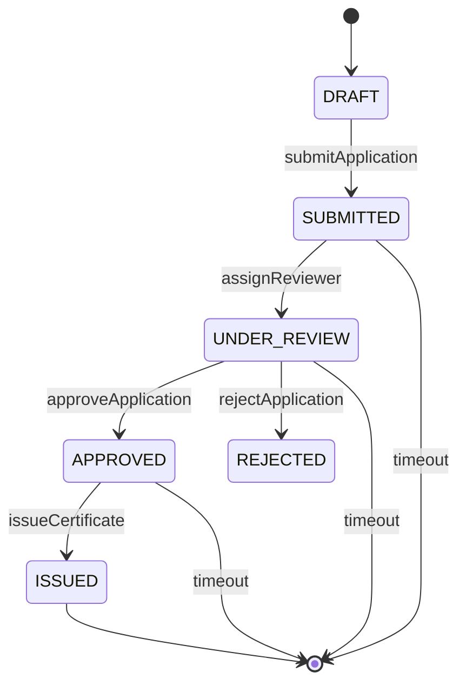
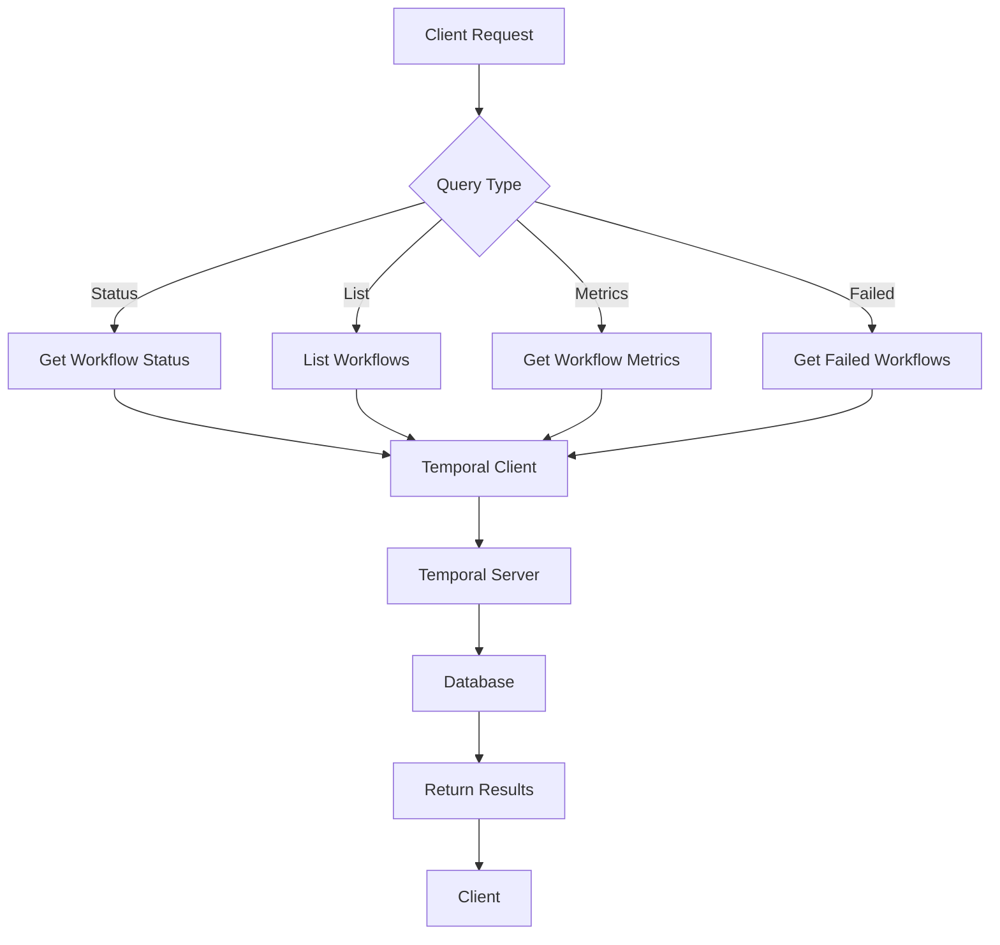
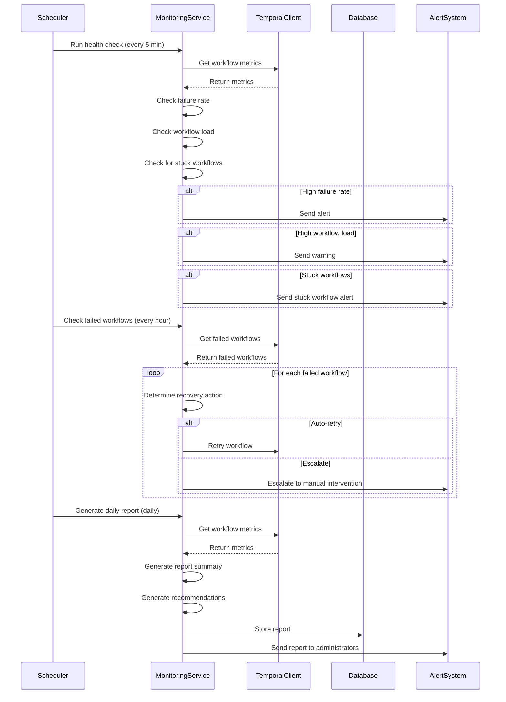
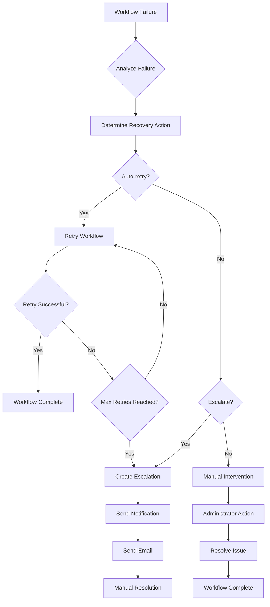
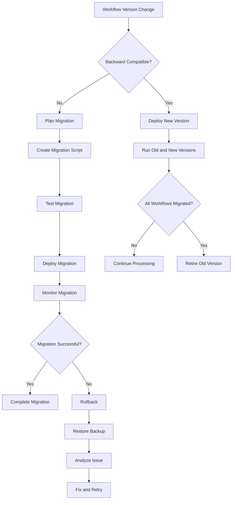
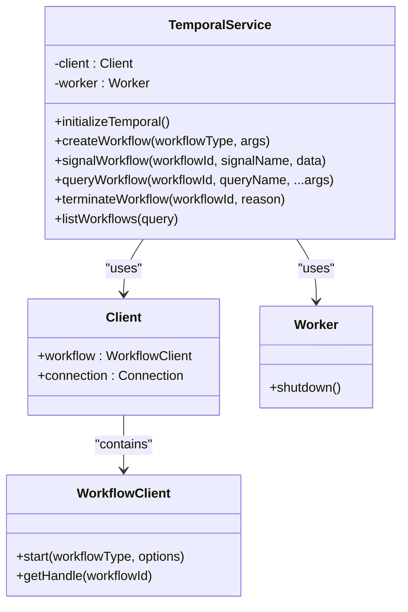
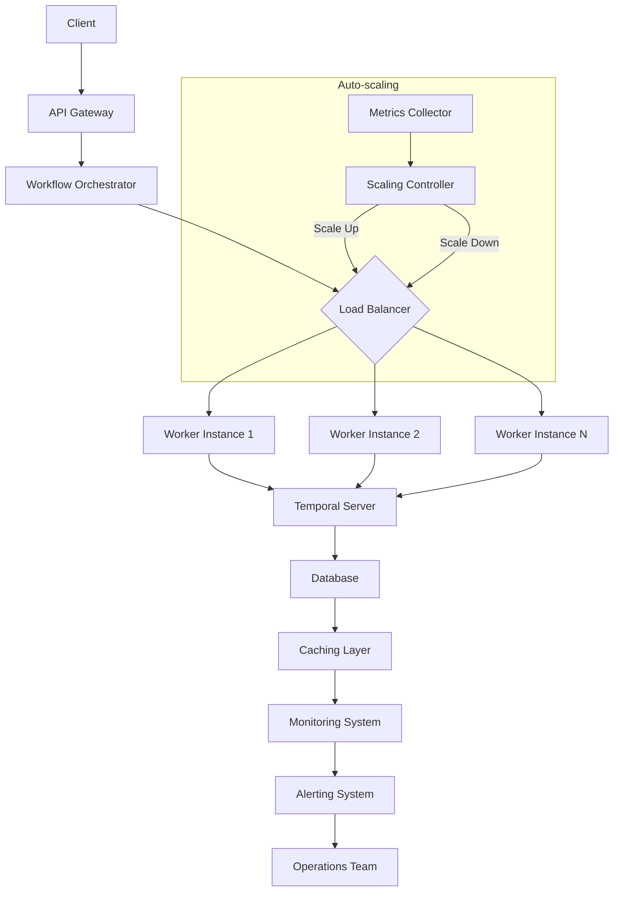

# State Management

<cite>
**Referenced Files in This Document**   
- [temporal.service.ts](file://apps/backend/src/modules/temporal/temporal.service.ts)
- [workflow-monitoring.service.ts](file://apps/backend/src/modules/temporal/workflow-monitoring.service.ts)
- [workflow-orchestrator.service.ts](file://apps/backend/src/modules/temporal/workflow-orchestrator.service.ts)
- [workflow.controller.ts](file://apps/backend/src/modules/temporal/workflow.controller.ts)
- [accu-application-workflows.ts](file://apps/backend/src/modules/temporal/workflows/accu-application/accu-application-workflows.ts)
- [project-workflows.ts](file://apps/backend/src/modules/temporal/workflows/project/project-workflows.ts)
- [document-workflows.ts](file://apps/backend/src/modules/temporal/workflows/document/document-workflows.ts)
- [calendar-workflows.ts](file://apps/backend/src/modules/temporal/workflows/calendar/calendar-workflows.ts)
- [temporal.module.ts](file://apps/backend/src/modules/temporal/temporal.module.ts)
- [temporal.client.ts](file://apps/backend/src/modules/temporal/temporal.client.ts)
- [temporal.worker.ts](file://apps/backend/src/modules/temporal/temporal.worker.ts)
</cite>

## Table of Contents
1. [Introduction](#introduction)
2. [Temporal Workflow State Persistence](#temporal-workflow-state-persistence)
3. [ACCU Application Workflow State Management](#accu-application-workflow-state-management)
4. [State Querying and Monitoring](#state-querying-and-monitoring)
5. [Workflow Monitoring Service](#workflow-monitoring-service)
6. [State Corruption and Recovery](#state-corruption-and-recovery)
7. [State Migration Strategies](#state-migration-strategies)
8. [Integration with Temporal Service](#integration-with-temporal-service)
9. [Performance and Scalability Considerations](#performance-and-scalability-considerations)
10. [Conclusion](#conclusion)

## Introduction
This document provides a comprehensive overview of state management in Temporal workflows within the ACCU platform. It explains how Temporal automatically persists workflow execution state, enabling fault tolerance and support for long-running processes. The document focuses on the ACCU application workflow as a primary example to illustrate state transitions and persistence mechanisms. It covers how state is managed across workflow executions using workflow info, search attributes, and custom state objects stored in the workflow context. The document also details how the workflow-monitoring.service.ts exposes state for external tracking and debugging, including querying workflow state, handling state corruption, and implementing state migration strategies.

**Section sources**
- [temporal.service.ts](file://apps/backend/src/modules/temporal/temporal.service.ts#L1-L126)
- [workflow-monitoring.service.ts](file://apps/backend/src/modules/temporal/workflow-monitoring.service.ts#L1-L509)

## Temporal Workflow State Persistence
Temporal automatically persists the state of workflows, ensuring fault tolerance and enabling long-running processes that can span days, weeks, or even months. The platform leverages Temporal's built-in state management capabilities to maintain workflow execution state across failures and system restarts. When a workflow is executed, Temporal records the state after each significant operation, creating a durable execution history that can be used to reconstruct the workflow's state at any point.

The state persistence mechanism works by recording events in a distributed database, which serves as the source of truth for workflow execution. Each workflow execution is assigned a unique workflow ID, and all state changes are recorded as events associated with this ID. This event-sourcing approach allows Temporal to replay the workflow execution history to restore the state when needed, such as after a worker process failure or system restart.

Workflow state is persisted at key decision points and after the completion of activities. This includes state changes resulting from signals, queries, and the completion of asynchronous operations. The persistence is transparent to the workflow implementation, as Temporal handles the state management automatically. This allows developers to write workflows using synchronous programming patterns while benefiting from the fault tolerance and durability provided by the underlying Temporal infrastructure.

The state persistence mechanism also supports long-running workflows by checkpointing the state periodically. This prevents the need to replay the entire execution history when resuming a workflow, improving performance and reducing resource consumption. The checkpointing frequency can be configured based on the workflow's requirements and the criticality of the operations being performed.

**Diagram sources**
- [temporal.service.ts](file://apps/backend/src/modules/temporal/temporal.service.ts#L1-L126)
- [workflow-monitoring.service.ts](file://apps/backend/src/modules/temporal/workflow-monitoring.service.ts#L1-L509)

**Section sources**
- [temporal.service.ts](file://apps/backend/src/modules/temporal/temporal.service.ts#L1-L126)
- [workflow-monitoring.service.ts](file://apps/backend/src/modules/temporal/workflow-monitoring.service.ts#L1-L509)

## ACCU Application Workflow State Management
The ACCU application workflow demonstrates a comprehensive state management implementation using Temporal's capabilities. The workflow manages the lifecycle of ACCU applications through various states, from draft to issuance of certificates. The state is represented by the AccuApplicationWorkflowState interface, which contains properties for tracking the application's status, submission date, review start date, approval date, issued date, deadline date, reviewer ID, approver ID, rejection reason, metadata, and history.

The workflow defines several signals that trigger state transitions, including submitApplication, assignReviewer, approveApplication, rejectApplication, issueCertificate, and updateMetadata. Each signal handler updates the workflow state accordingly and persists the changes through database operations. For example, when the submitApplication signal is received, the workflow transitions from DRAFT to SUBMITTED status, sets the submission date, creates a review deadline, and updates the database with the new state.

The workflow also implements timeout handling to manage scenarios where state transitions do not occur within expected timeframes. For instance, if a submitted application is not assigned to a reviewer within 14 days, the workflow can automatically escalate the issue or take other predefined actions. Similarly, if an approved application is not issued within 3 days, the workflow can automatically issue the certificate to prevent delays.

Custom state objects are stored in the workflow context, allowing the workflow to maintain complex state information across executions. The state object includes a history array that records all significant events and state changes, providing an audit trail of the workflow's execution. This history is used for debugging, monitoring, and compliance purposes, as it provides a complete record of all actions taken during the workflow's lifecycle.

**Diagram sources**
- [accu-application-workflows.ts](file://apps/backend/src/modules/temporal/workflows/accu-application/accu-application-workflows.ts#L50-L388)

**Section sources**
- [accu-application-workflows.ts](file://apps/backend/src/modules/temporal/workflows/accu-application/accu-application-workflows.ts#L50-L388)

## State Querying and Monitoring
Temporal provides robust mechanisms for querying workflow state, allowing external systems to monitor and interact with running workflows. The platform implements a comprehensive state querying system through the workflow-orchestrator.service.ts and workflow-monitoring.service.ts services. These services expose endpoints that allow clients to retrieve the current state of workflows, including their status, progress, and detailed information about specific workflow instances.

The workflow-orchestrator.service.ts service provides methods for retrieving workflow status, listing workflows, and terminating workflows. The getWorkflowStatus method queries the Temporal client for information about a specific workflow instance, returning details such as the workflow ID, status, type, start time, close time, and history length. The listWorkflows method allows querying multiple workflows based on various criteria, such as workflow type or status.

The workflow-monitoring.service.ts service extends these capabilities with additional monitoring features. It provides methods for retrieving workflow metrics, such as the total number of workflows, running workflows, completed workflows, failed workflows, and terminated workflows. It also calculates average execution time and provides distribution information for workflow types and statuses. This information is used to generate comprehensive reports and alerts for system administrators and operations teams.

The platform also implements search attributes to facilitate efficient querying of workflow state. These attributes include workflow type, status, start time, close time, and custom metadata. By indexing these attributes, the system can quickly retrieve workflows that match specific criteria, enabling efficient monitoring and troubleshooting. For example, administrators can quickly find all failed workflows or all workflows that have been running for more than 24 hours.

**Diagram sources**
- [workflow-orchestrator.service.ts](file://apps/backend/src/modules/temporal/workflow-orchestrator.service.ts#L1-L442)
- [workflow-monitoring.service.ts](file://apps/backend/src/modules/temporal/workflow-monitoring.service.ts#L1-L509)

**Section sources**
- [workflow-orchestrator.service.ts](file://apps/backend/src/modules/temporal/workflow-orchestrator.service.ts#L1-L442)
- [workflow-monitoring.service.ts](file://apps/backend/src/modules/temporal/workflow-monitoring.service.ts#L1-L509)

## Workflow Monitoring Service
The workflow-monitoring.service.ts service provides comprehensive monitoring capabilities for Temporal workflows in the ACCU platform. This service is responsible for tracking workflow execution, detecting issues, and providing alerts and reports to system administrators. It implements scheduled monitoring tasks that run at regular intervals to check the health of workflows and identify potential problems.

The service includes a cron job that runs every 5 minutes to monitor workflow health. This job checks for concerning metrics, such as a high failure rate (more than 10% of workflows failing) or a high number of running workflows (more than 100). If these thresholds are exceeded, the service generates alerts to notify the operations team. It also checks for stuck workflows, which are workflows that have been running for more than 24 hours without completing. When stuck workflows are detected, the service can automatically escalate the issue or take other predefined actions.

Another cron job runs every hour to check for failed workflows that require attention. This job retrieves all failed workflows and determines the appropriate recovery action based on the workflow type and failure reason. For certain types of failures, such as transient failures in document or notification workflows, the service can automatically retry the workflow. For more critical workflows, such as ACCU application or project workflows, the service escalates the issue to manual intervention.

A daily cron job generates a comprehensive workflow report that summarizes the previous day's workflow activity. This report includes metrics such as the total number of workflows, running workflows, completed workflows, and failed workflows. It also provides a summary of the day's activity and recommendations for improving workflow performance and reliability. The report is sent to administrators to help them monitor system health and identify trends over time.

The service also provides an API for manual intervention in workflows. This allows administrators to retry failed workflows, escalate issues, or perform other actions to resolve problems. The API includes methods for retrying failed workflows, escalating failed workflows to higher levels of management, and performing manual interventions such as sending signals or querying workflow state.

**Diagram sources**
- [workflow-monitoring.service.ts](file://apps/backend/src/modules/temporal/workflow-monitoring.service.ts#L1-L509)

**Section sources**
- [workflow-monitoring.service.ts](file://apps/backend/src/modules/temporal/workflow-monitoring.service.ts#L1-L509)

## State Corruption and Recovery
The ACCU platform implements robust mechanisms for handling state corruption and recovering from workflow failures. State corruption can occur due to various factors, such as database inconsistencies, network issues, or bugs in the workflow implementation. The platform uses a combination of automated recovery strategies and manual intervention capabilities to address these issues and ensure the integrity of workflow state.

When a workflow fails, the system captures detailed information about the failure, including the error message, the current state of the workflow, and the execution history. This information is used to determine the appropriate recovery action. The workflow-monitoring.service.ts service includes a determineRecoveryAction method that analyzes the failed workflow and selects the most appropriate recovery strategy based on the workflow type and failure reason.

For certain types of failures, such as transient failures in document or notification workflows, the system can automatically retry the workflow. This is implemented through the retryFailedWorkflow method, which terminates the failed workflow and restarts it with the same ID. The retry process includes incrementing a retry counter and recording the retry attempt in the workflow history. If a workflow fails repeatedly, the system will eventually escalate the issue to manual intervention to prevent infinite retry loops.

For more critical workflows, such as ACCU application or project workflows, the system escalates failed workflows to manual intervention. This is implemented through the escalateFailedWorkflow method, which creates an escalation notification and sends an email to the appropriate recipient based on the escalation level. The escalation process ensures that critical issues are brought to the attention of the appropriate personnel for resolution.

The platform also provides capabilities for manual intervention in workflows through the performManualIntervention method. This allows administrators to perform various actions on workflows, such as sending signals, querying state, or terminating workflows. Manual intervention is useful for resolving complex issues that cannot be handled automatically, such as data inconsistencies or business rule violations.

To prevent state corruption, the platform implements various safeguards, such as input validation, business rule validation, and transactional operations. For example, before approving an ACCU application, the system validates that all required documents have been submitted, the methodology has been validated, and sufficient ACCU units are available. These validations help ensure that the workflow state remains consistent and valid throughout the execution.

**Diagram sources**
- [workflow-monitoring.service.ts](file://apps/backend/src/modules/temporal/workflow-monitoring.service.ts#L1-L509)

**Section sources**
- [workflow-monitoring.service.ts](file://apps/backend/src/modules/temporal/workflow-monitoring.service.ts#L1-L509)

## State Migration Strategies
The ACCU platform implements comprehensive state migration strategies to handle changes in workflow definitions and data structures over time. As the system evolves, workflow definitions may need to be updated to add new features, fix bugs, or improve performance. These changes can affect the workflow state, requiring careful migration to ensure compatibility and data integrity.

The platform uses Temporal's versioning capabilities to manage workflow changes. When a workflow definition is modified, a new version is created, allowing both the old and new versions to coexist. This enables gradual migration of workflows from the old version to the new version, minimizing disruption to ongoing processes. The system can continue to process workflows using the old version while new workflows are created using the updated version.

For backward compatibility, the platform implements data migration strategies that convert state from the old format to the new format. This is particularly important when adding new fields to the workflow state or changing the structure of existing fields. The migration process ensures that workflows created with the old version can be properly handled by the new version, and vice versa when necessary.

The platform also implements forward compatibility by designing workflow state to be extensible. New fields are added as optional properties, allowing older versions of the workflow to ignore them without causing errors. This approach enables the system to evolve without breaking existing workflows, as older versions can safely process workflows with additional fields that they don't understand.

To facilitate state migration, the platform includes tools for analyzing and transforming workflow state. These tools can identify workflows that need to be migrated, apply the necessary transformations, and verify the integrity of the migrated state. The migration process is designed to be idempotent, allowing it to be safely retried if interrupted.

The platform also implements a rollback strategy in case a migration fails or causes unexpected issues. This includes maintaining backups of the original state and implementing a process for reverting to the previous version if necessary. The rollback process is tested regularly to ensure that it can be executed quickly and reliably in case of an emergency.

**Section sources**
- [accu-application-workflows.ts](file://apps/backend/src/modules/temporal/workflows/accu-application/accu-application-workflows.ts#L50-L388)
- [project-workflows.ts](file://apps/backend/src/modules/temporal/workflows/project/project-workflows.ts#L50-L663)
- [document-workflows.ts](file://apps/backend/src/modules/temporal/workflows/document/document-workflows.ts#L41-L681)
- [calendar-workflows.ts](file://apps/backend/src/modules/temporal/workflows/calendar/calendar-workflows.ts#L57-L817)

## Integration with Temporal Service
The ACCU platform integrates with the Temporal service through the temporal.service.ts module, which provides a centralized interface for interacting with the Temporal client and worker. This integration enables the platform to leverage Temporal's workflow orchestration capabilities while maintaining a clean separation of concerns between the application logic and the workflow infrastructure.

The temporal.service.ts module implements the TemporalService class, which is responsible for initializing the Temporal client and worker, and providing methods for creating, signaling, querying, and terminating workflows. The service is implemented as a NestJS provider, allowing it to be easily injected into other components that need to interact with Temporal.

The service initializes the Temporal client with the address and namespace configured in the application's configuration. It also initializes the Temporal worker with the workflows and activities defined in the application. The worker is configured to process tasks from the 'accu-workflows' task queue, ensuring that workflow tasks are properly distributed and processed.

The service provides several methods for interacting with workflows, including createWorkflow, signalWorkflow, queryWorkflow, terminateWorkflow, and listWorkflows. These methods abstract the underlying Temporal API, providing a simpler interface for other components to use. For example, the createWorkflow method takes a workflow type and arguments, and returns the workflow ID, hiding the complexity of the Temporal client's start method.

The integration also includes error handling and logging to ensure that issues with the Temporal service are properly reported and can be diagnosed. The service uses NestJS's Logger to log important events, such as successful initialization of the Temporal client and worker, and errors that occur during workflow operations. This logging helps with monitoring and troubleshooting the integration.

**Diagram sources**
- [temporal.service.ts](file://apps/backend/src/modules/temporal/temporal.service.ts#L1-L126)
- [temporal.client.ts](file://apps/backend/src/modules/temporal/temporal.client.ts#L1-L22)
- [temporal.worker.ts](file://apps/backend/src/modules/temporal/temporal.worker.ts#L1-L24)

**Section sources**
- [temporal.service.ts](file://apps/backend/src/modules/temporal/temporal.service.ts#L1-L126)
- [temporal.client.ts](file://apps/backend/src/modules/temporal/temporal.client.ts#L1-L22)
- [temporal.worker.ts](file://apps/backend/src/modules/temporal/temporal.worker.ts#L1-L24)

## Performance and Scalability Considerations
The ACCU platform's state management implementation in Temporal workflows is designed with performance and scalability in mind. The system handles a large number of concurrent workflows while maintaining responsiveness and reliability. Several strategies are employed to ensure optimal performance and scalability, including efficient state persistence, parallel processing, and resource management.

The platform leverages Temporal's distributed architecture to scale horizontally. Multiple worker instances can be deployed to process workflow tasks in parallel, distributing the load across multiple servers. The worker configuration includes settings for the maximum number of concurrent workflow task pollers, activity task pollers, workflow task executions, and activity task executions, allowing fine-tuning of resource usage based on the system's capacity.

State persistence is optimized to minimize the impact on performance. Temporal's event-sourcing approach ensures that only state changes are recorded, reducing the amount of data that needs to be written to the database. The system also uses efficient data structures and indexing to enable fast querying of workflow state, even with a large number of workflows.

The platform implements caching strategies to reduce the load on the Temporal server and database. Frequently accessed workflow state is cached in memory, reducing the need for repeated queries. The cache is invalidated when workflow state changes, ensuring that clients always receive up-to-date information.

To handle peak loads, the platform includes auto-scaling capabilities that can dynamically adjust the number of worker instances based on the current workload. This ensures that the system can handle sudden increases in workflow creation or processing without degradation in performance.

The system also includes monitoring and alerting to detect performance issues and capacity constraints. Metrics such as workflow execution time, queue length, and error rates are continuously monitored, and alerts are generated when thresholds are exceeded. This allows the operations team to proactively address performance issues before they impact users.

**Diagram sources**
- [temporal.service.ts](file://apps/backend/src/modules/temporal/temporal.service.ts#L1-L126)
- [workflow-orchestrator.service.ts](file://apps/backend/src/modules/temporal/workflow-orchestrator.service.ts#L1-L442)
- [temporal.worker.ts](file://apps/backend/src/modules/temporal/temporal.worker.ts#L1-L24)

**Section sources**
- [temporal.service.ts](file://apps/backend/src/modules/temporal/temporal.service.ts#L1-L126)
- [workflow-orchestrator.service.ts](file://apps/backend/src/modules/temporal/workflow-orchestrator.service.ts#L1-L442)
- [temporal.worker.ts](file://apps/backend/src/modules/temporal/temporal.worker.ts#L1-L24)

## Conclusion
The ACCU platform's implementation of state management in Temporal workflows demonstrates a robust and scalable approach to handling long-running processes with fault tolerance. By leveraging Temporal's automatic state persistence, the platform ensures that workflow execution state is maintained across failures and system restarts, enabling reliable processing of critical business operations.

The state management system is centered around the ACCU application workflow, which illustrates how complex state transitions can be managed through well-defined signals and queries. Custom state objects stored in the workflow context provide a flexible way to maintain detailed information about workflow execution, while the history array serves as an audit trail for compliance and debugging purposes.

The integration with the workflow-monitoring.service.ts exposes workflow state for external tracking and debugging, enabling comprehensive monitoring and alerting. The system's ability to query workflow state, handle state corruption, and implement state migration strategies ensures that the platform can evolve over time while maintaining data integrity.

Performance and scalability are addressed through horizontal scaling, efficient state persistence, caching, and auto-scaling capabilities. The system is designed to handle a large number of concurrent workflows while maintaining responsiveness and reliability.

Overall, the state management implementation in the ACCU platform provides a solid foundation for building reliable, scalable, and maintainable workflow-based applications. By following best practices and leveraging the capabilities of the Temporal framework, the platform delivers a robust solution for managing complex business processes with confidence.

[No sources needed since this section summarizes without analyzing specific files]