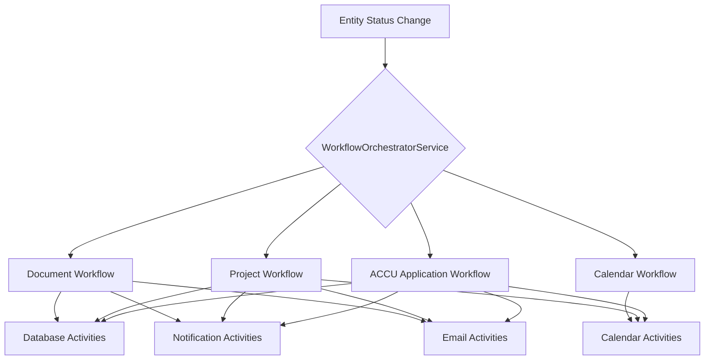
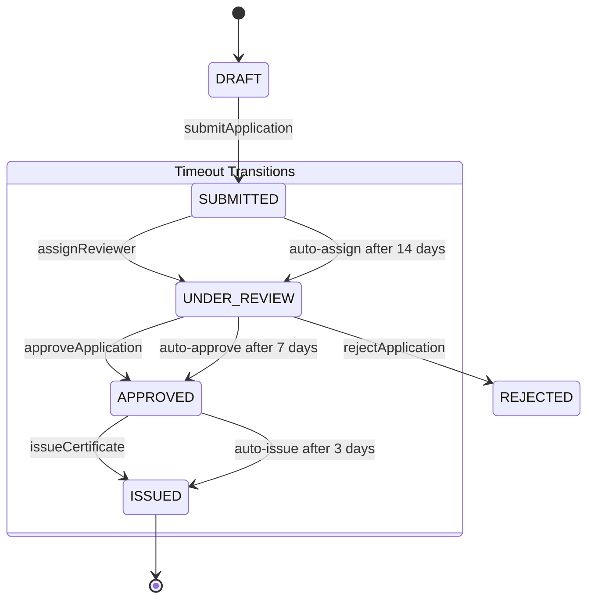
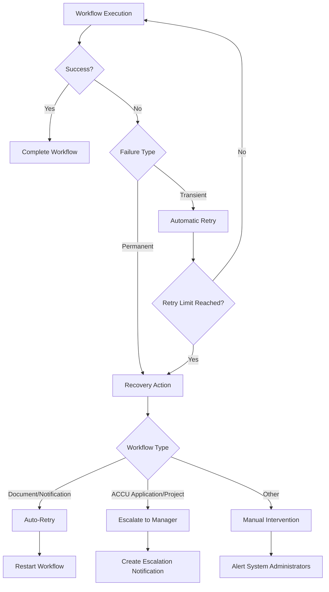
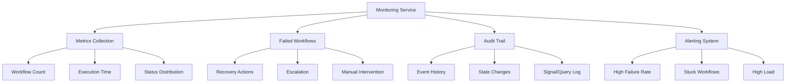
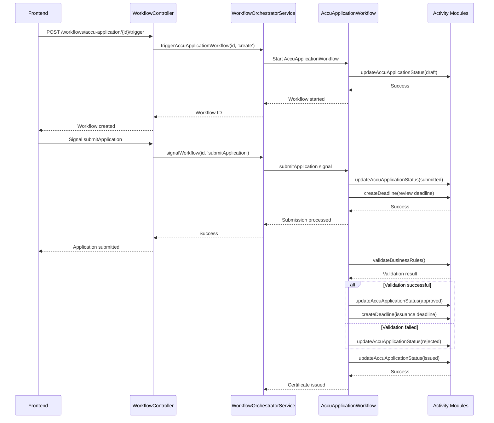

# Workflow Engine (Temporal)

<cite>
**Referenced Files in This Document**   
- [temporal.module.ts](file://apps/backend/src/modules/temporal/temporal.module.ts)
- [temporal.service.ts](file://apps/backend/src/modules/temporal/temporal.service.ts)
- [workflow-orchestrator.service.ts](file://apps/backend/src/modules/temporal/workflow-orchestrator.service.ts)
- [workflow-monitoring.service.ts](file://apps/backend/src/modules/temporal/workflow-monitoring.service.ts)
- [workflow.controller.ts](file://apps/backend/src/modules/temporal/workflow.controller.ts)
- [accu-application-workflows.ts](file://apps/backend/src/modules/temporal/workflows/accu-application/accu-application-workflows.ts)
- [project-workflows.ts](file://apps/backend/src/modules/temporal/workflows/project/project-workflows.ts)
- [document-workflows.ts](file://apps/backend/src/modules/temporal/workflows/document/document-workflows.ts)
- [database-activities.ts](file://apps/backend/src/modules/temporal/activities/database-activities.ts)
- [notification-activities.ts](file://apps/backend/src/modules/temporal/activities/notification-activities.ts)
- [email-activities.ts](file://apps/backend/src/modules/temporal/activities/email-activities.ts)
- [calendar-activities.ts](file://apps/backend/src/modules/temporal/activities/calendar-activities.ts)
</cite>

## Table of Contents
1. [Introduction](#introduction)
2. [Workflow Orchestration](#workflow-orchestration)
3. [Activity Implementation](#activity-implementation)
4. [State Management](#state-management)
5. [Error Handling and Retries](#error-handling-and-retries)
6. [Monitoring and Debugging](#monitoring-and-debugging)
7. [ACCU Application Lifecycle Workflow](#accu-application-lifecycle-workflow)
8. [Public Interfaces and Parameters](#public-interfaces-and-parameters)

## Introduction

The Temporal workflow engine in the ACCU Platform provides a robust system for orchestrating complex business processes across different modules. This documentation explains the implementation details of the workflow orchestration system, including workflow orchestration, activity implementation, state management, error handling and retries, and monitoring and debugging capabilities.

The Temporal engine enables the ACCU Platform to manage long-running business processes with guaranteed reliability, handling failures and retries automatically while maintaining consistent state. It orchestrates workflows across various domains including ACCU applications, projects, documents, and calendar events, ensuring that business processes are executed reliably and can be monitored and debugged effectively.

**Section sources**
- [temporal.service.ts](file://apps/backend/src/modules/temporal/temporal.service.ts#L1-L126)
- [workflow-orchestrator.service.ts](file://apps/backend/src/modules/temporal/workflow-orchestrator.service.ts#L1-L442)

## Workflow Orchestration

The Temporal workflow orchestration system in the ACCU Platform is designed to coordinate complex business processes across different modules. The orchestration architecture follows a microservices pattern where workflows are defined as stateful processes that coordinate activities across various domain boundaries.

The core orchestration is handled by the `WorkflowOrchestratorService`, which acts as the central coordinator for all workflow operations. This service provides methods to trigger workflows for different entity types including ACCU applications, projects, documents, and calendar events. The orchestration follows an event-driven architecture where status changes in entities automatically trigger appropriate workflows.

**Diagram sources**
- [workflow-orchestrator.service.ts](file://apps/backend/src/modules/temporal/workflow-orchestrator.service.ts#L37-L327)
- [temporal.service.ts](file://apps/backend/src/modules/temporal/temporal.service.ts#L69-L115)

The orchestration system supports both synchronous and asynchronous workflow execution. Workflows can be triggered immediately or scheduled for future execution based on business requirements. The system also supports workflow chaining, where the completion of one workflow can trigger the start of another, enabling complex multi-step processes.

**Section sources**
- [workflow-orchestrator.service.ts](file://apps/backend/src/modules/temporal/workflow-orchestrator.service.ts#L37-L327)
- [temporal.service.ts](file://apps/backend/src/modules/temporal/temporal.service.ts#L69-L115)

## Activity Implementation

Activities in the Temporal workflow engine represent the individual tasks that make up a workflow. The ACCU Platform implements activities as modular, reusable components that perform specific operations across different domains.

The activity implementation follows a clean separation of concerns, with distinct activity modules for different functional areas:

- **Database Activities**: Handle data persistence operations including updating entity statuses, creating workflow history entries, and validating business rules
- **Notification Activities**: Manage communication through various channels including email, SMS, push notifications, and in-app notifications
- **Email Activities**: Specialized activities for sending transactional emails with templates and bulk email operations
- **Calendar Activities**: Handle deadline management, event scheduling, and calendar integration

```mermaid
classDiagram
class DatabaseActivities {
+updateAccuApplicationStatus(id, status, metadata)
+updateProjectStatus(id, status, metadata)
+updateDocumentStatus(id, status, metadata)
+createCalendarEvent(projectId, title, description, dueDate, eventType)
+logWorkflowEvent(workflowId, eventType, details)
+createWorkflowHistoryEntry(workflowId, step, status, data)
+validateBusinessRules(entityType, entityId, rules)
}
class NotificationActivities {
+sendEmail(recipient, subject, body, templateId)
+sendSMS(phoneNumber, message)
+sendPushNotification(userId, title, body, data)
+createInAppNotification(userId, title, message, type, metadata)
+scheduleReminder(userId, title, message, scheduledTime, reminderType)
}
class EmailActivities {
+sendAccuApplicationStatusUpdate(email, applicationId, oldStatus, newStatus)
+sendProjectDeadlineReminder(email, projectId, projectName, deadlineDate)
+sendDocumentApprovalRequest(approverEmail, documentId, documentName, requesterName)
+sendWorkflowAlert(recipients, workflowType, workflowId, alertType, message)
}
class CalendarActivities {
+createDeadline(projectId, title, description, dueDate, priority, assignedToId)
+scheduleReminder(eventId, reminderType, reminderTime, message)
+updateDeadlineStatus(eventId, status, completedBy)
+createRecurringDeadline(projectId, title, description, recurringPattern, assignedToId)
+escalateOverdueDeadline(eventId, escalationLevel)
}
DatabaseActivities --> "1" WorkflowOrchestratorService
NotificationActivities --> "1" WorkflowOrchestratorService
EmailActivities --> "1" WorkflowOrchestratorService
CalendarActivities --> "1" WorkflowOrchestratorService
```

**Diagram sources**
- [database-activities.ts](file://apps/backend/src/modules/temporal/activities/database-activities.ts#L3-L13)
- [notification-activities.ts](file://apps/backend/src/modules/temporal/activities/notification-activities.ts#L3-L9)
- [email-activities.ts](file://apps/backend/src/modules/temporal/activities/email-activities.ts#L3-L9)
- [calendar-activities.ts](file://apps/backend/src/modules/temporal/activities/calendar-activities.ts#L3-L10)

Each activity is implemented with appropriate timeout configurations to ensure reliability and prevent workflow stalls. The activities are designed to be idempotent, allowing them to be safely retried in case of failures.

**Section sources**
- [database-activities.ts](file://apps/backend/src/modules/temporal/activities/database-activities.ts#L1-L27)
- [notification-activities.ts](file://apps/backend/src/modules/temporal/activities/notification-activities.ts#L1-L19)
- [email-activities.ts](file://apps/backend/src/modules/temporal/activities/email-activities.ts#L1-L21)
- [calendar-activities.ts](file://apps/backend/src/modules/temporal/activities/calendar-activities.ts#L1-L23)

## State Management

The Temporal workflow engine in the ACCU Platform implements comprehensive state management to track the progress and status of long-running business processes. Each workflow maintains its state in memory during execution, with periodic persistence to ensure durability.

Workflow state is defined as structured interfaces that capture all relevant information about the workflow's progress. For example, the ACCU Application workflow maintains state including:

- Application ID and current status
- Timestamps for key events (submission, review, approval, issuance)
- Metadata and history of state changes
- References to related entities (project, methodology)

**Diagram sources**
- [accu-application-workflows.ts](file://apps/backend/src/modules/temporal/workflows/accu-application/accu-application-workflows.ts#L51-L70)
- [project-workflows.ts](file://apps/backend/src/modules/temporal/workflows/project/project-workflows.ts#L51-L92)

The state management system supports both explicit state transitions through signals and automatic transitions based on timeouts or conditions. Workflows can query their current state and history, enabling rich monitoring and debugging capabilities.

State changes are persisted through database activities that update the corresponding entity records and create audit trail entries. This ensures that the workflow state is always consistent with the application data.

**Section sources**
- [accu-application-workflows.ts](file://apps/backend/src/modules/temporal/workflows/accu-application/accu-application-workflows.ts#L51-L70)
- [project-workflows.ts](file://apps/backend/src/modules/temporal/workflows/project/project-workflows.ts#L51-L92)

## Error Handling and Retries

The Temporal workflow engine in the ACCU Platform implements a comprehensive error handling and retry mechanism to ensure reliability and fault tolerance. The system follows Temporal's built-in retry policies while adding platform-specific recovery strategies.

Workflows are designed to handle both transient and permanent failures. Transient failures (such as temporary network issues) are handled automatically by Temporal's retry mechanisms, while permanent failures trigger recovery workflows.

**Diagram sources**
- [workflow-monitoring.service.ts](file://apps/backend/src/modules/temporal/workflow-monitoring.service.ts#L148-L246)
- [accu-application-workflows.ts](file://apps/backend/src/modules/temporal/workflows/accu-application/accu-application-workflows.ts#L381-L387)

The error handling system includes:

- **Automatic retries**: Configured with exponential backoff for transient failures
- **Timeout handling**: Workflows automatically progress when human actions exceed defined time limits
- **Escalation procedures**: Failed workflows are escalated to appropriate personnel based on severity
- **Manual intervention**: System administrators can perform manual interventions on stuck workflows

The `WorkflowMonitoringService` continuously monitors for failed workflows and applies appropriate recovery actions based on the workflow type and failure context. Certain workflow types (like document processing) are automatically retried, while critical workflows (like ACCU applications) are escalated to human reviewers.

**Section sources**
- [workflow-monitoring.service.ts](file://apps/backend/src/modules/temporal/workflow-monitoring.service.ts#L148-L246)
- [accu-application-workflows.ts](file://apps/backend/src/modules/temporal/workflows/accu-application/accu-application-workflows.ts#L381-L387)

## Monitoring and Debugging

The ACCU Platform provides comprehensive monitoring and debugging capabilities for the Temporal workflow engine through the `WorkflowMonitoringService`. This service offers real-time insights into workflow execution, performance metrics, and failure analysis.

The monitoring system collects and exposes the following metrics:

- **Workflow metrics**: Total, running, completed, failed, and terminated workflows
- **Execution times**: Average execution time for completed workflows
- **Status distribution**: Breakdown of workflows by status
- **Workflow types**: Distribution of workflows by type

**Diagram sources**
- [workflow-monitoring.service.ts](file://apps/backend/src/modules/temporal/workflow-monitoring.service.ts#L61-L113)
- [workflow.controller.ts](file://apps/backend/src/modules/temporal/workflow.controller.ts#L19-L33)

The debugging capabilities include:

- **Workflow audit trail**: Complete history of events, state changes, and signals for any workflow
- **Real-time status queries**: Ability to query the current state of any workflow
- **Manual intervention**: System administrators can send signals, terminate, or query workflows directly
- **Scheduled health checks**: Automated monitoring runs every 5 minutes to detect issues

The system also generates daily reports summarizing workflow performance and provides recommendations for optimization. Critical issues trigger immediate alerts to the operations team.

**Section sources**
- [workflow-monitoring.service.ts](file://apps/backend/src/modules/temporal/workflow-monitoring.service.ts#L61-L113)
- [workflow.controller.ts](file://apps/backend/src/modules/temporal/workflow.controller.ts#L19-L33)

## ACCU Application Lifecycle Workflow

The ACCU Application lifecycle workflow is a key business process orchestrated by the Temporal engine. This workflow manages the complete lifecycle of an ACCU application from creation to certificate issuance.

**Diagram sources**
- [accu-application-workflows.ts](file://apps/backend/src/modules/temporal/workflows/accu-application/accu-application-workflows.ts#L99-L388)
- [workflow-orchestrator.service.ts](file://apps/backend/src/modules/temporal/workflow-orchestrator.service.ts#L38-L76)

The workflow follows these key stages:

1. **Creation**: Application is created in draft status
2. **Submission**: Application is submitted for review with a 14-day review deadline
3. **Review**: Application is reviewed with business rule validation
4. **Approval/Rejection**: Application is approved or rejected
5. **Issuance**: Approved applications result in certificate issuance

The workflow includes timeout handling where applications are automatically approved if not reviewed within 14 days, and certificates are automatically issued if not processed within 3 days of approval.

**Section sources**
- [accu-application-workflows.ts](file://apps/backend/src/modules/temporal/workflows/accu-application/accu-application-workflows.ts#L99-L388)
- [workflow-orchestrator.service.ts](file://apps/backend/src/modules/temporal/workflow-orchestrator.service.ts#L38-L76)

## Public Interfaces and Parameters

The Temporal workflow engine exposes a comprehensive set of public interfaces through the `WorkflowController` and underlying service classes. These interfaces allow external systems to interact with workflows through well-defined operations.

### Workflow Orchestration Operations

**createWorkflow**
- **Parameters**: 
  - workflowType: string (e.g., "AccuApplicationWorkflow")
  - args: any[] (workflow input parameters)
- **Returns**: Promise<string> (workflow ID)
- **Description**: Creates and starts a new workflow instance

**signalWorkflow**
- **Parameters**:
  - workflowId: string
  - signalName: string
  - data: any
- **Returns**: Promise<void>
- **Description**: Sends a signal to an active workflow

**queryWorkflow**
- **Parameters**:
  - workflowId: string
  - queryName: string
  - ...args: any[]
- **Returns**: Promise<T>
- **Description**: Queries the current state of a workflow

### ACCU Application Workflow Operations

**triggerAccuApplicationWorkflow**
- **Parameters**:
  - applicationId: string
  - triggerType: 'create' | 'submit' | 'approve' | 'reject' | 'issue'
- **Returns**: Promise<string> (workflow ID)
- **Description**: Triggers specific actions in the ACCU application workflow

**getAccuApplicationWorkflowStatus**
- **Parameters**:
  - applicationId: string
- **Returns**: Promise<WorkflowStatus>
- **Description**: Retrieves the current status of an ACCU application workflow

### Project Workflow Operations

**triggerProjectWorkflow**
- **Parameters**:
  - projectId: string
  - triggerType: 'create' | 'start' | 'pause' | 'resume' | 'complete' | 'cancel'
- **Returns**: Promise<string> (workflow ID)
- **Description**: Triggers specific actions in the project workflow

### Monitoring Operations

**getWorkflowMetrics**
- **Parameters**: None
- **Returns**: Promise<WorkflowMetrics>
- **Description**: Retrieves aggregate metrics for all workflows

**getFailedWorkflows**
- **Parameters**: None
- **Returns**: Promise<FailedWorkflowRecovery[]>
- **Description**: Retrieves list of failed workflows requiring attention

**retryFailedWorkflow**
- **Parameters**:
  - workflowId: string
  - reason?: string
- **Returns**: Promise<boolean>
- **Description**: Attempts to retry a failed workflow

**escalateFailedWorkflow**
- **Parameters**:
  - workflowId: string
  - escalationLevel: string
  - reason?: string
- **Returns**: Promise<boolean>
- **Description**: Escalates a failed workflow to higher authority

**Section sources**
- [workflow.controller.ts](file://apps/backend/src/modules/temporal/workflow.controller.ts#L19-L346)
- [temporal.service.ts](file://apps/backend/src/modules/temporal/temporal.service.ts#L69-L115)
- [workflow-orchestrator.service.ts](file://apps/backend/src/modules/temporal/workflow-orchestrator.service.ts#L38-L135)