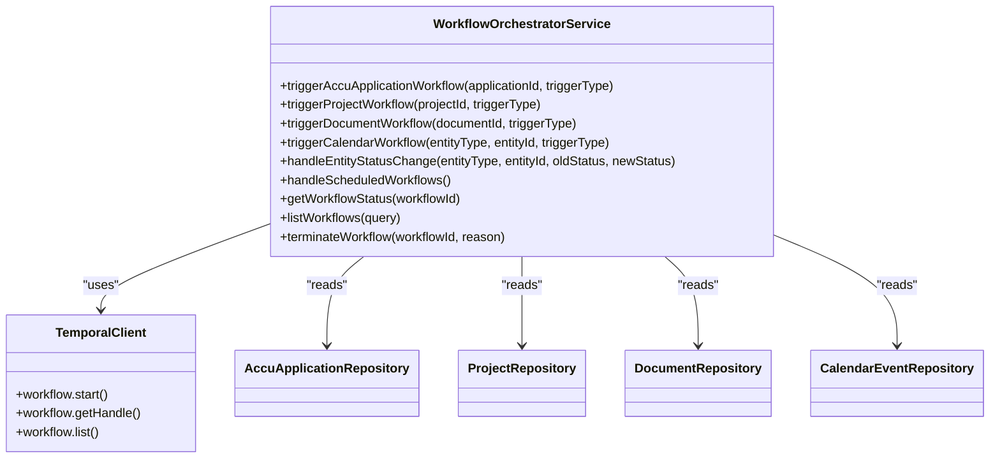
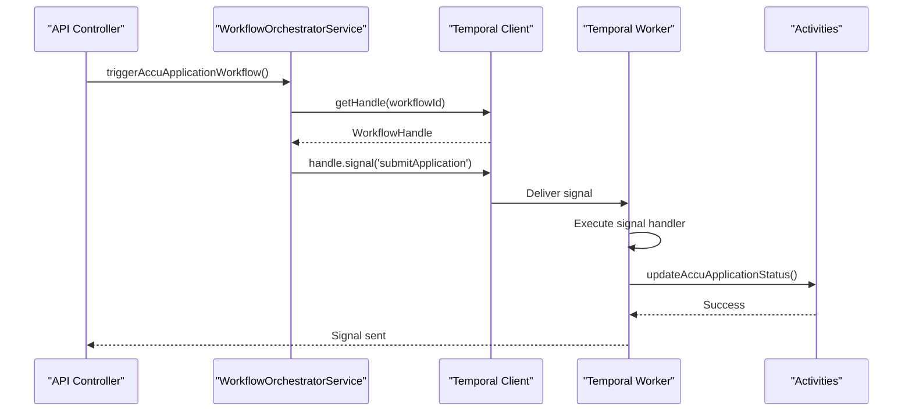
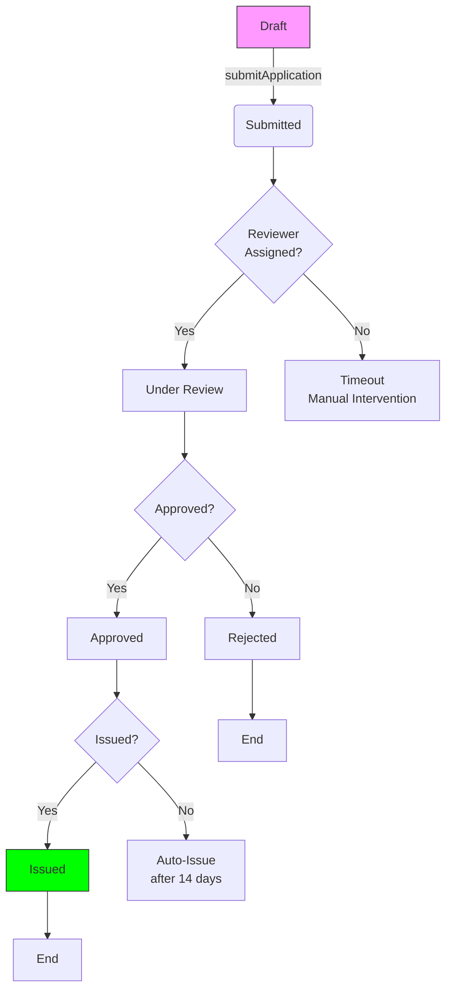
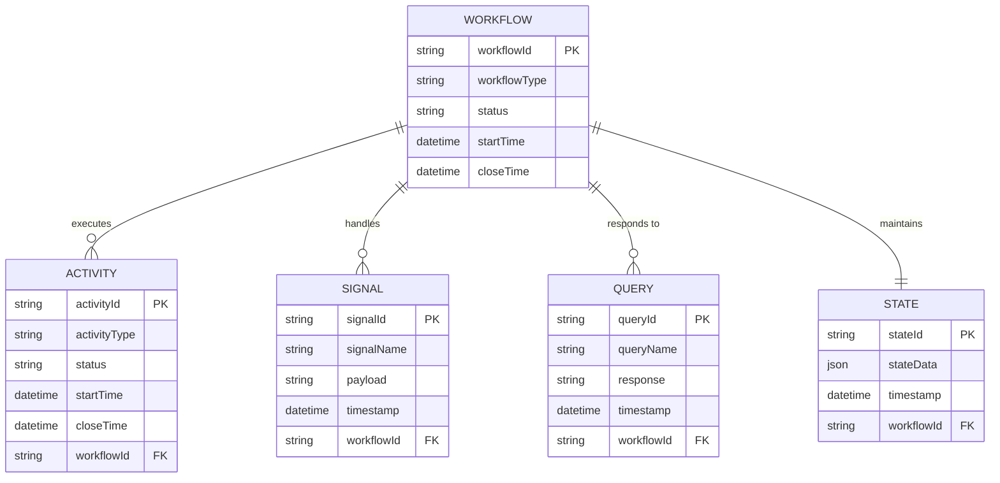
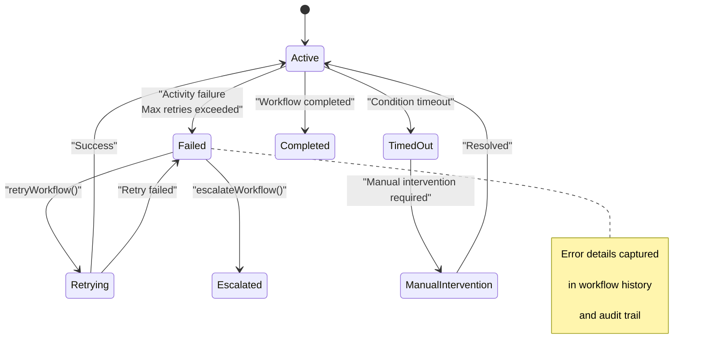

# Workflow Orchestration

<cite>
**Referenced Files in This Document**   
- [workflow-orchestrator.service.ts](file://apps/backend/src/modules/temporal/workflow-orchestrator.service.ts)
- [workflow.controller.ts](file://apps/backend/src/modules/temporal/workflow.controller.ts)
- [temporal.service.ts](file://apps/backend/src/modules/temporal/temporal.service.ts)
- [accu-application-workflows.ts](file://apps/backend/src/modules/temporal/workflows/accu-application/accu-application-workflows.ts)
- [project-workflows.ts](file://apps/backend/src/modules/temporal/workflows/project/project-workflows.ts)
- [document-workflows.ts](file://apps/backend/src/modules/temporal/workflows/document/document-workflows.ts)
- [calendar-workflows.ts](file://apps/backend/src/modules/temporal/workflows/calendar/calendar-workflows.ts)
- [database-activities.ts](file://apps/backend/src/modules/temporal/activities/database-activities.ts)
- [notification-activities.ts](file://apps/backend/src/modules/temporal/activities/notification-activities.ts)
- [email-activities.ts](file://apps/backend/src/modules/temporal/activities/email-activities.ts)
- [calendar-activities.ts](file://apps/backend/src/modules/temporal/activities/calendar-activities.ts)
</cite>

## Table of Contents
1. [Introduction](#introduction)
2. [WorkflowOrchestratorService Architecture](#workfloworchestratorservice-architecture)
3. [Temporal Workflow Implementation](#temporal-workflow-implementation)
4. [ACCU Application Lifecycle Orchestration](#accu-application-lifecycle-orchestration)
5. [Data Flow and Activity Integration](#data-flow-and-activity-integration)
6. [Error Recovery and Monitoring](#error-recovery-and-monitoring)
7. [Scalability and Long-Running Workflows](#scalability-and-long-running-workflows)
8. [Conclusion](#conclusion)

## Introduction
The Temporal workflow orchestration system in the ACCU platform provides a robust framework for managing complex business processes across applications, projects, and documents. This documentation details the implementation of the WorkflowOrchestratorService, which coordinates long-running, stateful workflows using Temporal's TypeScript SDK. The system enables reliable execution of business processes with built-in fault tolerance, state persistence, and monitoring capabilities.

**Section sources**
- [workflow-orchestrator.service.ts](file://apps/backend/src/modules/temporal/workflow-orchestrator.service.ts)

## WorkflowOrchestratorService Architecture
The WorkflowOrchestratorService serves as the central coordination point for all Temporal workflows in the ACCU platform. It provides a unified interface for triggering, monitoring, and managing workflows across different business domains including ACCU applications, projects, documents, and calendar events.

The service implements a factory pattern for workflow creation and signal dispatching, abstracting the underlying Temporal client complexity. It maintains references to entity repositories (AccuApplication, Project, Document, CalendarEvent) to validate workflow context before execution. The service initializes a Temporal client connection during startup, configured through environment variables for address, namespace, and task queue settings.

Workflow execution follows a consistent pattern: entity lookup, workflow handle acquisition, and signal dispatching based on trigger type. The service supports both workflow creation (starting new workflows) and signaling (interacting with existing workflows). Each workflow type follows a naming convention (`accu-application-{id}`, `project-{id}`, etc.) that enables deterministic workflow identification and prevents duplication.

**Diagram sources **
- [workflow-orchestrator.service.ts](file://apps/backend/src/modules/temporal/workflow-orchestrator.service.ts#L11-L442)

**Section sources**
- [workflow-orchestrator.service.ts](file://apps/backend/src/modules/temporal/workflow-orchestrator.service.ts#L11-L442)

## Temporal Workflow Implementation
The Temporal workflow implementation follows the TypeScript SDK patterns for defining stateful, durable workflows. Each workflow module (ACCU application, project, document, calendar) defines its own workflow function with associated signals, queries, and activity proxies.

Workflows are implemented as asynchronous functions that maintain state in memory while appearing to execute linearly. The Temporal runtime handles state persistence, checkpointing, and replay automatically. Each workflow defines a state interface that captures the current state of the business process, including status, timestamps, history, and domain-specific data.

Signal handling is implemented using `setHandler` to register callbacks for specific signal names. These handlers validate preconditions before modifying workflow state and dispatching activities. Query handlers allow external systems to inspect workflow state without modifying it. The workflow logic is structured around condition checks and timeouts that drive state transitions based on signals or time-based triggers.

**Diagram sources **
- [workflow-orchestrator.service.ts](file://apps/backend/src/modules/temporal/workflow-orchestrator.service.ts#L38-L76)
- [accu-application-workflows.ts](file://apps/backend/src/modules/temporal/workflows/accu-application/accu-application-workflows.ts#L73-L388)

**Section sources**
- [workflow-orchestrator.service.ts](file://apps/backend/src/modules/temporal/workflow-orchestrator.service.ts#L38-L442)
- [accu-application-workflows.ts](file://apps/backend/src/modules/temporal/workflows/accu-application/accu-application-workflows.ts#L1-L388)
- [project-workflows.ts](file://apps/backend/src/modules/temporal/workflows/project/project-workflows.ts#L1-L663)
- [document-workflows.ts](file://apps/backend/src/modules/temporal/workflows/document/document-workflows.ts#L1-L681)
- [calendar-workflows.ts](file://apps/backend/src/modules/temporal/workflows/calendar/calendar-workflows.ts#L1-L817)

## ACCU Application Lifecycle Orchestration
The ACCU application lifecycle workflow demonstrates a complete implementation of a business process from draft to issuance. The workflow manages the state transitions of an ACCU application through defined statuses: draft, submitted, under_review, approved, rejected, and issued.

The workflow begins when a new application is created, initializing the workflow state with the application ID, current status, metadata, and empty history. Key signals drive the lifecycle: `submitApplication` transitions from draft to submitted, `assignReviewer` moves to under_review, `approveApplication` sets approved status, and `issueCertificate` completes the process.

The workflow incorporates time-based automation through timeout handling. If a reviewer is not assigned within 14 days of submission, the system logs a timeout event requiring manual intervention. Similarly, if approval is not granted within 7 days of review start, an escalation is triggered. For approved applications, if issuance does not occur within 14 days, the system automatically issues the certificate.

State persistence is achieved through the workflow state object, which maintains all relevant data including submission date, review start date, approval date, deadline date, reviewer ID, approver ID, rejection reason, metadata, and history of state changes. Each state transition is recorded in the history array with timestamp, status, action, performer, and optional notes.

**Diagram sources **
- [accu-application-workflows.ts](file://apps/backend/src/modules/temporal/workflows/accu-application/accu-application-workflows.ts#L99-L388)

**Section sources**
- [accu-application-workflows.ts](file://apps/backend/src/modules/temporal/workflows/accu-application/accu-application-workflows.ts#L50-L388)
- [workflow-orchestrator.service.ts](file://apps/backend/src/modules/temporal/workflow-orchestrator.service.ts#L38-L97)

## Data Flow and Activity Integration
The workflow system integrates with backend services through Temporal activities, which represent units of work that interact with external systems. Activities are defined as interfaces and proxied into workflows using `proxyActivities`, with timeout configurations for reliability.

Three primary activity categories handle different aspects of the business logic:
- **Database activities**: Update entity statuses, create history entries, log events, and validate business rules
- **Notification activities**: Send emails, SMS, push notifications, and create in-app notifications
- **Calendar activities**: Create deadlines, schedule reminders, sync external calendars, and generate reports

Data flows from the workflow orchestrator through the Temporal client to worker processes that execute activities. Each activity call is retried automatically on failure according to Temporal's retry policies. The workflow maintains data consistency by updating its state before and after activity calls, with the Temporal runtime ensuring exactly-once execution semantics.

The integration with the backend API is mediated through the workflow.controller.ts, which exposes REST endpoints for workflow operations. These endpoints validate permissions using NestJS guards and decorators before delegating to the WorkflowOrchestratorService. The controller supports operations for triggering workflows, checking status, listing workflows, and performing manual interventions.

**Diagram sources **
- [database-activities.ts](file://apps/backend/src/modules/temporal/activities/database-activities.ts#L3-L13)
- [notification-activities.ts](file://apps/backend/src/modules/temporal/activities/notification-activities.ts#L3-L9)
- [calendar-activities.ts](file://apps/backend/src/modules/temporal/activities/calendar-activities.ts#L3-L11)
- [workflow.controller.ts](file://apps/backend/src/modules/temporal/workflow.controller.ts#L1-L346)

**Section sources**
- [database-activities.ts](file://apps/backend/src/modules/temporal/activities/database-activities.ts#L1-L27)
- [notification-activities.ts](file://apps/backend/src/modules/temporal/activities/notification-activities.ts#L1-L19)
- [email-activities.ts](file://apps/backend/src/modules/temporal/activities/email-activities.ts#L1-L21)
- [calendar-activities.ts](file://apps/backend/src/modules/temporal/activities/calendar-activities.ts#L1-L23)
- [workflow.controller.ts](file://apps/backend/src/modules/temporal/workflow.controller.ts#L1-L346)

## Error Recovery and Monitoring
The workflow system implements comprehensive error recovery and monitoring mechanisms to ensure reliability and observability. Each workflow execution is inherently fault-tolerant, with the Temporal runtime automatically recovering from failures by replaying the workflow history to restore state.

Error handling is implemented at multiple levels:
- **Workflow-level**: Try-catch blocks around main workflow logic with error logging
- **Activity-level**: Automatic retries with exponential backoff for transient failures
- **System-level**: Monitoring service with metrics, failed workflow tracking, and retry/escalation capabilities

The workflow.controller.ts exposes monitoring endpoints that allow administrators to inspect workflow metrics, retrieve failed workflows, check individual workflow status, and access audit trails. Failed workflows can be retried or escalated through dedicated API endpoints, enabling manual intervention when automated processes cannot resolve issues.

The system implements timeout-based escalation for stalled workflows. For example, if an ACCU application remains in "under_review" status beyond the configured timeout (14 days), the system logs an event and can trigger notifications to supervisors. Similarly, project workflows monitor progress and can auto-pause projects after 30 days of inactivity.

**Diagram sources **
- [workflow.controller.ts](file://apps/backend/src/modules/temporal/workflow.controller.ts#L19-L61)
- [workflow-orchestrator.service.ts](file://apps/backend/src/modules/temporal/workflow-orchestrator.service.ts#L414-L429)
- [accu-application-workflows.ts](file://apps/backend/src/modules/temporal/workflows/accu-application/accu-application-workflows.ts#L381-L387)

**Section sources**
- [workflow.controller.ts](file://apps/backend/src/modules/temporal/workflow.controller.ts#L19-L112)
- [workflow-orchestrator.service.ts](file://apps/backend/src/modules/temporal/workflow-orchestrator.service.ts#L394-L442)
- [temporal.service.ts](file://apps/backend/src/modules/temporal/temporal.service.ts#L96-L115)

## Scalability and Long-Running Workflows
The Temporal-based workflow system is designed for scalability and efficient handling of long-running workflows that may span days, weeks, or months. The architecture separates workflow orchestration from activity execution, allowing independent scaling of workflow workers and activity workers.

Long-running workflows are optimized through several mechanisms:
- **Event-driven execution**: Workflows remain dormant between signals, consuming no resources
- **State checkpointing**: Workflow state is persisted after each event, enabling recovery from failures
- **Time-based triggers**: Built-in sleep and condition functions handle timeouts without active polling
- **Query capabilities**: External systems can inspect workflow state without affecting execution

The system supports workflow versioning through the use of workflow type names and input parameters, allowing backward-compatible changes to workflow logic. Child workflows can be spawned for complex processes, with parent-child relationships managed through Temporal's parent close policy.

For high-throughput scenarios, the system can scale horizontally by adding additional Temporal workers. The task queue configuration allows tuning of poller concurrency and execution limits to match workload characteristics. The listWorkflows endpoint supports query-based filtering to efficiently locate workflows by type, status, or custom attributes.

**Section sources**
- [temporal.service.ts](file://apps/backend/src/modules/temporal/temporal.service.ts#L34-L37)
- [temporal.worker.ts](file://apps/backend/src/modules/temporal/temporal.worker.ts#L13-L21)
- [accu-application-workflows.ts](file://apps/backend/src/modules/temporal/workflows/accu-application/accu-application-workflows.ts#L109-L120)
- [project-workflows.ts](file://apps/backend/src/modules/temporal/workflows/project/project-workflows.ts#L150-L183)

## Conclusion
The Temporal workflow orchestration system provides a robust foundation for managing complex business processes in the ACCU platform. By leveraging Temporal's durable execution model, the system ensures reliable processing of ACCU applications, projects, and documents with built-in fault tolerance, state persistence, and monitoring capabilities.

The WorkflowOrchestratorService abstracts the complexity of Temporal interactions while providing a clean API for triggering and managing workflows. The implementation demonstrates best practices for workflow design, including proper signal handling, state management, error recovery, and integration with external systems through activities.

Future enhancements could include more sophisticated escalation policies, advanced reporting capabilities, and tighter integration with external systems through webhooks and event-driven architectures.