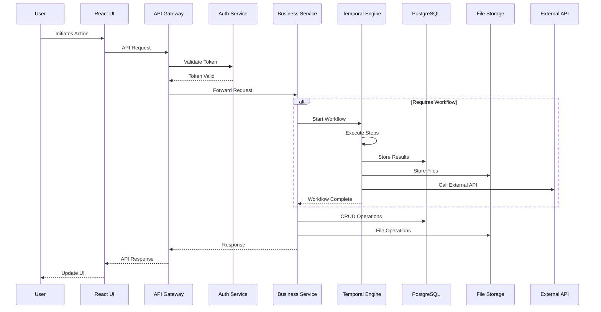
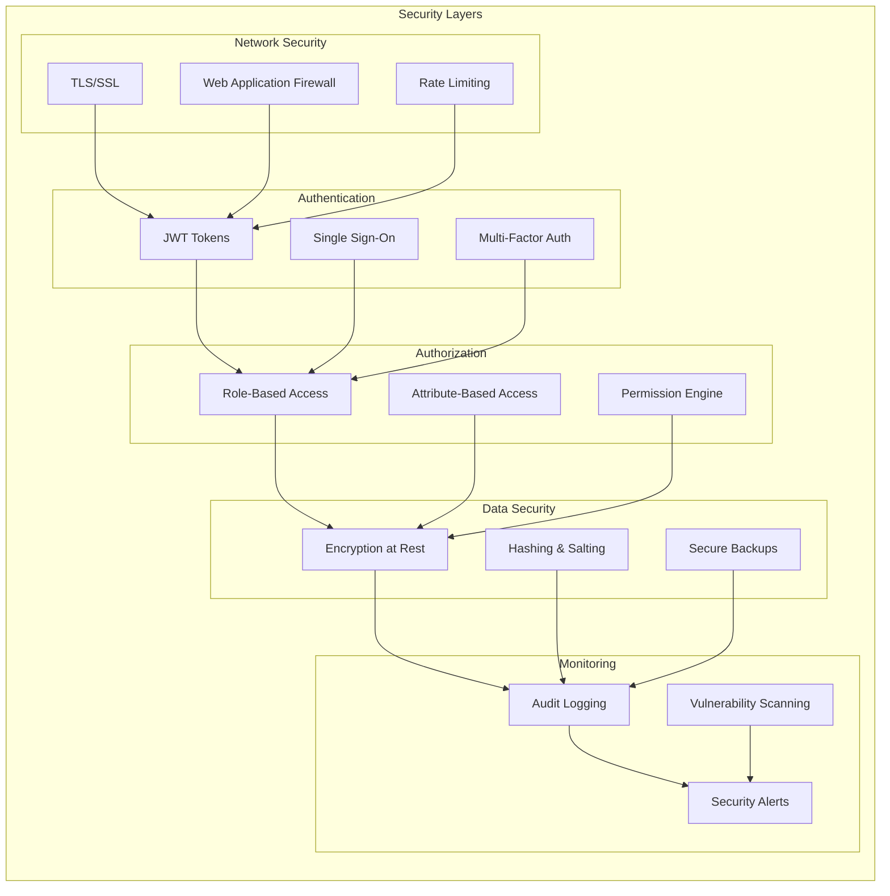
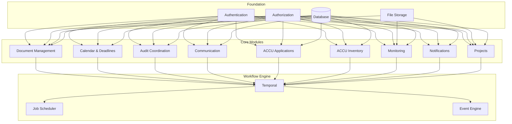
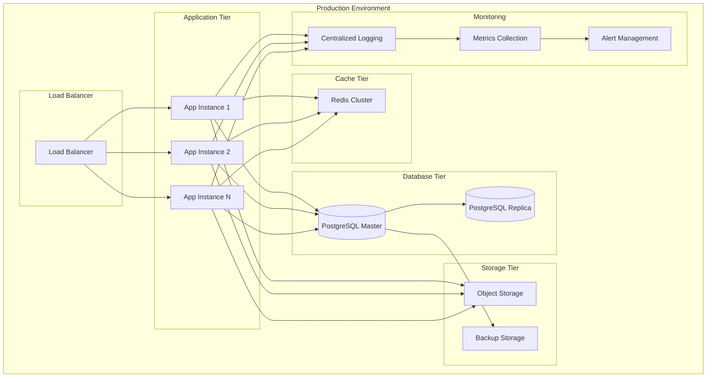

# ACCU Platform Architecture Diagram

## System Architecture Overview

```mermaid
graph TB
    subgraph "Frontend Layer"
        UI[React/Next.js UI]
        RBAC[RBAC Frontend Components]
        DASH[Dashboard & Analytics]
        FORMS[Dynamic Forms]
    end
    
    subgraph "API Gateway Layer"
        GATEWAY[API Gateway<br/>Rate Limiting & Auth]
        AUTH[JWT Authentication]
        RBAC_API[Authorization Service]
    end
    
    subgraph "Core Services Layer"
        subgraph "Business Logic"
            DOCS[Document Service]
            CAL[Calendar Service]
            AUDIT[Audit Service]
            COMM[Communication Service]
            ACCU_APP[ACCU Application Service]
            ACCU_INV[ACCU Inventory Service]
            MON[Monitoring Service]
            NOTIF[Notification Service]
            PROJ[Project Service]
        end
        
        subgraph "Workflow Engine"
            TEMPORAL[Temporal Workflow Engine]
            JOBS[Job Scheduler]
            EVENTS[Event Engine]
        end
        
        subgraph "Data Services"
            FILE[File Storage Service]
            EMAIL[Email Service]
            SEARCH[Search Service]
        end
    end
    
    subgraph "Data Layer"
        DB[(PostgreSQL<br/>System of Record)]
        CACHE[(Redis<br/>Cache & Queues)]
        STORAGE[(S3-Compatible<br/>Object Storage)]
    end
    
    subgraph "External Integrations"
        CER_API[CER API]
        EMAIL_SYS[Email Systems]
        SENSOR[IoT Sensors]
        MARKET[Market Data APIs]
        CALENDAR[Calendar Systems]
    end
    
    subgraph "Infrastructure"
        RAILWAY[Railway Deployment]
        MONITOR[Monitoring & Logging]
        BACKUP[Backup & Recovery]
        SCALE[Auto-scaling]
    end
    
    %% Frontend to Gateway
    UI --> GATEWAY
    RBAC --> GATEWAY
    DASH --> GATEWAY
    FORMS --> GATEWAY
    
    %% Gateway to Services
    GATEWAY --> AUTH
    GATEWAY --> RBAC_API
    GATEWAY --> DOCS
    GATEWAY --> CAL
    GATEWAY --> AUDIT
    GATEWAY --> COMM
    GATEWAY --> ACCU_APP
    GATEWAY --> ACCU_INV
    GATEWAY --> MON
    GATEWAY --> NOTIF
    GATEWAY --> PROJ
    
    %% Service to Workflow
    DOCS --> TEMPORAL
    CAL --> TEMPORAL
    AUDIT --> TEMPORAL
    COMM --> TEMPORAL
    ACCU_APP --> TEMPORAL
    ACCU_INV --> TEMPORAL
    MON --> TEMPORAL
    NOTIF --> TEMPORAL
    PROJ --> TEMPORAL
    
    TEMPORAL --> JOBS
    TEMPORAL --> EVENTS
    
    %% Services to Data
    DOCS --> DB
    DOCS --> STORAGE
    CAL --> DB
    AUDIT --> DB
    COMM --> DB
    COMM --> EMAIL_SYS
    ACCU_APP --> DB
    ACCU_INV --> DB
    MON --> DB
    MON --> SENSOR
    NOTIF --> CACHE
    PROJ --> DB
    
    %% File and Email Services
    FILE --> STORAGE
    EMAIL --> EMAIL_SYS
    SEARCH --> DB
    
    %% External Integrations
    COMM --> CER_API
    MON --> SENSOR
    ACCU_INV --> MARKET
    CAL --> CALENDAR
    
    %% Infrastructure
    GATEWAY --> RAILWAY
    DB --> RAILWAY
    STORAGE --> RAILWAY
    CACHE --> RAILWAY
    
    TEMPORAL --> MONITOR
    JOBS --> MONITOR
    EVENTS --> MONITOR
    
    DB --> BACKUP
    STORAGE --> BACKUP
    
    RAILWAY --> SCALE
```

## Data Flow Architecture

## Security Architecture

## Module Dependencies

## Deployment Architecture

This architecture provides:

1. **Scalability**: Horizontal scaling of application instances
2. **Reliability**: Database replication and backup systems
3. **Security**: Multi-layer security architecture
4. **Performance**: Caching and load balancing
5. **Monitoring**: Comprehensive logging and alerting
6. **Compliance**: Audit trails and secure data handling

The modular design allows for incremental development and deployment, supporting the phased approach outlined in the development backlog.