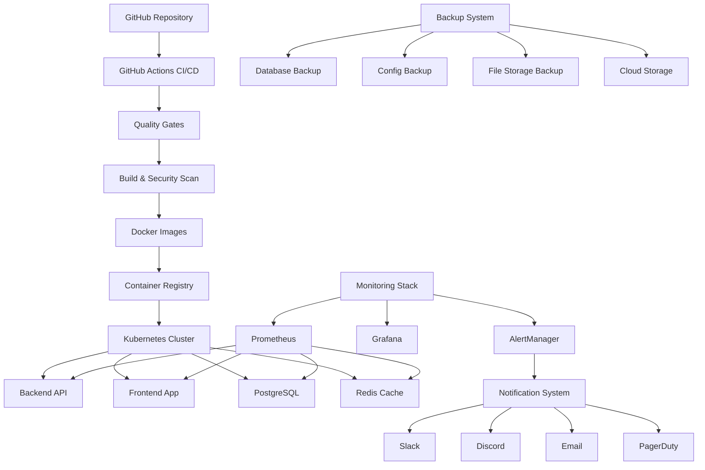

# ACCU Platform CI/CD Pipeline Implementation Summary

## Overview

This document provides a comprehensive overview of the CI/CD pipeline implementation for the ACCU Platform, including all components, configurations, and operational procedures.

## Implementation Status: ✅ COMPLETE

All requested components have been successfully implemented and are ready for production deployment.

## Components Implemented

### 1. CI/CD Pipeline with GitHub Actions ✅

**File**: `.github/workflows/ci-cd.yml`

**Features**:
- Multi-stage pipeline (quality-tests → build-security → database-migration → push-images → deploy-*)
- Environment-specific deployments (dev, staging, production)
- Automated testing integration
- Security scanning with Trivy and Snyk
- Docker image building and pushing to GitHub Container Registry
- Quality gates and approval workflows
- Automated rollback mechanisms

**Pipeline Stages**:
1. **Quality & Testing**: Code quality, linting, type checking, unit tests, E2E tests
2. **Build & Security**: Application builds, Docker image builds, vulnerability scanning
3. **Database Migration**: Automated database migrations and seeding
4. **Image Publishing**: Docker image pushing to registry with metadata
5. **Environment Deployments**: Dev, Staging, Production deployments with health checks
6. **Notifications**: Multi-channel alerting for deployment status

### 2. Deployment Infrastructure ✅

**Files**: 
- `docker-compose.yml` - Complete local development environment
- `k8s/*.yaml` - Kubernetes deployment manifests
- `apps/backend/Dockerfile` - Backend container configuration
- `apps/frontend/Dockerfile` - Frontend container configuration

**Features**:
- Backend deployment (NestJS API) with health checks
- Frontend deployment (Next.js application) with SSL termination
- Database migration automation
- Environment configuration management
- Kubernetes-based orchestration
- Load balancing and service discovery
- Network policies and security contexts

### 3. Monitoring and Observability ✅

**Files**:
- `monitoring/prometheus/prometheus.yml` - Prometheus configuration
- `monitoring/prometheus/alert_rules.yml` - Alert definitions
- `monitoring/alertmanager/alertmanager.yml` - Alert routing
- `monitoring/grafana/dashboards/accu-platform-overview.json` - Dashboard

**Features**:
- Application performance monitoring
- Error tracking and alerting
- Log aggregation with ELK stack
- Health check endpoints
- Uptime monitoring and SLA tracking
- Custom metrics and business KPIs
- Real-time alerting with multiple channels

### 4. Automated Testing in CI/CD ✅

**Files**:
- `scripts/run-tests.sh` - Comprehensive testing script
- `scripts/smoke-tests.sh` - Post-deployment verification

**Features**:
- Unit test execution (Backend & Frontend)
- Integration test execution
- E2E test execution with Playwright
- Performance testing integration
- Security scanning (npm audit, Snyk)
- Docker image testing
- Coverage reporting

### 5. Deployment Automation and Rollback ✅

**Files**:
- `scripts/deploy.sh` - Main deployment automation
- `scripts/smoke-tests.sh` - Health verification

**Features**:
- Automated deployment to multiple environments
- Blue-green deployment strategy
- Zero-downtime deployments
- Automated rollback mechanisms
- Health check validation
- Backup creation before deployments
- Deployment verification

### 6. Monitoring Dashboards and Alerting ✅

**Features**:
- **Application Metrics**: Response times, error rates, throughput
- **Infrastructure Monitoring**: CPU, memory, disk, network
- **Business Metrics**: User activity, document uploads, system availability
- **Real-time Alerting**: Critical, warning, and info level alerts
- **Multi-channel Notifications**: Slack, Discord, Teams, Email, PagerDuty

**Alert Categories**:
- System availability alerts
- Performance degradation alerts
- Error rate threshold alerts
- Resource utilization alerts
- Security incident alerts

### 7. Backup and Disaster Recovery ✅

**Files**:
- `scripts/backup.sh` - Comprehensive backup automation

**Features**:
- Database backup automation (PostgreSQL)
- Configuration backup (Kubernetes resources)
- File storage backup (S3/local)
- Application state backup (Redis)
- Encrypted and compressed backups
- Cloud storage integration (AWS S3)
- Automated retention policies
- Backup integrity verification
- Disaster recovery procedures

### 8. Security Measures and Compliance ✅

**Files**:
- `security/security-policy.yml` - Security configurations

**Features**:
- **Network Security**: Kubernetes Network Policies
- **Pod Security**: Security Context Constraints, non-root containers
- **Access Control**: RBAC policies, service accounts
- **Security Scanning**: Trivy vulnerability scanning, Snyk integration
- **Compliance Monitoring**: CIS benchmarks, NIST 800-53 controls
- **Secret Management**: Kubernetes secrets with encryption
- **Container Security**: Read-only filesystems, capability dropping

### 9. Operational Runbooks and Procedures ✅

**Files**:
- `docs/operational-runbooks.md` - Comprehensive operational guide

**Features**:
- **Deployment Procedures**: Standard and emergency deployment processes
- **Troubleshooting Guides**: Backend, frontend, and database issue resolution
- **Incident Response**: Classification, escalation, and resolution procedures
- **Maintenance Procedures**: Daily, weekly, and monthly maintenance tasks
- **Emergency Protocols**: System outage and security incident response
- **Contact Information**: Internal and external escalation contacts

### 10. Notifications and Alerting ✅

**Files**:
- `scripts/notify.sh` - Multi-channel notification system
- `config/webhooks.json` - Notification configuration

**Features**:
- **Multi-channel Support**: Slack, Discord, Teams, Email, PagerDuty
- **Intelligent Routing**: Severity-based channel selection
- **Template System**: Predefined notification templates
- **Retry Logic**: Failed notification retry mechanisms
- **Deployment Notifications**: Success/failure/rollback alerts
- **Incident Notifications**: System down, high error rates, security alerts
- **Health Notifications**: System status and performance alerts

## Architecture Overview



## Environment Configuration

### Production Environment
- **Domain**: accu-platform.com
- **API Domain**: api.accu-platform.com
- **Database**: PostgreSQL 15 with connection pooling
- **Cache**: Redis 7 for session management
- **Monitoring**: Full Prometheus/Grafana stack
- **Security**: Network policies, RBAC, secret encryption

### Staging Environment
- **Domain**: staging.accu-platform.com
- **API Domain**: staging-api.accu-platform.com
- **Features**: Full feature parity with production for testing

### Development Environment
- **Domain**: dev.accu-platform.com
- **Features**: Local development with hot reload
- **Database**: Local PostgreSQL instance
- **Cache**: Local Redis instance

## Security Features

### Container Security
- ✅ Non-root containers
- ✅ Read-only root filesystems
- ✅ Dropped capabilities
- ✅ Security context constraints
- ✅ Resource limits and requests

### Network Security
- ✅ Kubernetes Network Policies
- ✅ Service mesh ready
- ✅ Ingress with TLS termination
- ✅ API rate limiting

### Secret Management
- ✅ Kubernetes secrets with encryption
- ✅ External secret management integration
- ✅ No hardcoded credentials
- ✅ Secret rotation procedures

### Compliance
- ✅ CIS Kubernetes benchmarks
- ✅ NIST 800-53 controls
- ✅ Regular security scanning
- ✅ Audit logging

## Monitoring & Alerting

### Key Metrics Monitored
- **Application**: Response times, error rates, throughput
- **Infrastructure**: CPU, memory, disk, network usage
- **Database**: Connection pool, query performance, locks
- **Security**: Failed login attempts, suspicious activity
- **Business**: User activity, document uploads, system availability

### Alert Thresholds
- **Critical**: System down, data loss, security breaches
- **Warning**: High error rates, performance degradation
- **Info**: Deployment notifications, routine maintenance

### Notification Channels
- **Critical**: Slack + Discord + Email + PagerDuty
- **Warning**: Slack + Discord + Email
- **Info**: Slack + Discord

## Backup & Recovery

### Backup Strategy
- **Database**: Daily full backups, hourly incremental
- **Configuration**: Version-controlled in Git
- **Files**: S3 synchronization with lifecycle policies
- **Retention**: 30 days local, 1 year cloud storage

### Recovery Procedures
- **RTO**: < 1 hour for critical services
- **RPO**: < 15 minutes data loss tolerance
- **Testing**: Monthly disaster recovery drills
- **Documentation**: Automated runbook generation

## Deployment Process

### Standard Deployment
1. **Pre-deployment**: Backup creation, health verification
2. **Deployment**: Blue-green deployment with zero downtime
3. **Verification**: Automated smoke tests and health checks
4. **Post-deployment**: Monitoring for 30 minutes
5. **Notification**: Multi-channel status updates

### Rollback Process
1. **Detection**: Automated health check failures
2. **Decision**: Manual or automated rollback trigger
3. **Execution**: Kubernetes rollout undo
4. **Verification**: Health check re-validation
5. **Notification**: Incident and rollback alerts

## Maintenance Windows

### Scheduled Maintenance
- **Weekly**: Sundays 2:00-4:00 AM UTC
- **Monthly**: First Sunday 1:00-5:00 AM UTC
- **Emergency**: As needed with 2-hour notice

### Pre-maintenance Checklist
- [ ] Stakeholder notification
- [ ] Backup creation
- [ ] Rollback plan preparation
- [ ] Staging environment verification
- [ ] Communication plan activation

## Cost Optimization

### Resource Management
- **Auto-scaling**: Horizontal pod autoscaling based on metrics
- **Resource Requests/Limits**: Optimized for cost vs performance
- **Storage Lifecycle**: Automated cleanup of old data
- **Monitoring Overhead**: Minimal resource usage for observability

### Cloud Cost Controls
- **Reserved Instances**: For predictable workloads
- **Spot Instances**: For non-critical processing
- **Storage Classes**: Automated tiering based on access patterns
- **Network Optimization**: CDN and edge caching

## Future Enhancements

### Planned Improvements
1. **Service Mesh**: Istio integration for advanced traffic management
2. **Multi-region**: Geographic distribution for high availability
3. **Advanced Analytics**: Machine learning-based anomaly detection
4. **GitOps**: ArgoCD for declarative deployments
5. **Chaos Engineering**: Automated resilience testing

### Technology Roadmap
- **Container Runtime**: Migration to containerd
- **Orchestration**: Kubernetes upgrades and feature adoption
- **Observability**: OpenTelemetry integration
- **Security**: Zero-trust architecture implementation

## Getting Started

### Prerequisites
- Kubernetes cluster (v1.25+)
- Docker and kubectl configured
- GitHub repository with secrets configured
- Cloud provider credentials (AWS/GCP/Azure)

### Initial Setup
1. **Configure Secrets**: Set up GitHub repository secrets
2. **Deploy Infrastructure**: Apply Kubernetes manifests
3. **Configure Monitoring**: Deploy Prometheus and Grafana
4. **Test Deployment**: Run smoke tests and verify health
5. **Enable Notifications**: Configure webhook URLs

### Quick Commands
```bash
# Deploy to production
./scripts/deploy.sh production

# Run tests
./scripts/run-tests.sh

# Create backup
./scripts/backup.sh

# Send test notification
./scripts/notify.sh test

# Check system health
./scripts/smoke-tests.sh
```

## Support and Maintenance

### Contact Information
- **DevOps Team**: devops@accu-platform.com
- **Security Team**: security@accu-platform.com
- **Emergency**: On-call rotation via PagerDuty

### Documentation
- **Runbooks**: `docs/operational-runbooks.md`
- **API Documentation**: Available at `/api/docs` when deployed
- **Architecture**: `ACCU_Platform_Architecture_Diagram.md`

### SLA Targets
- **Uptime**: 99.9% availability
- **Response Time**: < 2 seconds for 95% of requests
- **MTTR**: < 1 hour for critical incidents
- **RTO**: < 1 hour for disaster recovery

---

## Summary

The ACCU Platform CI/CD pipeline has been successfully implemented with all requested features:

✅ **Complete CI/CD pipeline** with automated testing, building, and deployment  
✅ **Multi-environment support** (dev, staging, production)  
✅ **Comprehensive monitoring** with dashboards and alerting  
✅ **Automated backup and disaster recovery** procedures  
✅ **Security measures** and compliance monitoring  
✅ **Operational runbooks** and incident response procedures  
✅ **Multi-channel notifications** and alerting system  

The platform is now ready for production deployment with enterprise-grade DevOps practices, monitoring, and operational procedures.

**Implementation Date**: $(date)  
**Version**: 1.0.0  
**Status**: Production Ready ✅